# Flask勉強会

[](https://msiz07-flask-docs-ja.readthedocs.io/ja/latest/)

> 想定された読者の開発環境: Windows11(管理者権限を自由に行使できるもの)
> 準備済みとして想定されているもの: Visual Studio Code

<details>
  <summary>目次</summary>

- [Flask勉強会](#flask勉強会)
  - [0. この勉強会でできるようになること・ならないこと](#0-この勉強会でできるようになることならないこと)
  - [1. Flask とは](#1-flask-とは)
  - [2. 環境構築](#2-環境構築)
    - [2.1. wslのインストール](#21-wslのインストール)
    - [2.2. Visual Studio Code を WSL 上での開発向けにセットアップする](#22-visual-studio-code-を-wsl-上での開発向けにセットアップする)
    - [2.3. GitHubリポジトリの作成・クローン](#23-githubリポジトリの作成クローン)
    - [2.4. Pythonのセットアップ](#24-pythonのセットアップ)
      - [2.4.1. pyenvのインストール](#241-pyenvのインストール)
      - [2.4.2. Pythonのビルド環境のインストール](#242-pythonのビルド環境のインストール)
      - [2.4.3. Pythonのインストール](#243-pythonのインストール)
      - [2.4.4. VSCodeでリポジトリを開く](#244-vscodeでリポジトリを開く)
      - [2.4.5. venvのセットアップ](#245-venvのセットアップ)
      - [2.4.6. Flaskをインストールする](#246-flaskをインストールする)
  - [3. Flaskを始めよう](#3-flaskを始めよう)
    - [3.0. はじめの一歩](#30-はじめの一歩)
    - [3.1. APIをつくろう](#31-apiをつくろう)
    - [3.2. テンプレートエンジンを使おう](#32-テンプレートエンジンを使おう)
      - [3.2.1. テンプレートを利用したページをクライアントに返そう](#321-テンプレートを利用したページをクライアントに返そう)
      - [3.2.2. テンプレートを継承しよう](#322-テンプレートを継承しよう)
      - [3.2.3. 静的ファイルを利用しよう](#323-静的ファイルを利用しよう)
      - [3.2.4. しりとりしよう](#324-しりとりしよう)
  - [4. 終わりに](#4-終わりに)
  - [4. Azureを使ってデプロイしてみよう](#4-azureを使ってデプロイしてみよう)

</details>

## 0. この勉強会でできるようになること・ならないこと

この勉強会では、以下の内容ができるようになることを目標に作成されています。

- Flask + Jinja Template でSSRしたページを配信できるようになる
- Flaskで静的ファイルを配信できるようになる
- FlaskでREST APIを作成できるようになる
- (延長戦)Azure App Service を使って作ったWebアプリをデプロイする

この勉強会では、以下の内容はできるようになることを想定されていません。

- FlaskとJavaScriptフレームワークを組み合わせた柔軟なwebページは、この内容だけでは作れません
- FlaskでWebSocketを利用してリアルタイム性のあるwebアプリケーションは、この内容だけでは作れません。
- おいしいうどんは、この内容だけでは作れません。

## 1. Flask とは

[Flask](https://msiz07-flask-docs-ja.readthedocs.io/ja/latest/)とは、Pythonで利用可能なウェブアプリケーションフレームワークです。  
テンプレートエンジン[Jinja](https://jinja.palletsprojects.com/en/3.1.x/)とWSGIツールキット[Werkzeug](https://palletsprojects.com/p/werkzeug/)を利用して作成されていて、自身は軽量を謳っています。  
現在Pythonで利用可能な他のウェブアプリケーションフレームワークに[Django](https://docs.djangoproject.com/ja/4.2/)や[FastAPI](https://fastapi.tiangolo.com/ja/)があります。  
今回は筆者の経験値からFlaskを選択していますが、どれかを知っていれば他のどれかを学ぶのは比較的容易でしょう。

## 2. 環境構築

> 想定所要時間: 30分

まずWindows上でPythonを用いたweb開発を行う場合、wslを利用した開発が推奨されています。今回はこれに則ってwslを利用して開発することとします。

### 2.1. wslのインストール

wslのインストール作業のため、タスクバーのWindowsボタンを右クリックして 「ターミナル(管理者)」 を実行してください。(管理者権限が要求されます)  
まず、wslを利用するために必要なWindowsの機能を有効化するため、以下のコマンドを実行してください。(1～2分ほどかかります)  
途中確認ウィンドウが表示された場合は肯定的選択肢を選んで処理を進めてください。

```powershell
wsl --install
```

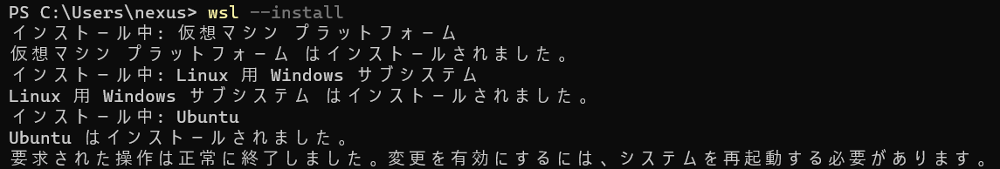

画面に表示された通り、再起動を行います。  
再起動が終了したら先程同様タスクバーのWindowsボタンを右クリックして 「ターミナル(管理者)」 を実行してください。  
これで自動でubuntuのインストールが実行され、↓のような画面が表示されます。

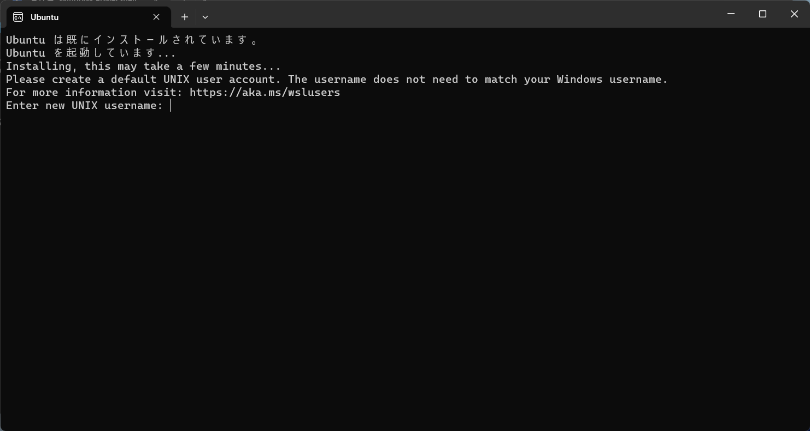

対話型インターフェースでwslの中で利用するユーザー名とパスワードを聞かれるので、指示に沿って設定してください。

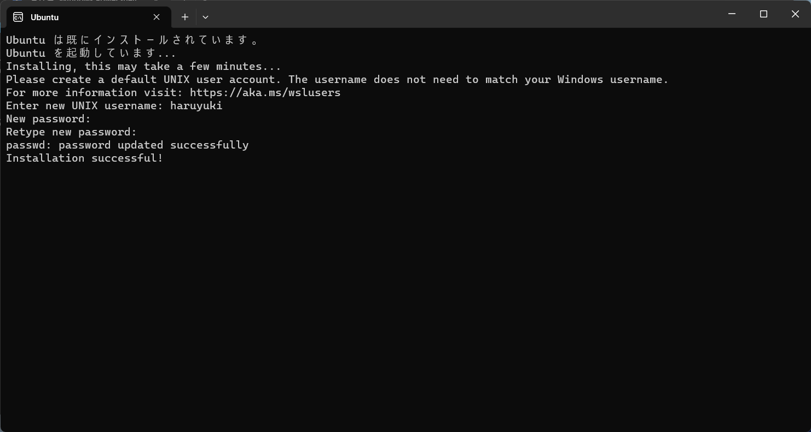

設定して暫く待つとターミナルがubuntuにサインインされます。

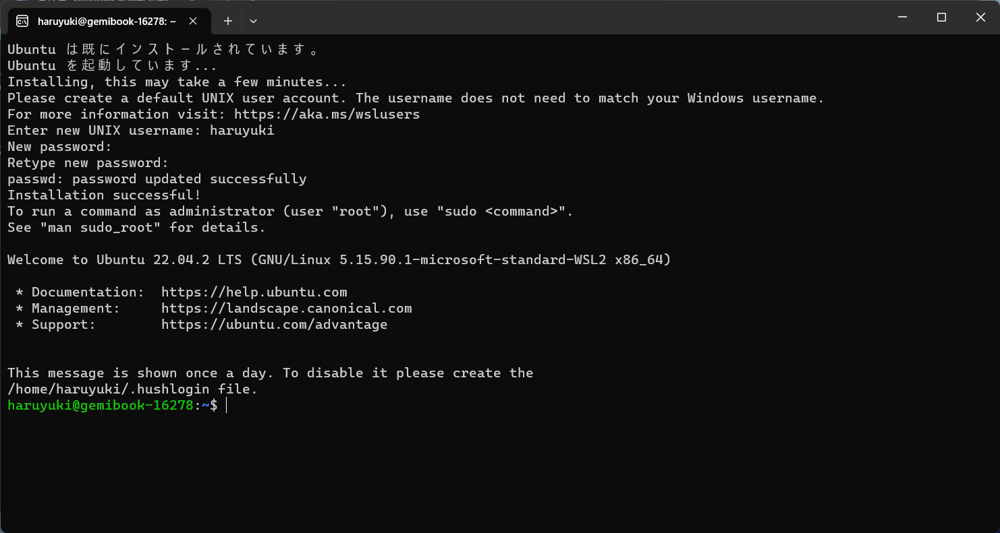

### 2.2. Visual Studio Code を WSL 上での開発向けにセットアップする

では実際に開発を始めるため、Visual Studio Code (以下 VSCode)でWSLを利用できるようにセットアップします。  
左下にある `><` をクリックして、出てきた選択肢から WSL を選びます。  

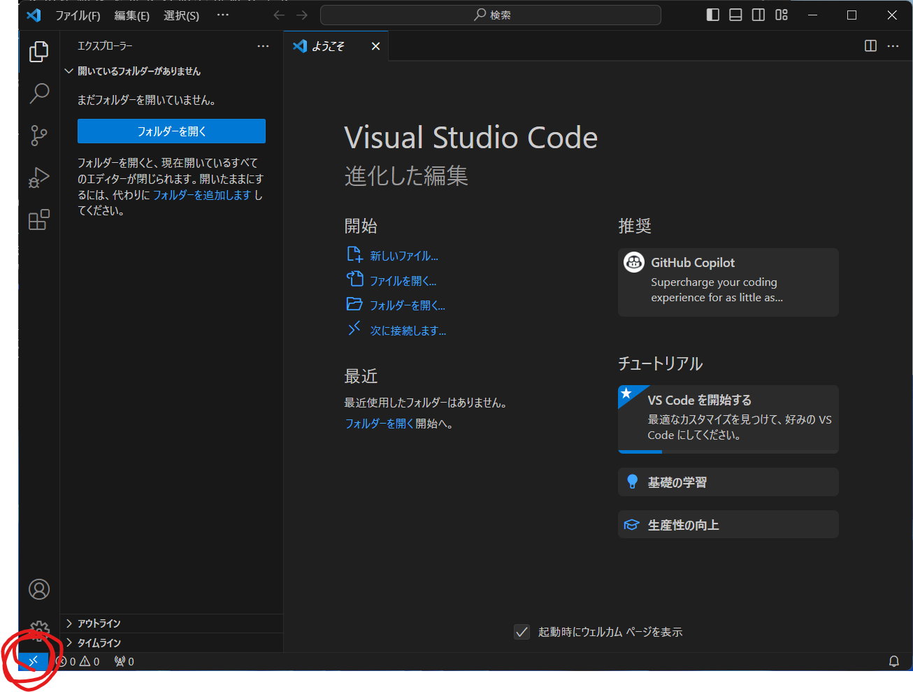

自動でウィンドウが開き直されてWSLのセットアップが開始されるので、しばらく待ち、左下が WSL: Ubuntu になればセットアップ完了です。

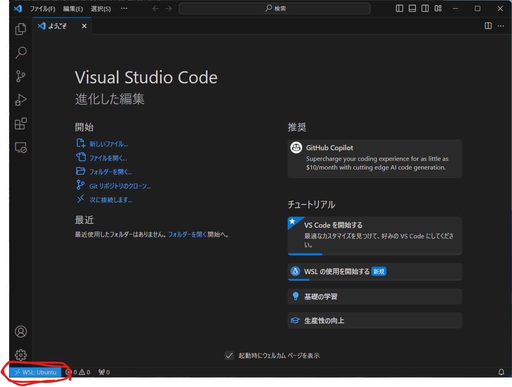

Ctrl + j でターミナルを表示するとubuntuのターミナルが表示されるはずです。  
以下のコマンドを実行してWSL/Ubuntuの中のパッケージを更新しておきます。
(状況によって3~5分くらいかかります)

```bash
sudo apt update && sudo apt upgrade -y
```

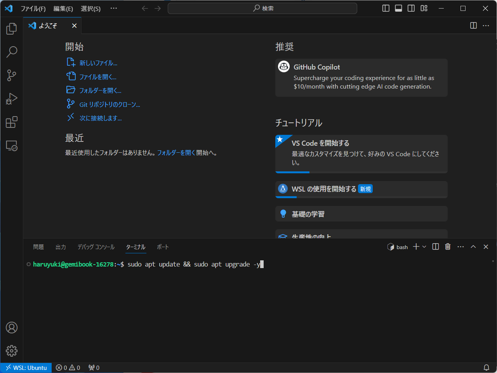

### 2.3. GitHubリポジトリの作成・クローン

今回使用するGitリポジトリをGitHubで作成してクローンしておきます。

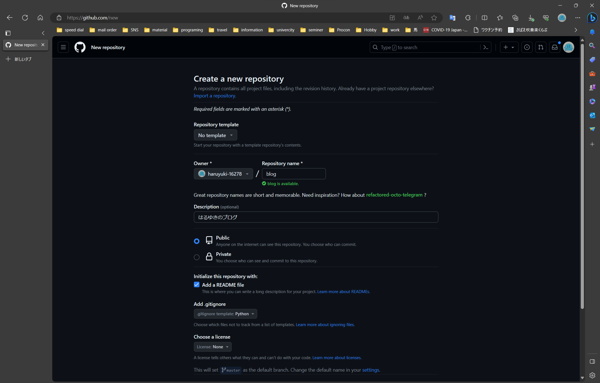

このとき、READMEを追加する設定をオンに、`.gitignore`のテンプレートにPythonを指定しておきます。

以下のコマンドでcloneします。(`<your-repos-link>`をGitHubでコピーしたリンクに置き換えてください。)

```bash
git clone <your-repos-link>
```

このとき、ssh鍵周りでエラーが発生した場合は以下の手順で解消してください。

1. ssh鍵を生成する
    - `ssh-keygen -t ed25519`
    - 以後の質問は空白のままEnterで良い
2. `code ~/.ssh/id_ed25519.pub` などで公開鍵を確認してコピー
3. GitHubの鍵管理画面から新規追加する
4. 再度cloneする

### 2.4. Pythonのセットアップ

#### 2.4.1. pyenvのインストール

Ubuntuは内部でPythonを使用する箇所があるため、標準でPythonがインストール済みです。  
このままでも利用可能 (`Python3 --version` などで確認可能) ですが、OS内部の挙動に影響する可能性があり推奨されません。  
ここではPythonの管理ツールとして[pyenv](https://github.com/pyenv/pyenv)を利用します。  
以下のコマンドを実行してインストールします。(参考: <https://github.com/pyenv/pyenv#automatic-installer>)

```bash
curl https://pyenv.run | bash
```

処理終了後に以下のような表示がターミナルになされます。

```text
# Load pyenv automatically by appending
# the following to 
~/.bash_profile if it exists, otherwise ~/.profile (for login shells)
and ~/.bashrc (for interactive shells) :

export PYENV_ROOT="$HOME/.pyenv"
command -v pyenv >/dev/null || export PATH="$PYENV_ROOT/bin:$PATH"
eval "$(pyenv init -)"

# Restart your shell for the changes to take effect.

# Load pyenv-virtualenv automatically by adding
# the following to ~/.bashrc:

eval "$(pyenv virtualenv-init -)"
```

表示に沿って設定します。  
WSL/Ubuntuは標準では `~/.bash_profile` を作成しないようなので、 `~/.profile` と `~/.bashrc` に以下を追記します。

```rc
export PYENV_ROOT="$HOME/.pyenv"
command -v pyenv >/dev/null || export PATH="$PYENV_ROOT/bin:$PATH"
eval "$(pyenv init -)"
```

また、 `~/.bashrc` には以下も追加で記述しておきます。

```rc
eval "$(pyenv virtualenv-init -)"
```

ターミナルから以下のようにコマンドを実行することでVSCodeでファイルを開いて編集できます。

```bash
code ~/.bashrc
```

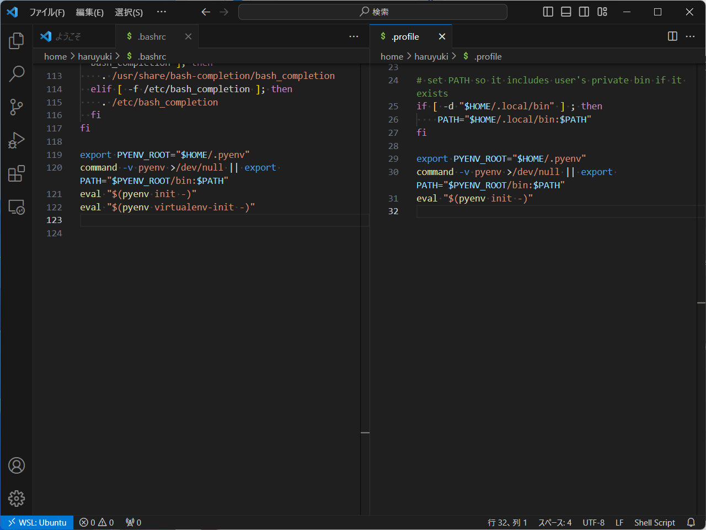

追記できたらCtrl + sで保存して、ターミナルを`exit`コマンドで終了します。  
再度Ctrl + jでターミナルを開き、以下のコマンドを実行してpyenvがインストールできていることを確認してください。

```bash
pyenv -v
```

#### 2.4.2. Pythonのビルド環境のインストール

pyenvを利用したPythonのインストールには、Pythonのビルド環境が必要なため、以下のコマンドで依存パッケージをインストールしておきます。  
参考: <https://github.com/pyenv/pyenv/wiki#suggested-build-environment>

```bash
sudo apt update; sudo apt install -y build-essential libssl-dev zlib1g-dev \
libbz2-dev libreadline-dev libsqlite3-dev curl \
libncursesw5-dev xz-utils tk-dev libxml2-dev libxmlsec1-dev libffi-dev liblzma-dev
```

#### 2.4.3. Pythonのインストール

では実際に利用するPythonをインストールします。今回はPython3.11系の最新バージョンを利用します。  
以下のコマンドでインストール可能な3.11系バージョンのリストを取得します。

```bash
pyenv install --list | grep 3.11
```

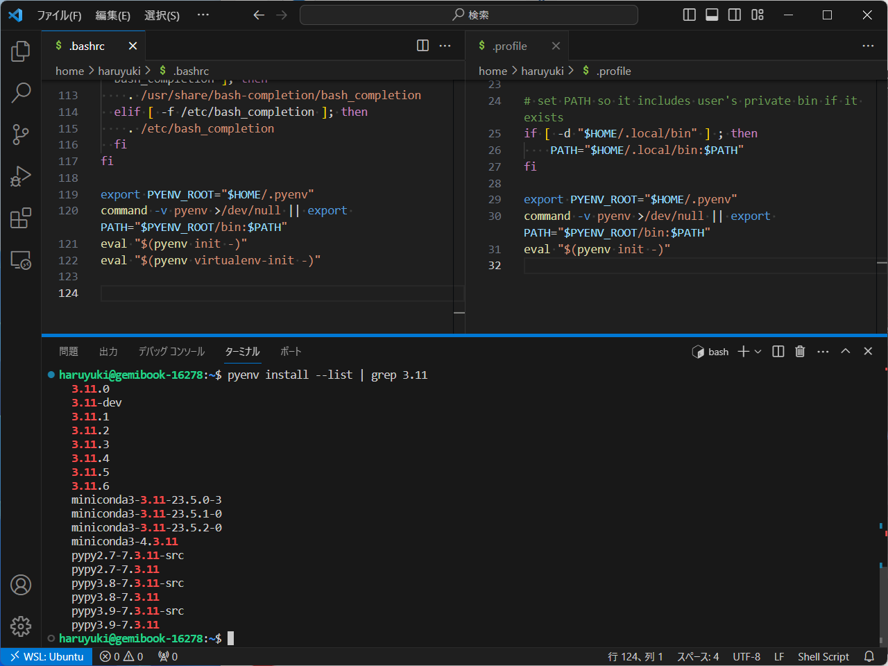

3.11.6まで利用可能なので3.11.6をインストールします。以下のコマンドを実行してください。

```bash
pyenv install 3.11.6
```

今後はこのインストールしたPythonを利用するため、以下のコマンドでPython3.11.6を利用するように設定します。

```bash
pyenv global 3.11.6
python --version
```

`python --version`の結果に`Python 3.11.6`が返ってくれば問題なく設定できています。

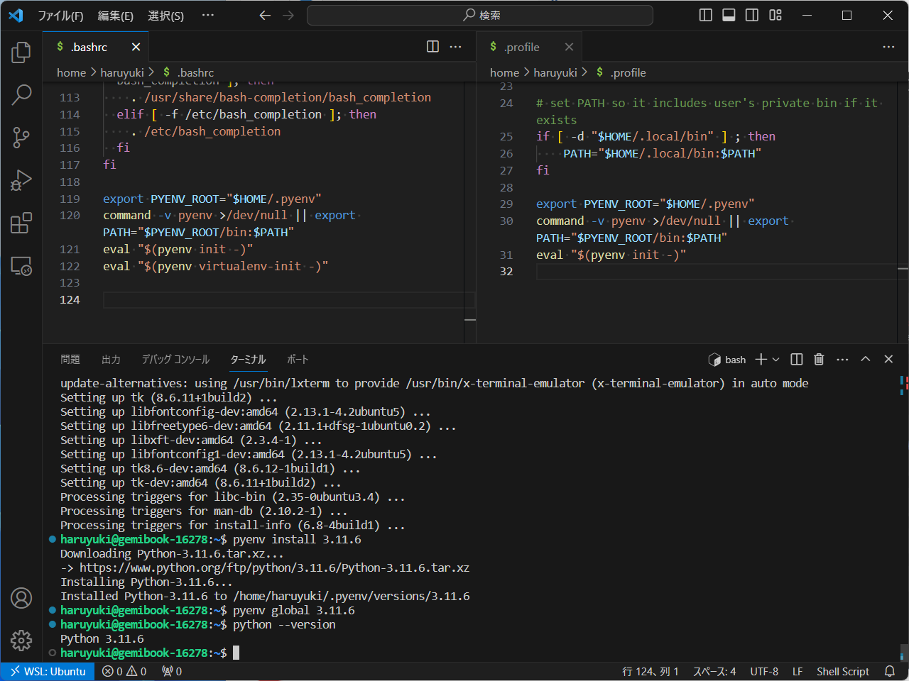

#### 2.4.4. VSCodeでリポジトリを開く

[GitHubリポジトリの作成・クローン](#23-githubリポジトリの作成・クローン) でcloneしたリポジトリをVSCodeで開きます。  
以後の操作はここで開いたVSCode上で行うものとします。

```bash
# VSCodeでcloneしたリポジトリを開く
# リポジトリ名がblogなら↓、別なら設定したリポジトリ名かclone先リポジトリのpathを指定
code ~/blog
```

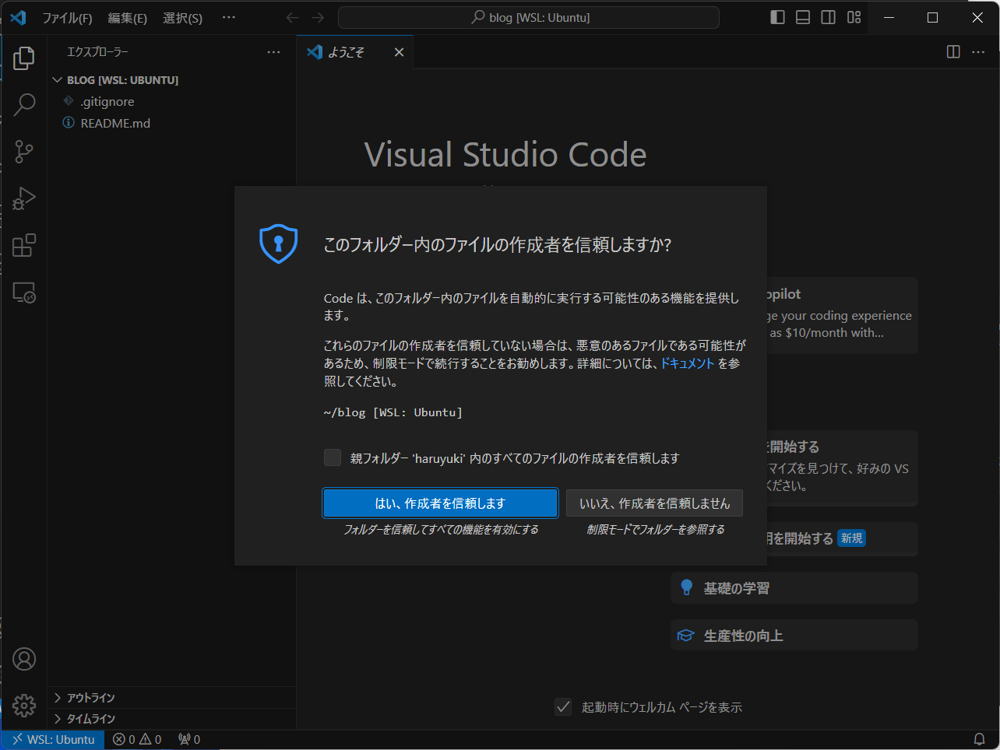

↑のような画面が表示された場合は 「はい、作成者を信頼します」 を選択します。

ここで以下の拡張機能も同時にインストールしておくことを推奨します。

- Python <vscode:extension/ms-python.python>
  - 補完などのサポート
- Pylint <vscode:extension/ms-python.pylint>
  - 構文のサポート
- autoDocstring <vscode:extension/njpwerner.autodocstring>
  - Docstring(JSDocのPython版)を書きやすくする
- jinja Snippets <vscode:extension/noxiz.jinja-snippets>
  - jinjaテンプレートを書くときに便利なスニペットを追加する

#### 2.4.5. venvのセットアップ

Pythonには標準で venv という仮想化ツールが搭載されています。これはパッケージがグローバルにインストールされてしまい、環境が汚染されてしまうのを防ぐためのツールです。  
これをcloneしたリポジトリの直下でセットアップして利用することで不要なパッケージがインストールされた事による不具合などを回避しながら開発することができます。  

以下のコマンドで venv を設定します。

```bash
python -m venv venv
```

このコマンドで直下にvenvディレクトリが作成され、いくつかのファイルが利用できるようになります。  
以下のコマンドでvenvを有効化してshellで実行するpythonを仮想環境のものに変更します。

```bash
source venv/bin/activate
```

shellにプロンプトに `(venv)` と表示されるようになれば設定完了です。

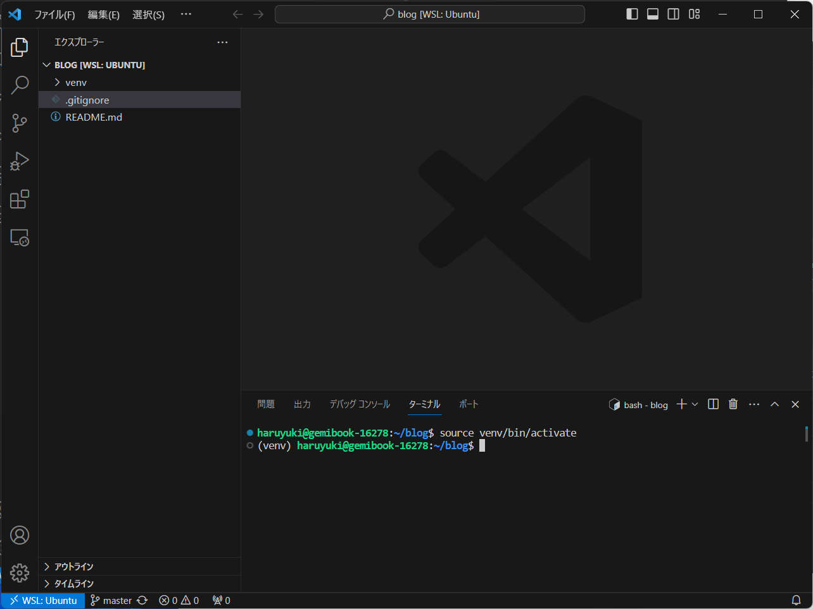

#### 2.4.6. Flaskをインストールする

この勉強会ではPythonのパッケージは`pip`というコマンドで管理します。  
node.jsを触ったことがある人であればnpmを思い浮かべて貰えればいいかと思います。(なお、npm同様により高機能なパッケージ管理ツールが存在します。)

以下のようにして Flask をインストールしましょう

```bash
pip install Flask
```

---

## 3. Flaskを始めよう

環境構築お疲れ様でした。ようやくPython/Flaskを実行する環境が整いました。  
ここではしりとりアプリを作ることを目標としてFlaskを使っていきましょう。

### 3.0. はじめの一歩

まずFlaskにHello,World!しましょう。以下のコードをリポジトリ直下に`main.py`を作成して書き込んでください。

```python=
"""
Flaskをインポート
"""
from flask import Flask

app = Flask(__name__)

@app.route('/')
def index() -> str:
    """
    '/'にアクセスされたときの処理を行う関数
    """
    return 'hello world!'

if __name__ == '__main__':
    app.run(
        host='0.0.0.0',
        port=5000,
        debug=True,
        load_dotenv=False
    )

```

以下のコマンドで↑のコードを実行します。

```bash
python main.py
```

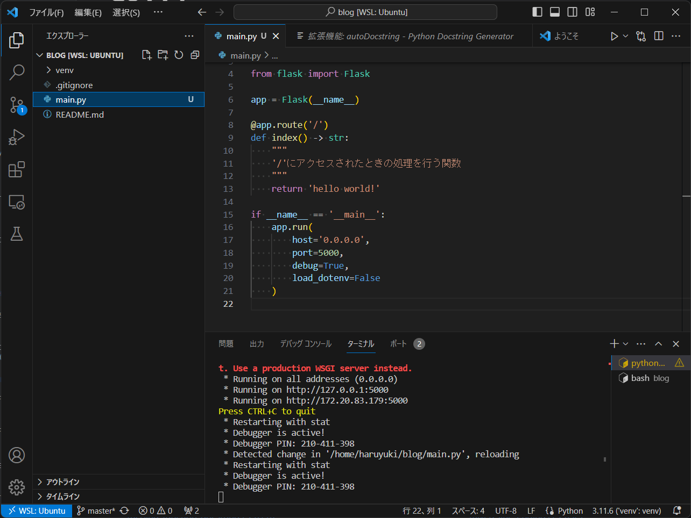

ターミナルの上の操作バーの「+」ボタンから新しいターミナルを開き、以下のコマンドで動作を確認します。

```bash
curl localhost:5000
```

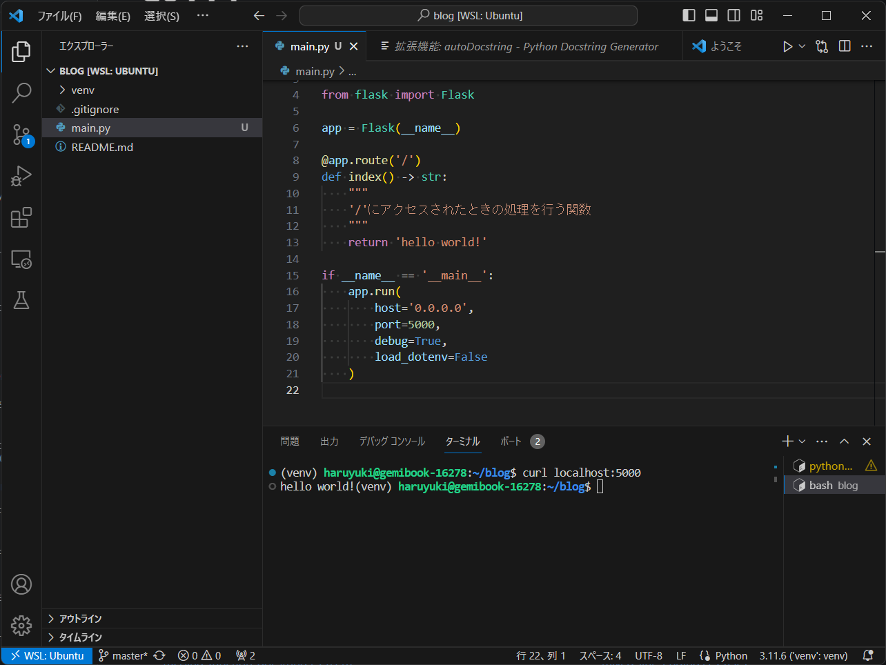

↑のように `hello world!` が帰ってきていれば成功です。

### 3.1. APIをつくろう

APIとは「Application Programing Interface」の略で、あるソフトウェアの機能を呼び出したりデータを取り出したりするための規約・手順のことです。
今後資料中でAPIと書いてある箇所は WebAPI を指します。
WebAPIとは、APIの中で特にそのやり取りをHTTPの上で行うもののことです。

ここでは以下のAPIを実装し、フロントエンドから利用できるようにします。

- しりとりの対戦ルームに関するAPI `/room`
  - しりとりに参加する
    - POST でアクセスされる
    - クライアントIDを受け取ってしりとりのルームIDを返す
  - しりとりの相手ができたかを確認する
    - GET でアクセスされる
    - ルームIDを受け取って、ルームに2人揃ったかどうかとルームのメンバーを返す
    - クライアントからはポーリングでアクセスする
- しりとりの回答に関するAPI `/shiritori`
  - 回答する
    - POST でアクセスされる
    - クライアントIDとルームIDと回答を受け取って、敗北か続行かを返す
  - 相手の回答を取得する
    - GET でアクセスされる
    - クライアントIDとルームIDを受け取って、回答待ちか勝利かを返す
    - クライアントからはポーリングでアクセスする

以下に上記のAPIを実装したあと各所を穴あきにしたソースを示します。
穴開きは ① ~ ⑮ まであります。
⑧ まで説明しながら一緒に解きます。残りは自力でを埋めてみてください。

<details>
  <summary>app.py</summary>

  ```python
import uuid
import json
from flask import Flask, request, jsonify

app = Flask(__name__)

rooms = {}

# consts
ROOM_KEY_PLAYERS = 'players'
ROOM_KEY_SHIRITORI = 'shiritori'
ROOM_KEY_STATUS = 'status'
STATUS_MATCHING = 'matching'
STATUS_PLAYING = 'playing'
STATUS_FINISHED = 'finished'

@app.route('/')
def index() -> str:
    """
    '/'にアクセスされたときの処理を行う関数
    """
    return 'hello world!'

@app.route('/api/room', methods=["POST", "GET"])
def join() -> dict:
    """
    しりとりのルームに関する状態を取得するAPI

    POSTならルームへの参加
    GETならルーム状態の取得
    """
    if (request.method == "POST"):
        # POSTのときの処理

        # POSTリクエストのbodyにあるデータを取り出してデコード
        # JSONとして解釈して辞書型的に使える形式にして data に代入
        data = json.loads(request. ① .decode('utf-8'))
        # 今あるルームのIDのリストを取得
        roomids = list(rooms. ② ())

        if (len(roomids) > 0\
                ③ rooms[roomids[-1]][ROOM_KEY_STATUS] == STATUS_MATCHING):
            # ルームが1以上あり、
            # かつ最後のルームのプレイヤーが一人なら

            # ルームに参加してステータスをプレイ中にする
            ④[ROOM_KEY_PLAYERS].append(data['id'])
            ④[ROOM_KEY_STATUS] = STATUS_PLAYING
            # 入ったルームを返す
            return jsonify({'roomId': ④})
        
        else:
            # ルームが無い
            # もしくは最後のルームのプレイヤーが一人でないなら

            # ルームを新しく作成する
            roomid = str(uuid.uuid4())
            rooms[roomid] = {
                ROOM_KEY_PLAYERS: [ ⑤ ],
                ROOM_KEY_SHIRITORI: ['しりとり'],
                ROOM_KEY_STATUS: STATUS_MATCHING
            }
            # 入ったルームを返す
            return jsonify({'roomId': roomid})

    ⑥ (request.method == "GET"):
        # GETのときの処理

        # クエリパラメータからルームIDを取得
        params = request. ⑦
        roomid = params['roomid']

        # ルームのステータスが 'playing' ならTrueに
        # そうでないならFalseになる
        ready = len(rooms[roomid][ROOM_KEY_STATUS]) == STATUS_PLAYING
        # ルームの準備状況とメンバーを返す
        return jsonify({'ready': ⑧ , 'member': rooms[roomid][ROOM_KEY_PLAYERS]})

@app.route('/api/shiritori/<roomid>', methods=["POST", "GET"])
def shiritori(roomid) -> dict:
    """
    しりとりをやり取りするAPI

    pathparamからルームIDを取得する

    POSTならしりとりに回答する
    GETなら現在の最後の回答を取得する
    """
    if ( ⑨ ):
        # POSTのときの処理

        # POSTリクエストのbodyにあるデータを取り出してデコード
        # JSONとして解釈して辞書型的に使える形式にして data に代入
        data = ⑩
        # dataから回答を抜き出す
        answer = data['answer']

        # ルーム情報からしりとりの履歴を取得
        shiritories = rooms[roomid][ROOM_KEY_SHIRITORI]
        lastword = shiritories[-1]

        # 最後のことばの最後の文字と回答の最初の文字が等しいかどうか
        is_same_last_letter_and_firtst_lettar = lastword[⑪] == answer[0]
        # 回答の最後の文字が ん であるかどうか
        is_last_letter_NN = answer[ ⑫ ] == 'ん'
        # 回答が既に使われたことばかどうか
        is_appeared = answer ⑬ shiritories

        # ルームの履歴に回答を追加する
        rooms[roomid][ROOM_KEY_SHIRITORI]. ⑭ (answer)

        if (not is_same_last_letter_and_firtst_lettar\
                or is_last_letter_NN\
                or is_appeared):
            # しりとりのルールを守れていない回答なら

            # ルームのステータスを 'finished' にする
            rooms[roomid][ROOM_KEY_STATUS] = STATUS_FINISHED
            # 敗北したことを返す
            return jsonify({'result': 'defeat'})

        else:
            # しりとりのルールが守られている回答なら

            # 回答が成功したことを返す
            return jsonify({'result': 'collect'})

    elif ( ⑮ ):
        # GETのときの処理

        # ルームのしりとり履歴を取得
        shiritories = rooms[roomid][ROOM_KEY_SHIRITORI]

        if (rooms[roomid][ROOM_KEY_STATUS] == STATUS_FINISHED):
            # ルームのステータスが 'finished' なら

            # 勝利したことを返す
            return jsonify({'result': 'victory'})

        elif ((rooms[roomid][ROOM_KEY_STATUS] == STATUS_PLAYING)):
            # ルームのステータスがプレイ中なら

            # 現在の最後の回答を返す
            return jsonify({
                'lastword': shiritories[-1],
                'words': len(shiritories)
            })

if __name__ == '__main__':
    app.run(
        host='0.0.0.0',
        port=5000,
        debug=True,
        load_dotenv=False
    )
  ```
</details>

- ① `data`
  - <https://flask.palletsprojects.com/en/latest/api/#flask.Request.data>
  - FlaskのRequestはdataというプロパティを持ち、ここにリクエストのbodyが格納されています
- ② `keys`
  - `rooms` は辞書型として定義されていて、そのキーをルームIDとして取り扱っています
  - 辞書型のキーのみを取り出せる`keys()`メソッドでルームIDを取り出しています。
- ③ `and`
  - 「かつ」を意味する論理演算子です
- ④ `rooms[roomids[-1]]`
  - ルームの辞書の中から、取り出したルームIDのリストで一番うしろのキーを使い、最後のルームを取得します
- ⑤ `data['id']`
  - ① の行で辞書として解釈したため、`'id'`をキーとしてリクエストに含まれているデータを取り出せます
- ⑥ `elif`
  - `if` の条件を満たさなかったとき、次に評価される条件です
- ⑦ `.args.to_dict()`
  - リクエストからクエリパラメータを取得し、辞書型として解釈します
- ⑧ `ready`
  - 直前で定義した評価値を返却します

<details>
  <summary>⑨ ~ ⑮</sumamry>

- ⑨
  - `/room` の処理を参考に解きましょう
- ⑩
  - `/room` の処理を参考に解きましょう
- ⑪
  - pythonの文字列はリストのような方法でn個目の文字にアクセスできます
- ⑫
  - ⑪と同様です
- ⑬
  - shiritories の中に answer が含まれているかどうかを評価したいです
- ⑭
  - しりとりの履歴に回答を追加したいです
- ⑮
  - `/room` の処理を参考に解きましょう

</details>

無事出来上がれば、↓の一連の`curl`コマンドでターミナルからしりとりができるようになるはずです。

```bash
# 一人目がルームを作成して参加
curl localhost:5000/api/room -H "Content-type: application/json" -X POST -d '{"id": 1}'
# 二人目がルームに参加
curl localhost:5000/api/room -H "Content-type: application/json" -X POST -d '{"id": 2}'
# 帰ってきたルームIDを変数に入れておく
id="<roomId>"

# ポーリングでルームが準備完了か取り続ける
# 今回は二人揃っているので {"member": [1, 2], "ready": true} が返ってくる
curl "localhost:5000/api/room?roomid=$id"

# しりとりの最後の単語と単語数を取ってくる
curl "localhost:5000/api/shiritori/$id"
# 単語がunicodeでエンコードされてくるのでデコードして確認してみる
python -c "print(b'<lastword>'.decode('unicode-escape'))"

# しりとりに回答する
curl "localhost:5000/api/shiritori/$id" -X POST -H "Content-Type: application/json" -d '{"answer": "りんご"}'

# 最後の単語が変わってることを確認
curl "localhost:5000/api/shiritori/$id"
python -c "print(b'<lastword>'.decode('unicode-escape'))"

# しりとりを続ける
curl "localhost:5000/api/shiritori/$id" -X POST -H "Content-Type: application/json" -d '{"answer": "ごじら"}'
curl "localhost:5000/api/shiritori/$id" -X POST -H "Content-Type: application/json" -d '{"answer": "らっぱ"}'
# 敗北条件を満たす回答をしたら {"result": "defeat"} が返ってくる
curl "localhost:5000/api/shiritori/$id" -X POST -H "Content-Type: application/json" -d '{"answer": "ぱん"}'

# ポーリングされるはずのGETを確認すると {"result": "victory"} が返ってくる
curl "localhost:5000/api/shiritori/$id"
```

### 3.2. テンプレートエンジンを使おう

冒頭1.で紹介した通り、Flaskにはテンプレートエンジン [Jinja](https://jinja.palletsprojects.com/en/3.1.x/) が搭載されています。これを利用してしりとりをするためのページを作成します。
なお、制作の簡単のために `Alpine.js` というJavaScriptフレームワークを使用します。

#### 3.2.1. テンプレートを利用したページをクライアントに返そう

最初にページを返すルーティングを作ります。  
今回はルームに参加するための `/home` と、しりとりをする `/game` を用意しましょう。  
ついでに `/` へのアクセスも `/home` にリダイレクトするようにします。

以下の内容を `app.py` に追記してください。

```python
# Flaskから追加でインポート
from flask import Flask, request, jsonify, redirect, render_template

# ~~~

@app.route('/')
def index() -> str:
    """
    '/'にアクセスされたときの処理を行う関数
    """
    return redirect('/home')

@app.route('/home')
def home() -> str:
    return render_template("home.html.j2")

@app.route('/game')
def game() -> str:
    return render_template("game.html.j2")

# ~~~
```

ここで`redirect()`と`render_template()`という新しい関数が登場します。  
これらはルートへのアクセスに対してレスポンスを生成するための関数です。

`redirect()` は名のとおりリダイレクトレスポンスを返すもので、それをクライアントに返してリダイレクトさせています。

`render_template()` は与えられたパスにあるテンプレートをレンダリングして返すものです。  
このパスは`app.py`から見た相対パスではありません。`app.py`と同階層に`templates`ディレクトリがあるとして、その直下を起点とした相対パスになります。

ではこれを踏まえて以下の構造になるようファイル・ディレクトリを作成してください

```bash
flask-shiritori/
    ├── static/
    │   └── style.css
    ├── templates/
    │   ├── base.html.j2
    │   ├── home.html.j2
    │   └── game.html.j2
    └── app.py
```

この時点ではアクセスしても何も表示されません。

#### 3.2.2. テンプレートを継承しよう

Jinjaテンプレートには、テンプレートを継承するための ``/`` という構文があります。
今回はこれを利用して、`base.html.j2`を継承して`home.html.j2`、`game.html.j2`を実装します。

試しに以下のソースを書き込んでブラウザから `localhost:5000` にアクセスしてみましょう。

<details>
  <summary>base.html.j2</summary>

  ```html
<!DOCTYPE html>
<html>
  <head>
    <meta charset="utf-8">
    <meta name="viewport" content="width=device-width, initial-scale=1.0">
    <title>Flaskしりとり</title>
  </head>
  <body>
    <h1>Flaskしりとり</h1>
  </body>
</html>
  ```

</details>
<details>
  <summary>home.html.j2</summary>

  ```html
  
  ホーム - 
  ```

</details>
<details>
  <summary>game.html.j2</summary>

  ```html
  
  ゲーム - 
  ```

</details>

`localhost:5000/home` と `localhost:5000/game` にアクセスしたときでタイトルが変わっているのがわかります。

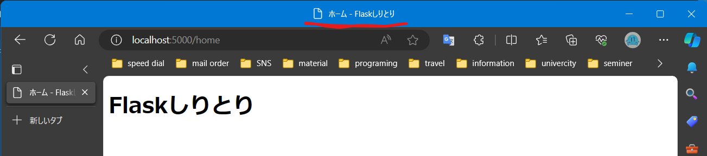
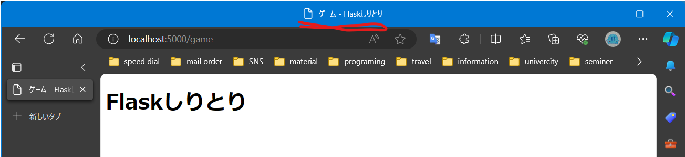

開発者ツールから`<head>`の内容を確認すると、`<title>`の中にそれぞれ`home.html.j2`、`game.html.j2`で``の中に書いた「ホーム - 」「ゲーム - 」が展開されています。

つまり、``/``は以下のように利用できます。

- 被継承ファイルでは ``~`` とすることで、継承ファイルから内容を流し込める
- 継承は `` と書く
- 継承ファイルから被継承ファイルで用意された ``~`` に内容を流し込むには、 ``~`` の内にソースを書けば良い

#### 3.2.3. 静的ファイルを利用しよう

CSSや画像の表示などで、テンプレートから静的ファイルにアクセスしたいことがあります。  
こういった場合に利用できる記法を説明します。

`style.css`と`base.html.j2`を以下のように編集してください。

<details>
  <summary>style.css</summary>

  ```css
* {
  box-sizing: border-box;
  margin: 0;
}

html, body {
  width: 100%;
  height: 100%;
}

body { 
  display: grid;
  place-content: center;

  > main {
    display: grid;
    place-content: center;
  }
}
  ```

</details>
<details>
  <summary>base.html.j2</summary>

  ```html
<!DOCTYPE html>
<html>
  <head>
    <meta charset="utf-8">
    <meta name="viewport" content="width=device-width, initial-scale=1.0">
    <title>Flaskしりとり</title>
    <!-- 追加 -->
    <link rel="stylesheet" href="{{ url_for('static', filename='style.css') }}">
    <!-- 追加 -->
  </head>
  <body>
    <h1>Flaskしりとり</h1>
  </body>
</html>
  ```

</details>

注目するのは `base.html.j2` に追記した以下の行です。

```html
    <link rel="stylesheet" href="{{ url_for('static', filename='style.css') }}">
```

この `href` に設定されている `{{ }}` で囲んだ記法をマスタッシュ記法と呼びます。  
この中の文はPythonで処理され、結果がその場に展開されます。

今回はマスタッシュ記法の中で `url_for()`という関数が使われています。  
その名の通り引数に渡したものへのURLを返す関数で、今回は第一引数に`'static'`を渡すことで、3.2.1.で用意してもらった`static`ディレクトリの中にある`filename`へのパスを生成させています。

#### 3.2.4. しりとりしよう

では以下のソースをそれぞれのファイルに貼り付けて作ったAPIとWebがうまく連携できるかを試しましょう。

<details>
  <summary>base.html.j2</summary>

  ```html
<!DOCTYPE html>
<html>
  <head>
    <meta charset="utf-8">
    <meta name="viewport" content="width=device-width, initial-scale=1.0">
    <title>Flaskしりとり</title>
    <link rel="stylesheet" href="{{ url_for('static', filename='style.css') }}">
    <script src="//unpkg.com/alpinejs" defer></script>
    
    
  </head>
  <body>
    
    
  </body>
</html>
  ```

</details>
<details>
  <summary>home.html.j2</summary>

  ```html

ホーム - Flaskしりとり

<script>
  const getIsRoomReady = async (roomId) => {
    const response = await fetch(`/api/room?roomid=${roomId}`);
    const result = JSON.parse(await response.text());
    if (result.ready) {
      window.localStorage.setItem(
        'room',
        JSON.stringify({
          'id': roomId,
          'member': result.member
        })
      );
      window.location.href = '/game';
    }
  };

  const homeControl = () => {
    return {
      isMatchingStarted: false,
      async onJoinClicked () {
        this.isMatchingStarted = true;
        const myId = window.localStorage.getItem('myId') ?? self.crypto.randomUUID();
        window.localStorage.setItem('myId', myId);
        const response = await fetch('/api/room', {
          method: 'post',
          headers: {
            'Content-Type': 'application/json'
          },
          body: JSON.stringify({
            id: myId
          })
        });
        const result = await response.text();
        const roomId = JSON.parse(result).roomId;

        window.setInterval(() => getIsRoomReady(roomId), 1000);
      }
    }
  };
</script>


<main x-data="homeControl()">
  <h1>しりとり対戦</h1>
  <button x-show="!isMatchingStarted" @click="onJoinClicked()">ルームに入る</button>
  <p x-show="isMatchingStarted">マッチング中</p>
</main>

  ```

</details>
<details>
  <summary>game.html.j2</summary>

  ```html

対戦 - Flaskしりとり

<script>
  const gameControl = () => {
    return {
      answer: '',
      shiritories: [],
      room: JSON.parse(window.localStorage.getItem('room')),
      myId: window.localStorage.getItem('myId'),
      lastword: '',
      words: 0,
      isFirstAttack: undefined,
      pollingShiritori: undefined,
      finished: false,
      victory: false,

      async init () {
        await this.getShiritori();
        this.isFirstAttack = this.room.member.indexOf(this.myId) === 0;

        if (!this.isMyTurn()) {
          const pollingFunc = async () => {
            await this.getShiritori();
            if (this.isMyTurn()) {
              window.clearInterval(this.pollingShiritori);
            }
          };
          this.pollingShiritori = window.setInterval(pollingFunc, 1000);
        }
      },

      async getShiritori () {
        const request = await fetch(`/api/shiritori/${this.room.id}`);
        const result = JSON.parse(await request.text());
        this.lastword = result?.lastword;
        this.words = result?.words;
        this.finished = result?.result === 'victory';
        this.victory = result?.result === 'victory';
      },

      async postShiritori () {
        const request = await fetch(
          `/api/shiritori/${this.room.id}`, {
            method: 'post',
            headers: {
              'Content-Type': 'application/json'
            },
            body: JSON.stringify({
              'answer': this.answer
            })
          }
        );
        const result = JSON.parse(await request.text());
        this.finished = result.result === 'defeat';
        if (!this.finished) {
          const pollingFunc = async () => {
            await this.getShiritori();
            if (this.isMyTurn() || this.finished) {
              window.clearInterval(this.pollingShiritori);
            }
          };
          this.pollingShiritori = window.setInterval(pollingFunc, 1000);
          this.lastword = this.answer;
          this.answer = '';
          this.words++;
        }
      },

      isMyTurn () {
        return this.isFirstAttack
                ? this.words % 2 === 1
                : this.words % 2 === 0;
      }
    }
  };
</script>


<main x-data="gameControl()">
  <section>
    <p><span x-text="isMyTurn() ? 'あなたの' : '相手の'"></span>ターンです。</p>
    <p><span x-text="lastword"></span> → ?</p>
  </section>
  <input type="text" x-model="answer">
  <button
      @click="postShiritori()"
      x-bind:disabled="!isMyTurn() || finished ? true : undefined">
    回答する
  </button>

  <section x-show="finished">
    <p><span x-text="victory ? 'あなた' : '相手'"></span>の勝利です</p>
    <button @click="window.location.href = '/home'">トップに戻る</button>
  </section>
</main>

  ```

</details>

ブラウザを通常とシークレットウィンドウで2つ使ってローカルで動作を確認してみてください。

## 4. 終わりに

今回はFlaskの勉強会ということで、環境構築からFlask+jinjaでページもAPIも配信するスタンドアロンなサーバーを実装してもらいました。

この資料では使っていない機能もたくさんあるので、ぜひ色々調べて使ってみてもらえれば嬉しいです。
また、しりとりとしては最低限の機能のみを実装しているので、ここから自由にカスタマイズして、自分のオリジナルしりとりアプリや、データベースの利用、ランキングなどの実装など発展させていってもらえたら楽しいと思います！
追加の実装やカスタマイズをしたときにはぜひ連絡してくださいね。

> P.S. 3.で唐突に登場した `Alpine.js` について気になった人は [こちら](https://hackmd.io/@haruyuki16278/r1GutxjTo) も見てみてください。

<details>
  <summary>延長戦！<summary>

## 4. Azureを使ってデプロイしてみよう

せっかくなので、この資料で作ったしりとりアプリを[Microsoft Azure](https://azure.microsoft.com/ja-jp/)でデプロイしてみようとおもいます。
※ 有効なサブスクリプションのあるAzureアカウントが必要です。学校によってはMicrosoftの学校認証で無料クレジット付きサブスクリプションがあるかもしれないので、身近な先生に聞いてみるといいかもしれません。

今回は[App Service](https://azure.microsoft.com/ja-jp/)を利用します。

VSCodeの[Azure Tools](vscode:extension/ms-vscode.vscode-node-azure-pack)をインストールしましょう。

左のタブからAzureを選び、「Sign in to Azure」でサインインします。

RESOURCES の + から「Create App Service Web App」を選択し、指示に沿って進めていきます。
途中価格プランを聞かれるので、一旦F1プランを選択しておくのがいいでしょう。

拡張機能によって App Service がセットアップされると、右下に開いているプロジェクトをアップロードするか？と聞かれるので「Deploy」を押してデプロイしましょう。

しばらく待つとデプロイされて、デプロイしたページを開くか？と聞かれるので開きましょう。

うまくいっていれば↓のように開けます。

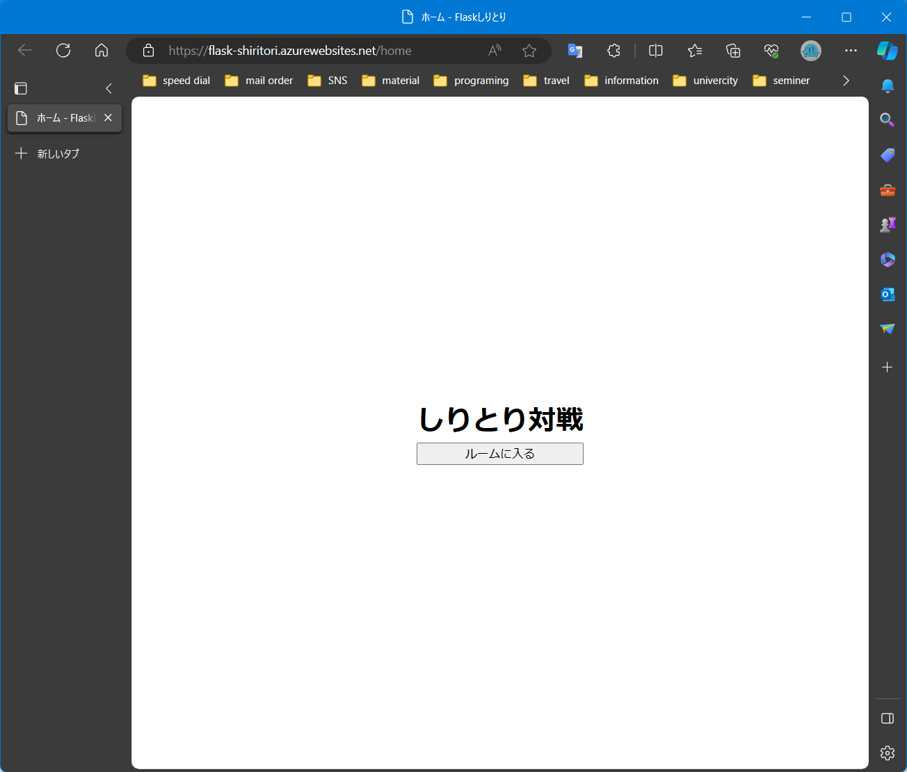

これで色んな人と遊べますね！

</details>
