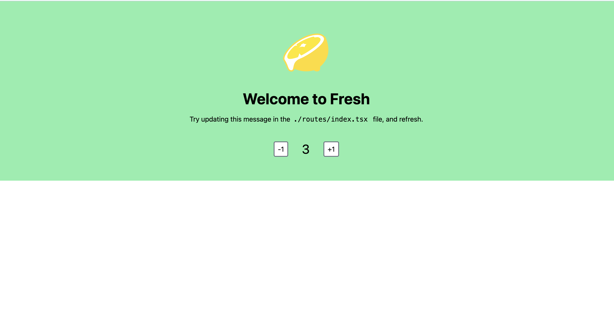

# はじめに
今回の勉強会では[Deno Fresh](https://fresh.deno.dev/)を用いて簡単なWebサイトを作成しようと思います！

Deno Freshとは公式サイトより
> Deno FreshはJavaScriptとTypeScriptの開発者向けのフルスタックのモダンなWebフレームワーク 

VueやReact、Angularなどは主にクライアント側のコードを扱うフレームワークで、ExpressやNestJS、Fastifyなどは主にサーバー側のコードを扱うものでした。

Deno Freshはサーバー側のコードとクライアント側のコードのその両方を扱えるフルスタックwebフレームワークであるということです。

以前インターンでdenoを用いてアプリを作ったと思いますが、その時は何もフレームワークというものは導入せずに、ほとんど1から作成したと思います。

Deno Freshというフレームワークを導入することで、
1. 最初の環境構築をしなくて済む
2. クライアント側のコードもTypeScriptでかける (JavaScriptにコンパイルしてくれる)
3. パフォーマンス性の高いページを作成可能
4. Deno Deployにてデプロイがめっちゃ楽 (すぐ公開できる)

# 今回の目標

1. Deno Freshのプロジェクトを作成できる
2. 新規の画面を作ることができる
3. サーバー側の書き方が少しわかる

# Deno Freshのプロジェクトを作成

## 準備

まずDenoが入っていることを確かめましょう。

```sh
$ deno --verion

// 出力 (自分の場合)
deno 1.36.0 (release, aarch64-apple-darwin)
v8 11.6.189.12
typescript 5.1.6
```

denoが入っている人はdenoのバージョンを上げてもいいかもです。

```sh
$ deno upgrade

// 出力 (自分の場合)
deno 1.36.0 (release, aarch64-apple-darwin)
v8 11.6.189.12
typescript 5.1.6
fujii@tcp0281 study_session_materials % deno upgrade
Looking up latest version
Found latest version 1.37.2
Downloading https://github.com/denoland/deno/releases/download/v1.37.2/deno-aarch64-apple-darwin.zip
Deno is upgrading to version 1.37.2
Archive:  /var/folders/91/2_7s_3351gs8xhhx7wgs08js4498z5/T/.tmpk7JJBV/deno.zip
  inflating: deno
Upgraded successfully
Release notes: https://github.com/denoland/deno/releases/tag/v1.37.2
Blog post: https://deno.com/blog/v1.37
```

denoが入っていない人は[こちら](https://docs.deno.com/runtime/manual/getting_started/installation)からダウンロードしましょう。

準備ができたら、新規にフォルダを作成してもよいところにカレントディレクトリを移動しましょう。

## Deno Freshプロジェクトを作成する

以下のコマンドを実行してDeno Freshのプロジェクトを作成しましょう。

```sh
$ deno run -A -r https://fresh.deno.dev
```

これを実行すると以下の表示が出るので、プロジェクト名(フォルダ名)を指定しましょう。特に気にしない場合はそのままエンターしてもらっても大丈夫です。

```sh
  🍋 Fresh: the next-gen web framework.  

Project Name [fresh-project]
```

次に以下のような表示が出ると思いますが、これは[Tailwind CSS](https://tailwindcss.com/)をサポートしていますが使用しますか？というものです。

一旦`y`にしておきましょう。

```sh
Fresh has built in support for styling using Tailwind CSS. Do you want to use this? [y/N]
```

VSCodeを使用しているのであれば、`y`を押しましょう。
```sh
Do you use VS Code? [y/N]
```

最後に以下の表示が出れば成功です！
めっちゃ簡単にプロジェクトを作成することができました！

```sh
The manifest has been generated for 5 routes and 1 islands.

Project initialized!

Enter your project directory using cd fresh-project.
Run deno task start to start the project. CTRL-C to stop.

Stuck? Join our Discord https://discord.gg/deno

Happy hacking! 🦕
```

VSCodeでフォルダを開いてみると以下のようになっていると思います。


最後に、次のコマンドを実行してDeno Freshのプロジェクトを立ち上げてみましょう。

```sh
$ deno task start

// 出力
Task start deno run -A --watch=static/,routes/ dev.ts
Watcher Process started.
The manifest has been generated for 5 routes and 1 islands.

 🍋 Fresh ready
    Local: http://localhost:8000/
```

`http://localhost:8000/`を見てみて、この画面が表示されたらOKです！



# フォルダのかるーい説明

青の枠で書かれた部分がサーバー側のコードで、赤の枠で書かれた部分がクライアント側のコードになっています。


- クライアント側
  - static/
    - アイコンや画像などを置いておくフォルダ
  - component/, islands/
    - 画面に表示する部品(コンポーネント類)
- サーバー側
  - main.ts, dev.ts
    - サーバーを立ち上げるときに実行されるファイルで、本番はmain.ts, 開発ではdev.tsを実行している
  - routes
    - アクセスされたURLに応じて、表示する画面や処理を行っている

# クライアント側のコードに関して

## routes/index.tsxを覗いてみる

表示されている画面には

> Try updating this message in the./routes/index.tsx file, and refresh.

と書かれているのでトップ画面に該当するファイルは`./routes/index.tsx`ファイルのようなので、`./routes/index.tsx`ファイルを覗いてみましょう。

```ts
export default function Home() {
  return (
    // HTML見たいなコード
  )
}
```

のようにHTMLみたいなコードを返している関数が置かれているのがわかります。

Deno Freshではクライアント側の処理で、[React](https://react.dev/)というwebフレームワークから派生した[Preact](https://preactjs.com/)をというものを採用しています。

拡張子が「`.tsx`」というもので、`.ts`ファイルと`.tsx`ファイルの違いは、JSXという記法ができるかどうかになります。

簡単にいうと、JSX(拡張子が`.tsx`)ファイル内ではHTMLのコードを書くことができます。

またhtml内のclassの文字列は[Tailwind](https://tailwindcss.com/)というCSSフレームワークのものです。

このJSX記法やPreactやTailwindに関しては今回の勉強会では省略します。

## routes/フォルダの仕組み

ここでDeno Freshの特徴的な機能の一つのファイルシステムベースのルーティングについて説明します。

Deno Freshは`routes/`の階層(パス)がそのままAPIリクエストのpathに対応しています。

つまりAPIリクエストのpathが
- `/`の時は`routes/index.tsx`をみにいく
- `/hello`の時は`routes/hello.tsx`をみにいく
- `/api/joke`の時は`routes/joke.ts`をみにいく
- `/greet/:name`の時は`/routes/greet/[name].tsx`をみに行く

ようになっています。
ルーティングがファイル構造とマッチしていることでわかりやすいですね。

詳しくは[こちら](https://fresh.deno.dev/docs/concepts/routing)


## 新しい画面を作成してみよう

上のセクションのファイルシステムベースのルーティングを考慮して新規の画面を作成してみましょう。

1. routes/に`hello.tsx`というファイルを作成してみよう。

2. `hello.tsx`を作成したらコードを書いてみましょう

```ts
export default function Hello() {
  // htmlのコードをtypescriptのコードの中に入れることができる
  return (
    <>
        <h1>Hello</h1>
    </>
  );
}
```

3. 保存したらブラウザのURLの`http://localhost:8000`に`/hello`を追記してアクセスしてみよう

以下の画面が表示されれば問題なく新規の画面が追加できています。

(左上に小さく「Hello」の文字が表示されています。)


# クライアント側でAPIリクエストを送ってみよう

1. `hello.tsx`を以下のように改良してみよう

```ts
export default async function Hello() {
  // APIリクエストを実行
  const res = await fetch('http://localhost:8000/api/joke')
  // レスポンスのテキストを取り出す
  const joke = await res.text()

  return (
    <>
        <h1>joke: { joke }</h1>
    </>
  );
}
```

すると以下のようにジョークが表示されていると思います。


APIリクエスト先の`http:\//localhost:8000/api/joke`の処理は`routes/api/joke.ts`に書かれています。

```ts
export const handler = (_req: Request, _ctx: HandlerContext): Response => {
  // 配列のindexをランダム決める
  const randomIndex = Math.floor(Math.random() * JOKES.length);
  // 返すジョークを代入
  const body = JOKES[randomIndex];
  // レスポンスを返す
  return new Response(body);
};
```

JOKES配列の中にあるジョークからランダムに一つ取り出して、その文字列を返しています。

# サーバー側のコードに関して

## サーバー側のAPIリクエスト処理を追加してみよう

ファイルシステムベースのルーティングを考慮して新規のAPIリクエスト処理を作成してみましょう。

今回は「jig.jpの勉強会へようこそ」という文言を返すような処理を書いてみましょう。

`routes/api/wellcome.ts`というファイルを作成しましょう。

APIリクエストを処理してレスポンスを返す処理は以下のようなものになります。

```ts
export const handler = (_req: Request, _ctx: HandlerContext): Response => {
  const body = /** クライアント側に返したいもの */
  return new Response(body);
};
```

よって

```ts
export const handler = (_req: Request, _ctx: HandlerContext): Response => {
  const body = 'jig.jpの勉強会へようこそ'
  return new Response(body);
};
```

のように書いて保存してみましょう。

最後に`routes/hello.tsx`内のAPIリクエストのurlを`http://localhost:8000/api/wellcome`に変更して文言等も以下のように調整して、保存します。

```ts
export default async function Hello() {
  const res = await fetch('http://localhost:8000/api/wellcome')
  const wellcomeMeg = await res.text()

  return (
    <>
        <h1>{ wellcomeMeg }</h1>
    </>
  );
}
```

画面に「jig.jpの勉強会へようこそ」が表示されたらOKです！

# まとめ

今回の勉強会では
- Deno Freshのプロジェクトを立ち上げる
- 新規の画面を追加する
- ページからAPIリクエストを叩いて画面にレスポンスの値を反映させる
- 新規のAPIを作成してみる

ところまでやりました。

Deno Freshには他にも重要な機能が備わっています。
- `component/`, `islands/`フォルダについて(アイランドアーキテクチャについて)
- 表示するファイルとAPIリクエストを行うファイルが全部`routes/`にあることについて (SSR、サーバーサイドレンダリングについて)

さらに理解を深めたい人は[公式Doc](https://fresh.deno.dev/docs/introduction)を覗いてみましょう