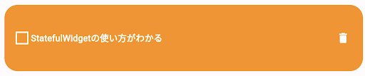

# 初めに

今回の勉強会では、DartPad という公式のオンライン IDE を使って、国旗を表示するアプリを作っていきます。

DartPad → https://dartpad.dev

## 今日のゴール

- Dartpad で Dart と Flutter のプログラムが実行できること
- Widget とは何かを理解できること
- カスタム Widget が作成できること
- Container, Column, Row などのよく出てくる Widget の使い方がわかること

# Flutter とは

Flutter とは、Google が提供するマルチプラットフォームアプリケーションを構築するためのフレームワークです。
開発言語として Dart を採用しています。

Flutter 開発での嬉しい点としては、

- クロスプラットフォーム対応
- 宣言的で Widget ベースな UI 構造
- ホットリロード・ホットリスタート

などが挙げられます。

# DartPad で Dart プログラムを動かしてみよう

まずは、DartPad 上で Dart が動くことを確認してみます。

はじめに、DartPad を開いて、画面上部の「New Pad」を選択し、html のトグルがオフになっていることを確認して、Dart の方を選択してください。
ここまで完了すると、以下のようにプログラムが入力された状態になります。


プログラムを実行する場合は、画面中央の「Run」ボタン(青いやつ)を押します。
プログラム通り、右側の Console に「hello 1」から「hello 5」と表示されれば OK です。

# DartPad で Flutter アプリを動かしてみよう

今度は、DartPad 上で Flutter アプリを動かしてみます。
先ほどと同じように「New Pad」から Flutter を選択して、表示されたサンプルプログラムを実行します。

右側のエリアが Console ではなく UI Output に変わり、画面中央に「Hello, world!」と表示されれば OK です。


# テンプレートプロジェクトで遊んでみよう

そろそろ、実際にプログラムを触っていきましょう。
DartPad 右上の Samples から、Counter を選択して実行してみましょう。


このアプリは、右下の＋ボタンをタップした回数をカウントするアプリで、Flutter の新規プロジェクトを作成すると、このプログラムが入っています。
実際に右下のボタンをタップ(今回は PC なのでクリック)すると中央の数値が更新されるのを確認してみてください。

## ラベルを日本語に変えてみる

プログラムの中から、「You have pushed the button this many times:」を表示している Text Widget を探して、「右下のボタンが押された回数:」に変えてみましょう。
DartPad にはホットリロードは搭載されていないので、変えたら Run ボタンで再度実行します。


## Widget とは？

Widget は、Flutter の UI を構築するためのパーツのことです。
さまざまな Widget を組み合わせていくことで、UI を作っていきます。

今回のカウンターアプリだと、以下の Widget を用いて UI が構築されています。

- MyApp: アプリ全体の Widget (自作)
- MeterialApp: マテリアルデザイン用の Widget
- MyHomePage: カウンターやボタンを表示する Widget (自作)
- Scaffold: 画面構成を定める Widget
- AppBar: アプリケーションバー用の Widget
- Center: 中央寄せにする Widget
- Text: テキストを表示する Widget
- FloatingActionButton: アクションボタン用の Widget
- Icon: アイコンを表示する Widget

Flutter は宣言的 UI のフレームワークなので、Widget による UI 構築が簡単です。

公式ドキュメントでは、以下の図を用いて説明されています。
Widget は、アプリの状態を表示するための設計図とも捉えられ、状態( state )が与えられると、Widget の build メソッドが UI を構築します。

この状態( state )を必要とする Widget は StatefulWidget 、必要としないものは StatelessWidget を用いて作成していきます。

<center><a href="https://docs.flutter.dev/development/data-and-backend/state-mgmt/declarative" >公式ドキュメント</a></center>


# カスタム Widget で遊んでみよう

前述のとおり、Flutter には標準でいろいろな Widget が用意されていています。
この Widget を組み合わせたり、特定の振る舞いを持たせるカスタム Widget を作成することもできます。
ということで、GreenContainer という緑色の縦横それぞれ 100px のコンテナ(箱)の Widget を実装して、カウンターアプリに追加してみましょう。

まず新しい Widget の雛形を作ります。
以下のコードをプログラムの一番下に追加してください。

```dart
class GreenContainer extends StatelessWidget {
  const GreenContainer({Key? key}) : super(key: key);

  @override
  Widget build(BuildContext context) {
        return Container();
  }
}
```

使用している Widget について軽く説明すると、今回は状態を持たないので StatelessWidget を使用しています。
Container は名前通りただのコンテナです。HTML の div のように領域を確保したり、内包した Widget をカスタマイズするのに使用する Widget です。

続いて、Container に色と大きさを指定します。
やり方はシンプルで width, height, color を Container に指定します。

```dart
class GreenContainer extends StatelessWidget {
  const GreenContainer({Key? key}) : super(key: key);

  @override
  Widget build(BuildContext context) {
    return Container(
      width: 100,
      height: 100,
      color: Colors.green,
    );
  }
}
```

これで GreenContainer は完成です。
右側のアプリで表示できるように、回数を表示している Text が入っている Column Widget の中に GreenContainer を追加します。

```dart
        child: Column(
          mainAxisAlignment: MainAxisAlignment.center,
          children: [
            const Text(
              '右下のボタンが押された回数:',
            ),
            Text(
              '$_counter',
              style: Theme.of(context).textTheme.headlineMedium,
            ),
            const GreenContainer(),
          ],
        ),
```

緑の箱が作れていれば OK です。


# スクロールできるようにする

このまま、Column の中にたくさんの Widget が置かれると画面からはみ出して Overflow とエラーが出てしまうので、国旗を設置する前に少し対策します。
今、50 行目付近からは以下のコードのようになっています。

```dart
     body: Center(
       child: Column(
         mainAxisAlignment: MainAxisAlignment.center,
           children: [
             const Text(
               '右下のボタンが押された回数:',
             ),
```

この body の一番上に SingleChildScrollView という Widget を追加します。
この Widget は、子要素をスクロールできるようにする Widget です。
下記のように一番上の要素として SingleChildScrollView があれば OK です(閉じ括弧を忘れずに！)。

```dart
      body: SingleChildScrollView(
        child: Center(
          child: Column(
            mainAxisAlignment: MainAxisAlignment.center,
            children: [
              const Text(
                '右下のボタンが押された回数:',
              ),
```

# 国旗を作ってみる

カスタム Widget の作り方がわかったところで、本題の国旗を表示するアプリを作っていきましょう！
まず、国旗を表示する Widget の作成を行います。

## 日本

はじめに、日本の国旗を作ってみましょう。
Wikipedia を調べてみると、以下のように記載があります。

> 「国旗及び国歌に関する法律」（通称：国旗・国歌法）の規定によれば、「旗の形は縦が横の 3 分の 2 の長方形。日章の直径は縦の 5 分の 3 で中心は旗の中心。地色は白色、日章は紅色」とされている。上下・左右対称である。

https://ja.wikipedia.org/wiki/%E6%97%A5%E6%9C%AC%E3%81%AE%E5%9B%BD%E6%97%97

### FlagJp Widget の作成

まずは空の Widget を作成してみましょう。
先ほどと同じように末尾に FlagJp という名前の空の Widget を作成してみます。

```dart
class FlagJp extends StatelessWidget {
  const FlagJp({Key? key}) : super(key: key);

  @override
  Widget build(BuildContext context) {
    return Container();
  }
}
```

続いて、旗の枠を作って配置していきます。
縦横比が 2:3 となるように、幅を 300、高さを 200 で指定してみましょう。
また、BoxDecoration というパラメータを使用して枠線を追加してみます。

```dart
class FlagJp extends StatelessWidget {
  const FlagJp({Key? key}) : super(key: key);

  @override
  Widget build(BuildContext context) {
    return Container(
      width: 300,
      height: 200,
      decoration: BoxDecoration(
        color: Colors.white,
        border: Border.all(color: Colors.grey),
      ),
    );
  }
}
```

ここまでできたら、GreenContainer() の下に追加して、実行してみましょう。

```dart
        child: Column(
          mainAxisAlignment: MainAxisAlignment.center,
          children: [
            const Text(
              '右下のボタンが押された回数:',
            ),
            Text(
              '$_counter',
              style:　Theme.of(context).textTheme.headlineMedium,
            ),
            const GreenContainer(),
            const SizedBox(height: 10),
            const FlagJp(),
          ],
        ),
```

旗のベースが表示できていれば OK です。


### 日の丸を作る

FlagJp Widget の Container に色々追加して日の丸を作ってみましょう。

- 日の丸の仕様は下記の通りです。
- 日の丸の直径は高さの 5 分の 3 ( 60% )
- 旗の中心に配置される
- 色は紅色( #C22047 )

以下は実装のヒントです。

- Container の中に描画する Widget は child に指定します
- Container を丸くさせるには BoxDecoration() の shape パラメータに BoxShape.circle を指定します
- 紅色は Color(0xffc22047) で指定することができます
  - ff は不透明度の hex です( 100% )
- Container の alignment に Alignment.center を指定すると子要素が中央に配置できます

<details>
<summary>答え</summary>

```dart
class FlagJp extends StatelessWidget {
  const FlagJp({Key? key}) : super(key: key);

  @override
  Widget build(BuildContext context) {
    return Container(
      width: 300,
      height: 200,
      decoration: BoxDecoration(
        color: Colors.white,
        border: Border.all(color: Colors.grey),
      ),
      // 子Widgetをセンタリングする
      alignment: Alignment.center,
      // 子Widgetに赤い丸を描画するWidgetを追加
      child: Container(
        width: 120,
        height: 120,
        decoration: const BoxDecoration(
          color: Colors.red,
          shape: BoxShape.circle,
        ),
      ),
    );
  }
}
```

</details>

## ドイツ

次はドイツ国旗を作ってみましょう。
仕様は下記の通りです。

- 縦横比は 3:5
- 横は日本国旗と合わせて 300 とする
- 黒: #000000, 赤: #ED1A3D, 金: #FFD700

以下は実装のヒントです。

- 日本国旗と同じく FlagDe Widget を作成する形で作ってみよう
- 日本国旗と同じく、ベースとして枠を作ってその中に実装していくのがオススメです。まず枠を作って表示するところから始めてみよう！
- 横が 300 なら縦 & それぞれの色の高さはいくつになるか考えてみよう
- 実はすでに使われていますが、要素を縦に並べるときは Column Widget を使用します。
  - 使い方の一例を以下に示します
  - 以下のコードでは、赤い 100px の Container と青い 60px の Container が縦に並びます

<details>
<summary>答え</summary>

```dart
class FlagDe extends StatelessWidget {
  const FlagDe({Key? key}) : super(key: key);

  @override
  Widget build(BuildContext context) {
    return SizedBox(
      width: 300,
      child: Column(
        children: [
          Container(height: 60, color: Colors.black),
          Container(height: 60, color: const Color(0xffed1a3d)),
          Container(height: 60, color: const Color(0xffffd700)),
        ],
      ),
    );
  }
}
```

</details>

## フランス

フランス国旗も作ってみましょう。
仕様は下記の通りです。

- 縦横比は 2:3
- 横は日本国旗と合わせて 300 とする
- 青: #002395、赤: #ED2939

以下は実装のヒントです。

- 日本、ドイツと同じように FlagFr Widget を作成する形で作ってみよう
- 日本国旗と同じく、ベースとして枠を作ってその中に実装していくのがオススメです。まず枠を作って表示するところから始めてみよう！
- 横が 300 なら縦 & それぞれの色の幅はいくつになるか考えてみよう
- 要素を横に並べるときは Row Widget を使用します。

  - 使い方の一例を以下に示します
  - 書き方は Column とほぼ一緒です
  - 以下のコードでは、赤い 100px の Container と青い 60px の Container が横に並びます

<details>
<summary>答え</summary>

```dart
class FlagFr extends StatelessWidget {
  const FlagFr({Key? key}) : super(key: key);

  @override
  Widget build(BuildContext context) {
    return SizedBox(
      width: 300,
      height: 200,
      child: Row(
        children: [
          Container(width: 100, color: const Color(0xff002395)),
          Container(width: 100, color: Colors.white),
          Container(width: 100, color: const Color(0xffED2939)),
        ],
      ),
    );
  }
}
```

</details>

# gist でコードを共有しよう

DartPad 上のコードは基本的にリロードすると消えてしまいます。
このコードを保存したり、他人が見れるよう共有するには、gist を使用します。
gist は github のサービスの一つで、断片的なソースコードを共有できるものです。
Github Gist -> https://gist.github.com

下記のリンクで実際に今日の勉強会で使用したコードを Gist にアップロードしています。
https://gist.github.com/takerucam/45c9195855022af5bc44fff84261ae33

DartPad では、DartPad 上から簡単にコードを共有できるようになっているので、実際に共有してみましょう。
まず、右上の Github アイコンをクリックすると出てくるメニューから、「Login to Github」を選択してログインします。
ログインできたら、Create Public / Private Gist のどちらか選ぶと、共有ができます。

以降は、コードやタイトル(画面上部の vagrant-destiny-6740 みたいなやつ)を変更したら、メニューから Update Gist を選択することで変更を保存することができます。
共有した Gist は、メニューの「Open Gist on Github」から確認することができます。

# 課題

難易度：S ランク！アメリカの国旗を作ってみよう！

[星条旗の仕様](https://americancenterjapan.com/aboutusa/profile/2770/)をもとにアメリカ国旗を Flutter で作ってみてください。

<details>
<summary>答え</summary>

https://gist.github.com/takerucam/a3daeb4def5ba1627dbaf8dcc52221d2

</details>

# statelessWidget と statefulWidget

UI の作成方法について分かれば次は Widget についてもう少し詳しく説明します。[Widget とは？](#widget-とは)で説明したように状態（state）を必要とする StatefulWidget と 必要としない StatelessWidget があります。
最初に動かした「Hello World」と出てくるだけのアプリでは、時間経過やユーザーの操作に応じて UI が変わることがありませんね。
そういった一度構築したらその後は変化しないものについては、StatelessWidget を使用します。

一方で、今動かしているカウントアプリでは、ユーザーが+ボタンを押すたび、押した回数を表示を増やしていく必要があります。
このような、UI が動的に変化する必要があるものについては、StatefulWidget を使用します。

StatefulWidget は変更可能な状態を別の State クラスに保存します。
すべての StatefulWidget は必ず、createState() メソッドをオーバーライドして、State クラスを返すように実装する必要があります。
下記の例では、Fuga という StatefulWidget で、\_FugaState という State を createState() で返すようにしています。
そして、その \_FugaState の中でチェックボックスがチェックされているかどうかを示す、isChecked という bool 値( true / false )を状態として持っています。
この状態をただ更新するだけでは、UI は更新されません。状態を更新する場合は、setState(() {}) メソッドを叩きます。
UI を更新して setState を行うと、必要な部分の UI が再構築(リビルド)されます。

```dart
// StatelessWidgetでは、状態がないのでbuildメソッドもWidgetクラスに直接書く
class Hoge extends StatelessWidget {
  Hoge({super.key});

  @override
  Widget build(BuildContext context) {
    return Container();
  }
}

// StatefulWidgetでは、状態のクラス(State)を作成して、状態もbuildメソッドもそちらのクラスに記入する
class Fuga extends StatefulWidget {
  Fuga({super.key});

  @override
  State<Fuga> createState() => _FugaState();
}

class _FugaState extends State<Fuga> {
  bool isChecked = false;

  @override
  Widget build(BuildContext context) {
    return Container(
      child: CheckBox(
        value: isChecked,
        onChanged: (value) {
          setState(() {
            isChecked = value;
          });
        },
      ),
    );
  }
}
```

# TODO リストを作ってみよう

UI のプログラムだけこちらで実装したのでロジックを実装していきましょう。

UI プログラム -> https://gist.github.com/nabe1005/c16d824012173f85d8df521a3771b123

まず、DartPad を開いて、画面上部の「Counter example」と書いてあるタイトル部分をクリックしてください。
編集ができるはずなので、「Todo List」などの適当な名前に変えてください。
名前が変更できたら、上記 Gist のリンクからプログラムを全てコピーして、DartPad に持ってきてください。

一度、試しに動作させてみましょう。正しくプログラムが動作している場合は下記のようになるかと思います。
このプログラムは未完成で、一部機能が動作しなくなっています(意図的に該当部分のプログラムだけ未実装のままにしています)。

- チェックボックスを押しても反応しない
- やることを入力しても追加されない


## コピーしてきたプログラムについて

では、実装に進む前に一度コピーしてきたプログラムを確認していきましょう。

Widget としては、TodoList という StatefulWidget があってこれがアプリの画面全体の Widget となっています。
持っている状態として、List<Map<String, dynamic>> 型の todoList という変数が用意されていて、サンプルとして中に 3 つほど値が入っています。
変数の型については理解できなくても OK です。todoList は json の配列になっているとイメージしてください。

この todoList がタスク一覧となっています。中身の値に着目してみると、content と isFinish という値があります。
content には入力された「タスクの内容」、isFinish には「タスクの完了状態」が設定されています。
ためしに、好きなタスクの isFinish を true にして動かしてみるとチェックボックスにチェックが入ることが確認できます。

## タスクを完了させられるようにしよう！

早速、1 つ目の実装として、タスクを完了させられるようにしていきます。
チェックボックスを押したら、チェックをつけたり外したりできるようにして、タスクの完了・未完了を切り替えられるようにしましょう。

前のセクションで説明しましたが、タスクの完了状態は isFinish フラグで判定しています。
ひとつひとつのタスクは、52 行目からの ListView.builder() ウィジェット内の itemBuilder で表示させています。
itemBuilder で index を受け取ることができるので、53 行目で todoList から index 番のタスクを todo 変数に代入しています。

まず、チェックボックスを表示している CheckBox Widget を探してみましょう。
やや見づらいかもしれませんが、CheckBox は value, onChanged, side の 3 つのパラメータが指定されています。
value にはチェックボックスの状態を指定する値を指定します。今回は todo の isFinish が指定されています( `todo[‘isFinish’]` )。
side では枠線の指定をしていて、今回は枠線を白く・太くなるよう設定しています。

最後に onChanged ですが、名前の通りチェックボックスの値が切り替わるタイミングでこの中に書いた処理が実行されます。
引数として v を受け取っていますが、これには更新後のチェックボックスの値が代入されています。
つまり、チェックが入ってない状態でチェックボックスが押されると、v に true が入った状態で onChanged が動きます。
コメントの通り、今は何の処理も行っていませんが、ここにチェックボックスの値を更新するプログラムを書けば、チェックボックスを動かせそうですね。

ここまでの内容を使って考えると、以下のように実装すればうまく動きそうですね！

- 状態を更新するときは下記プログラムのように setState を呼びます
- isFinish が適切に更新されると、チェックボックスの状態が変わっていい感じに再描画してくれそうですね
- isFinish にはどんな値を入れたらチェックをつけたり外したりできるでしょうか？

では 1 つ目からやっていきましょう。
チェックボックスの値が切り替わるたびに動く、onChanged というパラメータを探しましょう。
上述のとおり、そこでは更新後の値 v を受け取った関数となってます。
その関数内でチェックボックスの値(状態)を更新するので、ひとまずこの中で setState を呼びます。

```dart
onChanged: (v) {
  // チェックマークを押したとき
  // 完了状態を変えるプログラムを書こう！
  setState(() {});
}
```

ではこの setState の中で isFinish の更新を行います。
CheckBox Widget の状態を指定するパラメータの value では、isFinish が使われていますが、どのように指定されてるかを確認しながら、その値を更新します。

onChanged の引数 v には、**更新後の値**が入るので、isFinish に v を代入すれば良さそうですね。

```dart
onChanged: (v) {
  // チェックマークを押したとき
  // 完了状態を変えるプログラムを書こう！
  setState(() {
    todo['isFinish'] = v;
  });
}
```

上記のように更新できたら、Run で実際にチェックボックスが動くか確認してみてください。

## TODO を追加できるようにしよう

今度は、下のテキストフィールドから todo、やることを追加できるようにしていきます。
テキストフィールドからテキストが送信されるタイミングで書いてある内容を todoList に追加できれば良さそうですね。

テキストフィールドは、101 行目の TextField Widget で表示しています。
テキストの送信時には、onSubmitted パラメータに指定された内容が動きます。
引数には先ほどと同様 v を受け取っていますが、こちらには入力されたテキストが入っています。

この中身に、タスクを追加するコードを実装してみましょう！

### ヒント

- 先ほどと同じように、状態を更新するときは setState を使用します
- タスクは Map<String, dynamic> 型 (json)で登録します
  - todoList に入ってる初期値はどんなふうに記述されているか見てみるといいかもしれません
- 配列に要素を追加する場合は、add メソッドが使えます
  - todoList.add(追加する要素) のように書けます
- ★ TextField の中身を消す
  - TextField に指定している \_controller は TextEditingController というもので入力されているテキストをいろいろ操作できます
  - \_controller.clear(); を呼ぶと入力されているテキストが消えます

<details>
<summary>答え</summary>

onSubmitted で入力されたテキスト v を content として todoList に追加するとタスクを追加することができます。
タスクの登録時、完了状態は絶対未完了であるはずなので、isFinish を false として登録しましょう。
先ほどと同様に、状態の更新時には setState を呼ぶこと！

```dart
onSubmitted: (String v) {
  // 入力したテキストの送信時
  // 入力された文字をtodoに登録するプログラムを書こう！
  setState(() {
    todoList.add({'content': v, 'isFinish': false});
    _controller.clear();
  });
},
```

</details>

## add メソッドの使い方

dart の List 型 (配列のことです)には、要素を追加する際のメソッド、add() が用意されています。
今回の Todo も大元は List 型となっているので、要素を追加するにはこのメソッドを使用してあげると簡単に実装することができます。

```dart
// 初期値
final hoge = [1, 2, 3];

// 4を追加してみる
hoge.add(4);

// hoge: [1, 2, 3, 4] と出力されます
print(‘hoge: $hoge’);

```

今回の Todo を保存している todoList という変数は、もう少し複雑な構造になっていますが、基本的には上記のように使用することで要素を追加することができます。

# ★ 追加のカスタマイズ

上記 2 つの実装ができたら、以下の実装をやってみましょう。
実装する上では、この資料に出てきてない Widget も必要に応じて利用する必要があります。
ヒントは少なめにしています。

## タスクを削除できるようにしよう

新しいタスクを追加できるようになりましたが、間違って入力した Todo を追加してしまったときなどに消せないのはちょっと不便ですね...。
ということで以下 2 つの方法のどちらかで実装してみてください。

### 中級編　削除用ボタンの × ボタンを配置して、タップしたら消えるようにしよう

- アイコンを設置するにはどの Widget を使えば良いでしょうか？
  - Icon Widget でもいいですが、これだとタップした時の挙動を設定することができませんね...
- アイコンはどこに置くと良いでしょう？
  - デザイン的にもプログラム的にも
- 配列から要素を削除するのはどうやれば良いでしょう？



### 上級編 画面の右から左へスワイプしたら削除できるようにしよう

- Dismissible Widget を使ってみよう
  - https://api.flutter.dev/flutter/widgets/Dismissible-class.html
- 配列から要素を削除するのはどうやれば良いでしょう？

# おわり

お疲れ様でした！
ひとまず、TODO リストが完成しました。しかし、動作としてはまだまだ必要最低限です。

- タスク 一覧をアプリの状態としてしか保持していないので、アプリを再起動するとタスクが消えます
- タスクの編集・削除
- 期日の設定

などなど、やれることはまだまだたくさん残っています。

今回は特に触れませんでしたが、UI もあまりカスタマイズしてないままなので、上記の内容と合わせて調べてみたり作り込んでみてください。
