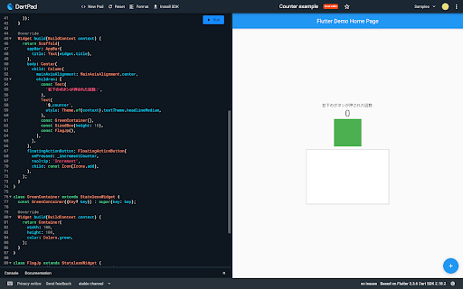

# 1. 初めに

今回の勉強会では、DartPad という公式のオンライン IDE を使って、TODO アプリを作っていきます。

※先に [国旗作り](./README.md) をやることを推奨します。

DartPad → https://dartpad.dev

## 1-1. 今日のゴール

- StatefulWidget と StatelessWidget の違いがわかること
- カスタム Widget が作成できること
- Container, Column, Row などのよく出てくる Widget の使い方がわかること
- setState の使い方がわかること

# 2. statelessWidget と statefulWidget

UI の作成方法について分かれば次は Widget についてもう少し詳しく説明します。[Widget とは？](./README.md##-4-1.-Widget-とは？)で説明したように状態（state）を必要とする StatefulWidget と 必要としない StatelessWidget があります。
最初に動かした「Hello World」と出てくるだけのアプリでは、時間経過やユーザーの操作に応じて UI が変わることがありませんね。
そういった一度構築したらその後は変化しないものについては、StatelessWidget を使用します。

一方で、今動かしているカウントアプリでは、ユーザーが+ボタンを押すたび、押した回数を表示を増やしていく必要があります。
このような、UI が動的に変化する必要があるものについては、StatefulWidget を使用します。

StatefulWidget は変更可能な状態を別の State クラスに保存します。
すべての StatefulWidget は必ず、createState() メソッドをオーバーライドして、State クラスを返すように実装する必要があります。
下記の例では、Fuga という StatefulWidget で、\_FugaState という State を createState() で返すようにしています。
そして、その \_FugaState の中でチェックボックスがチェックされているかどうかを示す、isChecked という bool 値( true / false )を状態として持っています。
この状態をただ更新するだけでは、UI は更新されません。状態を更新する場合は、setState(() {}) メソッドを叩きます。
UI を更新して setState を行うと、必要な部分の UI が再構築(リビルド)されます。

```dart
// StatelessWidgetでは、状態がないのでbuildメソッドもWidgetクラスに直接書く
class Hoge extends StatelessWidget {
  Hoge({super.key});

  @override
  Widget build(BuildContext context) {
    return Container();
  }
}

// StatefulWidgetでは、状態のクラス(State)を作成して、状態もbuildメソッドもそちらのクラスに記入する
class Fuga extends StatefulWidget {
  Fuga({super.key});

  @override
  State<Fuga> createState() => _FugaState();
}

class _FugaState extends State<Fuga> {
  bool isChecked = false;

  @override
  Widget build(BuildContext context) {
    return Container(
      child: CheckBox(
        value: isChecked,
        onChanged: (value) {
          setState(() {
            isChecked = value;
          });
        },
      ),
    );
  }
}
```

# 3. TODO リストを作ってみよう

UI のプログラムだけこちらで実装したのでロジックを実装していきましょう。

UI プログラム -> https://gist.github.com/nabe1005/c16d824012173f85d8df521a3771b123

まず、DartPad を開いて、画面上部の「Counter example」と書いてあるタイトル部分をクリックしてください。
編集ができるはずなので、「Todo List」などの適当な名前に変えてください。
名前が変更できたら、上記 Gist のリンクからプログラムを全てコピーして、DartPad に持ってきてください。

一度、試しに動作させてみましょう。正しくプログラムが動作している場合は下記のようになるかと思います。
このプログラムは未完成で、一部機能が動作しなくなっています(意図的に該当部分のプログラムだけ未実装のままにしています)。

- チェックボックスを押しても反応しない
- やることを入力しても追加されない



## 3-1. コピーしてきたプログラムについて

では、実装に進む前に一度コピーしてきたプログラムを確認していきましょう。

Widget としては、TodoList という StatefulWidget があってこれがアプリの画面全体の Widget となっています。
持っている状態として、List<Map<String, dynamic>> 型の todoList という変数が用意されていて、サンプルとして中に 3 つほど値が入っています。
変数の型については理解できなくても OK です。todoList は json の配列になっているとイメージしてください。

この todoList がタスク一覧となっています。中身の値に着目してみると、content と isFinish という値があります。
content には入力された「タスクの内容」、isFinish には「タスクの完了状態」が設定されています。
ためしに、好きなタスクの isFinish を true にして動かしてみるとチェックボックスにチェックが入ることが確認できます。

## 3-2. タスクを完了させられるようにしよう！

早速、1 つ目の実装として、タスクを完了させられるようにしていきます。
チェックボックスを押したら、チェックをつけたり外したりできるようにして、タスクの完了・未完了を切り替えられるようにしましょう。

前のセクションで説明しましたが、タスクの完了状態は isFinish フラグで判定しています。
ひとつひとつのタスクは、52 行目からの ListView.builder() ウィジェット内の itemBuilder で表示させています。
itemBuilder で index を受け取ることができるので、53 行目で todoList から index 番のタスクを todo 変数に代入しています。

まず、チェックボックスを表示している CheckBox Widget を探してみましょう。
やや見づらいかもしれませんが、CheckBox は value, onChanged, side の 3 つのパラメータが指定されています。
value にはチェックボックスの状態を指定する値を指定します。今回は todo の isFinish が指定されています( `todo[‘isFinish’]` )。
side では枠線の指定をしていて、今回は枠線を白く・太くなるよう設定しています。

最後に onChanged ですが、名前の通りチェックボックスの値が切り替わるタイミングでこの中に書いた処理が実行されます。
引数として v を受け取っていますが、これには更新後のチェックボックスの値が代入されています。
つまり、チェックが入ってない状態でチェックボックスが押されると、v に true が入った状態で onChanged が動きます。
コメントの通り、今は何の処理も行っていませんが、ここにチェックボックスの値を更新するプログラムを書けば、チェックボックスを動かせそうですね。

ここまでの内容を使って考えると、以下のように実装すればうまく動きそうですね！

- 状態を更新するときは下記プログラムのように setState を呼びます
- isFinish が適切に更新されると、チェックボックスの状態が変わっていい感じに再描画してくれそうですね
- isFinish にはどんな値を入れたらチェックをつけたり外したりできるでしょうか？

では 1 つ目からやっていきましょう。
チェックボックスの値が切り替わるたびに動く、onChanged というパラメータを探しましょう。
上述のとおり、そこでは更新後の値 v を受け取った関数となってます。
その関数内でチェックボックスの値(状態)を更新するので、ひとまずこの中で setState を呼びます。

```dart
onChanged: (v) {
  // チェックマークを押したとき
  // 完了状態を変えるプログラムを書こう！
  setState(() {});
}
```

ではこの setState の中で isFinish の更新を行います。
CheckBox Widget の状態を指定するパラメータの value では、isFinish が使われていますが、どのように指定されてるかを確認しながら、その値を更新します。

onChanged の引数 v には、**更新後の値**が入るので、isFinish に v を代入すれば良さそうですね。

```dart
onChanged: (v) {
  // チェックマークを押したとき
  // 完了状態を変えるプログラムを書こう！
  setState(() {
    todo['isFinish'] = v;
  });
}
```

上記のように更新できたら、Run で実際にチェックボックスが動くか確認してみてください。

## 3-3. TODO を追加できるようにしよう

今度は、下のテキストフィールドから todo、やることを追加できるようにしていきます。
テキストフィールドからテキストが送信されるタイミングで書いてある内容を todoList に追加できれば良さそうですね。

テキストフィールドは、101 行目の TextField Widget で表示しています。
テキストの送信時には、onSubmitted パラメータに指定された内容が動きます。
引数には先ほどと同様 v を受け取っていますが、こちらには入力されたテキストが入っています。

この中身に、タスクを追加するコードを実装してみましょう！

### ヒント

- 先ほどと同じように、状態を更新するときは setState を使用します
- タスクは Map<String, dynamic> 型 (json)で登録します
  - todoList に入ってる初期値はどんなふうに記述されているか見てみるといいかもしれません
- 配列に要素を追加する場合は、add メソッドが使えます
  - todoList.add(追加する要素) のように書けます
- ★ TextField の中身を消す
  - TextField に指定している \_controller は TextEditingController というもので入力されているテキストをいろいろ操作できます
  - \_controller.clear(); を呼ぶと入力されているテキストが消えます

<details>
<summary>答え</summary>

onSubmitted で入力されたテキスト v を content として todoList に追加するとタスクを追加することができます。
タスクの登録時、完了状態は絶対未完了であるはずなので、isFinish を false として登録しましょう。
先ほどと同様に、状態の更新時には setState を呼ぶこと！

```dart
onSubmitted: (String v) {
  // 入力したテキストの送信時
  // 入力された文字をtodoに登録するプログラムを書こう！
  setState(() {
    todoList.add({'content': v, 'isFinish': false});
    _controller.clear();
  });
},
```

</details>

## 3-4. add メソッドの使い方

dart の List 型 (配列のことです)には、要素を追加する際のメソッド、add() が用意されています。
今回の Todo も大元は List 型となっているので、要素を追加するにはこのメソッドを使用してあげると簡単に実装することができます。

```dart
// 初期値
final hoge = [1, 2, 3];

// 4を追加してみる
hoge.add(4);

// hoge: [1, 2, 3, 4] と出力されます
print(‘hoge: $hoge’);

```

今回の Todo を保存している todoList という変数は、もう少し複雑な構造になっていますが、基本的には上記のように使用することで要素を追加することができます。

# 4. ★ 追加のカスタマイズ

上記 2 つの実装ができたら、以下の実装をやってみましょう。
実装する上では、この資料に出てきてない Widget も必要に応じて利用する必要があります。
ヒントは少なめにしています。

## 4-1. タスクを削除できるようにしよう

新しいタスクを追加できるようになりましたが、間違って入力した Todo を追加してしまったときなどに消せないのはちょっと不便ですね...。
ということで以下 2 つの方法のどちらかで実装してみてください。

### 中級編　削除用ボタンの × ボタンを配置して、タップしたら消えるようにしよう

- アイコンを設置するにはどの Widget を使えば良いでしょうか？
  - Icon Widget でもいいですが、これだとタップした時の挙動を設定することができませんね...
- アイコンはどこに置くと良いでしょう？
  - デザイン的にもプログラム的にも
- 配列から要素を削除するのはどうやれば良いでしょう？


<details>
<summary>答え</summary>

```dart
class _TodoListState extends State<TodoList> {
  @override
  Widget build(BuildContext context) {
    // ...
    // TODO 1つの UI
    child: Row(
      children: [
        Transform.scale(
          scale: 1.3,
          child: Checkbox(
            value: todo['isFinish'],
            onChanged: (v) {
            // チェックマークを押したとき
            // 完了状態を変えるプログラムを書こう！
            },
            side: const BorderSide(
            color: Colors.white,
            width: 2,
            ),
          ),
        ),
        Expanded(
          child: Text(
            todo['content'],
            style: const TextStyle(
            fontSize: 16,
            fontWeight: FontWeight.bold,
            color: Colors.white,
            ),
          ),
        ),
        IconButton(
          icon: const Icon(
            Icons.delete,
            color: Colors.white,
          ),
          onPressed: () {
            setState(() {
              todoList.removeAt(index);
            });
          },
        ),
      ],
    ),
    // ...
  }
}
```

</details>

### 上級編 画面の右から左へスワイプしたら削除できるようにしよう

- Dismissible Widget を使ってみよう
  - https://api.flutter.dev/flutter/widgets/Dismissible-class.html
- 配列から要素を削除するのはどうやれば良いでしょう？

<details>
<summary>答え</summary>

```dart
class _TodoListState extends State<TodoList> {
  @override
  Widget build(BuildContext context) {
    // ...
    child: ListView.builder(
      padding: const EdgeInsets.only(top: 16),
      itemBuilder: (context, index) {
        final todo = todoList[index];
        return Dismissible(
          background: Container(
            color: Colors.blue,
          ),
          key: ValueKey<Map<String, dynamic>>(todo),
          onDismissed: (DismissDirection direction) {
            setState(() {
              todoList.removeAt(index);
            });
          },
          child: Container(
            height: 120,
            margin: const EdgeInsets.symmetric(
              vertical: 8,
              horizontal: 8,
            ),
            padding: const EdgeInsets.symmetric(horizontal: 16),
              decoration: BoxDecoration(
                color: Colors.amber[800],
                borderRadius: BorderRadius.circular(24),
              ),
            child: // ...
          ),
        );
      }
    ),
  }
}
```

</details>

# 5. おわり

お疲れ様でした！
ひとまず、TODO リストが完成しました。しかし、動作としてはまだまだ必要最低限です。

- タスク 一覧をアプリの状態としてしか保持していないので、アプリを再起動するとタスクが消えます
- タスクの編集・削除
- 期日の設定

などなど、やれることはまだまだたくさん残っています。

今回は特に触れませんでしたが、UI もあまりカスタマイズしてないままなので、上記の内容と合わせて調べてみたり作り込んでみてください。

<details>
<summary>完成コード</summary>

```dart
import 'package:flutter/material.dart';

void main() {
  runApp(const MyApp());
}

class MyApp extends StatelessWidget {
  const MyApp({super.key});

  @override
  Widget build(BuildContext context) {
    return MaterialApp(
      title: 'Study TODO',
      theme: ThemeData(
        useMaterial3: true,
        colorSchemeSeed: Colors.amber,
      ),
      home: const TodoList(),
    );
  }
}

class TodoList extends StatefulWidget {
  const TodoList({super.key});

  @override
  State<TodoList> createState() => _TodoListState();
}

class _TodoListState extends State<TodoList> {
  final _controller = TextEditingController();
  List<Map<String, dynamic>> todoList = [
    {'content': 'TODOリストにToDoを追加できるようにする', 'isFinish': false},
    {'content': 'StatefulWidgetの使い方がわかる', 'isFinish': false},
    {'content': 'jig.jpがどんな会社かわかる', 'isFinish': false},
  ];

  @override
  Widget build(BuildContext context) {
    final today = DateTime.now();
    return Scaffold(
      resizeToAvoidBottomInset: true,
      appBar: AppBar(title: Text('${today.month}/${today.day} Flutter勉強会')),
      body: Padding(
        padding: EdgeInsets.only(
          bottom: MediaQuery.of(context).padding.bottom + 8,
        ),
        child: Column(
          children: [
            Expanded(
              child: ListView.builder(
                padding: const EdgeInsets.only(top: 16),
                itemBuilder: (context, index) {
                  final todo = todoList[index];
                  return Dismissible(
                    background: Container(
                      color: Colors.blue,
                    ),
                    key: ValueKey<Map<String, dynamic>>(todo),
                    onDismissed: (DismissDirection direction) {
                      setState(() {
                        todoList.removeAt(index);
                      });
                    },
                    child: Container(
                      height: 120,
                      margin: const EdgeInsets.symmetric(
                        vertical: 8,
                        horizontal: 8,
                      ),
                      padding: const EdgeInsets.symmetric(horizontal: 16),
                      decoration: BoxDecoration(
                        color: Colors.amber[800],
                        borderRadius: BorderRadius.circular(24),
                      ),
                      child: Row(
                        children: [
                          Transform.scale(
                            scale: 1.3,
                            child: Checkbox(
                              value: todo['isFinish'],
                              onChanged: (v) {
                                // チェックマークを押したとき
                                // 完了状態を変えるプログラムを書こう！
                              },
                              side: const BorderSide(
                                color: Colors.white,
                                width: 2,
                              ),
                            ),
                          ),
                          Expanded(
                            child: Text(
                              todo['content'],
                              style: const TextStyle(
                                fontSize: 16,
                                fontWeight: FontWeight.bold,
                                color: Colors.white,
                              ),
                            ),
                          ),
                          IconButton(
                            icon: const Icon(
                              Icons.delete,
                              color: Colors.white,
                            ),
                            onPressed: () {
                              setState(() {
                                todoList.removeAt(index);
                              });
                            },
                          ),
                        ],
                      ),
                    ),
                  );
                },
                itemCount: todoList.length,
              ),
            ),
            const SizedBox(height: 8),
            Padding(
              padding: const EdgeInsets.symmetric(horizontal: 16),
              child: TextField(
                controller: _controller,
                onSubmitted: (String v) {
                  // 入力したテキストの送信時
                  // 入力された文字をtodoに登録するプログラムを書こう！
                },
                decoration: InputDecoration(
                  labelText: 'やることを入力してください',
                  enabledBorder: OutlineInputBorder(
                    borderRadius: BorderRadius.circular(16),
                    borderSide: const BorderSide(
                      color: Colors.amber,
                      width: 2,
                    ),
                  ),
                  focusedBorder: OutlineInputBorder(
                    borderRadius: BorderRadius.circular(16),
                    borderSide: const BorderSide(
                      color: Colors.amber,
                      width: 2,
                    ),
                  ),
                ),
              ),
            ),
          ],
        ),
      ),
    );
  }
}
```

</details>
