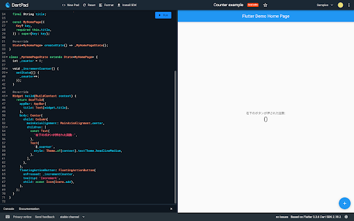
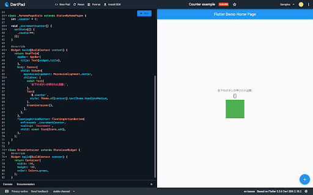

# 1. 初めに

今回の勉強会では、DartPad という公式のオンライン IDE を使って、国旗を表示するアプリを作っていきます。

DartPad → https://dartpad.dev

## 1-1. 今日のゴール

- Dartpad で Dart と Flutter のプログラムが実行できること
- Widget とは何かを理解できること
- カスタム Widget が作成できること
- Container, Column, Row などのよく出てくる Widget の使い方がわかること

## 1-2. Flutter とは

Flutter とは、Google が提供するマルチプラットフォームアプリケーションを構築するためのフレームワークです。
開発言語として Dart を採用しています。

Flutter 開発での嬉しい点としては、

- クロスプラットフォーム対応
- 宣言的で Widget ベースな UI 構造
- ホットリロード・ホットリスタート

などが挙げられます。

# 2. DartPad に慣れてみよう

## 2-1. DartPad で Dart を動かしてみよう

まずは、DartPad 上で Dart が動くことを確認してみます。

DartPad を開いて、下記の通りに操作してみましょう。

1. 画面上部の New Pad をクリック
2. Dart の方を選ぶ
   - このとき、html のスイッチはオフのまま！
3. 画面左側に for 文の入ったプログラムが出てくるのを確認
4. プログラムの右上にある青い Run ボタンをクリック

ここまで完了すると、以下のようにプログラムが入力された状態になります。


プログラム通り、右側の Console に「hello 1」から「hello 5」と表示されることを確認しましょう。

## 2-2. DartPad で Flutter アプリを動かしてみよう

今度は、DartPad 上で Flutter アプリを動かしてみます。
先ほどと同じように「New Pad」から Flutter を選択して、表示されたプログラムを実行します。

右側のエリアが Console ではなく UI Output に変わり、画面中央に「Hello, world!」と表示されれば OK です。


# 3. Flutter のついて理解しよう

## 3-1. Widget とは？

Widget は、Flutter の UI を構築するためのパーツのことです。
さまざまな Widget を組み合わせていくことで、UI を作っていきます。

今回のカウンターアプリだと、以下の Widget を用いて UI が構築されています。

- MyApp: アプリ全体の Widget (自作)
- MaterialApp: マテリアルデザイン用の Widget
- MyHomePage: カウンターやボタンを表示する Widget (自作)
- Scaffold: 画面構成を定める Widget
- AppBar: アプリケーションバー用の Widget
- Center: 中央寄せにする Widget
- Text: テキストを表示する Widget
- FloatingActionButton: アクションボタン用の Widget
- Icon: アイコンを表示する Widget

Flutter は宣言的 UI のフレームワークなので、Widget による UI 構築が簡単です。

公式ドキュメントでは、以下の図を用いて説明されています。
Widget は、アプリの状態を表示するための設計図とも捉えられ、状態( state )が与えられると、Widget の build メソッドが UI を構築します。

この状態( state )を必要とする Widget は StatefulWidget 、必要としないものは StatelessWidget を用いて作成していきます。

<center><a href="https://docs.flutter.dev/development/data-and-backend/state-mgmt/declarative" >公式ドキュメント</a></center>


## 3-2. テンプレートプロジェクトで遊んでみよう

DartPad 右上の Samples から、Counter を選択して実行してみましょう。


このアプリは、右下の＋ボタンをタップした回数をカウントするアプリで、Flutter の新規プロジェクトを作成すると、このプログラムが入っています。
実際に右下のボタンをタップ(今回は PC なのでクリック)すると中央の数値が更新されるのを確認してみてください。

## 3-3. ラベルを日本語に変えてみる

プログラムの中から、「You have pushed the button this many times:」を表示している Text Widget を探して、「右下のボタンが押された回数:」に変えてみましょう。
DartPad にはホットリロードは搭載されていないので、変えたら Run ボタンで再度実行します。



## 3-4. カスタム Widget で遊んでみよう

前述のとおり、Flutter には標準でいろいろな Widget が用意されていています。
この Widget を組み合わせたり、特定の振る舞いを持たせるカスタム Widget を作成することもできます。
ということで、GreenContainer という緑色の縦横それぞれ 100px のコンテナ(箱)の Widget を実装して、カウンターアプリに追加してみましょう。

まず新しい Widget の雛形を作ります。
以下のコードをプログラムの一番下に追加してください。

```dart
class GreenContainer extends StatelessWidget {
  const GreenContainer({Key? key}) : super(key: key);

  @override
  Widget build(BuildContext context) {
        return Container();
  }
}
```

使用している Widget について軽く説明すると、今回は状態を持たないので StatelessWidget を使用しています。
Container は名前通りただのコンテナです。HTML の div のように領域を確保したり、内包した Widget をカスタマイズするのに使用する Widget です。

続いて、Container に色と大きさを指定します。
やり方はシンプルで width, height, color を Container に指定します。

```dart
class GreenContainer extends StatelessWidget {
  const GreenContainer({Key? key}) : super(key: key);

  @override
  Widget build(BuildContext context) {
    return Container(
      width: 100,
      height: 100,
      color: Colors.green,
    );
  }
}
```

これで GreenContainer は完成です。
右側のアプリで表示できるように、回数を表示している Text が入っている Column Widget の中に GreenContainer を追加します。

```dart
        child: Column(
          mainAxisAlignment: MainAxisAlignment.center,
          children: [
            const Text(
              '右下のボタンが押された回数:',
            ),
            Text(
              '$_counter',
              style: Theme.of(context).textTheme.headlineMedium,
            ),
            const GreenContainer(),
          ],
        ),
```

緑の箱が作れていれば OK です。



## 3-5. スクロールできるようにする

このまま、Column の中にたくさんの Widget が置かれると画面からはみ出して Overflow とエラーが出てしまうので、国旗を設置する前に少し対策します。
今、50 行目付近からは以下のコードのようになっています。

```dart
     body: Center(
       child: Column(
         mainAxisAlignment: MainAxisAlignment.center,
           children: [
             const Text(
               '右下のボタンが押された回数:',
             ),
```

この body の一番上に SingleChildScrollView という Widget を追加します。
この Widget は、子要素をスクロールできるようにする Widget です。
下記のように一番上の要素として SingleChildScrollView があれば OK です(閉じ括弧を忘れずに！)。

```dart
      body: SingleChildScrollView(
        child: Center(
          child: Column(
            mainAxisAlignment: MainAxisAlignment.center,
            children: [
              const Text(
                '右下のボタンが押された回数:',
              ),
```

# 4. 国旗を作ってみる

カスタム Widget の作り方がわかったところで、本題の国旗を表示するアプリを作っていきましょう！
まず、国旗を表示する Widget の作成を行います。

## 4-1. 日本

はじめに、日本の国旗を作ってみましょう。
Wikipedia を調べてみると、以下のように記載があります。

> 「国旗及び国歌に関する法律」（通称：国旗・国歌法）の規定によれば、「旗の形は縦が横の 3 分の 2 の長方形。日章の直径は縦の 5 分の 3 で中心は旗の中心。地色は白色、日章は紅色」とされている。上下・左右対称である。

https://ja.wikipedia.org/wiki/%E6%97%A5%E6%9C%AC%E3%81%AE%E5%9B%BD%E6%97%97

### FlagJp Widget の作成

まずは空の Widget を作成してみましょう。
先ほどと同じように末尾に FlagJp という名前の空の Widget を作成してみます。

```dart
class FlagJp extends StatelessWidget {
  const FlagJp({Key? key}) : super(key: key);

  @override
  Widget build(BuildContext context) {
    return Container();
  }
}
```

続いて、旗の枠を作って配置していきます。
縦横比が 2:3 となるように、幅を 300、高さを 200 で指定してみましょう。
また、BoxDecoration というパラメータを使用して枠線を追加してみます。

```dart
class FlagJp extends StatelessWidget {
  const FlagJp({Key? key}) : super(key: key);

  @override
  Widget build(BuildContext context) {
    return Container(
      width: 300,
      height: 200,
      decoration: BoxDecoration(
        color: Colors.white,
        border: Border.all(color: Colors.grey),
      ),
    );
  }
}
```

ここまでできたら、GreenContainer() の下に追加して、実行してみましょう。

```dart
        child: Column(
          mainAxisAlignment: MainAxisAlignment.center,
          children: [
            const Text(
              '右下のボタンが押された回数:',
            ),
            Text(
              '$_counter',
              style:　Theme.of(context).textTheme.headlineMedium,
            ),
            const GreenContainer(),
            const SizedBox(height: 10),
            const FlagJp(),
          ],
        ),
```

旗のベースが表示できていれば OK です。


### 日の丸を作る

FlagJp Widget の Container に色々追加して日の丸を作ってみましょう。

- 日の丸の仕様は下記の通りです。
- 日の丸の直径は高さの 5 分の 3 ( 60% )
- 旗の中心に配置される
- 色は紅色( #C22047 )

以下は実装のヒントです。

- Container の中に描画する Widget は child に指定します
- Container を丸くさせるには BoxDecoration() の shape パラメータに BoxShape.circle を指定します
- 紅色は Color(0xffc22047) で指定することができます
  - ff は不透明度の hex です( 100% )
- Container の alignment に Alignment.center を指定すると子要素が中央に配置できます

<details>
<summary>答え</summary>

```dart
class FlagJp extends StatelessWidget {
  const FlagJp({Key? key}) : super(key: key);

  @override
  Widget build(BuildContext context) {
    return Container(
      width: 300,
      height: 200,
      decoration: BoxDecoration(
        color: Colors.white,
        border: Border.all(color: Colors.grey),
      ),
      // 子Widgetをセンタリングする
      alignment: Alignment.center,
      // 子Widgetに赤い丸を描画するWidgetを追加
      child: Container(
        width: 120,
        height: 120,
        decoration: const BoxDecoration(
          color: Colors.red,
          shape: BoxShape.circle,
        ),
      ),
    );
  }
}
```

</details>

## 4-2. ドイツ

次はドイツ国旗を作ってみましょう。
仕様は下記の通りです。

- 縦横比は 3:5
- 横は日本国旗と合わせて 300 とする
- 黒: #000000, 赤: #ED1A3D, 金: #FFD700

以下は実装のヒントです。

- 日本国旗と同じく FlagDe Widget を作成する形で作ってみよう
- 日本国旗と同じく、ベースとして枠を作ってその中に実装していくのがオススメです。まず枠を作って表示するところから始めてみよう！
- 横が 300 なら縦 & それぞれの色の高さはいくつになるか考えてみよう
- 実はすでに使われていますが、要素を縦に並べるときは Column Widget を使用します。
  - 使い方の一例を以下に示します
  - 以下のコードでは、赤い 100px の Container と青い 60px の Container が縦に並びます

<details>
<summary>答え</summary>

```dart
class FlagDe extends StatelessWidget {
  const FlagDe({Key? key}) : super(key: key);

  @override
  Widget build(BuildContext context) {
    return SizedBox(
      width: 300,
      child: Column(
        children: [
          Container(height: 60, color: Colors.black),
          Container(height: 60, color: const Color(0xffed1a3d)),
          Container(height: 60, color: const Color(0xffffd700)),
        ],
      ),
    );
  }
}
```

</details>

## 4-3. フランス

フランス国旗も作ってみましょう。
仕様は下記の通りです。

- 縦横比は 2:3
- 横は日本国旗と合わせて 300 とする
- 青: #002395、赤: #ED2939

以下は実装のヒントです。

- 日本、ドイツと同じように FlagFr Widget を作成する形で作ってみよう
- 日本国旗と同じく、ベースとして枠を作ってその中に実装していくのがオススメです。まず枠を作って表示するところから始めてみよう！
- 横が 300 なら縦 & それぞれの色の幅はいくつになるか考えてみよう
- 要素を横に並べるときは Row Widget を使用します。

  - 使い方の一例を以下に示します
  - 書き方は Column とほぼ一緒です
  - 以下のコードでは、赤い 100px の Container と青い 60px の Container が横に並びます

<details>
<summary>答え</summary>

```dart
class FlagFr extends StatelessWidget {
  const FlagFr({Key? key}) : super(key: key);

  @override
  Widget build(BuildContext context) {
    return SizedBox(
      width: 300,
      height: 200,
      child: Row(
        children: [
          Container(width: 100, color: const Color(0xff002395)),
          Container(width: 100, color: Colors.white),
          Container(width: 100, color: const Color(0xffED2939)),
        ],
      ),
    );
  }
}
```

</details>

# 5. gist でコードを共有しよう

DartPad 上のコードは基本的にリロードすると消えてしまいます。
このコードを保存したり、他人が見れるよう共有するには、gist を使用します。
gist は github のサービスの一つで、断片的なソースコードを共有できるものです。
Github Gist -> https://gist.github.com

下記のリンクで実際に今日の勉強会で使用したコードを Gist にアップロードしています。
https://gist.github.com/takerucam/45c9195855022af5bc44fff84261ae33

DartPad では、DartPad 上から簡単にコードを共有できるようになっているので、実際に共有してみましょう。
まず、右上の Github アイコンをクリックすると出てくるメニューから、「Login to Github」を選択してログインします。
ログインできたら、Create Public / Private Gist のどちらか選ぶと、共有ができます。

以降は、コードやタイトル(画面上部の vagrant-destiny-6740 みたいなやつ)を変更したら、メニューから Update Gist を選択することで変更を保存することができます。
共有した Gist は、メニューの「Open Gist on Github」から確認することができます。

# 6. 課題

難易度：S ランク！アメリカの国旗を作ってみよう！

[星条旗の仕様](https://americancenterjapan.com/aboutusa/profile/2770/)をもとにアメリカ国旗を Flutter で作ってみてください。

<details>
<summary>答え</summary>

https://gist.github.com/takerucam/a3daeb4def5ba1627dbaf8dcc52221d2

</details>
