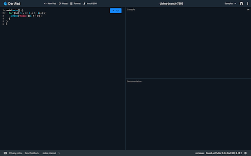

# 1. 初めに

今回の勉強会では、DartPad という公式のオンライン IDE を使って、TODO アプリを作っていきましょう！

DartPad → https://dartpad.dev

## 1-1. 今日のゴール

- StatefulWidget と StatelessWidget の違いがわかること
- カスタム Widget が作成できること
- Container, Column, Row などのよく出てくる Widget の使い方がわかること
- setState の使い方がわかること

## 1-2. Flutter とは

Flutter とは、Google が提供するマルチプラットフォームアプリケーションを構築するためのフレームワークです。
開発言語として Dart を採用しています。

Flutter 開発での嬉しい点としては、

- クロスプラットフォーム対応
- 宣言的で Widget ベースな UI 構造
- ホットリロード・ホットリスタート

などが挙げられます。

# 2. DartPad に慣れてみよう

## 2-1. DartPad で Dart を動かしてみよう

まずは、DartPad 上で Dart が動くことを確認してみます。

DartPad を開いて、下記の通りに操作してみましょう。

1. 画面上部の New Pad をクリック
2. Dart の方を選ぶ
   - このとき、html のスイッチはオフのまま！
3. 画面左側に for 文の入ったプログラムが出てくるのを確認
4. プログラムの右上にある青い Run ボタンをクリック

ここまで完了すると、以下のようにプログラムが入力された状態になります。



プログラム通り、右側の Console に「hello 1」から「hello 5」と表示されることを確認しましょう。

## 2-2. DartPad で Flutter アプリを動かしてみよう

今度は、DartPad 上で Flutter アプリを動かしてみます。
先ほどと同じように「New Pad」から Flutter を選択して、表示されたプログラムを実行します。

右側のエリアが Console ではなく UI Output に変わり、画面中央に「Hello, world!」と表示されれば OK です。


# 3. Flutter の Widget について

## 3-1. Widget について

Widget は、Flutter の UI を構築するためのパーツのことです。
さまざまな Widget を組み合わせていくことで、UI を作っていきます。

## 3-2. プログラムで確認

DartPad 右上の Samples から、Counter を選択して実行してみましょう。  
このアプリは名前の通り、右下の＋ボタンをタップした回数をカウントするアプリです。


今回のカウンターアプリだと、以下の Widget を用いて UI が構築されています。  

- MyApp: アプリ全体の Widget (自作)
- MaterialApp: マテリアルデザイン用の Widget
- MyHomePage: カウンターやボタンを表示する Widget (自作)
- Scaffold: 画面構成を定める Widget
- AppBar: アプリケーションバー用の Widget
- Center: 中央寄せにする Widget
- Text: テキストを表示する Widget
- FloatingActionButton: アクションボタン用の Widget
- Icon: アイコンを表示する Widget

このように、FlutterのUIは Widget の中に Widget を配置しながら実装します。

## 3-2. StatelessWidget と StatefulWidget

Widget について、大きく2つに分けられます。
`StatelessWidget` と `StatefulWidget` です。

結論から言えば、これらは **状態(state)** を必要とするかどうかで使い分けます。

例えば、最初に動かした「Hello World」と出てくるだけのアプリでは、時間経過やタップなどの操作に応じて UI が変わることがありません。**1回表示したらその後は変化しないWidget**については、`StatelessWidget` を使用します。  

一方で、今動かしているカウントアプリでは、ユーザーが+ボタンを押すたび、押した回数を表示を増やしていく必要があります。
このような、**表示が変化するWidget**は、`StatefulWidget` を使用します。

## 3-3. StatelessWidget を使った Widget の作り方

ここからは、実際にプログラムの書き方について説明します。  
StatelessWidget を使用した Widget は下記のように書きます。

```dart
class Hoge extends StatelessWidget {
  Hoge({super.key});

  @override
  Widget build(BuildContext context) {
    return Container();
  }
}
```

プログラムだけ見ると、難しそうに見えますが大事なのは2つだけです。

- `Hoge` というWidget名
- `build(BulidContext context)`の中
  - `return Container();`

今回は `Hoge` という名前の Widget を作っているので、仮に `GreenContainer` というWidget を作りたければ、`Hoge` を全て `GreenContainer` に変えればいいです。

build の中に、この Widget が表示したいものを書いていきます。  
この中にも Widget を使って実装していきます。

他の部分は、一旦おまじないだと思ってもらえればいいです。  
わかる人向けですが、StatelessWidget を継承した Hoge クラスを作成、build メソッドをオーバーライドすることで Widget を配置しています。

## 3-3. StatefulWidget を使った Widget の作り方

StatefulWidgetはおまじない部分が少し複雑です。

```dart
// StatefulWidgetでは、状態のクラス(State)を作成して、状態もbuildメソッドもそちらのクラスに記入する
class Fuga extends StatefulWidget {
  Fuga({super.key});

  @override
  State<Fuga> createState() => _FugaState();
}

class _FugaState extends State<Fuga> {
  bool isChecked = false;

  @override
  Widget build(BuildContext context) {
    return Container(
      child: CheckBox(
        value: isChecked,
        onChanged: (value) {
          setState(() {
            isChecked = value;
          });
        },
      ),
    );
  }
}
```

難しそうですね。こちらも大事な部分だけ抜き出します。

- `Fuga` というWidget名
- `_FugaState()` というState名
  - State クラスの名前は、_(Widget名)State とします
- `State` の中
- `build()` の中

StatefulWidget は状態(state)を持つと説明しましたが、これを State クラスに保存します。  
この都合で、build メソッドも State クラスにあります。

この Widget では state は、isChecked という bool 値 (true / false)です。  
このように State クラスの中に書きます。

```dart
bool isChecked = false;
```

<details>
<summary>わかる人向けの解説</summary>

この状態を持つために、StatefulWidget は必ず、createState() メソッドをオーバーライドして、State クラスを返すように実装する必要があります。  
下記の例では、Fuga という StatefulWidget で、\_FugaState という State を createState() で返すようにしています。  
そして、その \_FugaState の中でチェックボックスがチェックされているかどうかを示す、isChecked という bool 値( true / false )を状態として持っています。  
この状態をただ更新するだけでは、UI は更新されません。状態を更新する場合は、setState(() {}) メソッドを叩きます。  
UI を更新して setState を行うと、必要な部分の UI が再構築(リビルド)されます。

</details>

# 4. TODO リストを作ってみよう

UI のプログラムだけこちらで実装したのでロジックを実装していきましょう。

UI プログラム -> https://gist.github.com/nabe1005/c16d824012173f85d8df521a3771b123

まず、DartPad を開いて、画面上部の「Counter example」と書いてあるタイトル部分をクリックしてください。
編集ができるはずなので、「Todo List」などの適当な名前に変えてください。
名前が変更できたら、上記 Gist のリンクからプログラムを全てコピーして、DartPad に持ってきてください。

一度、試しに動作させてみましょう。正しくプログラムが動作している場合は下記のようになるかと思います。
このプログラムは未完成で、一部機能が動作しなくなっています(意図的に該当部分のプログラムだけ未実装のままにしています)。

- チェックボックスを押しても反応しない
- やることを入力しても追加されない


## 4-1. コピーしてきたプログラムについて

では、実装に進む前に一度コピーしてきたプログラムを確認していきましょう。

Widget としては、TodoList という StatefulWidget があってこれがアプリの画面全体の Widget となっています。
持っている状態として、List<Map<String, dynamic>> 型の todoList という変数が用意されていて、サンプルとして中に 3 つほど値が入っています。
変数の型については理解できなくても OK です。todoList は json の配列になっているとイメージしてください。

この todoList がタスク一覧となっています。中身の値に着目してみると、content と isFinish という値があります。
content には入力された「タスクの内容」、isFinish には「タスクの完了状態」が設定されています。
ためしに、好きなタスクの isFinish を true にして動かしてみるとチェックボックスにチェックが入ることが確認できます。

## 4-2. タスクを完了させられるようにしよう！

早速、1 つ目の実装として、タスクを完了させられるようにしていきます。
チェックボックスを押したら、チェックをつけたり外したりできるようにして、タスクの完了・未完了を切り替えられるようにしましょう。

前のセクションで説明しましたが、タスクの完了状態は isFinish フラグで判定しています。
ひとつひとつのタスクは、52 行目からの ListView.builder() ウィジェット内の itemBuilder で表示させています。
itemBuilder で index を受け取ることができるので、53 行目で todoList から index 番のタスクを todo 変数に代入しています。

まず、チェックボックスを表示している CheckBox Widget を探してみましょう。
やや見づらいかもしれませんが、CheckBox は value, onChanged, side の 3 つのパラメータが指定されています。
value にはチェックボックスの状態を指定する値を指定します。今回は todo の isFinish が指定されています( `todo[‘isFinish’]` )。
side では枠線の指定をしていて、今回は枠線を白く・太くなるよう設定しています。

最後に onChanged ですが、名前の通りチェックボックスの値が切り替わるタイミングでこの中に書いた処理が実行されます。
引数として v を受け取っていますが、これには更新後のチェックボックスの値が代入されています。
つまり、チェックが入ってない状態でチェックボックスが押されると、v に true が入った状態で onChanged が動きます。
コメントの通り、今は何の処理も行っていませんが、ここにチェックボックスの値を更新するプログラムを書けば、チェックボックスを動かせそうですね。

ここまでの内容を使って考えると、以下のように実装すればうまく動きそうですね！

- 状態を更新するときは下記プログラムのように setState を呼びます
- isFinish が適切に更新されると、チェックボックスの状態が変わっていい感じに再描画してくれそうですね
- isFinish にはどんな値を入れたらチェックをつけたり外したりできるでしょうか？

では 1 つ目からやっていきましょう。
チェックボックスの値が切り替わるたびに動く、onChanged というパラメータを探しましょう。
上述のとおり、そこでは更新後の値 v を受け取った関数となってます。
その関数内でチェックボックスの値(状態)を更新するので、ひとまずこの中で setState を呼びます。

```dart
onChanged: (v) {
  // チェックマークを押したとき
  // 完了状態を変えるプログラムを書こう！
  setState(() {});
}
```

ではこの setState の中で isFinish の更新を行います。
CheckBox Widget の状態を指定するパラメータの value では、isFinish が使われていますが、どのように指定されてるかを確認しながら、その値を更新します。

onChanged の引数 v には、**更新後の値**が入るので、isFinish に v を代入すれば良さそうですね。

```dart
onChanged: (v) {
  // チェックマークを押したとき
  // 完了状態を変えるプログラムを書こう！
  setState(() {
    todo['isFinish'] = v;
  });
}
```

上記のように更新できたら、Run で実際にチェックボックスが動くか確認してみてください。

## 4-3. TODO を追加できるようにしよう

今度は、下のテキストフィールドから todo、やることを追加できるようにしていきます。
テキストフィールドからテキストが送信されるタイミングで書いてある内容を todoList に追加できれば良さそうですね。

テキストフィールドは、101 行目の TextField Widget で表示しています。
テキストの送信時には、onSubmitted パラメータに指定された内容が動きます。
引数には先ほどと同様 v を受け取っていますが、こちらには入力されたテキストが入っています。

この中身に、タスクを追加するコードを実装してみましょう！

### ヒント

- 先ほどと同じように、状態を更新するときは setState を使用します
- タスクは Map<String, dynamic> 型 (json)で登録します
  - todoList に入ってる初期値はどんなふうに記述されているか見てみるといいかもしれません
- 配列に要素を追加する場合は、add メソッドが使えます
  - todoList.add(追加する要素) のように書けます
- ★ TextField の中身を消す
  - TextField に指定している \_controller は TextEditingController というもので入力されているテキストをいろいろ操作できます
  - \_controller.clear(); を呼ぶと入力されているテキストが消えます

<details>
<summary>答え</summary>

onSubmitted で入力されたテキスト v を content として todoList に追加するとタスクを追加することができます。
タスクの登録時、完了状態は絶対未完了であるはずなので、isFinish を false として登録しましょう。
先ほどと同様に、状態の更新時には setState を呼ぶこと！

```dart
onSubmitted: (String v) {
  // 入力したテキストの送信時
  // 入力された文字をtodoに登録するプログラムを書こう！
  setState(() {
    todoList.add({'content': v, 'isFinish': false});
    _controller.clear();
  });
},
```

</details>

## 4-4. add メソッドの使い方

dart の List 型 (配列のことです)には、要素を追加する際のメソッド、add() が用意されています。
今回の Todo も大元は List 型となっているので、要素を追加するにはこのメソッドを使用してあげると簡単に実装することができます。

```dart
// 初期値
final hoge = [1, 2, 3];

// 4を追加してみる
hoge.add(4);

// hoge: [1, 2, 3, 4] と出力されます
print(‘hoge: $hoge’);

```

今回の Todo を保存している todoList という変数は、もう少し複雑な構造になっていますが、基本的には上記のように使用することで要素を追加することができます。

# 5. ★ 追加のカスタマイズ

上記 2 つの実装ができたら、以下の実装をやってみましょう。
実装する上では、この資料に出てきてない Widget も必要に応じて利用する必要があります。
ヒントは少なめにしています。

## 5-1. タスクを削除できるようにしよう

新しいタスクを追加できるようになりましたが、間違って入力した Todo を追加してしまったときなどに消せないのはちょっと不便ですね...。
ということで以下 2 つの方法のどちらかで実装してみてください。

### 中級編　削除用ボタンの × ボタンを配置して、タップしたら消えるようにしよう

- アイコンを設置するにはどの Widget を使えば良いでしょうか？
  - Icon Widget でもいいですが、これだとタップした時の挙動を設定することができませんね...
- アイコンはどこに置くと良いでしょう？
  - デザイン的にもプログラム的にも
- 配列から要素を削除するのはどうやれば良いでしょう？


<details>
<summary>答え</summary>

```dart
class _TodoListState extends State<TodoList> {
  @override
  Widget build(BuildContext context) {
    // ...
    // TODO 1つの UI
    child: Row(
      children: [
        Transform.scale(
          scale: 1.3,
          child: Checkbox(
            value: todo['isFinish'],
            onChanged: (v) {
            // チェックマークを押したとき
            // 完了状態を変えるプログラムを書こう！
            },
            side: const BorderSide(
            color: Colors.white,
            width: 2,
            ),
          ),
        ),
        Expanded(
          child: Text(
            todo['content'],
            style: const TextStyle(
            fontSize: 16,
            fontWeight: FontWeight.bold,
            color: Colors.white,
            ),
          ),
        ),
        // ゴミ箱のアイコンを追加
        IconButton(
          icon: const Icon(
            Icons.delete,
            color: Colors.white,
          ),
          onPressed: () {
            setState(() {
              todoList.removeAt(index);
            });
          },
        ),
        // ここまで
      ],
    ),
    // ...
  }
}
```

</details>

### 上級編 画面の右から左へスワイプしたら削除できるようにしよう

- Dismissible Widget を使ってみよう
  - https://api.flutter.dev/flutter/widgets/Dismissible-class.html
- 配列から要素を削除するのはどうやれば良いでしょう？

<details>
<summary>答え</summary>

```dart
class _TodoListState extends State<TodoList> {
  @override
  Widget build(BuildContext context) {
    // ...
    child: ListView.builder(
      padding: const EdgeInsets.only(top: 16),
      itemBuilder: (context, index) {
        final todo = todoList[index];
        // Dismissible Widget で Container Widget をラップする
        return Dismissible(
          background: Container(
            color: Colors.blue,
          ),
          key: ValueKey<Map<String, dynamic>>(todo),
          onDismissed: (DismissDirection direction) {
            setState(() {
              todoList.removeAt(index);
            });
          },
          child: Container(
            height: 120,
            margin: const EdgeInsets.symmetric(
              vertical: 8,
              horizontal: 8,
            ),
            padding: const EdgeInsets.symmetric(horizontal: 16),
              decoration: BoxDecoration(
                color: Colors.amber[800],
                borderRadius: BorderRadius.circular(24),
              ),
            child: // ...
          ),
        );
      }
    ),
  }
}
```

</details>

# 6. おわり

お疲れ様でした！
ひとまず、TODO リストが完成しました。しかし、動作としてはまだまだ必要最低限です。

- タスク 一覧をアプリの状態としてしか保持していないので、アプリを再起動するとタスクが消えます
- タスクの編集・削除
- 期日の設定

などなど、やれることはまだまだたくさん残っています。

今回は特に触れませんでしたが、UI もあまりカスタマイズしてないままなので、上記の内容と合わせて調べてみたり作り込んでみてください。

<details>
<summary>完成コード</summary>

```dart
import 'package:flutter/material.dart';

void main() {
  runApp(const MyApp());
}

class MyApp extends StatelessWidget {
  const MyApp({super.key});

  @override
  Widget build(BuildContext context) {
    return MaterialApp(
      title: 'Study TODO',
      theme: ThemeData(
        useMaterial3: true,
        colorSchemeSeed: Colors.amber,
      ),
      home: const TodoList(),
    );
  }
}

class TodoList extends StatefulWidget {
  const TodoList({super.key});

  @override
  State<TodoList> createState() => _TodoListState();
}

class _TodoListState extends State<TodoList> {
  final _controller = TextEditingController();
  List<Map<String, dynamic>> todoList = [
    {'content': 'TODOリストにToDoを追加できるようにする', 'isFinish': false},
    {'content': 'StatefulWidgetの使い方がわかる', 'isFinish': false},
    {'content': 'jig.jpがどんな会社かわかる', 'isFinish': false},
  ];

  @override
  Widget build(BuildContext context) {
    final today = DateTime.now();
    return Scaffold(
      resizeToAvoidBottomInset: true,
      appBar: AppBar(title: Text('${today.month}/${today.day} Flutter勉強会')),
      body: Padding(
        padding: EdgeInsets.only(
          bottom: MediaQuery.of(context).padding.bottom + 8,
        ),
        child: Column(
          children: [
            Expanded(
              child: ListView.builder(
                padding: const EdgeInsets.only(top: 16),
                itemBuilder: (context, index) {
                  final todo = todoList[index];
                  return Dismissible(
                    background: Container(
                      color: Colors.blue,
                    ),
                    key: ValueKey<Map<String, dynamic>>(todo),
                    onDismissed: (DismissDirection direction) {
                      setState(() {
                        todoList.removeAt(index);
                      });
                    },
                    child: Container(
                      height: 120,
                      margin: const EdgeInsets.symmetric(
                        vertical: 8,
                        horizontal: 8,
                      ),
                      padding: const EdgeInsets.symmetric(horizontal: 16),
                      decoration: BoxDecoration(
                        color: Colors.amber[800],
                        borderRadius: BorderRadius.circular(24),
                      ),
                      child: Row(
                        children: [
                          Transform.scale(
                            scale: 1.3,
                            child: Checkbox(
                              value: todo['isFinish'],
                              onChanged: (v) {
                                // チェックマークを押したとき
                                // 完了状態を変えるプログラムを書こう！
                                setState(() {
                                  todo['isFinish'] = v;
                                });
                              },
                              side: const BorderSide(
                                color: Colors.white,
                                width: 2,
                              ),
                            ),
                          ),
                          Expanded(
                            child: Text(
                              todo['content'],
                              style: const TextStyle(
                                fontSize: 16,
                                fontWeight: FontWeight.bold,
                                color: Colors.white,
                              ),
                            ),
                          ),
                          IconButton(
                            icon: const Icon(
                              Icons.delete,
                              color: Colors.white,
                            ),
                            onPressed: () {
                              setState(() {
                                todoList.removeAt(index);
                              });
                            },
                          ),
                        ],
                      ),
                    ),
                  );
                },
                itemCount: todoList.length,
              ),
            ),
            const SizedBox(height: 8),
            Padding(
              padding: const EdgeInsets.symmetric(horizontal: 16),
              child: TextField(
                controller: _controller,
                onSubmitted: (String v) {
                  // 入力したテキストの送信時
                  // 入力された文字をtodoに登録するプログラムを書こう！
                  setState(() {
                    todoList.add({'content': v, 'isFinish': false});
                    _controller.clear();
                  });
                },
                decoration: InputDecoration(
                  labelText: 'やることを入力してください',
                  enabledBorder: OutlineInputBorder(
                    borderRadius: BorderRadius.circular(16),
                    borderSide: const BorderSide(
                      color: Colors.amber,
                      width: 2,
                    ),
                  ),
                  focusedBorder: OutlineInputBorder(
                    borderRadius: BorderRadius.circular(16),
                    borderSide: const BorderSide(
                      color: Colors.amber,
                      width: 2,
                    ),
                  ),
                ),
              ),
            ),
          ],
        ),
      ),
    );
  }
}
```

</details>
