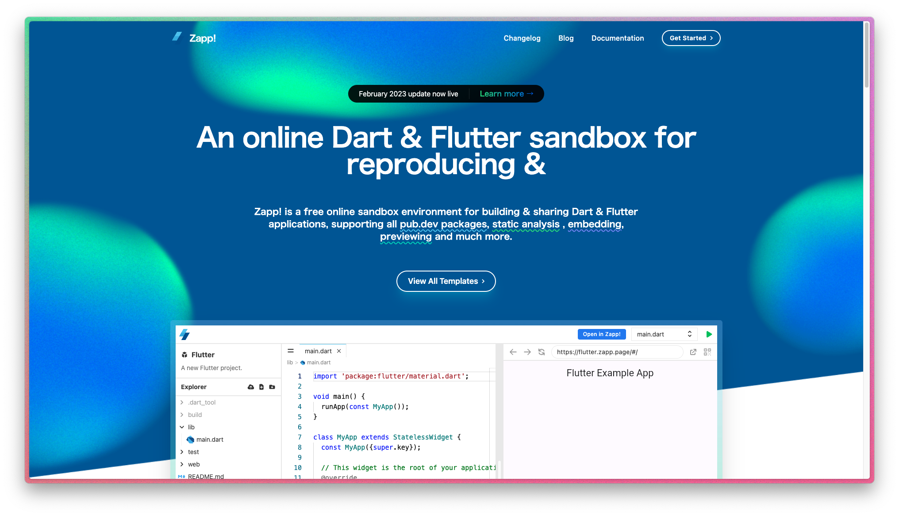
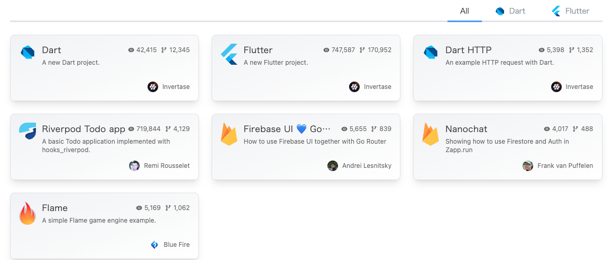
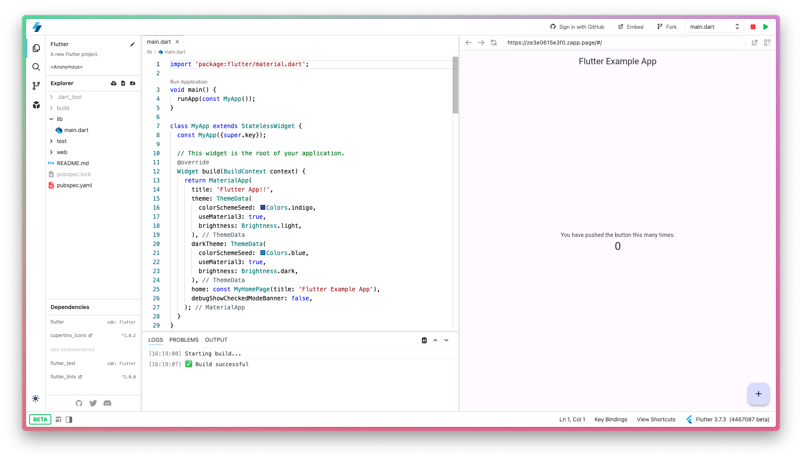
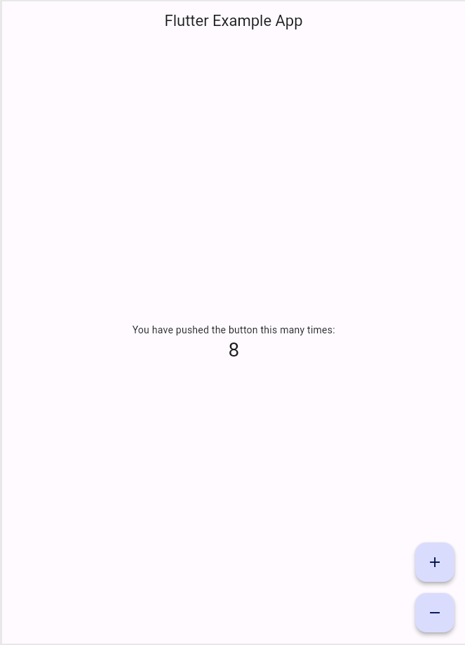
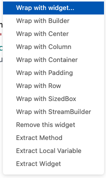
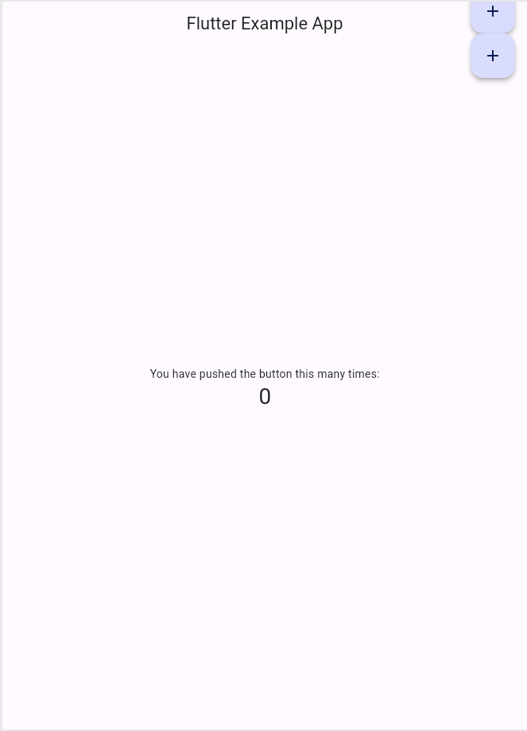
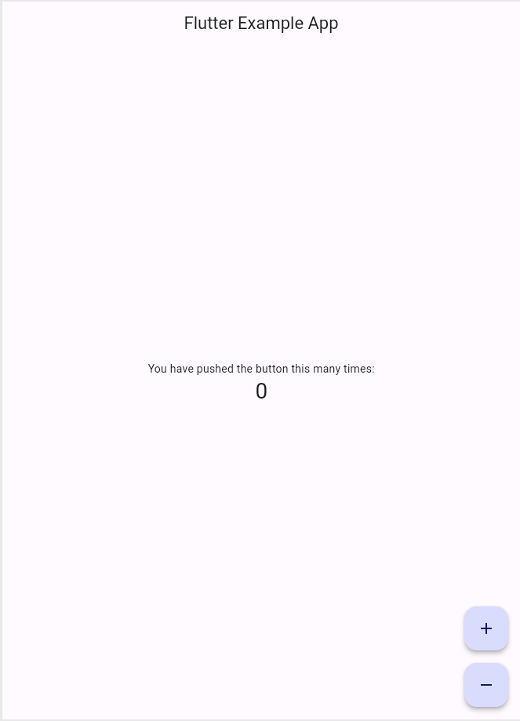
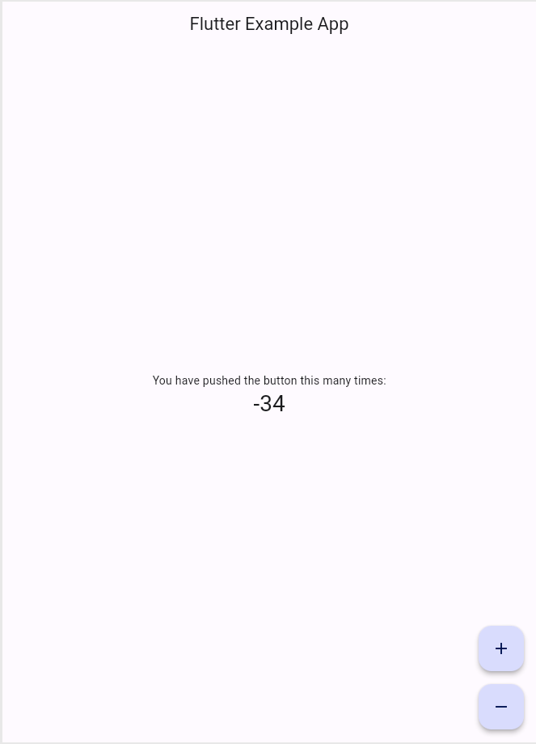

# はじめての<br> **Flutter**

Flutterの基本概念を理解し、
シンプルなUIを
構築できるようになろう！


---

## 🎉 今日のゴール 🎉

- Flutter について説明できるようになること
- StatelessWidget と StatefulWidget の違いがわかること
- Widget を使用して、調べながらUIを構築できること

---

## 1. **Flutter** について理解しよう

---

### **Flutter** とは

**FlutterはGoogleが開発したオープンソースの
UIフレームワーク**

iOS や Android だけでなく、
Web、デスクトップアプリも1つのコードベースで
開発できるのが特徴

---

### [Flutter Showcase](https://flutter.dev/showcase) をみてみよう

- mixi2
- スシロー
- ジャンプTOON
- じゃらん
- ユニクロ

---

### **Flutter** の **UI**

**「Widget」** という部品を組み合わせて作られています

すべてのUIコンポーネントが Widget で構成されており、
階層構造を持つ 「Widgetツリー」 の形で表現されます

---

### みてみよう

```dart
void main() {
  runApp(MyApp());
}

class MyApp extends StatelessWidget {
  @override
  Widget build(BuildContext context) {
    return MaterialApp(
      home: Scaffold(
        appBar: AppBar(title: Text('Flutter 入門')),
        body: Center(child: Text('こんにちは、Flutter!')),
      ),
    );
  }
}
```

---

### Widget ツリーで確認しよう

```
MaterialApp
└── Scaffold
    ├── AppBar
    │   └── Text ('Flutter 入門')
    └── Body
        └── Center
            └── Text ('こんにちは、Flutter!')
```

各Widgetは他のWidgetを子要素として持つことができ、
ネスト構造（ツリー構造） を形成します

---

## 2. **Stateless** vs **Stateful**

---

### Widgetには大きく分けて2種類
### **StatelessWidget** と **StatefulWidget**
### がある 

---

### StatelessWidget

- 状態を持たないWidget
- build() メソッドが呼ばれたとき、常に同じUIを描画する

```dart
class MyStatelessWidget extends StatelessWidget {
  @override
  Widget build(BuildContext context) {
    return Text('私は変わりません');
  }
}
```

---

### StatefulWidget

- 状態（State）を持つWidget
- `setState()` を呼ぶことでUIを更新できる

---

```dart
class MyCounterApp extends StatefulWidget {
  @override
  _MyCounterAppState createState() => _MyCounterAppState();
}

class _MyCounterAppState extends State<MyCounterApp> {
  int _counter = 0;

  void _incrementCounter() {
    setState(() {
      _counter++;
    });
  }

  @override
  Widget build(BuildContext context) {
    return Column(
      mainAxisAlignment: MainAxisAlignment.center,
      children: [
        Text('ボタンを押した回数: $_counter'),
        ElevatedButton(
          onPressed: _incrementCounter,
          child: Text('増やす'),
        ),
      ],
    );
  }
}
```

---

### まとめ

| | StatelessWidget | StatefulWidget |
| -- | -- | -- |
| 状態 | 持たない | 持つ |
| UI更新 | できない | できる |
| 使いどころ | シンプルなUI | 動的に変わるUI |

---

## 3. **Zapp!** を使って
## コードを書いてみよう！

---

### 3-1. 準備編

---

<!-- header: 3-1. 準備編 -->



**[Zapp!](https://zapp.run) を開き、
右上の
Get Started >
をタップします**

---

Flutter を選択しましょう



---

エディタが開ければOK!
右上の緑の▶️ボタンで実行



---

### 3-2. 実践編

**カウンターアプリに
デクリメントボタン(1減らす)を設置してみよう！**

---

<!-- header: 3-2. 実践編 -->

### ボタンを設置しよう！

➕ボタンの下に、
数を減らすための
➖ボタンを追加します！



--- 

#### (準備)FloatingActionButton を探す

- 画面右下のボタンWidget、`FloatingActionButton` を見つけましょう
- 107行目付近
  
```dart

    floatingActionButton: FloatingActionButton(    
      onPressed: _incrementCounter,
      tooltip: 'Increment',
      child: const Icon(Icons.add),
    ),

```

---

#### 3-2-1. Column でラップしよう

Widgetを縦に並べたいときは、
Columnウィジェットを使用します

```dart

    floatingActionButton: Column(
      children: [
        FloatingActionButton(
          onPressed: _incrementCounter,    
          tooltip: 'Increment',
          child: const Icon(Icons.add),
        ),
      ],
    ),

```

---

`FloatingActionButton` に入力カーソルを当てて、
Ctrlと.(ピリオド)を押して、
「Wrap with Column」を選択しよう



---

#### 3-2-2. FloatingButtonを追加する

`Column` の中に
2つ目の `FloatingActionButton` を追加します

---

コピー&ペーストで増殖させます！

```dart

    floatingActionButton: Column(
      children: [
        FloatingActionButton(
          onPressed: _incrementCounter,    
          tooltip: 'Increment',
          child: const Icon(Icons.add),
        ),
        FloatingActionButton(
          onPressed: _incrementCounter,
          tooltip: 'Increment',
          child: const Icon(Icons.add),
        ),
      ],
    ),

```

---




---

必要なサイズだけ確保する設定に変更しよう！
→ `mainAxisSize` を指定する

```dart

    floatingActionButton: Column(
      mainAxisSize: MainAxisSize.min,    
      children: [
        // ...（省略します）
      ],
    ),

```

---

ボタンの間に余白を追加しよう！

```dart

    FloatingActionButton(
      onPressed: _incrementCounter,
      tooltip: 'Increment',
      child: const Icon(Icons.add),
    ),
    const SizedBox(height: 16), // 追加    
    FloatingActionButton(
      onPressed: _incrementCounter,
      tooltip: 'Increment',
      child: const Icon(Icons.add),
    ),

```

---


---

#### 3-2-3: <br>2つ目のボタンをデクリメントボタンに変えよう

```dart

    FloatingActionButton(
    onPressed: _incrementCounter,
    tooltip: 'Increment',
    child: const Icon(Icons.add),
    ),
    const SizedBox(height: 16),
    FloatingActionButton(
    onPressed: _incrementCounter,
    tooltip: 'Decrement', // 変更
    child: const Icon(Icons.remove), // 変更    
    ),

```

---

#### 👍



---

#### 3-2-4: デクリメントを実装しよう

現状では、➖ボタンでも数が増えてしまうので、
減らせるようにしてみます

---

#### 復習

StatefulWidgetでUIを更新するには何をすればいい？

---

#### **StatefulWidget** で<br>UIを更新するには何をすればいい？

A. **`setState()`** を使用して、状態を更新する！

---

#### Step1. デクリメントメソッドを作成

L52付近の `_incrementCounter()` を見つけて、
下に `_decrementCounter()` を作成してみよう！

```dart

    void _incrementCounter() {
      setState(() {
        // (長いコメントが書いてる、省略)    
        _counter++;
      });
    }

    void _decrementCounter() {
    }

```

---

#### Step2. ➖ボタンをタップしたら、<br>`_decrementCounter()` できるようにしよう

```dart

    FloatingActionButton(
      onPressed: _decrementCounter,
      tooltip: 'Decrement',
      child: const Icon(Icons.remove),    
    ),

```

---

#### Step3. `_incrementCounter` を参考に、<br>`_decrementCounter` の中身を実装しよう

---

#### 👍

```dart

    void _decrementCounter() {    
      setState(() {
        _counter--;
      });
    }

```

---

<!-- header: '' -->

#### 🎊 完成 🎊



---

### 4. 復習

---

| | StatelessWidget | StatefulWidget |
| -- | -- | -- |
| 状態 | 持たない | 持つ |
| UI更新 | できない | できる |
| 使いどころ | シンプルなUI | 動的に変わるUI |

---

### お疲れ様でした！🍵


