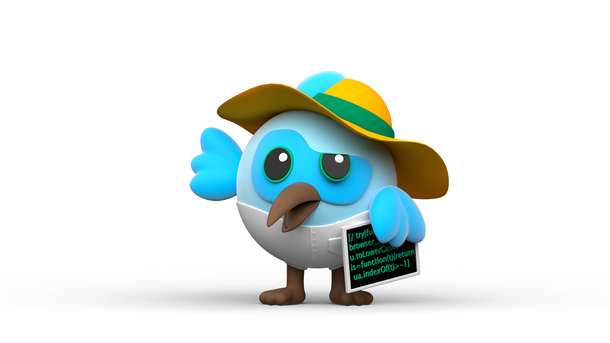
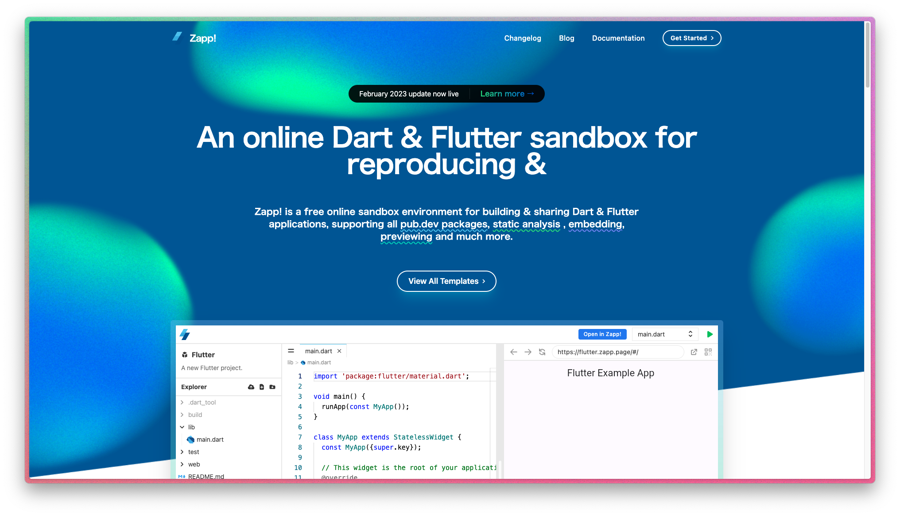
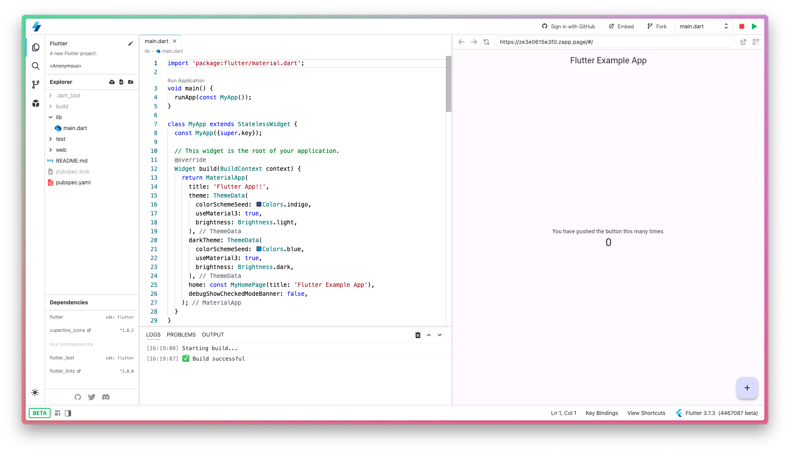
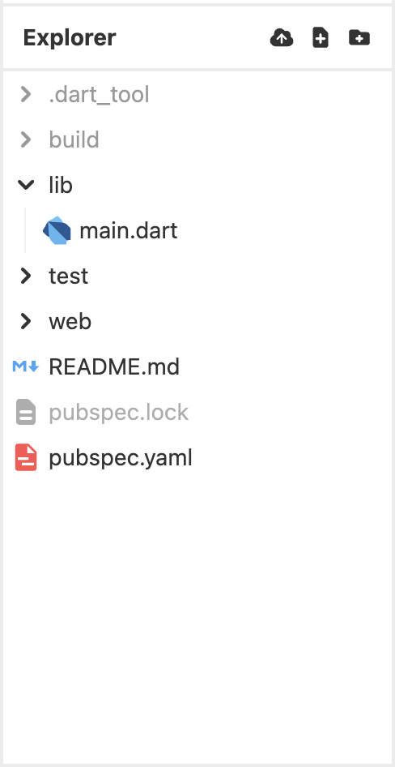
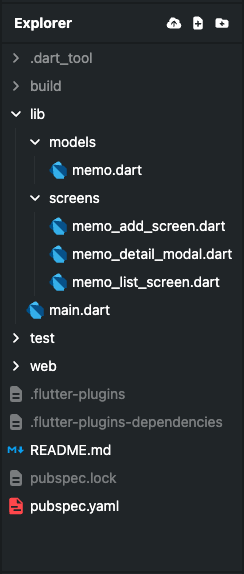
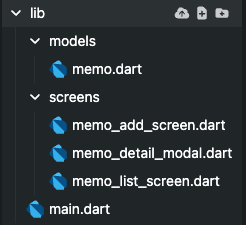

# 実践！<br> **Flutter開発**

〜メモ帳編〜



---

## 🎉 今回のゴール 🎉

- Flutter を使用して、メモ帳を完成させること
- SharedPreferencesを使用した、データ保存の手法を理解すること
- flutter_hooks の使い方をちょっとだけ理解すること

---

## 1. Zapp! 開発準備

---



**[Zapp!](https://zapp.run) を開き、
右上の
Get Started >
をタップします**

---

Flutter を選択しましょう


---

エディタが開ければOK!
右上の緑の▶️ボタンで実行



---

## 2. Flutter Hooks

---

Flutter Hooks は、
React の Hooks の概念を Flutter に取り入れたライブラリ

flutter_hooks を使うことで
**StatefulWidget を使わずに状態を管理できる**

---

### 2-1.
### Flutter Hooks を導入しよう

---



左側にある Explorer から
pubspec.yaml を選択して
開きます

---

31行目付近、以下のようなコードを探して追加する

```yaml
dependencies:
  flutter:
    sdk: flutter
  # 以下を追加する
  flutter_hooks: ^0.18.6
```

Flutterでは、dependenciesに
追記していくことで、ライブラリを追加できます

---

### 2-2.
### 試してみよう！

まず、自分のコードから MyHomePage という
Widget を全部削除しましょう

そして、次のページのコードと差し替えます

---

```dart
class MyHomePage extends HookWidget {
  const MyHomePage({required this.title});
  final String title;

  @override
  Widget build(BuildContext context) {
    final counter = useState(0);

    return Scaffold(
      appBar: AppBar(title: Text(title)),
      body: Center(
        child: Column(
          mainAxisAlignment: MainAxisAlignment.center,
          children: <Widget>[
            const Text(
              'You have pushed the button this many times:',
            ),
            Text(
              '${counter.value}',
              style: Theme.of(context).textTheme.headlineMedium,
            ),
          ],
        ),
      ),
      floatingActionButton: FloatingActionButton(
        onPressed: () => counter.value++,
        tooltip: 'Increment',
        child: const Icon(Icons.add),
      ),
    );
  }
}
```

---

### 2-3.
### HookWidget の使い方を確認しよう

---

<style scoped>
section {
display: flex;
flex-flow: row wrap;
gap: 32px;
}

div {
  flex: 1;
}
</style>

<div>

StatefulWidget

```dart
class MyCounterApp extends StatefulWidget {
  @override
  _MyCounterAppState createState() => _MyCounterAppState();
}

class _MyCounterAppState extends State<MyCounterApp> {
  int _counter = 0;

  void _incrementCounter() {
    setState(() {
      _counter++;
    });
  }

  @override
  Widget build(BuildContext context) {
    return Column(
      mainAxisAlignment: MainAxisAlignment.center,
      children: [
        Text('ボタンを押した回数: $_counter'),
        ElevatedButton(
          onPressed: _incrementCounter,
          child: Text('増やす'),
        ),
      ],
    );
  }
}
```

</div>

<div>

HookWidget

```dart
class MyCounterApp extends HookWidget {
  const MyCounterApp();
  
  @override
  Widget build(BuildContext context) {
    final counter = useState(0);

    void _inrementCounter() {
      counter.value++;
    }

    return Column(
      mainAxisAlignment: MainAxisAlignment.center,
      children: [
        Text('ボタンを押した回数: ${counter.value}'),
        ElevatedButton(
          onPressed: _incrementCounter,
          child: Text('増やす'),
        ),
      ],
    );
  }
}
```

</div>

---

**これだけ覚えよう！**

- 状態は useState( *${状態}* )を使って宣言する
- 状態の値を取得したい時は、state.value から取得する
- 更新時に setState は不要

---

例

```dart
// int の状態を宣言する
// 型は ValueNotifier<int> という形になる
final counter = useState(0);

// 値を読むときは、value を参照する
Text('ボタンを押した数: ${counter.value}');

// 更新時にsetState 不要！
onTap: () {
  counter.value++;
}
```

---

## 3. SharedPreferences

---

SharedPreferences は、
ローカルデータを保存するためのライブラリ
<br>


**キーと値のペア** で保存することができて、
端末を再起動してもデータを保持できる
(アンインストールで消える)

---

### 3-1. 導入

pubspec.yamlに以下のように追記しよう！

```yaml
dependencies:
  flutter:
    sdk: flutter
  flutter_hooks: ^0.18.6
  # 以下を追加する
  shared_preferences: ^2.2.0
```

---

### 3-2.
### 試してみよう！

---

先ほどと同様に、
`MyHomePage` Widget をすべて削除し、
次のコードと差し替えてください

---

```dart
class MyHomePage extends HookWidget {
  const MyHomePage({required this.title});
  final String title;

  @override
  Widget build(BuildContext context) {
    final counter = useState(0);
    final isLoading = useState(true);

    useEffect(() {
      Future.microtask(() async {
        final lastCount = await _loadCounter();
        counter.value = lastCount;
        isLoading.value = false;
      });
      return;
    }, const []);

    if (isLoading.value) {
      return Scaffold(
        appBar: AppBar(title: Text (title)),
        body: Center(
          child: CircularProgressIndicator(),
        ),
      );
    }

    return Scaffold(
      appBar: AppBar(title: Text(title)),
      body: Center(
        child: Column(
          mainAxisAlignment: MainAxisAlignment.center,
          children: <Widget>[
            const Text(
              'You have pushed the button this many times:',
            ),
            Text(
              '${counter.value}',
              style: Theme.of(context).textTheme.headlineMedium,
            ),
          ],
        ),
      ),
      floatingActionButton: FloatingActionButton(
        onPressed: () async {
          counter.value++;
          await _saveCounter(counter.value);
        },
        tooltip: 'Increment',
        child: const Icon(Icons.add),
      ),
    );
  }

  Future<int> _loadCounter() async {
    final prefs = await SharedPreferences.getInstance();
    return prefs.getInt('counter') ?? 0;
  }

  Future<void> _saveCounter(int value) async {
    final prefs = await SharedPreferences.getInstance();
    await prefs.setInt('counter', value);
  }
}
```

---

```dart
// 読み込み
Future<int> _loadCounter() async {
  // 読み書きなど、すべての操作にはこれが必要、おまじないでOK
  final prefs = await SharedPreferences.getInstance();
  // getInt(key) で int で取得、何もないと null になるので、
  // null なら 0 を返すようにする (?? は null だったら後者を返す)
  return prefs.getInt('counter') ?? 0;
}

// 書き込み
Future<void> _saveCounter(int value) async {
  // 読み書きなど、すべての操作にはこれが必要、おまじないでOK
  final prefs = await SharedPreferences.getInstance();
  // setInt(key, value) で保存できる
  // await をつけることで終わるまで待つ
  await prefs.setInt('counter', value);
}
```

---

## 4. 開発の見通しを立てる

---

ここから、実際に開発へ進んでいきます

<br>

実装を始める前に、
画面構成やファイル構成などを
ざっくり考えておくと進めやすいです

---

### 4-1. 画面構成

今回は、以下のような画面構成で実装します

---

<style scoped>
section {
display: flex;
flex-flow: row wrap;
gap: 32px;
}

div {
  flex: 1;
}

p {
  font-size: 24px;
}
</style>

<div>

#### 1. メモ一覧画面

アプリのトップ画面

保存されているメモの
1行目をリストで表示する

</div>

<div>

#### 2. メモ詳細画面

メモをタップした時に
表示されるモーダル

メモの内容を表示する

</div>

<div>

#### 3. メモ追加画面

メモを追加するための画面

リスト画面右下の
追加ボタンを押すと開く

メモを作成・保存する

</div>

---

### 4-2. ファイル構成

Zapp! でも複数ファイルを作成することができるので、
以下のようなファイル構成で作成します

---

画面構成で決めた画面のWidgetは、`screens/` に
`models/` は一旦気にしなくてOK

```

lib/
 ├── main.dart  # アプリのエントリーポイント
 ├── screens/
 │   ├── memo_list_screen.dart  # メモ一覧画面
 │   ├── memo_add_screen.dart   # メモ追加画面
 │   ├── memo_detail_modal.dart # メモ詳細モーダル
 ├── models/
 │   ├── memo.dart  # メモのデータモデル

```

---

## 5. 開発編

ということで、早速開発していきましょう！

---

### 5-1. メモ追加画面を作成しよう！

メモの追加ができないと、
一覧や内容の表示ができないので、
まずは、メモを追加する画面を作成します

---



最終的にはこのような
ファイル構成になります

まずは、
`models/memo.dart`
`screens/memo_add_screen.dart`
を作成します！

---

### 5-1-1. フォルダ作成

まずは、Zapp!で `lib/` 以下に、
`models` と `screens` という
フォルダを作成してみましょう

---



`lib` の横にある、3つのアイコンの
真ん中が新規ファイル、
右が新規フォルダです

<br>

今回は、
新規フォルダ(右)のボタンから、
`models` と `screens` を
作成しましょう！

---

### 5-1-2. `memo.dart` 作成

---

`models` に新規ファイルで、`memo.dart` を作成し、
以下のコードを貼り付けてください

<br>

これは、contentにメモの内容を持つ、クラスです
previewから、最初の1行だけ取得できるようにしています

```dart
class Memo {
  final String content;
  Memo({required this.content});

  // 先頭の1行のみ取得
  String get preview => content.split('\n').first;
}
```

---

### 5-1-3. `MemoAddScreen` を作成しよう

同様に、`screens/` に、
`memo_add_screen.dart` ファイルを作成し、
次のスライドのコードを貼り付けましょう！

---

```dart
import 'package:flutter/material.dart';
import 'package:flutter_hooks/flutter_hooks.dart';

class MemoAddScreen extends HookWidget {
  const MemoAddScreen({super.key});

  @override
  Widget build(BuildContext context) {
    final textController = useTextEditingController();

    return Scaffold(
      appBar: AppBar(title: const Text('メモを追加')),
      body: Padding(
        padding: const EdgeInsets.all(16.0),
        child: Column(
          children: [
            TextField(
              controller: textController,
              decoration: const InputDecoration(
                labelText: 'メモの内容',
                border: OutlineInputBorder(),
              ),
              maxLines: 10,
            ),
            const SizedBox(height: 20),
            SizedBox(
              width: double.infinity,
              child: ElevatedButton(
                onPressed: () {
                  // TODO: メモを保存する
                },
                style: ElevatedButton.styleFrom(
                  shape: RoundedRectangleBorder(
                    borderRadius: BorderRadius.circular(10),
                  ),
                  backgroundColor: Colors.indigo,
                  foregroundColor: Colors.white,
                  padding: const EdgeInsets.symmetric(vertical: 12),
                ),
                child: const Text('追加する', style: TextStyle(fontSize: 16)),
              ),
            ),
          ],
        ),
      ),
    );
  }
}
```

---

**main.dartを編集して、**
**MemoAddScreenを表示できるようにします**

```dart
import 'package:flutter/material.dart';
import 'package:flutter_app/screens/memo_add_screen.dart';

void main() {
  runApp(const MyApp());
}

class MyApp extends StatelessWidget {
  const MyApp({super.key});

  @override
  Widget build(BuildContext context) {
    return MaterialApp(
      title: 'メモアプリ',
      theme: ThemeData(
        colorSchemeSeed: Colors.indigo,
        useMaterial3: true,
        brightness: Brightness.light,
      ),
      darkTheme: ThemeData(
        colorSchemeSeed: Colors.blue,
        useMaterial3: true,
        brightness: Brightness.dark,
      ),
      home: const MemoAddScreen(),
      debugShowCheckedModeBanner: false,
    );
  }
}
```

---

**中身のWidgetについて解説(口頭)**

---

### 5-2. メモ一覧画面を作成しよう！

今度は、`screens/` に
`memo_list_screen.dart` を作成します

---

```dart
import 'package:flutter/material.dart';
import 'package:flutter_hooks/flutter_hooks.dart';
import 'memo_add_screen.dart';
import '../models/memo.dart';

class MemoListScreen extends HookWidget {
  const MemoListScreen({super.key});

  @override
  Widget build(BuildContext context) {
    final memoList = useState<List<Memo>>([]);

    return Scaffold(
      appBar: AppBar(title: const Text('メモ一覧')),
      body: ListView.builder(
        itemCount: memoList.value.length,
        itemBuilder: (context, index) {
          final memo = memoList.value[index];
          return ListTile(
            title: Text(memo.preview),
            onTap: () {
              // メモ詳細モーダルを表示する
            },
          );
        },
      ),
      floatingActionButton: FloatingActionButton(
        onPressed: () async {
          // メモ追加画面へ移動
          await Navigator.push(
            context,
            MaterialPageRoute(builder: (context) => const MemoAddScreen()),
          );
        },
        child: const Icon(Icons.add),
      ),
    );
  }
}
```

---

`main.dart` を編集して、
今度は、リスト画面が表示できるようにします


```dart
import 'package:flutter/material.dart';
import 'package:flutter_app/screens/memo_list_screen.dart';

void main() {
  runApp(const MyApp());
}

class MyApp extends StatelessWidget {
  const MyApp({super.key});

  @override
  Widget build(BuildContext context) {
    return MaterialApp(
      title: 'メモアプリ',
      theme: ThemeData(
        colorSchemeSeed: Colors.indigo,
        useMaterial3: true,
        brightness: Brightness.light,
      ),
      darkTheme: ThemeData(
        colorSchemeSeed: Colors.blue,
        useMaterial3: true,
        brightness: Brightness.dark,
      ),
      home: const MemoListScreen(),
      debugShowCheckedModeBanner: false,
    );
  }
}
```

---

**中身のWidgetについて解説(口頭)**

State として、メモ一覧を持っていることを確認する

---

### 5-3. メモ詳細モーダルを作成する

コピペ祭り最後です！ `screens/` に
`memo_detail_modal.dart` を作成します

---

```dart
import 'package:flutter/material.dart';
import 'package:flutter_hooks/flutter_hooks.dart';
import '../models/memo.dart';

class MemoDetailModal extends HookWidget {
  const MemoDetailModal({super.key, required this.memo});
  final Memo memo;

  static Future<void> show(BuildContext context, Memo memo) async {
    await showModalBottomSheet(
      context: context,
      shape: const RoundedRectangleBorder(
        borderRadius: BorderRadius.vertical(top: Radius.circular(16)),
      ),
      builder: (_) => MemoDetailModal(memo: memo),
    );
  }

  @override
  Widget build(BuildContext context) {
    final theme = Theme.of(context);
    return Padding(
      padding: EdgeInsets.fromLTRB(16, 16, 16, MediaQuery.of(context).padding.bottom + 16),
      child: Column(
        mainAxisSize: MainAxisSize.min,
        crossAxisAlignment: CrossAxisAlignment.start,
        children: [
          Text(
            'メモの内容',
            style: theme.textTheme.titleLarge,
          ),
          const SizedBox(height: 10),
          Text(
            memo.content,
            style: theme.textTheme.bodyLarge,
          ),
          const SizedBox(height: 20),
          Align(
            alignment: Alignment.centerRight,
            child: TextButton(
              onPressed: () => Navigator.pop(context),
              child: Text(
                '閉じる',
                style: TextStyle(color: theme.colorScheme.primary),
              ),
            ),
          ),
        ],
      ),
    );
  }
}
```

---

**中身のWidgetについて解説(口頭)**

---

### 6. 実践編

---

### 6-1. メモを追加できるようにしよう！

ここからは、
MemoAddScreenでメモを保存できるようにします！

---

### 6-2. 起動時に保存してあるメモを
### stateに反映しよう

ここでは、アプリの起動時に、
SharedPreferencesに保存されているメモを
`useState` に反映させます

---

### 6-3. 追加したメモをstateにも
### 反映できるようにしよう

作成したメモを
SharedPreferencesだけでなく、MemoListScreenの `useState` にも反映できるようにしましょう！

---

### 6-4. メモの全文をモーダルで
### 表示できるようにしよう！
