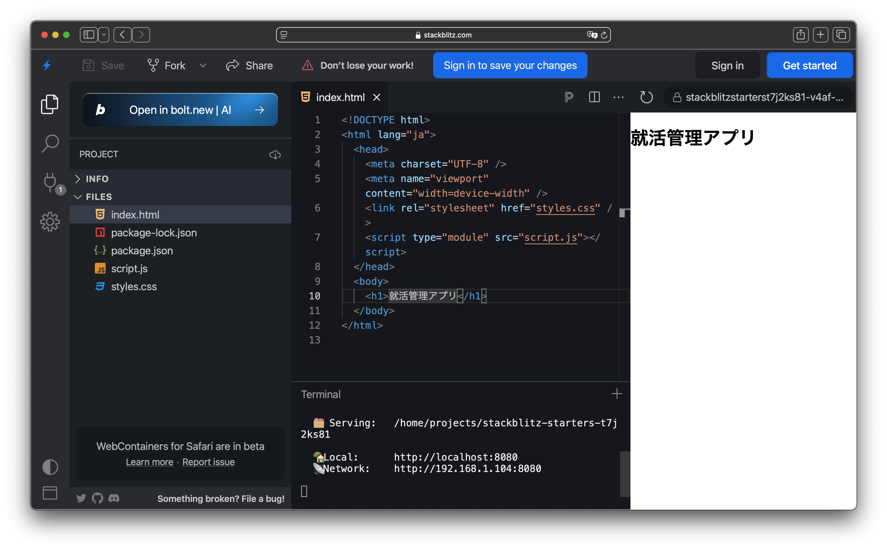
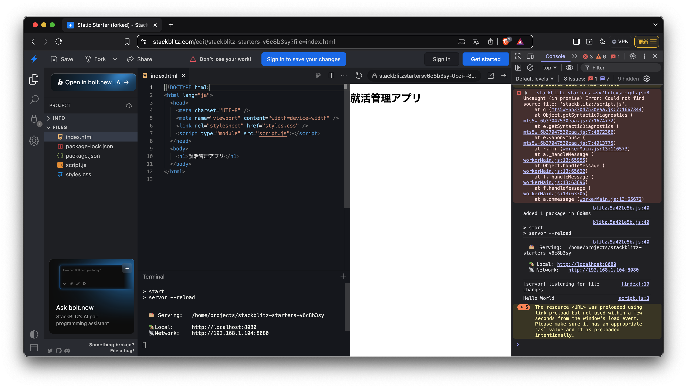

# JavaScript でつくる超かんたん Web アプリ入門

本勉強会では JavaScript の基本文法を学びながら、実際に「就活管理アプリ」を作成します 📝
サンプルコードを見ながら学び、Chapter ごとの演習問題を解きながら作っていきましょう 🚀

## 実行環境

VScode などのエディターは使わずに[StackBlitz](https://stackblitz.com/edit/stackblitz-starters-t7j2ks81?file=index.html)を使って開発していきます。



# 1. JavaScript の基礎（変数、データ型、if、for、関数） - 45 分

まずは検証ツールを使ってログが表示されることを確認してください。検証ツールは右クリックから「検証」を選ぶと開けます。


**Hello World**と表示されていれば OK です。

## 1.1 変数

JavaScript では let, const, var の 3 種類の変数の宣言方法があります。

```js
// script.js
let name = "Jon"; // 再代入可能
const age = 25; // 再代入不可
var city = "Tokyo"; // 旧来の書き方（非推奨）

console.log(name);
console.log(age);
console.log(city);
```

- `let`: 値を変更できる変数
- `const`: 値を変更できない定数
- `var`: 古い記述方法（現在は let を推奨）

## 1.2 データ型

JavaScript のデータ型には主に次のようなものがあります。

```js
// script.js
let score = 100;
let message = "Hello World";
let isActive = true;
let numbers = [1, 2, 3, 4, 5];
let user = { name: "Bob", age: 30 };

console.log(score);
console.log(message);
console.log(isActive);
console.log(numbers);
console.log(user);
```

- Number（数値）：`42`、`3.14`
- String（文字列）：`"Hellow"`、`"就活管理"`
- Boolean（真偽値）：`true`、`false`
- Array（配列）：`[1, 2, 3]`、`["応募中", "面接予定"]`
- Object（オブジェクト）：`{ company: "jig.jp", city: "sabae"}`

## 1.3 制御構文：if 文

### if 文の基本

```js
// script.js
let score = 75;
if (score >= 80) {
  console.log("Great!");
} else {
  console.log("Keep trying!");
}
```

### 演習 ①

以下の手順で if 文を実装してください。

1. 変数`appliedCount`を定義し、応募要件を数値で入力する
2. もし`appliedCount`が 5 以上なら「応募が順調です」とコンソールに表示、そうでなければ「もっと頑張りましょう」と表示する

<details><summary>解答</summary>

```js
// script.js
// 演習① の解答例
let appliedCount = 4; // 数字は任意で変更可能
if (appliedCount >= 5) {
  console.log("応募が順調です");
} else {
  console.log("もっと頑張りましょう");
}
```

</details>

## 1.4 制御構文：for 文

### for ループの基本

```js
// script.js
for (let i = 0; i < 5; i++) {
  console.log(i);
}
```

### 配列のループ処理

```js
// script.js
const companies = ["A社", "B社", "C社"];
for (let i = 0; i < companies.length; i++) {
  console.log("会社名:", companies[i]);
}
```

## 1.5 関数の定義と利用

### 関数の例

```js
// script.js
function greet(name) {
  return "Hello, " + name + "!";
}
console.log(greet("就活生"));
```

### アロー関数の例

```js
// script.js
const add = (a, b) => a + b;
console.log(add(5, 3)); // 出力: 8
```

## 1.6 JSON についての基礎知識

**JSON（JavaScript Object Notation）** は、データをテキスト形式で表現するための軽量なフォーマットです。JavaScript のオブジェクトに似ていますが、いくつかの点で異なります。

### 保存可能なデータ型

JSON では、文字列、数値、Boolean、`null`、配列、オブジェクトのみ扱えます。
JavaScript では、これらに加えて`undefined`や関数、Date オブジェクトなども存在しますが、これらは JSON に直接変換できません。

### 利用シーン

- データの保存
  - ブラウザの Local Storage やサーバーのデータベースにデータを保存する際に、JavaScript のオブジェクトを文字列に変換して利用されます。
- データの送受信
  - Web API を通じてサーバーとクライアント間でデータをやり取りする際、軽量で扱いやすい JSON が広く利用されます。

### 変換方法

1. オブジェクトの作成  
   まずは、シンプルな JavaScript オブジェクトを作成します。

```js
const studentInfo = {
  name: "太郎",
  age: 22,
  major: "情報工学",
  isActive: true,
};
console.log("元のオブジェクト:", studentInfo);
```

2. オブジェクトを JSON 文字列に変換  
   次に `JSON.stringfy()`を使ってオブジェクトを文字列に変換してみましょう。

```js
const jsonString = JSON.stringify(studentInfo);
console.log("JSON 文字列:", jsonString);
```

3. JSON 文字列をオブジェクトに戻す  
   変換した JSON 文字列を、`JSON.parse()` を使って元のオブジェクトに戻します。

```js
const parsedStudentInfo = JSON.parse(jsonString);
console.log("パースしたオブジェクト:", parsedStudentInfo);
```

## 1.7 演習 ② 　まとめ

### 課題

以下の要件を満たす関数を作成してください:

1. 関数名: `checkApplicationCount`
2. 引数: 応募件数（数値）
3. 処理:
   - もし応募件数が 3 以上なら「多くの企業に応募しています」と返す
   - そうでなければ「まだ応募先が少ないです」と返す
4. コンソールに実際に関数を呼び出して結果を表示する

<details><summary>解答</summary>

```js
// script.js
// 演習② の解答例
function checkApplicationCount(count) {
  if (count >= 3) {
    return "多くの企業に応募しています";
  } else {
    return "まだ応募先が少ないです";
  }
}

console.log(checkApplicationCount(2)); // 例: "まだ応募先が少ないです"
console.log(checkApplicationCount(4)); // 例: "多くの企業に応募しています"
```

</details>

# 2. DOM 操作とイベント処理の基本 - 40 分

## 2.1 HTML の事前準備

以下のコードをコピーして、`index.html`に貼り付けてください。

```html
<!-- index.html -->
<!DOCTYPE html>
<html lang="ja">
  <head>
    <meta charset="UTF-8" />
    <meta name="viewport" content="width=device-width" />
    <link rel="stylesheet" href="styles.css" />
    <script type="module" src="script.js"></script>
  </head>
  <body>
    <div id="app">
      <h1 id="appTitle">就活管理アプリ</h1>
      <!-- 後で追加する要素のためのコンテナ -->
    </div>
  </body>
</html>
```

## 2.2 DOM 要素の取得と変更

### 要素の取得

```js
// index.js
const appContainer = document.getElementById("app");
const appTitle = document.getElementById("appTitle");
```

### 要素内容の変更

```js
// index.js
// ...
appTitle.textContent = "ようこそ！自分の就活を管理しよう";
```

### 新たな要素の追加

```js
// index.js
// ...
const intro = document.createElement("p");
intro.textContent =
  "このアプリでは、あなたの応募情報や面接予定、振り返りを記録できます。";
appContainer.appendChild(intro);
```

## 2.3 イベントリスナーの設定

### クリックイベント

```js
// script.js
// ...
const btn = document.createElement("button");
btn.textContent = "クリックしてメッセージ表示";
btn.addEventListener("click", () => {
  alert("イベントが発火しました！");
});
appContainer.appendChild(btn);
```

## 2.4 演習 ③ 　まとめ

### 課題

以下を実装してください。

1. ページ読み込み時に、`appContainer`の末尾に「本日の就活開始！」という段落（`<p>`タグ）を追加する
2. 別のボタンを作成し、クリック時にコンソールに「就活、スタート！」と表示する

<details><summary>解答</summary>

```js
// script.js
// 演習③ の解答例

// ...
// 1. 「本日の就活開始！」という段落を追加
const startMessage = document.createElement("p");
startMessage.textContent = "本日の就活開始！";
appContainer.appendChild(startMessage);

// 2. ボタン作成とクリック時メッセージの表示
const startButton = document.createElement("button");
startButton.textContent = "スタートボタン";
startButton.addEventListener("click", () => {
  console.log("就活、スタート！");
});
appContainer.appendChild(startButton);
```

</details>

# 3. ユーザー入力処理とリスト表示機能の実装（if・for を活用） - 40 分

## 3.1 事前準備：応募フォームの HTML

以下のコードを HTML を index.html に追加してください。

```html
<!-- index.html -->

<!-- ... -->
<form id="applicationForm">
  <!-- 企業名に加え、面接日程や面接後の振り返りも記録できるようにします -->
  <input
    type="text"
    id="companyInput"
    placeholder="企業名（例：〇〇株式会社）"
    required
  />
  <input type="date" id="dateInput" required />
  <select id="statusSelect">
    <option value="応募中">応募中</option>
    <option value="面接予定">面接予定</option>
    <option value="面接済み">面接済み</option>
    <option value="内定">内定</option>
  </select>
  <textarea
    id="noteInput"
    placeholder="面接の振り返りや気になった点（任意）"
  ></textarea>
  <button type="submit">応募情報を追加</button>
</form>
<ul id="applicationList"></ul>
```

## 3.2 フォームの送信イベント処理

### フォームの送信時のコード例

```js
// script.js
// ...
const form = document.getElementById("applicationForm");
const companyInput = document.getElementById("companyInput");
const dateInput = document.getElementById("dateInput");
const statusSelect = document.getElementById("statusSelect");
const noteInput = document.getElementById("noteInput");
const applicationList = document.getElementById("applicationList");

// 応募情報を格納する配列
let applications = [];

form.addEventListener("submit", (event) => {
  event.preventDefault(); // ページリロード防止
  // 入力値取得とバリデーション（if 文を利用）
  const company = companyInput.value.trim();
  const appliedDate = dateInput.value;
  const status = statusSelect.value;
  const note = noteInput.value.trim(); // 振り返りメモ（任意）
  if (!company || !appliedDate) {
    alert("必須項目（企業名と日付）を入力してください！");
    return;
  }
  // 応募情報オブジェクトの生成
  const newApplication = {
    id: Date.now(),
    company,
    appliedDate,
    status,
    note,
  };
  addApplication(newApplication);
  form.reset();
});
```

## 3.3 応募情報の追加とリスト表示

### リスト描画用の関数例

```js
// script.js
// ...
function addApplication(application) {
  applications.push(application);
  renderApplications();
}

function renderApplications() {
  // 既存のリストをクリア
  applicationList.innerHTML = "";
  // for ループで各応募情報を表示
  for (let i = 0; i < applications.length; i++) {
    const app = applications[i];
    // 学生向けに、配列のインデックス＋1（応募番号）を表示
    const li = document.createElement("li");
    li.textContent =
      i +
      1 +
      ". " +
      `${app.company} - ${app.appliedDate} - ${app.status}` +
      (app.note ? " - メモ：" + app.note : "");

    // 削除ボタンの作成
    const deleteBtn = document.createElement("button");
    deleteBtn.textContent = "削除";
    deleteBtn.classList.add("delete-btn");
    deleteBtn.addEventListener("click", () => {
      deleteApplication(app.id);
    });
    li.appendChild(deleteBtn);

    applicationList.appendChild(li);
  }
}
```

## 3.4 演習 ④ 　まとめ

### 課題

1. フォームから取得したデータが正しく応募情報リストに追加されるか確認する
2. for ループ内で応募番号（インデックス + 1）を表示するようにコードを変更する（上記コード例のように）

<details><summary>解答</summary>

````js
上記の`renderApplications()`コード例がそのまま解答例となります。例えば、応募条件が以下のように表示されます。

```markdown
1. 〇〇株式会社 - 2025-03-20 - 応募中 - メモ：説明会で好印象だった
2. △△ 株式会社 - 2025-03-21 - 面接予定
````

</details>

# 4. Local Storage を利用した CRUD 機能の実装と拡張 - 30 分

## 4.1 Local Storage の基本

### 保存用関数と読み込み用関数

```js
function saveApplications() {
  localStorage.setItem("applications", JSON.stringify(applications));
}

function loadApplications() {
  const data = localStorage.getItem("applications");
  return data ? JSON.parse(data) : [];
}
```

### ページ読み込み時にデータを初期化する

```js
// ページ読み込み時の処理（StackBlitz の自動実行）
applications = loadApplications();
renderApplications();
```

## 4.2 応募情報の追加・削除時に Local Storage を連携

### フォーム送信イベントに保存処理を追加

```js
form.addEventListener("submit", (event) => {
  event.preventDefault();
  const company = companyInput.value.trim();
  const appliedDate = dateInput.value;
  const status = statusSelect.value;
  const note = noteInput.value.trim();
  if (!company || !appliedDate) {
    alert("必須項目（企業名と日付）を入力してください！");
    return;
  }
  const newApplication = {
    id: Date.now(),
    company,
    appliedDate,
    status,
    note,
  };
  applications.push(newApplication);
  saveApplications();
  renderApplications();
  form.reset();
});
```

### 削除機能の実装例

```js
function deleteApplication(id) {
  applications = applications.filter((app) => app.id !== id);
  saveApplications();
  renderApplications();
}
```

## 4.3 演習 ⑤ 　まとめ

### 課題

1. 応募情報を追加後、ブラウザをリロードしてもリストに情報が保持されているか確認する

# 5. まとめ

このハンズオンでは、StackBlitz を利用して、就活中の学生が自分の応募状況、面接予定、面接後の振り返りなどを一元管理できるアプリを作成しました。
各章の演習と解答例を通して、if 文や for ループ、関数、DOM 操作、Local Storage を利用した CRUD 機能の実装方法を学び、実際に自分の就活に役立つアプリを作り上げることを目指します。
疑問点があれば随時質問してください。皆さんの就活管理アプリの完成を楽しみにしています！
