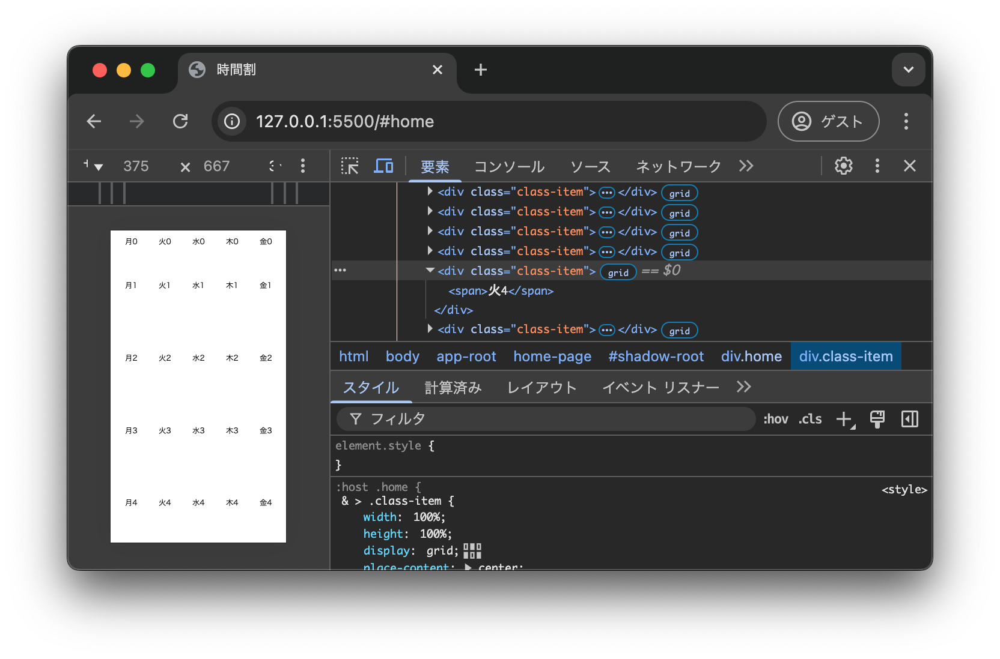

# はじめの一歩は時間割

<details>
  <summary>目次</summary>

- [はじめの一歩は時間割](#はじめの一歩は時間割)
  - [1. 初めてのWebアプリを作ろう](#1-初めてのwebアプリを作ろう)
    - [1.1. HTML/CSSを始めよう](#11-htmlcssを始めよう)
      - [1.1.1. 基本的なHTML要素を知ろう](#111-基本的なhtml要素を知ろう)
      - [1.1.2. CSSボックスモデルを知ろう](#112-cssボックスモデルを知ろう)
      - [1.1.3. フレックスボックス、グリッドレイアウトを使ってみよう](#113-フレックスボックスグリッドレイアウトを使ってみよう)
    - [1.2. JavaScriptを組み合わせよう](#12-javascriptを組み合わせよう)
      - [1.2.1. ボタンで表示を変えてみよう](#121-ボタンで表示を変えてみよう)
  - [2. 時間割アプリのデザインを考えよう](#2-時間割アプリのデザインを考えよう)
    - [2.1. 必要な機能を洗い出そう](#21-必要な機能を洗い出そう)
    - [2.2. デザインを考えよう](#22-デザインを考えよう)
  - [3. Web開発を楽にする手段を知ろう](#3-web開発を楽にする手段を知ろう)
    - [3.1. VSCodeの設定を調整しよう](#31-vscodeの設定を調整しよう)
    - [3.2. JSDocを書いてみよう](#32-jsdocを書いてみよう)
    - [3.3. CSSカスタムプロパティを使ってみよう](#33-cssカスタムプロパティを使ってみよう)
    - [3.4. カスタム要素を作ってみよう](#34-カスタム要素を作ってみよう)
    - [3.5. 見やすいディレクトリ構成を考えよう](#35-見やすいディレクトリ構成を考えよう)
  - [4. ページを用意しよう](#4-ページを用意しよう)
    - [4.1. ルーティングを自作しよう](#41-ルーティングを自作しよう)
    - [4.2. ひとつめのページを用意しよう](#42-ひとつめのページを用意しよう)
    - [4.3. ふたつめとみっつめのページを用意しよう](#43-ふたつめとみっつめのページを用意しよう)
  - [5. データを保存しよう](#5-データを保存しよう)
    - [5.1. IndexedDBのラッパーを用意しよう](#51-indexeddbのラッパーを用意しよう)
    - [5.2. ラッパーを通してIndexedDBを使ってみよう](#52-ラッパーを通してindexeddbを使ってみよう)
  - [6. 科目を登録できるようにしよう](#6-科目を登録できるようにしよう)
    - [6.1. 科目の情報の型を考えよう](#61-科目の情報の型を考えよう)
    - [6.2. 必要な情報を入力できるようにしよう](#62-必要な情報を入力できるようにしよう)
    - [6.3. 科目の情報を保存しよう](#63-科目の情報を保存しよう)
  - [7. 科目を一覧・管理できるようにしよう](#7-科目を一覧管理できるようにしよう)
    - [7.1. 科目一覧ページを準備しよう](#71-科目一覧ページを準備しよう)
    - [7.2. 画面遷移を追加しよう](#72-画面遷移を追加しよう)
    - [7.3. 繰り返しを使って表示を作ろう](#73-繰り返しを使って表示を作ろう)
    - [7.4. 登録した科目の内容を編集できるようにしよう](#74-登録した科目の内容を編集できるようにしよう)
  - [8. 時間割表を表示できるようにしよう](#8-時間割表を表示できるようにしよう)
    - [8.1. 画面全体を利用できるようにしよう](#81-画面全体を利用できるようにしよう)
    - [8.2. 表の見た目を作ろう](#82-表の見た目を作ろう)
    - [8.3.表のコンポーネントを作ろう](#83表のコンポーネントを作ろう)
    - [8.4. 科目を設定できるようにしよう](#84-科目を設定できるようにしよう)
    - [8.5. 時間割表でクリックされた時間を詳細コンポーネントに通知できるようにしよう](#85-時間割表でクリックされた時間を詳細コンポーネントに通知できるようにしよう)
    - [8.6. 設定された科目を表に表示できるようにしよう](#86-設定された科目を表に表示できるようにしよう)
    - [8.7. 科目一覧画面への遷移を追加しよう](#87-科目一覧画面への遷移を追加しよう)
  - [9. アプリを公開しよう](#9-アプリを公開しよう)
    - [9.1. GitHub Pages で公開しよう。](#91-github-pages-で公開しよう)
  - [10. まとめ](#10-まとめ)

</details>

## 1. 初めてのWebアプリを作ろう

まずは初めてのWebアプリとして、「カウンター」を作ってみることを目標にしましょう。


[GitHub](https://github.com/) に「vanilla-counter」という名前でリポジトリを用意してください。  
`git clone <URL>` として手元にcloneして、VSCodeでcloneしたリポジトリを開いてください。

VSCodeのエクスプローラーから「index.html」「style.css」「main.mjs」の名前でファイルを作成してください。


### 1.1. HTML/CSSを始めよう

初歩的なWebページを作成するために、最低限必要な知識を学習しましょう。  
作成した「index.html」を開いてください。

#### 1.1.1. 基本的なHTML要素を知ろう

<!-- 
* DOCTYPE宣言
* html, head, body
* meta-charset, meta-viewport, link-stylesheet, script
* div
* span
-->

まずはDOCTYPE宣言を書きましょう。

```html
<!DOCTYPE html>
```

この宣言には、ブラウザがHTMLを解釈するときのモードを指定する役割があります。  
書かないと表示が意図しないものになるので、必ず書くようにしてください。

次にHTMLを追加していきます。

```html
<html>
  <head>

  </head>
  <body>

  </body>
</html>
```

それぞれ「htmlタグ」「headタグ」「bodyタグ」のように呼び、以下のような意味があります。

| タグ | 意味 |
| :---: | --- |
| `<html>` | HTML文書が書かれていることを示す。 |
| `<head>` | 文書に関するメタデータが書かれていることを示す。この要素の内容は文書中には表示されない。 |
| `<body>` | 文書の内容が書かれていることを示す。 |

headタグ内にメタデータを追記しましょう。

```html
<meta charset="UTF=8" />
<meta name="viewport" content="width=device-width, initial-scale=1.0" />
<title>カウンター</title>
<link rel="stylesheet" href="style.css" />
<script type="module" src="main.mjs"></script>
```

HTMLには上記の`<meta>`や`<link>`のように閉じタグを持たない要素があります。  
このような要素を「self-closing tag」と呼ぶこともあります。

ここで出てきた各要素の意味も説明しましょう。

| タグ | 意味 |
| :---: | --- |
| `<meta charset="<文字エンコード>" />` | 文書の文字コードを指定する。 |
| `<meta name="viewport" content="width=device-width, initial-scale=1.0" />` | ブラウザで表示する領域の大きさを指定する。 |
| `<title>` | 文書のタイトルを示す。 |
| `<link rel="stylesheet" href="<CSSファイルへのパス>">` | 文書に適用するスタイルシートの置き場を示す。 |
| `<script type="module">` | JavaScriptが書かれていることを示す。src属性を指定したときは実行するJavaScriptファイルの置き場を示す。 |

その他にもメタデータとして`<head>`内に記述する要素はありますが、最低限以上の内容を記述しておけばよいでしょう。

では、最後に`<body>`内にページの内容を記述しましょう。  

```html
    <div class="app">
      <span>カウンター</span>
      <div class="counter-container">
        <span class="count">0</span>
      </div>
    </div>
```

ここまでかけたら変更を保存して、`Ctrl+Shift+P`でコマンドパレットを開いて「Live Server」と検索します。  
「Live Server: Open with Live Server」を選択して実行しましょう。起動メッセージが表示されたあと、ブラウザで「http://127.0.0.1:5500/index.html」が開くはずです。


最後に登場した2つのHTML要素についても説明しましょう。

| タグ | 意味 |
| :---: | --- |
| `<div>` | フローコンテンツの汎用ブロックコンテナー。要素を囲んでCSSで修飾したいときに利用する。 |
| `<span>` | 記述コンテンツ汎用インラインコンテナー。文字列を囲んでCSSで修飾したいときに利用する。 |

Webアプリはこの要素と後述するCSSセレクターがあれば作成できるでしょう。  
しかし、本来であればHTML要素は記述内容の目的に合わせて適切に利用される必要があるため、この2つのみではなくより多くのタグを利用することになります。  
今回の開発では簡単のためこの2つの要素を主に利用します。

#### 1.1.2. [CSSボックスモデルを知ろう](https://github.com/jigintern/intern-dev-tutorial/blob/main/html-css/DOCS.md#3-2-%E3%83%9C%E3%83%83%E3%82%AF%E3%82%B9%E3%83%A2%E3%83%87%E3%83%AB%E3%81%A8box-sizing)

この単元は別資料を参照します。

<https://github.com/jigintern/intern-dev-tutorial/blob/main/html-css/DOCS.md#3-2-%E3%83%9C%E3%83%83%E3%82%AF%E3%82%B9%E3%83%A2%E3%83%87%E3%83%AB%E3%81%A8box-sizing>

以下の内容を `style.css` に記述しましょう。

```css
* {
  box-sizing: border-box;
  margin: 0;
  padding: 0;
}

html,body {
  width: 100dvw;
  height: 100dvh;
  overflow: hidden;
  touch-action: manipulation;
}
```

ここで`*`のようにその後に`{}`で囲まれたブロックを持つ部分を「セレクタ」と呼びます。  
セレクタはその後のブロックに記述されたCSSをどこに適用するのかを示すもので、今回利用している`*`は「全称セレクタ」というものです。  
適用しているCSSはそれぞれ、ボックスモデルを指定する`box-sizing`と、それぞれの要素に最初から設定されている事がある`margin`と`padding`を0にして取り扱いやすくするスタイルです。

#### 1.1.3. フレックスボックス、グリッドレイアウトを使ってみよう

<!--
* flex
* grid
-->

フレックスボックス、グリッドレイアウトはそれぞれ、CSSの`display`プロパティに`flex`、`grid`を指定することで利用できるレイアウト方法です。  
フレックスボックスは1次元的、グリッドレイアウトは2次元的なレイアウトが可能になります。

[1.1.1.](#111-基本的なhtml要素を知ろう)で作成したページにレイアウトをつけてみましょう。  
イメージは以下のとおりです。

* 「カウンター」というタイトルは画面上部に固定
* タイトルとカウンター本体は直線上に縦に並ぶ
* タイトルとカウンターは左右中央揃えになる
* カウンター本体はカウントと後でボタンを追加する
* カウンターはタイトル以外の画面を

これからCSSを考えると以下のようになります。

```css
.app {
  height: 100%;
  display: flex;
  flex-direction: column;
  align-items: center;

  & > span {
    height: 32px;
    font-size: 24px;
    font-weight: bold;
  }

  & > div.counter-container {
    height: 100%;
    width: 100%;
    display: grid;
    grid-template: ". count ." 32px
                   "minus . plus" 32px
                  / 1fr 100px 1fr;
    gap: 8px;
    place-content: center;

    & > span.count {
      width: 100%;
      grid-area: count;
      font-weight: bold;
      text-align: center;
    }
  }
}
```

保存してブラウザで確認すると以下のように表示が変わっているはずです。


では次の章でボタンを追加して、カウントを変化させられるようにしましょう。

### 1.2. JavaScriptを組み合わせよう

JavaScriptはWebブラウザを始め、サーバー環境などでも利用されているインタープリター型のプログラミング言語です。

#### 1.2.1. ボタンで表示を変えてみよう

<!--
* button要素
* querySelector
* textContent
* addEventListener
* onClick
-->

まずはボタン要素を`div.counter-container`の中に作成して、CSSで`grid-area`に`plus`、`minus`のそれぞれを指定してレイアウトを整えましょう。

```html
        <button class="plus">+</button>
        <button class="minus">-</button>
```

```css
    & > button.plus {
      grid-area: plus;
    }
    & > button.minus {
      grid-area: minus;
    }
```

これで以下の画像のような表示になるはずです。


次に、それぞれのボタンから要素を操作できるようにしましょう。  
以下の内容を`main.mjs`に記述してください。

```javascript
// ページに表示するカウントを管理するための変数
let count = 0;

function onClickPlus() {
  count += 1;
  // カウントを表示する要素を取得
  const countElem = document.querySelector("span.count");
  // 要素の内容を現在のカウントで書き換え
  countElem.textContent = count;
}

function onClickMinus() {
  count -= 1;
  // カウントを表示する要素を取得
  const countElem = document.querySelector("span.count");
  // 要素の内容を現在のカウントで書き換え
  countElem.textContent = count;
}

// それぞれのボタン要素を取得して、それぞれにあった関数がボタンクリックで実行されるように設定
// 要素はクリックされた時に"click"という「イベント」を発生させるので、そのイベントを監視する
document.querySelector("button.plus").addEventListener("click", onClickPlus);
document.querySelector("button.minus").addEventListener("click", onClickMinus);
```

これでカウンターアプリ完成です！  
以下の画像のように、自由に値を増減できていればOKです。


## 2. 時間割アプリのデザインを考えよう

実際に時間割アプリを作り始める前に、まずは作るアプリのイメージを作りましょう。

### 2.1. 必要な機能を洗い出そう

<!--
* 時間割と聞いて思い浮かべるもの→表
* 科目の管理
* 表の管理
-->

時間割アプリと一口に言っても、必要な機能は様々あります。
必要な機能を洗い出してみましょう。

* 時間割が見れる
* 時間割に科目を登録できる
* 科目を登録できる

の大きく3つが最低限必要なことがわかります。  
このうち、1つ目の「時間割が見れる」は「ユーザーの操作を取り消す」ような機能が必要ありませんが、それ以外は「誤った情報を登録してしまった」ような場合に登録を修正したり削除したりできる必要がありそうです。  
なので、結局は以下の4機能も含めて最低限7つの機能が必要になることがわかります。

* 時間割に登録した授業を変更できる
* 時間割に登録した授業を登録解除できる
* 科目の情報を編集できる
* 科目を削除できる

### 2.2. デザインを考えよう

<!--
* 時間割表の表示・管理画面
* 科目の登録画面
* 科目の管理画面
-->

[2.1.](#21-必要な機能を洗い出そう)で最低限必要な機能を洗い出すことができました。  
次にこの機能を実装する画面を考えていきます。

今回は3画面を作成することとして、それぞれ以下のように機能を振り分けます。

* 時間割表
  * 時間割の表示
  * 時間割に授業を登録・変更・削除する
  * *科目一覧画面への遷移*
* 科目一覧
  * 科目の削除
  * *科目の一覧*
  * *科目の編集画面への遷移*
  * *科目の登録画面への遷移*
  * *時間割表への遷移*
* 科目編集（新規作成も編集も同じ画面で処理できるようにする）
  * 科目の情報の編集・登録
  * *科目一覧への遷移*

これらの機能をもつそれぞれの画面をスケッチしてみましょう。


これをもとに開発していきます。

## 3. Web開発を楽にする手段を知ろう

ここから再びエディタを利用して開発に戻るわけですが、その前に開発に便利に使える機能や知識を学習しましょう。

### 3.1. VSCodeの設定を調整しよう

<!--
* Editor: Tab size
* Editor: Word wrap
* Editor: Render Whitespace
* Editor: Format on save
* Editor: Default Formatter
* Prettier: Print width
-->

まずはVSCodeを使いやすくするための設定を追加しましょう。  
コマンドパレットを開いて「user settings json」と入力して出てくる項目を選択してください。


すると、`settings.json`というファイルが開きます。
そこに以下の内容を入力しましょう。

```json
{
  "workbench.iconTheme": "vscode-icons",
  "editor.wordWrap": "on",
  "editor.defaultFormatter": "esbenp.prettier-vscode",
  "editor.formatOnSave": true,
  "editor.renderWhitespace": "all",
  "editor.tabSize": 2,
  "prettier.printWidth": 100
}
```

それぞれ意味を説明します。

* `editor.wordWrap`
  * エディタの端でテキストを折り返すかどうか
* `editor.defaultFormatter`
  * エディタのフォーマッターに何を利用するか
* `editor.formatOnSave`
  * ファイルを保存するときにフォーマットするかどうか
* `editor.renderWhitespace`
  * 空白文字をエディタに表示するか（`・`で空白が表現される）
* `editor.tabSize`
  * インデントに利用するタブの大きさ
* `prettier.printWidth`
  * フォーマッターでテキスト幅何文字までOKとするか

特に、ファイル保存時にフォーマットを行う設定は、フォーマッターを設定しておけばコードの見た目が近い状態で管理できるので、コードの読みやすさ（可読性と呼びます）を確保するのに便利な設定です。

この設定はインストールしたVSCodeを利用するならいつでも適用される設定になります。
現在開いているフォルダやリポジトリでのみ有効にしたいような場合には、「ワークスペース設定」を利用するようしましょう。

今回は簡単のため、JSONファイルを直接編集してもらいましたが、GUIで設定することも可能です。  
時間があれば設定を眺めて、より便利になる項目を探してみるのも良いでしょう。

### 3.2. JSDocを書いてみよう

<!--
* @type
* @typedef
-->

ここで、JSDocというJavaScriptのエディタ支援を紹介しましょう。  
JSDocは動的型付け言語であるJavaScriptに対して、型を指定できる特殊なコメントです。  
`/** ~ */`で囲んである記述で、様々な構文が用意されています。

ここでは `@type` と `@typedef` を説明します。

[1.](#1-初めてのwebアプリを作ろう)で作成したカウンターアプリのJavaScriptに型情報を追記してみると以下のようになります。

```javascript
/** @type {number} */
let count = 0;

function onClickPlus() {
  count += 1;
  const countElem = /** @type {HTMLSpanElement} */ (document.querySelector("span.count"));
  countElem.textContent = count.toString();
}

function onClickMinus() {
  count -= 1;
  const countElem = /** @type {HTMLSpanElement} */ (document.querySelector("span.count"));
  countElem.textContent = count.toString();
}

document.querySelector("button.plus").addEventListener("click", onClickPlus);
document.querySelector("button.minus").addEventListener("click", onClickMinus);
```

ここで登場したのは`@type`の記述です。
1行目のように、宣言の上の行に書くことで変数の型を指定できる他、`/** @type {} */ (値)`とすることで値の型を指定することもできます。

もう一つ、`@typedef`についても説明しましょう。  
この記述はユーザーが独自で型を宣言できるものです。  
例えば、科目を登録するときに必要な情報を型として持っておいて、実際にデータベースに保存したり読み込んだりするとき型を上の`@type`で当ててあげることで、その後の開発ではエディタの補完機能が強力に動作し開発効率を上げることができるでしょう。

### 3.3. CSSカスタムプロパティを使ってみよう

<!--
* カラートークン
* 要素の大きさの固定
-->

JavaScriptにも定数や変数のようにユーザーが定義できる値が存在しますが、CSSにも同様なものが存在します。  
それが「CSSカスタムプロパティ」です。

例えば、ページ中で使用する色のカラーコードやヘッダーの高さなどを保持することで、カスタムプロパティの変更のみで見た目を簡単に変更できたり、ダークモード/ライトモード対応がしやすくなったりします。  

以下のようにしてCSSカスタムプロパティを作成できます。  

```css
:root {
  --color-primary: #b4e9ff;
  --color-secondary: #dee7a2;

  --height-header: 32px;
}
```

宣言したCSSカスタムプロパティを利用して先程のカウンターアプリの見た目を調整してみましょう。  
ボタン配置用のスタイル郡を以下のCSSで置き換えてください。

```css
    & > button {
      width: 32px;
      height: 32px;
      border-radius: 100vh;
      border: none;
      background-color: var(--color-primary);
      cursor: pointer;

      &:hover {
        background-color: var(--color-secondary);
      }

      &.plus {
        grid-area: plus;
        margin-right: auto;
      }
      &.minus {
        grid-area: minus;
        margin-left: auto;
      }
    }
```


このように、`--`で始まるプロパティがカスタムプロパティとして取り扱われ、`var(--カスタムプロパティ名)`とすることで値を呼び出すことができます。

### 3.4. カスタム要素を作ってみよう

<!--
* customElements.define()
* ライフサイクルコールバック
  * connectedCallback()
  * attributeChangedCallback()
* テンプレートリテラル
  * es6-string-html 拡張機能
-->

JavaScriptやCSSには「決まった値を宣言しておいて、必要なときに呼び出す」ための機能があることがわかりました。これらはコードを可能な限り再利用するための仕組みです。  
実は、HTMLにもコードを再利用可能にするための仕組みがあります。それが「カスタム要素」です。

カスタム要素は、`HTMLElement`を継承したクラスを宣言して、そのクラスを`customeElements.define()`を利用して登録することで利用可能になります。

カウンターをカスタム要素を用いて置き換えてみると、以下のリポジトリのようになります。

<https://github.com/haruyuki-16278/counter>

`main.mjs`の内容は以下のようになります。

```javascript
class CounterComponent extends HTMLElement {
  /** @type {ShadowRoot | undefined} */
  shadowRoot = undefined;

  count = 0;

  css = () => /*css*/ `
    省略
  `;

  html = () => /*html*/ `
    省略
  `;

  constructor() {
    super();
    this.shadowRoot = this.attachShadow({ mode: "open" });
  }

  connectedCallback() {
    this.render();
  }

  render() {
    this.shadowRoot.innerHTML = this.html();

    this.shadowRoot.querySelector("button.plus").addEventListener("click", () => {
      this.count += 1;
      this.render();
    });
    this.shadowRoot.querySelector("button.minus").addEventListener("click", () => {
      this.count -= 1;
      this.render();
    });
  }
}

customElements.define("counter-component", CounterComponent);
```

1行目からがクラスの宣言で、最後の行はカスタムコンポーネントの登録の命令になります。

クラス中にある`constructor()`は特別な関数で、クラスの実態を作成するときに呼び出される関数です。  
`extends <継承元クラス>`という構文でクラスを継承して作成されたクラスは、このコンストラクタ関数の中で必ず`super()という関数を呼び出す必要があります。

もう一つ、カスタム要素ゆえの特別な関数があります。それが`connectedCallback()`です。  
この関数は文書中にカスタム要素が追加されたときに必ず呼び出される関数で、要素の内容への変更はこの関数内で処理することが推奨されています。  
この関数を含めて、カスタム要素には「ライフサイクルコールバック」と呼ばれる関数が4つあります。  
目的に応じて都度宣言して利用するようにしましょう。

### 3.5. 見やすいディレクトリ構成を考えよう

<!--
* JavaScriptは別ファイルから値を読み込める
* 説明的な命名
* Web開発で頻出する名称
* 今回の基本構成
-->

最後に、開発の上で混乱を生みづらいリポジトリのディレクトリ構成について説明します。  
関数や変数もそうですが、プログラム中で利用するものの名前は「説明的」であると混乱を招きづらいです。  

今回は以下の構成で開発を行っていきます。

```txt
.
├── src/
│   ├── pages/
│   ├── components/
│   └── shared/
├── index.html
├── style.css
└── main.mjs
```

`pages`は各ページとして利用するカスタム要素を配置するディレクトリ。  
`components`はページ内のパーツとして利用するコンポーネントとなるカスタム要素を配置するディレクトリ。  
`shared`は各JSファイル中での記述を共通化した内容を入りするディレクトリです。

[GitHub](https://github.com/)を開いて新規リポジトリを作成してクローンしましょう。  
リポジトリ名は「timetable」とし、VSCodeでクローンしたリポジトリを開いてください。

## 4. ページを用意しよう

いよいよ時間割アプリを本格的に開発していきます。
アプリの各画面を作るため、それぞれの画面のためにページを作りましょう。

### 4.1. ルーティングを自作しよう

<!--
* ルーティングとは
* URL hash (フラグメント識別子)
* hashChangeEvent
* ページの内容を書き換えよう
-->

ルーティングとは、特定のURLが開かれたときにそのURLによって処理を切り替えることです。  
今回のようなWebアプリの場合には、要するにURLに合わせて表示するページを切り替える機能のことです。

通常静的ウェブサイトではURLのパスがそのままホスティングするディレクトリ以下のファイルパスになっていることが多いですが、それだとHTMLファイルをページ分用意することになり、面倒です。  
かわりに、このルーティングの仕組みを自作すればHTMLファイルは一つで、JavaScriptによる処理でページを分岐させることができます。  
他にも、`<head>`要素内のメタデータの設定を防げたり、いいこともあるので今回はこの方法でページを用意します。

具体的には、URLの末尾につく「hash」と呼ばれる値を利用します。  
フラグメント識別子と呼ばれることもあり、ページ内で特定の要素にフォーカスした状態のリンクを作成する用途で使われるのをよく見かけるでしょう。

まずは`index.html`に[1.1.1.](#111-基本的なhtml要素を知ろう)を参考にしながら、最低限必要なHTMLを書きましょう。`main.mjs`、`style.css`の読み込みも忘れないでください。  
`<body>`要素の内容は`<app-root></app-root>`としてください。

```html
<!DOCTYPE html>
<html>
  <head>
    <meta charset="UTF-8" />
    <meta name="viewport" content="width=device-width, initial-scale=1.0" />
    <title>時間割</title>
    <link rel="stylesheet" href="style.css" />
    <script type="module" src="main.mjs"></script>
  </head>
  <body>
    <app-root></app-root>
  </body>
</html>
```

ルーティングはURLと処理を紐づける処理のため、今回の場合ではhashとページの対応を示すデータをおいておく必要があります。  
このデータを配置するファイルを `src/routes.mjs`というファイル内に配置して、外部から呼び出せるように`export`します。  
以下の内容を`src/routes.mjs`を作成して書いてください。

```javascript
export const routes = {
  "#home": "<home-page></home-page>",
}
```

次に、`main.mjs`にルーティング処理を書きます。  
URLのhashは変更されたときに`hashchange`というイベントを発生させるので、このイベントを監視してルーティング処理を実行させるのがいいでしょう。  
`routes.mjs`に書いたhashとページの対応は`import`という命令で読み込んでおき、処理中に呼び出せるようにします。

```javascript
import { routes } from "./src/routes.mjs";

async function onHashChange() {
  const hash = window.location.hash;
  console.log(hash);
  if (hash === "") {
    window.location.hash = "#home";
  }
  const page = routes[hash];
  if (!page) {
    console.warn("unknown route");
    return;
  }

  const appRoot = document.querySelector("app-root");
  appRoot.innerHTML = page;
}

window.addEventListener("hashchange", onHashChange);
onHashChange();
```

一番最後の行で一度`onHashChange()`関数を呼び出しているのは、アクセス時に一度実行してページ内容を変更する必要があるからです。

ここまでできたら一度保存し、`index.html`を開いて「Live Server」を起動してブラウザで確認しましょう。  
問題なく実装できていれば以下のような表示になるはずです。開発者ツールを開いて確認してください。


### 4.2. ひとつめのページを用意しよう

<!--
* カスタム要素でページを作る
* ルーティングに登録
-->

さて、ルーティングはできましたが肝心のページはどうやって表示するのでしょうか？  
ここでブラウザの開発者ツールで要素タブを表示してみると、`app-root`要素の中に`home-page`要素が追加されているのがわかります。


ということは、[3.4.](#34-カスタム要素を作ってみよう)で学習したカスタム要素で`home-page`という要素を登録すればここにページの内容を表示することができそうです。  
`src/pages/home.mjs`というファイルを作成して、簡単な内容のカスタム要素を宣言、`export`しておきましょう。以下の内容を作成したファイルに書き込んでください。

```javascript
export class HomePage extends HTMLElement {
  /** @type {ShadowRoot | undefined} */
  shadowRoot = undefined;

  html = () => /* html */ `
    <span>home page</span>
  `;

  constructor() {
    super();
    this.shadowRoot = this.attachShadow({ mode: "open" });
  }

  connectedCallback() {
    this.render();
  }

  render() {
    this.shadowRoot.innerHTML = this.html();
  }
}
```

このページ用カスタム要素を登録するため、カスタム要素の登録用の`src/register.mjs`を作成し、`main.mjs`から呼び出しておきましょう。内容は以下のようにしてください。

```javascript
import { HomePage } from "./pages/home.mjs";

customElements.define("home-page", HomePage);
```

`main.mjs`からは以下の内容を1行目に書いて呼び出してください。

```javascript
import "./src/register.mjs"
```

ここまでできたら編集したファイルを保存し直して、ブラウザでページの表示を確認しましょう。  
home pageと表示されていればOKです！


### 4.3. ふたつめとみっつめのページを用意しよう

この調子で残り必要な２つのページも作成してしまいましょう。
`routes.mjs`の`routes`オブジェクトに以下の２つの対応を追加してください。

```javascript
  "#class-list": "<class-list-page></class-list-page>",
  "#class-edit": "<class-edit-page></class-edit-page>",
```

`src/pages/class-list.mjs`、`src/pages/class-edit.mjs`を作成して、`home.mjs`の内容をコピーして改変しながら、それぞれのページであることを確認できるよう`html`の内容を適宜書き換えてください。

`register.mjs`の内容もアップデートしましょう。各カスタム要素を登録してください。

```javascript
import { ClassEditPage } from "./pages/class-edit.mjs";
import { ClassListPage } from "./pages/class-list.mjs";
import { HomePage } from "./pages/home.mjs";

customElements.define("home-page", HomePage);
customElements.define("class-list-page", ClassListPage);
customElements.define("class-edit-page", ClassEditPage);
```

ここまでできたら変更したファイルを保存し直して、ブラウザの表示を確認してみましょう。  
URLバーから直接hashを書き換えて意図したページが表示されていることを確認します。


## 5. データを保存しよう

入力したデータを保存して、利用できるようにしよう。

### 5.1. IndexedDBのラッパーを用意しよう

Webアプリでデータを管理する方法の一つとして、ブラウザの「IndexedDB API」を利用する方法があります。  
今回の開発ではこれを利用しようと思います。  

が、ほかの方法（`localstorage`など）に比べてパフォーマンスなどの面で優れる一方、直接利用するには難解なAPIであるため、あらかじめラッパー（処理の詳細な部分を隠して扱いやすくする仕組み）を用意しておきました。

<https://gist.github.com/haruyuki-16278/51f7f967cafc389a7c49af8d5849be40>

今回はこのラッパーを利用してもらいます。  
各自で上記リンクのファイルにアクセスし、コピーするなどして内容を取得してください。
利用しやすいように`src/shared/db.mjs`というファイルを作成して取得した内容を書き込んでください。

### 5.2. ラッパーを通してIndexedDBを使ってみよう

ラッパーのコードを見ると、所々で`Promise`という記述があるのに気がつくと思います。  
これはJavaScriptにおける非同期処理のための構文です。  

今回は`Promise`について詳細な説明はしませんが、返却する値が`Promise`になる関数を呼び出すときは、**関数名の前に`await`キーワードを配置する必要がある**ことを覚えておいてください。

試しにラッパーを通して値を保存してみましょう。試すだけなので、このあと書いた処理は削除します。  
後で作業を戻しやすいようにここまでの変更がコミットされていることを確認しておきましょう。

`main.mjs`の末尾に以下の処理を追加して保存しましょう。できたらブラウザの開発者ツールでコンソールタブを確認し、エラーが無ければアプリケーションタブを開いてください。  
必要な値は適宜インポートしてください。

```javascript
DB.set(CLASS_STORE_NAME, { id: "test", name: "情報処理I" });
```

アプリケーションタブの左サイドパネルからIndexedDBを開き、「class-table」、「classes」とたどると上記のコードで保存されたデータが確認できるはずです。


確認できたら、セットしたデータの行をクリックしたあとゴミ箱のボタンをクリックしてデータは削除しておきましょう。  
`main.mjs`の変更も不要なので追記した行は削除して保存しなおしてください。

## 6. 科目を登録できるようにしよう

まず、表に出したり管理する科目をそもそも登録できるようにしよう。

### 6.1. 科目の情報の型を考えよう

<!--
* デザインから必要なデータを考える
* データを取り扱うために必要なデータを追加する
-->

ここで、[2.2.](#22-デザインを考えよう)で考えた時間割アプリのデザインを思い出してください。  
最終的に時間割に科目を表示するわけですが、そのために必要な情報は何があるでしょうか？

今回は科目は最低限以下のデータを持つものとして開発します。

* ID
  * 科目を管理する & データベースに保存するため
* 科目名
  * なんの授業かを最低限判別するため

これを満たす型をJSDocを用いて宣言しておきましょう。  
`src/types.mjs` を作成して以下の内容を記述してください。

```javascript
/**
 * @typedef ClassData
 * @property {string} id
 * @property {string} name
 */
```

この型をもとに科目を登録していきます。

### 6.2. 必要な情報を入力できるようにしよう

<!--
* class-edit.mjsの内容を修正する
* input
* レイアウトする
-->

では、実際に必要な情報を入力できるように`class-edit.mjs`の内容を編集していきましょう。
まずは`html`の内容を以下のように書き換えてください。

```javascript
  html = () => /* html */ `
    <div class="class-edit">
      <div class="header">
        <button class="move-list">⬅️</button>
        <span>class edit page</span>
        <button class="save">💾</button>
      </div>
      <div class="input-container">
        <span>科目名</span>
        <input type="text" id="class-name"/>
      </div>
    </div>
  `;
```

保存してブラウザで確認すると以下の画像のような表示になると思います。


ここで要素タブから科目登録ページ内の要素を確認してほしいのですが、`style.css`で当てているはずのスタイルが適用されていません。  
これはカスタム要素を作成するときに利用している「ShadowDOM」による影響です。  
「ShadowDOM」内の要素はその親から隔離されていて、全体に適用されるはずの`<head>`内で読み込んでいるスタイルが適用されないことになっています。

これに対応するため、カスタム要素内に`<style>`要素を用意してそこで必要なスタイルを適用しましょう。  
`src/shared/style.mjs`を作成して以下の内容を記述してください。

```javascript
export const basicStyle = /*css*/ `
* {
  margin: 0;
  padding: 0;
  box-sizing: border-box;
}
`;
```

次に、`class-edit.mjs`に`css`を作成する関数を書きましょう。  
`html`より上に書くようにしてください。`basicStyle`のインポートも忘れずに書きましょう。

```javascript
  css = () => /* css */`
    ${basicStyle}
  `
```

これをHTMLに含めるようにします。

```javascript
  html = () => /* html */ `
    <style>${this.css()}</style>
    <div class="class-edit">
```

これで`<style>`要素によってスタイルが適用されます。  
開発者ツールから確認してみましょう。


では、それっぽい見た目になるように`css`の記述を以下の内容に書き換えてください。

```javascript
  css = () => /* css */ `
    ${basicStyle}

    :host .class-edit {
      height: 100%;
      width: 100%;
      display: flex;
      flex-direction: column;
      overflow: scroll;

      & > .header {
        height: 32px;
        width: 100%;
        margin-bottom: 16px;
        display: flex;
        align-items: center;
        
        & > button {
          height: 32px;
          width: 32px;
          border: none;
          background-color: transparent;
          font-size: 24px;
          text-align: center;
        }

        & > span {
          width: 100%;
          font-size: 24px;
          font-weight: bold;
          text-align: center;
        }
      }

      & > .input-container {
        height: 100%;
        width: 100%;
        display: grid;
        grid-template-columns: 100px 1fr;
        grid-template-rows: repeat(1, 32px);
        gap: 8px;

        & input {
          height: 32px;
          padding: 0 16px;
          border-radius: 100vh;
        }
      }
    }
  `;
```


### 6.3. 科目の情報を保存しよう

<!--
* valueを取得する
* IndexedDBにデータを保存する
* アプリケーションタブ → IndexedDB
-->

ここまででページの外観は出来上がったので、機能の方を実装していきましょう。  
まずは情報の保存です。

`render`関数内で要素を取得してクリックイベントを監視、保存ボタンがクリックされたときに科目名を取得して[6.1.](#61-科目の情報の型を考えよう)で作成した型に合わせてデータを作成し、`DB.mjs`ラッパーを利用して保存します。

```javascript
  render() {
    this.shadowRoot.innerHTML = this.html();

    const saveButton = this.shadowRoot.querySelector("button.save");
    saveButton.addEventListener("click", async () => {
      const className = /** @type {HTMLInputElement} */ (
        this.shadowRoot.getElementById("class-name")
      ).value;
      const classId = crypto.randomUUID();

      /** @type {import("../types.mjs").ClassData} */
      const data = {
        id: classId,
        name: className,
      };
      await DB.set(CLASS_STORE_NAME, data);
    });
  }
```

ここまでできたら変更したファイルを保存し直してブラウザで確認しましょう。  
科目名の入力欄に適当に入力し、保存ボタンをクリックします。  
実装がうまく行っていれば、アプリケーションタブのIndexedDBにデータが追加されているはずです。


最後に、科目の編集・登録ページからは科目一覧ページに遷移できる必要があるので、その機能を実装しておきましょう。  
`render`関数の`await DB.set()`の後ろにページ遷移を追加しつつ、遷移用ボタンにもイベントの監視を追加します。

```javascript
      await DB.set(CLASS_STORE_NAME, data);

      this.moveToList();
    });

    const moveToListButton = this.shadowRoot.querySelector("button.move-list");
    moveToListButton.addEventListener("click", this.moveToList);
  }

  moveToList() {
    const url = new URL(location.href);
    url.hash = "#class-list";
    location.href = url.href;
  }
```


## 7. 科目を一覧・管理できるようにしよう

次に、科目を管理するために一覧できるページを作成して、変更や削除をできるようにしよう。

### 7.1. 科目一覧ページを準備しよう

<!--
* ふたつめのページの内容を修正する
* リストの行のコンポーネントを作る
-->

登録した科目を表示するために`class-list.mjs`を編集しましょう。  
ヘッダーがあってその下に一覧を表示する形のデザインで考えたので、一部`class-edit.mjs`のコードを流用できそうです。

以下のコードで内容を置き換えましょう。

```javascript
import { basicStyle } from "../shared/style.mjs";

export class ClassListPage extends HTMLElement {
  /** @type {ShadowRoot | undefined} */
  shadowRoot = undefined;

  css = () => /* css */ `
    ${basicStyle}

    :host .class-list {
      height: 100%;
      width: 100%;
      display: flex;
      flex-direction: column;

      & > .header {
        height: 32px;
        width: 100%;
        margin-bottom: 16px;
        display: flex;
        align-items: center;
        
        & > button {
          height: 32px;
          width: 32px;
          border: none;
          background-color: transparent;
          font-size: 24px;
          text-align: center;
        }

        & > span {
          width: 100%;
          font-size: 24px;
          font-weight: bold;
          text-align: center;
        }
      }

      & > .list {
        height: 100%;
        width: 100%;
        overflow: scroll;
      }
    }
  `;

  html = () => /* html */ `
    <style>${this.css()}</style>
    <div class="class-list">
      <div class="header">
        <button class="move-home">⬅️</button>
        <span>科目一覧</span>
        <button class="add">➕</button>
      </div>
      <div class="list">
      </div>
    </div>
  `;

  constructor() {
    super();
    this.shadowRoot = this.attachShadow({ mode: "open" });
  }

  connectedCallback() {
    this.render();
  }

  render() {
    this.shadowRoot.innerHTML = this.html();
  }
}
```

この状態でブラウザで確認すると以下の画像のようになるはずです。


### 7.2. 画面遷移を追加しよう

科目一覧ページからは時間割表ページと科目登録ページにそれぞれ遷移できる必要があります。  
科目登録のときと同様に`render`関数内でボタンのクリックイベントを監視して実行されるように設定しましょう。

```javascript
  render() {
    this.shadowRoot.innerHTML = this.html();

    const addClassButton = this.shadowRoot.querySelector("button.add");
    addClassButton.addEventListener("click", this.moveToEdit);
    const moveToHomeButton = this.shadowRoot.querySelector("button.move-home");
    moveToHomeButton.addEventListener("click", this.moveToHome);
  }

  moveToEdit() {
    const url = new URL(location.href);
    url.hash = "#class-edit";
    location.href = url.href;
  }

  moveToHome() {
    const url = new URL(location.href);
    url.hash = "#home";
    location.href = url.href;
  }
```

### 7.3. 繰り返しを使って表示を作ろう

<!--
* DBから値を取得する
* コンポーネントを作成しよう
* テンプレートリテラル中で繰り返し処理をする
-->

科目を一覧で確認するための機能を作成します。  
しかし、この一覧画面はそれぞれの行をクリックしたときにその科目を編集する画面に遷移したいので、専用の処理を書きやすいようカスタム要素に切り出して作成します。  
まずは`components/class-list-item.mjs`を作成して、以下の内容を記述してください。

```javascript
import { basicStyle } from "../shared/style.mjs";

export class ClassListItemComponent extends HTMLElement {
  /** @type {ShadowRoot | undefined} */
  shadowRoot = undefined;

  static observedAttributes = ["class-data"];
  /**
   * @type {import("../types.mjs").ClassData}
   */
  get classData() {
    return JSON.parse(this.getAttribute("class-data"));
  }

  css = () => /* css */ `
    ${basicStyle}

    :host .class-list-item {
      height: 32px;
      width: 100%;
      padding: 0 16px
      display: flex;
      align-items: center;

      & span.arrow {
        margin-left: auto;
      }
    }
  `;

  html = () => /* html */ `
    <style>${this.css()}</style>
    <div class="class-list-item">
      <span>${this.classData.name}</span>
      <span class="arrow">➡️</span>
    </div>
  `;

  constructor() {
    super();
    this.shadowRoot = this.attachShadow({ mode: "open" });
  }

  connectedCallback() {
    this.render();
  }

  render() {
    this.shadowRoot.innerHTML = this.html();

    this.addEventListener("click", this.moveToEdit);
  }

  moveToEdit() {
    const url = new URL(location.href);
    url.hash = "#class-edit";
    url.search = new URLSearchParams({ classId: this.classData.id }).toString();
    location.href = url.href;
  }
}
```

このカスタム要素を`register.mjs`でインポートして登録します。  
この要素を利用して各科目のデータを表示、科目のデータを編集する画面へ遷移できるように、データベースから登録済みの科目一覧を取得します。

データの取り扱いのため、`class-list.mjs`のclass内上部で`classDatas`プロパティを宣言しておきましょう。

```javascript
  /** @type {import("../types.mjs").ClassData[]} */
  classDatas = [];
```

次に、`render`関数の中でこのデータが利用可能でなければならないので、`connectedCallback`関数の`this.render()`より上で`classDatas`プロパティにデータを代入します。  
ここで、`DB.getAll()`関数を使用するので、`connectedCallback`関数には`async`キーワードをつけて非同期関数として実行されるように変更しましょう。

```javascript
  async connectedCallback() {
    this.classDatas = await DB.getAll(CLASS_STORE_NAME);

    this.render();
  }
```

これでデータが取得できるようになったはずです。  
では、`html`を編集しましょう。データを利用して、配列の繰り返し処理でHTMLを生成します。

```html
      <div class="list">
        ${this.classDatas
          .map(
            (classData) => /* html */ `
            <class-list-item class-data='${JSON.stringify(classData)}'></class-list-item>
          `
          )
          .join("")}
      </div>
```

`css`も合わせて変更しておきます。

```css
      & > .list {
        height: 100%;
        width: 100%;
        overflow-y: auto;
        display: flex;
        flex-direction: column;
        
        & > class-list-item {
          margin-bottom: 8px;
        }
      }
```

ここまでできたら各ファイルを保存し直して、ブラウザで確認しましょう。  
うまくかけていればヘッダーボタンの遷移と同様にリストの行からも編集画面に遷移できるようになっているはずです。


### 7.4. 登録した科目の内容を編集できるようにしよう

リストの行から科目編集画面に遷移してきたときに既存のデータを編集できるよう`class-edit.mjs`も修正しましょう。

クラス上部でデータを取り扱うためのプロパティをそれぞれ宣言しておきます。  
このとき、`classId`の宣言はURLのクエリパラメータからclassIdの値を取得しようとしています。  
もしfalsyな値（論理演算で偽となる値）が取得された場合（classIdが無いなど）は新規作成として新しいIDを作成しています。

```javascript
  classId = new URLSearchParams(window.location.search).get("classId") || crypto.randomUUID();
  /** @type {import("../types.mjs").ClassData} */
  classData = undefined;
```

一覧画面と同じように、データベースから情報を取得しようとします。  
`render`関数が実行されるより先にデータがあってほしいので、同様に`connectedCallback`関数を編集します。

```javascript
  async connectedCallback() {
    this.classData = await DB.get(CLASS_STORE_NAME, this.classId);

    this.render();
  }
```

`render`関数内でイベントによって起動されるように設定している関数もこれに合わせて修正します。

```javascript
    saveButton.addEventListener("click", async () => {
      const className = /** @type {HTMLInputElement} */ (
        this.shadowRoot.getElementById("class-name")
      ).value;

      /** @type {import("../types.mjs").ClassData} */
      const data = {
        id: this.classId,
        name: className,
      };
      await DB.set(CLASS_STORE_NAME, data);

      this.moveToList();
    });
```

編集画面から他の画面に映るときにはクエリパラメータは必要ないので、遷移前にURLから取り除いておきましょう。

```javascript
  moveToList() {
    const url = new URL(location.href);
    url.hash = "#class-list";
    url.search = "";
    location.href = url.href;
  }
```

最後に`html`を修正して、既存のデータがある場合は最初からデータを`<input>`要素の`value`に設定して入力済みの状態になるようにします。

```html
        <input type="text" id="class-name" value="${this.classData?.name ?? ""}"/>
```

保存してブラウザで動作を確認しましょう。  
以下の画像のような動作になっていればOKです。


## 8. 時間割表を表示できるようにしよう

最後に、これまで登録したデータを時間割表として表示できるようにしよう。

### 8.1. 画面全体を利用できるようにしよう

さて、ここまでの各画面は必ずしも画面全体を利用しているわけではなかったので気にしていませんでしたが、`style.css`の内容をまだ書いていません。  
デザインを考えると、時間割表の画面はちゃんとアプリらしい挙動で使えるほうが好ましそうです。  
そこで、以下の内容を`style.css`に記述しましょう。

```css
* {
  margin: 0;
  padding: 0;
  box-sizing: border-box;
}

html,
body {
  height: 100%;
  max-height: 100svh;
  width: 100%;
  max-width: 100svw;
  font-size: 16px;
  overflow: hidden;
}

body {
  padding: 8px;
}

app-root {
  width: 100%;
  max-width: 100%;
  height: 100%;
  max-height: 100%;
  overflow: hidden;
}
```

### 8.2. 表の見た目を作ろう

<!--
* 3つめのページを作成する
* 表のセルのコンポーネントを作る
* グリッドレイアウトで表のコンポーネントを作る
-->

まずは時間割表を表示する土台になる格子状に配置された要素を作ってみましょう。  
`home.mjs`を開いて、以下の内容を記述してください。`html`は置き換える形にしてください。

```javascript
  css = () => /* css */ `
    ${basicStyle}

    :host .home {
      width: 100%;
      height: 100%;
      display: grid;
      grid-auto-flow: column;
      grid-template-columns: repeat(5, 1fr);
      grid-template-rows: 32px repeat(4, 1fr);
      place-content: center;

      & > .class-item {
        width: 100%;
        height: 100%;
        display: grid;
        place-content: center;
      }
    }
  `;

  html = () => /* html */ `
    <style>${this.css()}</style>
    <div class="home">
      ${["月", "火", "水", "木", "金"]
        .map((day) =>
          [0, 1, 2, 3, 4]
            .map(
              (period) => /* html */ `
                <div class="class-item">
                  <span>${day}${period}</span>
                </div>
              `
            )
            .join("")
        )
        .join("")}
    </div>
  `;
```

この状態でブラウザを確認すると以下の画像のような表示になると思います。



これをもとに時間割表のコンポーネントを作成しましょう。  
[2.2.](#22-デザインを考えよう)の時間割表の画面を考えると、時間割表が画面上部に、科目の詳細確認と編集が画面下部にある構成になります。

### 8.3.表のコンポーネントを作ろう

`src/components/timetable.mjs`を作成して以下の`home.mjs`の内容をもとにクラス名や`class`セレクタなどを調整しつつコピーしましょう。

```javascript
import { basicStyle } from "../shared/style.mjs";

export class TimetableComponent extends HTMLElement {
  /** @type {ShadowRoot | undefined} */
  shadowRoot = undefined;

  css = () => /* css */ `
    ${basicStyle}

    :host .timetable {
      width: 100%;
      height: 100%;
      display: grid;
      grid-auto-flow: column;
      grid-template-columns: repeat(5, 1fr);
      grid-template-rows: 32px repeat(4, 1fr);
      place-content: center;

      & > div {
        width: 100%;
        height: 100%;
        display: grid;
        place-content: center;
      }
    }
  `;

  html = () => /* html */ `
    <style>${this.css()}</style>
    <div class="timetable">
      ${["月", "火", "水", "木", "金"]
        .map((day) =>
          [0, 1, 2, 3, 4]
            .map((period) =>
              period === 0
                ? /* html */ `
                <div class="table-header">
                  <span>${day}</span>
                </div>
              `
                : /* html */ `
                <div class="class-item">
                  <span>${day}${period}</span>
                </div>
              `
            )
            .join("")
        )
        .join("")}
    </div>
  `;

  constructor() {
    super();
    this.shadowRoot = this.attachShadow({ mode: "open" });
  }

  connectedCallback() {
    this.render();
  }

  render() {
    this.shadowRoot.innerHTML = this.html();
  }
}
```

これを`register.mjs`で登録して、`home.mjs`を以下のように書き換えて表示させてみましょう。  
`css`と`html`を置き換えてください。

```javascript
  css = () => /* css */ `
    ${basicStyle}

    :host .home {
      width: 100%;
      height: 100%;
      display: flex;
      flex-direction: column;

      & > timetable-component {
        height: 60%;
      }
    }
  `;

  html = () => /* html */ `
    <style>${this.css()}</style>
    <div class="home">
      <timetable-component></timetable-component>
    </div>
  `;
```


### 8.4. 科目を設定できるようにしよう

<!--
* 科目の詳細を表示するコンポーネントを作る
* 表のセルからクリックイベントを発火させる
* ページでイベントを購読する
* 変更内容を表に反映できるようにする
-->

では画面下部に科目を登録するためのコンポーネントを作りましょう。  
ここで、時間割表と選択しているデータをやり取りするために「曜日と時間」を使うことにします。  
`src/components/timetable-detail.mjs` を作成して、以下の内容を記述してください。

```javascript
import { basicStyle } from "../shared/style.mjs";

export class TimetableDetailComponent extends HTMLElement {
  /** @type {ShadowRoot | undefined} */
  shadowRoot = undefined;

  static observedAttributes = ["day-period"];
  /** @type {import("../types.mjs").ClassData} */
  get dayPeriod() {
    return this.getAttribute("dayperiod");
  }

  get day() {
    return this.dayperiod.split("-")[0];
  }
  get period() {
    return this.dayperiod.split("-")[1];
  }

  css = () => /* css */ `
    ${basicStyle}

    :host .timetable-detail {
      height: 100%;
      width: 100%;
      padding: 16px;
      border-top: 2px solid lightgray;

      > .empty {
        width: 100%;
        height: 100%;
        display: grid;
        place-content: center;
        color: gray;
      }
    }
  `;

  html = () => /* html */ `
    <style>${this.css()}</style>
    <div class="timetable-detail">
      ${
        !this.dayperiod
          ? /*html */ `
              <div class="empty">
                <span>授業を選択してください</span>
              </div>
            `
          : /*html */ `<span>${this.dayPeriod}</span>`
      }
    </div>
  `;

  constructor() {
    super();
    this.shadowRoot = this.attachShadow({ mode: "open" });
  }

  async connectedCallback() {
    this.render();
  }

  render() {
    this.shadowRoot.innerHTML = this.html();
  }
}
```

これをベースに、科目を変更できるように修正していきます。  
このとき「曜日と時間」は、表の中の要素がクリックされたときに親になる`home-page.mjs`から要素の属性を通して渡されるものとします。  
この曜日と時間を組み合わせて、データベースに情報を登録しましょう。  
まずは時間割表を保存するための型を用意します。以下の内容を`src/types.mjs`に追記してください。

```javascript
/**
 * @typedef TableData
 * @property {string} dayperiod `<曜日>-<時間>`の形式のテキスト
 * @property {string} classId 科目のID
 */
```

次に、登録する科目の候補を表示するためにデータベースからデータを取得します。`timetable-detail.mjs`を編集しましょう。  
このとき、利用するデータベースのキーは`TABLE_STORE_NAME`として宣言済みなので、これをインポートして利用してください。

```javascript
  /** @type {import("../types.mjs").TableData} */
  tableData = undefined;
  /** @type {import("../types.mjs").ClassData[]} */
  classDatas = [];
```

```javascript
  async connectedCallback() {
    if (this.dayperiod) {
      this.tableData = await DB.get(TABLE_STORE_NAME);
    }
    this.classDatas = await DB.getAll(CLASS_STORE_NAME);

    this.classList = this.render();
  }
```

これでデータを取得する仕組みはできたので、これを表示して編集できるように改修します。  
現在が編集モードかどうかを保持するための変数を宣言して、この変数に合わせて`html`で生成する内容も変更します。  
これに追加でモード切替・保存を行うボタンと、科目を選択するセレクトボックスも表示するようにします。
更にこのボタンの動作まで実装したのが以下のコードになります。

```javascript
import { basicStyle } from "../shared/style.mjs";
import { TABLE_STORE_NAME, CLASS_STORE_NAME, DB, TABLE_STORE_KEY } from "../shared/db.mjs";

export class TimetableDetailComponent extends HTMLElement {
  /** @type {ShadowRoot | undefined} */
  shadowRoot = undefined;

  /** @type {import("../types.mjs").TableData} */
  tableData = undefined;
  /** @type {import("../types.mjs").ClassData[]} */
  classDatas = [];
  get classData() {
    return this.classDatas.find((classData) => classData.id === this.tableData?.classId);
  }

  /** 編集モードに入っていれば真 */
  isEditing = false;

  static observedAttributes = ["day-period"];
  get dayPeriod() {
    return this.getAttribute("dayperiod");
  }

  get day() {
    return this.dayPeriod.split("-")[0];
  }
  get period() {
    return this.dayPeriod.split("-")[1];
  }

  css = () => /* css */ `
    ${basicStyle}

    :host .timetable-detail {
      height: 100%;
      width: 100%;
      padding: 16px;
      border-top: 2px solid lightgray;

      > .empty {
        height: 100%;
        width: 100%;
        display: grid;
        place-content: center;
        color: gray;
      }
    }
  `;

  html = () => {
    /** 時間が未選択のときに表示する内容 */
    const empty = () => /* html */ `
      <div class="empty">
        <span>授業を選択してください</span>
      </div>
    `;

    /** 空きコマが設定できるように、セレクトボックスの候補で使う配列に空きコマを追加しておく */
    const classDatas = [{ id: "empty", name: "空き" }, ...this.classDatas];
    /** 時間が選択済みのときに表示する内容 */
    const contentfull = () => /* html */ `
      <div class="header">
        <span>${this.day}曜日 ${this.period}時間目</span>
        <button class="header-button">${this.isEditing ? "💾" : "✏️"}</button>
      </div>
      <div>${
        this.isEditing
          ? /* html */ `<select id="class-select">${classDatas.map(
              (classData) => /* html */ `
                  <option value="${classData.id}" ${
                classData.id === this.classData?.id ? "selected" : ""
              }>${classData.name}</option>
              `
            )}</select>`
          : !this.tableData
          ? /* html */ `<span>空きコマ</span>`
          : /* html */ `<span>${this.classData.name}</span>`
      }</div>
    `;

    return /* html */ `
    <style>${this.css()}</style>
    <div class="timetable-detail">
      ${!this.dayPeriod ? empty() : contentfull()}
    </div>
    `;
  };

  constructor() {
    super();
    this.shadowRoot = this.attachShadow({ mode: "open" });
  }

  async connectedCallback() {
    if (this.dayPeriod) {
      this.tableData = await DB.get(TABLE_STORE_NAME, this.dayPeriod);
    }
    this.classDatas = await DB.getAll(CLASS_STORE_NAME);

    this.classList = this.render();
  }

  async attributeChangedCallback(name, oldValue, newValue) {
    if (name === "dayperiod") {
      this.isEditing = false;
      this.tableData = /** @type {import("../types/table-data.mjs").TableData} */ (
        await DB.get(TABLE_STORE_NAME, newValue)
      );
      this.render();
    }
  }

  render() {
    this.shadowRoot.innerHTML = this.html();

    if (this.dayPeriod) {
      this.shadowRoot
        .querySelector("button.header-button")
        .addEventListener("click", this.onClickHeaderButton);
    }
  }

  onClickHeaderButton = async () => {
    if (this.isEditing) {
      const id = /** @type {HTMLSelectElement} */ (
        this.shadowRoot.querySelector("select#class-select")
      ).value;
      if (id === "empty") {
        this.tableData = undefined;
        await DB.delete(TABLE_STORE_NAME, this.dayPeriod);
      } else {
        this.tableData = { dayperiod: this.dayPeriod, classId: id };
        await DB.set(
          TABLE_STORE_NAME,
          /** @type {import("../types.mjs").TableData} */ (this.tableData)
        );
      }
      // 親になるHomePageで時間割表の内容が書き換えられたことを検知するため
      this.dispatchEvent(
        new CustomEvent("tableItemChange", { bubbles: true, composed: true, detail: null })
      );
    }
    this.isEditing = !this.isEditing;
    this.render();
  };
}
```

ここまで書いて保存したら、`dayPeriod`が`return`する値を、属性で与えられる形式と同じ`<曜日>-<時間>`のテキストに書き換えてみて、表示が問題なく切り替わるか、データを保存できるか確認してみましょう。


最後にCSSを調整しておきます。

```javascript
  css = () => /* css */ `
    ${basicStyle}

    :host .timetable-detail {
      height: 100%;
      width: 100%;
      padding: 16px;
      border-top: 2px solid lightgray;

      > .empty {
        height: 100%;
        width: 100%;
        display: grid;
        place-content: center;
        color: gray;
      }

      > .header {
        height: 32px;
        width: 100%;
        display: flex;
        align-items: center;

        & > button.header-button {
          height: 32px;
          width: 32px;
          margin-left: auto;
          border: none;
          display: grid;
          place-content: center;
          background-color: transparent;
          font-size 24px;
        }
      }

      & select {
        height: 32px;
        width: 100%;
        padding: 0 16px;
        border-radius: 100vh;
      }
    }
  `;
```

ここまで書いたら、ブラウザ上での表示もかなりそれらしくなってくると思います。  
あとは時間割表のクリックされた位置を属性を経由して通知して貰えば、データの編集が可能になるはずです。

### 8.5. 時間割表でクリックされた時間を詳細コンポーネントに通知できるようにしよう

では、どのようにしてその時間割表でクリックされたマスを伝えればいいでしょうか。  
一つ、`<home-page>`要素が`<timetable-component>`要素からクリックされた時間の情報を受け取って、`<timetable-detail>`要素の属性に指定する方法が考えられるでしょう。  
今回はこの手法で情報を伝えてみようと思います。

この処理を実現するために、「カスタムイベント」というものを利用します。  
これは今までみなさんがボタンのクリックなどで利用してきたイベントを自作して発生させるためのものです。  

`timetable.mjs`を開いて以下のそれぞれのコードで上書きしてください。

```javascript
                : /* html */ `
                <div class="class-item" dayperiod="${`${day}-${period}`}" >
                  <span>${day}-${period}</span>
                </div>
```

```javascript
  render() {
    this.shadowRoot.innerHTML = this.html();

    this.shadowRoot.querySelectorAll("div.class-item").forEach((elem) => {
      elem.addEventListener("click", () => {
        this.dispatchEvent(
          new CustomEvent("tableItemClick", {
            bubbles: true,
            composed: true,
            detail: elem.getAttribute("dayperiod"),
          })
        );
      });
    });
  }
```

これで要素がクリックされたイベントを親に伝えることができるので、今度は`home-page.mjs`を開いて、今発生するようにした`tableItemClick`を監視して、イベント内容をコンソールに出力するようにて、ブラウザで確認しましょう。

```javascript
  connectedCallback() {
    this.render();

    this.shadowRoot.addEventListener("tableItemClick", console.log);
  }
```


このイベントの`detail`プロパティをうまく利用すれば、詳細コンポーネントにわたす属性を変更していい感じにできそうです。`home.mjs`のコードをそれぞれ以下のコードで置き換えてください。

```javascript
  html = () => /* html */ `
    <style>${this.css()}</style>
    <div class="home">
      <timetable-component></timetable-component>
      <timetable-detail dayperiod="${this.dayperiod ?? ""}"></timetable-detail>
    </div>
  `;
```

```javascript
  connectedCallback() {
    this.render();

    this.shadowRoot.addEventListener("tableItemClick", (event) => {
      this.dayperiod = event.detail;
      this.render();
    });
  }
```

ここまでできたら、編集した各ファイルを保存し直して、ブラウザで動作を確認しましょう。


### 8.6. 設定された科目を表に表示できるようにしよう

では、最後に設定された科目を時間割表に表示するようにしましょう。  
未設定のマスは「空き」と表示することにします。

`timetable.mjs`のコードにそれぞれ以下のコードを追記したり、既存の記述を置き換えてください。  
必要なオブジェクトは適宜`import`するようにしてください。

```javascript
  /** @type {import("../types.mjs").ClassData[]} */
  classDatas = [];
  /** @type {import("../types.mjs").TableData[]} */
  tableDatas = [];

  classDataDayPeriod = (dayperiod) => {
    const id = this.tableDatas.find((tabledata) => tabledata.dayperiod === dayperiod)?.classId;
    return this.classDatas.find((classData) => classData.id === id);
  };
```

```javascript
                : /* html */ `
                <div class="class-item" dayperiod="${`${day}-${period}`}" >
                  <span>${this.classDataDayPeriod(`${day}-${period}`)?.name || "空き"}</span>
                </div>
              `
```

```javascript
  async connectedCallback() {
    this.classDatas = await DB.getAll(CLASS_STORE_NAME);
    this.tableDatas = await DB.getAll(TABLE_STORE_NAME);
    this.render();
  }
```

これで、もし過去に登録済みの時間があれば科目名が表示されるはずです。  
しかし、この状態で詳細コンポーネントで科目を変更して保存しても時間割表が更新されません。  
一応別のマスをクリックすれば更新されるのですが、違和感のある挙動なので直しておきます。

実は[8.4.](#84-科目を設定できるようにしよう)でカスタムイベントを発生させるように設定してありました。  
発生するイベントは`"tableItemChange"`という名前なので、これをhome-page.mjsで監視して、値が切り替わったらランダムな値を作成して`<table-component>`の`render-id`という属性に設定するようにします。  
`home-page.mjs`を開いて、以下のそれぞれのコードを追加するか置き換えるかしてください。

```javascript
  renderId = undefined;
```

```javascript
  html = () => /* html */ `
    <style>${this.css()}</style>
    <div class="home">
      <timetable-component render-id="${this.renderId}"></timetable-component>
      <timetable-detail dayperiod="${this.dayperiod ?? ""}"></timetable-detail>
    </div>
  `;
```

```javascript
  connectedCallback() {
    this.render();

    this.shadowRoot.addEventListener("tableItemClick", (event) => {
      this.dayperiod = event.detail;
      this.render();
    });
    this.shadowRoot.addEventListener("tableItemChange", () => {
      this.renderId = crypto.randomUUID();
      this.render();
    });
  }
```

これを `static observedAttributes = ["render-id"];` としてカスタム要素から監視し、変更に合わせて再描画を実行するようにします。  
`timebable.mjs`に以下のそれぞれのコードを追加するか置き換えるかしてください。

```javascript
  static observedAttributes = ["render-id"];
  get renderId() {
    return this.getAttribute("render-id");
  }
```

```javascript
  async attributeChangedCallback(name, oldValue, newValue) {
    if ((name = "render-id")) {
      this.render();
    }
  }
```

ここまでできたら編集したファイルをそれぞれ保存し直して、ブラウザで動作を確認しましょう。


### 8.7. 科目一覧画面への遷移を追加しよう

では最後に科目一覧画面への遷移を追加しましょう。  
デザインでは、画面左下にフローティングボタンを配置してそこから遷移するイメージにしていました。  
今回はカスタム要素で画面遷移用のボタンを用意します。

```javascript
import { basicStyle } from "../shared/style.mjs";

export class FloatingLink extends HTMLElement {
  static observedAttributes = ["href", "emoji"];
  shadowRoot = undefined;
  dialog = undefined;

  get href() {
    return this.getAttribute("href");
  }

  get emoji() {
    return this.getAttribute("emoji");
  }

  css = /*css*/ `
    ${basicStyle}
    
    :host {
      width: fit-content;
      height: fit-content;
      position: absolute;
      bottom: 1em;
      right: 1em;
      z-index: 10;

      & > button {
        width: 48px;
        height: 48px;
        border: none;
        border-radius: 100vh;
        background-color: lightblue;
        box-shadow: 0 0 10px 0 rgba(0, 0, 0, 0.5);
        cursor: pointer;
        font-size: 2em;
      }

      & dialog {
        width: fit-content;
        height: fit-content;
        padding: 1em;
        border: none;
        border-radius: 1em;
        margin: auto;

        & .content {
          width: 100%;
          height: 100%;
          display: flex;
          flex-direction: column;
          align-items: center;
          justify-content: center;
          gap: 1em;

          & .title {
            margin: 0 auto;
            font-size: 1.5em;
            font-weight: bold;
          }
        }
      }
    }
  `;

  html = /*html*/ `
    <style>${this.css}</style>
    <button id="setting-button" type="button">
      <span class="setting-button-text">${this.emoji}</span>
    </button>
  `;

  constructor() {
    super();
    this.shadowRoot = this.attachShadow({ mode: "open" });
  }

  connectedCallback() {
    this.shadowRoot.innerHTML = this.html;
    this.shadowRoot.getElementById("setting-button").addEventListener("click", () => {
      window.location.href = this.href;
    });
  }
}
```

これを`register.mjs`で読み込んで、`home.mjs`にボタンを追加します。

```javascript
      <floating-link href="#class-list" emoji="📚"></floating-link>
```

編集した各ファイルを保存して、ブラウザで動作を確認しましょう。


これで、ひとまず時間割表アプリが完成です！

## 9. アプリを公開しよう

さて、ここまでで時間割Webアプリは開発することができました。  
では実際にユーザーが利用するために、こんどはこのWebアプリを公開しましょう。

### 9.1. GitHub Pages で公開しよう。

まずはリポジトリの設定を開きます。


サイドバーから「Pages」の設定を開いてください。


公開に利用するブランチを選択しましょう。  
皆さん一つしか無いと思うので、表示されたものを選択してください。


このあと「Save」ボタンを押して以下のように表示されればOKです。


暫く待つと公開されるのでリポジトリの「Code」タブを開いて、「Releases」の上に歯車のアイコンから設定を開きましょう。  
公開先のURLをわかり易い場所に置く設定があるので、Websiteの下のチェックボックスにチェックを入れて保存します。


ページを読み込んで、GitHub PagesのURLを開いて公開されたページを確認しましょう。


## 10. まとめ

今回は、はじめの一歩は時間割ということで、皆さんには様々なWebの技術に触れながら時間割Webアプリを開発してもらいました。  
この経験を活かして、今後の開発につなげてもらえたら嬉しいです。
