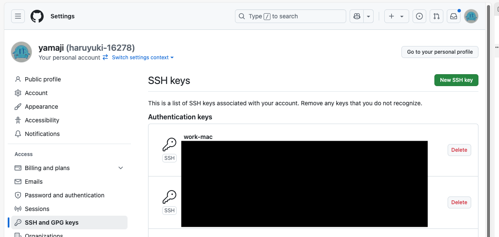

# はじめの一歩は時間割 事前勉強会資料

<details>
  <summary>目次</summary>

- [はじめの一歩は時間割 事前勉強会資料](#はじめの一歩は時間割-事前勉強会資料)
  - [0. この資料について](#0-この資料について)
    - [0.1. 読者想定](#01-読者想定)
  - [1. Visual Studio Code](#1-visual-studio-code)
    - [1.1. インストール](#11-インストール)
    - [1.2. 必要な拡張機能のインストール](#12-必要な拡張機能のインストール)
    - [1.3. `code`コマンドのインストール](#13-codeコマンドのインストール)
  - [2. GitHub](#2-github)
    - [2.1. アカウント作成](#21-アカウント作成)
    - [2.2. READMEリポジトリの作成](#22-readmeリポジトリの作成)
      - [2.2.1. プロフィールを充実させるには](#221-プロフィールを充実させるには)
      - [2.2.2 リポジトリを作成する](#222-リポジトリを作成する)
    - [2.3. GitHub Pagesについて](#23-github-pagesについて)
  - [3. Git](#3-git)
    - [3.1. バージョン管理とは](#31-バージョン管理とは)
    - [3.2. リポジトリ](#32-リポジトリ)
    - [3.3. Gitコマンド](#33-gitコマンド)
      - [3.3.0 config](#330-config)
      - [3.3.1. init](#331-init)
      - [3.3.2. clone](#332-clone)
        - [3.3.2.1 SSHキーの作成](#3321-sshキーの作成)
        - [3.3.2.2 SSHキーをGitHubに登録する](#3322-sshキーをgithubに登録する)
        - [3.3.2.3 READMEリポジトリをクローンする](#3323-readmeリポジトリをクローンする)
      - [3.3.3. pull](#333-pull)
      - [3.3.4. commit](#334-commit)
      - [3.3.5. push](#335-push)
  - [4. Google Chrome](#4-google-chrome)
    - [4.1. インストール](#41-インストール)
    - [4.2. 開発者ツールについて](#42-開発者ツールについて)
      - [4.2.1. 要素タブ](#421-要素タブ)
      - [4.2.2. コンソールタブ](#422-コンソールタブ)
      - [4.2.3. ネットワークタブ](#423-ネットワークタブ)
      - [4.2.4. アプリケーションタブ](#424-アプリケーションタブ)
  - [5. JavaScript](#5-javascript)
    - [5.1. `console` オブジェクト](#51-console-オブジェクト)
    - [5.2. コメント](#52-コメント)
    - [5.2. 基本的な演算](#52-基本的な演算)
      - [5.2.1. 算術](#521-算術)
      - [5.2.2. 文字列](#522-文字列)
    - [5.3. 変数・定数](#53-変数定数)
  - [6. まとめ](#6-まとめ)


</details>

## 0. この資料について

この資料は2025年3月に開催されるjig.jp主催のWeb開発イベントに向けて、参加者の皆様がイベント当日スムーズに作業いただくための事前学習用のドキュメントです。  
大きく以下の内容に分けて解説します。

1. Visual Studio Code
1. GitHub
1. Google Chrome
1. Git
1. JavaScript

### 0.1. 読者想定

- プログラミングは学校の授業で経験しているが、個人でなにかを制作したことは**まだ**ない
- 高校生〜大学生
- 所要時間目安: 100分

## 1. Visual Studio Code

[Visual Studio Code](https://code.visualstudio.com/) (以下 VSCode)は、近年のWeb開発においてもっとも利用されているコードエディターです。  
最近では[GitHub Copilot](https://marketplace.visualstudio.com/items?itemName=GitHub.copilot)との統合の話題で耳にしたことがあるかもしれません。

今回の一連の開発では、コードエディターとしてこのVSCodeを利用します。

### 1.1. インストール

以下のリンクから、使用中のマシンのOSに合ったインストーラーをダウンロードし、実行してVSCodeをインストールしてください。

<https://code.visualstudio.com/Download>

### 1.2. 必要な拡張機能のインストール

今回の開発では、VSCodeの拡張機能を活用して作業を進めていきます。  
以下の拡張機能をそれぞれインストールしてください。

* [Japanese Language Pack for Visual Studio Code](https://marketplace.visualstudio.com/items?itemName=MS-CEINTL.vscode-language-pack-ja)
  * VSCodeを日本語化する拡張機能
* [vscode-icons](https://marketplace.visualstudio.com/items?itemName=vscode-icons-team.vscode-icons)
  * VSCodeのエクスプローラーのアイコンを変更する拡張機能
  * 特定の名前がついたディレクトリ(フォルダ)もアイコンが変更されて便利
* [Live Server](https://marketplace.visualstudio.com/items?itemName=ritwickdey.LiveServer)
  * HTMLファイルを開いているときに開発用サーバーを起動できるようになる拡張機能
* [es6-string-html](https://marketplace.visualstudio.com/items?itemName=Tobermory.es6-string-html)
  * JavaScriptファイル内にテンプレートリテラルでHTMLやCSSを記述するときにシンタックスハイライトが効くようにする拡張機能
* [Markdown All in One](https://marketplace.visualstudio.com/items?itemName=yzhang.markdown-all-in-one)
  * Markdownと呼ばれるマークアップ言語を書きやすくなる拡張機能

<details>
  <summary>コマンドラインからインストールする</summary>

以下のコマンドでも拡張機能をインストールすることができます。

```sh
code --install-extension MS-CEINTL.vscode-language-pack-ja
code --install-extension vscode-icons-team.vscode-icons
code --install-extension ritwickdey.LiveServer
code --install-extension Tobermory.es6-string-html
code --install-extension yzhang.markdown-all-in-one
```

</details>

### 1.3. `code`コマンドのインストール

VSCodeを使いやすくするため、`code`というコマンドでVSCodeを起動できるようにパスを設定しておきます。

VSCodeを開いた状態で`Ctrl(Cmd) + Shift + P`でコマンドパレットを開き、「install」と入力してください。
「シェル コマンド: PATH内に'code'コマンドをインストールします」という選択肢があるので、選択して実行してください。


## 2. GitHub

[GitHub](https://github.com) は現在では最もメジャーなソースコードの共有サービスです。

### 2.1. アカウント作成

以下のリンクからアカウント作成ページを開けます。  
ページの指示に従って、必要事項を入力してアカウントを作成してください。

<https://github.com/signup?ref_cta=Sign+up&ref_loc=header+logged+out&ref_page=%2F&source=header-home>

### 2.2. READMEリポジトリの作成

※ この資料では、GitHub上で特別な取り扱いとなる、ユーザー名と同じ名前のリポジトリのことを READMEリポジトリ と呼称することとします。

#### 2.2.1. プロフィールを充実させるには

アカウントを作成してログインしたら。まずは左上のアバターアイコンから「Your Profile」を選んで自身のプロフィールを確認しましょう。  
このページは自身のユーザー名と同じ名前のリポジトリを作成し、直下に `README.md` というMarkdownファイルを配置して編集することで、プロフィール情報を充実させることが可能です。

#### 2.2.2 リポジトリを作成する

早速 READMEリポジトリ を作成しましょう。  
[GitHub](https://github.com)を開いて、ヘッダーの右側にある「+」のボタンから「New Repository」をクリックしてください。


遷移したページで Repository Name にユーザー名と同じ文字列を入力すると、↓のように「<ユーザー名>/<ユーザー名> のリポジトリは特別なリポジトリだよ！」と表示されます。


このまま下の方にスクロールし、「Add a README file」のチェックを入れて、一番下の「Create Repository」をクリックしてリポジトリを作成してください。

作成されたリポジトリのページが開いたら OK です。  
試しに自身のプロフィールを確認してみると、先程確認したときとは異なる表示になっていると思います。


### 2.3. GitHub Pagesについて

ここで、[GitHub Pages](https://docs.github.com/ja/pages/getting-started-with-github-pages/about-github-pages)という静的ウェブサイトホスティングサービスを紹介しておきます。

「静的ウェブサイト」とは、リクエスト毎には変更されることのない単純なファイルを返却する仕組みのウェブサイトです。  
これを「ホスティング」する「サービス」なので、要するにGitHubによって運営されるウェブサーバーに私達の開発したウェブサイトを置かせてもらえるサービスになります。

今回皆さんにGitHubのアカウントを用意していただいたのは、このGitHub Pagesを利用して成果物を公開したいからです。

## 3. Git

[2.](#2-github)で紹介したGitHubは、「Git Hosting Service」とも呼ばれます。  
この「[Git](https://git-scm.com)」は **バージョン管理システム** と呼ばれるものの一つです。

### 3.1. バージョン管理とは

ではこの「バージョン管理」とは何なのか、について少し説明します。

バージョン管理とは、管理下にあるファイルの「差分」と「作成・変更日時」を紐づけて一つの「変更」とし、この変更を記録することです。  
バージョン管理システムである Git は、この変更それぞれの差分や、変更が行われた時点のファイルの内容を自由に閲覧することが可能です。

### 3.2. リポジトリ

バージョン管理システムの管理下にあるディレクトリのことをリポジトリと呼びます。

[2.2.2.](#222-リポジトリを作成する)でGitHub上でリポジトリを作成しましたが、このリポジトリも同じものです。
手元のPCにあるリポジトリを「ローカルリポジトリ」、GitHubのようなホスティングサービスを利用した場合などのサーバーにあるリポジトリを「リモートリポジトリ」と呼びます。

### 3.3. Gitコマンド

GitはCLIからコマンドを実行して、バージョン管理を行います。

まずは以下のリンクから、使用中のマシンにあった方法で Git をインストールしてください。  
<https://git-scm.com/downloads>

以下によく使うコマンドを紹介します。

#### 3.3.0 config

`git config <設定項目> <設定内容> ...` は、Gitの設定を変更するためのコマンドです。

[1.](#1-visual-studio-code) でインストールしたVSCodeを起動して、`Ctrl(Cmd) + J` キーを押すとターミナルが開きます。

`git` コマンドを利用するうえで、初期設定としてユーザー名とメールアドレスを設定する必要があります。
以下のコマンドを参考に、GitHubアカウントの作成時に設定したそれぞれを設定してください。

```sh
git config user.name "<ユーザー名>"
git config user.email "<メールアドレス>"
```

また、後述するコミットメッセージを編集しやすくするため、以下のコマンドも実行しておきましょう。

```sh
git config core.editor "code --wait"
```

#### 3.3.1. init

`git init` は、ターミナルのカレントディレクトリ下をGit管理するリポジトリとして初期化するコマンドです。  
ローカルリポジトリを作成するときに使用します。

今回の勉強会では使用しませんが、覚えておくと良いでしょう。

#### 3.3.2. clone

`git clone <url>` は、GitHubなどで作成したリモートリポジトリを手元にダウンロードするコマンドです。  
今回は [2.2.2.](#222-リポジトリを作成する) で作成したREADMEリポジトリをcloneしましょう。

##### 3.3.2.1 SSHキーの作成

GitHubにあるリモートリポジトリに対してアクセスするときに、 **SSH**という仕組みを利用します。
この仕組みで利用する「鍵」(SSHキーと呼びます)を作成してGitHubに登録する必要があります。

以下のコマンドを実行して、SSHキーを作成してください。  
パスワードは設定せずで問題ありません。

```sh
ssh-keygen -t ed25519
```

以下のコマンドでSSHキーのファイルが作成されたことを確認しましょう。
`id_ed25519.pub` と `id_ed25519` があれば大丈夫です。

```sh
ls ~/.ssh
```

**注意**: `id_ed25519.pub` を公開鍵、`id_ed25519` を秘密鍵と呼びます。  
この秘密鍵は名前の通り、他人に公開してはいけないので注意して取り扱いましょう。

##### 3.3.2.2 SSHキーをGitHubに登録する

続いて、SSHキーをGitHubに登録します。
GitHubを開いて、ヘッダーのアバターアイコンから「Settings」に移動し、「Access」の下にある「SSH and GPG Keys」を開いてください。 (以下のリンクからも開けます)

<https://github.com/settings/keys>



「New SSH Key」 をクリックして「Add new SSH Key」のページを開いたら、適当な名前をTitleに入力してください。  
Key には `~/.ssh/id_ed25519.pub` の内容を貼り付けてください。

「Add SSH Key」をクリックしてSSHキーの登録を済ませましょう。

##### 3.3.2.3 READMEリポジトリをクローンする

GitHubで作成したリポジトリのページを開き、緑色の「Code」ボタンをクリックします。


URLが表示されるので、コピーしておきます。
以下のようにコマンドを実行してリポジトリをcloneしてください。

```sh
# ホームディレクトリへ移動
cd
# devディレクトリを作成する
mkdir dev
# devディレクトリへ移動
cd dev

# リポジトリをクローンする
git clone <URLを貼り付ける>
```

ホームディレクトリの直下にdevディレクトリを作成して、その中にリポジトリをクローンするはずです。  
エクスプローラー(Finder)などで確認するか、↑で使ったターミナルでそのまま`ls`コマンドを入力するなどして確認してみましょう。

#### 3.3.3. pull

`git pull`はローカルリポジトリの内容をリモートリポジトリと同期するコマンドです。  
試しに[3.3.2.](#332-clone)でcloneしたリポジトリに移動して実行してみましょう。

```sh
# クローンしたリポジトリ下に移動
cd <クローンしたリポジトリ>
# リポジトリを同期する
git pull
```

現時点ではリモートリポジトリに変更がないはずなので、`Already up to date.`と表示されるでしょう。

#### 3.3.4. commit

`git commit`はローカルリポジトリの変更内容を記録するコマンドです。  

ここではクローンしたリポジトリの`README.md`を編集しましょう。  
まずはVSCodeでリポジトリを開きます。メニューバーの「ファイル」から「フォルダーを開く」をクリックして、クローンしたリポジトリを開いてください。  
もしくは、`code <ローカルリポジトリのパス>`でも開くことができます。

試しに以下の内容を追記しましょう。

```markdown
* 名前
  *
* 好きなもの
  *
* 勉強したい技術
  *
```

書き終わったら保存して、 `Ctrl(Cmd) + J`でターミナルを開いて`git commit`を実行しましょう。  
コミットメッセージを入力するタブがVSCodeで開くはずです。

コミットメッセージとは、変更を記録するときにつけるメモのようなものです。  
コミットの記録を見返すときに表示されるものなので、変更内容を短文で端的に表せると良いとされています。  
今回は`自己紹介を追記`などがいいでしょう。

入力したら保存してタブを閉じるとコミットが完了します。

#### 3.3.5. push

`git push` はローカルリポジトリの変更内容をリモートリポジトリに同期するコマンドです。

コマンドを実行して、先程の自己紹介の追記をGitHub上にあるリモートリポジトリに反映しましょう。  

コマンドが正常終了したらGitHubの自分のプロフィールを確認してみましょう。  
追記した内容がプロフィールに表示されているはずです。

この他にも様々なGitコマンドがありますが、今回の勉強会ではこれだけ知っておけば大丈夫でしょう。

## 4. Google Chrome

[Google Chrome](https://www.google.com/intl/ja/chrome/)(以下Chrome) はWebブラウザのひとつです。  
世には様々なブラウザがありますが、Google Chromeは直近でもシェアトップを誇るWebブラウザです。

今回の開発では基本的なブラウザとして、Google Chromeを利用します。

### 4.1. インストール

以下のリンクから、使用中のマシンのOSに合ったインストーラーをダウンロードし、実行してChromeをインストールしてください。

<https://www.google.com/intl/ja_jp/chrome/dr/download/>

### 4.2. 開発者ツールについて

Chromeの開発者ツールには、Web開発で役に立つツールがたくさんあります。
ここでは、開発者ツールのいくつかのタブについて説明します。

まずはダウンロードしたChromeを開き、右クリックメニューから「ページのソースを表示」をクリックするか、`F12`キーを押して開発者ツールを開いてください。

#### 4.2.1. 要素タブ

要素タブでは、表示しているウェブページのソースを確認することができます。

ここには「HTML」というWebページの構造を表現する言語が表示されています。また、タブの下部には「CSS」というWebページの要素の表示を変更する言語が表示されています。

画面の表示が意図したものでないときはこのタブを開いて、左上にある要素選択ツールから気になる場所を選択してHTMLの内容やCSSで適用されているスタイルを確認すると便利です。


#### 4.2.2. コンソールタブ

コンソールタブは、ページ内のJavaScriptが実行中に出力したログを確認したり、簡単なJavaScriptを実行する事ができます。  
JavaScriptについては後述します。


#### 4.2.3. ネットワークタブ

ネットワークタブでは、ページがダウンロードするリソースを確認することができます。

GitHub Pagesを利用するような場合にはローカルの開発環境とファイルの置き場所が異なり、うまくファイルがダウンロードできていないことがあります。  
そういった原因による不具合が考える場合にはネットワークタブでリソースがちゃんとダウンロードできているかどうかを確認すると便利です。


#### 4.2.4. アプリケーションタブ

アプリケーションタブでは、ページ毎のキャッシュやローカルデータの確認ができます。
特に、LocalStorage等のブラウザAPIを利用するような場合に動作テストなどが簡単になり便利です。


## 5. JavaScript

JavaScript はインタプリタ型のスクリプト言語の一つで、ウェブページでよく使用される他、[Node.js](https://nodejs.org/ja)や[Deno](https://deno.com/)などの実行環境を利用することでサーバーサイドなどウェブページ以外でも利用できます。

今回の開発はWeb開発になるので、基本的に処理はJavaScriptを使用して実装することになります。  
ここではJavaScriptの基本的な文法を説明します。

### 5.1. `console` オブジェクト

`console`オブジェクトは、コンソール出力を行う関数が多く内包されているオブジェクトです。  
資料の作成者が「新たにプログラミング言語を書き始めるときは Hello, World! から始める教」に入信しているので、まずは「Hello, World!」を出力してみましょう。

Chromeの開発者ツールを開き、コンソールタブに切り替えて以下のコードを実行してみてください。

```javascript
console.log("Hello, World!");
```


このように表示されれば成功です。  
他にも`console`内には`console.warn()`や`console.error()`、`console.table()`など便利な関数があります。  
状況や目的に応じて使い分けると良いでしょう。

### 5.2. コメント

プログラミング言語におけるコメントは主に以下の２つで利用されます。

1. プログラムの処理内容の補足説明
2. デバッグ中の一時的な処理無効化

JavaScriptには2つのコメントの書き方があります。

```javascript
// スラッシュを2つ書くと、その行のそれ以降はコメントとして取り扱われます。

/*
 * 複数行になるコメントはこのように囲むことで表現できます
 */
```

### 5.2. 基本的な演算

プログラム中で利用する基本的な演算について説明します。

#### 5.2.1. 算術

四則演算は以下のように記述できます。

```javascript
console.log(2 + 3); // 加算
console.log(5 - 2); // 減算
console.log(2 * 2); // 乗算
console.log(6 / 3); // 除算
```

その他、三角関数などの高度な算術演算は`Math`組み込みオブジェクトから利用できます。

#### 5.2.2. 文字列

文字列は以下のように記述することができます。

```javascript
console.log("ダブルクォートで囲むと文字列");
console.log('シングルクォートで囲むと文字列');

const string = "テンプレートリテラル";
console.log(`バッククォートで囲むと${string}`);
```


また、文字列に対して+演算子を利用して文字列を結合することができます。

### 5.3. 変数・定数

プログラム中の値に名前をつけて取り扱えるようにしたものを変数・定数と呼びます。  
JavaScriptでは以下のようにして宣言することができます。

```javascript
let v = 0; // 変数を宣言する
console.log(v);
v = v + 1; // JavaScriptにおける変数は再代入可能な値
console.log(v);

const c = 10; // 定数を宣言する
console.log(c);
c = c + 1; // 定数は再代入不可能なのでエラーとなる
```

## 6. まとめ

この事前勉強会用資料では、本番開発を行うにあたってあらかじめ参加者の皆さんに知っておいてもらいたい知識について説明しました。
もしわからなかった点があればいつでも質問いただけると幸いです。

それでは本編で会いましょう！

[本編へ](../README.md)