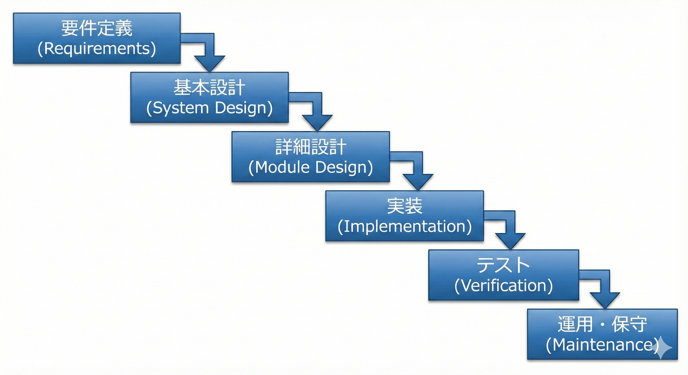
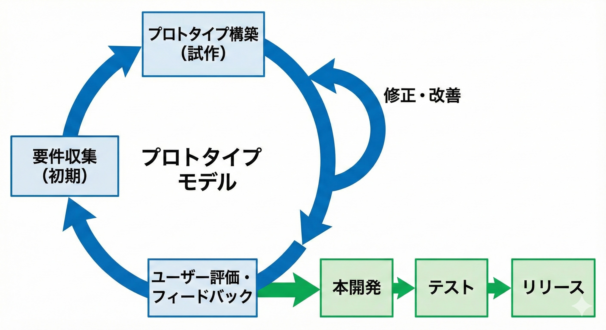
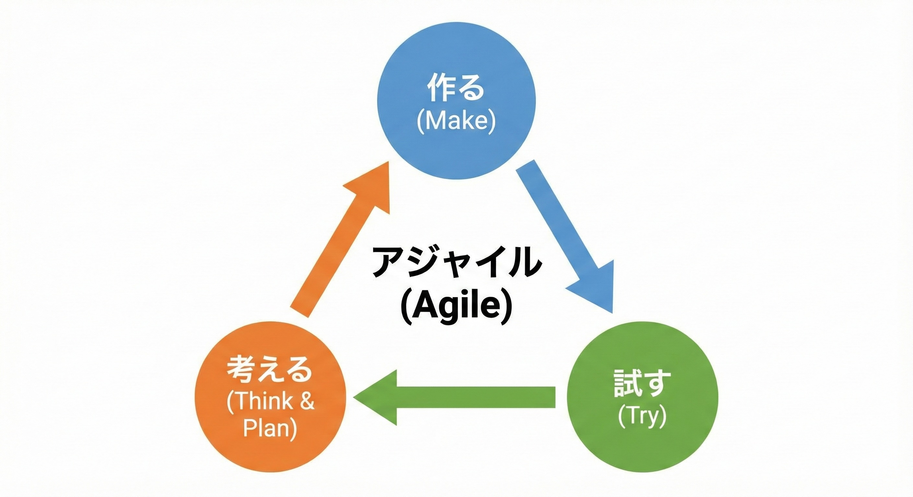

<!-- _class: dark-lead -->

## 体験してみよう！
# サイコロで学ぶスクラム開発

株式会社 jig.jp エンジニア
(香川高専詫間キャンパス 電子システム工学科 2020年度卒業)
**山地 駿徹**

---

## 目次

1. ソフトウェア開発手法
2. スクラム開発とは
3. スクラム体験ゲーム
4. まとめと振り返り

---

<!-- _class: dark-lead -->

# ソフトウェア開発手法{data-order="01."}

---

## 1. ソフトウェア開発手法

ソフトウェアの開発手法は様々ある。代表的なものは以下の通り。

- ウォーターフォール
- プロトタイピング
- アジャイル

---

### ウォーターフォール

大規模で安定している**要件が確定しているプロジェクト**に適している。
デメリットとして、**柔軟性が低く、変更に対応しにくい**特徴がある。

<!--
ウォーターフォール型開発は、要件定義、設計、実装、テスト、運用の各工程を順番に進めていく手法。
ウォーターフォール型開発は、開発プロセスを一連の段階に分けて順次進める方法です。
名前の由来は、各工程が滝のように次の工程へと流れていくことからです。
-->

---

### プロトタイピング

プロトタイプを作成する上で、**仕様や要件がある程度決定している**必要がある。
時間とコストの管理が重要で、過度なスコープ拡大を防ぐためのマネジメントが必要。

<!--
プロトタイピング型開発は、まず試作品（プロトタイプ）を作成し、顧客からのフィードバックをもとに要件を明確化していく手法。
プロトタイプ型開発は、製品やシステムの初期モデル（プロトタイプ）を迅速に作成し、ユーザーやステークホルダーからのフィードバックを基に改善を反復する開発手法です。
原則としてプロトタイプ作成サイクルと製品版作成サイクルの2つで構成されています。
後述のアジャイル型開発では、繰り返すサイクルの中で仕様や機能が決定していくのに対し、プロトタイプ型開発はプロトタイプを作成する上で、仕様や要件がある程度決定している必要があります。
アジャイル型開発ほどフィードバックを反映する自由度はないため、時間とコストの管理が重要であり、過度なスコープ[^2]拡大を防ぐための適切なマネジメントが求められます。
-->

---

### アジャイル

**事前にすべてを正確に予測し、計画することはできない**という前提の上で、プロダクトの重要な部分から少しずつ作っていく手法。**改善を迅速に反映できる**一方、**マネジメントが複雑**になる。

<!--
アジャイル開発は、柔軟性、迅速な対応、ユーザーのニーズへの応答を重視した開発手法です。
アジャイル型開発は、短い期間で繰り返し開発とフィードバックを行い、柔軟に変更に対応する手法。
先述のウォーターフォール型・プロトタイプ型とは対照的に、継続的な開発・リリースによるアプローチが特徴です。
柔軟に機能を追加したりユーザーやステークホルダーからのフィードバックを迅速に反映したりできる反面、マネジメントが複雑になりコストの算出が難しくなったり、最初から厳密に方針を定めないことも多いので開発途中で構想のブレなども生じやすいです。
-->

---

#### アジャイルソフトウェア開発宣言

:::_ {.small-text}
> 私たちは、ソフトウェア開発の実践
> あるいは実践を手助けをする活動を通じて、
> よりよい開発方法を見つけだそうとしている。
> この活動を通して、私たちは以下の価値に至った。
> 
> プロセスやツールよりも**個人と対話**を、
> 包括的なドキュメントよりも**動くソフトウェア**を、
> 契約交渉よりも**顧客との協調**を、
> 計画に従うことよりも**変化への対応**を、
> 
> 価値とする。すなわち、左記のことがらに価値があることを
> 認めながらも、私たちは右記のことがらにより価値をおく。
:::

::::_ {.row}
:::_ {.smaller-text}
Kent Beck
Mike Beedle
Arie van Bennekum
Alistair Cockburn
Ward Cunningham
Martin Fowler
:::

:::_ {.smaller-text}
James Grenning
Jim Highsmith
Andrew Hunt
Ron Jeffries
Jon Kern
Brian Marick
:::

:::_ {.smaller-text}
Robert C. Martin
Steve Mellor
Ken Schwaber
Jeff Sutherland
Dave Thomas
:::
::::

:::_ {.smaller-text}
© 2001, 上記の著者たち
この宣言は、この注意書きも含めた形で全文を含めることを条件に
自由にコピーしてよい。
:::

---

#### アジャイル開発とは

##### ソフトウェアを作るうえで本当に重要なことは何か？

出来上がったソフトウェアによって、ユーザーの課題を解決したり、利益を上げたりする

- つまり、**成果を上げること**

##### では、成果を最大化するためにはどうすればいいのか？

- プロダクトに関わるメンバーが、**お互いに協力し合い**ながら進める
- **少しずつ作って、少しずつ評価し、少しずつ改善する**ことを繰り返す
- ユーザーやメンバーからのフィードバックを**継続的に収集し、臨機応変に取り入れる**

---

<!-- _class: dark-lead -->

# スクラム開発とは{data-order="02."}

---

## 2. スクラム開発とは

スクラム開発は、アジャイル型開発の代表的な手法の一つ。
チームが自己管理し、継続的に開発プロセスの改善を図りながら、製品を開発していく。

スクラム開発では、開発を**スプリント**と呼ばれる短い期間を繰り返すことで進めていく。

<!--
アジャイル型開発には他にエクストリーム・プログラミング(XP)やカンバンなどの手法がある。
-->

---

### スクラムの特徴

- 機能や要求を、リスクや必要性を基準にして**優先順位付け**する
- 固定の短い時間（**タイムボックス**）に区切って作業を進める
- **透明性**:
　　現在の状況や問題点が常に明らかになっている状態=透明性が高い状態
- **検査**:
　　定期的に成果を上げられるのか、プロセスに問題がないかを確認する
- **適応**:
　　検査の結果に基づいてプロセスそのものを柔軟に変更する

---

### スクラムのルール

スクラムには**5つのイベント**と**3つのロール**、**3つの作成物**がある。

<!--
これらはスクラムを実践するうえでの最低限のルールのセットであり、各チームに合わせて調整していく必要がある。
また、スクラムにはコーディングルールやテスト等の技術的なプラクティスは含まれていないため、チームはそれらを独自に定義し、実践していく必要がある。
-->

::::_ {.row}
:::_
**イベント**

- スプリント
- スプリント計画
- デイリースクラム
- スプリントレビュー
- スプリント振り返り
:::

:::_
**ロール**

- プロダクトオーナー
- 開発チーム
- スクラムマスター
:::

:::_
**作成物**

- プロダクトバックログ
- スプリントバックログ
- インクリメント
:::
::::

---

<!-- _class: dark-lead -->

## スクラムのイベント

---

### スプリント

**1〜4週間の固定期間**で、プロダクトの成果物を作成するための開発サイクル。

以下で構成される：
- **計画**
- **実装**
- **レビュー**
- **振り返り**

---

### スプリント計画

- スプリントの**開始時**に行うミーティング
- 開発チームがスプリントで**何を達成するか**を決定する
- **スプリントバックログ**を作成する

---

### デイリースクラム

- **毎日行う15分**のミーティング
- 開発チームが**進捗を確認**する
- **障害を共有**する
- 次の24時間の作業を計画する

---

### スプリントレビュー

- スプリントの**終了時**に行うミーティング
- チームが成果物を**デモンストレーション**する
- ステークホルダーから**フィードバック**を受け取る

---

### スプリント振り返り

- スプリントの**終了後**に行う振り返りミーティング
- チームが**プロセスを評価**する
- **改善点**を見つけるために行う

---

<!-- _class: dark-lead -->

## スクラムのロール

---

### プロダクトオーナー

- プロダクトの**ビジョンと目標**を保持する
- **プロダクトバックログ**を管理する責任を持つ
- 顧客やステークホルダーのフィードバックを反映する
- バックログアイテムの**優先順位**を設定する

---

### 開発チーム

- プロダクトの**インクリメント（成果物）**を作成する
- **技術横断的**なメンバーで構成される
- **設計、開発、テスト**などの全工程を担当する

---

### スクラムマスター

- チームが**スクラムのルール**を理解し、適用するのを支援する
- チームの**障害を取り除く**
- スプリントの**円滑な進行**をサポートする

---

<!-- _class: dark-lead -->

## 作成物

---

### プロダクトバックログ

プロダクトに必要な**全ての機能や要件**をリスト化したもの。

- **プロダクトオーナー**が管理する
- **優先順位**をつけて整理する
- 開発の方向性を示す重要な成果物

---

### スプリントバックログ

そのスプリントで実装する予定の**プロダクトバックログ項目**と、その実現のための**具体的なタスク**のリスト。

- **開発チーム**が作成し管理する
- スプリント中の作業指針となる

---

### インクリメント

スプリントの終了時に完成した**動作するプロダクトの部分**。

- **完成の定義**を満たしている必要がある

---

<!-- _class: dark-lead -->

## プロダクトのビジョン

---

## ビジョン

プロダクトが**どんなものなのか**を示し、プロダクトの開発指針となるもの。

含まれる要素：
- ターゲット
- ニーズ
- 強み
- ユーザーが使う理由
- 主要な競合
- 差別化ポイント

**スクラムチーム全員が唱えられるくらいを目標に！**

---

<!-- _class: dark-lead -->

# スクラム体験ゲーム{data-order="03."}

---

## スクラム体験ゲーム

プロダクトを仮想して、実際の流れを体験してみましょう。
勉強会向けにアレンジしているので、**プロダクトオーナーとスクラムマスターは開発チーム兼任**します。

**ルール:**
- スプリントは**第3スプリント**までとする
- 1スプリントは**4日**とする
- 1日の作業はサイコロを1回振り、出目の数を進捗とする
- それぞれのタスクは一律で**出目の合計が12で完了**とする
- 1チーム**3〜5人**を目安とする

---

### ゲームの流れ

1. アイデア出し/ビジョンの決定
2. 担当の割り振り
3. プロダクトバックログの登録
4. スプリント計画
5. 作業（4日）
6. スプリントレビュー
7. スプリント振り返り
8. 次スプリント計画
9.  6.に戻ってくり返す
10. 全体振り返り

---

### 1. アイデア出し/ビジョンの決定

今回は、仮に**「しりとりアプリ」**をテーマにします。

**ビジョン:**
「小学生をターゲットとした地図を使って地名でしりとりをするアプリ」

---

### 2. 担当の割り振り

話し合って以下の担当を決定してください：

- **プロダクトオーナー**（1人）- 開発チームと兼任
- **スクラムマスター**（1人）- 開発チームと兼任
- **開発チーム**（各1人以上）
  - サーバ
  - クライアント
  - デザイン

---

### 3. プロダクトバックログの作成

アプリのビジョンからどのような機能を実装するか洗い出し、プロダクトバックログに登録します。
このリストはプロダクトオーナーが作成し、管理してください。

以下の内容が記載されているか確認してください：
- 環境構築
- ログインの実装
- 通知の実装
- ホーム画面の実装
- 地図画面の実装

---

### 4. スプリント計画

スプリント計画では、**スプリントバックログの作成**と**タスクの割り振り**を行います。

最初のスプリントでは以下のスプリントバックログを記載しましょう：

| タスク | 担当 |
|--------|------|
| 環境構築 | Aさん |
| 通知のDB設計 | Aさん |
| 通知のAPI実装 | Bさん |
| ホームのAPI実装 | Bさん |
| ホームのデザイン | Cさん |
| ホームのクライアント実装 | Cさん |

---

### 5. デイリースクラムと作業

以下の手順で作業します：

1. 自分がその日担当するタスクをチーム内で共有する
2. 実施するタスクについてサイコロを振って出目を記録する
   - 例: `API実装: Bさん (4,4,3,6) 17/12`
3. 手元の合計が12以上ならタスクを完了とする
4. 手持ちタスクがなくなったら、着手されていないタスクの担当を自分に割り振る

※サイコロがない場合は、Googleで **"1d6"** と検索

---

### 6. スプリントレビュー

スプリントレビューで成果物のレビューを行います。
以下の指摘例を参考に**2つ指摘**を挙げて、指摘事項をプロダクトバックログに登録してください。

**指摘例:**
- 通知の処理が遅い
- ホーム画面の表示が崩れている
- 地図の表示が遅い
- ボタンの色が変
- レスポンシブじゃない

---

### 7. スプリント振り返り

**KPT**で振り返りをします。

| K（Keep）良かったこと | P（Problem）改善点 | T（Try）改善方法 |
|----------------------|-------------------|-----------------|
| Aさんが環境構築やってくれた | Cさんの出目が悪い | Cさんのサイコロを増やす |
| BさんAPI実装感謝 | | |

スクラムマスターがサイコロを振り、**偶数の目なら業務改善成功**とします。
成功した場合、次スプリントで**1人だけサイコロを2つ振れる**ようになります。

---

### 8. 次スプリント計画

振り返りが終了したら、次のスプリント計画を行います。

- 前スプリントで**完了しなかったタスク**を確認する
- スプリントレビューで追加された**新しいプロダクトバックログ**を確認する
- 残りのスプリント数を見て、**優先順位**を再検討する
- 新しい**スプリントバックログ**を作成し、タスクを割り振る

---

### 9. スプリントを繰り返す

**6. スプリントレビュー** に戻って、第3スプリントまで繰り返します。

**各スプリントで意識すること：**
- 前スプリントの**Tryを実践**する
- **デイリースクラム**で進捗と障害を共有する
- スプリント終了時に**成果物をレビュー**する
- **振り返り**でプロセスを改善し続ける

**第3スプリントが完了したら、全体振り返りへ進みます。**

---

### 10. 全体振り返り

全てのスプリントが完了したら、今回の開発全体をKPTで振り返ります。

今回の演習では、代わりに**分かったこと・分からなかったこと**を振り返ります。
チーム関係なしで全員で書き込めるドキュメントを用意して、みんなで書き込みましょう（5分）。

**振り返り例:**
- **わかったこと**: だいたいの流れがわかった（Aさん）
- **わからなかったこと**: スクラムマスターって実際には何をするんだろう（Cさん）

---

<!-- _class: dark-lead -->

# まとめと振り返り{data-order="04."}

---

## まとめと振り返り

#### アジャイル開発とは

* **成果を上げること**を最も重視する開発手法
* 少しずつ作って、少しずつ評価し、少しずつ改善することを繰り返す
* フィードバックを継続的に収集し、臨機応変に取り入れる

#### スクラム開発とは

* アジャイル型開発の代表的なフレームワーク
* **5つのイベント**、**3つのロール**、**3つの作成物**から構成される
* **透明性・検査・適応**の3本柱でプロセスを改善し続ける
