# ウェブコンポーネントを利用したSPAの開発手法

<details>
  <summary>目次</summary>

- [ウェブコンポーネントを利用したSPAの開発手法](#ウェブコンポーネントを利用したspaの開発手法)
  - [1. イントロダクション](#1-イントロダクション)
    - [1.1. 目的](#11-目的)
    - [1.2. レポート課題について](#12-レポート課題について)
  - [2. ウェブアプリケーションとは](#2-ウェブアプリケーションとは)
    - [2.1. ウェブアプリケーション](#21-ウェブアプリケーション)
    - [2.2. コンテンツ配信](#22-コンテンツ配信)
    - [2.3. シングルページアプリケーション(SPA)とは](#23-シングルページアプリケーションspaとは)
  - [3. 開発ツール](#3-開発ツール)
    - [3.1. Visual Studio Code](#31-visual-studio-code)
      - [3.1.1. 拡張機能](#311-拡張機能)
      - [3.1.2. ユーザー設定/ワークスペース設定](#312-ユーザー設定ワークスペース設定)
    - [3.2. ブラウザの開発者ツール](#32-ブラウザの開発者ツール)
      - [3.2.1. 要素タブ（Elementsタブ）](#321-要素タブelementsタブ)
      - [3.2.2. コンソールタブ（Consoleタブ）](#322-コンソールタブconsoleタブ)
      - [3.2.3. ネットワークタブ（Networkタブ）](#323-ネットワークタブnetworkタブ)
      - [3.2.4. アプリケーションタブ（Applicationタブ）](#324-アプリケーションタブapplicationタブ)
  - [4. 開発の準備](#4-開発の準備)
  - [5. HTML](#5-html)
    - [5.1. 要素とタグ](#51-要素とタグ)
    - [5.2. DOCTYPE宣言](#52-doctype宣言)
    - [5.3. 基本的なHTML文書の構成](#53-基本的なhtml文書の構成)
      - [5.3.1. HTMLにおける「子孫」とは](#531-htmlにおける子孫とは)
      - [5.3.2. HTML要素](#532-html要素)
      - [5.3.3. head要素](#533-head要素)
      - [5.3.4. body要素](#534-body要素)
    - [5.4. HTML要素](#54-html要素)
      - [5.4.1. 見出しと段落](#541-見出しと段落)
      - [5.4.2. 箇条書き(リスト)](#542-箇条書きリスト)
      - [5.4.3. 強調と重要の表現とその違い](#543-強調と重要の表現とその違い)
      - [5.4.4. 画像を表示する](#544-画像を表示する)
      - [5.4.5. リンク](#545-リンク)
      - [5.4.6. 汎用コンテナー](#546-汎用コンテナー)
  - [6. CSS](#6-css)
    - [6.1. ボックスモデル](#61-ボックスモデル)
      - [6.1.1. margin](#611-margin)
    - [6.2. セレクタ](#62-セレクタ)
      - [6.2.1. セレクタと結合子](#621-セレクタと結合子)
      - [6.2.2. 疑似表記](#622-疑似表記)
    - [6.3. CSSを利用したスタイリング](#63-cssを利用したスタイリング)
      - [6.3.1. CSSを適用する](#631-cssを適用する)
      - [6.3.2. カスタムプロパティ](#632-カスタムプロパティ)
      - [6.3.3. 文字の見た目を変更しよう](#633-文字の見た目を変更しよう)
      - [6.3.4. 要素の見た目を変更しよう](#634-要素の見た目を変更しよう)
    - [6.4. フレックスボックスとグリッドレイアウト](#64-フレックスボックスとグリッドレイアウト)
      - [6.4.1. 聖杯レイアウト](#641-聖杯レイアウト)
      - [6.4.2. フレックスボックス](#642-フレックスボックス)
      - [6.4.3. グリッドレイアウト](#643-グリッドレイアウト)
  - [7. JavaScript （Ⅰ）](#7-javascript-ⅰ)
    - [7.1. コードの可読性](#71-コードの可読性)
      - [7.1.1. 厳格モード](#711-厳格モード)
      - [7.1.2. コメント](#712-コメント)
      - [7.1.3. 命名](#713-命名)
    - [7.2. 基本的な処理](#72-基本的な処理)
      - [7.2.1. 変数](#721-変数)
      - [7.2.2. 四則演算](#722-四則演算)
      - [7.2.3. その他の算術演算](#723-その他の算術演算)
      - [7.2.4. 文字列の処理](#724-文字列の処理)
      - [7.2.5. 論理演算](#725-論理演算)
    - [7.3. 条件分岐](#73-条件分岐)
      - [7.3.1. 比較演算子](#731-比較演算子)
      - [7.3.2. if文](#732-if文)
      - [7.3.3. 三項演算子](#733-三項演算子)
    - [7.4. 繰り返し](#74-繰り返し)
      - [7.4.1. 配列](#741-配列)
      - [7.4.2. for文](#742-for文)
      - [7.4.3. `Array.prototype.forEach()`](#743-arrayprototypeforeach)
  - [8. JavaScript （Ⅱ）](#8-javascript-ⅱ)
    - [8.1. 関数](#81-関数)
      - [8.1.1. 関数](#811-関数)
      - [8.1.2. 無名関数](#812-無名関数)
      - [8.1.3. 値としての関数](#813-値としての関数)
    - [8.2. オブジェクト](#82-オブジェクト)
      - [8.2.1. 定義とアクセス](#821-定義とアクセス)
      - [8.2.2. プロパティの追加と存在確認](#822-プロパティの追加と存在確認)
      - [8.2.3. メソッド](#823-メソッド)
    - [8.3. クラス](#83-クラス)
      - [8.3.1. コンストラクタメソッド](#831-コンストラクタメソッド)
      - [8.3.2. this](#832-this)
  - [9. 動的なウェブページの開発](#9-動的なウェブページの開発)
    - [9.1. ユーザー入力イベント](#91-ユーザー入力イベント)
      - [9.1.1. ボタン要素](#911-ボタン要素)
      - [9.1.2. イベントリスナー](#912-イベントリスナー)
    - [9.2. DOM操作](#92-dom操作)
      - [9.2.1. コンテンツを変更する](#921-コンテンツを変更する)
      - [9.2.2. CSSを動的に適用する](#922-cssを動的に適用する)
    - [9.3. CSS トランジション](#93-css-トランジション)
  - [10. ウェブコンポーネント](#10-ウェブコンポーネント)
    - [10.1. カスタム要素](#101-カスタム要素)
      - [10.1.1. ライフサイクルコールバック](#1011-ライフサイクルコールバック)
    - [10.2. ShadowDOM](#102-shadowdom)
  - [11. ウェブコンポーネントを利用したSPAの開発](#11-ウェブコンポーネントを利用したspaの開発)
    - [11.1. ディレクトリ構成](#111-ディレクトリ構成)
    - [11.2. ルーティング](#112-ルーティング)
    - [11.3. カスタム要素の登録を担うファイルを用意する](#113-カスタム要素の登録を担うファイルを用意する)
    - [11.4. CSS（実践）](#114-css実践)
      - [11.4.1. 全体のCSS](#1141-全体のcss)
      - [11.4.2. カスタム要素のCSS](#1142-カスタム要素のcss)
      - [11.4.3. :host 疑似クラス](#1143-host-疑似クラス)
    - [11.5. TODOアイテム編集画面の実装](#115-todoアイテム編集画面の実装)
      - [11.5.1. ベースになるカスタム要素の作成と登録の確認](#1151-ベースになるカスタム要素の作成と登録の確認)
      - [11.5.2. 編集画面の実装](#1152-編集画面の実装)
    - [11.6. TODOアイテム一覧画面の実装](#116-todoアイテム一覧画面の実装)
  - [12. まとめ](#12-まとめ)

</details>

## 1. イントロダクション

### 1.1. 目的

この実験ではまず、HTML、CSS、JavaScriptの3つの言語について学習します。
その後、「ウェブコンポーネント」とまとめて呼ばれる一連の技術を学習し、これを利用したシングルページアプリケーション(以下 SPA)の開発手法を体験することを目的とします。

### 1.2. レポート課題について

この実験のレポート課題は、「**📝課題**」というキーワードに続けて示す問題に対し回答を記述するものとします。
また、問題文の末尾には「（n点）」というようにその課題の配点を示します。
レポートには課題の配点の合計が少なくとも6点を超えるよう、資料中に示した課題を複数個選択してレポートを作成してください。

**📝課題** 1.2-1. あなたの好きなうどんのメニュー名ひとつと、実験の感想を200字程度で記述しなさい。（2点）

## 2. ウェブアプリケーションとは

### 2.1. ウェブアプリケーション

「アプリケーションソフトウェア」とは、コンピュータ上で特定の作業や処理を行うために作成されたソフトウェアのことです。単に「アプリケーション」と言うこともあります。

このうち、OS（基本ソフトウェア）にインストールして利用するアプリケーションのことを「ネイティブアプリケーション」と言います。  
例えば、ウェブブラウザやオフィスソフトウェアなどがこれに該当します。

このネイティブアプリケーションに対して、ウェブブラウザ上でソフトウェアのインストール無しに動作するアプリケーションのことを「ウェブアプリケーション」と言います。
コンピュータにインストールされたウェブブラウザを利用して、ブラウザ上で特定の作業や処理を行うソフトウェアがウェブアプリケーションということになります。

例えば、みなさんが利用している通信販売サービスや動画投稿サイトなどもウェブアプリケーションに該当します。

**📝課題** 2.1-1. ウェブアプリケーションとウェブサイトの違いを調べ、「双方向」という言葉を使って説明しなさい。（1点）

### 2.2. コンテンツ配信

世の中のモノは、何らかの方法で人からアクセス可能でなければ、見たり使ったりすることができません。  
例えば、有名な写真家でも個展やSNSでの発信がなければ、撮影した写真が日の目を見ることはありません。

アプリケーションも同様に、ユーザーがそれを利用するにはユーザーにアプリケーションを届ける仕組みが必要です。この仕組みをコンテンツ配信と言います。  
例えば、スマートフォン上で動作するネイティブアプリケーションは、OSがAndroidであればPlayストア、iOSであればApp Storeで配信され、ユーザーは自由にインストールして利用することが可能です。

<figure class="center">

<figcaption><a id="f22-1">図 2.2-1. ネイティブアプリケーションのコンテンツ配信</a></figcaption>


</figure>

ウェブアプリケーションでは、この部分はウェブサーバーが担います。  
これによって、ブラウザからアプリケーションに対してアクセスすることができ、ユーザーからアプリケーションが利用可能になります。

<figure class="center">

<figcaption><a id="f22-2">図 2.2-2. ウェブアプリケーションのコンテンツ配信</a></figcaption>


</figure>

今回の実験ではコンテンツ配信についてはこれ以降解説しません。  
もし興味があれば、以下の資料やサイトを参考に自分で調べて取り組んでみてください。

- [はじめの一歩は時間割 - 9. アプリを公開しよう](https://github.com/jigintern/study_session_materials/blob/main/2024/web-timetable/DOCS.md#9-%E3%82%A2%E3%83%97%E3%83%AA%E3%82%92%E5%85%AC%E9%96%8B%E3%81%97%E3%82%88%E3%81%86)
- [GitHub Pagesの使い方 - ウェブ開発の学習|MDN](https://developer.mozilla.org/ja/docs/Learn_web_development/Howto/Tools_and_setup/Using_GitHub_pages)

### 2.3. シングルページアプリケーション(SPA)とは

さて、ウェブアプリケーションについては [2.1. ウェブアプリケーション](#21-ウェブアプリケーション) で説明したとおりです。  
しかし、ウェブアプリケーションと一口に言っても、その動作や仕組みによって細かく分類されています。

ここでは「シングルページアプリケーション」（Simgle Page Application:以下SPAと略す）を説明します。

ウェブアプリケーションは基本的にHTML/CSS/JavaScriptという3つの言語を利用して動作しています。  
このうち、HTMLのファイルを一つだけ利用し、JavaScriptによってHTMLに変更を加えて動作させるような仕組みのウェブアプリケーションのことをSPAと言います。
一度HTMLファイルをウェブサーバーから取得したあとはブラウザ上のみで表示の切り替えを行うため、複雑で動的に動作する必要なアプリケーションに適しています。

これに対して、複数のHTMLファイルを作成して、これらをリンクなどで相互に移動できるようにすることでアプリケーションを作成しているものを「マルチページアプリケーション」（Multi Page Application）と言います。
こちらはブラウザで行う処理が少なくなるため、よりスペックの低い端末でもアプリケーションを利用したい場合に適しています。

## 3. 開発ツール

### 3.1. Visual Studio Code

[Visual Studio Code](https://code.visualstudio.com/)（以下 VSCode）はMicrosoftが開発しているエディタです。  
多数の環境設定や豊富な拡張機能から生まれる高いカスタマイズ性が魅力のエディタで、直近ではGitHub Copilotを利用したAIによるコード生成支援などもサポートされ話題になりました。

ここでは、VSCodeを今回の実験で利用しやすいようにカスタマイズするため、いくつかの拡張機能とおすすめの環境設定を紹介します。

#### 3.1.1. 拡張機能

VSCodeには標準では実装されていない機能を追加できる「拡張機能」があります。   
公開された拡張機能から必要なものをインストールして利用する形です。

ここでは、今回の実験で必須になるものと、必須ではないがインストールを推奨するものに分けていくつか紹介します。
必須のものに関しては必ずインストールしておくようにしてください。

以下の[図 3.1.1-1.](#f311-1)の赤線で囲ったアイコンから拡張機能パネルを開くことができます。

<figure class="center">

<figcaption><a id="f311-1">図 3.1.1-1. VSCodeの拡張機能サイドパネルを開くアイコンの位置</a></figcaption>


</figure>

開いたパネルの検索窓に以下の拡張機能の名前を入力して検索し、インストールしてください。

<figure class="center">

<figcaption><a id="f311-2">図 3.1.1-2. VSCodeの拡張機能の検索とインストールボタン</a></figcaption>


</figure>

* 必須 
  * [Live Server](https://marketplace.visualstudio.com/items?itemName=ritwickdey.LiveServer)
    * エディタで開いているHTMLファイルを簡易ウェブサーバーをローカルに作成してブラウザから閲覧可能にできる
  * [es6-string-html](https://marketplace.visualstudio.com/items?itemName=Tobermory.es6-string-html)
    * JavaScript中にテンプレートリテラルを利用して記述されるHTMLやCSSに対して、特定のコメントをつけることでシンタックスハイライトを有効にできる
* 推奨
  * [Japanese Language Pack for Visual Studio Code](https://marketplace.visualstudio.com/items?itemName=MS-CEINTL.vscode-language-pack-ja)
    * VSCodeを日本語化できる言語パック
  * [vscode-icons](https://marketplace.visualstudio.com/items?itemName=vscode-icons-team.vscode-icons)
    * エクスプローラーで表示されるファイルやディレクトリのアイコンが拡張子や名前によって変更される
  * [Prettier - Code formatter](https://marketplace.visualstudio.com/items/?itemName=esbenp.prettier-vscode)
    * ウェブ開発に利用する各言語に対して、決められたルールをもとにコードスタイルをフォーマットできる

#### 3.1.2. ユーザー設定/ワークスペース設定

VSCodeには「ユーザー設定」と「ワークスペース設定」の2種類の環境設定があります。  
「ユーザー設定」はVSCodeを利用する端末毎の環境設定で、これに対して「ワークスペース設定」はVSCodeで開いたディレクトリに保存される設定です。  

それぞれ、ユーザー設定は開発する言語などによらず設定したいもの（ミニマップの非表示など）や自分だけに適用されていればいい設定をするのに便利で、ワークスペース設定はチームで共通のコーディングルールを設定したいとき（インデントをタブ/スペースのどちらで設定するかなど）に便利です。

今回はユーザー設定に指定しておくと便利な設定を紹介します。  
設定画面は`Ctrl(cmd) + Shift + P`のショートカットで呼び出せるコマンドパレットに「Settings」と入力して、「基本設定: ユーザー設定を開く(JSON)」を選択してEnter(return)を押すと開けます。

開いたファイルに以下の内容を貼り付けてください。

```json
{
  "editor.wordWrap": "on",
  "editor.formatOnSave": true,
  "editor.renderWhitespace": "all",
  "editor.tabSize": 2,
  "editor.minimap.enabled": false,
}
```

上から順に、以下の設定内容になっています。

* エディタの端で行を折り返すかどうか: 折り返す
* ファイルの保存時にフォーマットするか: フォーマットする
* 空白文字を表示するか: 表示する
* インデントをスペース何文字で表現するか: 2文字
* ミニマップを表示するか: 表示しない

このほかにも多くの設定項目があります。  
ここで紹介した設定はあくまで筆者が使いやすいものから抜粋した設定です。
また、JSONファイルを編集して設定する他に、GUIからの設定も可能です。更に言語ごとの設定も可能なので、自分好みの設定を求めてカスタマイズすると良いでしょう。  

**📝課題 3.1.2-1.** 拡張機能で推奨とした「Prettier - Code Formatter」は上記設定では有効になりません。コマンドパレットから言語固有の設定を構成して、HTML、CSS、JavaScriptの3言語でデフォルトのフォーマッターがPrettierになるように設定し、その結果のユーザー設定のJSONファイルを示しなさい。（課題以外の設定が含まれていても構いません）（1点）

### 3.2. ブラウザの開発者ツール

> 要素タブ、スタイルタブ、コンソールタブ、アプリケーションタブ

現在のブラウザには非常に強力な開発者ツールが搭載されており、ウェブ開発で非常に役に立ちます。
ここでは、開発者ツールのいくつかのタブについて説明します。

ブラウザで新しいタブを開いてください。  
URLバーの右のほうにある「⋯」や「︙」のボタンをクリックして、表示されたメニューから「その他のツール」の中に「デベロッパーツール」や「開発者ツール」という項目があるのでクリックすると開発者ツールを開くことができます。 

#### 3.2.1. 要素タブ（Elementsタブ）

要素タブでは、表示しているウェブページのソースを確認することができます。

ここには「HTML」というWebページの構造を表現する言語が表示されています。また、タブの下部には「CSS」というWebページの要素の表示を変更する言語が表示されています。

画面の表示が意図したものでないときはこのタブを開いて、左上にある要素選択ツールから気になる場所を選択してHTMLの内容を確認できます。

<figure class="center">

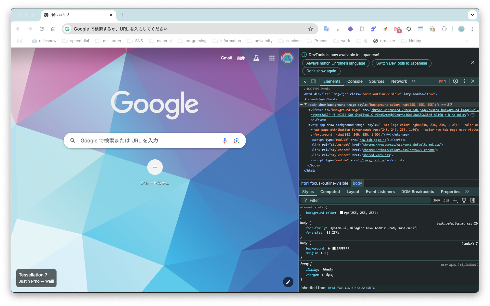

<figcaption><a id="f321-1">図 3.2.1-1. 開発者ツールの要素タブ</a></figcaption>

</figure>

また、下部に更にタブが表示されています。上の画像ではStyleタブになっていて、ここではCSSで適用されているスタイルを確認できます。  
下部ペインのタブを計算済み（Computed）に切り替えると要素の大きさをグラフィカルに確認することができます。

<figure class="center">


<figcaption><a id="f321-2">図 3.2.1-2. 要素タブの下部ペインを計算済みに切り替えた表示</a></figcaption>

</figure>


#### 3.2.2. コンソールタブ（Consoleタブ）

コンソールタブは、ページ内のJavaScriptが実行中に出力したログを確認したり、簡単なJavaScriptを実行する事ができます。  
JavaScriptについては後述します。

<figure class="center">

<figcaption><a id="f322-1">図 3.2.2-1. 開発者ツールのコンソールタブ</a></figcaption>

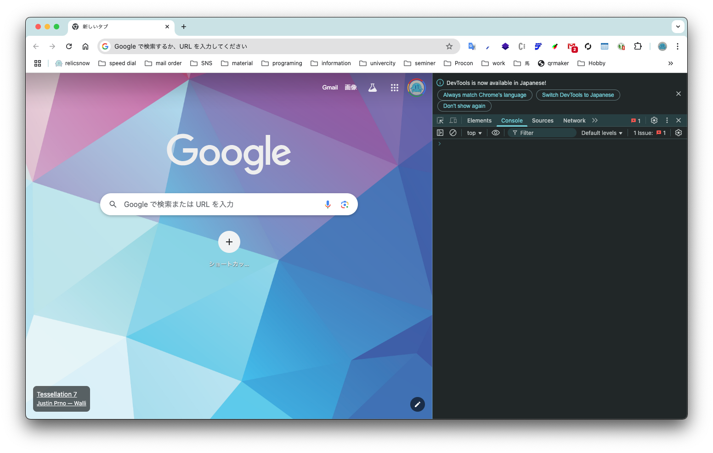

</figure>

#### 3.2.3. ネットワークタブ（Networkタブ）

ネットワークタブでは、ページがダウンロードするリソースを確認したり、ページを閲覧するために転送されたデータ量やかかった時間を確認することができます。

GitHub Pagesを利用するような場合にはローカルの開発環境とファイルの置き場所が異なり、うまくファイルがダウンロードできていないことがあります。  
そういった原因による不具合が考えられる場合にはネットワークタブでリソースがちゃんとダウンロードできているかどうかを確認すると便利です。

<figure class="center">

<figcaption><a id="f323-1">図 3.2.3-1. 開発者ツールのネットワークタブ</a></figcaption>

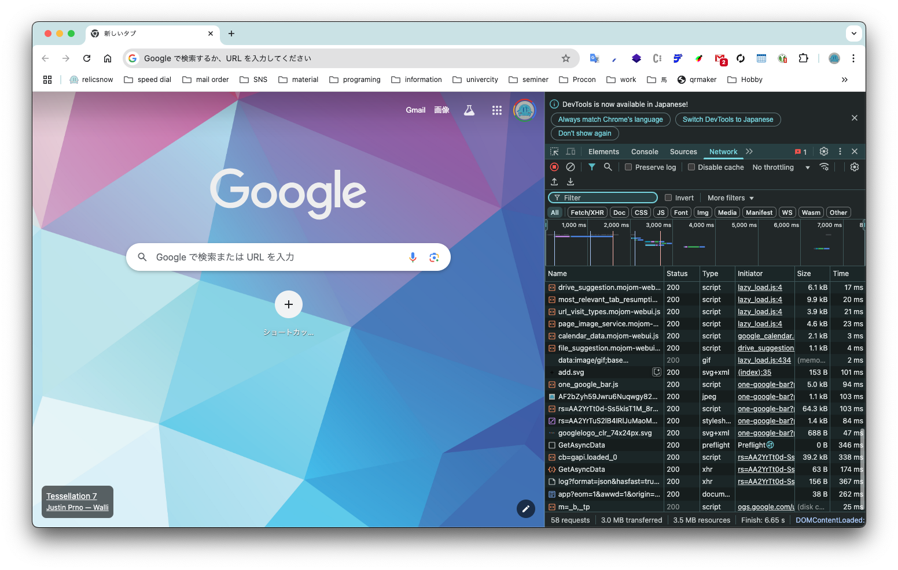

</figure>

**📝課題 3.2.3-1.** ネットワークタブには「スロットリング」という良くない通信状況を再現する開発支援の機能があります。これを「No throttling」としたときと「3G」としたときのそれぞれで福井高専のホームページトップにアクセスし、それぞれでページのレンダリング終了までの時間を確認して表に示しなさい。ただし、キャッシュを利用するとスロットリングが有効でもレンダリング終了までの時間が短くなるので、キャッシュを無効にした状態で確認してください。（1点）

#### 3.2.4. アプリケーションタブ（Applicationタブ）

アプリケーションタブでは、ページ毎のキャッシュやローカルデータの確認ができます。
特に、LocalStorage等のブラウザAPIを利用するような場合に動作テストなどが簡単になり便利です。

<figure class="center">

<figcaption><a id="f324-1">図 3.2.4-1. 開発者ツールのアプリケーションタブ</a></figcaption>


</figure>

## 4. 開発の準備

> 作業ディレクトリの作成

これ以降各種ウェブ技術を学習していきます。  
その前に、今回の実験で利用するディレクトリを準備しておきましょう。

OSに依存せずに説明できるように、今回はコマンドラインからディレクトリを作成します。  
VSCodeのターミナルを開いて、以下[コード 4-1.](#c4-1)に示すコマンドをそれぞれ実行してください。

<figure class="center">

<figcaption><a id="c4-1">コード 4-1. 開発作業を行うディレクトリを作成するシェルコマンド</a></figcaption>

```sh
cd #ホームディレクトリに移動
mkdir dev #ホームディレクトリ直下にdevという名前のディレクトリを作成
cd dev #作成したdevディレクトリに移動
mkdir spa-with-web-component #今回の実験用のディレクトリを作成
```

</figure>

（もし、実験で使うディレクトリをもともと決めていたり、開発用につかうディレクトリを決めていれば、その中に作成してもらって大丈夫です。）

これで、Windowsであれば`C:/Users/<自分のユーザー名>/dev/spa-with-web-component`が、MacやLinuxであれば`/Users/<自分のユーザー名>/dev/spa-with-web-component`が作成されます。
VSCodeを起動し、メニューの「ファイル」から「フォルダーを開く」でこのディレクトリを探して開いてください。

## 5. HTML

HTMLとは「Hypertext Markup Language」の略で、相互に関連付いた文書や情報を表現する「ハイパーテキスト」を作成するためのマークアップ言語です。

### 5.1. 要素とタグ

以下に一般的なHTMLの記述を示します。

<figure>

<figcaption><a id="c51-1">コード 5.1-1. HTMLの例</a></figcaption>

```html
<h1 class="greet">Hello, World !</h1>
```

</figure>

このとき[コード 5.1-1.](#c51-1)の`<h1 ... >`,`</h1>`を **タグ**　*（開始タグ、終了タグ）* といい、タグを含む全体を **要素** といいます。  
また、開始タグ内にある `class="greet"` のような部分を **属性** と言います。
ここで使用している`h1`タグは heading のhをとった見出しを示すタグで、ページで最も重要な見出し要素に使うものです。  
このように、文字列をタグで囲むことをマークアップといい、マークアップすることでブラウザが要素を解釈でき、内容に合わせた表示をとることができます。

では、実際にHTMLファイルを作成して、ブラウザで表示を確認しましょう。  
[4. 開発の準備](#4-開発の準備) で開いたVSCodeのエクスプローラーから、新しいファイルを作成、ファイル名は `index.html` としてください。  

作成したファイルに[コード 5.1-1.](#c51-1)を書き込んで保存してください。  
Live Server拡張機能を使ってこのファイルをブラウザから閲覧します。  
コマンドパレットを開いて「Live Server」と入力すると「Live Server: Open with Live Server」とあるのでこちらを選択して実行してください。
自動で既定のブラウザが起動し、`http://127.0.0.1:5500/index.html`が開かれ、[図 5.1-1.](#f51-1)のように表示されるはずです。

<figure>

<figcaption><a id="f51-1">図5.1-1. コード 5.1-1.のブラウザでの表示</a></figcaption>

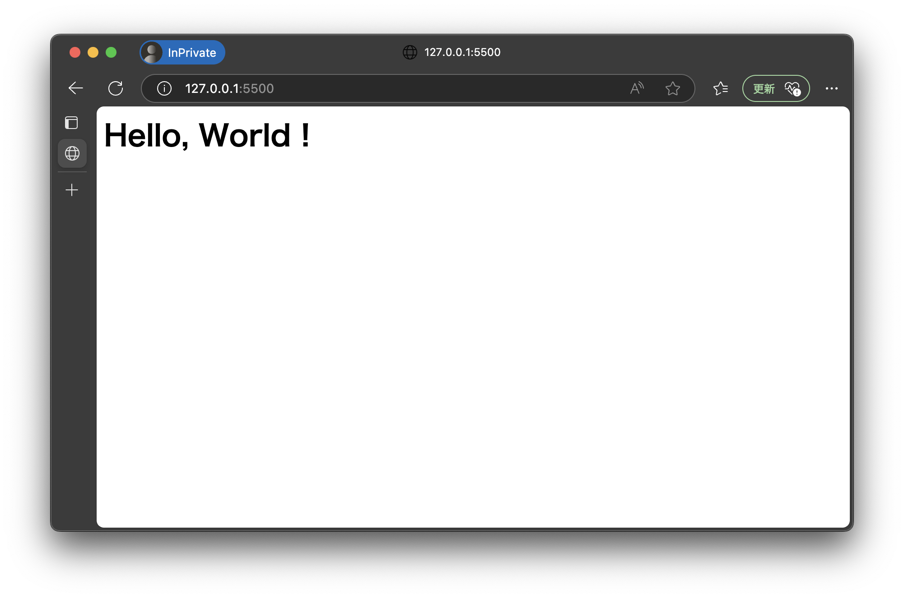

</figure>

### 5.2. DOCTYPE宣言

[コード 5.1-1.](#c51-1)に示したHTMLをブラウザ上で表示することが出来ましたが、これは不十分な記述であり、規定と異なる動作をしています。

1行目に新しく「DOCTYPE宣言」という命令を追加します。これはブラウザに対してファイルを解釈する方法を設定するものです。

<figure>

<figcaption><a id="c52-1">コード 5.2-1.</a></figcaption>

```html
<!DOCTYPE html>
<h1 class="greet">Hello, World !</h1>
```

</figure>

`index.html` の内容を[コード 5.2-1.](#c52-1)に置き換えて保存し、ブラウザをリロードすると先程までと若干余白の大きさが変化しました。

<figure>

<figcaption><a id="t52-1">表 5.2-1. コード 5.1-1.とコード 5.2-1.の表示結果</a></figcaption>

| コード 5.1-1. | コード 5.2-1. |
| :---: | :---: |
|  | 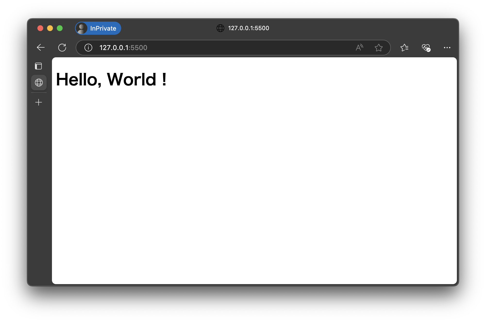 |

</figure>

これは、DOCTYPE宣言を追加したことで、ブラウザが後方互換モードでHTMLを解釈しないように強制したからです。  
古いHTMLとしてHTMLが解釈されると、このように意図した表示と異なる表示がされてしまい、不具合に繋がります。  
HTMLファイルの先頭には必ずDOCTYPE宣言を記述しておきましょう。

**📝課題 5.2-1.** HTMLの標準仕様は、以前はW3Cが策定する「HTML5」とWHATWGが策定する「HTML Living Standard」の2つがありました。現在ではHTML5が廃止されある仕様に統一されました。この現行のHTML標準仕様の名称を答えなさい。（1点）

### 5.3. 基本的なHTML文書の構成

モダンなウェブ開発において最低限記述するべき内容を書いたHTMLを[コード 5.3-1.](#c53-1)に示します。  
このコードで `index.html` の内容を置き換えて保存し、ブラウザをリロードして表示が変化しないことを確認してください。

<figure>

<figcaption><a id="c53-1">コード 5.3-1. 基本的なHTML文書の構成</a></figcaption>

```html
<!DOCTYPE html>
<html lang="ja">
  <head>
    <meta charset="UTF-8" />
    <meta name="viewport" content="width=device-width, initial-scale=1.0" />
    <title>サンプルページ</title>
  </head>
  <body>
    <h1>Hello, World !</h1>
  </body>
</html>
```

</figure>

[コード 5.3-1.](#c53-1)について、各HTML要素を簡単に説明します。

#### 5.3.1. HTMLにおける「子孫」とは

要素の中に入れ子になった要素のことを *子* といい、要素の中の要素からみて自分を含む要素を *親* といいます。  
また、共通の親を持つ要素を *兄弟*、親から見て子要素の子要素の子要素の...と続いていく要素郡を *子孫* と言います。

#### 5.3.2. HTML要素

HTMLの記述は`<html>`\~`</html>`の中に記述します。この要素をHTML要素、またはルート要素と言います。  
HTML要素の子には *一つの`<head>`要素* と *そのあとに続く一つの`<body>`要素* が許可されています。

[コード 5.3-1.](#c53-1)では開始タグに`lang="ja"`というlang属性が書いてあります。これはサイトがja=japanese=日本語で記述されていることを示していて、この記述によってブラウザはページの内容をサイト制作者が意図した言語で解釈することができます。(文字化けが起こらなくなるなど)

#### 5.3.3. head要素

`<head>`要素は、HTMLファイルに記述するもののうち、**閲覧者に見せるコンテンツでない要素** を子孫に記述する要素です。  
このような要素は「メタデータコンテンツ」というコンテンツカテゴリーに分類されます。  
例えば、ページのタイトルや説明文が含まれます。[コード 5.3-1.](#c53-1)から`<head>`要素を切り出すと[コード 5.3.3-1.](#c533-1)のようになります。

<figure>

<figcaption><a id="c533-1">コード 5.3.3-1. コード 5.3-1のhead要素</a></figcaption>

```html
<head>
  <meta charset="UTF-8" />
  <meta name="viewport" content="width=device-width, initial-scale=1.0" />
  <title>Document</title>
</head>
```

</figure>

このうち、`<meta`\~`/>`で囲まれた要素を *メタ要素* と言います。その名の通りメタデータを表現するために利用します。  
属性を`charset="UTF-8"`としたものは「文書の文字セットをUTF-8に設定する」意味を持ちます。  
属性に`name="<指定するメタデータの名前>"`とされているメタ要素はまた別に特定のメタデータを指定することができ、この例では`"viewport"`が指定されています。  
これは表示領域に関する指定で、主にスマートフォンでページを閲覧したときに意図しない幅で表示されないようにしたり、表示が拡大・縮小されたりしないようにできます。

`<title>`~`</title>`で囲まれた`<title>`要素は、ページを開いたときにブラウザのタブに表示されるタイトルを指定します。  
これもページ閲覧者に伝えるよりブラウザに伝えて使ってもらうような値であるため、HTMLメタ関連の要素になります。

これ以外にも、`<head>`要素の中には後述するCSSを記述できる`<style>`要素、現在のファイルと外部リソースの関係を表現できる`<link>`要素等が記述できます。  
JavaScriptを記述したり読み込んだりする`<script>`要素も記述可能です。

#### 5.3.4. body要素

`<body>`要素は、HTMLファイルに記述するもののうち **ページに表示されるすべてのコンテンツ** を子孫に記述する要素です。  
このような要素は「フローコンテンツ」というコンテンツカテゴリーに分類されます。
[コード 5.3-1.](#c53-1)では`<h1>Hello, World !</h1>`のみがページに表示されるコンテンツです。  
例えば、このページにあなたの自己紹介を表示することになったら、その内容はすべて`<body>`要素の中に書かれます。

HTMLには、その表示や処理に一切影響せず、通常ユーザーには表示されない「コメント」という構文があります。  
`<!--`\~`-->` で囲われた中身がコメントとして取り扱われます。

以下の[コード 5.4.3-1.](#c543-1)に示すHTMLを、コメントを置き換えつつ`index.html`に追記してください。

<figure>

<figcaption><a id="c534-1">コード 5.3.4-1. 自己紹介ページのHTMLのテンプレート</a></figcaption>

```html
  <body>
    <h1>Hello, World !</h1>
    <!-- ここから追加の記述 -->
    <h2>自己紹介</h2>
    <ul>
      <li>名前: <strong><!-- あなたの名前 ---></strong></li>
      <li>出身校: <!-- あなたの出身校 ---></li>
      <li>
        好きな食べ物ランキング: 
        <ol>
          <li><!-- 好きなもの1位 ---></li>
          <li><!-- 好きなもの2位 ---></li>
          <li><!-- 好きなもの3位 ---></li>
        </ol>
      </li>
    </ul>
    <!-- ここまで追加の記述 -->
  </body>
```
</figure>

<figure>

<figcaption><a id="f534-1">図 5.3.4-1. 自己紹介ページのサンプル</a></figcaption>

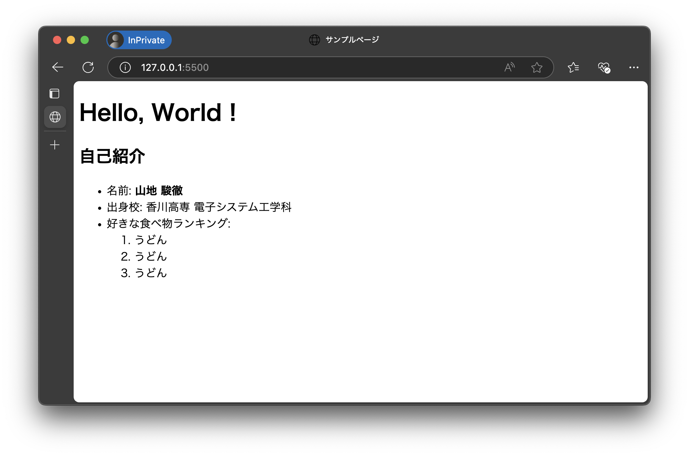

</figure>

**📝課題 5.3.4-1.** [5.3.4. body要素](#534-body要素)で変更した`index.html`をブラウザで表示して、表示結果をスクリーンショットで撮影しレポートに添付しなさい。（1点）

### 5.4. HTML要素

[コード 5.3.4-1.](#c534-1) の内容を参考に、フローコンテンツに分類されるHTML要素のいくつかを説明します。  

HTML要素は資料作成時点で127種あり、これらを最適な用途で組み合わせながらマークアップすることで、ハイパーテキストとして文書を作成する効果を最大化することができます。  
ここで紹介する要素はあくまでも一部でしかないので、他の要素を知りたい方は [HTML 要素リファレンス - HTML : ハイパーテキストマークアップ言語 | MDN](https://developer.mozilla.org/ja/docs/Web/HTML/Reference/Elements) を確認してみてください。


#### 5.4.1. 見出しと段落

文書を表現するとき、見やすく、わかりやすくするためには塊を作って構造化することが重要です。  
物語でも論文でも章立てで (k部-)n章-m節-l項 というようにある程度の塊で分割、構造化されていますね。（もちろんこの資料もです）

このような構造を表現する方法が見出しと段落です。`<h1>`要素も見出しを示す要素のひとつだと[5.1. 要素とタグ](#51-要素とタグ)で説明しました。  
`<h1>`要素以外にも、見出し要素はその章立てにおける大きさを表現できるよう`<h1>`\~`<h6>`まで用意されています。

以下の[コード 5.4.1-1.](#c541-1)に示すHTMLで`index.html`の`<body>`要素の中身を置き換えて保存し、ブラウザでの表示を確認します。。

<figure class="center">

<figcaption><a id="c541-1">コード 5.4.1-1. 見出しの例</a></figcaption>

```html
<h1>Windowsでコンピューターの世界が広がります。1234567890</h1>
<h2>Windowsでコンピューターの世界が広がります。1234567890</h2>
<h3>Windowsでコンピューターの世界が広がります。1234567890</h3>
<h4>Windowsでコンピューターの世界が広がります。1234567890</h4>
<h5>Windowsでコンピューターの世界が広がります。1234567890</h5>
<h6>Windowsでコンピューターの世界が広がります。1234567890</h6>
<span>Windowsでコンピューターの世界が広がります。1234567890</span>
```

</figure>

<figure class="center">

<figcaption><a id="f541-1">図 5.4.1-1. 見出しの表示</a></figcaption>

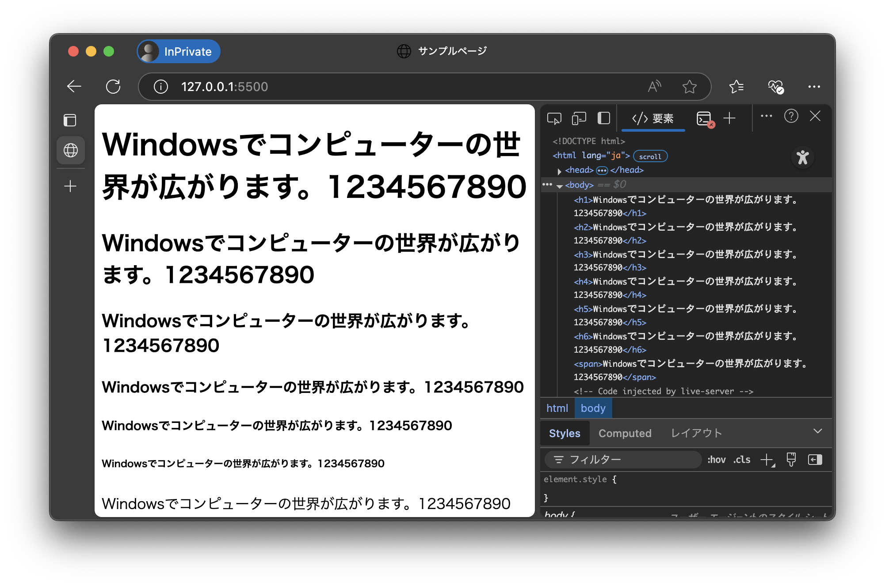

</figure>

ここで比較対象として`<span>`要素を用意しました。この要素はコンテンツを囲む以外に意味を持たない、コンテンツをただ表示するだけの要素です。  
最も一般的なテキストの表示が`<span>`要素での表示になるので、これと比較することで見出し要素の表示の差を比較しやすいです。

見出し要素の使用にはいくつかのポイントがあります。

- `<h1>`要素はページに一つだけあるのが好ましいとされています。`<h1>`要素は最も大きな見出し、いうなれば物語や記事の題を表すための要素のようなもので、これが複数あることはありえないからです。  
- 見出し要素の大きさを入れ替えて使用するべきではありません。節の中に章があるのはおかしいように、`<h3>`要素の下に`<h2>`要素があるのは望ましくありません。  
- 見出し要素は本文中で多用されるものは3段階にとどめた方がよいです。一般に章-節-項が使われて、巨大な文書を分けるために部が使われることからもそのほうが適しているでしょう。部まで必要になるような場合にはページそのものを分割することを考えるべきです。

また、段落を表す`<p>`要素も合わせて使用しましょう。  
一般に日本語では行頭を一字下げることで表現されますが、HTMLでは`<p>`\~`</p>`で囲むことで段落を表現できます。

#### 5.4.2. 箇条書き(リスト)

説明文などを書いていると特に、箇条書きで事柄を列挙したいことがあります。  
これは`<ul>`要素とその子要素の`<li>`要素で表現できます。[コード 5.3.4-1.](#c5341)のサンプルの自己紹介でも登場しています。

<figure class="center">

<figcaption><a id="c542-1">コード 5.4.2-1. 順序なし箇条書きを表すHTML</a></figcaption>


```html
<ul>
  <li>かけうどん</li>
  <li>しょうゆうどん</li>
  <li>ぶっかけうどん</li>
</ul>
```

</figure>

<figure class="center">

<figcaption><a id="f542-1">図 5.4.2-1. 順序なし箇条書きのブラウザでの表示</a></figcaption>

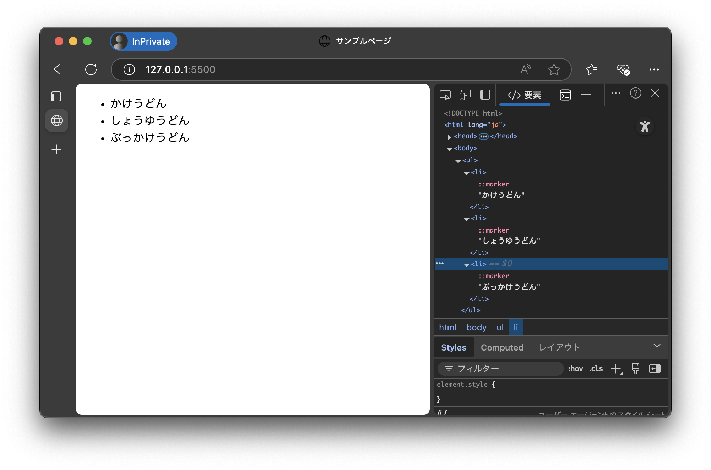

</figure>

例えばうどん屋のメニューの列挙のような、項目の並びが重要でないものには順序のない箇条書きで表現するのが良いです。  
それに対して、私の好きな順に並んだうどんのリストを表現したいときのように、順序が重要なものには`<ol>`要素とその子要素の`<li>`要素で記述できます。

<figure class="center">

<figcaption><a id="c542-2">コード 5.4.2-2. 順序有り箇条書きをあらわすHTML</a></figcaption>

```html
<strong>私の好きなうどんメニュー</strong>
<ol>
  <li>かけうどん</li>
  <li>ぶっかけうどん</li>
  <li>しょうゆうどん</li>
</ol>
```

</figure>

<figure class="center">

<figcaption><a id="f542-2">図 5.4.2-2. 順序有り箇条書きのブラウザでの表示</a></figcaption>

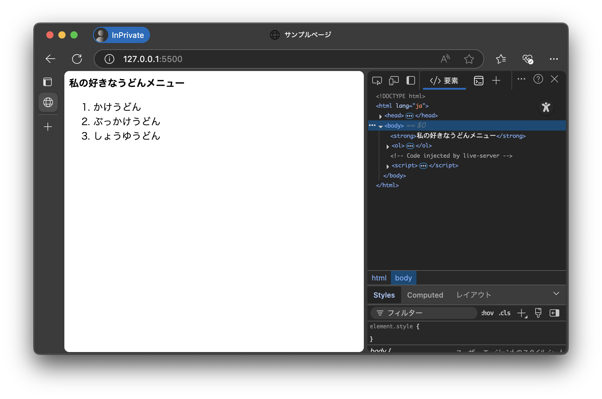

</figure>

また、箇条書きの中に箇条書きを書く(入れ子にする)ことで箇条書きでも階層を表現できます。

<figure class="center">

<figcaption><a id="c542-3">コード 5.4.2-3. 階層がある箇条書きのHTML</a></figcaption>

```html
<ul>
  <li>
    材料(3~4人前): 
    <ul>
      <li>小麦粉: 400 g</li>
      <li>塩: 20 g</li>
      <li>水: 200 ml</li>
    </ul>
  </li>
  <li>
    作り方
    <ol>
      <li>分量通りの塩と水を混ぜて塩水をつくります。</li>
      <li>大きめのボウルにあけた小麦粉に塩水を加え、そぼろ状になるように熊手様にした手で素早く混ぜます。</li>
      <li>パラパラとした粒がおおよそひとかたまりになるようにこねます。</li>
      <li>ひとかたまりになったら生地の端から中心に向けて生地を折りたたむようにして更にこねます。（20回程度）</li>
      <li>10~20分寝かせます。</li>
      <li>4.の手順を再度行います。(30回程度)</li>
      <li>10~20分寝かせます。</li>
      <li>伸ばして切ります。このとき四角形に近い形に伸ばせるときれいな麺になる部分が増えます。</li>
      <li>沸騰したたっぷりのお湯で10~12分茹でます。時々麺をつまんで茹で具合を確認してください。</li>
      <li>氷水に取り、やさしくこすり合わせるようにしてぬめりを落とします。</li>
      <li>一人前200g程度に玉を取ってうどんの完成です。</li>
    </ol>
  </li>
</ul>
```

</figure>

<figure class="center">

<figcaption><a id="f542-3">図 5.4.2-3. 階層がある箇条書きのブラウザでの表示</a></figcaption>

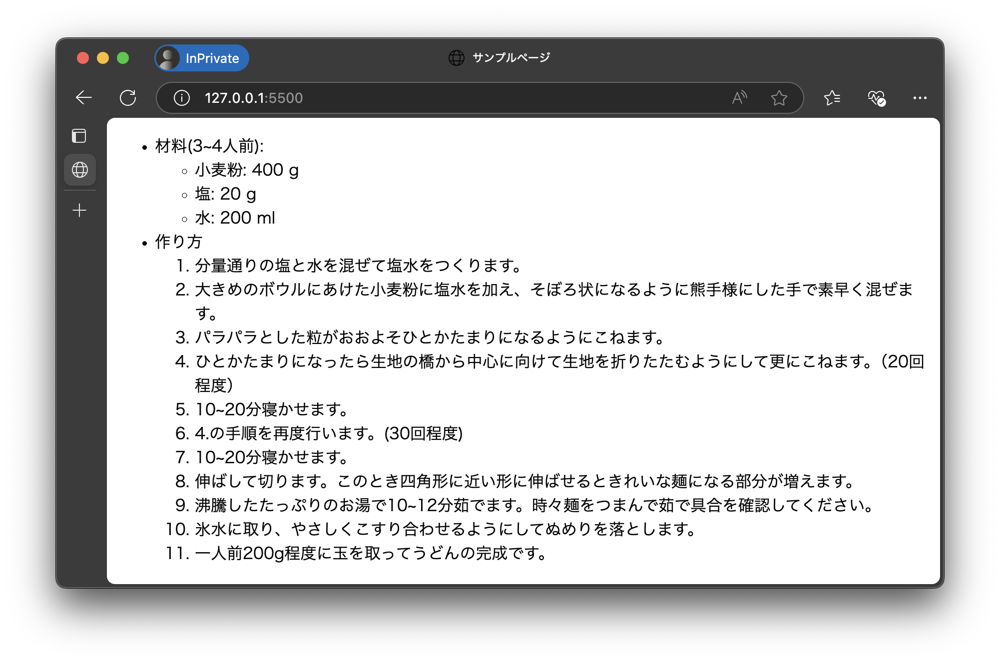

</figure>

#### 5.4.3. 強調と重要の表現とその違い

私達は普段抑揚をつけて話したり、書体の変化をつけて文章を書くことで、表現や意味を強調したり、その情報が重要であることを表現しています。  
HTMLにもこのような強調や重要を示す要素があります。

`<em>`要素は強調を示す要素です。コンテンツはイタリック(斜体)で表示されます。  
ただし、イタリックでの表示のみが目的ならば`<span>`要素とCSSでの表現を使用するべきです。

例えば、以下のような例で重宝するでしょう。

<figure>

<figcaption><a id="c543-1">コード 5.4.3-1. 強調要素を利用する例</a></figcaption>

```html
<p>
  クイズの問読みにおいて、パラレルと呼ばれる「ですが問題」では強調される部分の違いで、その後の問題文でどこが変化するのかがわかります。
  <ul>
    <li>「日本で <em>一番</em> 高い山は富士山ですが、」となった場合、「一番」が変化する→「二番目に」なら北岳</li>
    <li>「 <em>日本で</em> 一番高い山は富士山ですが、」となった場合、「日本で」が変化する→「世界で」ならエベレスト</li>
    <li>「日本で一番 <em>高い</em> 山は富士山ですが、」となった場合、「高い」が変化する→「低い」なら日和山（国土地理院の地形図に山として掲載されているものの中で）</li>
  </ul>
</p>
```

</figure>

<figure>

<figcaption><a id="f543-1">図 5.4.3-1. 強調要素のブラウザでの表示</a></figcaption>

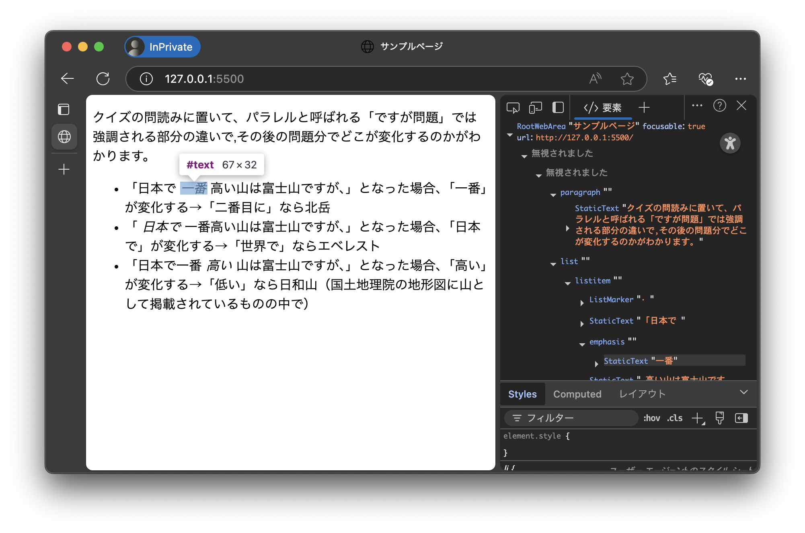

</figure>

[図 5.4.3-1.](#f543-1)に示したスクリーンショットでは、ブラウザの要素タブの表示を「アクセシビリティツリービュー」というものに切り替えています。  
この表示では文書をブラウザが機械的にどう解釈しているかを確認することができ、[コード 5.4.3-1.](#c543-1)の例では`<em>`要素のコンテンツが強調箇所として解釈されていることが確認できます。

これに対して`<strong>`要素は重要性の高い言葉の表現にもちいます。  
コンテンツは太字で表示されますが、太字での表示のみが目的ならば`<span>`要素とCSSで表現するべきです。

<figure>

<figcaption><a id="c543-2">コード 5.4.3-2. 重要要素を利用する例</a></figcaption>

```html
<p>
  <strong>静的型付け</strong>、私の好きな言葉です。
</p>
```

</figure>

<figure>

<figcaption><a id="f543-2">図 5.4.3-2. 重要要素のブラウザでの表示</a></figcaption>

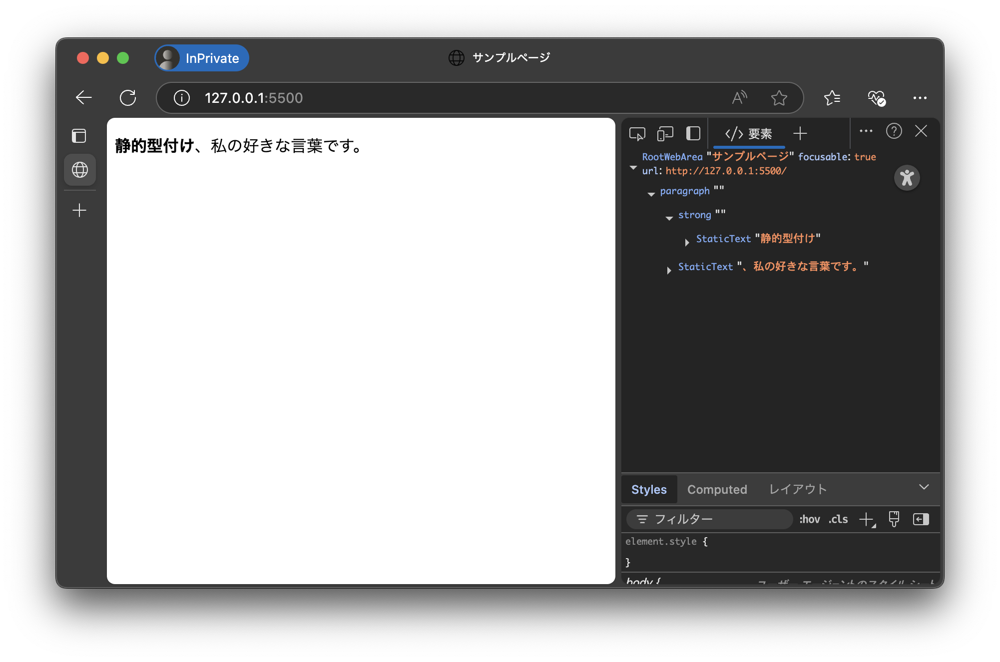

</figure>

**📝課題 5.4.3-1.** [5.4.3. 強調と重要の表現とその違い](#543-強調と重要の表現とその違い)では、特殊な書体での表示のみを目的として`<em>`要素や`<strong>`要素を使用しないよう注意書きがあります。この理由をアクセシビリティツールへの悪影響の観点から考えて書きなさい。（2点）

#### 5.4.4. 画像を表示する

普段私達が目にするwebサイトは画像を利用しているところがほとんどでしょう。HTMLでは``要素を使用して画像をページに表示できます。

<figure>

<figcaption><a id="c544-1">コード 5.4.4-1. 画像を表示するHTML</a></figcaption>

```html
" alt="<画像の内容を表現したメッセージ>"/>
```

</figure>

<figure>

<figcaption><a id="f544-1">図 5.4.4-1. 画像表示のブラウザ上での表示</a></figcaption>

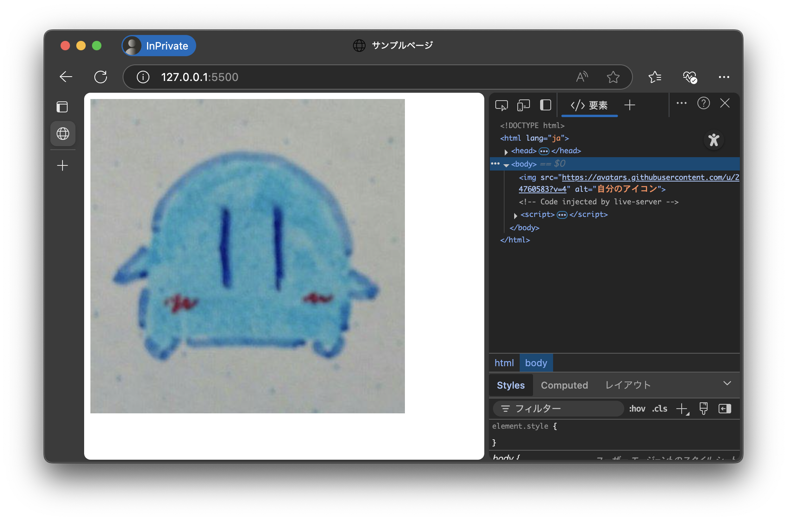

</figure>

このように``タグの`src`属性に表示させたい画像までのパスを指定することで、画像を取得してページに埋め込んで表示してくれます。  
このとき`src`に指定されているURLをすべて書くパスを *絶対パス* 、それに対してHTMLファイルから見たファイルの位置を *相対パス* と言います。  
外部にあるファイルへのアクセスでは絶対パスを使い、内部にあるファイルへのアクセスでは相対パスを使います。

また、``要素に必要な属性に`alt`属性があります。  
これは画像が取得できなかったときなどに表示される*代替テキスト*です。

HTML要素には``要素と同じ用に、`<`~`/>`で囲まれた一つのタグだけで記述できる要素があります。  
このような要素を空要素と言います。

#### 5.4.5. リンク

ウェブにおけるリンクと呼ばれるものは、正式にはハイパーリンクと言います。  
このハイパーリンクによって様々な文書が相互にリンクされる要素をクモの巣になぞらえてウェブと呼ばれるようになったほど、ウェブにおいて欠かせないものです。

ハイパーリンクは、以下に示す[コード 5.4.5-1.](c545-1)のようにして記述できます。

<figure>

<figcaption><a id="c545-1">コード 5.4.5-1. ハイパーリンクを表すHTML</a></figcaption>

```html
<a href="https://www.jig.jp">株式会社 jig.jp ホームページ</a>
```

</figure>

`<a>`と`</a>`で囲まれた間の文字がリンクテキストとして表示され、`href`属性でリンク先アドレスを指定します。  
この他に`target`属性を指定することがあり、`target="_blank"`とすることで新しいタブでページを開くことができます。

<figure>

<figcaption><a id="f545-1">図 5.4.5-1. ハイパーリンクのブラウザでの表示</a></figcaption>


</figure>

#### 5.4.6. 汎用コンテナー

最後に `<div>` 要素を説明します。  
この要素は本質的に何も表しません(ブラウザが解釈する際に、ただの囲い以上の意味を持ちません)。  
文字列を囲んでCSSで装飾できる要素が`<span>`だとすれば、要素を囲んでCSSで装飾できる要素が`<div>`で、基本そのように利用されます。

<figure>

<figcaption><a id="t546-1">表 5.4.6-1. div要素の有無で表示に変化がないことの比較</a></figcaption>

|  div無し  |  divあり  |
| :---: | :---: |
| 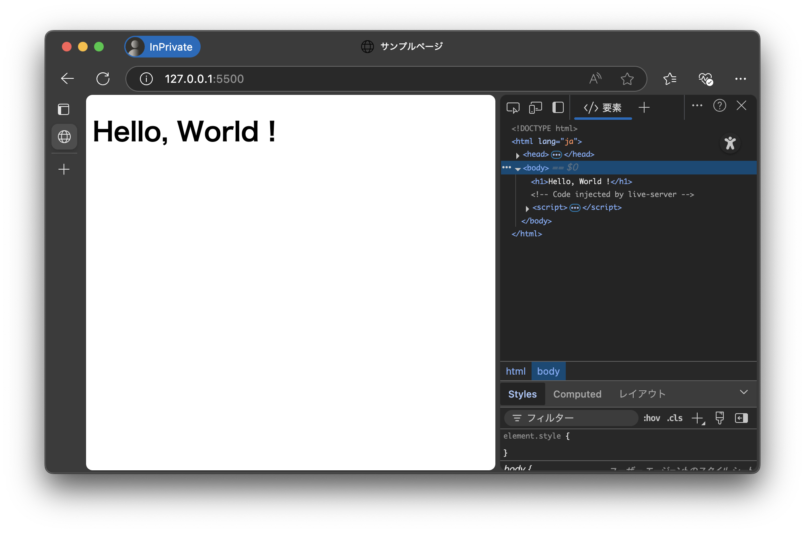 | 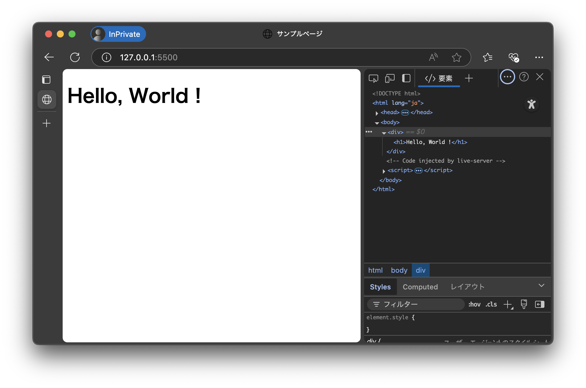 |

</figure>

## 6. CSS

CSSは「Cascading Style Sheet」の略で、HTMLで記述された文書の文字の大きさや色、背景や配置など、その見た目を設定する言語です。

### 6.1. ボックスモデル

CSSでHTMLを装飾してページの見た目を変更していく上で、必ず知っておく必要があるものの一つがボックスモデルです。  
CSSで表現できるものはすべてボックス、四角形の領域を持ちます。(たとえ見かけ上円形に見えてもです)

<figure>

<figcaption><a id="f61-1">図 6.1-1. ボックスモデルのイメージ図</a></figcaption>


</figure>

[3.2.1. 要素タブ（Elementsタブ）](#321-要素タブelementsタブ)で紹介した、開発者ツールのComputedタブでの要素の大きさの表示に似ています。  
また、開発者ツールでの要素選択中にマウスホバーした要素にも↑のような表示が見えることがあります。  
ページの要素はすべて四角形の領域を持つため、ボックスモデルをベースに大きさや領域を捉えることが有効であり、このような表現を取っていると考えられます。

それぞれ`margin`プロパティで設定する要素間の余白部分が「Margin Box」、`border`プロパティで設定する境界線部分が「Border Box」、`padding`プロパティで設定する要素内の余白部分が「Padding Box」、そしてコンテンツの領域が「Content Box」です。  
以下の[図 6.1-2.](#f61-2)のように額に入った絵画を思い浮かべると捉えやすいです。

<figure>

<figcaption><a id="f61-2">図 6.1-2. 額縁と絵で考えるボックスモデル</a></figcaption>


</figure>

ところで、CSSでは`width`プロパティ、`height`プロパティでコンテンツの大きさを指定できます。  
しかし、デフォルトでは↑のContent Boxの大きさとして指定されてしまい、人間が扱うには直感的でないです。  

これを解決するCSSプロパティが`box-sizing`です。  
`box-sizing`プロパティには`content-box`と`border-box`が指定できますが、これは`width`と`height`がContent Boxの大きさとして指定されるか、Border Boxの大きさとして指定されるかが変わります。
<figure>

<figcaption><a id="f61-3">図 6.1-3. box-sizingプロパティを変更したときにwidth,heightプロパティが指定する大きさがどこに適用されるか</a></figcaption>


</figure>

例えば、↑の図のように額に入った絵を飾る場合、絵そのものの大きさ（`content-box`）ではなく、額を含めた大きさ（`border-box`）を指定できる方が配置しやすいと考えられます。  
しかし、デフォルトでは`content-box`を指定する設定になっています。  
そのため、現在web開発では *全称セレクタ*`*` を用いて以下のように設定するのが一般的です。

```css
* {
  box-sizing: border-box;
}
```

#### 6.1.1. margin

Margin Box の大きさはいわば額と額の間の距離です。HTML的には要素間の間隔・距離になります。  
つまり2つの要素から別々に指定したりもできてしまいます。  
これだと要素間の間隔に計算が必要なので、レイアウトによりますが、上下左右ではなく上と左のみ、下と右のみなど指定を工夫することでわかりやすくなると思います。

また、marginはコンテンツの大きさに影響を与えないため、box-sizingには margin-box が存在しません。

> ちなみに、Aに16pxのmargin、Bに32pxのmarginを指定するとA-B間の間隔は値の相殺が行われて32pxとなります。  
> この相殺は要素と要素が兄弟として扱える場合や要素の一番目の子要素のmargin-top、要素の最後の子要素のmargin-bottomなどに適用されます。  
> このような複雑な条件のもと要素間の間隔を計算しなければならないため、指定の工夫が有効なのです。  
> より詳細には [マージンの相殺の習得 - CSS: カスケーディングスタイルシート | MDN](https://developer.mozilla.org/ja/docs/Web/CSS/CSS_box_model/Mastering_margin_collapsing) などを参照してください。

### 6.2. セレクタ

CSSはセレクタを指定することでそのセレクタ以下に見た目を設定します。  
ここではセレクタについて詳しく説明します。

#### 6.2.1. セレクタと結合子

セレクタには以下のものがあります。

- 全称セレクタ
  - 全ての要素を選択するセレクタ
  - `*`と表します。
- 要素型セレクタ
  - あるHTML要素を選択するセレクタ
  - `<h1>`要素なら`h1`と表します。
- クラスセレクタ
  - `class="<クラス名>"`とclass属性が指定された要素を選択するセレクタ
  - クラス名が`class-name`なら`.class-name`と表します。
- IDセレクタ
  - `id="<id名>"`とid属性が指定された要素を選択するセレクタ
  - id名が`id-name`なら`#id-name`と表します。
  - id名は重複してはいけません
- 属性セレクタ
  - HTML要素に付与された任意の属性`attr`が付与されたすべての要素を選択するセレクタ
  - `attr`属性が付与された要素なら`[attr]`と表します。
  - `attr`に特定の値`value`が指定されている場合、`[attr=value]`として`attr`に`value`が指定された要素を選択できます。
- グループ化セレクタ
  - `,`でこれまでのセレクタをつなげる、例えば`header, footer`とすることで、`<header>`要素と`<footer>`要素の両方を選択します

これらのセレクタと以下の結合子を用いることで要素をより限定できます。

- 子孫結合子
  - `⎵`(スペース)
  - `p span`として指定すると、`<p>`要素の *子孫にある* 全ての`<span>`要素を選択します
- 子結合子
  - `>`
  - `p>span`として指定すると、`<p>`要素の *子にある* 全ての`<span>`要素を選択します。

結合子はこれ以外にもありますが、使用機会が少ないため省きます。  
興味があれば[CSS セレクター - CSS: カスケーディングスタイルシート | MDN](https://developer.mozilla.org/ja/docs/Web/CSS/CSS_selectors#%E7%B5%90%E5%90%88%E5%AD%90)などを見てみてください。

#### 6.2.2. 疑似表記

ここまでのセレクタはHTMLファイルに記述されている情報のみをもって要素を選択するものでした。  
ここで説明する疑似表記は、HTMLファイルにかかれていない情報も使って要素を選択できるものです。

- 擬似クラス
  - `:<擬似クラス名>`で表します。
  - `.reaction:hover`とすると、マウスホバー中の`class="reaction"`が指定された要素を選択します。
- 疑似要素
  - `::<疑似要素名>`で表します。
  - `p::first-letter`とすると、`<p>`要素の最初の文字のみを選択します。

<figure>

<figcaption><a id="f622-1">図 6.2.2-1. 擬似クラスを利用したスタイリング</a></figcaption>

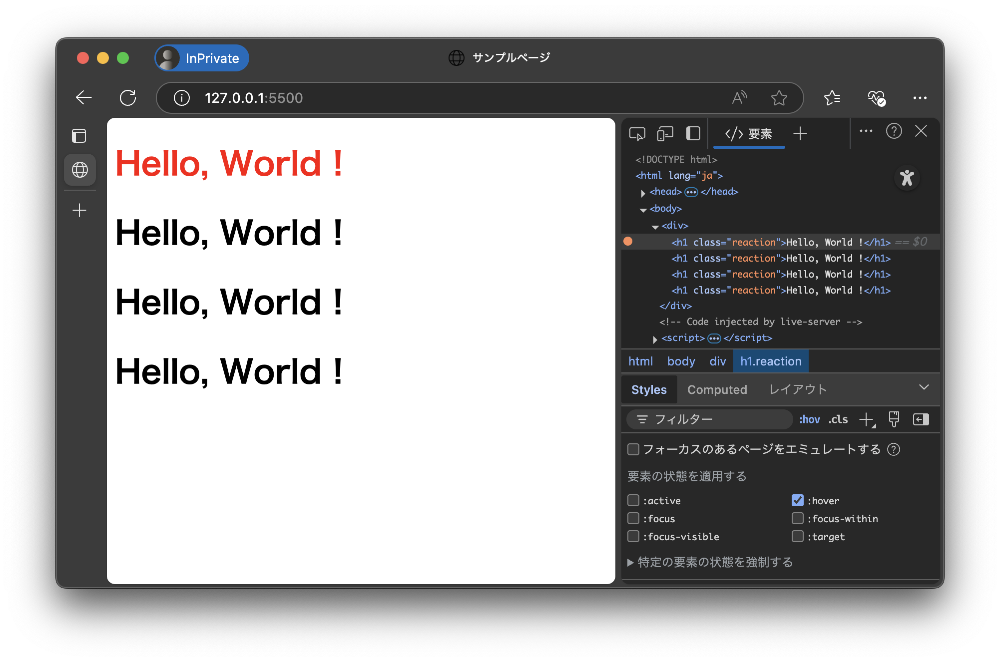

</figure>

<figure>

<figcaption><a id="f622-2">図 6.2.2-2. 擬似要素を利用したスタイリング</a></figcaption>

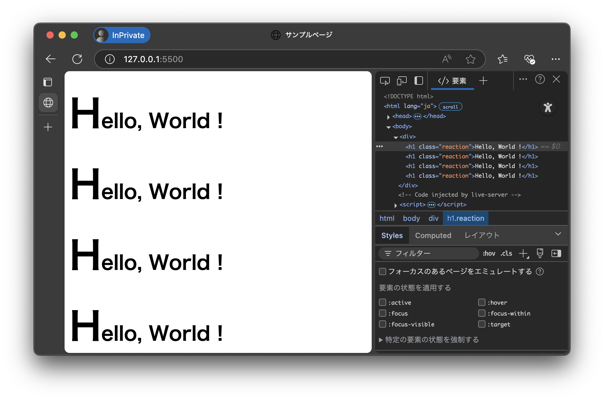

</figure>

**📝課題 6.3.2-1.** `::marker`という疑似要素があります。何を選択するための疑似要素なのか、調べて書きなさい。（1点）

**📝課題 6.3.2-2.** `::marker`を利用して表示を変更したページを作成し、ブラウザでの表示をスクリーンショットで撮影してレポートに添付しなさい。（1点）

### 6.3. CSSを利用したスタイリング

#### 6.3.1. CSSを適用する

[コード 5.3-1.](#c53-1)のh1タグの文字色を変更してみます。  
VSCodeのエクスプローラーから、`style.css`という名前で新しいファイルを作成してください。  
このCSSファイルを`index.html`から読み込んで使います。  
以下の[コード 6.3.1-1.](#c631-1)を`index.html`の`<head>`要素に追記してください。

<figure>

<figcaption><a id="c631-1">コード 6.3.1-1. HTMLファイルからCSSファイルを読み込むコード</a></figcaption>

```html
<link rel="stylesheet" href="style.css" />
```

</figure>

これでHTMLからCSSを読み込めるようになったので、`style.css`を編集して見た目を変更していきます。  
以下の[コード 6.3.1-2.](#c631-2)の内容を`style.css`に貼り付けて保存してください。

<figure>

<figcaption><a id="c631-2">コード 6.3.1-2. h1要素の文字色を赤にするCSS</a></figcaption>

```css
h1 {
  color: red;
}
```

</figure>

以下の[図 6.3.1-1](#f631-1)のように「Hello, World !」が赤字で表示されれば成功です。

<figure>

<figcaption><a id="f631-1">図 6.3.1-1. CSSが適用され文字色が赤になったh1要素</a></figcaption>

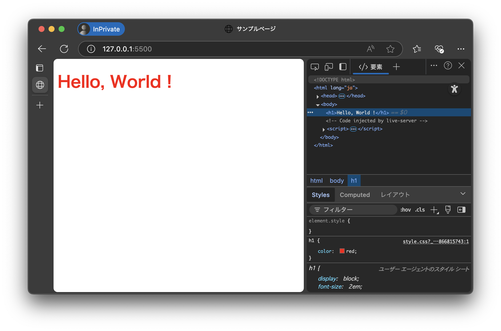

</figure>

このとき、`h1`のように表示を設定する要素を識別するものを**セレクタ**、`color`のように値が設定されるものを**プロパティ**、`red`のようにプロパティに設定するものを**値**といいます。

#### 6.3.2. カスタムプロパティ

CSSには、名前に値を設定して、その名前を特定の値の代わりとして利用できる*カスタムプロパティ*という仕組みがあります。  
カスタムプロパティは[コード 6.3.2-1.](#c632-1)のようにして宣言できます。

<figure>

<figcaption><a id="c632-1">コード 6.3.2-1. カスタムプロパティの宣言</a></figcaption>

```css
:root {
  <カスタムプロパティ名>: <値>
}
```

</figure>

カスタムプロパティ名は`--`から始まる必要があることに注意してください。

ここでセレクタとして`:root`疑似要素を使用しています。これはルート要素セレクタと同等の働きをします。  
このように宣言することで文書中の適当な場所からもカスタムプロパティを利用できるようになります。

また、カラーコードやキーワードでの指定に比べて、色の持つ意味等もカスタムプロパティ名で伝えられるので、可読性に良い影響を与えるでしょう。

以下の[コード 6.3.2-2.](#c631-2)のように、設定したカスタムプロパティに`var(<カスタムプロパティ名>);`とすることで値にアクセスできます。  
[コード 6.3.2-2.](#c632-2)を`style.css`に貼り付けて、`--color-greeting`の値を自分の好きな色に変更して保存してください。  
ブラウザで文字色が変更できたことを確認しましょう。

<figure>

<figcaption><a id="c632-2">コード 6.3.2-2. カスタムプロパティの使用</a></figcaption>

```css
:root {
  --color-greeting: #668844;
}

h1 {
  color: var(--color-greeting);
}
```

</figure>

<figure>

<figcaption><a id="f632-1">図 6.3.2-1. カスタムプロパティを使用したスタイルの適用結果</a></figcaption>

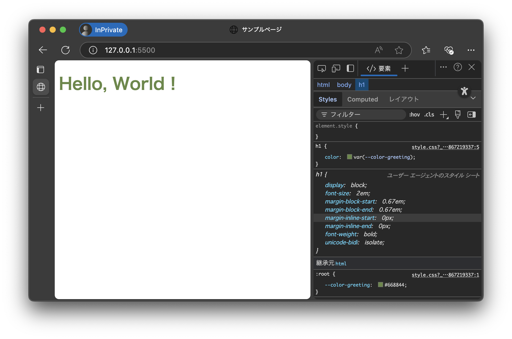

</figure>

**📝課題 6.3.2-1.** 自分の好きな色を文字色に適用して、ブラウザでの表示をスクリーンショットで撮影し、それをレポートに添付しなさい。（1点）

#### 6.3.3. 文字の見た目を変更しよう

文字の見た目を変更するプロパティを紹介します。

<figure>

<figcaption><a id="t633-1">表 6.3.3-1. 文字の見た目に影響するCSSプロパティ</a></figcaption>

| プロパティ | 影響箇所 | 実行結果 |
| ---- | ---- | ---- |
| `color` | 色 | 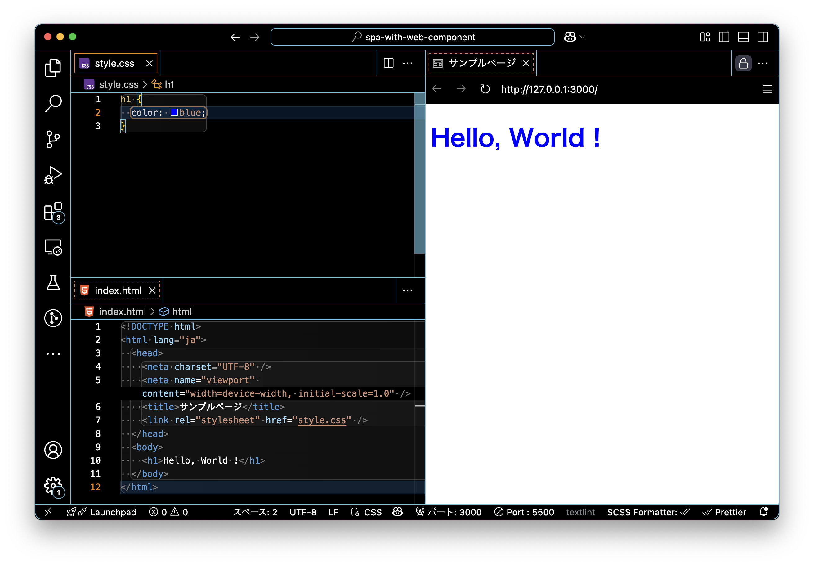 |
| `font-size` | 文字の大きさ | 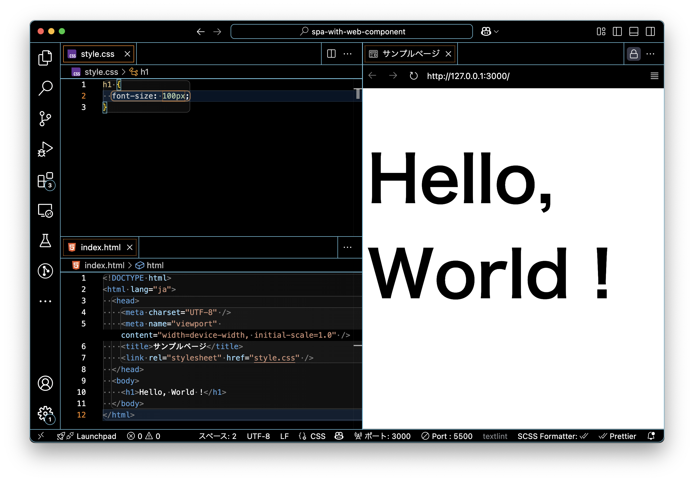 |
| `font-weight` | 文字の太さ | 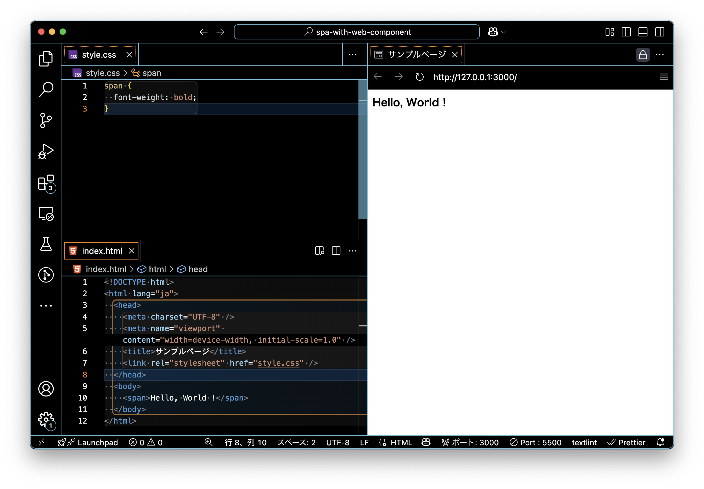 |
| `font-style` | 書体 |  |
| `text-decoration` | 線 |  |
| `font-family` | フォント |  |

</figure>

↑の例以外のプロパティや値もたくさんあるので、ウェブ検索などを活用して調べて使ってみてください。

#### 6.3.4. 要素の見た目を変更しよう

ここでいう要素の見た目は例えば境界線や要素の背景などです。

要素の背景や境界線に関するプロパティと実行結果を表に示します。

<figure>

<figcaption><a id="t634-1">表 6.3.4-1. 要素の見た目に影響するCSSプロパティ</a></figcaption>

| プロパティ | 影響箇所 | 実行結果 |
| ---- | ---- | ---- |
| `background-color` | 背景色 | 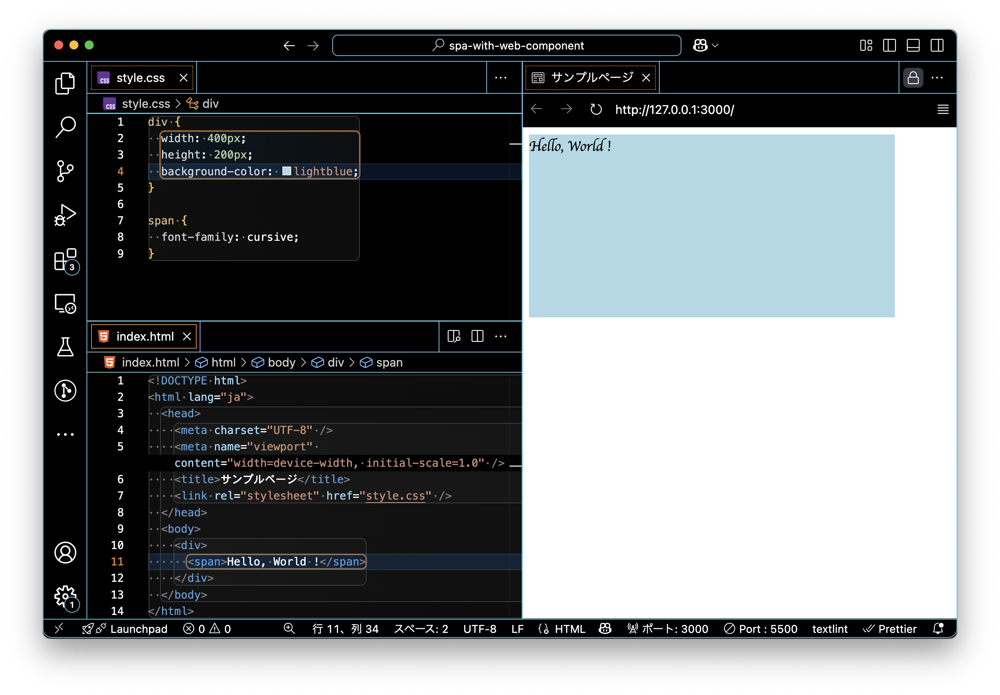 |
| `background-image` | 背景画像 | 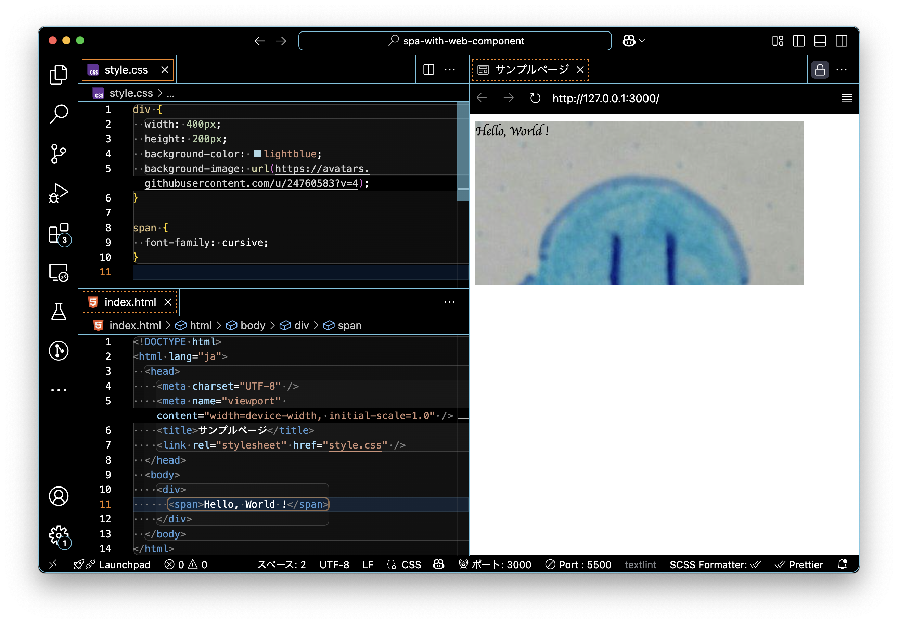 |
| `background-size` | 背景画像の大きさ | 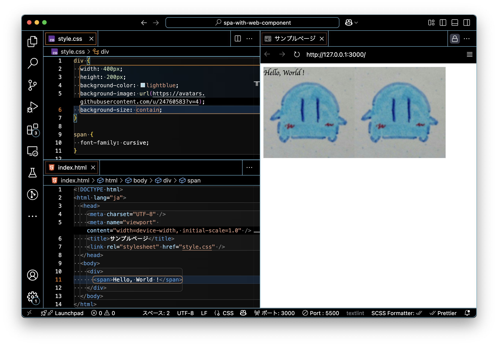 |
| `background-repeat` | 背景画像の繰り返し | 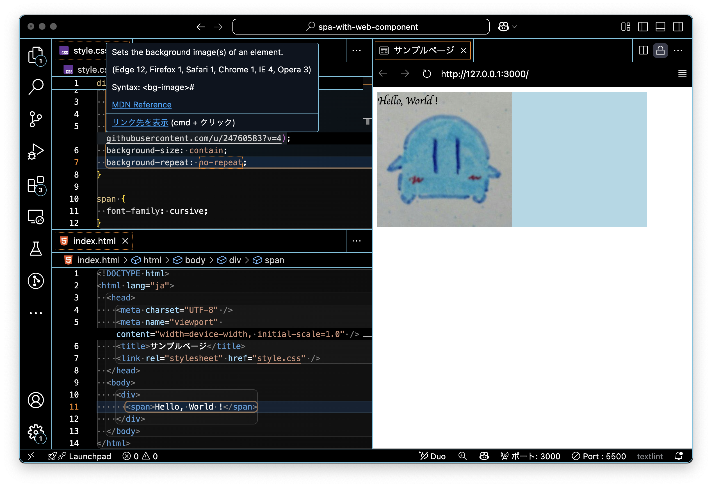 |
| `background-position` | 背景画像の位置 | 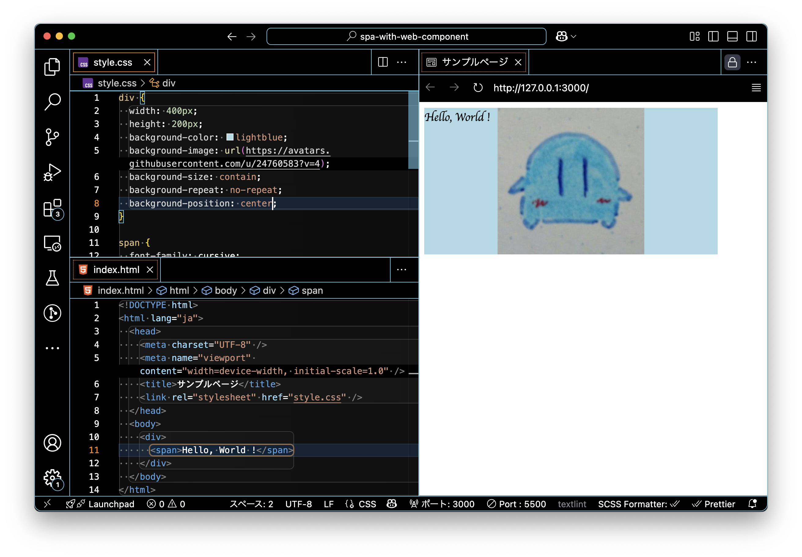 |
| `background-blend-mode` | 背景色と背景画像の混色 | 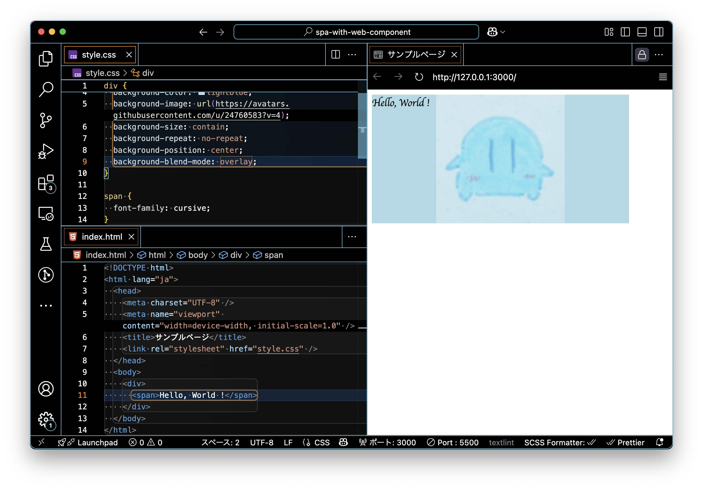 |
| `border` | 境界線 |  |
| `border-radius` | 境界線の角の丸め | 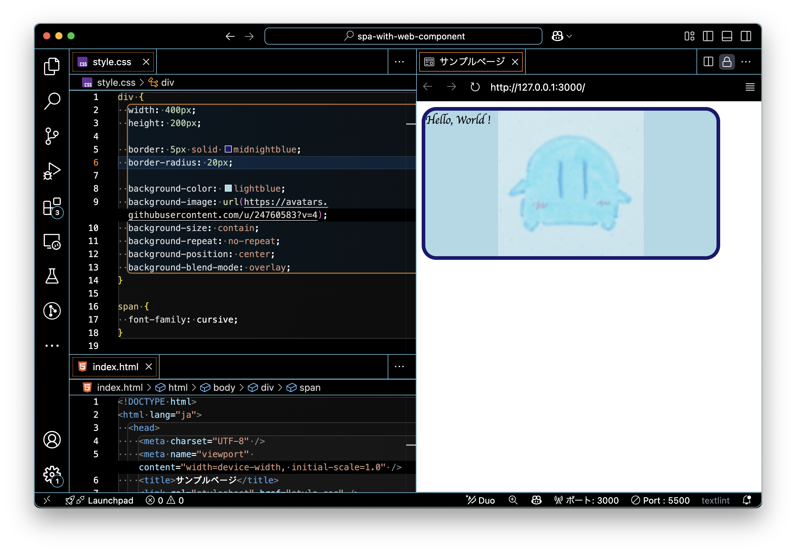 |

</figure>

文字の見た目と同様に、背景や境界線に関するプロパティや値ももっとたくさんあります。  
[表 6.3.4-1.](#t634-1)に示したのは一例なので、実際に使うときに調べながら開発してください。

### 6.4. フレックスボックスとグリッドレイアウト

#### 6.4.1. 聖杯レイアウト

実際にwebページの構造を考えてみましょう。  
図のような構成のウェブページを見たことがあると思います。

<figure>

<figcaption><a id="f641-1">図 6.4.1-1. 一般的なウェブページの例</a></figcaption>


</figure>

このレイアウトは、大きく分けるとヘッダー、右カラム、メインコンテンツ、左カラム、フッターで構成されています。  
このようなレイアウトを聖杯レイアウトと言います。

<figure>

<figcaption><a id="f641-2">図 6.4.1-2. 聖杯レイアウトの部分の名称</a></figcaption>


</figure>

この節では、いかに示す[コード 6.4.1-1.](#c641-1)のHTMLを改変しながらCSSを用いて装飾し、聖杯レイアウトを実装することを考えます。  
VSCodeのエクスプローラーから`holy-grail.html`と`holy-grail.css`の2つのファイルを作成し、`holy-grail.html`には[コード 6.4.1-1.](#c641-1)の内容を貼り付けてください。

<figure>

<figcaption><a id="c641-1">コード 6.4.1-1. 聖杯レイアウトの元になるHTML</a></figcaption>

```html
<!DOCTYPE html>
<html lang="ja">
  <head>
    <meta charset="UTF-8" />
    <meta name="viewport" content="width=device-width, initial-scale=1.0" />
    <title>サンプルページ</title>
    <link rel="stylesheet" href="holy-grail.css"/>
  </head>
  <body>
    <header>
      <p>ヘッダー</p>
    </header>
    <div class="mid">
      <aside id="left">
        <p>左カラム</p>
      </aside>
      <main>
        <p>メインコンテンツ</p>
      </main>
      <aside id="right">
        <p>右カラム</p>
      </aside>
    </div>
    <footer>
      <p>フッター</p>
    </footer>
  </body>
</html>
```

</figure>

#### 6.4.2. フレックスボックス

フレックスボックスは`display`プロパティに`flex`を指定することで利用できるレイアウトです。

フレックスボックスは要素を行または列のどちらかに一次元に配置するレイアウトです。  
この性質から、聖杯レイアウトのような縦のレイアウトの中に横のレイアウトがあるものは、階層構造を取って表現する必要があります。

[コード 6.4.1-1.](#c641-1)のHTMLに、以下に示すCSSを適用することで、聖杯レイアウトを実現できます。  
`holy-grail.css`に[コード 6.4.2-1.](#c642-1)の内容を貼り付けてください。

<figure>

<figcaption><a id="c642-1">コード 6.4.2-1. フレックスボックスを利用して聖杯レイアウトを実現するCSS</a></figcaption>

```css
* {
  box-sizing: border-box;
  margin: 0;
}

body {
  display: flex;
  flex-direction: column;
}

header {
  height: 40px;
  background-color: lightblue;
}
.mid {
  display: flex;
}
aside#left {
  width: 200px;
  background-color: lightsalmon;
}
main {
  height: calc(100vh - 80px);
  width: 100%;
  background-color: lightgreen;
}
aside#right {
  width: 200px;
  background-color: lightsalmon;
}
footer {
  height: 40px;
  background-color: lightblue;
}
```

</figure>

<figure>

<figcaption><a id="f642-1">図 6.4.2-1. フレックスボックスを利用した聖杯レイアウトの表示</a></figcaption>

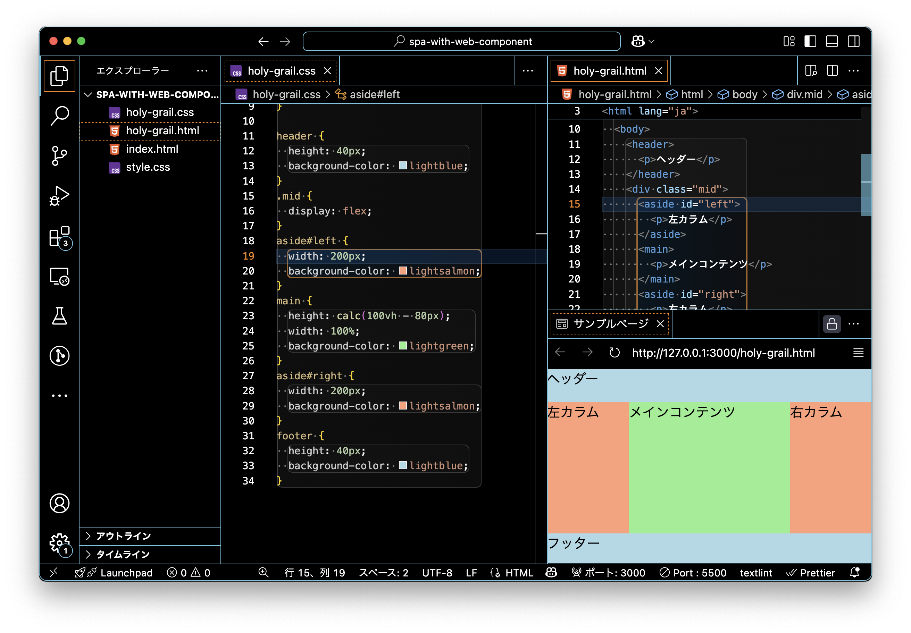

</figure>

フレックスボックスを使ったレイアウトの面倒なところは、先述の通り、水平方向に要素を並べるか垂直方向に要素を並べるかの*どちらかしかできない*ところです。  
今回の聖杯レイアウトでは、二行目の水平に並んだレイアウトがあり、ヘッダー・フッターにその要素が挟まれているため、二行目を`<div>`要素で囲むことで実現しています。

**📝課題 6.4.2-1.** フレックスボックスにより習熟するための教材として[FlexBox Floggy](https://flexboxfroggy.com/#ja)があります。これに取り組み、全24問題をすべてクリアして、ドロップダウンメニューのレベルがすべて緑に点灯している状態のスクリーンショットを取り、レポートに添付しなさい。（3点）

#### 6.4.3. グリッドレイアウト

グリッドレイアウトは`display`プロパティに`grid`を指定することで利用できるレイアウトです。  
行と列を用いた2次元的なレイアウト方法で、行と列の中に配置するものです。  
これを用いて聖杯レイアウトを実装してみます。

[6.4.1. 聖杯レイアウト](#641-聖杯レイアウト)で作成した`holy-grail.html`から、以下の[コード 6.4.3-1.](#c643-1)の`<!-- 削除 --->`とコメントがある部分を削除してください。

<figure>

<figcaption><a id="c643-1">コード 6.4.3-1. グリッドレイアウトを利用して聖杯レイアウトを実装する準備</a></figcaption>

```html
    </header>
    <div class="mid"> <!-- 削除 --->
      <aside id="left">
        <p>左カラム</p>
      </aside>
      <main>
        <p>メインコンテンツ</p>
      </main>
      <aside id="right">
        <p>右カラム</p>
      </aside>
    </div> <!-- 削除 --->
    <footer>
```

</figure>

修正後のHTMLに対して以下のCSSを適用することで、聖杯レイアウトを実現できます。  
`holy-grail.css`に[コード 6.4.3-2.](#c643-2)の内容を貼り付けてください。

<figure>

<figcaption><a id="c643-2">コード 6.4.3-2. グリッドレイアウトを利用して聖杯レイアウトを実現するCSS</a></figcaption>

```css
* {
  box-sizing: border-box;
  margin: 0;
}

body {
  display: grid;
  grid-template:
    'header header header' 40px
    'left-column main right-colmun' auto
    'footer footer footer' 40px / 200px auto 200px;
}

header {
  grid-area: header;
  background-color: lightblue;
}
aside#left {
  grid-area: left-column;
  background-color: lightsalmon;
}
main {
  height: calc(100vh - 80px);
  grid-area: main;
  background-color: lightgreen;
}
aside#right {
  grid-area: right-colmun;
  background-color: lightsalmon;
}
footer {
  grid-area: footer;
  background-color: lightblue;
}
```

</figure>

<figure>

<figcaption><a id="f643-1">図 6.4.3-1. グリッドレイアウトを利用した聖杯レイアウトの表示</a></figcaption>

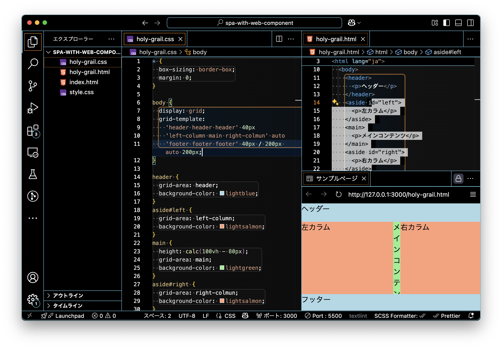

</figure>

フレックスボックスとグリッドレイアウト、どちらを利用してレイアウトを実装するかは好みの部分もあります。  
しかし、一般にフレックスボックスのみを使ったレイアウトのほうがHTMLの構造は複雑になりやすいです。  
複雑な文書はパフォーマンスの低下を招くことに注意するべきでしょう。  
かといって、すべてのデザインでgridが優れているわけではないので、あくまでデザインにあった方法で実装するようにしましょう。

**📝課題 6.4.3-1.** グリッドレイアウトにより習熟するための教材として[Grid Garden](https://cssgridgarden.com/#ja)があります。これに取り組み、全28問題をすべてクリアして、ドロップダウンメニューのレベルがすべて緑に点灯している状態のスクリーンショットを取り、レポートに添付しなさい。（3点）

## 7. JavaScript （Ⅰ）

JavaScriptとは、一般にWeb開発やシステム開発に用いられるプログラミング言語の一つです。

### 7.1. コードの可読性

ウェブ開発に限らず、システム開発において最も大事なことの一つが「**コードを読んだ人間に処理の意味・意図が伝わること**」です。
自分も、他の人も、誰が見ても読みやすいコードを書くために、JavaScriptを書く上で知っておくべき知識を説明します。

#### 7.1.1. 厳格モード

厳格モード (strictモード) とは、そうでない状態ではエラーにはならない微妙な実装をエラー扱いとするモードです。これによって、暗黙的に失敗していた処理をエラーとして検知できるようになったり、JavaScriptのエンジンが最適化しづらい手順を修正できるようになったりといったメリットがあります。しかし、利用したい構文がstrictモードに非対応である場合には注意が必要です。

厳格モードはJavaScriptのコード内に`"use strict";`と記述することで有効化できます。
試しに、ブラウザの開発者ツールでコンソールタブを開き、以下のコードを実行して結果を確認してください。

<figure>

<figcaption><a id="c711-1">コード 7.1.1-1. 厳格モードを有効にするコード</a></figcaption>

```JavaScript
"use strict";
a = 1;
```

</figure>

<figure>

<figcaption><a id="f711-1">図 7.1.1-1. 厳格モードで発生するエラー</a></figcaption>

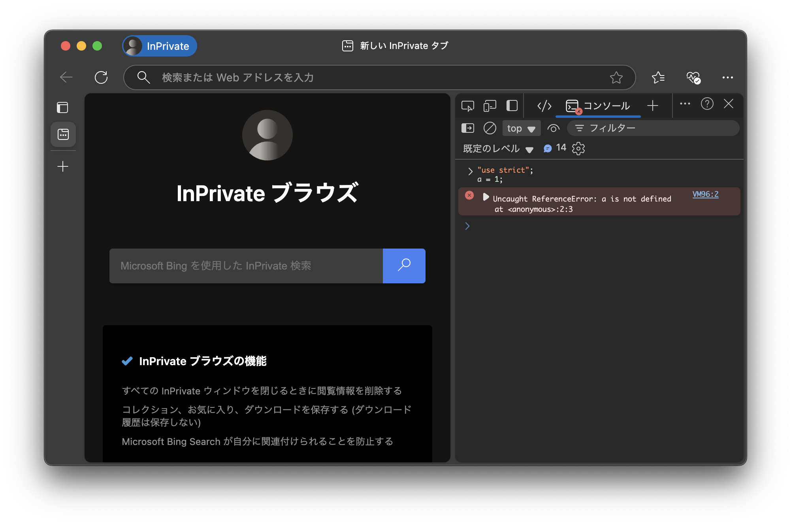

</figure>

[図 7.1.1-1.](#f711-1)のようにエラーが出れば、問題なく厳格モードが有効になっています。この場合は未宣言の変数を操作しようとしたことでエラーが発生しています。  
これは意図せずグローバル変数を宣言してしまうことを防いでくれます。

このように便利な厳格モードですが、スクリプト全体で有効にしてしまうと他のライブラリやファイルが厳格モードに対応しない記述で書かれていたときに動作しなくなってしまうことには注意が必要です。  
使用方法のおすすめとしては関数の冒頭部で有効化するものです。そうすることで、厳格モードは関数内でのみ有効になります。

#### 7.1.2. コメント

コメントは他のほぼすべてのプログラミング言語にもある「コード中に記述されているが処理に影響がない文」のことです。  
JavaScriptでは以下の二通りで記述できます。

<figure>

<figcaption><a id="c712-1">コード 7.1.2-1. JavaScriptのコメントの例</a></figcaption>

```javascript
console.log('コメントの説明');
// console.log('これは一行だけをコメントにするやつ');
console.log('//が書いてある行にしか影響しない');

/*
 * console.log('これは複数行をコメントにするやつ');
 * console.log('/* から * /までの間が実行されない');
 */
```

**📝課題 7.1.2-1.** JavaScriptの複数行コメントを `/**`\~`*/` と書くと、JSDocというコードの暗黙的な情報を補足するツールを利用できます。具体的に何ができるのか、調べて一つ挙げなさい。（1点）

</figure>

コメントを適切に書くことでコードの意図や内容を他の開発者にわかりやすく伝えることができます。  
また、実行したくないコードをコメントにすることで開発中のデバッグをやりやすくする使い方もあります。

#### 7.1.3. 命名

命名はプログラムを書く上で逃れられず、かつ難しい要素の一つです。

コードを読む上でわざわざ他人の書いたコードをすべて読んで意味を理解してから使うことはあまりにも面倒です。  
そのため、完結で処理の内容や意味、効果がわかりやすい命名を変数・関数にするべきだとされています。  

<figure>

<figcaption><a id="t713-1">表 7.1.3-1. 命名の良い例と悪い例</a></figcaption>

| 良い例 | 悪い例 |
| ---- | ---- |
| `let count = 0;` | `let a = 0;` |
| `function solveQuadraticEquation () {...}` | `function solve() {...}` |

</figure>

1つ目の例はあまりにも極端ですが、`count`という名前で宣言されている方が変数の利用目的が明確です。

2つ目の例は場合によってどちらがいいかの判断が変わる場合があります。  
特にクラスのメソッドとしてある式を解くような関数の場合では悪い例は悪いとは言い切れません。  
また、エディタの補完機能がない場合には冗長な命名の関数は嫌われるため、良い例として示したものが必ずしも良いわけではありません。

時と場合に合わせて命名とコメントを組み合わせて誰が読んでもわかりやすいコードになるよう心がけましょう。

### 7.2. 基本的な処理

#### 7.2.1. 変数

変数は値を格納する入れ物です。例えるとラベルの付いた箱のようなものです。  
`let`と記述した後に変数の名前を記述することで変数を宣言できます。

<figure>

<figcaption><a id="c721-1">コード 7.2.1-1. 変数の宣言</a></figcaption>

```javascript
let myVariable;
```

</figure>

変数のあとに`=`と値を順番に記述すると、その値を変数に割り当てることができます。  
値の割り当てと変数の宣言をまとめて、一行で記述することもできます。

<figure>

<figcaption><a id="c721-2">コード 7.2.1-2. 変数の初期値の設定</a></figcaption>

```javascript
let myVariable;
myVariable = 1;

let nextVariable = 100;
```

</figure>

`let`を使って宣言すると、後から変数に割り当てた値を変更できます。  
`let`のかわりに`const`を使って宣言すると、後から変更できない定数として宣言できます。  
以下の[コード 7.2.1-3.](#c721-3)に示すコードをブラウザの開発者ツールのコンソールタブで実行して、結果を確認しましょう。

<figure>

<figcaption><a id="c721-3">コード 7.2.1-3. 定数宣言</a></figcaption>

```javascript
let myVariable = 1;
myVariable = 23;

const constantValue = 10;
constantValue = 2030;
```

</figure>

以下の[図 7.2.1-1.](#f721-1)のように、エラーが表示されるはずです。  
これは、定数に対して値を再代入しようとしたことで、変更できない値を変更しようとしたためエラーが表示されています。

<figure>

<figcaption><a id="f721-1">図 7.2.1-1. 定数に値を代入したことによるエラー</a></figcaption>

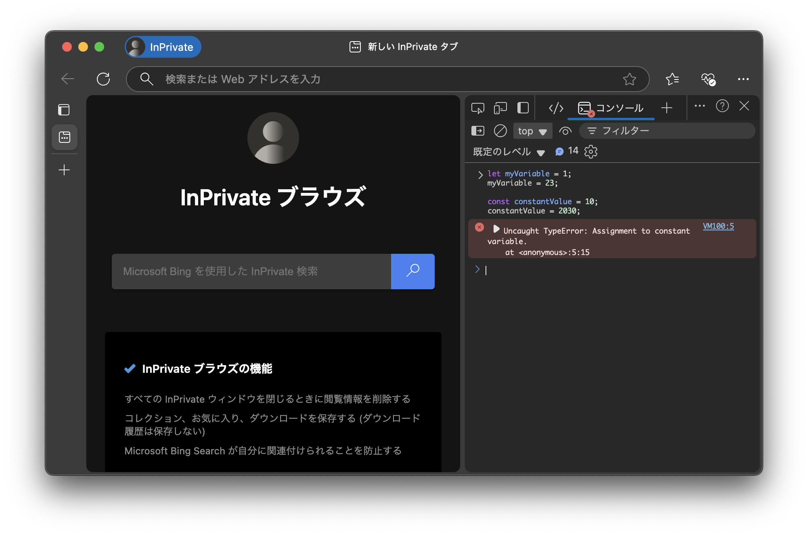

</figure>

**📝課題 7.2.1-1.** JavaScriptの変数宣言の命令には `var` もありますが、この命令は利用が推奨されないため今回説明していません。なぜ利用が推奨されないのか、調べて理由を書きなさい。(1点)

#### 7.2.2. 四則演算

四則演算はそれぞれ、[表 7.2.2-1.](#t722-1)に示す対応表のようにして記述することができます。

<figure>

<figcaption><a id="t722-1">表 7.2.2-1. 四則演算と対応する記述</a></figcaption>

| 演算 | 記述 | 実行結果 |
| ---- | ---- | ---- |
| 加法 | `1 + 1` |  |
| 減法 | `1 - 1` | 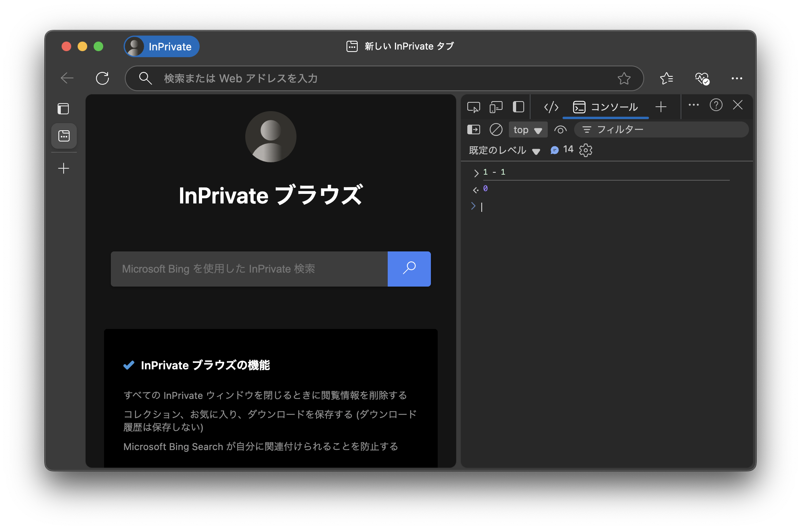 |
| 乗法 | `2 * 2` |  |
| 除法 | `2 / 2` |  |
| 剰余 | `3 % 2` |  |

</figure>

この他に`+=`、`-=`のような二項演算子の後ろに`=`をつける、加算代入演算子や減算代入演算子などもあります。  
この演算子は計算と変数への値の割り当てと一行で記述できます。

<figure>

<figcaption><a id="c722-2">コード 7.2.2-2. 加算代入演算子を利用した処理</a></figcaption>

```javascript
let value = 1;
value += 2;
```

</figure>

この加算代入演算子を使った処理は、以下のコードと同じ処理になります。

<figure>

<figcaption><a id="c722-3">コード 7.2.2-3. コード 7.2.2-2.の等価コード</a></figcaption>

```javascript
let value = 1;
value = value + 2;
```

</figure>

#### 7.2.3. その他の算術演算

プログラムでは四則演算以外でも頻繁につかう演算があります。  
変数の値を一つ増やすインクリメントや、一つ減らすデクリメントがその例です。  
インクリメントのようなプログラム中で特に利用する演算は、演算子として用意されています。

また、三角関数のような高度な演算はJavaScriptでは `Math` という名前の組み込みオブジェクトから呼び出せます。

以下の[表 7.2.3-1.](#t723-1)にいくつか例を示します。

<figure>

<figcaption><a id="t723-1">表 7.2.3-1. 様々な算術演算と対応する記述</a></figcaption>

| 演算 | 記述 | 実行結果 | 補足 |
| ---- | ---- | ---- | ---- |
| インクリメント | 後置インクリメント:`x++`<br>前置インクリメント:`++x` | 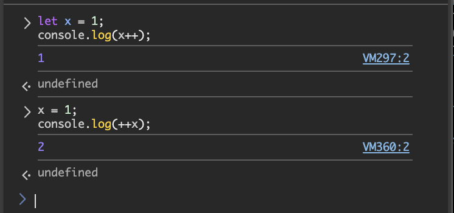 | 後置:先に評価結果を返して加算を行う<br>前置:先に加算を行って評価結果を返す |
| デクリメント | 後置デクリメント:`x--`<br>前置デクリメント:`--x` | 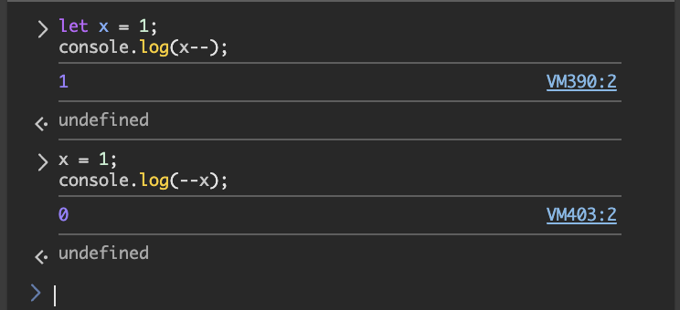 | 後置:先に評価結果を返して減算を行う<br>前置:先に減算を行って評価結果を返す |
| べき乗 | `2 ** 2`<br>`Math.pow(2,2)` | 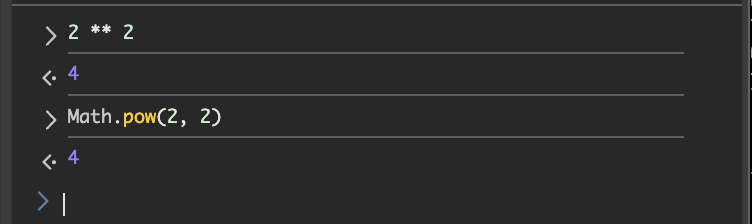| べき乗演算子`**`が後に実装された |
| 円周率 | `Math.PI` | 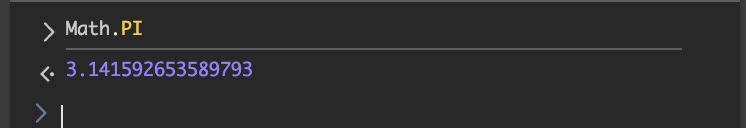 |  |
| 正弦 | `Math.sin(θ)` | 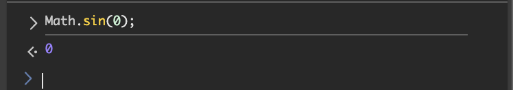 |  |
| 余弦 | `Math.cos(θ)` | 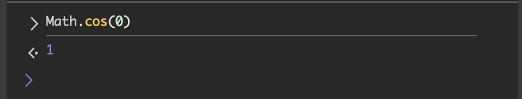 |  |

</figure>

その他のMathオブジェクトのプロパティやメソッドは[Math - JavaScript | MDN](https://developer.mozilla.org/ja/docs/Web/JavaScript/Reference/Global_Objects/Math)を確認してください。

**📝課題 7.2.3-1.** `Math.sin()`や`Math.cos()`は弧度法で表現された角度をうけとります。それぞれ度数法45°を弧度法で表現して、$sin(45°)$と$cos(45°)$を求めるプログラムを実行しなさい。結果をスクリーンショットで撮影し、レポートに添付しなさい。（1点）

#### 7.2.4. 文字列の処理

文字列はJavaScriptではStringオブジェクトとして扱われ、様々な操作を行うことができます。  
連結、分割、置き換えなどの一部操作の方法を以下の[表 7.2.4-1.](#t724-1)に示します。

<figure>

<figcaption><a id="t724-1">表 7.2.4-1. 文字列の処理と対応する記述</a></figcaption>

| 操作 | 記述 | 実行結果 |
| ---- | ---- | ---- |
| 結合 | `'jig' + '.' + 'jp'` |  |
| 結合 | `str += otherStr` | 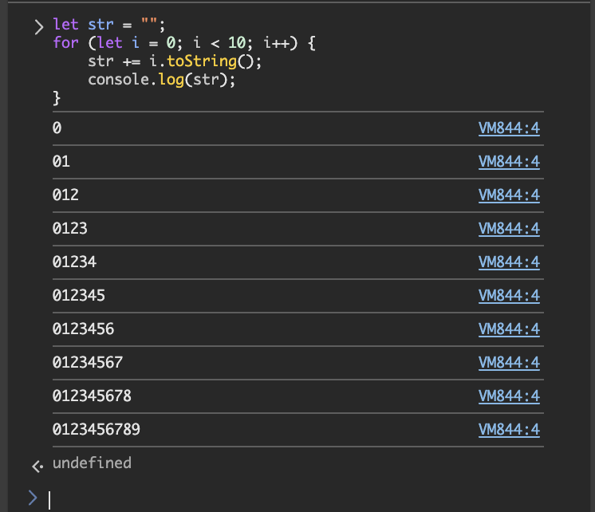
| 文字の取り出し | `'jig.jp'.charAt(1)` | 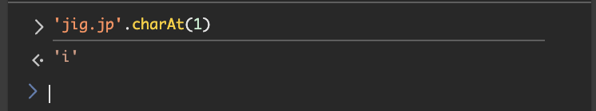 |
| 分割 | `'jig.jp'.split('.')` | 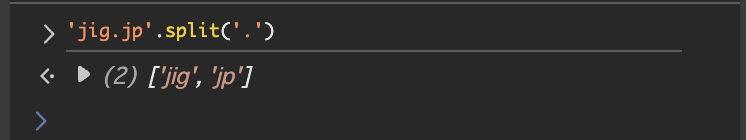 |
| 文字列の切り出し | `'jig.jp'.slice(1, 4)` | 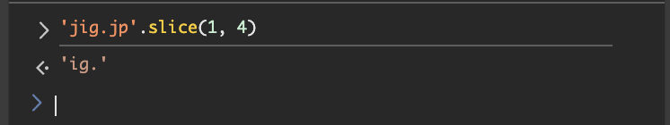 |
| 文字列の置き換え | `'jig.jp'.replace('ji', 'じぇいあい')` | 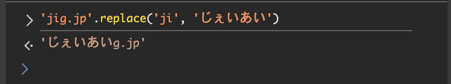 |
| 文字列の長さ | `'jig.jp'.length` | 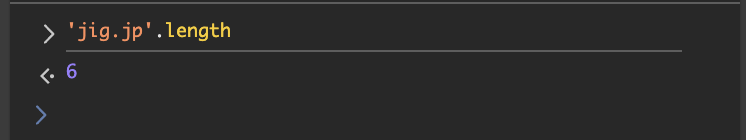 |
| 文字列の位置 | `'jig.jp'.indexOf('jp')` | 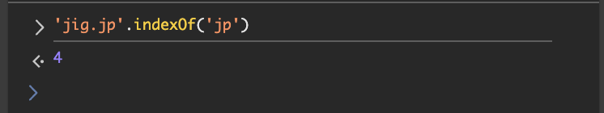 |

</figure>

その他のStringオブジェクトのプロパティやメソッドは[String - JavaScript | MDN](https://developer.mozilla.org/ja/docs/Web/JavaScript/Reference/Global_Objects/String)などを参考にしてください。

#### 7.2.5. 論理演算

論理演算はプログラムで頻出する演算の一つです。それぞれの演算は以下の[表 7.2.5-1](#t725-1)のように対応します。

<figure>

<figcaption><a id="t725-1">表 7.2.5-1. 論理演算と対応する記述</a></figcaption>

| 演算 | 記述 | 実行結果 |
| ---- | ---- | ---- |
| AND | `a && b` | 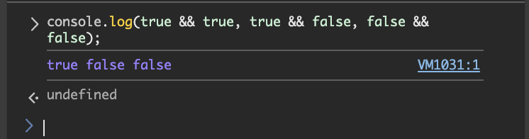 |
| OR | `a \|\| b` | 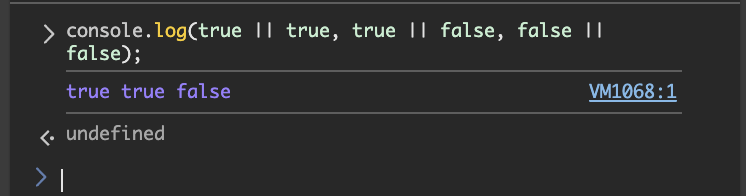 |
| NOT | `!a` | 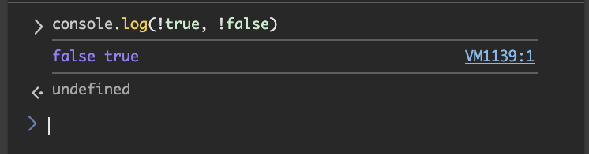 |

</figure>

### 7.3. 条件分岐

数学の問題で場合分けが発生するように、プログラムでも条件によって処理を変更したいことがあります。  
ここではプログラムで条件分岐を記述する方法を説明します。

#### 7.3.1. 比較演算子

場合分けが発生する簡単な例として、二次方程式の判別式Dがあります。判別式Dは以下の式で、次のような分岐がわかります。  
判別式D: $D = b^2 - 4ac$  
判別式Dの結果が

- 正の値 → 実数解
- 0 → 重解
- 負の値 → 虚数解

これは判別式Dの結果を`value`として、それぞれ比較演算子を用いて以下のように表現できます。

- 正の値 → `value > 0`
- 0 → `value === 0`
- 負の値 → `value < 0`

JSではこのようにして値の大小や等価かどうかを比較できます。
以下の[表 7.3.1-1.](t731-1)に比較演算子の表を示します。

<figure>

<figcaption><a id="t731-1">表 7.3.1-1. 比較演算と記述</a></figcaption>

| 演算 | 記述 |
| ---- | ---- |
| `厳密等価` | `a === b` |
| `厳密不等価` | `a !== b` |
| `超過/より大きい` | `a > b` |
| `以上` | `a >= b` |
| `未満/より小さい` | `a < b` |
| `以下` | `a <= b` |

</figure>

厳密等価/厳密不等価の演算が存在するということは、厳密**でない**等価・不等価の演算があると言うことです。
これらは暗黙的な型変換を行うため一見して予想できない挙動をすることがあります。
このため、厳密等価演算子・厳密不等価演算子を使用することが推奨されます。
以下の[表 7.3.1-2](#t731-2)に厳密でない等価・不等価演算子の表を示します。

<figure>

<figcaption><a id="t731-2">表 7.3.1-2. 非推奨な等価/不等価演算子</a></figcaption>

| 演算 | 記述 |
| ---- | ---- |
| 等価 | `==` |
| 不等価 | `!=` |

</figure>

#### 7.3.2. if文

7.3.1.でプログラムで条件を表現する方法を説明しました。先程の判別式Dの結果を評価し、実数解、重解、虚数解のどれになるかを出力するプログラムを作ることを考えてみましょう。
評価の結果によって処理を分岐させるためには `if`文を使います。

<figure>

<figcaption><a id="c732-1">コード 7.3.2-1. if文を利用するコードのイメージ</a></figcaption>

```javascript
if (<条件1>) {
   条件1が真のときの処理
} else if (<条件2>) {
   条件2が真のときの処理
} else {
   条件1も条件2も偽のときの処理
}
```

</figure>

if文は`()`内の評価結果が真のときに直後の`{}`で囲まれたブロック内の処理を行い、`()`内の評価結果が偽のときに直後の`else`句の処理を行います。このとき、`else`のあとに`if`でif文をつなげることで条件分岐を追加できます。`else`句のあとにある`{}`ブロック内の処理は、それより前にある`if`と`else if`のすべての条件を満たさなかったときに実行されます。
`if`\~`else if`\~`else`句は一連の処理の塊として捉えられます。この中で上から順に評価が行われるため、条件の順番には気をつける必要があります。

では判別式の結果から解がどうなるかを出力するプログラムを以下に書きます。

<figure>

<figcaption><a id="c732-2">コード 7.3.2-2. 判別式Dの結果から解がどうなるかを出力するJavaScript</a></figcaption>

```javascript
let a, b, c;
a = <x2 の係数>;
b = <x の係数>;
c = <定数項>;

const d = b ** 2 - 4 * a * c;

if (d === 0) {
   console.log('重解');
} else if (d > 0) {
   console.log('実数解');
} else {
   console.log('虚数解');
}
```

</figure>

実行結果は以下のようになります。

<figure>

<figcaption><a id="f732-1">図 7.3.2-1. a=2,b=4,c=2のときの実行結果</a></figcaption>

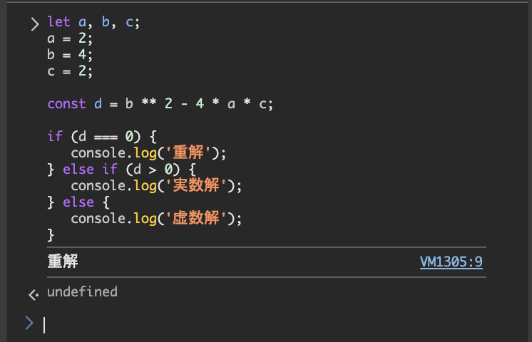

</figure>

<figure>

<figcaption><a id="f732-2">図 7.3.2-2. a=4,b=0,c=-4のときの実行結果<</a></figcaption>

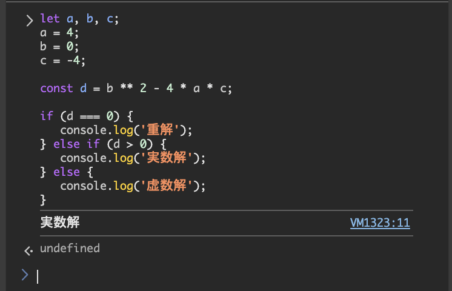

</figure>

**📝課題 7.3.2-1.** 変数`a`,`b`を宣言して適当な数を代入し、`a`と`b`の大きさを比較して、`a`のほうが大きければ「A」、`ｂ`のほうが大きければ「B」を出力するプログラムを作成しなさい。プログラムと、実行結果をスクリーンショットで撮影し、レポートに添付しなさい。（2点）

#### 7.3.3. 三項演算子

三項演算子とは条件によって返す値を変えられる演算子です。
以下のような記法で利用できます。

<figure>

<figcaption><a id="c733-1">コード 7.3.3-1. 三項演算子を利用するコードのイメージ</a></figcaption>

```javascript
value = <条件> ? <条件が真のときの値> : <条件が偽のときの値>;
```

</figure>

例えばある値の真偽によって値を返したいときに活用できます。[7.3.2. if文](#732-if文)の判別式の例を書き換えると以下のようになります。

<figure>

<figcaption><a id="c733-2">コード 7.3.3-2. 三項演算子を利用したコード 7.3.2-2.の等価コード</a></figcaption>

```javascript
let a, b, c;
a = <x2 の係数>;
b = <x の係数>;
c = <定数項>;

const d = b ** 2 - 4 * a * c;

const res = d === 0
            ? '重解'
            : d > 0
              ? '実数解'
              : '虚数解';

console.log(res);
```

</figure>

三項演算子はこのように、三項演算子の下に三項演算子を書くことができます。
しかし、階層が深くなると複雑で読みづらくなるので注意が必要です。

<figure>

<figcaption><a id="f732-1">図 7.3.3-1. a=2,b=4,c=2のときの実行結果</a></figcaption>

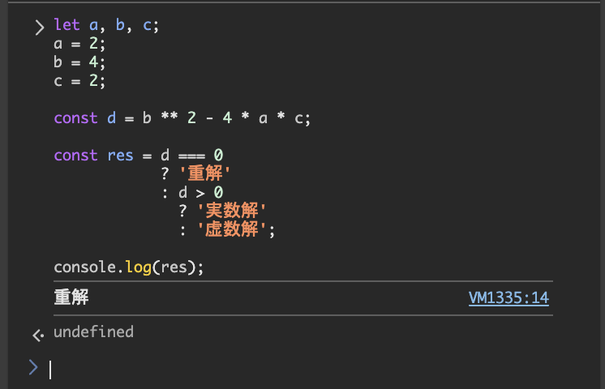

</figure>

<figure>

<figcaption><a id="f732-2">図 7.3.3-2. a=4,b=0,c=-4のときの実行結果<</a></figcaption>

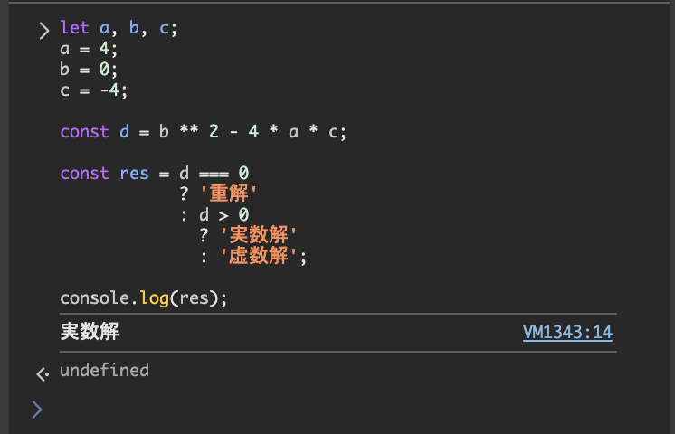

</figure>

### 7.4. 繰り返し

複数回処理をさせるとき、何度も同じコードを書くのは手間や保守性の観点でいい方法とは言えません。  
JavaScriptには同じ処理を複数回行うための文法があります。ここではその文法 `for`文について説明します。

#### 7.4.1. 配列

繰り返し処理と関連の深い値として配列があります。  
配列とは、変数が列になって連なったようなもので、以下のような記述で利用できます。

<figure>

<figcaption><a id="c741-1">コード 7.4.1-1. 配列を利用した処理</a></figcaption>

```javascript
const array = [1, 2, 3, 4, 5];
console.log(array[0]); // 1
console.log(array[3]); // 4
```

</figure>

<figure>

<figcaption><a id="f741-1">図 7.4.1-1. コード 7.4.1-1.の実行結果</a></figcaption>

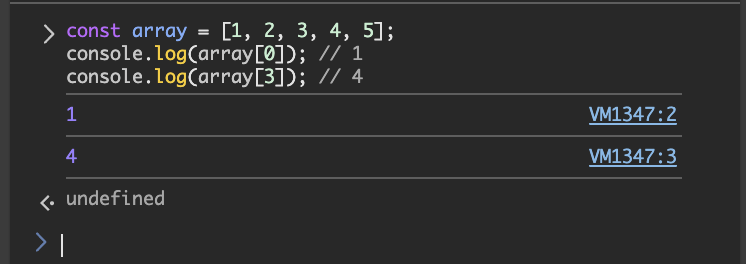

</figure>

配列は `[]` で囲まれ `,` で区切られた一連の値で表現されます。  
個々の値にアクセスするには配列名の後ろに`[index]`と書くことで取り出せます。この`index`とは配列の中の順番のことで、0番から順に番号が振られます。

1からではなく、0から数えることに注意してください。ほとんどのプログラミング言語では0から数を数えるので覚えておきましょう。

#### 7.4.2. for文

先程の配列を使って、繰り返し処理の実例を見てみましょう。  
ここでは第10項までのフィボナッチ数列を作ることを考えます。

`for`文は実はすでに資料中で登場していますが、以下のような記述で使うことができます。

<figure>

<figcaption><a id="c742-1">コード 7.4.2-1. for文を利用した処理のイメージ</a></figcaption>

```javascript
for (<ループ前の処理>; <ループ終了条件>; <ループごとの処理>) {
  <繰り返す処理内容>
}
```

</figure>

<ループ前の処理>は、ループがはじまる前に一度だけ処理されます。  
`i`, `j`, `k`を`for`文での制御変数として利用し、`let i = 0;`のように変数宣言と初期値の代入をすることが多いです。

<ループ終了条件>は、評価結果が偽になったときにループを抜けるものです。  
制御変数を含めた判定式を記述することが多いです。

<ループごとの処理>は、<繰り返す処理内容>が完了した後に毎回処理されます。  
`i++`のように制御変数をインクリメントすることが多いです。

具体的に、フィボナッチ数列を求める処理を以下の[コード 7.4.2-2](#c742-2)に示します。  
このコードをブラウザのコンソールタブで実行して、結果を確認してください。

<figure>

<figcaption><a id="c742-2">コード 7.4.2-2. フィボナッチ数列の第10項までを求めるJavaScript</a></figcaption>

```javascript
let fibonacciSeries = [];
for (let i = 1; i <= 10; i++) {
  const len = fibonacciSeries.length;
  if (len < 2) {
    fibonacciSeries.push(1);
  } else {
    fibonacciSeries.push(fibonacciSeries[len - 2] + fibonacciSeries[len - 1]);
  }
}
console.log(fibonacciSeries); // [1, 1, 2, 3, 5, 8, 13, 21, 34, 55]
```

</figure>

<figure>

<figcaption><a id="f742-1">図 7.4.2-1. コード 7.4.2-2.の実行結果</a></figcaption>

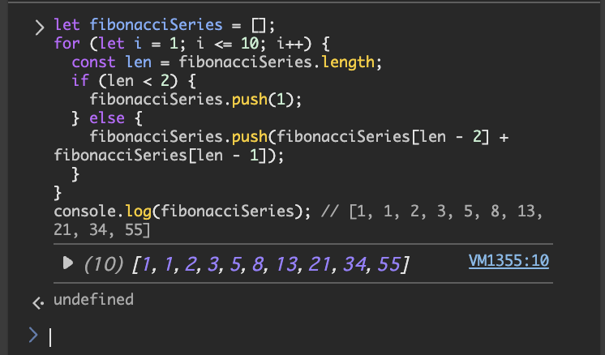

</figure>

このように面倒な手順を繰り返し処理で簡単に記述できました。

#### 7.4.3. `Array.prototype.forEach()`

配列には`.forEach()`というメソッドがあります。メソッドとはオブジェクトから呼び出せる関数のことで、メソッドや関数については[7.5. コードの再利用](#75-コードの再利用)で詳しく説明します。
`.forEach()`は配列の1要素ごとに繰り返し処理を行うためのもので、以下のようにして利用できます。

<figure>

<figcaption><a id="c743-1">コード 7.4.3-1. Array.prototype.forEach() を利用した処理</a></figcaption>

```javascript
let array = [];
for (let i = 0; i < 10; i++) {
  array.push(Math.floor(Math.random() * 10 * i));
}

array.forEach((value) => {
  if (value % 2 === 0) {
    console.log(`${value} is even.`);
  } else {
    console.log(`${value} is odd.`);
  }
});
```

</figure>

<figure>

<figcaption><a id="f743-1">図 7.4.3-1. コード 7.4.3-1. の実行結果</a></figcaption>

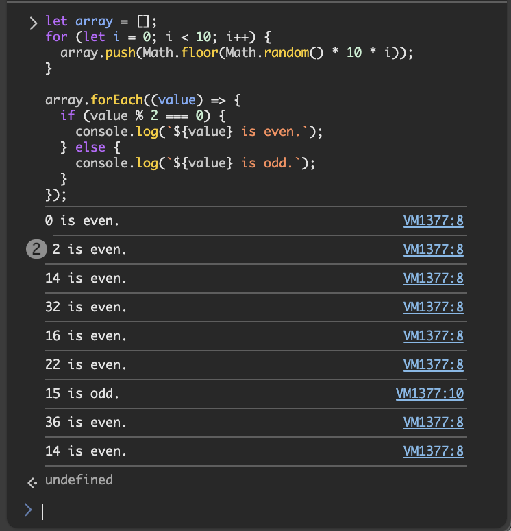

</figure>

このコードは10個の乱数を生成して配列にしたあと、それぞれに対して偶数か奇数かを判定するコードです。
`(value) => {}`と渡している処理をコールバック関数と呼びます。このようにJSでは関数の引数に関数を渡すことがあります。

このような関数を反復処理メソッドと言います。  
`Array.prototype.forEach()`以外にも `Array.prototype.map()`や`Array.prototype.filter()`など、JavaScriptの配列オブジェクトには様々な処理に特化した反復処理メソッドがあります。

同様の処理はfor文でも記述できますが、インデックスによるアクセスが発生し混乱のもとになりやすいです。(特に配列のインデックスが0から始まることを忘れているとバグのもとになります。)

<figure>

<figcaption><a id="c743-2">コード 7.4.3-2. for文を利用したコード 7.4.3-1.の等価コード</a></figcaption>

```javascript
let array = [];
for (let i = 0; i < 10; i++) {
    array.push(Math.floor(Math.random() * 10 * i));
}

for (let i = 0; i < 10; i++) {
    if (array[i] % 2 === 0) {
        console.log(`${array[i]} is even.`);
    } else {
        console.log(`${array[i]} is odd.`);
    }
}
```

</figure>

<figure>

<figcaption><a id="f743-1">図 7.4.3-2. コード 7.4.3-2. の実行結果</a></figcaption>

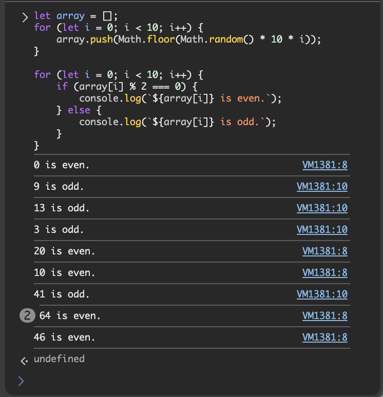

</figure>


for文中の処理の最初で`array[i]`を別の変数(例えば`value`)に代入しても良いですが、同様のことが`forEach()`では`(value) => {...}`とするだけで書けます。  
また、for文での処理と違い配列の長さを気にせず処理を行えるのも便利な特徴です。  
適宜使い分けると良いでしょう。

**📝課題 7.4.3-1.** `Array.prototype.map()`という反復処理メソッドがあります。これは、`map()`メソッドの親となる配列の各要素に対して受け取った処理を行って、新しい配列を作成するメソッドです。[コード 7.4.2-2.](#c742-2)で作成したフィボナッチ数列の第10項までを持つ配列から、`map()`メソッドを使用してフィボナッチ数列の第2項から第11項を持つ配列を作成し、コンソールに出力しなさい。実行結果をスクリーンショットで撮影し、レポートに添付しなさい。（2点）

## 8. JavaScript （Ⅱ）

[7. JavaScript （Ⅰ）](#7-javascript-ⅰ)では、JavaScriptでの基本的な処理の説明しました。

その組み合わせで多種多様な処理を開発するのですが、処理のたびに毎回同じコードを書くのは億劫です。  
[8. JavaScript（Ⅱ）]では、この手間を小さくできる「処理に名前をつけて呼び出す仕組み」をいくつか説明します。

> ※ この章は全体的にだいぶ端折った説明をしています。
> より詳細な説明は参考文献から[mdn web docs](https://developer.mozilla.org/ja/docs/Web)や[JSPrimer](https://jsprimer.net/)の該当箇所を参照してください。

### 8.1. 関数

#### 8.1.1. 関数

すでに関数の呼び出しは資料中にたくさん登場しています。例えば`console.log()`は立派な関数呼び出しです。  
このように`関数名(引数)`という形で関数は呼び出せます。

では関数はどのようにプログラム中で記述できるのかというと、基本的に以下の[コード 8.1.1-1.](#c811-1)のように記述できます。

<figure>

<figcaption><a id="c811-1">コード 8.1.1-1 関数宣言のイメージ</a></figcaption>

```javascript
function <関数名> (<引数>) {
  <処理内容>
  return <返り値>;
}
```

</figure>

具体的に、二次方程式の解を求める関数を作成してみます。  
(ただし、JSは標準では虚数を表現できません)

<figure>

<figcaption><a id="c811-2">コード 8.1.1-2 二次方程式の解を求める関数</a></figcaption>

```javascript
function solveQuadraticEquation (a, b, c) {
  const d = b ** 2 - 4 * a * c;
  if (d === 0) {
    return {
      type: '重解',
      ans: [b / (2 * a)]
    };
  } else if (d > 0) {
    return {
      type: '実数解',
      ans: [
        (b + Math.sqrt(d)) / (2 * a),
        (b - Math.sqrt(d)) / (2 * a)
      ]
    };
  } else {
    return {
      type: '虚数解',
      ans: [
        `(${b} ± √${Math.abs(d)}i) / ${2 * a}`
      ]
    };
  }
}
```

</figure>

ここで `a`, `b`, `c` は**仮引数**と呼ばれ、関数の呼び出し時に`()`の中の対応する位置に与えられた値(**引数**)を参照できます。その後`return`で関数の処理結果を**返り値**として返しています。
この`return`文は値を返す必要がない関数では省略可能です。

また、`return`は値を返す、つまり関数の処理を終えたことを意味します。そのため上記の処理のように処理の途中で関数を終了したり、条件によって複数の終了処理を記述することができます。

**📝課題 8.1.1-1.** [7.3.2 if文](#732-if文)で判別式を計算した値a,b,cの組み合わせ2通りに対して、[コード 8.1.1-2.](#c811-2)を利用して解を計算しなさい。実行結果をスクリーンショットで撮影し、レポートに添付しなさい。（1点）

#### 8.1.2. 無名関数

JavaScriptで頻出する関数の書き方には名前はないけど関数として宣言されて実行されるものがあります。  
それが無名関数です。

以下の[コード 8.1.2-1.](#c812-1)に無名関数を作成する2種の記述を示します

<figure>

<figcaption><a id="c812-1">コード 8.1.2-1. 無名関数の作成</a></figcaption>

```javascript
function (msg) {
  console.log(msg);
};

(msg) => {
  console.log(msg);
};
```

</figure>

後者は特別に*アロー関数*と呼ばれる場合もあります。

これらは返り値として関数を返します。  
そのため、変数に関数を代入して変数名の後ろに`()`をつけることで代入した関数を呼び出すことができます。

<figure>

<figcaption><a id="c812-2">コード 8.1.2-2. 定数に代入した関数の実行</a></figcaption>

```javascript
const log = function (msg) {
  console.log(msg);
};
log('test');
```

</figure>

<figure>

<figcaption><a id="f812-1">図 8.1.2-1. コード 8.1.2-2.の実行結果</a></figcaption>

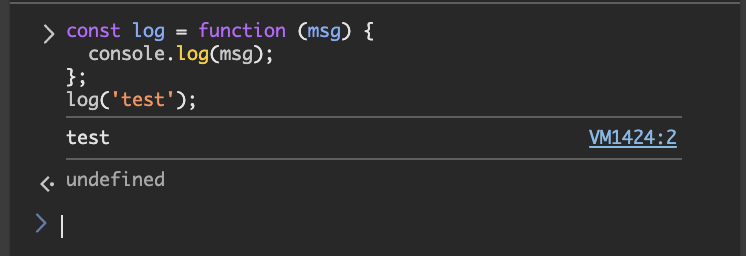

</figure>

#### 8.1.3. 値としての関数

[8.1.2. 無名関数](#812-無名関数)では無名関数を変数に代入していました。このことから、JSの関数は値として扱うことができるのがわかります。
また、この性質を利用してコールバックという処理方法を取れます。`setTimeout(callback, delay)`の`callback`のように関数を値として渡すことで特別な処理がしやすくなります。

<figure>

<figcaption><a id="c813-1">コード 8.1.3-1. コールバックを利用した処理</a></figcaption>

```javascript
setTimeout(() => {
  const now = new Date();
  console.log(now);
}, 5 * 1000);
```

</figure>

<figure>

<figcaption><a id="f813-1">図 8.1.3-1. コード 8.1.3-1.の実行結果</a></figcaption>

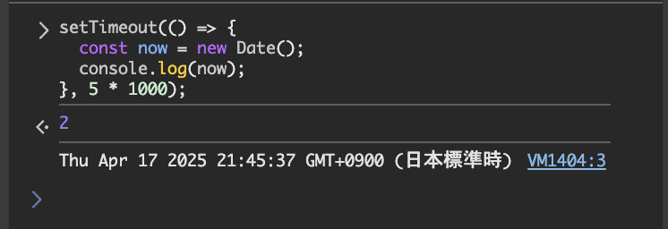

</figure>

`setTimeout`は`setTimeout(callback, delay)`のように2つの引数を取ります。  
`callback`はコールバック関数で`delay`ミリ秒後に実行されます。  
また、返り値として正の整数値を返します。  
これは登録されたtimeoutのIDで、`setTimeout`が呼ばれてから`delay`ミリ秒の間に`clearTimeout(timeoutID)`とすることで登録されたコールバック関数の実行をキャンセルできます。

**課題 8.1.3-1.** `setTimeout()`のようにコールバック関数を受け取って後で実行するメソッドに`setInterval()`があります。これも同様にintervalのIDを返します。`setInterval()`を利用して1秒毎に`hello`と出力する処理を実行し、intervalのIDと`clearInterval()`メソッドを利用してintervalを停止してください。実行結果をスクリーンショットで撮影し、レポートに添付しなさい。（2点）

### 8.2. オブジェクト

#### 8.2.1. 定義とアクセス

オブジェクトの名はここまでにも登場していますが、あらためて説明します。  
JSにおけるオブジェクトとは、キーと値が対になった**プロパティの集合**です。  
以下の文法で定義・アクセスできます。

<figure>

<figcaption><a id="c821-1">コード 8.2.1-1. オブジェクトの定義と利用</a></figcaption>

```javascript
let obj = {
  key1: 'value1',
  key2: 'value2'
};

console.log(obj.key1, obj['key2']);
```

</figure>

<figure>

<figcaption><a id="f821-1">図 8.2.1-1. コード 8.2.1-1.の実行結果</a></figcaption>

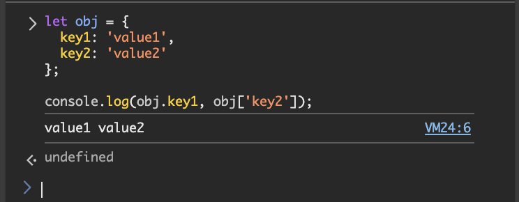

</figure>

このとき、`[]`(ブラケット記法)を利用したアクセスでは`obj['key2']`のように、プロパティ名を文字列として記述するほうが望ましいです。仮に`obj[key2]`と記述してアクセスしようとしたとき、`key2`が変数として解釈されて未定義のためエラーが発生します。
これに対して、`.`(ドット記法)を利用したアクセスでは、使えないプロパティ名があることに注意が必要です。数字で始まるプロパティ名やハイフンを含んだプロパティ名はブラケット記法でアクセスする必要があります。

#### 8.2.2. プロパティの追加と存在確認

JavaScriptのオブジェクトは、一度作成したあとその値自体を変更できる特性を持ちます。これは`const`を利用して宣言したときも同様です。
そのため、[コード 8.2.2-1.](#c822-1)のようにしてオブジェクトにプロパティを追加できます。

<figure>

<figcaption><a id="c822-1">コード 8.2.2-1. プロパティの追加</a></figcaption>

```javascript
const obj = {};

obj.key1 = 'value1';
obj['key2'] = 'value2';

console.log(obj.key1, obj['key2']);
```

</figure>

<figure>

<figcaption><a id="f822-1">図 8.2.2-1. コード 8.2.2-1.の実行結果</a></figcaption>

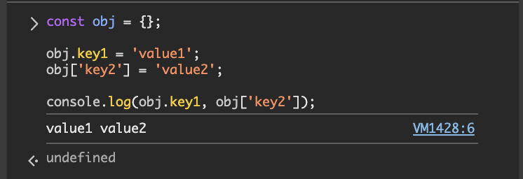

</figure>

またこの特性から、オブジェクトにないプロパティも参照できてしまいます(参照すると`undefined`が返ります)。  
この挙動によるバグを回避するために、いくつかの方法でオブジェクトに目的のプロパティが存在するかを確認することができます。  
ここでは最も使いやすい手法として**Optional Chaining演算子**`?.`を用いた方法を以下に示します。

<figure>

<figcaption><a id="c822-2">コード 8.2.2-2. Optional Chaining演算子を用いた存在確認</a></figcaption>

```javascript
const obj = {
  prop1: {
    key1: 'value1'
  },
  key2: 'value2'
};

console.log(obj.key1);        // X      undefined
console.log(obj.key2);        // O      'value2'
console.log(obj.prop1);       // O      {key1: 'value1'}
console.log(obj.prop1.key1);  // O      'value1'
console.log(obj.prop1.key2);  // X      undefined
console.log(obj.prop2);       // X      undefined
console.log(obj.prop2.key1);  // エラー  undefinedに対して更にプロパティにアクセスしようとした
console.log(obj.prop2.key2);  // エラー  undefinedに対して更にプロパティにアクセスしようとした

// optional chaining
// `?.`のつなげられたプロパティが存在するかを確認して
//   存在すれば`?.`でつながったプロパティにアクセスする
//   存在しなければundefinedを返す
console.log(obj.prop2?.key1);  // X     undefined
console.log(obj?.prop2.key1);  // エラー (obj?.prop2 が undefinedになり、undefined.key1と同じ意味になる)
console.log(obj?.prop2?.key1); // X     undefined (obj?.prop2 が undefinedになり、undefined?.key1がundefinedになる)
```

</figure>

例えば、APIリクエストのレスポンスにあったりなかったりするプロパティにアクセスするときや、入力が必須でない項目があるフォームなどを扱うときに重宝する機能です。

#### 8.2.3. メソッド

JSの関数は値として扱える、という説明を[8.1.3. 値としての関数](#813-値としての関数)でしました。  
これは、オブジェクトのプロパティに関数を設定することもできるということです。

このように、オブジェクトのプロパティとして存在する関数を「メソッド」と呼びます。  
一般的な値のプロパティと同様に、`<オブジェクト名>.<メソッド名>`でアクセスでき、関数呼び出しと同様に`<オブジェクト名>.<メソッド名>()`と書いて呼び出せます。

<figure>

<figcaption><a id="c823-1">コード 8.2.3-1. メソッドの宣言と利用</a></figcaption>

```javascript
const basicArithmeticOperations = {
  sum: (a, b) => a + b,
  diff: (a, b) => a - b,
  multi: (a, b) => a * b,
  div: (a, b) => a / b
};

console.log(basicArithmeticOperations.sum(1, 1));
console.log(basicArithmeticOperations.diff(1, 1));
console.log(basicArithmeticOperations.multi(2, 2));
console.log(basicArithmeticOperations.div(2, 2));
```

</figure>

<figure>

<figcaption><a id="f823-1">図 8.2.3-1. コード 8.2.3-1.の実行結果</a></figcaption>

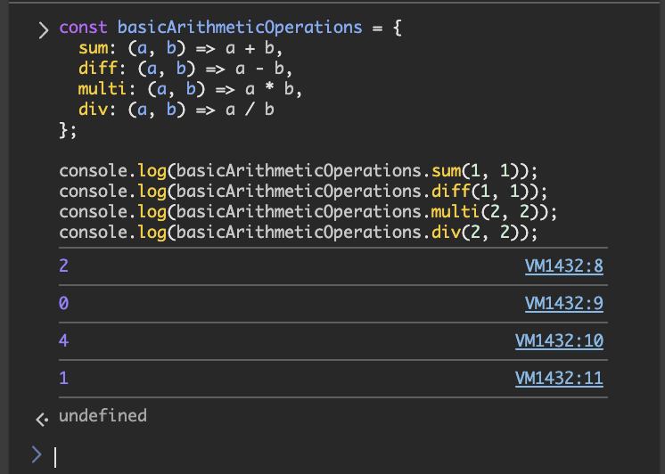

</figure>

### 8.3. クラス

クラスは以下のような文で定義し、インスタンスを生成してメソッドやプロパティにアクセスできます。

<figure>

<figcaption><a id="c83-1">コード 8.3-1. クラスの利用イメージ</a></figcaption>

```javascript
// クラス定義
class <クラス名> {
  <プロパティの宣言>

  // コンストラクタメソッド
  constructor (<コンストラクタ引数>) {
    <初期化処理>
  }

  <メソッドの定義>
}

// インスタンス生成
<const または let> <インスタンス変数名> = new <クラス名>(<コンストラクタ引数>);

// メソッド・プロパティアクセス
<インスタンス変数名>.<プロパティ名 または メソッド名>
```

</figure>

疑似コードでは分かりづらい部分もあるので具体的に

- クラス名: `MyClass`
  - 文字列を与えて初期化できる（与えなくても初期値をもつ）
  - `printText`メソッドを呼び出すことで自身が持つ文字列を出力する

というクラスを実装してみます。

<figure>

<figcaption><a id="c83-2">コード 8.3-2. MyClassクラスの宣言</a></figcaption>

```javascript
class MyClass {
  text = 'initial text';
  
  constructor (text) {
    if (text) this.text = text;
  }

  printText () {
    console.log(this.text);
  }
}
```

</figure>

これがクラスです。  
クラスは設計書のようなもので、これをもとに実体(**インスタンス**)を生成します。

<figure>

<figcaption><a id="c83-3">コード 8.3-3. MyClassクラスのインスタンス生成</a></figcaption>

```javascript
const myClass = new MyClass('my text');
```

</figure>

これで自身の文字列として`'my text'`を持つ`MyClass`のインスタンスを生成して`myClass`に代入できました。  
`myClass`から`printText`メソッドを呼び出せば`'my text'`と出力されるはずです。

<figure>

<figcaption><a id="c83-4">コード 8.3-4. インスタンスのメソッド呼び出し</a></figcaption>

```javascript
myClass.printText();
```

</figure>

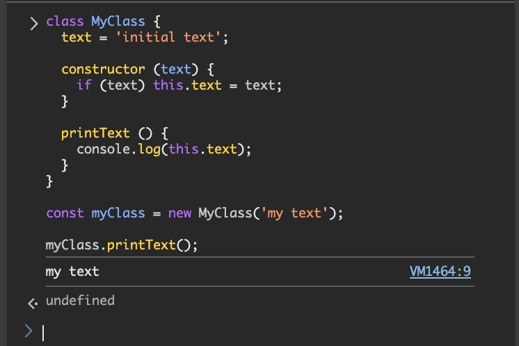

#### 8.3.1. コンストラクタメソッド

クラスには、`constructor`という特別な名を持った単純なメソッドを宣言できます。  
このメソッドは、そのクラスをもとにインスタンス化されたオブジェクトの初期化時に実行されるため、クラスで独自の初期化処理を行いたいときに有効です。

[コード 8.3-2.](#c83-2)の`MyClass`クラスでは、コンストラクタメソッドは一つの値を引数として受け取り初期化処理を行っています。  
この引数は[コード 8.3-3.](#c83-3)のように`new`演算子を使ってクラスのインスタンスを作成するときに、クラス名のあとの`()`の中から与えることができます。

#### 8.3.2. this

[コード 8.3-2.](#c83-2)のコンストラクタ関数や`printText()`メソッドには、`this`というキーワードを利用した処理が記述されています。  
ここでは、`this`キーワードはクラス内の処理で自クラス自身を示すキーワードです。  
自身がもつ他のプロパティやメソッドにクラス内部からアクセスする場合には、このキーワードを利用して`this.<プロパティ名 または メソッド名>`とすることで利用可能です。

**📝課題 8.3.2-1.** コンストラクタメソッド内で`this`キーワードを利用して、ランダムな12桁の数を`id`プロパティにもつクラス`User`を作成しなさい。ただし、0~1までのランダムな数を`Math.random()`で得られます。作成したクラスをインスタンス化し、`console.log(<Userインスタンス変数名>.id)`としてIDを出力する処理を実行し、実行結果をスクリーンショットで撮影してレポートに添付しなさい。(1点)

## 9. 動的なウェブページの開発

[5. HTML](#5-html)と[6. CSS](#6-css)、[7. JavaScript （Ⅰ）](#7-javascript-ⅰ)、[8. JavaScript （Ⅱ）](#8-javascript-ⅱ)で説明した3つのウェブ技術を組み合わせて、実際に動的に変化するウェブページを開発します。

### 9.1. ユーザー入力イベント

ウェブページは、閲覧者が著者によって提供された情報を一方的に受け取るだけのものではありません。  
以下のようなHTML要素を利用することで閲覧者からの入力を受け取ることができます。

#### 9.1.1. ボタン要素

閲覧者からの入力を受け取るモノの代表がボタンでしょう。ウェブページにもよく登場する要素の一つです。  
HTMLではボタン要素は以下のようにして記述できます。

<figure>

<figcaption><a id="c911-1">コード 9.1.1-1. ボタンを表現するHTML</a></figcaption>

```html
<button>ボタンです</button>
<button disabled>無効なボタンです</button>
```

</figure>

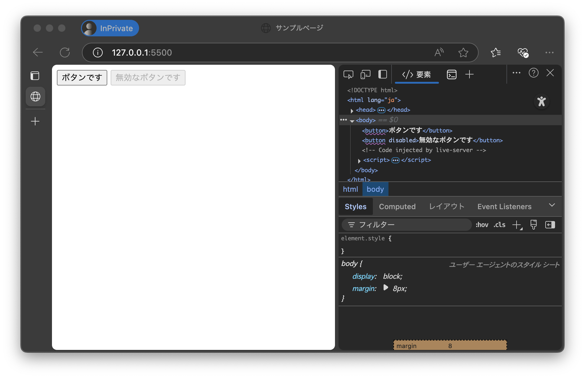

#### 9.1.2. イベントリスナー

ボタンは置いただけでは何にもなりません。  
閲覧者による入力、例えばクリックを処理するには、JavaScriptを用いて要素のクリックを取得して処理する必要があります。

まずは、VSCodeのエクスプローラーから、`main.js`という名前で新しいファイルを作成してください。  
用意したJavaScriptファイルをHTMLから読み込みます。`index.html`を以下の内容に書き換えてください。

<figure>

<figcaption><a id="c912-1">コード 9.1.2-1. JavaScriptを読み込むHTML</a></figcaption>

```html
<!DOCTYPE html>
<html lang="ja">
  <head>
    <meta charset="UTF-8" />
    <meta name="viewport" content="width=device-width, initial-scale=1.0" />
    <title>サンプルページ</title>
    <script src="main.js" defer></script>
  </head>
  <body>
    <button id="main-button">ボタンです</button>
  </body>
</html>
```

</figure>

JavaScriptでは以下のようにしてHTML要素を取得できます。

<figure>

<figcaption><a id="c912-2">コード 9.1.2-2. JavaScriptから特定のHTML要素を取得する処理</a></figcaption>

```javascript
document.querySelector("<セレクタ>")
```

</figure>

`<セレクタ>`にはCSSのセレクタを使えます。これを使って、ボタンがクリックされたときにアラートを出すようにします。  
以下のコードを`main.js`に書き込んでください。

<figure>

<figcaption><a id="c912-3">コード 9.1.2-3. JavaScriptでボタンのクリックを受け取って処理を行う</a></figcaption>

```javascript
const mainButton = document.querySelector('#main-button');

const showAlert = function () {
  window.alert('ボタンがクリックされました。');
}

mainButton.addEventListener('click', showAlert);
```

</figure>

<figure>

<figcaption><a id="f912-1">図 9.1.2-1. コード9.1.2-3.の実行結果</a></figcaption>

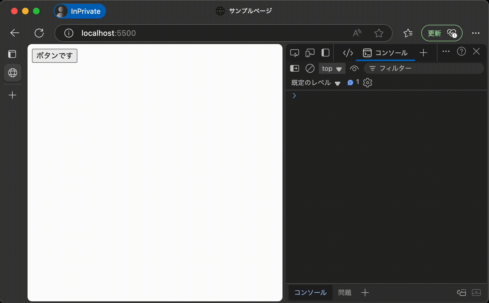

</figure>

このように、HTML要素に対して閲覧者が特定の操作をすることを、JavaScriptでは**イベント**として扱います。  
閲覧者がボタンをクリックしたとき、`'click'`イベントが*発火*すると言います。  
この例ではid属性に`main-button`が設定されたボタンに対して、`'click'`イベントの購読を行っていて、イベントが発生したときに処理を行う**イベントハンドラ**に`showAlert`関数を呼び出すように設定しています。

この`<script>`要素に追加した`defer`属性は、文書の解析語にスクリプトを実行するように遅延する意味があります。  
`defer`属性、`async`属性か、`type="module"`属性を持たない場合、スクリプトは読み込まれた順に即時実行されます。  
今回はページに表示される要素を取得する必要があり、実行時に要素がない（表示されていない）とエラーになってしまうため、`defer`属性を与えています。

`async`属性や`type="module"`属性は、`defer`属性とは違った意味を持ちます。詳しくは[\<script\>: スクリプト要素 - HTML: ハイパーテキストマークアップ言語 | MDN](https://developer.mozilla.org/ja/docs/Web/HTML/Element/script#%E5%B1%9E%E6%80%A7)を見てみてください。

### 9.2. DOM操作

ここでは、操作を受け取って処理した結果を閲覧者に見せるために、JavaScriptで要素に変更を加える方法を説明します。

DOMとは「Document Object Model」の略で、HTMLドキュメントのコンテンツと構造をオブジェクトとして表現したものです。DOMを使うことで、JavaScriptからHTML要素にアクセスして、その内容や属性、スタイルなどを動的に変更することができます。ブラウザはHTMLを解析してDOMツリーを構築し、JavaScriptはこのDOMツリーを操作することでページの内容を動的に変更できるようになります。

#### 9.2.1. コンテンツを変更する

JavaScriptで取得した要素は、様々なプロパティを持つオブジェクト（[HTMLElement](https://developer.mozilla.org/ja/docs/Web/API/HTMLElement)）です。  
コンテンツを変更するときには`HTMLElement`オブジェクトにある  `setHTMLUnsafe()` というメソッドを利用します。

この`setHTMLUnsafe`メソッドを利用して、ボタンがクリックされるたびにクリックされた回数をページに追記するページを作成します。

`index.html`は[コード 9.1.2-1.](#c912-1)に示したコードに、以下の[コード 9.2.1-1.](#c921-1)の`<!-- 追加 -->`と書いてある行を追記してください

<figure>

<figcaption><a id="c921-1">コード 9.2.1-1. index.htmlの変更箇所</a></figcaption>

```html
  <body>
    <button id="main-button">ボタンです</button>
    <p id="messages"></p> <!-- 追加 -->
  </body>
```

</figure>

`main.js`は以下の[コード 9.2.1-2.](#c921-2)で内容を置き換えてください。

<figure>

<figcaption><a id="c912-2">コード 9.2.1-2. main.js</a></figcaption>

```javascript
let clickCount = 0;

const mainButton = document.querySelector('#main-button');
const messages = document.querySelector('#messages');

const updateMessage = function () {
  clickCount++;
  messages.setHTMLUnsafe(messages.innerHTML + `${clickCount}回クリックされました。<br>`);
};

mainButton.addEventListener('click', updateMessage);
```

</figure>

上記2つの変更を追加して各ファイルを保存したら、ブラウザで表示を確認してください。  
ボタンをクリックする毎に「◯回クリックされました。」というメッセージが増えていくはずです。

<figure>

<figcaption><a id="f921-1">図 9.2.1-1. 1回もボタンをクリックしていない状態</a></figcaption>


</figure>

<figure>

<figcaption><a id="f921-1">図 9.2.1-2. 1回ボタンをクリックした状態</a></figcaption>

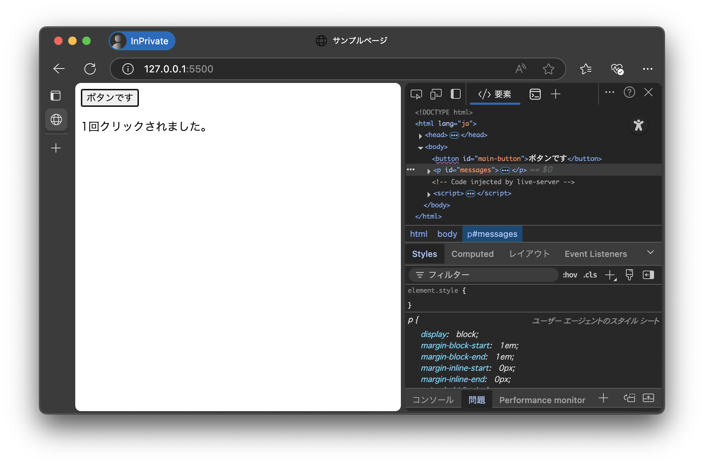

</figure>

#### 9.2.2. CSSを動的に適用する

続いて、見た目にも変更を加えて見ましょう。ここでは`style`プロパティを用います。  
以下の[コード 9.2.2-1.](#c922-1)に示すコードで`main.js`の内容を置き換えてください。  
(HTMLは[9.2.1 コンテンツを変更する](#921-コンテンツを変更する)と同じものです)

<figure>

<figcaption><a id="c922-1">コード 9.2.2-1. CSSを動的に適用するJavaScript</a></figcaption>

```javascript
const colorList = ['pink', 'cyan', 'yellow'];
let clickCount = 0;

const mainButton = document.querySelector('#main-button');
const messages = document.querySelector('#messages');

const updateMessage = function () {
  clickCount++;
  messages.setHTMLUnsafe(messages.innerHTML + `${clickCount}回クリックされました。<br>`);
  messages.style.backgroundColor = colorList[clickCount % 3];
};

mainButton.addEventListener('click', updateMessage);
```

</figure>

<figure>

<figcaption><a id="f922-1">図 9.2.2-1. コード 9.2.2-1.の実行結果</a></figcaption>

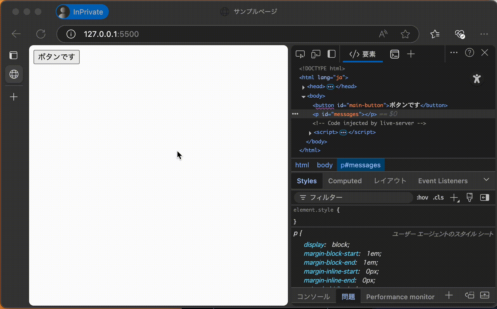

</figure>

### 9.3. CSS トランジション

最後に説明するのは簡単なCSSでのアニメーションです。
`transition`プロパティを用いたアニメーションを説明しておきます。  

> 注: 一般にこれをCSSアニメーションとは言いません。  
> CSSアニメーションについては[CSS アニメーションの使用 - CSS: カスケーディングスタイルシート | MDN](https://developer.mozilla.org/ja/docs/Web/CSS/CSS_animations/Using_CSS_animations)など参照してください。

以下に`index.html`、`style.css`、`main.js`をそれぞれ示します。  
この例では、ボタンがクリックされるたびに移動する四角形が、移動時にアニメーションします。

<figure>

<figcaption><a id="c93-1">コード 9.3-1. index.html</a></figcaption>

```html
<!DOCTYPE html>
<html lang="ja">
  <head>
    <meta charset="UTF-8" />
    <meta name="viewport" content="width=device-width, initial-scale=1.0" />
    <title>サンプルページ</title>
    <script src="main.js" defer></script>
    <link rel="stylesheet" href="style.css"/>
  </head>
  <body>
    <button id="main-button">ボタンです</button>
    <div id="field">
      <div id="box">0</div>
    </div>
  </body>
</html>
```

</figure>

<figure>

<figcaption><a id="c93-2">コード 9.3-2. style.css</a></figcaption>

```css
#main-button {
  margin-bottom: 16px;
}

#field {
  position: relative;
  width: 300px;
  height: 300px;
  border: 2px solid gray;
}

#box {
  position: absolute;
  top: 0px;
  left: 0px;
  width: 100px;
  height: 100px;
  display: grid;
  place-content: center;
  background-color: pink;
  transition: all ease 0.2s;
}
```

</figure>

<figure>

<figcaption><a id="c93-3">コード 9.3-3. main.js</a></figcaption>

```javascript
const colorList = ['pink', 'cyan', 'yellow'];
let clickCount = 0;

const mainButton = document.querySelector('#main-button');
const box = document.querySelector('#box');

const moveBox = function () {
  clickCount++;
  box.textContent = `${clickCount % 4}`;
  box.style.top = [0, 1].includes(clickCount % 4) ? '0px' : '200px';
  box.style.left = [0, 3].includes(clickCount % 4) ? '0px' : '200px';
};

mainButton.addEventListener('click', moveBox);
```

</figure>

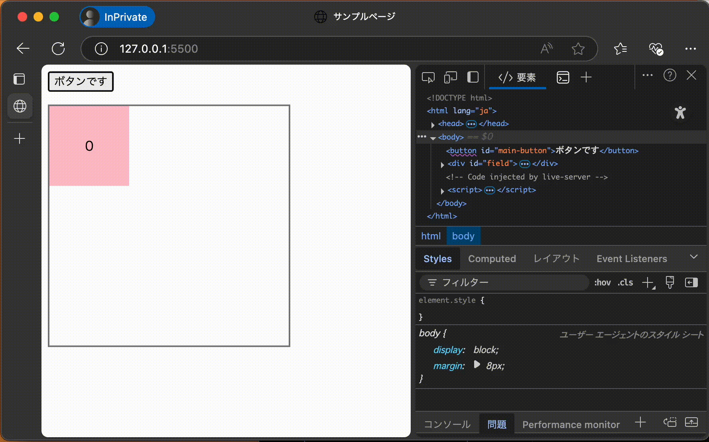

このサンプルで重要な記述は[コード 9.3-2.](#c93-2)にある、以下に示す部分です。

<figure>

<figcaption><a id="c93-4">コード 9.3-4. トランジションプロパティ</a></figcaption>

```css
  #box {
    ...
    transition: all ease 0.2s;
  }
```

</figure>

`transition`プロパティは、プロパティと時間を指定することで、指定したプロパティの値が切り替わったときにその変化に指定した時間かけてゆっくり行わせるものです。  
今回は`all`で全てのプロパティに対して変化をゆるやかにするように指定し、変化には`0.2s`かけるよう指定しています。  
`ease`は変化をゆっくりはじめ、中頃は急で、終わりはまたゆっくりになるような変化をするように指定するタイミング関数というものです。他に線形的に変化する`linear`などもあります。

## 10. ウェブコンポーネント

### 10.1. カスタム要素

HTMLコードを再利用可能にするための仕組みがあります。それが「カスタム要素」です。  
カスタム要素は、`HTMLElement`を継承したクラスを宣言して、そのクラスを`customeElements.define()`を利用して登録することで利用可能になります。

この実験で利用するカスタム要素宣言のテンプレートを以下[コード 10.1-1.](#c101-1)に示します。  

<figure>

<figcaption><a id="c101-1">コード 10.1-1. カスタム要素宣言のテンプレート</a></figcaption>

```javascript
class <カスタム要素クラス名> extends HTMLElement {
  // CSS生成関数
  css = () => /* CSS */ `
    /* CSS */
  `;

  // HTML生成関数
  html = () => /* HTML */ `
    <style>
      ${this.css()}
    </style>
    <!-- HTML -->
  `;

  constructor() {
    super();
    this.attachShadow({ mode: "open" });
  }

  connectedCallback() {
    this.render();
  }

  render() {
    this.shadowRoot.setHTMLUnsafe(this.html());
  }
}

customElements.define("カスタム要素名", <カスタム要素クラス名>);
```

</figure>

1行目からがカスタム要素クラスの宣言で、最後の行はカスタム要素の登録処理です。  

カスタム要素を登録するには、呼び出しに利用する要素名を設定する必要があります。  
この要素名は、標準のHTMLとの混同を防ぐため、必ず名前にハイフンを含むようにしなければなりません。

`extends <継承元クラス>`という構文でクラスを継承して作成されたクラスは、このコンストラクタメソッドの中で必ず`super()という関数を呼び出す必要があります。

#### 10.1.1. ライフサイクルコールバック

カスタム要素クラスには特別なメソッドを定義できます。[コード 10.1-1.](#c101-1.)の中では`connectedCallback()`がこれに該当します。  
このメソッドを含めて、カスタム要素には「ライフサイクルコールバック」と呼ばれるメソッドが4つあります。  
それぞれの名称と実行タイミングを以下の表に示します。

<figure>

<figcaption><a id="t1011-1">表 10.1.1-1. ライフサイクルコールバックの名称と実行タイミングの対応</a></figcaption>

| メソッド名 | 実行タイミング |
| --- | --- |
| `connectedCallback()` | 要素がページに追加されたとき |
| `disconnectedCallback()` | 要素がページから削除されたとき |
| `adoptedCallback()` | 要素が別のページに移動されたとき |
| `attributeChangedCallback()` | 要素の属性が変更されたとき |

</figure>

カスタム要素の表示の初期化処理は、ライフサイクルコールバックの`connectedCallback()`内で行うことが推奨されています。  
例えば、なんらかの方法で保存されているデータを利用してカスタム要素の表示を行うような場合には、このメソッド内でデータを取得した後に`render()`メソッドを呼び出すようにしてください。

今回のテンプレートでは、`render()`というメソッドを定義し、これを呼び出すことでカスタム要素の表示内容を設定することにしています。  
`render()`メソッド内では、カスタム要素の表示を更新と、その後イベントリスナーの設定を行うようにしてください。  
イベントハンドラ内でクラス内のプロパティを変更した場合には、そのハンドラの最後で`render()`メソッドを呼び出すことで、表示の変更の適用とイベントリスナーの設定を忘れずに行うことができるため、実装ミスを防ぎやすくなります。

### 10.2. ShadowDOM

ShadowDOMは、ウェブコンポーネントの重要な機能の一つで、カスタム要素のスタイルとマークアップをメインドキュメントから隔離する仕組みです。  
これにより、カスタム要素内のスタイルが外部に漏れたり、外部のスタイルがカスタム要素内に影響したりすることを防ぎます。

ShadowDOMは、通常のDOM（Document Object Model）とは別の独立したDOM構造を作成します。  
この独立したDOM構造は「シャドウツリー」と呼ばれ、メインのDOMツリー（「ライトDOM」）から隔離されています。

ShadowDOMは`HTMLElement`クラスのオブジェクトやこれを継承したオブジェクト`element`に対して、`element.attachShadow({ mode: <"open" または "close"> })`とすることで作成できます。  
[コード 10.1-1.](#c101-1.)の中では、コンストラクタメソッドの2行目でこの処理を行っています。

作成したShadowDOMルート要素は`shadowRoot`プロパティに暗黙的に格納されます。  
そのため、[コード 10.1-1.](#c101-1.)の`render()`メソッド内で`this.shadowRoot`がアクセス可能になっています。

## 11. ウェブコンポーネントを利用したSPAの開発

最後に、ウェブコンポーネントを利用して簡単なTODO管理アプリを作成します。

TODOを一覧する画面とTODOを編集する2つの画面からなるウェブアプリケーションで、データの保存には[`localStorage`](https://developer.mozilla.org/ja/docs/Web/API/Window/localStorage)を利用します。

各ページは以下の[図 11-1.](#f11-1)及び[図 11-2.](#f11-2)のようなデザインとします。

<figure>

<figcaption><a id="f11-1">図 11-1. TODO一覧画面デザイン</a></figcaption>

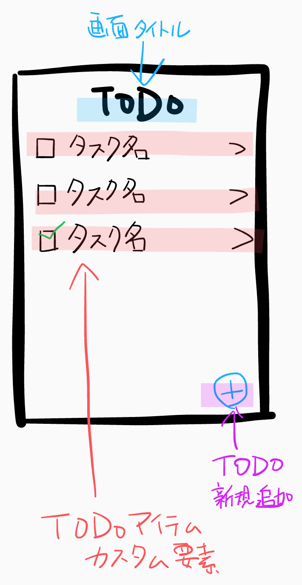

</figure>

<figure>

<figcaption><a id="f11-2">図 11-2. TODO編集画面デザイン</a></figcaption>

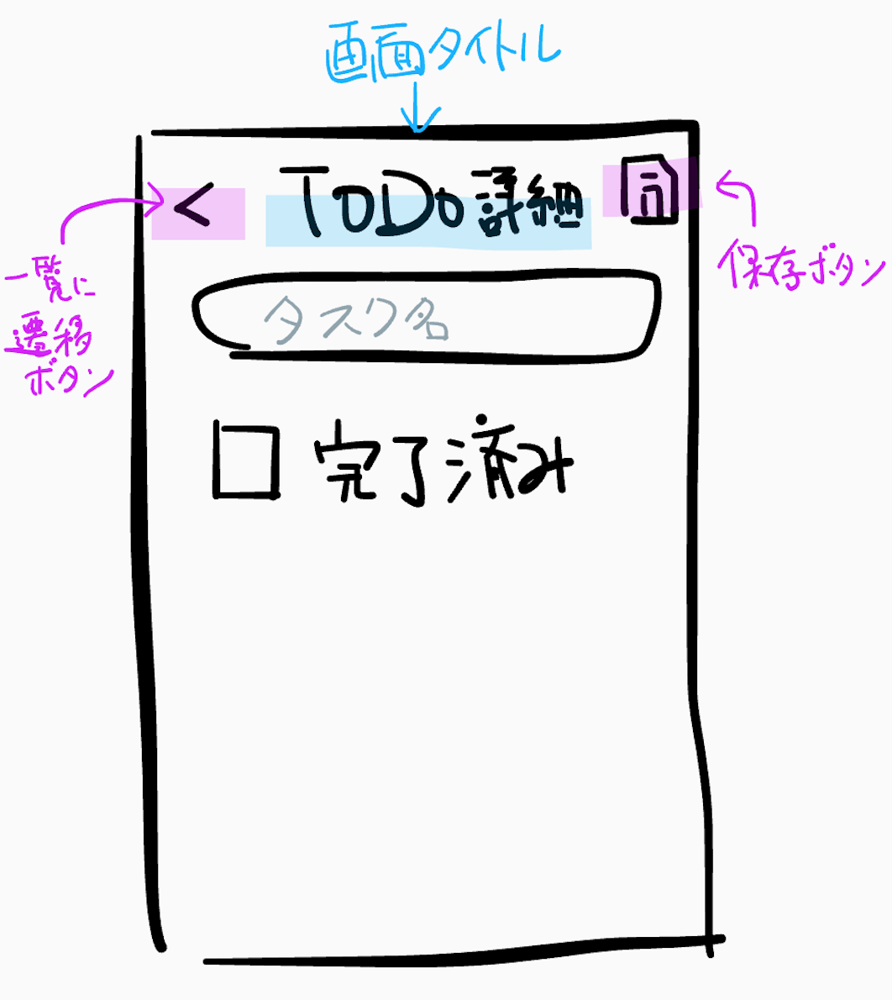

</figure>

また、[図 11-1.](#f11-1)のTODOアイテムカスタム要素は以下のようなデザインとします。

<figure>

<figcaption><a id="f11-3">図 11-3. TODOアイテムカスタム要素デザイン</a></figcaption>

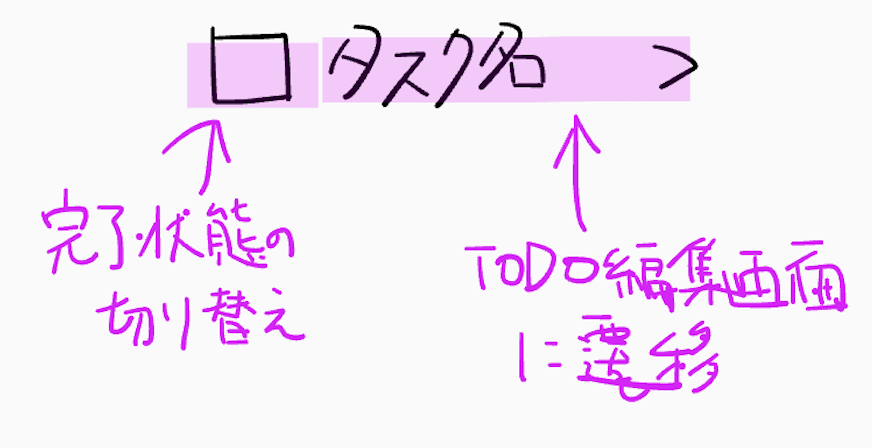

</figure>

### 11.1. ディレクトリ構成

開発の上で混乱を生みづらいリポジトリのディレクトリ構成について説明します。  
関数や変数もそうですが、プログラム中で利用するものの名前は「説明的」であると混乱を招きづらいです。  

今回は以下の構成で開発を行っていきます。  
VSCodeのエクスプローラーから新しいフォルダーの作成と新しいファイルの作成を使用して同じ構成を作成してください。  
これ以外のファイルは別のディレクトリにまとめるか削除してください。

<figure>

<figcaption><a id="c111-1">コード c111-1. ディレクトリ構成</a></figcaption>

```txt
.
├── src/
│   ├── pages/
│   ├── components/
│   └── shared/
├── index.html
├── style.css
└── main.mjs
```

</figure>

`pages`は各ページとして利用するカスタム要素を配置するディレクトリです。  
`components`はページ内のパーツとして利用するカスタム要素を配置するディレクトリです。  
`shared`は各JSファイル中での記述を共通化した内容を入りするディレクトリです。

※ `main.js`ではなく`main.mjs`に名前が変わっていることに注意してください。

**📝課題 11.1-1.** `.mjs`という拡張子は`.js`拡張子と変わらずファイルにJavaScriptが記述されていることを示します。他に同様の拡張子に`cjs`というものもありますが、三者三様に若干の差異があります。この差異を調べて記述しなさい。（2点）

### 11.2. ルーティング

ルーティングとは、特定のURLが開かれたときにそのURLによって処理を切り替えることです。  
今回のようなウェブアプリケーションの場合には、URLに合わせて表示するページを切り替える機能がルーティングです。

通常静的ウェブサイトではURLのパスがそのままホスティングするディレクトリ以下のファイルパスになっていることが多いですが、それだとHTMLファイルをページ分用意することになり、面倒です。  
かわりに、このルーティングの仕組みを自作すればHTMLファイルは一つで、JavaScriptによる処理でページを分岐させることができます。  
他にも、`<head>`要素内のメタデータの設定漏れを防げたり、いいこともあるので今回はこの方法でページを用意します。

具体的には、URLの末尾につく「hash」と呼ばれる値を利用してルーティングを実装します。  
このhashはフラグメント識別子と呼ばれることもあり、ページ内で特定の要素にフォーカスした状態のリンクを作成する用途でよく使われます。

まずは`index.html`に[5.3. 基本的なhtml文書の構成](#53-基本的なhtml文書の構成)を参考にしながら、最低限必要なHTMLを書きましょう。`main.mjs`、`style.css`の読み込みも追加してください。  
`<body>`要素の内容は`<app-root></app-root>`としてください。

<figure>

<figcaption><a id="c112-1">コード 11.2-1. index.html</a></figcaption>

```html
<!DOCTYPE html>
<html lang="ja">
  <head>
    <meta charset="UTF-8" />
    <meta name="viewport" content="width=device-width, initial-scale=1.0" />
    <title>TODO</title>
    <link rel="stylesheet" href="style.css" />
    <script type="module" src="main.mjs"></script>
  </head>
  <body>
    <app-root></app-root>
  </body>
</html>
```

</figure>

ルーティングは、URLと処理を紐づけるものです。今回の場合では、hashとページの対応を示すデータが必要です。  
このデータを`src/routes.mjs`というファイルで定義して、外部から呼び出せるように`export`という命令で設定します。  
`src/routes.mjs`を作成して、以下の[コード 11.2-2.](#c112-2)に示したコードを書いてください。

<figure>

<figcaption><a id="c112-2">コード 11.2-2. src/routes.mjs</a></figcaption>

```javascript
export const routes = {
  "#home": "<home-page></home-page>",
  "#edit": "<edit-page></edit-page>",
};
```

</figure>

次に、`main.mjs`にルーティング処理を書きます。  
URLのhashは変更されたときに`hashchange`というイベントを発生させるので、このイベントを監視してルーティング処理を実行するようにイベントリスナーを設定します。  
`routes.mjs`に書いたhashとページの対応は`import`という命令で読み込んでおき、処理中に呼び出せるようにします。

<figure>

<figcaption><a id="c112-3">コード 11.2-3. main.mjs</a></figcaption>

```javascript
import { routes } from "./src/routes.mjs";

async function onHashChange() {
  const url = new URL(window.location);
  const hash = url.hash;
  console.log(hash);
  if (!Object.keys(routes).includes(hash)) {
    console.warn("unknown route");
    url.hash = "#home";
    window.location.href = url.toString();
    return;
  }
  const page = routes[hash];

  const appRoot = document.querySelector("app-root");
  appRoot.innerHTML = page;
}

window.addEventListener("hashchange", onHashChange);
onHashChange();
```

</figure>

一番最後の行で一度`onHashChange()`関数を呼び出しているのは、アクセス時に一度実行してページ内容を変更する必要があるからです。

ここまでできたら一度保存し、`index.html`を開いて「Live Server」を起動してブラウザで確認しましょう。  
問題なく実装できていれば以下のような表示になるはずです。開発者ツールを開いて確認してください。

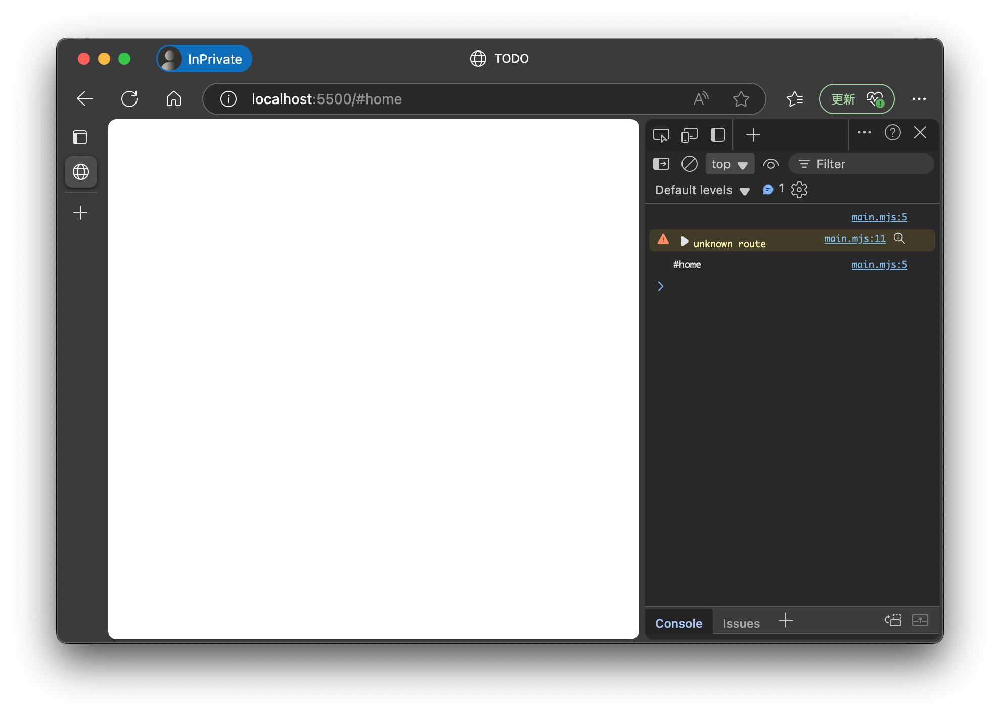

この時点では`<home-page>`コンポーネントは登録されていないので、なにもないページとコンソールタブへの出力が確認できれば問題ありません。

### 11.3. カスタム要素の登録を担うファイルを用意する

[10. ウェブコンポーネント](#10-ウェブコンポーネント)で説明した通り、カスタム要素は`customElement.define()`を利用して登録しなければ利用することができません。  
しかし、[コード 10.1-1.](#c101-1)のように記述して一つのファイル内でカスタム要素の登録まで行ってしまうと、すべてのカスタム要素宣言ファイルを`import`命令か`index.html`から読み込むかで実行する必要が発生してしまいます。

そこで、今回は各カスタム要素クラスの宣言を行うファイルと、カスタム要素の登録を行うファイルを分離します。  
各カスタム要素クラスの宣言時には、クラス宣言時に`export`宣言を行うことで他のファイルから読み込めるようにしておきます。
`src/register.mjs`を作成して、これを`import`宣言で読み込み、`customElements.define()`で登録することにします。

<figure>

<figcaption><a id="c113-1">コード 11.3-1. register.mjs</a></figcaption>

```javascript
// パーツ用カスタム要素の読み込み
// import { <パーツ用カスタム要素クラス名> } from "./components/<ファイル名>.components.mjs";

// ページ用カスタム要素の読み込み
// import { <ページ用カスタム要素クラス名> } from "./pages/<ファイル名>.page.mjs";

// パーツ用カスタム要素の登録
// customElements.define(<パーツ用カスタム要素名>, <パーツ用カスタム要素クラス名>);

// ページ用カスタム要素の登録
// customElements.define(<ページ用カスタム要素名>,  <ページ用カスタム要素クラス名>);
```

</figure>

今後カスタム要素を作成してアプリケーションを作成していくのですが、カスタム要素クラスを作成したら忘れずにカスタム要素の登録も行うように気をつけてください。

### 11.4. CSS（実践）

#### 11.4.1. 全体のCSS

[6.1. ボックスモデル](#61-ボックスモデル)で説明した通り、HTML要素はすべて四角形の領域を持ちます。  
これと、SPA向けの基本的なスタイルを以下の[コード 11.4.1-1.](#c1141-1)に示します。  
この内容を`style.css`に貼り付けてください。

<figure>

<figcaption><a id="c1141-1">コード 11.4.1-1. style.css</a></figcaption>

```css
* {
  /* すべての要素に対して、ボックスモデルを border-box に変更する */
  box-sizing: border-box; 
  /* 要素にデフォルトのマージンやパディングが設定されているのでリセットする */
  margin: 0;
  padding: 0;
}

html,
body,
app-root {
  /* SPAの画面が画面全体に広がるように設定 */
  width: 100dvw;
  height: 100dvh;
}
```

</figure>

#### 11.4.2. カスタム要素のCSS

今回の実験で作成するカスタム要素は、[10.2. ShadowDOM](#102-shadowdom)で説明したShadowDOMを利用して作成しています。  
そのため、各カスタム要素には[10.4.1. 全体のCSS](#1141-全体のcss)で記入した`style.css`の内容が適用されません。

そこで、全称セレクタで指定している内容をJavaScriptの定数として宣言し、各カスタム要素の定義でこれを適用することにします。

`src/shared/style.mjs`を作成し、以下の[コード 11.4.2-1.](#c1142-1)を貼り付けてください。

<figure>

<figcaption><a id="c1142-1">コード 11.4.2-1. style.mjs</a></figcaption>

```javascript
export const BASIC_STYLE = /* CSS */ `
  * {
    box-sizing: border-box;
    margin: 0;
    padding: 0;
  }
`;
```

</figure>

#### 11.4.3. :host 疑似クラス

ShadowDOMの中でのみ、`:host`という擬似クラス表記が利用できます。  
これは、ShadowDOMのルート要素にスタイルを適用できる疑似クラスになっています。

### 11.5. TODOアイテム編集画面の実装

TODOアイテムの編集画面では、TODOの新規作成と編集を行えるようにします。  
TODOのアイテムにはタスク名と完了状態を設定できるようにします。

#### 11.5.1. ベースになるカスタム要素の作成と登録の確認

まず、`src/pages/edit.page.mjs`を作成して、以下の[コード 11.5.1-1.](#c1151-1)の内容を貼り付けてください。

<figure>

<figcaption><a id="c1151-1">コード 11.5.1-1. edit.page.mjs （カスタム要素登録確認用）</a></figcaption>

```javascript
import { BASIC_STYLE } from "../shared/style.mjs";

export class EditPage extends HTMLElement {
  // CSS生成関数
  css = () => /* CSS */ `
    ${BASIC_STYLE}
  `;

  // HTML生成関数
  html = () => /* HTML */ `
    <style>
      ${this.css()}
    </style>
    <p>EditPage Works!</p>
  `;

  constructor() {
    super();
    this.attachShadow({ mode: "open" });
  }

  connectedCallback() {
    this.render();
  }

  render() {
    this.shadowRoot.setHTMLUnsafe(this.html());
  }
}
```

</figure>

このクラスを`src/register.mjs`でカスタム要素として登録します。

```javascript
// パーツ用カスタム要素の読み込み
// import { <パーツ用カスタム要素クラス名> } from "./components/<ファイル名>.components.mjs";

// ページ用カスタム要素の読み込み
// import { <ページ用カスタム要素クラス名> } from "./pages/<ファイル名>.page.mjs";
import { EditPage } from "./pages/edit.page.mjs";

// パーツ用カスタム要素の登録
// customElements.define(<パーツ用カスタム要素名>, <パーツ用カスタム要素クラス名>);

// ページ用カスタム要素の登録
// customElements.define(<ページ用カスタム要素名>,  <ページ用カスタム要素クラス名>);
customElements.define("edit-page", EditPage);
```

ルーティングは[11.2. ルーティング](#112-ルーティング)で登録済みなので、この状態でブラウザで確認しましょう。  
Live Server拡張機能のサーバーを起動して、ブラウザで`http://localhost:5500/#edit`を開いてください。  
以下の[図 11.5.1-1.](#f1151-1)のような表示になっていれば大丈夫です。

<figure>

<figcaption><a id="f1151-1">図 11.5.1-1. 編集ページのカスタム要素が登録できている状態</a></figcaption>

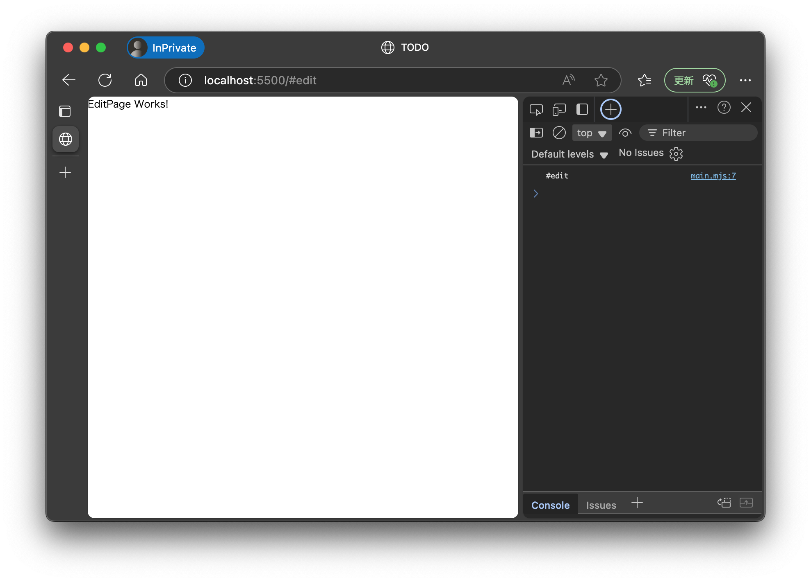

</figure>

#### 11.5.2. 編集画面の実装

では[図 11-2.](#f11-2)に示したデザインで編集画面を実装します。

このデザインでは、ヘッダー部分とその下のフォーム部分が縦に並んでいます。  
ヘッダー部分は横並びの配置で、フォーム部分は縦並びの配置です。  
今回は、ページ全体のレイアウトをフレックスボックスを利用して作成します。

以下の[コード 11.5.2-1.](#c1152-1)で`edit.page.mjs`の内容を更新してください。  
各記述の目的や動作はそれぞれ各部のコメントを参照してください。

<figure>

<figcaption><a id="c1152-1">コード 11.5.2-1. edit.page.mjs</a></figcaption>

```javascript
import { BASIC_STYLE } from "../shared/style.mjs";

export class EditPage extends HTMLElement {
  id = undefined;
  title = undefined;
  done = false;

  // CSS生成関数
  css = () => /* CSS */ `
    ${BASIC_STYLE}

    /* 全体を縦flexにして、端から16pxの余白を用意する */
    :host {
      width: 100%;
      height: 100%;
      padding: 16px !important;
      display: flex;
      flex-direction: column;
    }

    /*
     * ヘッダーは横100%で高さ40pxの横flex
     * ヘッダー下すぐに入力フォームが来ないようにマージンをつける
     */
    header {
      width: 100%;
      height: 40px;
      margin-bottom: 16px;
      display: flex;
      align-items: center;
    }

    /*
     * ヘッダー中のボタンは正方形の大きさを持つように
     * ボタンのデフォルトスタイルを打ち消しつつ、フォントサイズと行高さを調整する
     */
    header button {
      width: 32px;
      height: 32px;
      border: none;
      background-color: transparent;
      font-size: 32px;
      line-height: 1;
    }

    /* ヘッダーのタイトルは太字で大きな文字にする */
    header span {
      width: 100%;
      font-weight: bold;
      font-size: 24px;
      text-align: center;
    }

    /*
     * 入力フォームは縦flexで画面の残り領域全体に広がるように設定
     * 要素間に8pxの隙間を設ける
     */
    main {
      width: 100%;
      height: 100%;
      display: flex;
      flex-direction: column;
      gap: 8px;
    }

    /* 各行は横flexで縦中央揃え、ラベルとコンテンツの間に8px隙間を設ける */
    main label {
      display: flex;
      gap: 8px;
      align-items: center;
    }

    /* ラベルテキストが縮まないように */
    main label span {
      flex-shrink: 0;
    }

    /* タスク名の入力欄を角丸で囲んで丸に被らないように余白を設定 */
    main input[type="text"] {
      width: 100%;
      height: 32px;
      border: 2px solid lightgray;
      border-radius: 32px;
      padding: 0 16px;
    }
  `;

  // HTML生成関数
  html = () => /* HTML */ `
    <style>
      ${this.css()}
    </style>
    <header>
      <button class="back">⬅️</button>
      <span>ToDo詳細</span>
      <button class="save">💾</button>
    </header>
    <main>
      <label>
        <span>タスク名</span>
        <input type="text" placeholder="タスク名" value="${this.title ?? ""}" />
      </label>
      <label>
        <input type="checkbox" ${this.done ? "checked" : ""} />
        <span>完了済み</span>
      </label>
    </main>
  `;

  constructor() {
    super();
    this.attachShadow({ mode: "open" });
  }

  connectedCallback() {
    // URLクエリパラメータでIDが渡される
    const url = new URL(location.href);
    const paramId = url.searchParams.get("id");
    if (paramId) {
      // IDが渡されてきたら既存のタスクの修正なので、localstorageからデータを取得
      const data = JSON.parse(localStorage.getItem(paramId));
      this.id = paramId;
      this.title = data?.title;
      this.done = data?.done ?? false;
    } else {
      // IDが渡されなければ新規なのでIDを生成
      // crupto.randomUUIDは桁数の大きい乱数生成で、現実的な回数で衝突し得ないため衝突の確認の必要がない
      this.id = crypto.randomUUID();
    }
    this.render();
  }

  render() {
    this.shadowRoot.setHTMLUnsafe(this.html());

    // ToDo一覧に遷移するボタンのイベントリスナーを設定
    this.shadowRoot
      .querySelector("button.back")
      .addEventListener("click", () => this.onClickBack());
    // ToDoを保存するボタンのイベントリスナーを設定
    this.shadowRoot
      .querySelector("button.save")
      .addEventListener("click", () => this.onClickSave());
  }

  // ToDo一覧画面に遷移する関数
  backToHome() {
    const url = new URL(location.href);
    url.hash = "#home";
    location.href = url.toString();
  }

  // ToDo一覧に遷移するボタンのイベントハンドラ
  onClickBack() {
    this.backToHome();
  }

  // ToDoを保存するボタンのイベントハンドラ
  onClickSave() {
    // input要素から入力内容を取得する
    const editedTitle = this.shadowRoot.querySelector('input[type="text"]')?.value;
    // タスク名が未設定なら登録せずに処理を終了する
    if (!editedTitle) {
      alert("タスク名が入力されていません");
      return;
    }
    // タスク名が設定されていれば登録して一覧画面に遷移
    localStorage.setItem(this.id, JSON.stringify({ title: editedTitle, done: this.done }));
    this.backToHome();
  }
}
```

</figure>

このコードが実装できれば、以下の図に示すような動作が確認できるはずです。
ブラウザで開発者ツールを開き、アプリケーションタブでLocal storageの内容を表示しながら確認すると、データが保存されているのを確認しやすいです。

<figure>

<figcaption><a id="f1152-1">図 11.5.2-1. 編集画面のブラウザでの動作確認</a></figcaption>

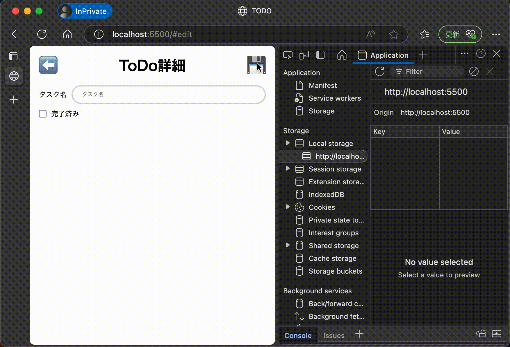

</figure>

### 11.6. TODOアイテム一覧画面の実装

<!-- TODO -->

## 12. まとめ

この実験では、まずHTML、CSS、JavaScriptの3つの言語について学習しました。
その後、「ウェブコンポーネント」とまとめて呼ばれる一連の技術を学習し、これを利用したSPAの開発の体験を目的にTODOアプリを作成しました。

今回はブラウザの標準APIのみを利用して開発を行いましたが、実開発ではより開発効率の高いフレームワークを利用してアプリケーションを開発することが多いです。  
しかし、それらのフレームワークも大元は標準機能であるウェブコンポーネントやDOM操作を使用して実装されています。このため、今回の実験で学習した内容はフレームワークの動作原理を理解するうえで少なからず役に立つものとなったでしょう。

この経験を活かして、受講いただいた皆様がWebアプリケーション開発に少しでも興味を持っていただければ幸いです。

**📝課題 12-1.** [11. ウェブコンポーネントを利用したSPAの開発]で作成したウェブアプリケーションを、[GitHub Pages](https://docs.github.com/ja/pages/getting-started-with-github-pages/what-is-github-pages)等を利用して公開しなさい。公開したウェブアプリケーションにアクセス可能なURLをレポートに添付しなさい。もし独自にカスタマイズした点があれば、合わせて説明を記述しなさい。（5点 + カスタマイズの個数1つにつき1点加点）
