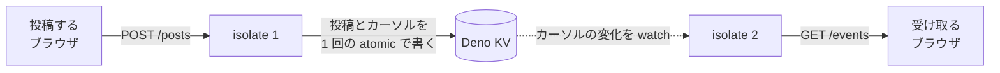

# 掲示板 API (共有サーバー)

2026年9月 オンライン開発ゼミ
経験者コース「押さなくても届く掲示板を作ってみよう！」で、受講者全員が最初につなぐサーバーです。
保存・CORS・投稿量の上限に加えて、投稿を接続中のブラウザへ流す部分を引き受けます。

初心者コースの [2026/board/backend](../../board/backend/) を出発点にしたコピーで、そちらには依存していません。
デプロイ先の Deno Deploy アカウントがコースごとに分かれているため、共有しても 2 つ運用することに変わりがありません。



## エンドポイント

`/connections` 以外は `room` クエリパラメータが必要です。
`room` は開催回ごとに投稿を分ける単位で、英数字とハイフン 32 文字までです。

### `GET /posts?room=sample`

投稿の一覧を古い順に返します。
1 件もなければ空の配列です。

```json
[
  {
    "id": "1757480580000-a1b2c3d4",
    "name": "ゲスト",
    "text": "こんにちは",
    "createdAt": "2026-09-10T05:23:00.000Z"
  }
]
```

### `POST /posts?room=sample`

```json
{ "name": "ゲスト", "text": "こんにちは" }
```

`Content-Type: application/json` で送ります。
成功すると `201` と、作られた投稿 1 件を返します。

### `GET /events?room=sample`

`text/event-stream` を返し、接続したまま新しい投稿を 1 件ずつ流します。

```js
const source = new EventSource(`${API}/events?room=${ROOM}`);
source.onmessage = (e) => {
  const post = JSON.parse(e.data); // GET /posts の 1 要素と同じ形
};
```

イベント名は既定の `message` です。
`data:` に載るのは投稿 1 件そのもので、型名などでは包みません。

つないだ直後は何も流れません。
その時点までの投稿は `GET /posts` で取ります。
つないだ後に入った投稿は落ちません。

接続を保つために `: ping` を 15 秒ごとに流します。
コメント行なのでイベントとしては配送されず、`onmessage` は呼ばれません。

### `GET /connections?room=sample`

講師用のページです。
接続数と接続 id の一覧を出し、5 秒ごとに読み込み直します。
`room` を省くと入力欄が出ます。
認証はありません。

## フィールド

| フィールド  | 型     | 説明                                             |
| ----------- | ------ | ------------------------------------------------ |
| `id`        | string | `<ミリ秒>-<ランダム8桁>`。辞書順が時系列順になる |
| `name`      | string | 投稿者名。20 文字まで                            |
| `text`      | string | 本文。200 文字まで                               |
| `createdAt` | string | 投稿時刻。ISO 8601                               |

## 制限

| 対象               | 上限     | 超えたとき         |
| ------------------ | -------- | ------------------ |
| `name`             | 20 文字  | 切り詰める         |
| `text`             | 200 文字 | 切り詰める         |
| 部屋あたりの投稿数 | 500 件   | 古いものから捨てる |

文字数はコードポイント単位です（絵文字は 1 文字）。
`name` と `text` は前後の空白を取り除いたうえで、空文字なら `400` を返します。
レート制限はありません。

## エラー

```json
{ "message": "room を指定してください" }
```

| ステータス | 状況                                                                                  |
| ---------- | ------------------------------------------------------------------------------------- |
| `400`      | `room` がない / 形式が不正、`name` か `text` が空 / 文字列でない、JSON として読めない |
| `404`      | 存在しないパス                                                                        |
| `405`      | パスが受け付けないメソッド                                                            |

## CORS

すべてのレスポンスに `Access-Control-Allow-Origin: *` を付け、`OPTIONS`
のプリフライトに `204` を返します。
受講者が使う StackBlitz の URL がプロジェクトごとに変わるため、オリジンを固定できません。

例外が出たときも `500` に CORS ヘッダーを付けて返します。
付けずに素通しすると、受講者のブラウザには「CORS でブロックされた」としか出ず、ステータスもメッセージも読めません。

## isolate をまたいで配信する仕組み

Deno Deploy は isolate を複数立てます。
SSE の接続を持つ isolate と `POST /posts` を受けた isolate は別になりうるので、接続をメモリ上の配列に持つだけでは届きません。
配信は KV を経由させています。

見張るのは投稿そのものではなく、その部屋で最後に保存した投稿の `id` を入れた `["last_post_id", room]` です。
`kv.watch` が流すのは最新の状態であって途中の変化ではないため、投稿そのものを入れると、同時に入った 2 件のうち片方が流れません。

このキーから使うのは、値が変わったという事実だけです。
変化を引き金に部屋の投稿を `kv.list` で読み直し、まだ流していないものを流します。
飛ばされた中間状態はこの読み直しで回収されます。

どこまで流したかは、接続ごとに「流した `id` の集合」で持ちます。
`id` の大小では持ちません。
`id` の時刻部分は commit より前に決まるため `id` の順と commit の順は一致せず、「最後に流した `id` より後ろ」で範囲を切ると、その手前に割り込んで commit された投稿が永久に流れなくなります。

投稿本体とカーソルは 1 回の atomic 操作で書きます。
分けて書くと、その間に、流れない投稿か、存在しない投稿を指すカーソルが残ります。

## 接続数の数え方

`GET /events` の接続ごとに、サーバーが振った接続 id で `["conn", room, 接続id]` を
`expireIn` 30 秒で書き、`kv.list` の件数を数えています。
TTL は `: ping` を流すのと同じ 15 秒間隔で延ばし、切断時に消します。
isolate が落ちて後始末が飛んだぶんは期限切れで消えます。

`GET /events` を受けた isolate は、その接続を自分で持っています。
持っていないのは他の isolate のぶんだけなので、接続ごとに KV へ書けば数えられます。

クライアントにハートビートを打たせる形は採っていません。
Chapter 5 で受講者は自作サーバー側で `connections` 配列と `close` イベントから接続数を数えます。
共有サーバーもクライアント発の合図で数えると、「サーバーは接続を数えられない」という
Chapter 2 の前提が受講者自身の実装で反証されてしまいます。

受講者が Chapter 4 以降で書く自作サーバーは、メモリ上の配列の長さをそのまま出すので実接続数になります。

## 開発

```sh
deno task dev     # http://localhost:8000 で起動
deno task test    # テスト（KV はメモリ上に作られる）
deno task check   # fmt / lint / 型チェック
```

`KV_PATH` を指定するとその場所の KV を使います。
指定しなければ既定の場所（Deno Deploy 上では割り当てられた KV）です。
`PORT` で待ち受けるポートを変えられます。
