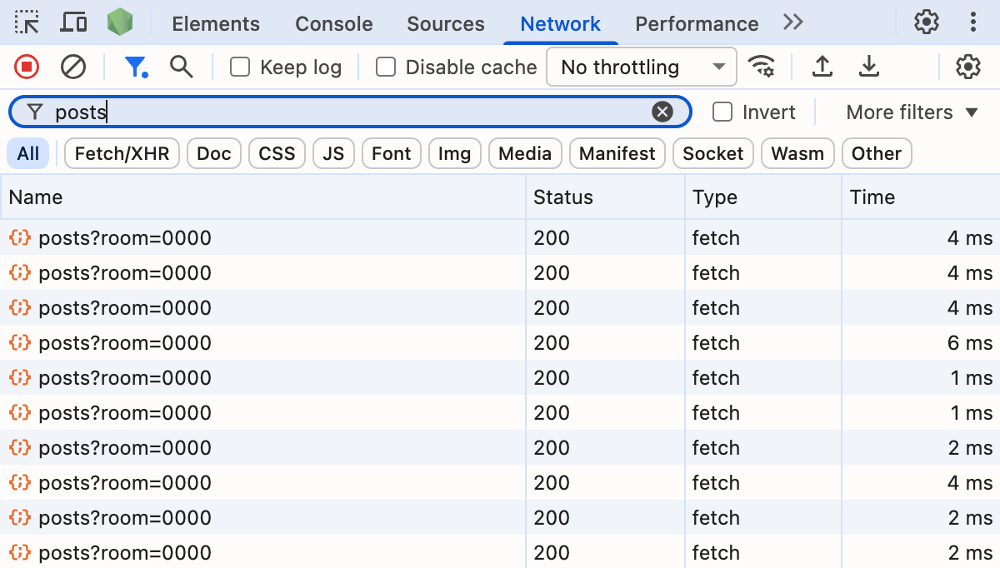
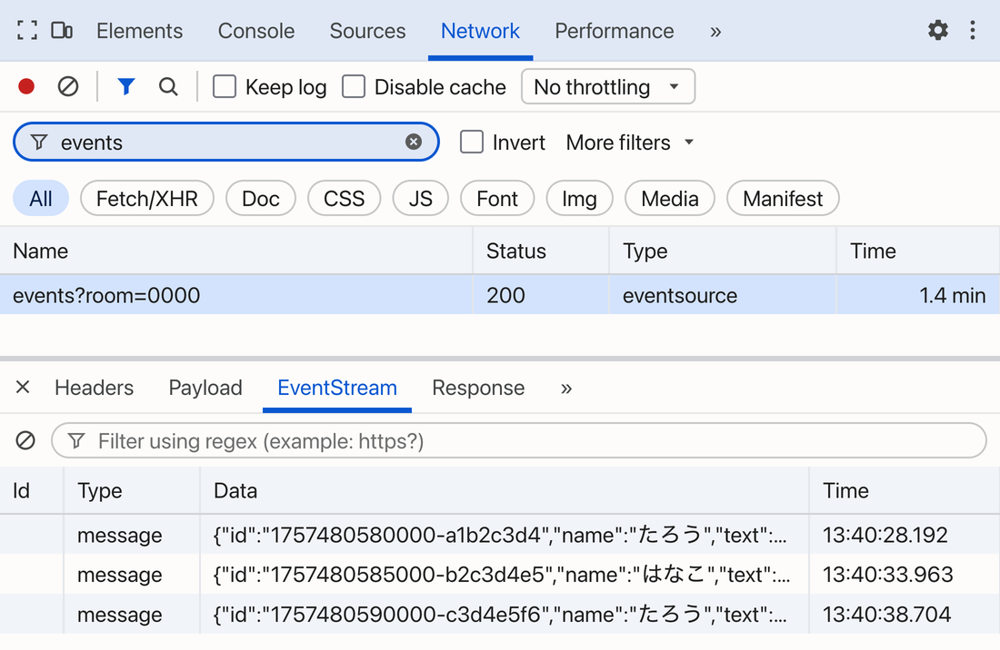
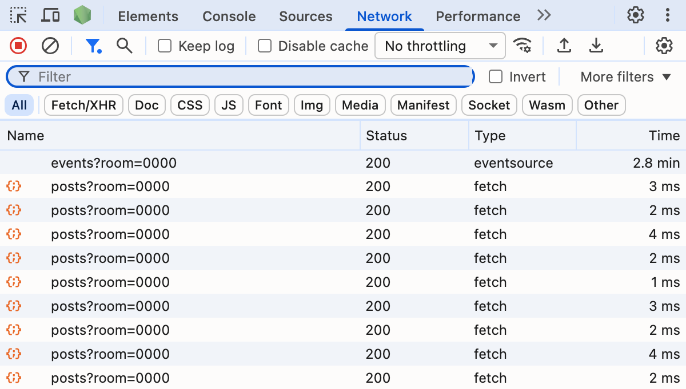
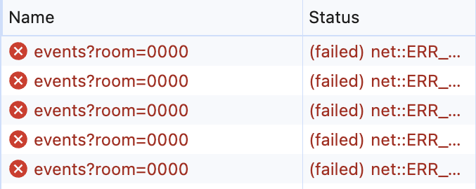

<!-- _class: lead -->

# リアルタイムに届く掲示板を **SSE** で作ろう

## SSE: Server-Sent Events

---

## 今日のゴール

ブラウザとサーバーをつないだままにして、サーバー側から新しい情報を送り続ける仕組み ( **SSE** ) について学びます。
掲示板を題材に、ブラウザ側・サーバー側両方の作り方を体験します。

- ブラウザ側: サーバーにつなぎっぱなしにして、受け取ったデータを表示する
- サーバー側: サーバーからリアルタイムに、接続している全員にデータを送信する

---

## 今日の進め方

| 章 | やること |
|---|---|
| 1 | 一定間隔で自動更新する (ポーリング) |
| 2 | サーバーからの通知に切り替える (SSE) |
| 3 | 全件取得から差分更新に |
| 4 | SSE のサーバー側を書く |
| 5 | 同時に複数接続できるようにする |

1〜3 章はブラウザ側の JavaScript を、4〜5 章はバックエンドサーバー側の JavaScript を実装します。

---

## 準備

1. ブラウザで StackBlitz のテンプレートを開く
   https://stackblitz.com/edit/node-cdfr3jqk?file=public%2Fscript.js,server.js
2. 左上の **Fork** を押す
3. `public/script.js` を開き、`API` と `ROOM` の値を書き換える

---

## プロジェクトの中身

```
public/
  index.html
  styles.css
  script.js    ← 1〜3章で書く
package.json
server.js      ← 4〜5章で書く
```

`public/script.js` はブラウザ側の JavaScript、`server.js` はバックエンドサーバー側の JavaScript ファイルです。

ファイルを保存すると、サーバーは自動で再起動します。

---

<!-- _class: record -->

## スライドの見かた

手を動かしてもらうスライドには、右上に 記述 のバッジが出ます。

書くコードはそのまま載っています。黄色いところだけを書きます。
赤く取り消されている行は、消します。

```javascript
// 例
const posts = [];
@@let connection = null;@@           // 黄色: 書いてもらう行
%%setInterval(showPosts, 10000);%%   // 赤: 消してもらう行
```

---

## 配布コードの現状の実装

画面をリロードする、または更新ボタンを押すと `showPosts()` が呼び出されてメッセージが表示されます。
また、投稿ボタンを押すと `addPost()` が呼び出されて、テキストボックスに入れた内容でメッセージが投稿されます。

| 名前 | やっていること |
|---|---|
| `showPosts` | サーバーから投稿を全部もらって、一覧に並べ直す |
| `addPost` | 入力欄の中身をサーバーに送って、`showPosts` を呼ぶ |
| いちばん下の3行 | ボタンに関数を登録し、開いた瞬間に1回読み込む |

---

<!-- _class: lead -->

# 1章

## 一定間隔で自動更新する (ポーリング)

この章で編集するファイル: `public/script.js`

一定間隔でメッセージを受信できるようにします。SSE の前に、一定時間ごとに自動で読み直す処理を実装します。

---

## 1-1. 繰り返し同じ関数を実行する

現在の実装では、他の人が投稿した新しいメッセージは、更新ボタンを押すまで画面に反映されません。
そこで、自動でメッセージを決まった間隔で読み込むように実装します。

一定間隔で同じ関数を繰り返し呼び出したいときは `setInterval()` を使用します。

```javascript
// 例: 10000 ミリ秒ごとに `showPosts()` 関数を実行する
setInterval(showPosts, 10000);
```

---

<!-- _class: record -->

## 1-1. 投稿一覧を自動で読み直す

<div class="timer" data-seconds="60"></div>

10 秒ごとに `showPosts()` を実行して、投稿一覧を読み直します。

**書く場所**: `public/script.js` のいちばん下

```javascript
showPosts();                         // すでにある行
@@setInterval(showPosts, 10000);@@
```

**成功**: 何も押さずに最大10秒待つと、他の人の投稿が出てくる

---

## 1-2. 実際のサーバーとの通信を見る



開発者ツールの Network タブで、サーバーとの通信内容を見ることができます。

1. 右クリック → 「検証」を選択して開発者ツールを開き、**Network** タブを選ぶ
2. 上の `Filter` 欄に `posts` と入れる
3. そのまま再読み込みして、10秒待つ

**成功**: `posts` の行が、新しい投稿があってもなくても10秒ごとに1本ずつ増えていきます。

---

## 1-3. ポーリングで困ること

この「決まった間隔でサーバーと通信する」やり方を **ポーリング** といいます。

<div class="tl">
  <div class="tl-above"><span class="tl-post" style="left:45%">投稿された</span></div>
  <div class="tl-axis"><span class="tl-time">時間 →</span><span class="tl-dot" style="left:12%"></span><span class="tl-dot" style="left:37%"></span><span class="tl-dot" style="left:62%"></span><span class="tl-dot" style="left:87%"></span></div>
  <div class="tl-below"><span class="tl-lbl" style="left:12%">新着なし</span><span class="tl-lbl" style="left:37%">新着なし</span><span class="tl-lbl hit" style="left:62%">ここで届く</span><span class="tl-lbl" style="left:87%">新着なし</span></div>
  <div class="tl-gaprow"><span class="tl-gap" style="left:45%;width:17%"><span>遅れ 最大10秒</span></span></div>
</div>

- 間隔を短くすると、新着なしの通信がそのぶん増える
- 間隔を長くすると、届くのが遅くなる。10秒なら最悪10秒遅れる

間隔をどう決めても、どちらか片方は必ず悪くなります。
次の章では、このデメリットを克服する方法を実装します。

---

<!-- _class: lead -->

# 2章

## サーバーからの通知に切り替える ( **SSE** )

この章で編集するファイル: `public/script.js`

ブラウザから都度リクエストするのをやめて、いつ送るかをサーバーが決めるようにします。

---

## 2-1. サーバーはリクエストへの応答しかできない

<div class="columns">
<div>

<div class="seq">
  <div class="seq-title">ふつうの通信</div>
  <div class="seq-head"><span>ブラウザ</span><span>サーバー</span></div>
  <div class="seq-body">
    <div class="seq-group">
      <div class="seq-row right"><div class="seq-msg">GET /posts</div></div>
      <div class="seq-row left"><div class="seq-msg">投稿一覧</div></div>
    </div>
  </div>
</div>

</div>
<div>

<div class="seq">
  <div class="seq-title">サーバーからの新規通信</div>
  <div class="seq-head"><span>ブラウザ</span><span>サーバー</span></div>
  <div class="seq-body">
    <div class="seq-group">
      <div class="seq-row left blocked"><div class="seq-msg">投稿を知らせたい</div></div>
    </div>
  </div>
</div>

</div>
</div>

サーバーは、受け取ったリクエストにレスポンス (サーバーが返す応答) を返すことしかできません。そのため、サーバーのほうからブラウザに向けて新しく通信を始めることはできません。

また、レスポンスを返し終える (閉じる) とあとからデータを追加で返すことはできません。

---

## 2-1. サーバーが、閉じないレスポンスに投稿を書き足す

<div class="seq">
  <div class="seq-title">閉じないレスポンス</div>
  <div class="seq-head"><span>ブラウザ</span><span>サーバー</span></div>
  <div class="seq-body">
    <div class="seq-group">
      <div class="seq-row right"><div class="seq-msg">GET /events（最初の1回）</div></div>
      <div class="seq-row left"><div class="seq-msg">たろうの投稿</div></div>
      <div class="seq-row left"><div class="seq-msg">はなこの投稿</div></div>
    </div>
    <div class="seq-repeat">投稿されるたびに書き足す</div>
  </div>
</div>

ブラウザからのリクエストは最初の1回だけにします。
サーバーはそのレスポンスを閉じず、投稿があるたびに続きを書き足します。

**SSE** (Server-Sent Events) とは、こうしてサーバーからブラウザへデータを流し続けるしくみのことです。

---

## 2-1. 閉じるレスポンスと閉じないレスポンスを比べる

<div class="columns">
<div>

<div class="seq">
  <div class="seq-title">ポーリング</div>
  <div class="seq-head"><span>ブラウザ</span><span>サーバー</span></div>
  <div class="seq-body">
    <div class="seq-group">
      <div class="seq-row right"><div class="seq-msg">GET /posts</div></div>
      <div class="seq-row left"><div class="seq-msg">投稿一覧</div></div>
    </div>
    <div class="seq-group">
      <div class="seq-row right"><div class="seq-msg">GET /posts</div></div>
      <div class="seq-row left"><div class="seq-msg">投稿一覧</div></div>
    </div>
    <div class="seq-repeat">10秒ごとに繰り返す</div>
  </div>
</div>

</div>
<div>

<div class="seq">
  <div class="seq-title">SSE</div>
  <div class="seq-head"><span>ブラウザ</span><span>サーバー</span></div>
  <div class="seq-body">
    <div class="seq-group">
      <div class="seq-row right"><div class="seq-msg">GET /events（最初の1回）</div></div>
      <div class="seq-row left"><div class="seq-msg">data: たろうの投稿</div></div>
      <div class="seq-row left"><div class="seq-msg">data: はなこの投稿</div></div>
      <div class="seq-row left"><div class="seq-msg">data: じろうの投稿</div></div>
    </div>
    <div class="seq-tail"></div>
    <div class="seq-repeat">投稿されるたびに届く</div>
  </div>
</div>

</div>
</div>

---

## 2-1. EventSource でつないでメッセージを受け取る

SSE でデータを受け取るには、`new EventSource(URL)` でサーバーに接続します。
`onmessage` に関数を渡すと、データが1件届くたびにその関数が呼ばれます。

```javascript
const source = new EventSource(`${API}/events?room=${ROOM}`);  // 接続する

source.onmessage = (e) => {          // データが1件届くたびに呼ばれる
  console.log(e.data);               // 届いたデータの中身 (文字列)
};
```

---

<!-- _class: record -->

## 2-1. ポーリングをやめて EventSource でつなぐ

<div class="timer" data-seconds="300"></div>

一定間隔の自動更新をやめて、サーバーからの通知に切り替えます。

**書く場所**: `public/script.js` のいちばん下

赤い行を消して、黄色い行を追加します。

```javascript
showPosts();                         // すでにある行
%%setInterval(showPosts, 10000);%%
@@const source = new EventSource(`${API}/events?room=${ROOM}`);@@
@@source.onmessage = () => showPosts();@@
```

**成功**: メッセージが投稿された瞬間に表示される

---

## 2-2. 閉じないレスポンスが1本続いているのを見る



開発者ツールの Network タブで、SSE の通信を見ることができます。

1. `Filter` 欄を `events` に変えて、再読み込みする
2. 出てきた `events` の行を選び、**EventStream** タブを開く
3. 誰かの投稿が届くのを待つ

**成功**: `events` の行は1本のまま Time が伸び続け、投稿が届くたびに EventStream タブの行が1つ増えます。

---

## 2章の動作チェック

### 3つとも当てはまれば 2章は完了

1. `posts` の行が、10秒ごとに増えるのをやめている
2. `events` の行は1本だけで、Status は 200 のまま Time が伸び続ける
3. 投稿が届くたびに EventStream タブの行が1つ増える

### 投稿しても `events` の行は増えない

EventStream タブの中の行が増えます。通信そのものは、1本を使い回しています。

---

<!-- _class: lead break -->

# 休憩

<div class="timer" data-seconds="600"></div>

---

<!-- _class: lead -->

# 3章

## 全件取得から差分更新に

この章で編集するファイル: `public/script.js`

いまは投稿が届くたびに全件を取り直しています。
届いた新しいメッセージだけを画面に足すようにして、サーバーとやり取りする量を減らします。

---

## 3-1. 投稿のたびに全件を取り直しているのを見る



`Filter` 欄を空にして、投稿が届くのを待ちます。

**成功**: `events` は1本のままで、その下に `posts` の GET が投稿のたびに1本ずつ増えます。

投稿が増えるほど通信も増えます。10秒ごとより多くなることもあります。

---

<!-- _class: record compact -->

## 3-2. 投稿を取ってくる `loadPosts` を作る

<div class="timer" data-seconds="180"></div>

**書く場所 1**: `showPosts` の上

```javascript
@@const posts = [];                   // 手元の投稿。画面に出ているものと同じ並び@@

@@async function loadPosts() {        // 取ってきて posts に入れる。開いたときに1回だけ呼ぶ@@
@@  const res = await fetch(`${API}/posts?room=${ROOM}`);@@
@@  const loaded = await res.json();  // サーバーにある投稿の全件@@
@@  for (const post of loaded) {      // 1件ずつ手元に入れる@@
@@    posts.push(post);@@
@@  }@@
@@  showPosts();@@
@@}@@
```

**書く場所 2**: いちばん下の `showPosts();` の行。赤い行を消して、黄色い行を書きます

```javascript
%%showPosts();%%
@@loadPosts();@@
```

ここまでで、画面はいままでどおり動きます。

---

<!-- _class: record -->

## 3-2. `showPosts` から `fetch` を消す

<div class="timer" data-seconds="120"></div>

`showPosts` に残っている `fetch` を消すと、`showPosts` は手元の `posts` を並べるだけの関数になります。

**書く場所**: `showPosts` の先頭

```javascript
%%async %%function showPosts() {
%%  const res = await fetch(`${API}/posts?room=${ROOM}`);%%
%%  const posts = await res.json();%%

  const list = document.getElementById('posts');   // ここから下はそのまま
```

`await` がなくなるので `async` も外します。

`for` の行は書き換えません。関数の中から `posts` がなくなったので、手元の `posts` を見るようになります。

---

## 3-2. 届いた1件は `e.data` に文字列で入っている

`onmessage` が受け取る `e` の `data` に、投稿1件がそのまま載っています。

```javascript
'{"id":"1757480580000-a1b2c3d4","name":"たろう","text":"やっほー","createdAt":"..."}'
```

`JSON.parse` に通すと、`showPosts` が並べているのと同じ形のオブジェクトになります。

---

<!-- _class: record compact -->

## 3-2. 届いた1件を手元に足す

<div class="timer" data-seconds="120"></div>

手元の `posts` に足してから `showPosts` を呼べば、その1件が一覧に出ます。

**書く場所**: `source.onmessage` の行を置き換え

```javascript
@@source.onmessage = (e) => {@@
@@  posts.push(JSON.parse(e.data));   // 届いた文字列をオブジェクトに戻して足す@@
@@  showPosts();@@
@@};@@
```

**成功**: 投稿しても `posts` の GET が増えず、一覧にはその投稿が出る

---

<!-- _class: record compact -->

## 3-2. サーバーに取りにいくのは最初の1回だけ

<div class="timer" data-seconds="120"></div>

`fetch` は `loadPosts` に1つだけ残りました。自分の投稿もサーバーから SSE で届いて戻ってくるので、`addPost` から呼び直す必要はありません。`showPosts` はもう取りにいかない関数なので、更新ボタンを押しても並べ直すだけです。

**書く場所 1**: `addPost` の中、`text-input` を空にした行の下

```javascript
  document.getElementById('text-input').value = '';   // ここから下
%%  showPosts();%%
}
```

**書く場所 2**: `reload-btn` にイベントを登録している行

```javascript
%%document.getElementById('reload-btn').addEventListener('click', showPosts);%%
@@document.getElementById('reload-btn').remove();@@
```

**成功**: 投稿しても一覧が二重に増えず、更新ボタンが画面から消える

---

## 3章の動作チェック

### 4つとも当てはまれば 3章は完了

1. ページを開いたとき、`posts` の GET が1本だけある
2. そのあとは何件投稿されても、`posts` の GET が増えない
3. EventStream タブの行は、投稿のたびに増える
4. 一覧にも、届いた投稿が出る

### 3は増えるのに4が変わらないなら

届いてはいるので、受け取ったあとの処理でつまずいています。Console タブの赤い文字を見てください。

---

<!-- _class: lead break -->

# 休憩

<div class="timer" data-seconds="300"></div>

---

<!-- _class: lead -->

# 4章

## SSE のサーバー側を書く

この章で編集するファイル: `server.js` と `public/script.js`

投稿をブラウザに配信する処理を、自分のサーバーに書きます。

---

## 4-0. `server.js` の中身

`server.js` には、3つのことが書いてあります。

| 書いてあるもの | 役割 |
|---|---|
| `GET /posts` | 投稿を全部返す |
| `POST /posts` | 投稿を1件受け取って、`posts` に足す |
| それ以外 | `public/` の中のファイルを返す |

右側のプレビューに見えているページも、この3つめから届いています。
投稿は `posts` という配列に入っているだけなので、サーバーを再起動すると消えます。

---

<!-- _class: compact -->

## 4-1. SSE ではデータを1件ずつ区切って送る

```
data: {"name":"たろう","text":"やっほー"}
                                            ← 空行
```

| 書くもの | 意味 |
|---|---|
| `data: 中身` | イベント1件の中身 |
| 空行 | ここまでで1件、という区切り |

データを1件書いたら空行を1つ入れて区切ります。
つまり、`data:` の行末の改行と空行で、改行が `\n\n` と2つ並びます。
空行を忘れると、ブラウザはデータがまだ続くと見なして区切りを待ち続け、その投稿は表示されません。

---

<!-- _class: record compact -->

## 4-1. `GET /events` を足す

<div class="timer" data-seconds="360"></div>

**書く場所 1**: 投稿の置き場を作っている行の下

```javascript
const posts = [];                    // すでにある行

@@let connection = null;             // いまつながっている接続。あとから来たほうで上書きされる@@
```

**書く場所 2**: `▼ 4章: ここに GET /events を足す` の行の下

```javascript
@@  if (req.method === 'GET' && url.pathname === '/events') {@@
@@    res.writeHead(200, {@@
@@      'Content-Type': 'text/event-stream',@@
@@      'Cache-Control': 'no-cache',@@
@@      'Connection': 'keep-alive',@@
@@    });@@
@@    connection = res;@@
@@    return;@@
@@  }@@
```

ここでは `res.end()` を呼びません。閉じないまま `connection` に覚えておきます。

---

<!-- _class: record compact -->

## 4-2. 投稿が来たらその接続に書き込む

<div class="timer" data-seconds="240"></div>

保存したあと、保持しておいた接続に1件ぶん書き足します。

**書く場所**: `server.js` の `▼ 4章: つながっているブラウザに届ける` の行の下

```javascript
    if (posts.length > MAX_POSTS) posts.shift();        // すでにある行

@@    if (connection) {@@
@@      connection.write(`data: ${JSON.stringify(post)}\n\n`);@@
@@    }@@
```

`JSON.stringify` で投稿をJSON → 文字列に変換してから、先頭に` data: ` 、末尾に `\n\n` を挿入します。

誰もつないでいなければ `connection` は `null` のままなので、`if` で確かめてから書きます。

---

<!-- _class: record -->

## 4-3. つなぎ先を自分のサーバーに向ける

<div class="timer" data-seconds="120"></div>

共有サーバーの URL が入っている `API` を書き換えます。

**書く場所**: `public/script.js` の `API` の行

```javascript
@@const API = location.origin;@@
```

**`location.origin`** = いま開いているページを配っているサーバーの URL

プレビューのページは自分の `server.js` から届いているので、URL を書き写さずにこれで足ります。

---

## 4章の動作チェック

### タブを2枚開いて確かめる

1. プレビュー右上の「新しいタブで開く」を押す。もう1枚、同じ URL で開く
2. あとから開いたほうで Network タブを開き、`events` の行を選んで **EventStream** タブを見る
3. 先に開いたタブで投稿する → EventStream タブに行が1つ増え、一覧にも出る
4. あとから開いたタブで投稿する → 先に開いたタブには、何も出ない

### 4番は不具合ではない

`connection` には1本しか保持できず、あとからつないだ接続が前の接続を上書きしています。

---

<!-- _class: record compact -->

## 4-4. 接続状態を画面に出す

<div class="timer" data-seconds="240"></div>

ブラウザとサーバーがいまつながっているかどうかを、画面で見えるようにします。

**書く場所**: `public/script.js` のいちばん下

```javascript
};                                   // すでにある行。source.onmessage の終わり

@@const status = document.getElementById('status');@@

@@source.addEventListener('open', () => {@@
@@  status.textContent = 'つながっています';@@
@@  status.className = 'status online';@@
@@});@@

@@source.addEventListener('error', () => {@@
@@  status.textContent = '切れています';@@
@@  status.className = 'status offline';@@
@@});@@
```

ファイルを保存するたびにサーバーは再起動し、そのたびに接続は切れてつなぎ直されます。

**成功**: 保存するたびに一瞬「切れています」に変わり、つなぎ直ったら「つながっています」に戻る

---

<!-- _class: lead -->

# 5章

## 同時に複数接続できるようにする

この章で編集するファイル: `server.js`

接続している全員にメッセージを配信できるようにします。

---

<!-- _class: record compact -->

## 5-1. 接続の置き場を配列にする

<div class="timer" data-seconds="240"></div>

2箇所とも、1本ぶんの書き方を配列の書き方に入れ替えます。赤い行を消して、黄色い行を書きます。

**書く場所 1**: 接続の置き場を作っている2行

```javascript
%%// いまつながっている接続。あとから来たほうで上書きされる。%%
%%let connection = null;%%
@@// いまつながっている接続。つながった順に並ぶ。@@
@@const connections = [];@@
```

**書く場所 2**: `GET /events` の中で接続を保持している行

```javascript
%%    connection = res;%%
@@    connections.push(res);@@
@@    console.log(`接続数: ${connections.length}`);@@
```

`console.log` の出力は、StackBlitz の下側のターミナルに出ます。

---

<!-- _class: record -->

## 5-2. つないでいる全員に投稿を書き込む

<div class="timer" data-seconds="240"></div>

1本に書いていたところを、配列ぶん繰り返します。

**書く場所**: 投稿を受け取ったところ。4章で書いた `if (connection)` の行

```javascript
%%    if (connection) {%%
@@    for (const connection of connections) {@@
      connection.write(`data: ${JSON.stringify(post)}\n\n`);  // 変わらない行
    }
```

入れ替えるのは1行だけです。`write` の行も閉じ括弧も、そのままにします。

**成功**: タブを3枚開くと、どのタブで投稿しても残り2枚に出る

---

## 5章の動作チェック

### タブを3枚開いて確かめる

1. ターミナルの「接続数」が 3 になっている
2. どのタブで投稿しても、残り2枚に出る
3. 4章では何も出なかった「先に開いたタブ」にも出る

### タブを1枚閉じる

ターミナルの接続数を見ます。3 のままです。

---

## 5-3. 閉じた接続が配列に残り続ける

タブを閉じたり、ページを開き直すと、古い接続がサーバーの配列から消えずに残ってしまい、閉じた接続に向かって `write()` を続けることになります。
接続が少なければそこまで問題ありませんが、残った接続の数が多くなるとサーバーに負荷をかけてしまいます。
SSE の接続が切れると、サーバーではそれを知らせるイベントが発火します。これを受け取って、配列から抜きます。

**`req.on('close', 関数)`** = この接続が切れたときに、関数を1回呼ぶ

---

<!-- _class: record -->

## 5-3. 閉じた接続を消す

<div class="timer" data-seconds="240"></div>

接続が切れたら、配列から抜きます

**書く場所**: 接続を配列に足している行の下

```javascript
@@    req.on('close', () => {@@
@@      connections.splice(connections.indexOf(res), 1);@@
@@      console.log(`接続数: ${connections.length}`);@@
@@    });@@
```

**成功**: タブを閉じると、ターミナルの接続数が1減る

`indexOf` で並びの何番目かを探して、`splice` でそこから1つ抜いています。

---

## つながりが切れたら



自分のサーバーなので、止めて確かめられます。

1. `Filter` 欄を `events` に変える
2. ターミナルで `Ctrl + C` を押して止める
3. `npm start` で起動し直す

つなぎ直しに失敗した赤い行が数秒おきに積まれ、起動し直すと次の試行でつながります。再接続はブラウザが自動で行います。

ただし、切れている間の投稿は届きません。埋めるには `Last-Event-ID` を使います。

---

<!-- _class: record -->

## 共有サーバーに戻る

<div class="timer" data-seconds="60"></div>

良ければ、最後に接続先を共用サーバーに戻してチャットを流して終わりにしましょう。

**書く場所**: `public/script.js` の `API` の行を上書き

```javascript
@@const API = 'https://example.deno.net';@@
```

当日の URL を入れ直します。

**成功**: ページを再読み込みすると他の人のメッセージが表示される

---

## ポーリング / SSE / WebSocket のどれを選ぶか

今回は、ポーリング・SSE を実装しましたが、他にも有名なものに `WebSocket` があります。

| やり方 | 向いているもの |
|---|---|
| ポーリング | たまにしか変わらない。遅れても困らない |
| SSE | サーバーからの一方通行。通知、進捗、配信中の字幕 |
| WebSocket | 双方向。チャット、ゲーム、共同編集 |


双方向で通信する必要があるなら WebSocket ですが、そうでないなら SSE のほうが少ないコードで済みます。

---

## 今日やったこと

| やったこと | 使ったもの |
|---|---|
| 決まった間隔で読み直す | `setInterval` |
| サーバーからの通知を受け取る | `EventSource` |
| 届いた1件だけを足す | 手元の配列 |
| 通信を1本ずつ見る | Network タブ / EventStream タブ |
| 終わらないレスポンスを返す | `text/event-stream` / `res.write` |
| つないでいる全員に配る | 接続の配列 / `req.on('close')` |

---

<!-- _class: extra -->

## 付録: SSE のコメント行

`data:` の行のほかに、行頭を `:` で始めた行を書けます。これはコメントで、ブラウザには届きますがイベントと認識されません。

```
: これはコメント。onmessage は呼ばれない

data: {"name":"たろう","text":"やっほー"}
```

つなぎっぱなしの接続が切れないよう、一定間隔で `:` の行だけを送って生存確認に使う、といった用途があります。

---

<!-- _class: lead -->

# おつかれさまでした！

<!-- BLOCK: なにかしらの画像 -->

<script>
document.querySelectorAll('.timer[data-seconds]').forEach(el => {
  if (el.closest('.timer-box')) return;
  const box = document.createElement('div');
  box.className = 'timer-box';
  box.dataset.seconds = el.dataset.seconds;
  const minus = document.createElement('button');
  minus.className = 'timer-btn';
  minus.dataset.delta = '-60';
  minus.textContent = '−';
  const plus = document.createElement('button');
  plus.className = 'timer-btn';
  plus.dataset.delta = '60';
  plus.textContent = '＋';
  el.replaceWith(box);
  box.append(minus, el, plus);
});

document.querySelectorAll('.timer-box').forEach(box => {
  const el = box.querySelector('.timer');
  const initial = Number(box.dataset.seconds);
  let remain = initial;
  let id = null;

  const render = () => {
    const r = Math.max(remain, 0);
    const m = String(Math.floor(r / 60)).padStart(2, '0');
    const s = String(r % 60).padStart(2, '0');
    el.textContent = `${m}:${s}`;
    el.classList.toggle('warn', remain <= 60 && remain > 0);
    el.classList.toggle('done', remain <= 0);
  };
  const stop = () => { clearInterval(id); id = null; el.classList.remove('running'); };
  const start = () => {
    if (remain <= 0) return;
    el.classList.add('running');
    id = setInterval(() => {
      remain--;
      render();
      if (remain <= 0) stop();
    }, 1000);
  };

  el.addEventListener('click', () => {
    if (remain <= 0) { el.classList.remove('done'); return; }
    id ? stop() : start();
  });
  el.addEventListener('contextmenu', e => {
    e.preventDefault();
    stop();
    remain = initial;
    render();
  });
  box.querySelectorAll('.timer-btn').forEach(btn => {
    btn.addEventListener('click', () => {
      remain = Math.max(0, remain + Number(btn.dataset.delta));
      render();
    });
  });
  render();
});
</script>
