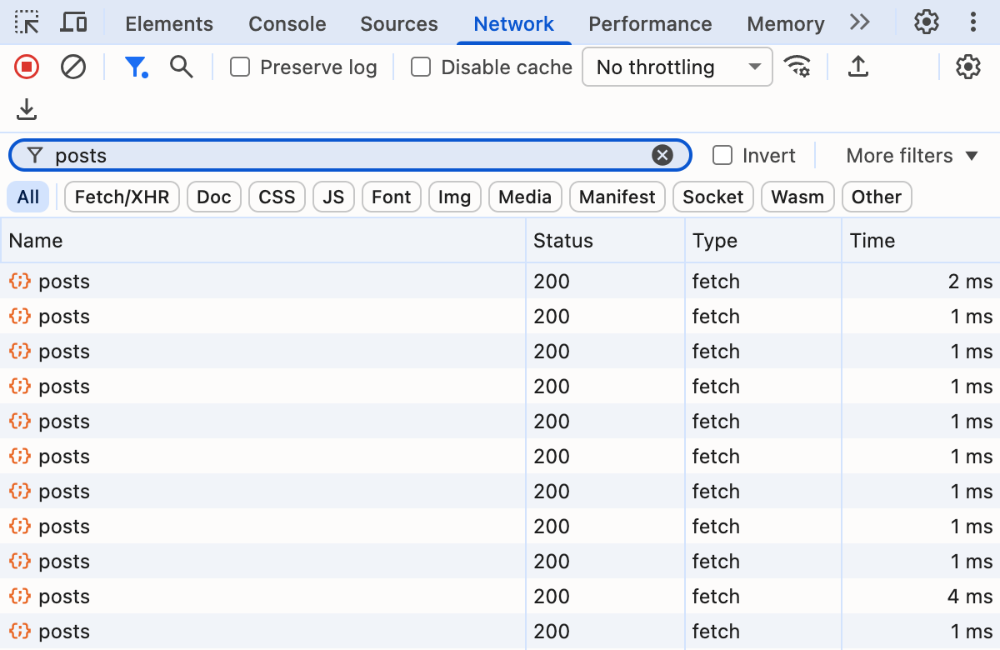
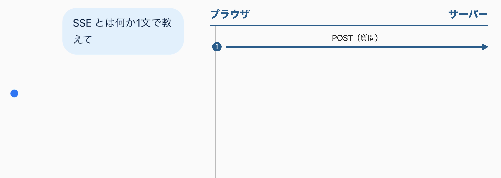
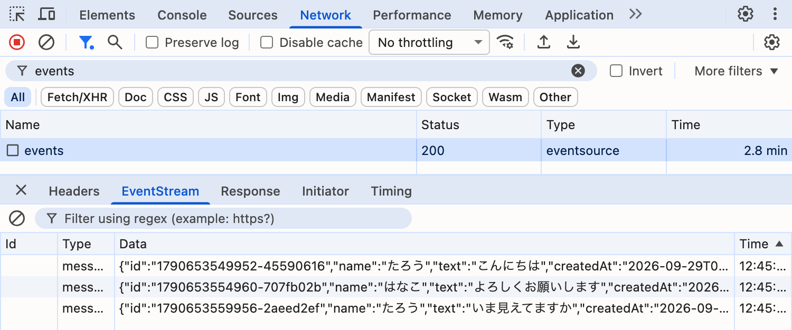
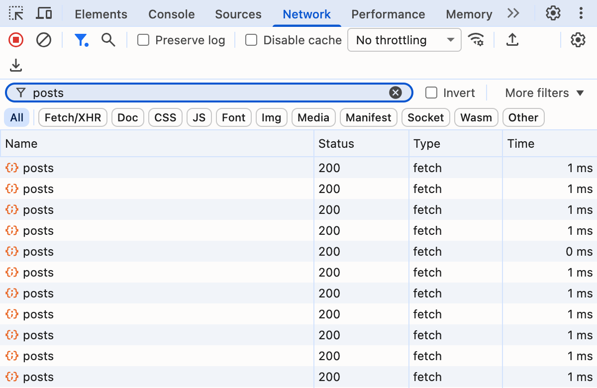
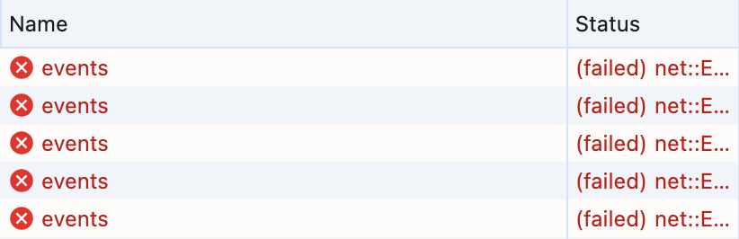

<!-- _class: lead -->

# リアルタイムに届く掲示板を **SSE** で作ろう

## SSE: Server-Sent Events

---

## 今日のゴール

ブラウザとサーバーの接続を保ったまま、サーバー側から新しいデータを送り続ける仕組み ( **SSE** ) について学びます。
掲示板を題材に、ブラウザ側・サーバー側両方の作り方を体験します。

- ブラウザ側: サーバーとの接続を保ったまま、受信したデータを表示する
- サーバー側: サーバーからリアルタイムに、接続している全員にデータを送信する

1〜5章で、ポーリング → SSE → 差分更新 → サーバー側の実装、の順に進めます。

---

## 準備

1. ブラウザで StackBlitz のテンプレートを開く
   https://stackblitz.com/edit/node-cdfr3jqk?file=public%2Fscript.js,server.js
2. 左上の **Fork** を押す
3. `public/script.js` を開き、`API` の値を当日伝える URL に書き換える

---

<!-- _class: record -->

## スライドの見かた

手を動かしてもらうスライドには、右上に 記述 のバッジが出ます。

書くコードはそのまま載っています。黄色いところだけを書きます。
赤く取り消されている行は、消します。

記述スライドは自分のペースで進めてかまいません。章が早く終わった人は、章の最後のスライドの左上にあるリンクから応用課題に進みましょう。

```javascript
// 例
const posts = [];
@@let connection = null;@@           // 黄色: 書いてもらう行
%%setInterval(showPosts, 10000);%%   // 赤: 消してもらう行
```

---

<!-- _class: lead -->

# 0章

## ブラウザとサーバーの役割と配布コードを確認する

掲示板でブラウザとサーバーがそれぞれ何をしていて、リクエストとレスポンスでどうやり取りしているかを学びます。
また、配布コードの `public/script.js` がいまどう動いているかを確認します。

---

## プロジェクトの中身

```
public/
  index.html
  styles.css
  script.js    ← 1〜3章で書く
package.json
server.js      ← 4〜5章で書く
```

`public/script.js` はブラウザ側の JavaScript、`server.js` はバックエンドサーバー側の JavaScript ファイルです。

ファイルは保存するだけで反映されるので、プレビューの再読み込みやサーバーの起動し直しは基本的に必要ありません。

---

## サーバーは何をしているのか

掲示板は、**ブラウザ** と **サーバー** の2つのプログラムが分担して動いています。

| | ブラウザ | サーバー |
|---|---|---|
| どこで動く | 自分のパソコン | ネットワークでつながった別のコンピュータ |
| 掲示板での役目 | 画面を表示する。入力やボタン操作を受け付ける | 全員の投稿を1か所に保存し、投稿の一覧をブラウザに返す |
| 今日のプログラム | `public/script.js` | 1〜3章: 講師の共有サーバー<br>4〜5章: 自分の `server.js` |

投稿がサーバーに集まっているので、ほかの人の投稿を自分の画面に出せます。

---

## ブラウザとサーバーのやり取り

<div class="seq">
  <div class="seq-head"><span>ブラウザ</span><span>サーバー</span></div>
  <div class="seq-body">
    <div class="seq-group">
      <div class="seq-row right"><div class="seq-msg">POST /posts（投稿1件を送信）</div></div>
      <div class="seq-row left"><div class="seq-msg">保存した投稿</div></div>
    </div>
    <div class="seq-group">
      <div class="seq-row right"><div class="seq-msg">GET /posts（投稿の一覧を取得）</div></div>
      <div class="seq-row left"><div class="seq-msg">投稿一覧</div></div>
    </div>
  </div>
</div>

ブラウザが送る要求を **リクエスト**、サーバーが返す応答を **レスポンス** といいます。
JavaScript では `fetch` でリクエストを送ります。

---

## 配布コードの現状の実装

投稿ボタンを押すと `addPost()` が呼び出され、入力欄の内容がサーバーに送られます。
そのあと `showPosts()` が呼び出され、一覧が更新されます。ページを開いたときと更新ボタンを押したときも `showPosts()` が一覧を更新します。

| 名前 | やっていること |
|---|---|
| `addPost` | 入力欄の中身をサーバーに送って、`showPosts` を呼ぶ |
| `showPosts` | サーバーから投稿を全件取得して、一覧に並べ直す |
| いちばん下の3行 | ボタンに関数を登録し、開いた瞬間に1回読み込む |

投稿する部分はできています。1〜3章では **メッセージを表示する部分** を作り変えます。

---

<!-- _class: lead -->

# 1章

## 一定間隔で自動更新する (ポーリング)

この章で編集するファイル: `public/script.js`

一定間隔でメッセージを受信できるようにします。SSE の前に、一定時間ごとに自動で読み直す処理を実装します。

---

## 1-1. 繰り返し同じ関数を実行する

現在の実装では、他の人が投稿した新しいメッセージは、更新ボタンを押すまで画面に反映されません。
そこで、自動でメッセージを決まった間隔で読み込むように実装します。

一定間隔で同じ関数を繰り返し呼び出したいときは `setInterval()` を使用します。

```javascript
// 例: 10000 ミリ秒ごとに `showPosts()` 関数を実行する
setInterval(showPosts, 10000);
```

---

<!-- _class: record -->

## 1-1. 投稿一覧を自動で読み直す

<div class="timer" data-seconds="60"></div>

10 秒ごとに `showPosts()` を実行して、投稿一覧を読み直します。

**書く場所**: `public/script.js` のいちばん下

```javascript
showPosts();                         // すでにある行
@@setInterval(showPosts, 10000);@@
```

**成功**: 何も押さずに最大10秒待つと、他の人の投稿が出てくる

---

<!-- _class: tips -->

## 開発者ツールの開き方

StackBlitz では、**右側のプレビューの上で** 右クリックします。エディタの上では、開発者ツールのメニューが出ません。`F12` キーでも開けます。

| | Chrome | Edge | Firefox |
|---|---|---|---|
| 右クリックのメニュー | 検証 | 開発者ツールで調査する | 調査 |
| 英語表示のとき | Inspect | Inspect | Inspect |

通信を見るタブは、どれも **Network** (日本語表示では「ネットワーク」) です。
このスライドは、英語表示の Chrome の画面で説明します。

---

## 1-2. 実際のサーバーとの通信を見る



1. プレビューの上で右クリック → 「検証」で開発者ツールを開き、**Network** タブを選ぶ
2. 上の `Filter` 欄に `posts` と入れる
3. プレビューを再読み込みして、10秒待つ

Network タブには、開いたあとの通信しか出ません。

**成功**: `posts` の行が、新しい投稿があってもなくても10秒ごとに1本ずつ増える

---

## 1-3. ポーリングで困ること

この「決まった間隔でサーバーと通信する」やり方を **ポーリング** といいます。

<div class="tl">
  <div class="tl-above"><span class="tl-post" style="left:45%">投稿された</span></div>
  <div class="tl-axis"><span class="tl-time">時間 →</span><span class="tl-dot" style="left:12%"></span><span class="tl-dot" style="left:37%"></span><span class="tl-dot" style="left:62%"></span><span class="tl-dot" style="left:87%"></span></div>
  <div class="tl-below"><span class="tl-lbl" style="left:12%">新着なし</span><span class="tl-lbl" style="left:37%">新着なし</span><span class="tl-lbl hit" style="left:62%">ここで届く</span><span class="tl-lbl" style="left:87%">新着なし</span></div>
  <div class="tl-gaprow"><span class="tl-gap" style="left:45%;width:17%"><span>遅れ 最大10秒</span></span></div>
</div>

- 間隔を短くすると、新着なしの通信がそのぶん増える
- 間隔を長くすると、届くのが遅くなる。10秒なら最悪10秒遅れる

間隔をどう決めても、どちらか片方は必ず悪くなります。

---

<!-- _class: lead -->

# 2章

## サーバーからの通知に切り替える ( **SSE** )

この章で編集するファイル: `public/script.js`

ブラウザから都度リクエストするのをやめて、いつ送るかをサーバーが決めるようにします。

---

## 2-1. ポーリングでは10秒ごとにリクエストを送る

<div class="seq">
  <div class="seq-title">ポーリング</div>
  <div class="seq-head"><span>ブラウザ</span><span>サーバー</span></div>
  <div class="seq-body">
    <div class="seq-group">
      <div class="seq-row right"><div class="seq-msg">GET /posts</div></div>
      <div class="seq-row left"><div class="seq-msg">投稿一覧（新着なし）</div></div>
    </div>
    <div class="seq-group">
      <div class="seq-row right"><div class="seq-msg">GET /posts（10秒後）</div></div>
      <div class="seq-row left"><div class="seq-msg">投稿一覧（新着なし）</div></div>
    </div>
    <div class="seq-repeat">10秒ごとに繰り返す</div>
  </div>
</div>

1章で作ったポーリングでは、新着がなくても10秒ごとに通信していました。
また、投稿されてから届くまで最大10秒遅れていました。

---

## 2-1. やりたいこと

<div class="seq">
  <div class="seq-title">やりたい通信</div>
  <div class="seq-head"><span>ブラウザ</span><span>サーバー</span></div>
  <div class="seq-body">
    <div class="seq-group">
      <div class="seq-row left"><div class="seq-msg">たろうの投稿</div></div>
      <div class="seq-row left"><div class="seq-msg">はなこの投稿</div></div>
    </div>
    <div class="seq-repeat">投稿された時点で送る</div>
  </div>
</div>

新しい投稿があったら、**サーバーからブラウザへすぐに送る** ようにしたいです。
そうすれば、新着がないときの通信はなくなり、投稿は遅れずに届きます。

ところが、リクエストとレスポンスのやり取りでは、これをそのままでは実現できません。

---

## 2-1. サーバーから通信を始めることはできない

<div class="columns">
<div>

<div class="seq">
  <div class="seq-title">ふつうの通信</div>
  <div class="seq-head"><span>ブラウザ</span><span>サーバー</span></div>
  <div class="seq-body">
    <div class="seq-group">
      <div class="seq-row right"><div class="seq-msg">GET /posts</div></div>
      <div class="seq-row left"><div class="seq-msg">投稿一覧</div></div>
    </div>
  </div>
</div>

</div>
<div>

<div class="seq">
  <div class="seq-title">サーバーから始める通信</div>
  <div class="seq-head"><span>ブラウザ</span><span>サーバー</span></div>
  <div class="seq-body">
    <div class="seq-group">
      <div class="seq-row left blocked"><div class="seq-msg">たろうの投稿</div></div>
      <div class="seq-row left blocked"><div class="seq-msg">はなこの投稿</div></div>
    </div>
  </div>
</div>

</div>
</div>

通信は、いつもブラウザのリクエストから始まります。
サーバーはリクエストに対してレスポンスを返すだけで、サーバーから通信を始めることはできません。

---

## 2-1. 先にリクエストを送っておく

<div class="seq">
  <div class="seq-title">ロングポーリング</div>
  <div class="seq-head"><span>ブラウザ</span><span>サーバー</span></div>
  <div class="seq-body">
    <div class="seq-group">
      <div class="seq-row right"><div class="seq-msg">GET（次の投稿を待つ）</div></div>
      <div class="seq-row left"><div class="seq-msg">たろうの投稿（投稿された時点で返す）</div></div>
    </div>
    <div class="seq-group">
      <div class="seq-row right"><div class="seq-msg">GET（次の投稿を待つ）</div></div>
      <div class="seq-row left"><div class="seq-msg">はなこの投稿（投稿された時点で返す）</div></div>
    </div>
  </div>
</div>

サーバーから通信を始められないので、先にリクエストを送っておきます。
サーバーは投稿があるまでレスポンスを保留し、投稿された時点で返します。
ブラウザはレスポンスを受け取るたびに、次のリクエストを送ります。
この方法を **ロングポーリング** といいます。

---

## 2-1. レスポンスは1回返すと閉じる

<div class="seq">
  <div class="seq-title">ふつうのレスポンス</div>
  <div class="seq-head"><span>ブラウザ</span><span>サーバー</span></div>
  <div class="seq-body">
    <div class="seq-group">
      <div class="seq-row right"><div class="seq-msg">GET（次の投稿を待つ）</div></div>
      <div class="seq-row left"><div class="seq-msg">たろうの投稿（ここで閉じる）</div></div>
      <div class="seq-row left blocked"><div class="seq-msg">はなこの投稿</div></div>
    </div>
  </div>
</div>

ふつうのレスポンスは、1回返し終えると閉じます。閉じたレスポンスには、あとからデータを足せません。
はなこの投稿を受信するには、ブラウザがもう一度リクエストを送る必要があります。投稿のたびにリクエストが必要な点は、ポーリングと同じです。

---

## 2-1. レスポンスを閉じずに書き足し続ける

<div class="seq">
  <div class="seq-title">閉じないレスポンス</div>
  <div class="seq-head"><span>ブラウザ</span><span>サーバー</span></div>
  <div class="seq-body">
    <div class="seq-group">
      <div class="seq-row right"><div class="seq-msg">GET /events（最初の1回）</div></div>
      <div class="seq-row left"><div class="seq-msg">たろうの投稿</div></div>
      <div class="seq-row left"><div class="seq-msg">はなこの投稿</div></div>
    </div>
    <div class="seq-repeat">投稿されるたびに書き足す</div>
  </div>
</div>

そこで、サーバーはレスポンスを閉じずに、投稿があるたびに続きを書き足します。
ブラウザからのリクエストは最初の1回だけで済みます。

**SSE** (Server-Sent Events) とは、このようにサーバーからブラウザへデータを送り続ける仕組みです。

---

## 2-1. ポーリングと SSE を比べる

<div class="columns">
<div>

<div class="seq">
  <div class="seq-title">ポーリング</div>
  <div class="seq-head"><span>ブラウザ</span><span>サーバー</span></div>
  <div class="seq-body">
    <div class="seq-group">
      <div class="seq-row right"><div class="seq-msg">GET /posts</div></div>
      <div class="seq-row left"><div class="seq-msg">投稿一覧</div></div>
    </div>
    <div class="seq-group">
      <div class="seq-row right"><div class="seq-msg">GET /posts</div></div>
      <div class="seq-row left"><div class="seq-msg">投稿一覧</div></div>
    </div>
    <div class="seq-repeat">10秒ごとに繰り返す</div>
  </div>
</div>

</div>
<div>

<div class="seq">
  <div class="seq-title">SSE</div>
  <div class="seq-head"><span>ブラウザ</span><span>サーバー</span></div>
  <div class="seq-body">
    <div class="seq-group">
      <div class="seq-row right"><div class="seq-msg">GET /events（最初の1回）</div></div>
      <div class="seq-row left"><div class="seq-msg">data: たろうの投稿</div></div>
      <div class="seq-row left"><div class="seq-msg">data: はなこの投稿</div></div>
      <div class="seq-row left"><div class="seq-msg">data: じろうの投稿</div></div>
    </div>
    <div class="seq-tail"></div>
    <div class="seq-repeat">投稿されるたびに届く</div>
  </div>
</div>

</div>
</div>

---

## SSE が使われている例: AI チャット

ChatGPT などの AI チャットでは、回答を全部作り終えてから返すのではなく、できた部分から少しずつ画面に表示します。この回答は SSE で届いています。



---

## 2-1. EventSource でサーバーに接続する

ブラウザ側は、`EventSource` を使うと1行で接続できます。

```javascript
const source = new EventSource(`${API}/events`);
```

- `new EventSource(URL)` で、サーバーの `/events` に接続する
- 接続したあとは、閉じないレスポンスを受信し続ける
- 接続が切れたら、ブラウザが自動で再接続する
- 作った接続は `source` に入れておき、このあと使う

`/events` は、講師が用意した共有サーバーにあります。

---

## 2-1. データを受信したときに実行する関数を登録する

```javascript
function handleMessage() {
  console.log('受信した');
}

source.onmessage = handleMessage;    // 関数を登録する。() は付けない
```

- `source.onmessage` に関数を代入しておくと、データを1件受信するたびにその関数が実行される

---

<!-- _class: record -->

## 2-1. ポーリングをやめて EventSource で接続する

<div class="timer" data-seconds="300"></div>

一定間隔の自動更新をやめて、サーバーからの通知に切り替えます。

**書く場所**: `public/script.js` のいちばん下

赤い行を消して、黄色い行を追加します。

```javascript
showPosts();                         // すでにある行
%%setInterval(showPosts, 10000);%%
@@const source = new EventSource(`${API}/events`);@@
@@source.onmessage = showPosts;@@
```

データが届くたびに `showPosts` を呼び、一覧を取り直します。

**成功**: メッセージが投稿された瞬間に表示される

---

## 2-2. 閉じないレスポンスが1本続いているのを見る



`events` の接続はページを開いた瞬間に始まるので、再読み込みしないと行が出ません。

1. `Filter` 欄を `events` に変えて、再読み込みする
2. 出てきた `events` の行を選び、**EventStream** タブを開く
3. 誰かの投稿が届くのを待つ

**成功**: `events` の行は1本のまま Time が伸び続け、投稿が届くたびに EventStream タブの行が1つ増える

---

## 2章の動作チェック

### 3つとも当てはまれば 2章は完了

1. `posts` の行が、10秒ごとに増えるのをやめている
2. `events` の行は1本だけで、Status は 200 のまま Time が伸び続ける
3. 投稿が届くたびに EventStream タブの行が1つ増える

### 投稿しても `events` の行は増えない

EventStream タブの中の行が増えます。通信そのものは、1本を使い回しています。

早く終わった人は → <a href="https://github.com/jigintern/study_session_materials/blob/main/2026/board-advanced/advanced.md#2章が早く終わった人へ" target="_blank">2章の応用課題</a> {.jump}

---

<!-- _class: lead break -->

# 休憩

<div class="timer" data-seconds="600"></div>

---

<!-- _class: lead -->

# 3章

## 全件取得から差分更新に

この章で編集するファイル: `public/script.js`

いまは投稿が届くたびに全件を取り直しています。
届いた新しいメッセージだけを画面に足すようにして、サーバーとやり取りする量を減らします。

---

## 3-1. 投稿のたびに全件を取り直しているのを見る



`Filter` 欄を `posts` に変えて、投稿が届くのを待ちます。

投稿が増えるほど通信も増えます。10秒ごとより多くなることもあります。

**成功**: `posts` の GET が投稿のたびに1本ずつ増える

---

## 3-1. 届いた投稿を使わずに全件を取り直している

<div class="columns" style="align-items: center">
<div>

<div class="seq">
  <div class="seq-head"><span>ブラウザ</span><span>サーバー</span></div>
  <div class="seq-body">
    <div class="seq-group">
      <div class="seq-row right"><div class="seq-msg">GET /events</div></div>
      <div class="seq-row left"><div class="seq-msg">data: たろうの投稿</div></div>
      <div class="seq-fn" data-label="showPosts">
        <div class="seq-group">
          <div class="seq-row right"><div class="seq-msg">GET /posts</div></div>
          <div class="seq-row left"><div class="seq-msg">投稿一覧（全件）</div></div>
        </div>
      </div>
      <div class="seq-row left"><div class="seq-msg">data: はなこの投稿</div></div>
      <div class="seq-fn" data-label="showPosts">
        <div class="seq-group">
          <div class="seq-row right"><div class="seq-msg">GET /posts</div></div>
          <div class="seq-row left"><div class="seq-msg">投稿一覧（全件）</div></div>
        </div>
      </div>
    </div>
    <div class="seq-tail"></div>
  </div>
</div>

</div>
<div>

いまの実装では、`/events` を「新着が来た」ことを知るためだけに使っています。

投稿の中身は、そのたびに `GET /posts` で全件を取り直しています。

</div>
</div>

---

## 3-1. 届いた投稿を画面に足す

<div class="columns">
<div>

<div class="seq">
  <div class="seq-head"><span>ブラウザ</span><span>サーバー</span></div>
  <div class="seq-body">
    <div class="seq-group">
      <div class="seq-row right"><div class="seq-msg">GET /events</div></div>
      <div class="seq-row left"><div class="seq-msg">data: たろうの投稿</div></div>
      <div class="seq-row left"><div class="seq-msg">data: はなこの投稿</div></div>
    </div>
    <div class="seq-tail"></div>
  </div>
</div>

</div>
<div>

`/events` の `data:` には、新着の投稿1件がそのまま入っています。

これを画面に足せば、`GET /posts` を送るのはページを開いたときの1回だけになります。

</div>
</div>

---

<!-- _class: compact -->

## 3-2. 関数の役割を分け直す

| 名前 | いま | 分け直したあと |
|---|---|---|
| `posts` | `showPosts` を呼ぶたびに作る | ブラウザ側で1つだけ持つ配列 |
| `loadPosts` | なし | 開いたときに1回だけ全件を取得して、`posts` に入れる |
| `showPosts` | 全件を取得して並べる | `posts` を画面に並べるだけ |
| `receivePost` | なし | 届いた1件を `posts` に足す |

1. `loadPosts` を作る
2. `showPosts` から `fetch` を消す
3. 受信した1件を `posts` に追加する
4. 使わなくなった `showPosts` の呼び出しを消す

---

<!-- _class: record compact -->

## 3-2. 投稿を取ってくる `loadPosts` を作る

<div class="timer" data-seconds="180"></div>

**書く場所 1**: `showPosts` の上

```javascript
@@const posts = [];@@                   // ブラウザ側で持つ投稿。画面と同じ並び

@@async function loadPosts() {@@        // 取ってきて posts に入れる。開いたときに1回だけ呼ぶ
@@  const res = await fetch(`${API}/posts`);@@
@@  const loaded = await res.json();@@  // サーバーにある投稿の全件
@@  for (const post of loaded) {@@      // 1件ずつ posts に入れる
@@    posts.push(post);@@
@@  }@@
@@  showPosts();@@
@@}@@
```

**書く場所 2**: いちばん下の `showPosts();` の行。赤い行を消して、黄色い行を書きます

```javascript
%%showPosts();%%
@@loadPosts();@@
```

**成功**: 画面はいままでどおり動く

---

<!-- _class: record -->

## 3-2. `showPosts` から `fetch` を消す

<div class="timer" data-seconds="120"></div>

`showPosts` に残っている `fetch` を消すと、`showPosts` は配列 `posts` を画面に並べるだけの関数になります。

**書く場所**: `showPosts` の先頭

```javascript
%%async %%function showPosts() {
%%  const res = await fetch(`${API}/posts`);%%
%%  const posts = await res.json();%%

  const list = document.getElementById('posts');   // ここから下はそのまま
```

`await` がなくなるので `async` も外します。`for` の行は書き換えません。関数の中で `posts` を宣言しなくなったので、`for` は関数の外で宣言した `posts` を参照します。

**成功**: ページを再読み込みすると、一覧が出る

---

## 3-2. 届いた1件は `e.data` に文字列で入っている

`onmessage` に登録した関数の引数 `e` の `data` に、投稿1件が文字列で入っています。

```javascript
'{"id":"1757480580000-a1b2c3d4","name":"たろう","text":"やっほー","createdAt":"..."}'
```

`JSON.parse` に通すと、`showPosts` が並べているのと同じ形のオブジェクトになります。

---

<!-- _class: record compact -->

## 3-2. 受信した1件を `posts` に追加する

<div class="timer" data-seconds="120"></div>

`posts` に追加してから `showPosts` を呼ぶと、その1件が一覧に表示されます。

**書く場所**: いちばん下の `source.onmessage` の行。赤い行を消して、黄色い行を書きます

```javascript
%%source.onmessage = showPosts;%%
@@function receivePost(e) {@@
@@  posts.push(JSON.parse(e.data));@@   // 届いた文字列をオブジェクトに戻して足す
@@  showPosts();@@
@@}@@
@@source.onmessage = receivePost;@@
```

**成功**: 投稿しても `posts` の GET が増えず、一覧にはその投稿が出る

---

## 3-2. 自分の投稿も SSE で届く

<div class="seq">
  <div class="seq-head"><span>ブラウザ</span><span>サーバー</span></div>
  <div class="seq-body">
    <div class="seq-group">
      <div class="seq-row right"><div class="seq-msg">GET /events（ページを開いたとき）</div></div>
    </div>
    <div class="seq-group">
      <div class="seq-row right"><div class="seq-msg">POST /posts（自分の投稿）</div></div>
      <div class="seq-row left"><div class="seq-msg">保存した投稿</div></div>
    </div>
    <div class="seq-group">
      <div class="seq-row left"><div class="seq-msg">data: 自分の投稿（/events の接続で届く）</div></div>
    </div>
  </div>
</div>

自分の投稿も、ほかの人の投稿と同じく `/events` から届き、`receivePost` が一覧に足します。
`addPost` の最後で呼んでいる `showPosts` は、`posts` を並べ直すだけなので、呼んでも一覧は変わりません。

---

<!-- _class: record -->

## 3-2. `addPost` から `showPosts` を消す

<div class="timer" data-seconds="60"></div>

`addPost` の最後で呼んでいる `showPosts` を消します。

**書く場所**: `addPost` の中、`text-input` を空にした行の下

```javascript
  document.getElementById('text-input').value = '';   // ここから下
%%  showPosts();%%
}
```

これで `fetch` は `loadPosts` の1つだけになり、サーバーから投稿を取得するのはページを開いたときの1回だけになります。

**成功**: 投稿すると、一覧に1件だけ出る

---

## 3章の動作チェック

### 4つとも当てはまれば 3章は完了

1. ページを開いたとき、`posts` の GET が1本だけある
2. そのあとは何件投稿されても、`posts` の GET が増えない
3. EventStream タブの行は、投稿のたびに増える
4. 一覧にも、届いた投稿が出る

### 3は増えるのに4が変わらないなら

届いてはいるので、受け取ったあとの処理でつまずいています。Console タブの赤い文字を見てください。

早く終わった人は → <a href="https://github.com/jigintern/study_session_materials/blob/main/2026/board-advanced/advanced.md#3章が早く終わった人へ" target="_blank">3章の応用課題</a> {.jump}

---

<!-- _class: lead break -->

# 休憩

<div class="timer" data-seconds="300"></div>

---

<!-- _class: lead -->

# 4章

## SSE のサーバー側を書く

この章で編集するファイル: `server.js` と `public/script.js`

投稿をブラウザに配信する処理を、自分のサーバーに書きます。

---

## 4-0. `server.js` の中身

`server.js` には、3つのことが書いてあります。

| 書いてあるもの | 役割 |
|---|---|
| `GET /posts` | 投稿を全部返す |
| `POST /posts` | 投稿を1件受け取って、`posts` に足す |
| それ以外 | `public/` の中のファイルを返す |

1〜3章で使っていた共有サーバーの役目を、ここからは自分の `server.js` が引き受けます。
右側のプレビューに見えているページも、この3つめから届いています。
投稿は `posts` という配列に入っているだけなので、サーバーを再起動すると消えます。

---

## 4-1. SSE のレスポンスを返す手順

<div class="seq">
  <div class="seq-title">GET /events のレスポンス</div>
  <div class="seq-head"><span>ブラウザ</span><span>サーバー</span></div>
  <div class="seq-body">
    <div class="seq-group">
      <div class="seq-row right"><div class="seq-msg">GET /events</div></div>
      <div class="seq-row left"><div class="seq-msg">ヘッダー（Content-Type: text/event-stream）</div></div>
      <div class="seq-row left"><div class="seq-msg">data: たろうの投稿</div></div>
      <div class="seq-row left"><div class="seq-msg">data: はなこの投稿</div></div>
    </div>
    <div class="seq-repeat">閉じずに書き足し続ける</div>
  </div>
</div>

1. ヘッダーで、SSE のレスポンスであることを伝える
2. ヘッダーだけ先に送る
3. 投稿があるたびに、1件ずつ区切って書き足す

---

<!-- _class: compact -->

## 4-1. 手順1: ヘッダーで SSE だと伝える

```javascript
res.writeHead(200, {
  'Content-Type': 'text/event-stream',
  'Cache-Control': 'no-cache',
  'Connection': 'keep-alive',
});
```

| ヘッダー | 意味 |
|---|---|
| `Content-Type: text/event-stream` | 中身が SSE の形式であること |
| `Cache-Control: no-cache` | キャッシュを使わず、毎回サーバーから受け取る |
| `Connection: keep-alive` | レスポンスのあとも接続を切らない |

`EventSource` は、`Content-Type` が `text/event-stream` でないレスポンスを受け付けません。

---

## 4-1. 手順2: ヘッダーだけ先に送る

<div class="columns">
<div>

<div class="seq">
  <div class="seq-title">res.flushHeaders() なし</div>
  <div class="seq-head"><span>ブラウザ</span><span>サーバー</span></div>
  <div class="seq-body">
    <div class="seq-group">
      <div class="seq-row right"><div class="seq-msg">GET /events</div></div>
      <div class="seq-row left"><div class="seq-msg">ヘッダー + data（最初の投稿のとき）</div></div>
    </div>
  </div>
</div>

</div>
<div>

<div class="seq">
  <div class="seq-title">res.flushHeaders() あり</div>
  <div class="seq-head"><span>ブラウザ</span><span>サーバー</span></div>
  <div class="seq-body">
    <div class="seq-group">
      <div class="seq-row right"><div class="seq-msg">GET /events</div></div>
      <div class="seq-row left"><div class="seq-msg">ヘッダー（すぐ）</div></div>
      <div class="seq-row left"><div class="seq-msg">data（投稿のとき）</div></div>
    </div>
  </div>
</div>

</div>
</div>

`res.writeHead` を呼んだだけでは、ヘッダーはまだ送られません。最初に `res.write` したときに、データと一緒に送られます。
`res.flushHeaders()` を呼ぶと、ヘッダーだけをすぐ送ります。ブラウザはヘッダーを受け取った時点で接続できたと判定し、`open` イベントが発生します。

---

<!-- _class: compact -->

## 4-1. 手順3: データを1件ずつ区切って送る

```
data: {"name":"たろう","text":"やっほー"}
                                            ← 空行
```

| 書くもの | 意味 |
|---|---|
| `data: 中身` | イベント1件の中身 |
| 空行 | ここまでで1件、という区切り |

`data:` の行末の改行と空行で、改行が `\n\n` と2つ並びます。
空行がないと、ブラウザはそのイベントの受信が終わったと判定しないので、`onmessage` の関数が実行されません。

---

<!-- _class: record compact -->

## 4-1. `GET /events` を足す

<div class="timer" data-seconds="360"></div>

**書く場所 1**: 投稿の置き場を作っている行の下

```javascript
const posts = [];                    // すでにある行
@@let connection = null;@@             // 現在の接続。新しい接続が来ると上書きされる
```

**書く場所 2**: `▼ 4章: ここに GET /events を足す` の行の下

```javascript
@@  if (req.method === 'GET' && url.pathname === '/events') {@@
@@    res.writeHead(200, {@@
@@      'Content-Type': 'text/event-stream',@@
@@      'Cache-Control': 'no-cache',@@
@@      'Connection': 'keep-alive',@@
@@    });@@
@@    res.flushHeaders();@@              // ヘッダーだけ先に送る
@@    connection = res;@@
@@    return;@@
@@  }@@
```

ここでは `res.end()` を呼びません。閉じないまま変数 `connection` に保持します。

---

<!-- _class: record compact -->

## 4-2. 投稿が来たらその接続に書き込む

<div class="timer" data-seconds="240"></div>

保存したあと、保持しておいた接続に1件ぶん書き足します。

**書く場所**: `server.js` の `▼ 4章: 接続しているブラウザに投稿を送る` の行の下

```javascript
    if (posts.length > MAX_POSTS) posts.shift();        // すでにある行

@@    if (connection) {@@
@@      connection.write(`data: ${JSON.stringify(post)}\n\n`);@@
@@    }@@
```

`JSON.stringify` で投稿のオブジェクトを JSON の文字列にして、先頭に `data: `、末尾に `\n\n` を付けます。

接続がなければ `connection` は `null` のままなので、`if` で確かめてから書きます。

---

<!-- _class: record -->

## 4-3. 接続先を自分のサーバーに変える

<div class="timer" data-seconds="120"></div>

共有サーバーの URL が入っている `API` を書き換えます。

**書く場所**: `public/script.js` の `API` の行

```javascript
@@const API = location.origin;@@
```

**`location.origin`** = いま開いているページを配信しているサーバーの URL

プレビューのページは自分の `server.js` から届いているので、URL を書き写さなくても、これで自分のサーバーに接続できます。

**成功**: 投稿すると、一覧に出る

---

## 4章の動作チェック

### タブを2枚開いて確かめる

1. プレビュー右上の「新しいタブで開く」を押す。もう1枚、同じ URL で開く
2. あとから開いたほうで Network タブを開き、`events` の行を選んで **EventStream** タブを見る
3. 先に開いたタブで投稿する → EventStream タブに行が1つ増え、一覧にも出る
4. あとから開いたタブで投稿する → 先に開いたタブには、何も出ない

### 4番は不具合ではない

`connection` には1本しか保持できず、あとから来た接続が前の接続を上書きしています。

---

<!-- _class: record compact -->

## 4-4. 接続状態を画面に出す

<div class="timer" data-seconds="240"></div>

**書く場所**: `public/script.js` のいちばん下

```javascript
source.onmessage = receivePost;      // すでにある行

@@const status = document.getElementById('status');@@

@@function showOnline() {@@
@@  status.textContent = 'つながっています';@@
@@  status.className = 'status online';@@
@@}@@
@@function showOffline() {@@
@@  status.textContent = '切れています';@@
@@  status.className = 'status offline';@@
@@}@@

@@source.addEventListener('open', showOnline);@@     // 接続したとき
@@source.addEventListener('error', showOffline);@@   // 切れたとき
```

**成功**: `server.js` を保存すると一瞬「切れています」になり、「つながっています」に戻る

---

<!-- _class: lead -->

# 5章

## 同時に複数接続できるようにする

この章で編集するファイル: `server.js`

接続している全員にメッセージを配信できるようにします。

---

<!-- _class: record compact -->

## 5-1. 接続の置き場を配列にする

<div class="timer" data-seconds="240"></div>

2箇所とも、1本ぶんの書き方を配列の書き方に入れ替えます。赤い行を消して、黄色い行を書きます。

**書く場所 1**: 接続の置き場を作っている2行

```javascript
%%// 現在の接続。新しい接続が来ると上書きされる。%%
%%let connection = null;%%
@@// 現在の接続の一覧。接続した順に並ぶ。@@
@@const connections = [];@@
```

**書く場所 2**: `GET /events` の中で接続を保持している行

```javascript
%%    connection = res;%%
@@    connections.push(res);@@
@@    console.log(`接続数: ${connections.length}`);@@
```

**成功**: `server.js` を保存すると、StackBlitz の下側のターミナルに `接続数: ` が出る

---

<!-- _class: record -->

## 5-2. 接続している全員に投稿を書き込む

<div class="timer" data-seconds="240"></div>

1本に書いていたところを、配列ぶん繰り返します。

**書く場所**: 投稿を受け取ったところ。4章で書いた `if (connection)` の行

```javascript
%%    if (connection) {%%
@@    for (const connection of connections) {@@
      connection.write(`data: ${JSON.stringify(post)}\n\n`);  // 変わらない行
    }
```

入れ替えるのは1行だけです。`write` の行も閉じ括弧も、そのままにします。

**成功**: タブを3枚開くと、どのタブで投稿しても残り2枚に出る

---

## 5章の動作チェック

### タブを3枚開いて確かめる

1. ターミナルの「接続数」が、開いているページの数と同じ (StackBlitz のプレビューも1つと数える)
2. どのタブで投稿しても、残り2枚に出る
3. 4章では何も出なかった「先に開いたタブ」にも出る

### タブを1枚閉じる

ターミナルの接続数を見ます。減らずにそのままです。

---

## 5-3. 閉じた接続が配列に残り続ける

タブを閉じたり再読み込みしたりすると、そのタブの接続は切れます。
いまの `server.js` は、切れた接続を `connections` から消していません。

| 操作 | `connections` の中身 |
|---|---|
| タブ A・B・C を開く | `[A, B, C]` |
| B を閉じる | `[A, B, C]` |
| A を再読み込みする | `[A, B, C, A2]` |

切れた B と A も配列に残り、投稿のたびに `write()` されます。
開き直すたびに配列が長くなり、サーバーの負荷になります。

---

## 5-3. 切れた接続を `close` イベントで抜く

**`req.on('close', 関数)`** = この接続が切れたときに、関数を1回呼ぶ

接続が切れると、サーバー側の `req` で `close` イベントが発生します。
登録した関数の中で、切れた接続を `connections` から抜きます。

| 操作 | `connections` の中身 |
|---|---|
| タブ A・B・C を開く | `[A, B, C]` |
| B を閉じる | `[A, C]` |
| A を再読み込みする | `[C, A2]` |

---

<!-- _class: record -->

## 5-3. 閉じた接続を消す

<div class="timer" data-seconds="240"></div>

接続が切れたら、配列から抜きます

**書く場所**: 接続を配列に足している行の下

```javascript
@@    function removeConnection() {@@
@@      connections.splice(connections.indexOf(res), 1);@@
@@      console.log(`接続数: ${connections.length}`);@@
@@    }@@
@@    req.on('close', removeConnection);@@
```

`indexOf` で並びの何番目かを探して、`splice` でそこから1つ抜いています。

**成功**: タブを閉じると、ターミナルの接続数が1減る

---

## 接続が切れたときの動き



自分のサーバーなので、止めて確かめられます。

1. `Filter` 欄を `events` に変える
2. ターミナルで `Ctrl + C` を押して止める
3. `npm start` で起動し直す

再接続に失敗した赤い行が数秒おきに増え、起動し直すと次の再接続で接続できます。再接続はブラウザが自動で行います。

ただし、切れている間の投稿は届きません。埋めるには `Last-Event-ID` を使います。

早く終わった人は → <a href="https://github.com/jigintern/study_session_materials/blob/main/2026/board-advanced/advanced.md#5章が早く終わった人へ" target="_blank">5章の応用課題</a> {.jump}

---

<!-- _class: record -->

## 共有サーバーに戻る

<div class="timer" data-seconds="60"></div>

最後に接続先を共有サーバーに戻して、全員で投稿してみましょう。

**書く場所**: `public/script.js` の `API` の行を上書き

```javascript
@@const API = 'https://example.deno.net';@@
```

当日の URL を入れ直します。

**成功**: ページを再読み込みすると他の人のメッセージが表示される

---

## ポーリング / SSE / WebSocket のどれを選ぶか

今回は、ポーリング・SSE を実装しましたが、他にも有名なものに `WebSocket` があります。

| やり方 | 向いているもの |
|---|---|
| ポーリング | たまにしか変わらない。遅れても困らない |
| SSE | サーバーからの一方通行。通知、進捗、配信中の字幕 |
| WebSocket | 双方向。チャット、ゲーム、共同編集 |


双方向で通信する必要があるなら WebSocket ですが、そうでないなら SSE のほうが少ないコードで済みます。

---

## 今日やったこと

| やったこと | 使ったもの |
|---|---|
| 決まった間隔で読み直す | `setInterval` |
| サーバーからの通知を受け取る | `EventSource` |
| 受信した1件だけを追加する | ブラウザ側の配列 `posts` |
| 通信を1本ずつ見る | Network タブ / EventStream タブ |
| 終わらないレスポンスを返す | `text/event-stream` / `res.write` |
| 接続している全員に送る | 接続の配列 / `req.on('close')` |

---

## 関数を登録して、きっかけが起きたら実行する

今日のコードでは、関数を登録しておき、決まったきっかけで実行させる書き方を3回使いました。

```javascript
// 10秒たつたび
setInterval(showPosts, 10000);
// クリックされるたび
document.getElementById('post-btn').addEventListener('click', addPost);
// データを受信するたび
source.onmessage = receivePost;
```

どれも関数名に `()` を付けずに渡します。

---

<!-- _class: lead -->

# おつかれさまでした！

<!-- BLOCK: なにかしらの画像 -->

---

<!-- _class: extra -->

## 付録: 関数に `()` を付けて渡すとどうなるか

```javascript
source.onmessage = handleMessage;    // 関数そのものを代入する
source.onmessage = handleMessage();  // この行でいったん実行し、戻り値を代入する
```

`()` を付けると、その行で関数が実行され、その戻り値が代入されます。
`handleMessage` は何も返さないので、`onmessage` には `undefined` が入り、データを受信しても何も実行されません。

---

<!-- _class: extra -->

## 付録: SSE のコメント行

`data:` の行のほかに、行頭を `:` で始めた行を書けます。これはコメントで、ブラウザには届きますがイベントと認識されません。

```
: これはコメント。onmessage は呼ばれない

data: {"name":"たろう","text":"やっほー"}
```

接続が切れないように、一定間隔で `:` の行だけを送る **ハートビート** に使います。

<script>
document.querySelectorAll('.timer[data-seconds]').forEach(el => {
  if (el.closest('.timer-box')) return;
  const box = document.createElement('div');
  box.className = 'timer-box';
  box.dataset.seconds = el.dataset.seconds;
  const minus = document.createElement('button');
  minus.className = 'timer-btn';
  minus.dataset.delta = '-60';
  minus.textContent = '−';
  const plus = document.createElement('button');
  plus.className = 'timer-btn';
  plus.dataset.delta = '60';
  plus.textContent = '＋';
  el.replaceWith(box);
  box.append(minus, el, plus);
});

document.querySelectorAll('.timer-box').forEach(box => {
  const el = box.querySelector('.timer');
  const initial = Number(box.dataset.seconds);
  let remain = initial;
  let id = null;

  const render = () => {
    const r = Math.max(remain, 0);
    const m = String(Math.floor(r / 60)).padStart(2, '0');
    const s = String(r % 60).padStart(2, '0');
    el.textContent = `${m}:${s}`;
    el.classList.toggle('warn', remain <= 60 && remain > 0);
    el.classList.toggle('done', remain <= 0);
  };
  const stop = () => { clearInterval(id); id = null; el.classList.remove('running'); };
  const start = () => {
    if (remain <= 0) return;
    el.classList.add('running');
    id = setInterval(() => {
      remain--;
      render();
      if (remain <= 0) stop();
    }, 1000);
  };

  el.addEventListener('click', () => {
    if (remain <= 0) { el.classList.remove('done'); return; }
    id ? stop() : start();
  });
  el.addEventListener('contextmenu', e => {
    e.preventDefault();
    stop();
    remain = initial;
    render();
  });
  box.querySelectorAll('.timer-btn').forEach(btn => {
    btn.addEventListener('click', () => {
      remain = Math.max(0, remain + Number(btn.dataset.delta));
      render();
    });
  });
  render();
});
</script>
