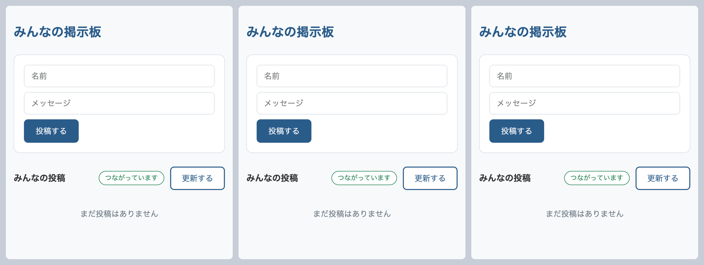
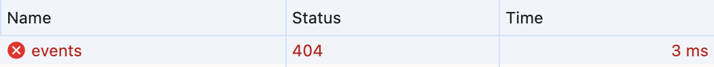
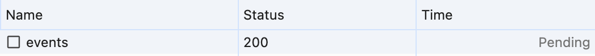
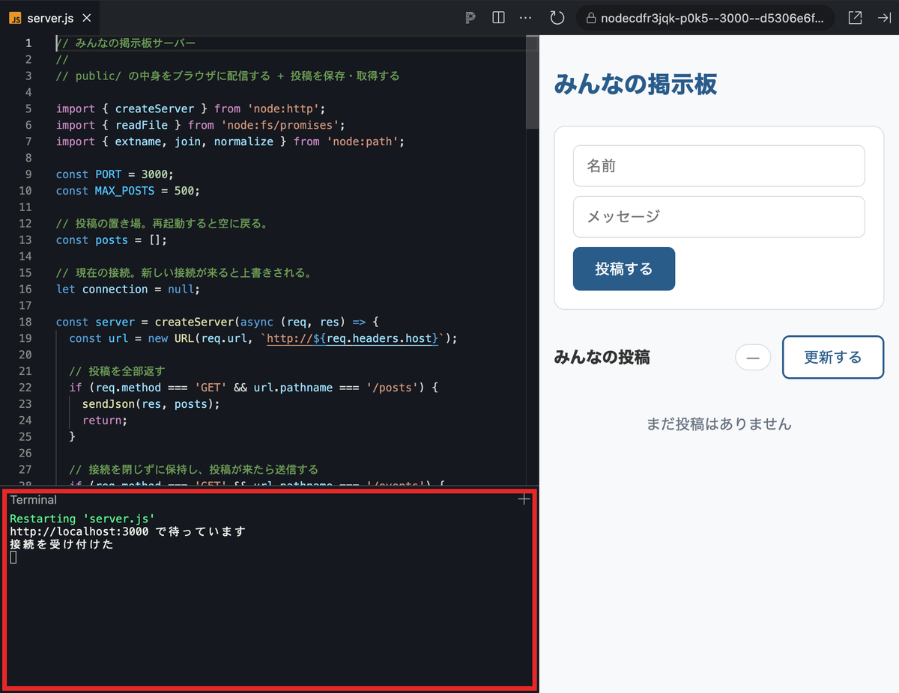
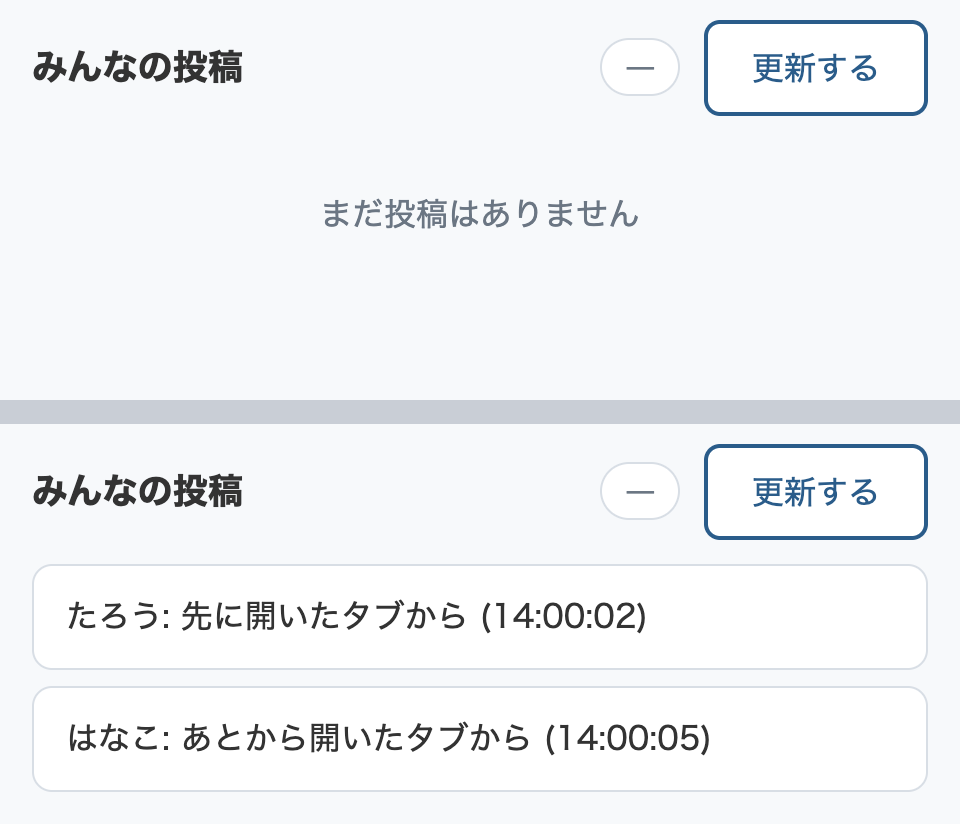
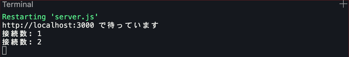

<!-- _class: lead -->

# リアルタイムに届く掲示板を **SSE** で作ろう

## SSE: Server-Sent Events

---

## 今日のゴール

誰かが投稿したら、開いている画面が自動で更新される掲示板を作ります。
この仕組みを、SSE という技術を使ってブラウザ側とサーバー側の両方に実装します。



---

## 準備

1. ブラウザで [StackBlitz のテンプレート](https://stackblitz.com/fork/github/jigintern/study_session_materials/tree/main/2026/board-advanced/template?file=public%2Fscript.js,server.js) を開く
2. 左上の **Fork** を押す
3. `public/script.js` を開き、`API` の値を今から伝える URL に書き換える

---

<!-- _class: record -->

## 演習の進め方

手を動かしてもらうスライドには、右上に 記述 のバッジが出ます。

黄色い行だけを書き、赤く取り消された行は消します。
`______` は空欄です。前の説明のスライドを見て、自分で埋めます。
コードの右上はファイル名です。

```javascript {data-file=public/script.js}
const posts = [];                // 色なし: すでにある行。この下に書く
@@let connection = null;@@           // 黄色: 書いてもらう行
@@const max = ______;@@              // 空欄: 自分で埋める
%%setInterval(showPosts, 10000);%%   // 赤: 消してもらう行
```

早く終わった人は、章の最後のスライドの左上にあるリンクから応用課題に進んでください。

---


<!-- _class: lead -->

# 0章

## ブラウザとサーバーの役割と配布コードを確認する

掲示板でブラウザとサーバーがそれぞれ何をしていて、リクエストとレスポンスでどうやり取りしているかを学びます。
また、配布コードの `public/script.js` がいまどう動いているかを確認します。

---

## プロジェクトの中身

```
public/
  index.html
  styles.css
  script.js    ← 1〜3章で書く
package.json
server.js      ← 4〜5章で書く
```

`public/script.js` はブラウザ側の JavaScript、`server.js` はバックエンドサーバー側の JavaScript ファイルです。

ファイルは保存するだけで反映されるので、プレビューの再読み込みやサーバーの起動し直しは基本的に必要ありません。

---

## サーバーは何をしているのか

掲示板の投稿は、サーバーが全員分をまとめて保存しています。

<svg class="hub" width="1100" height="280" viewBox="0 60 1100 280">
  <rect class="box" x="760" y="70" width="300" height="260" rx="6"/>
  <text class="name" x="910" y="105">サーバー</text>
  <rect class="list" x="780" y="130" width="260" height="176" rx="4"/>
  <text x="910" y="175">Aさんの投稿</text>
  <text x="910" y="218">Bさんの投稿</text>
  <text x="910" y="261">Cさんの投稿</text>
  <rect class="box" x="40" y="75" width="220" height="50" rx="6"/>
  <text class="name" x="150" y="100">Aさんのブラウザ</text>
  <line class="line" x1="270" y1="100" x2="741" y2="100"/>
  <polygon class="head" points="738,89 758,100 738,111"/>
  <text x="505" y="76">投稿を送る</text>
  <rect class="box" x="40" y="175" width="220" height="50" rx="6"/>
  <text class="name" x="150" y="200">Bさんのブラウザ</text>
  <line class="line" x1="289" y1="200" x2="758" y2="200"/>
  <polygon class="head" points="292,189 272,200 292,211"/>
  <text x="515" y="176">投稿一覧を受け取る</text>
  <rect class="box" x="40" y="275" width="220" height="50" rx="6"/>
  <text class="name" x="150" y="300">Cさんのブラウザ</text>
  <line class="line" x1="289" y1="300" x2="758" y2="300"/>
  <polygon class="head" points="292,289 272,300 292,311"/>
  <text x="515" y="276">投稿一覧を受け取る</text>
</svg>

---

## 今日書くところ

点線で囲んだ部分を、それぞれの章で書きます。
1〜3章では、講師が用意したサーバー (**共有サーバー**) を使います。

<svg class="hub" width="1100" height="350" viewBox="0 10 1100 350">
  <text class="sub" x="150" y="30">1〜3章</text>
  <text class="sub" x="910" y="30">4〜5章</text>
  <rect class="box" x="760" y="50" width="300" height="300" rx="6"/>
  <text class="name" x="910" y="78">サーバー</text>
  <rect class="frame" x="800" y="96" width="220" height="32" rx="4"/>
  <text class="mono" x="910" y="112">server.js</text>
  <rect class="list" x="780" y="144" width="260" height="186" rx="4"/>
  <text x="910" y="190">Aさんの投稿</text>
  <text x="910" y="237">Bさんの投稿</text>
  <text x="910" y="284">Cさんの投稿</text>
  <rect class="box" x="40" y="62" width="220" height="76" rx="6"/>
  <text class="name" x="150" y="84">Aさんのブラウザ</text>
  <rect class="frame" x="65" y="100" width="170" height="28" rx="4"/>
  <text class="mono" x="150" y="114">script.js</text>
  <line class="line" x1="270" y1="100" x2="741" y2="100"/>
  <polygon class="head" points="738,89 758,100 738,111"/>
  <text x="505" y="76">投稿を送る</text>
  <rect class="box" x="40" y="162" width="220" height="76" rx="6"/>
  <text class="name" x="150" y="184">Bさんのブラウザ</text>
  <rect class="frame" x="65" y="200" width="170" height="28" rx="4"/>
  <text class="mono" x="150" y="214">script.js</text>
  <line class="line" x1="289" y1="200" x2="758" y2="200"/>
  <polygon class="head" points="292,189 272,200 292,211"/>
  <text x="515" y="176">投稿一覧を受け取る</text>
  <rect class="box" x="40" y="262" width="220" height="76" rx="6"/>
  <text class="name" x="150" y="284">Cさんのブラウザ</text>
  <rect class="frame" x="65" y="300" width="170" height="28" rx="4"/>
  <text class="mono" x="150" y="314">script.js</text>
  <line class="line" x1="289" y1="300" x2="758" y2="300"/>
  <polygon class="head" points="292,289 272,300 292,311"/>
  <text x="515" y="276">投稿一覧を受け取る</text>
</svg>

---

## ブラウザとサーバーのやり取り

<div class="seq">
  <div class="seq-head"><span>ブラウザ</span><span>サーバー</span></div>
  <div class="seq-body">
    <div class="seq-group">
      <div class="seq-row right"><div class="seq-msg">POST /posts（投稿1件を送信）</div></div>
      <div class="seq-row left"><div class="seq-msg">保存した投稿</div></div>
    </div>
    <div class="seq-group">
      <div class="seq-row right"><div class="seq-msg">GET /posts（投稿の一覧を取得）</div></div>
      <div class="seq-row left"><div class="seq-msg">投稿一覧</div></div>
    </div>
  </div>
</div>

ブラウザが送る要求を **リクエスト**、サーバーが返す応答を **レスポンス** といいます。
JavaScript では `fetch` でリクエストを送ります。

---

## 配布コードの現状の実装

投稿ボタンを押すと `addPost()` が呼び出され、入力欄の内容がサーバーに送られます。
そのあと `showPosts()` が呼び出され、一覧が更新されます。ページを開いたときと更新ボタンを押したときも `showPosts()` が一覧を更新します。

| 名前 | やっていること |
|---|---|
| `addPost` | 入力欄の中身をサーバーに送って、`showPosts` を呼ぶ |
| `showPosts` | サーバーから投稿を全件取得して、一覧に並べ直す |
| いちばん下の3行 | ボタンに関数を登録し、開いた瞬間に1回読み込む |

投稿する部分はできています。1〜3章では **メッセージを表示する部分** を作り変えます。

---

<!-- _class: lead -->

# 1章

## 一定間隔で自動更新する (ポーリング)

この章で編集するファイル: `public/script.js`

一定間隔でメッセージを受信できるようにします。SSE の前に、一定時間ごとに自動で読み直す処理を実装します。

---

## 1-1. 繰り返し同じ関数を実行する

現在の実装では、他の人が投稿した新しいメッセージは、更新ボタンを押すまで画面に反映されません。
そこで、自動でメッセージを決まった間隔で読み込むように実装します。

| 書き方 | 意味 |
|---|---|
| `setInterval(<関数>, <ミリ秒>)` | <ミリ秒>ごとに<関数>を繰り返し呼ぶ |

```javascript
// 例: 10000 ミリ秒ごとに `showPosts()` 関数を実行する
setInterval(showPosts, 10000);
```

---

<!-- _class: record -->

## 1-1. 投稿一覧を自動で読み直す

<div class="timer" data-seconds="60"></div>

10 秒ごとに `showPosts()` を実行して、投稿一覧を読み直します。

```javascript {data-file=public/script.js}
document.getElementById('reload-btn').addEventListener('click', showPosts);

showPosts();                         // すでにある行
@@setInterval(showPosts, 10000);@@
```

**成功**: 何も押さずに最大10秒待つと、他の人の投稿が出てくる

---

<!-- _class: tips -->

## 開発者ツールの開き方

StackBlitz では、**右側のプレビューの上で** 右クリックします。エディタの上では、開発者ツールのメニューが出ません。`F12` キーでも開けます。

| | Chrome | Edge | Firefox |
|---|---|---|---|
| 右クリックのメニュー | 検証 | 開発者ツールで調査する | 調査 |
| 英語表示のとき | Inspect | Inspect | Inspect |

通信を見るタブは、どれも **Network** (日本語表示では「ネットワーク」) です。
このスライドは、英語表示の Chrome の画面で説明します。

---

## 1-2. 実際のサーバーとの通信を見る


1. プレビューの上で右クリック → 「検証」で開発者ツールを開き、**Network** タブを選ぶ
2. 上の `Filter` 欄に `posts` と入れる
3. プレビューを再読み込みして、10秒待つ

Network タブには、開いたあとの通信しか出ません。

**成功**: `posts` の行が、新しい投稿があってもなくても10秒ごとに1本ずつ増える

---

## 1-3. ポーリングで困ること

この「決まった間隔でサーバーと通信する」やり方を **ポーリング** といいます。

<div class="tl">
  <div class="tl-above"><span class="tl-post" style="left:45%">投稿された</span></div>
  <div class="tl-axis"><span class="tl-time">時間 →</span><span class="tl-dot" style="left:12%"></span><span class="tl-dot" style="left:37%"></span><span class="tl-dot" style="left:62%"></span><span class="tl-dot" style="left:87%"></span></div>
  <div class="tl-below"><span class="tl-lbl" style="left:12%">新着なし</span><span class="tl-lbl" style="left:37%">新着なし</span><span class="tl-lbl hit" style="left:62%">ここで届く</span><span class="tl-lbl" style="left:87%">新着なし</span></div>
  <div class="tl-gaprow"><span class="tl-gap" style="left:45%;width:17%"><span>遅れ 最大10秒</span></span></div>
</div>

- 間隔を短くすると、新着なしの通信がそのぶん増える
- 間隔を長くすると、届くのが遅くなる。10秒なら最悪10秒遅れる

間隔をどう決めても、どちらか片方は必ず悪くなります。

---

<!-- _class: lead -->

# 2章

## サーバーからの通知に切り替える ( **SSE** )

この章で編集するファイル: `public/script.js`

ブラウザから都度リクエストするのをやめて、いつ送るかをサーバーが決めるようにします。

---

## 2-1. ポーリングでは10秒ごとにリクエストを送る

<div class="seq">
  <div class="seq-title">ポーリング</div>
  <div class="seq-head"><span>ブラウザ</span><span>サーバー</span></div>
  <div class="seq-body">
    <div class="seq-group">
      <div class="seq-row right"><div class="seq-msg">GET /posts</div></div>
      <div class="seq-row left"><div class="seq-msg">投稿一覧（新着なし）</div></div>
    </div>
    <div class="seq-group">
      <div class="seq-row right"><div class="seq-msg">GET /posts（10秒後）</div></div>
      <div class="seq-row left"><div class="seq-msg">投稿一覧（新着なし）</div></div>
    </div>
    <div class="seq-repeat">10秒ごとに繰り返す</div>
  </div>
</div>

1章で作ったポーリングでは、新着がなくても10秒ごとに通信していました。
また、投稿されてから届くまで最大10秒遅れていました。

---

## 2-1. やりたいこと

<div class="seq">
  <div class="seq-title">やりたい通信</div>
  <div class="seq-head"><span>ブラウザ</span><span>サーバー</span></div>
  <div class="seq-body">
    <div class="seq-group">
      <div class="seq-row left"><div class="seq-msg">たろうの投稿</div></div>
      <div class="seq-row left"><div class="seq-msg">はなこの投稿</div></div>
    </div>
    <div class="seq-repeat">投稿された時点で送る</div>
  </div>
</div>

新しい投稿があったら、**サーバーからブラウザへすぐに送る** ようにしたいです。
そうすれば、新着がないときの通信はなくなり、投稿は遅れずに届きます。

ところが、リクエストとレスポンスのやり取りでは、これをそのままでは実現できません。

---

## 2-1. サーバーから通信を始めることはできない

<div class="columns">
<div>

<div class="seq">
  <div class="seq-title">ふつうの通信</div>
  <div class="seq-head"><span>ブラウザ</span><span>サーバー</span></div>
  <div class="seq-body">
    <div class="seq-group">
      <div class="seq-row right"><div class="seq-msg">GET /posts</div></div>
      <div class="seq-row left"><div class="seq-msg">投稿一覧</div></div>
    </div>
  </div>
</div>

</div>
<div>

<div class="seq">
  <div class="seq-title">サーバーから始める通信</div>
  <div class="seq-head"><span>ブラウザ</span><span>サーバー</span></div>
  <div class="seq-body">
    <div class="seq-group">
      <div class="seq-row left blocked"><div class="seq-msg">たろうの投稿</div></div>
      <div class="seq-row left blocked"><div class="seq-msg">はなこの投稿</div></div>
    </div>
  </div>
</div>

</div>
</div>

通信は、いつもブラウザのリクエストから始まります。
サーバーはリクエストに対してレスポンスを返すだけで、サーバーから通信を始めることはできません。

---

## 2-1. レスポンスを終了せずに書き足し続ける

<div class="seq">
  <div class="seq-title">終了しないレスポンス</div>
  <div class="seq-head"><span>ブラウザ</span><span>サーバー</span></div>
  <div class="seq-body">
    <div class="seq-group">
      <div class="seq-row right"><div class="seq-msg">GET /events（最初の1回）</div></div>
      <div class="seq-row left"><div class="seq-msg">たろうの投稿</div></div>
      <div class="seq-row left"><div class="seq-msg">はなこの投稿</div></div>
    </div>
    <div class="seq-repeat">投稿されるたびに書き足す</div>
  </div>
</div>

そこで、ブラウザが最初に1回だけリクエストを送っておきます。ふつうのレスポンスは1回返すと終了しますが、サーバーはこのレスポンスを終了せずに、投稿があるたびに書き足します。
この仕組みを **SSE** (Server-Sent Events) といいます。

---

## 2-1. ポーリングと SSE を比べる

<div class="columns">
<div>

<div class="seq">
  <div class="seq-title">ポーリング</div>
  <div class="seq-head"><span>ブラウザ</span><span>サーバー</span></div>
  <div class="seq-body">
    <div class="seq-group">
      <div class="seq-row right"><div class="seq-msg">GET /posts</div></div>
      <div class="seq-row left"><div class="seq-msg">投稿一覧</div></div>
    </div>
    <div class="seq-group">
      <div class="seq-row right"><div class="seq-msg">GET /posts</div></div>
      <div class="seq-row left"><div class="seq-msg">投稿一覧</div></div>
    </div>
    <div class="seq-repeat">10秒ごとに繰り返す</div>
  </div>
</div>

</div>
<div>

<div class="seq">
  <div class="seq-title">SSE</div>
  <div class="seq-head"><span>ブラウザ</span><span>サーバー</span></div>
  <div class="seq-body">
    <div class="seq-group">
      <div class="seq-row right"><div class="seq-msg">GET /events（最初の1回）</div></div>
      <div class="seq-row left"><div class="seq-msg">data: たろうの投稿</div></div>
      <div class="seq-row left"><div class="seq-msg">data: はなこの投稿</div></div>
      <div class="seq-row left"><div class="seq-msg">data: じろうの投稿</div></div>
    </div>
    <div class="seq-tail"></div>
    <div class="seq-repeat">投稿されるたびに届く</div>
  </div>
</div>

</div>
</div>

---

## SSE が使われている例: AI チャット

ChatGPT などの AI チャットでは、回答を全部作り終えてから返すのではなく、できた部分から少しずつ画面に表示します。この回答は SSE で届いています。


---

## 2-1. EventSource でサーバーに接続する

ブラウザ側は、`EventSource` を使うと1行で接続できます。

| 書き方 | 意味 |
|---|---|
| `new EventSource(<URL>)` | &lt;URL&gt;のサーバーに接続し、終了しないレスポンスを受信し続ける |

```javascript
// 例: https://example.com/stream に接続する
const source = new EventSource('https://example.com/stream');
```

接続が切れたら、ブラウザが自動で再接続します。作った接続は `source` に入れておき、このあと使います。

`/events` は、講師が用意した共有サーバーにあります。

---

## 2-1. データを受信したときに実行する関数を登録する

| 書き方 | 意味 |
|---|---|
| `<接続>.onmessage = <関数>` | データを1件受信するたびに<関数>を呼ぶ |

```javascript
// 例
function handleMessage() {
  console.log('受信した');
}

source.onmessage = handleMessage;    // 関数を登録する。() は付けない
```

---

<!-- _class: record -->

## 2-1. ポーリングをやめて EventSource で接続する

<div class="timer" data-seconds="300"></div>

一定間隔の自動更新をやめて、サーバーからの通知に切り替えます。

```javascript {data-file=public/script.js}
document.getElementById('reload-btn').addEventListener('click', showPosts);

showPosts();                         // すでにある行
%%setInterval(showPosts, 10000);%%
@@const source = new ______(`${API}/events`);@@   // 共有サーバーの /events に接続する
@@source.______ = showPosts;@@                    // データが届くたびに一覧を取り直す
```

**成功**: 新しい投稿が、投稿された瞬間に表示される

---

## 2-1. 答え

```javascript {data-file=public/script.js}
document.getElementById('reload-btn').addEventListener('click', showPosts);

showPosts();                         // すでにある行
%%setInterval(showPosts, 10000);%%
const source = new @@EventSource@@(`${API}/events`);
source.@@onmessage@@ = showPosts;
```

- 接続は `new EventSource(<URL>)` で作る
- データを受信するたびに呼ぶ関数は、`onmessage` に代入する

---

## 2-2. 終了しないレスポンスが1本続いているのを見る


`events` の接続はページを開いた瞬間に始まるので、再読み込みしないと行が出ません。

1. `Filter` 欄を `events` に変えて、再読み込みする
2. 出てきた `events` の行を選び、**EventStream** タブを開く
3. 誰かの投稿が届くのを待つ

**成功**: `events` の行は1本のまま Time が伸び続け、投稿が届くたびに EventStream タブの行が1つ増える

---

## 2章の動作チェック

### 3つとも当てはまれば 2章は完了

1. `posts` の行が、10秒ごとに増えるのをやめている
2. `events` の行は1本だけで、Status は 200 のまま Time が伸び続ける
3. 投稿が届くたびに EventStream タブの行が1つ増える

### 投稿しても `events` の行は増えない

EventStream タブの中の行が増えます。通信そのものは、1本を使い回しています。

早く終わった人は → [2章の応用課題](#adv-ch2) {.jump #ch2-end}

---

<!-- _class: lead break -->

# 休憩

<div class="timer" data-seconds="600"></div>

---

<!-- _class: lead -->

# 3章

## 全件取得から差分更新に

この章で編集するファイル: `public/script.js`

いまは投稿が届くたびに全件を取り直しています。
届いた新しいメッセージだけを画面に追加するようにして、サーバーとやり取りする量を減らします。

---

## 3-1. 投稿のたびに全件を取り直しているのを見る


`Filter` 欄を `posts` に変えて、投稿が届くのを待ちます。

投稿が増えるほど通信も増えます。10秒ごとより多くなることもあります。

**成功**: `posts` の GET が投稿のたびに1本ずつ増える

---

## 3-1. 届いた投稿を使わずに全件を取り直している

<div class="columns" style="align-items: center">
<div>

<div class="seq">
  <div class="seq-head"><span>ブラウザ</span><span>サーバー</span></div>
  <div class="seq-body">
    <div class="seq-group">
      <div class="seq-row right"><div class="seq-msg">GET /events</div></div>
      <div class="seq-row left"><div class="seq-msg">data: たろうの投稿</div></div>
      <div class="seq-fn" data-label="showPosts">
        <div class="seq-group">
          <div class="seq-row right"><div class="seq-msg">GET /posts</div></div>
          <div class="seq-row left"><div class="seq-msg">投稿一覧（全件）</div></div>
        </div>
      </div>
      <div class="seq-row left"><div class="seq-msg">data: はなこの投稿</div></div>
      <div class="seq-fn" data-label="showPosts">
        <div class="seq-group">
          <div class="seq-row right"><div class="seq-msg">GET /posts</div></div>
          <div class="seq-row left"><div class="seq-msg">投稿一覧（全件）</div></div>
        </div>
      </div>
    </div>
    <div class="seq-tail"></div>
  </div>
</div>

</div>
<div>

いまの実装では、`/events` を「新着が来た」ことを知るためだけに使っています。

投稿の中身は、そのたびに `GET /posts` で全件を取り直しています。

</div>
</div>

---

## 3-1. 届いた投稿を画面に追加する

<div class="columns">
<div>

<div class="seq">
  <div class="seq-head"><span>ブラウザ</span><span>サーバー</span></div>
  <div class="seq-body">
    <div class="seq-group">
      <div class="seq-row right"><div class="seq-msg">GET /events</div></div>
      <div class="seq-row left"><div class="seq-msg">data: たろうの投稿</div></div>
      <div class="seq-row left"><div class="seq-msg">data: はなこの投稿</div></div>
    </div>
    <div class="seq-tail"></div>
  </div>
</div>

</div>
<div>

`/events` の `data:` には、新着の投稿1件がそのまま入っています。

これを画面に追加すれば、`GET /posts` を送るのはページを開いたときの1回だけになります。

</div>
</div>

---

<!-- _class: compact -->

## 3-2. 関数の役割を分け直す

| 名前 | いま | 分け直したあと |
|---|---|---|
| `posts` | `showPosts` を呼ぶたびに作る | ブラウザ側で1つだけ持つ配列 |
| `loadPosts` | なし | 開いたときに1回だけ全件を取得して、`posts` に入れる |
| `showPosts` | 全件を取得して並べる | `posts` を画面に並べるだけ |
| `receivePost` | なし | 届いた1件を `posts` に追加する |

1. `loadPosts` を作る
2. `showPosts` から `fetch` を消す
3. 受信した1件を `posts` に追加する
4. 使わなくなった `showPosts` の呼び出しを消す

---

## 3-2. 配列の要素を1つずつ別の配列に追加する

| 書き方 | 意味 |
|---|---|
| `for (const <変数> of <配列>) { }` | <配列>の要素を先頭から1つずつ<変数>に入れて、`{ }` の中を繰り返す |
| `<配列>.push(<値>)` | <配列>の末尾に<値>を追加する |

```javascript
// 例: [1, 2, 3] の要素を1つずつ nums に追加する
const nums = [];
for (const n of [1, 2, 3]) {
  nums.push(n);
}
// nums は [1, 2, 3]
```

---

<!-- _class: record compact -->

## 3-2. 投稿を取ってくる `loadPosts` を作る

<div class="timer" data-seconds="180"></div>

```javascript {data-file=public/script.js}
@@const posts = [];@@                   // ブラウザ側で持つ投稿。画面と同じ並び

@@async function loadPosts() {@@        // 取ってきて posts に入れる。開いたときに1回だけ呼ぶ
@@  const res = await fetch(`${API}/posts`);@@
@@  const loaded = await res.json();@@  // サーバーにある投稿の全件
@@  for (const post of loaded) {@@      // 1件ずつ posts に入れる
@@    posts.push(post);@@
@@  }@@
@@  showPosts();@@
@@}@@

async function showPosts() {         // すでにある行
```

```javascript {data-file=public/script.js}
document.getElementById('reload-btn').addEventListener('click', showPosts);

%%showPosts();%%
@@loadPosts();@@
```

**成功**: 画面はいままでどおり動く

---

<!-- _class: record -->

## 3-2. `showPosts` から `fetch` を消す

<div class="timer" data-seconds="120"></div>

`showPosts` に残っている `fetch` を消すと、`showPosts` は配列 `posts` を画面に並べるだけの関数になります。
`await` がなくなるので `async` も外します。

```javascript {data-file=public/script.js}
%%async %%function showPosts() {
%%  const res = await fetch(`${API}/posts`);%%
%%  const posts = await res.json();%%

  const list = document.getElementById('posts');   // ここから下はそのまま
```

**成功**: ページを再読み込みすると、一覧が出る

---

## 3-2. 届いた1件は `e.data` に文字列で入っている

`onmessage` に登録した関数の引数 `e` の `data` に、投稿1件が文字列で入っています。
サーバーが、投稿のオブジェクトを JSON の文字列にして送っています。

```javascript
'{"id":"1757480580000-a1b2c3d4","name":"たろう","text":"やっほー","createdAt":"..."}'
```

| 書き方 | 意味 |
|---|---|
| `JSON.parse(<文字列>)` | JSON の<文字列>をオブジェクトに戻す |

`JSON.parse` に通すと、`showPosts` が並べているのと同じ形のオブジェクトになります。

---

<!-- _class: record compact -->

## 3-2. 受信した1件を `posts` に追加する

<div class="timer" data-seconds="120"></div>

`posts` に追加してから `showPosts` を呼ぶと、その1件が一覧に表示されます。

```javascript {data-file=public/script.js}
%%source.onmessage = showPosts;%%
@@function receivePost(e) {@@
@@  posts.push(______);@@                // 届いた文字列をオブジェクトに戻して追加する
@@  showPosts();@@
@@}@@
@@source.onmessage = receivePost;@@
```

**成功**: 投稿しても `posts` の GET が増えず、一覧にはその投稿が出る

---

## 3-2. 答え

```javascript {data-file=public/script.js}
const source = new EventSource(`${API}/events`);   // すでにある行
function receivePost(e) {
  posts.push(@@JSON.parse(e.data)@@);
  showPosts();
}
source.onmessage = receivePost;
```

- `e.data` は文字列なので、`JSON.parse` でオブジェクトに戻してから `posts` に追加する

---

## 3-2. 自分の投稿も SSE で届く

<div class="seq">
  <div class="seq-head"><span>ブラウザ</span><span>サーバー</span></div>
  <div class="seq-body">
    <div class="seq-group">
      <div class="seq-row right"><div class="seq-msg">GET /events（ページを開いたとき）</div></div>
    </div>
    <div class="seq-group">
      <div class="seq-row right"><div class="seq-msg">POST /posts（自分の投稿）</div></div>
      <div class="seq-row left"><div class="seq-msg">保存した投稿</div></div>
    </div>
    <div class="seq-group">
      <div class="seq-row left"><div class="seq-msg">data: 自分の投稿（/events の接続で届く）</div></div>
    </div>
  </div>
</div>

自分の投稿も、ほかの人の投稿と同じく `/events` から届き、`receivePost` が一覧に追加します。
`addPost` の最後で呼んでいる `showPosts` は、`posts` を並べ直すだけなので、呼んでも一覧は変わりません。

---

<!-- _class: record -->

## 3-2. `addPost` から `showPosts` を消す

<div class="timer" data-seconds="60"></div>

`addPost` の最後で呼んでいる `showPosts` を消します。

```javascript {data-file=public/script.js}
  document.getElementById('text-input').value = '';   // ここから下
%%  showPosts();%%
}
```

これで `fetch` は `loadPosts` の1つだけになり、サーバーから投稿を取得するのはページを開いたときの1回だけになります。

**成功**: 投稿すると、一覧に1件だけ出る

---

## 3章の動作チェック

### 4つとも当てはまれば 3章は完了

1. ページを開いたとき、`posts` の GET が1本だけある
2. そのあとは何件投稿されても、`posts` の GET が増えない
3. EventStream タブの行は、投稿のたびに増える
4. 一覧にも、届いた投稿が出る

### 3は増えるのに4が変わらないなら

届いてはいるので、受け取ったあとの処理でつまずいています。Console タブの赤い文字を見てください。

早く終わった人は → [3章の応用課題](#adv-ch3) {.jump #ch3-end}

---

<!-- _class: lead break -->

# 休憩

<div class="timer" data-seconds="300"></div>

---

<!-- _class: lead -->

# 4章

## SSE のサーバー側を書く

この章で編集するファイル: `server.js` と `public/script.js`

投稿をブラウザに配信する処理を、自分のサーバーに書きます。

---

## 4-0. `server.js` の中身

`server.js` には、1〜3章で使っていた2つのリクエストの処理がすでに書いてあります。共有サーバーでも、同じ処理が動いています。

| 書いてあるもの | 役割 |
|---|---|
| `GET /posts` | 投稿を全部返す |
| `POST /posts` | 投稿を1件受け取って、配列 `posts` に追加する |

この章では、SSE で投稿を配信する `GET /events` を追加します。

---

<!-- _class: record -->

## 4-1. 接続先を自分のサーバーに変える

<div class="timer" data-seconds="120"></div>

共有サーバーの URL が入っている `API` を書き換えます。

```javascript {data-file=public/script.js}
%%const API = 'https://example.deno.net';%%   // 共有サーバーの URL が入っている
@@const API = location.origin;@@
```

| 書き方 | 意味 |
|---|---|
| `location.origin` | いま開いているページを配信しているサーバーの URL |

**成功**: 再読み込みすると一覧が空になり、Network タブの `events` の行が 404 になる。`/events` はまだないので、エラーになれば成功



---

## 4-2. SSE のレスポンスを返す手順

<div class="columns" style="align-items: center">
<div>

<div class="seq no-num">
  <div class="seq-title">GET /events のレスポンス</div>
  <div class="seq-head"><span>ブラウザ</span><span>サーバー</span></div>
  <div class="seq-body">
    <div class="seq-group">
      <div class="seq-row right"><div class="seq-msg">GET /events</div></div>
      <div class="seq-row left"><div class="seq-msg">① ヘッダー</div></div>
      <div class="seq-row left"><div class="seq-msg">② data: たろうの投稿</div></div>
      <div class="seq-row left"><div class="seq-msg">② data: はなこの投稿</div></div>
    </div>
    <div class="seq-repeat">終了せずに書き足し続ける</div>
  </div>
</div>

</div>
<div>

① SSE 用のヘッダーを先に送る

② データを1件ずつ区切って送る

</div>
</div>

---

## 4-2. 手順1: SSE 用のヘッダーを設定する

レスポンスの先頭には、中身の種類などを書いた **HTTP ヘッダー** が付きます。

| 書き方 | 意味 |
|---|---|
| `res.setHeader(<名前>, <値>)` | レスポンスのヘッダーを1つ設定する |

```javascript
// EventSource は、text/event-stream でないと受け付けない
res.setHeader('Content-Type', 'text/event-stream');
// 念のため、キャッシュを使い回さないよう伝える
res.setHeader('Cache-Control', 'no-cache');
```

---

<!-- _class: compact -->

## 4-2. 手順1: ヘッダーだけ先に送る

<div class="columns">
<div>

<div class="seq no-num">
  <div class="seq-title"><code>res.flushHeaders()</code> なし</div>
  <div class="seq-head"><span>ブラウザ</span><span>サーバー</span></div>
  <div class="seq-body">
    <div class="seq-group">
      <div class="seq-row right"><div class="seq-msg">GET /events</div></div>
    </div>
    <div class="seq-repeat">最初の投稿まで何も届かない</div>
    <div class="seq-group">
      <div class="seq-row left"><div class="seq-msg">ヘッダー + data</div></div>
    </div>
  </div>
</div>

</div>
<div>

<div class="seq no-num">
  <div class="seq-title"><code>res.flushHeaders()</code> あり</div>
  <div class="seq-head"><span>ブラウザ</span><span>サーバー</span></div>
  <div class="seq-body">
    <div class="seq-group">
      <div class="seq-row right"><div class="seq-msg">GET /events</div></div>
      <div class="seq-row left"><div class="seq-msg">ヘッダー</div></div>
    </div>
    <div class="seq-repeat">最初の投稿を待つ</div>
    <div class="seq-group">
      <div class="seq-row left"><div class="seq-msg">data</div></div>
    </div>
  </div>
</div>

</div>
</div>

ブラウザはヘッダーを受け取るまで、接続できたかどうかが分かりません。
そこで、`setHeader` のあとに `res.flushHeaders()` を呼んで、ヘッダーだけ先に送ります。

---

<!-- _class: record compact -->

## 4-2. `GET /events` を追加する

<div class="timer" data-seconds="360"></div>

```javascript {data-file=server.js}
const posts = [];                    // すでにある行
@@let connection = null;@@             // 現在の接続。新しい接続が来ると上書きされる
```

```javascript {data-file=server.js}
  // ▼ 4章: ここに GET /events を追加する
@@  if (req.method === 'GET' && url.pathname === '______') {@@  // すぐ上の GET /posts と同じ形
@@    res.setHeader('Content-Type', '______');@@
@@    res.setHeader('Cache-Control', 'no-cache');@@
@@    res.______();@@                    // ヘッダーだけ先に送る
@@    connection = res;@@                // res.end() は呼ばず、終了しないまま保持する
@@    console.log('接続を受け付けた');@@
@@    return;@@
@@  }@@
```

**成功**: 再読み込みすると、Network タブの `events` の行の Status が 404 から 200 に変わる。まだ何も送っていないので、Time は Pending のまま



---

## 4-2. 答え

```javascript {data-file=server.js}
  // ▼ 4章: ここに GET /events を追加する
  if (req.method === 'GET' && url.pathname === '@@/events@@') {
    res.setHeader('Content-Type', '@@text/event-stream@@');
    res.setHeader('Cache-Control', 'no-cache');
    res.@@flushHeaders@@();
    connection = res;
    console.log('接続を受け付けた');
    return;
  }
```

- `Content-Type` は、手順1 の `text/event-stream`
- ヘッダーだけ先に送るのは、手順1 の `res.flushHeaders()`

---

<!-- _class: compact -->

## 4-3. 手順2: データを1件ずつ区切って送る

```
data: {"name":"たろう","text":"やっほー"}
                                            ← 空行
```

| 書くもの | 意味 |
|---|---|
| `data: 中身` | イベント1件の中身 |
| 空行 | ここまでで1件、という区切り |

`data:` の行末の改行と空行で、改行が `\n\n` と2つ並びます。
空行がないと、ブラウザはそのイベントの受信が終わったと判定しないので、`onmessage` の関数が実行されません。

---

<!-- _class: record compact -->

## 4-3. 投稿が来たらその接続に書き込む

<div class="timer" data-seconds="240"></div>

保存したあと、保持しておいた接続に1件ぶん書き足します。

```javascript {data-file=server.js}
    // ▼ 4章: 接続しているブラウザに投稿を送る
@@    const data = JSON.stringify(post);@@                  // 投稿を JSON の文字列にする
@@    if (connection) {@@                                   // 接続がなければ null のまま
@@      connection.write(______);@@                         // 手順2 の形式で書き足す
@@    }@@
```

| 書き方 | 意味 |
|---|---|
| `JSON.stringify(<値>)` | <値>を JSON の文字列にする。ブラウザ側の `JSON.parse` で元に戻る |
| `res.write(<文字列>)` | レスポンスを閉じずに、<文字列>を書き足す |
| `<文字列> + <文字列>` | 2つの文字列をつなげた文字列 |

**成功**: 投稿すると、一覧に出る

---

## 4-3. 答え

```javascript {data-file=server.js}
    // ▼ 4章: 接続しているブラウザに投稿を送る
    const data = JSON.stringify(post);
    if (connection) {
      // 'data: ' + data + '\n\n' と書いてもよい
      connection.write(@@`data: ${data}\n\n`@@);
    }
```

- `data: ` のあとに、JSON の文字列にした投稿 `data` を入れる
- 末尾の `\n\n` の1つ目で `data:` の行が終わり、2つ目で空行になる

---

## 4章の動作チェック



### 4つとも当てはまれば 4章は完了

1. Network タブの `events` の行は、Status が 200 のまま Time が伸び続ける
2. 投稿すると、`events` の EventStream タブに行が1つ増える
3. 一覧にも、投稿が出る
4. ターミナルに `接続を受け付けた` が出る (右の赤枠)

早く終わった人は → [4章の応用課題](#adv-ch4) {.jump #ch4-end}

---

<!-- _class: lead -->

# 5章

## 同時に複数接続できるようにする

この章で編集するファイル: `server.js`

接続している全員にメッセージを配信できるようにします。

---

## 5-0. 複数の接続に対応していないのを確かめる



1. プレビュー右上の「新しいタブで開く」を2回押す
2. それぞれのタブで投稿する
3. 投稿が出るのは、あとから開いたタブだけ

ターミナルには、タブを開くたびに `接続を受け付けた` が出ます。
受け取った接続のうち、`connection` に残るのは最後の1本だけです。

この章で、開いているすべてのタブに投稿が届くように直します。

---

<!-- _class: record compact -->

## 5-1. 接続の置き場を配列にする

<div class="timer" data-seconds="240"></div>

```javascript {data-file=server.js}
%%let connection = null;             // 現在の接続。新しい接続が来ると上書きされる%%
@@// 現在の接続の一覧。接続した順に並ぶ。@@
@@const connections = [];@@
```

```javascript {data-file=server.js}
%%    connection = res;%%
%%    console.log('接続を受け付けた');%%
@@    connections.push(res);@@
@@    console.log(`接続数: ${connections.length}`);@@
```



| 書き方 | 意味 |
|---|---|
| `<配列>.length` | <配列>の要素の数 |

**成功**: `server.js` を保存すると、ターミナルに `接続数: ` が出る

---

<!-- _class: record -->

## 5-2. 接続している全員に投稿を書き込む

<div class="timer" data-seconds="240"></div>

1本に書いていたところを、配列ぶん繰り返します。

```javascript {data-file=server.js}
    const data = JSON.stringify(post);                  // 変わらない行
%%    if (connection) {%%
@@    for (const connection of connections) {@@
      connection.write(`data: ${data}\n\n`);              // 変わらない行
    }
```

入れ替えるのは1行だけです。`write` の行も閉じ括弧も、そのままにします。

**成功**: タブを3枚開くと、どのタブで投稿しても残り2枚に出る

---

## 5章の動作チェック

### タブを3枚開いて確かめる

1. ターミナルの「接続数」が、開いているページの数と同じ (StackBlitz のプレビューも1つと数える)
2. どのタブで投稿しても、残り2枚に出る
3. 5-0 では何も出なかった「先に開いたタブ」にも出る

### タブを1枚閉じる

ターミナルの接続数を見ます。減らずにそのままです。

---

## 5-3. 切れた接続が配列に残り続ける

タブを閉じたり再読み込みしたりすると、そのタブの接続は切れます。
いまの `server.js` は、切れた接続を `connections` から消していません。

| 操作 | `connections` の中身 |
|---|---|
| タブ A・B・C を開く | `[A, B, C]` |
| B を閉じる | `[A, B, C]` |
| A を再読み込みする | `[A, B, C, A2]` |

切れた B と A も配列に残り、投稿のたびに `write()` されます。
開き直すたびに配列が長くなり、サーバーの負荷になります。

---

## 5-3. 切れた接続を `close` イベントで抜く

| 書き方 | 意味 |
|---|---|
| `req.on('close', <関数>)` | この接続が切れたときに、<関数>を1回呼ぶ |

接続が切れると、サーバー側の `req` で `close` イベントが発生します。
登録した関数の中で、切れた接続を `connections` から抜きます。

| 操作 | `connections` の中身 |
|---|---|
| タブ A・B・C を開く | `[A, B, C]` |
| B を閉じる | `[A, C]` |
| A を再読み込みする | `[C, A2]` |

---

<!-- _class: record -->

## 5-3. 切れた接続を消す

<div class="timer" data-seconds="240"></div>

```javascript {data-file=server.js}
    console.log(`接続数: ${connections.length}`);   // すでにある行
@@    function removeConnection() {@@
@@      connections.splice(connections.indexOf(res), 1);@@
@@      console.log(`接続数: ${connections.length}`);@@
@@    }@@
@@    req.on(______);@@                  // 接続が切れたら removeConnection を呼ぶ
```

| 書き方 | 意味 |
|---|---|
| `<配列>.indexOf(<値>)` | <値>が<配列>の何番目にあるかを返す。先頭は `0` |
| `<配列>.splice(<位置>, <個数>)` | <配列>の<位置>から、<個数>ぶんの要素を抜く |

**成功**: タブを閉じると、ターミナルの接続数が1減る

---

## 5-3. 答え

```javascript {data-file=server.js}
    console.log(`接続数: ${connections.length}`);   // すでにある行
    function removeConnection() {
      connections.splice(connections.indexOf(res), 1);
      console.log(`接続数: ${connections.length}`);
    }
    req.on(@@'close', removeConnection@@);
```

- 1つ目はイベントの名前 `'close'`、2つ目は切れたときに呼ぶ関数 `removeConnection`
- 関数は `()` を付けずに渡す

早く終わった人は → [5章の応用課題](#adv-ch5) {.jump #ch5-end}

---

<!-- _class: lead -->

# 完成しました！

## 投稿がリアルタイムに届く掲示板ができました


---

<!-- _class: record -->

## 共有サーバーに戻る

<div class="timer" data-seconds="60"></div>

最後に接続先を共有サーバーに戻して、全員で投稿してみましょう。

```javascript {data-file=public/script.js}
%%const API = location.origin;%%
@@const API = 'https://example.deno.net';@@
```

共有サーバーの URL を入れ直します。

**成功**: ページを再読み込みすると他の人のメッセージが表示される

---

<!-- _class: lead -->

# ふりかえり

---

## 今日やったこと

| やったこと | 使ったもの |
|---|---|
| 決まった間隔で読み直す | `setInterval` |
| サーバーからの通知を受け取る | `EventSource` |
| 受信した1件だけを追加する | ブラウザ側の配列 `posts` |
| 通信を1本ずつ見る | Network タブ / EventStream タブ |
| 終わらないレスポンスを返す | `text/event-stream` / `res.write` |
| 接続している全員に送る | 接続の配列 / `req.on('close')` |

---

## ほかのやり方: WebSocket

今回は、ポーリング・SSE を実装しましたが、他にも有名なものに `WebSocket` があります。

| やり方 | 向いているもの |
|---|---|
| ポーリング | たまにしか変わらない。遅れても困らない |
| SSE | サーバーからの一方通行。通知、進捗、配信中の字幕 |
| WebSocket | 双方向。チャット、ゲーム、共同編集 |


双方向で通信する必要があるなら WebSocket ですが、そうでないなら SSE のほうが少ないコードで済みます。

---

<!-- _class: lead -->

# おつかれさまでした！

<!-- BLOCK: なにかしらの画像 -->

---

<!-- _class: extra -->

## 付録: 関数に `()` を付けて渡すとどうなるか

```javascript
source.onmessage = handleMessage;    // 関数そのものを代入する
source.onmessage = handleMessage();  // この行でいったん実行し、戻り値を代入する
```

`()` を付けると、その行で関数が実行され、その戻り値が代入されます。
`handleMessage` は何も返さないので、`onmessage` には `undefined` が入り、データを受信しても何も実行されません。

---

<!-- _class: extra compact -->

## 付録: `Content-Type` が違うとどうなるか

`Content-Type` が `text/event-stream` 以外だと、ブラウザはヘッダーを受け取った時点で接続をやめます。

| | `text/event-stream` | それ以外 (例: `text/html`) |
|---|---|---|
| `open` イベント | 発生する | 発生しない |
| `error` イベント | 接続が切れたとき | ヘッダーを受け取ってすぐ1回 |
| 切れたあと | 数秒後に自動で再接続する | 再接続しない |

Console には次のエラーが出ます (実際は1行)。

```
EventSource's response has a MIME type ("text/html")
that is not "text/event-stream". Aborting the connection.
```

---

<!-- _class: extra -->

## 付録: 接続が切れるとどうなるか


ブラウザが数秒おきに自動で再接続します。ただし、切れている間の投稿は届きません。

接続先を自分のサーバーにして確かめてみましょう。

1. Network タブの `Filter` 欄を `events` に変える
2. ターミナルで `Ctrl + C` を押して止める
3. `npm start` で起動し直す

止めている間は再接続に失敗した赤い行が数秒おきに増え、起動し直すと次の再接続でつながります。

---

<!-- _class: extra -->

## 付録: 切れている間の投稿を届けるには

投稿を送るとき、`data:` の前に `id:` の行を付けておきます。

```
id: 3
data: {"name":"たろう","text":"やっほー"}
```

ブラウザは最後に受け取った `id` を覚えていて、再接続のときに `Last-Event-ID` ヘッダーで送ってきます。サーバーはそれより後の投稿を送り直せば、切れている間の分を埋められます。

---

<!-- _class: extra -->

## 付録: SSE のコメント行

`data:` の行のほかに、行頭を `:` で始めた行を書けます。これはコメントで、ブラウザには届きますがイベントと認識されません。

```
: これはコメント。onmessage は呼ばれない

data: {"name":"たろう","text":"やっほー"}
```

接続が切れないように、一定間隔で `:` の行だけを送る **ハートビート** に使います。 {#comment-line}

---

<!-- _class: lead break -->

# 応用課題

章が早く終わった人向けの課題です。終わったら左上のリンクで、来た章に戻ります。 {#advanced}

---

<!-- _class: extra -->

## 2章の応用課題: 見ていない間に届いた件数をタブに出す

[← 2章の動作チェックに戻る](#ch2-end) {.jump #adv-ch2}

別のタブを見ている間に届いた投稿の数を、`(3) みんなの掲示板` のようにタブのタイトルに出します。掲示板のタブに戻ったら元のタイトルに戻します。

- タイトルは `document.title` で読み書きできる
- いま見られていないかは `document.hidden` で分かる
- 見られる状態に戻ったことは `visibilitychange` イベントで分かる
- 3章で `onmessage` を置き換えるので、`source.addEventListener('message', 関数)` で書くと消えずに残る

---

<!-- _class: extra compact -->

## 2章の応用課題の答え

[← 2章の動作チェックに戻る](#ch2-end) {.jump}

```javascript {data-file=public/script.js}
source.onmessage = showPosts;   // すでにある行
@@const title = document.title;@@
@@let unread = 0;@@
@@function countUnread() {@@
@@  if (!document.hidden) return;@@
@@  unread = unread + 1;@@
@@  document.title = `(${unread}) ${title}`;@@
@@}@@
@@function resetTitle() {@@
@@  if (document.hidden) return;@@
@@  unread = 0;@@
@@  document.title = title;@@
@@}@@
@@source.addEventListener('message', countUnread);@@
@@document.addEventListener('visibilitychange', resetTitle);@@
```

- 元のタイトルを `title` に取っておき、戻すときに使う
- `visibilitychange` は隠れたときにも発生するので、見えているときだけ戻す

---

<!-- _class: extra -->

## 3章の応用課題1: 再接続したときに、切断中の投稿を取得する

[← 3章の動作チェックに戻る](#ch3-end) {.jump #adv-ch3}

接続が切れている間の投稿は、再接続しても届きません。接続するたびに `/posts` を取得し直し、`posts` にない投稿だけを追加します。

- 接続したことは `source.addEventListener('open', 関数)` で分かる
- 共有サーバーの投稿には `id` があるので、`posts` にあるかどうかを `posts.some(...)` で確かめられる
- 最初に接続したときも `open` は発生するので、最後の行の `loadPosts();` は消す。残すと取得が2つ同時に走り、同じ投稿が2件ずつ入ることがある

---

<!-- _class: extra compact -->

## 3章の応用課題1の答え: `posts` にない投稿だけを追加する

[← 3章の動作チェックに戻る](#ch3-end) {.jump}

```javascript {data-file=public/script.js}
@@function hasPost(id) {@@
@@  function isSame(post) {@@
@@    return post.id === id;@@
@@  }@@
@@  return posts.some(isSame);@@
@@}@@

async function loadPosts() {
  const res = await fetch(`${API}/posts`);
  const loaded = await res.json();

  for (const post of loaded) {
    @@if (!hasPost(post.id))@@ posts.push(post);
  }
```

- `some` は、`isSame` が `true` を返す要素が1つでもあれば `true` を返す

---

<!-- _class: extra -->

## 3章の応用課題1の答え: 接続するたびに投稿を取得する

[← 3章の動作チェックに戻る](#ch3-end) {.jump}

```javascript {data-file=public/script.js}
%%loadPosts();%%

const source = new EventSource(`${API}/events`);   // すでにある行
```

```javascript {data-file=public/script.js}
source.onmessage = receivePost;   // すでにある行
@@source.addEventListener('open', loadPosts);@@
```

- ページを開いて最初に接続したときも `open` が発生するので、最初の取得もここで済む
- `loadPosts();` の行を残すと取得が2つ同時に走り、同じ投稿が2件ずつ入ることがある

---

<!-- _class: extra -->

## 3章の応用課題2: 投稿に失敗したことを伝える

[← 3章の動作チェックに戻る](#ch3-end) {.jump}

メッセージを空で投稿すると、共有サーバーは 400 と `{"message": "..."}` を返します。失敗したら `alert` で知らせ、入力欄は空にしないようにします。

- 成否は `fetch` の戻り値の `res.ok` で分かる

---

<!-- _class: extra -->

## 3章の応用課題2の答え

[← 3章の動作チェックに戻る](#ch3-end) {.jump}

```javascript {data-file=public/script.js}
  @@const res = @@await fetch(`${API}/posts`, {
    method: 'POST',
    headers: { 'Content-Type': 'application/json' },
    body: JSON.stringify({ name: name, text: text }),
  });

@@  if (!res.ok) {@@
@@    const { message } = await res.json();@@
@@    alert(message);@@
@@    return;@@
@@  }@@

  document.getElementById('text-input').value = '';
```

- 失敗したら `return` で抜けるので、入力欄を空にする行まで進まない
- `const { message }` は、受け取ったオブジェクトから `message` を取り出す

---

<!-- _class: extra -->

## 4章の応用課題: 接続状態を画面に出す

[← 4章の動作チェックに戻る](#ch4-end) {.jump #adv-ch4}

「みんなの投稿」の横に、SSE の接続がつながっているか切れているかを出します。`server.js` を保存するとサーバーが再起動するので、一瞬「切れています」になり、「つながっています」に戻れば完成です。

- 表示する場所は `index.html` に `<span id="status">` として用意してある
- `class` を `status online` にすると緑、`status offline` にすると赤になる
- 接続したことは `source.addEventListener('open', 関数)` で、切れたことは `source.addEventListener('error', 関数)` で分かる

---

<!-- _class: extra -->

## 4章の応用課題の答え

[← 4章の動作チェックに戻る](#ch4-end) {.jump}

```javascript {data-file=public/script.js}
source.onmessage = receivePost;   // すでにある行
@@const status = document.getElementById('status');@@
@@function showOnline() {@@
@@  status.textContent = 'つながっています';@@
@@  status.className = 'status online';@@
@@}@@
@@function showOffline() {@@
@@  status.textContent = '切れています';@@
@@  status.className = 'status offline';@@
@@}@@
@@source.addEventListener('open', showOnline);@@
@@source.addEventListener('error', showOffline);@@
```

- 切れたあとはブラウザが自動で再接続するので、つながり直すと `open` がまた発生する

---

<!-- _class: extra compact -->

## 5章の応用課題: `server.js` に機能を追加する

[← 5章の動作チェックに戻る](#ch5-end) {.jump #adv-ch5}

上から順に難しくなります。

1. ハートビートを送る: 15秒ごとに、接続している全員へコメント行 `: ping\n\n` を書く。データが流れない時間が続くと、プロキシなどが接続を切ることがある ([付録: SSE のコメント行](#comment-line))
2. 空の投稿を受け付けない: `text` が空なら保存せず、ステータス `400` と `{"message": "..."}` を返す。3章の「投稿に失敗したことを伝える」を済ませていれば、ブラウザにエラーが表示される
3. 接続数を全員に送る: 接続したときと切れたときに `event: count\ndata: 3\n\n` を全員に書く。ブラウザ側は `source.addEventListener('count', 関数)` で受け取り、画面に出す

---

<!-- _class: extra -->

## 5章の応用課題の答え1: ハートビートを送る

[← 5章の動作チェックに戻る](#ch5-end) {.jump}

```javascript {data-file=server.js}
const connections = [];   // すでにある行
@@function sendPing() {@@
@@  for (const connection of connections) {@@
@@    connection.write(': ping\n\n');@@
@@  }@@
@@}@@
@@setInterval(sendPing, 15000);@@
```

- コメント行なので、ブラウザの `onmessage` は呼ばれない

---

<!-- _class: extra -->

## 5章の応用課題の答え2: 空の投稿を受け付けない

[← 5章の動作チェックに戻る](#ch5-end) {.jump}

```javascript {data-file=server.js}
    const post = await readPost(req);   // すでにある行
@@    if (post.text === '') {@@
@@      res.writeHead(400, { 'Content-Type': 'application/json; charset=utf-8' });@@
@@      res.end(JSON.stringify({ message: 'text が空です' }));@@
@@      return;@@
@@    }@@
    posts.push(post);
```

- `readPost` は `text` がないときも `''` にするので、`''` と比べれば足りる
- `sendJson` はステータスが `200` で決まっているので、`res.writeHead` で直接書く

---

<!-- _class: extra compact -->

## 5章の応用課題の答え3: 接続数を全員に送る

[← 5章の動作チェックに戻る](#ch5-end) {.jump}

```javascript {data-file=server.js}
const connections = [];   // すでにある行
@@function sendCount() {@@
@@  for (const connection of connections) {@@
@@    connection.write(`event: count\ndata: ${connections.length}\n\n`);@@
@@  }@@
@@}@@
```

```javascript {data-file=server.js}
    console.log(`接続数: ${connections.length}`);   // すでにある行
@@    sendCount();@@

    function removeConnection() {
      connections.splice(connections.indexOf(res), 1);
      console.log(`接続数: ${connections.length}`);
@@      sendCount();@@
    }
```

---

<!-- _class: extra -->

## 5章の応用課題の答え3: 接続数を画面に出す

[← 5章の動作チェックに戻る](#ch5-end) {.jump}

```html {data-file=public/index.html}
        <h2>みんなの投稿</h2>   <!-- すでにある行 -->
@@        <span id="count"></span>@@
```

```javascript {data-file=public/script.js}
source.onmessage = receivePost;   // すでにある行
@@function showCount(e) {@@
@@  document.getElementById('count').textContent = `${e.data}人が接続中`;@@
@@}@@
@@source.addEventListener('count', showCount);@@
```

- `event:` の行を付けたデータは `onmessage` には届かず、同じ名前で登録した関数だけが呼ばれる

<script>
document.querySelectorAll('.timer[data-seconds]').forEach(el => {
  if (el.closest('.timer-box')) return;
  const box = document.createElement('div');
  box.className = 'timer-box';
  box.dataset.seconds = el.dataset.seconds;
  const minus = document.createElement('button');
  minus.className = 'timer-btn';
  minus.dataset.delta = '-60';
  minus.textContent = '−';
  const plus = document.createElement('button');
  plus.className = 'timer-btn';
  plus.dataset.delta = '60';
  plus.textContent = '＋';
  el.replaceWith(box);
  box.append(minus, el, plus);
});

document.querySelectorAll('.timer-box').forEach(box => {
  const el = box.querySelector('.timer');
  const initial = Number(box.dataset.seconds);
  let remain = initial;
  let id = null;

  const render = () => {
    const r = Math.max(remain, 0);
    const m = String(Math.floor(r / 60)).padStart(2, '0');
    const s = String(r % 60).padStart(2, '0');
    el.textContent = `${m}:${s}`;
    el.classList.toggle('warn', remain <= 60 && remain > 0);
    el.classList.toggle('done', remain <= 0);
  };
  const stop = () => { clearInterval(id); id = null; el.classList.remove('running'); };
  const start = () => {
    if (remain <= 0) return;
    el.classList.add('running');
    id = setInterval(() => {
      remain--;
      render();
      if (remain <= 0) stop();
    }, 1000);
  };

  el.addEventListener('click', () => {
    if (remain <= 0) { el.classList.remove('done'); return; }
    id ? stop() : start();
  });
  el.addEventListener('contextmenu', e => {
    e.preventDefault();
    stop();
    remain = initial;
    render();
  });
  box.querySelectorAll('.timer-btn').forEach(btn => {
    btn.addEventListener('click', () => {
      remain = Math.max(0, remain + Number(btn.dataset.delta));
      render();
    });
  });
  render();
});
</script>
