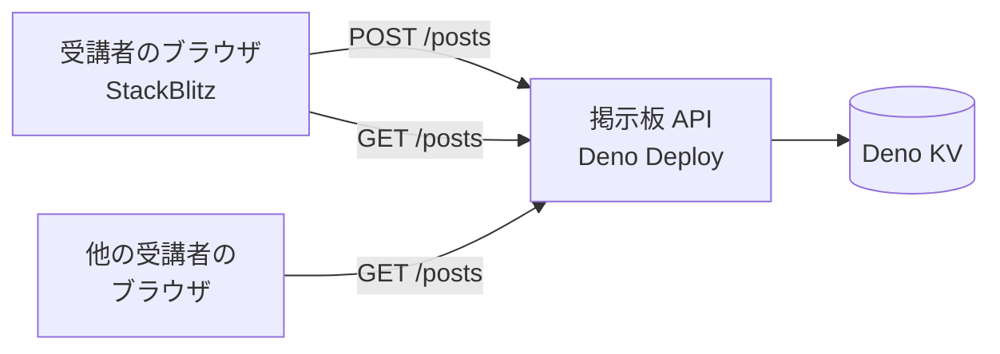

# 掲示板 API

2026年9月 オンライン開発ゼミ
初心者コース「みんなで書き込める掲示板を作ってみよう！」で、受講者が `fetch`
から叩くサーバーです。

受講者が書くのはブラウザ側の JavaScript
だけです。保存・CORS・投稿量の上限といった、講座で扱わない部分をこのサーバーが引き受けます。

## 全体像



受講者が投稿するとサーバーに保存され、他の受講者が更新ボタンを押すとその投稿が現れます。

## エンドポイント

すべてのリクエストに `room` クエリパラメータが必要です。

### 投稿の一覧を取る

```
GET /posts?room=sample
```

```json
[
  {
    "id": "1757480580000-a1b2c3d4",
    "name": "ゲスト",
    "text": "こんにちは",
    "createdAt": "2026-09-10T05:23:00.000Z"
  }
]
```

古い順に並びます。投稿が 1 件もなければ空の配列を返します。

一覧はオブジェクトで包まず、配列をそのまま返します。件数やページングを入れる予定がないためです。受講者のコードでは
`await res.json()` の結果をそのまま `for...of` に渡せます。

### 投稿する

```
POST /posts?room=sample
Content-Type: application/json

{ "name": "ゲスト", "text": "こんにちは" }
```

成功すると `201` と、作られた投稿 1 件を返します。

```json
{
  "id": "1757480580000-a1b2c3d4",
  "name": "ゲスト",
  "text": "こんにちは",
  "createdAt": "2026-09-10T05:23:00.000Z"
}
```

## フィールド

| フィールド  | 型     | 説明                                          |
| ----------- | ------ | --------------------------------------------- |
| `id`        | string | 投稿の識別子。`<ミリ秒>-<ランダム8桁>` の形式 |
| `name`      | string | 投稿者名。20 文字まで                         |
| `text`      | string | 本文。200 文字まで                            |
| `createdAt` | string | 投稿時刻。ISO 8601                            |

`createdAt` は ISO 8601 文字列で返します。受講者が `toLocaleTimeString`
で整形する題材にするためです。

`id` の先頭は投稿時刻のミリ秒です。Deno KV の `list`
はキーの辞書順で返るので、この形にしておくと並べ替えなしで古い順になります。同じミリ秒に届いた投稿どうしの順序は保証しません。20
人が同時にボタンを押す場面では同一ミリ秒の投稿が実際に発生しますが、その数件の並びが入れ替わるだけです。

## 部屋 (room)

`room`
は開催回ごとに投稿を分ける単位です。開催日など、回ごとに違う値を割り当てます。

1 回目の投稿が 2
回目に残らないようにするためのものです。当日に投稿が荒れた場合も、部屋を切り替えれば仕切り直せます。

受講者のコードでは定数 1 行として現れるだけです。

```js
const ROOM = "sample";
```

英数字とハイフン、32 文字までを受け付けます。指定がない場合と形式が不正な場合は
`400` を返します。

部屋はパスではなくクエリで渡します。部屋は掲示板というドメインの概念ではなく、開催回を分離する運用上の都合だからです。

## 制限

受講者のコードがループして大量に投稿される事故に備えたものです。受講者側のコードには何も足しません。

| 対象               | 上限     | 超えたとき         |
| ------------------ | -------- | ------------------ |
| `name`             | 20 文字  | 切り詰める         |
| `text`             | 200 文字 | 切り詰める         |
| 部屋あたりの投稿数 | 200 件   | 古いものから捨てる |

文字数はコードポイント単位で数えます。絵文字は 1
文字です。切り詰めでサロゲートペアが分断されて文字化けすることはありません。

`name` と `text` は前後の空白を取り除いたうえで、空文字なら `400`
を返します。切り詰めた結果の末尾に空白が残った場合も取り除きます。

レート制限は入れていません。正当な連投で弾かれると「なぜか動かない」の問い合わせが増えるためです。

## エラー

```json
{ "message": "room を指定してください" }
```

| ステータス | 状況                                                                                         |
| ---------- | -------------------------------------------------------------------------------------------- |
| `400`      | `room` の指定がない、形式が不正、`name` / `text` が空または文字列でない、JSON として読めない |
| `404`      | 存在しないパス                                                                               |
| `405`      | `/posts` に `GET` `POST` 以外のメソッド                                                      |

講座ではエラー処理を扱わないため、受講者がこの形を読むことはありません。

## CORS

すべてのレスポンスに `Access-Control-Allow-Origin: *` を付け、`OPTIONS`
のプリフライトに `204` を返します。受講者が使う StackBlitz の URL
がプロジェクトごとに変わるため、オリジンを固定できません。

## 開発

```sh
deno task dev     # http://localhost:8000 で起動
deno task test    # テスト（KV はメモリ上に作られる）
deno task check   # fmt / lint / 型チェック
```

テストはサーバーを起動せず `route`
を直接呼ぶので、ネットワーク権限を必要としません。

`KV_PATH` を指定するとその場所の KV を使います。テストでは `:memory:`
を渡してファイルを作らずに動かしています。指定しなければ Deno の既定の場所（Deno
Deploy 上では割り当てられた KV）を使います。

## ファイル

| ファイル       | 中身                                                        |
| -------------- | ----------------------------------------------------------- |
| `main.ts`      | サーバー本体。ルーティングは `route` 関数にまとまっています |
| `main_test.ts` | `route` を直接呼ぶテスト。サーバーを起動しません            |
| `deno.json`    | タスク定義                                                  |
