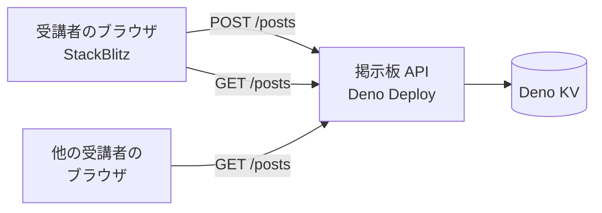

# 掲示板 API

2026年9月 オンライン開発ゼミ
初心者コース「みんなで書き込める掲示板を作ってみよう！」で、受講者が `fetch`
から叩くサーバーです。保存・CORS・投稿量の上限といった、講座で扱わない部分を引き受けます。



## エンドポイント

すべてのリクエストに `room` クエリパラメータが必要です。`room`
は開催回ごとに投稿を分ける単位で、英数字とハイフン 32 文字までです。

### `GET /posts?room=sample`

投稿の一覧を古い順に返します。1 件もなければ空の配列です。

```json
[
  {
    "id": "1757480580000-a1b2c3d4",
    "name": "ゲスト",
    "text": "こんにちは",
    "createdAt": "2026-09-10T05:23:00.000Z"
  }
]
```

### `POST /posts?room=sample`

```json
{ "name": "ゲスト", "text": "こんにちは" }
```

`Content-Type: application/json` で送ります。成功すると `201` と、作られた投稿 1
件を返します。

## フィールド

| フィールド  | 型     | 説明                                             |
| ----------- | ------ | ------------------------------------------------ |
| `id`        | string | `<ミリ秒>-<ランダム8桁>`。辞書順が時系列順になる |
| `name`      | string | 投稿者名。20 文字まで                            |
| `text`      | string | 本文。200 文字まで                               |
| `createdAt` | string | 投稿時刻。ISO 8601                               |

## 制限

| 対象               | 上限     | 超えたとき         |
| ------------------ | -------- | ------------------ |
| `name`             | 20 文字  | 切り詰める         |
| `text`             | 200 文字 | 切り詰める         |
| 部屋あたりの投稿数 | 200 件   | 古いものから捨てる |

文字数はコードポイント単位です（絵文字は 1 文字）。`name` と `text`
は前後の空白を取り除いたうえで、空文字なら `400`
を返します。レート制限はありません。

## エラー

```json
{ "message": "room を指定してください" }
```

| ステータス | 状況                                                                                  |
| ---------- | ------------------------------------------------------------------------------------- |
| `400`      | `room` がない / 形式が不正、`name` `text` が空または文字列でない、JSON として読めない |
| `404`      | 存在しないパス                                                                        |
| `405`      | `/posts` に `GET` `POST` 以外のメソッド                                               |

## CORS

すべてのレスポンスに `Access-Control-Allow-Origin: *` を付け、`OPTIONS`
のプリフライトに `204` を返します。受講者が使う StackBlitz の URL
がプロジェクトごとに変わるため、オリジンを固定できません。

## 開発

```sh
deno task dev     # http://localhost:8000 で起動
deno task test    # テスト（KV はメモリ上に作られる）
deno task check   # fmt / lint / 型チェック
```

`KV_PATH` を指定するとその場所の KV を使います。指定しなければ既定の場所（Deno
Deploy 上では割り当てられた KV）です。
