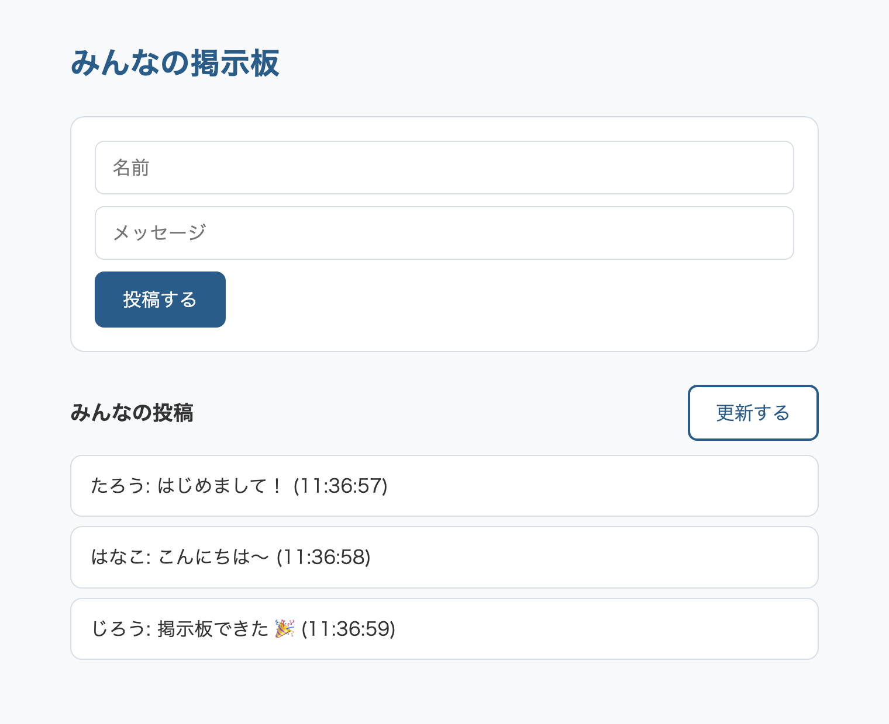
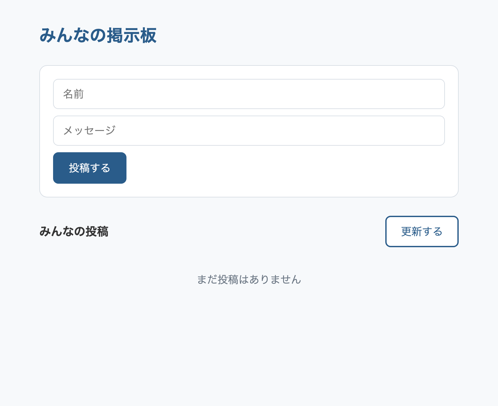
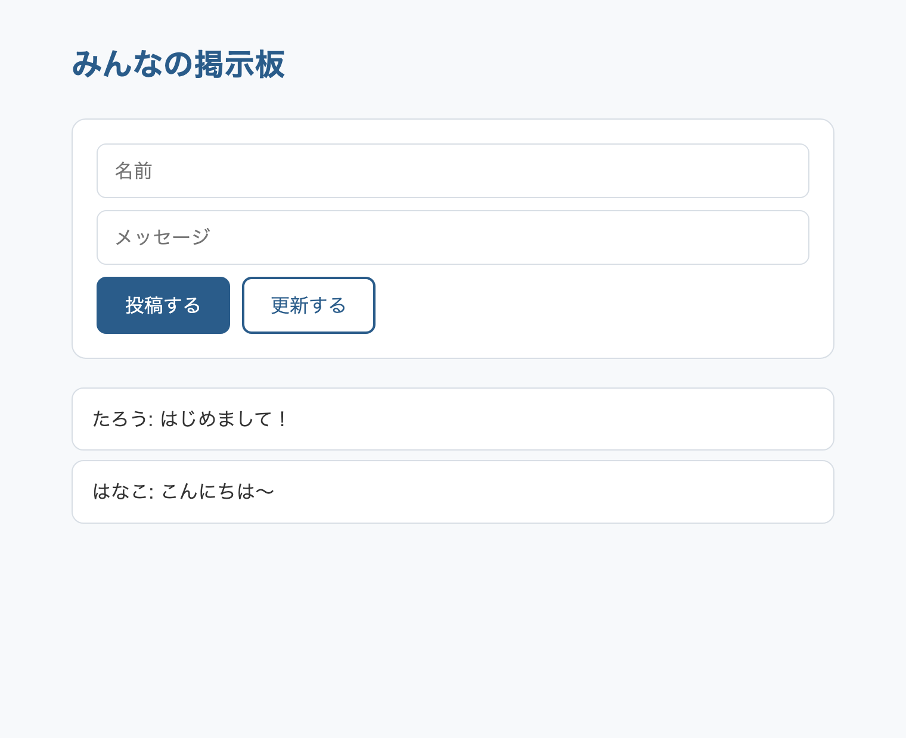
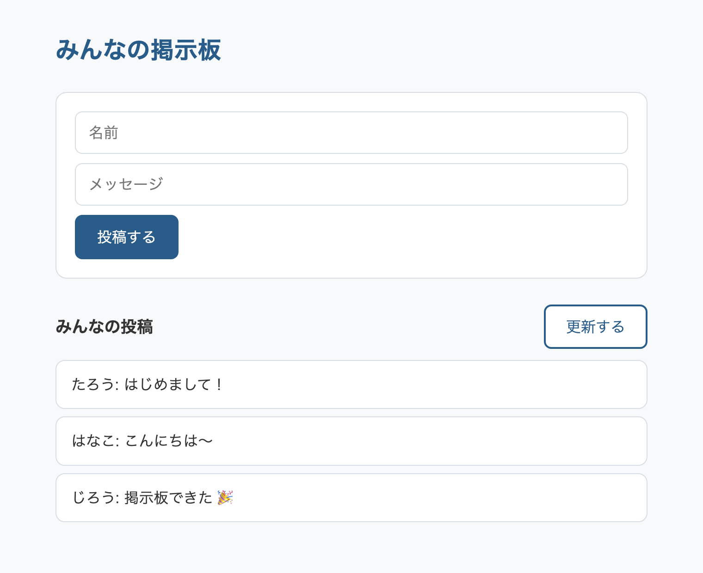

<!-- _class: lead -->

# みんなで書き込める**掲示板**を作ってみよう！

## JavaScript ではじめる Web アプリ開発

---

## 今日のゴール

### 書いた文字が、**他の人の画面にも出る**



- 名前とメッセージを書いて、投稿ボタンを押す
- 投稿が一覧に並ぶ
- 「更新する」を押すと、**他の人が書いた投稿も出てくる**
- ブラウザを閉じても投稿は消えない

---

## Webページは **3つの技術** でできている

| 技術 | 役割 |
|------|------|
| HTML | 構造 |
| CSS | 見た目 |
| **JavaScript** | **動き** |

HTML と CSS は用意済みです。今日書くのは **JavaScript** だけ。

そして今日は、そこに**サーバー**が加わります。

---

## 準備



1. ブラウザで StackBlitz のテンプレートを開く
   https://stackblitz.com/edit/board-beginner
2. 左上の **Fork** を押す（URL が自分専用のものに変わります）
3. `script.js` を開く
4. 1〜2行目の `API` と `ROOM` を、伝えられた値に書き換える

左にファイル、右にプレビューが並びます。今日書くのは `script.js` だけです。

テンプレートは「入力欄とボタンが並んだ、まだ何も動かない状態」から始まります。

---

## 今日の進め方

1. 書いた文字を画面に出す
2. サーバーってなに？
3. みんなの投稿を読み込む
4. 自分の投稿をサーバーに送る
5. 仕上げ

前半で「自分の画面の中だけで動く掲示板」を作り、後半でそれを**サーバーにつなぎ替え**ます。

---

<!-- _class: record -->

## スライドの見かた

### 右上に「記述」バッジ → 手を動かしてコードを書くスライド

**ハイライトあり** — ハイライトの部分だけを書く（足す・書き換える）。残りはそのまま

```javascript
function addPost() {
  const name = document.getElementById('name-input').value;
  @@const text = document.getElementById('text-input').value;@@
}
```

**ハイライトなし** — コードをそのまま写す

```javascript
document.getElementById('post-btn').addEventListener('click', addPost);
```

---

## 画面は **5つの部品** でできている

<div class="mock">
  <div class="part"><span class="empty">名前</span><span class="label">① 名前の入力欄</span></div>
  <div class="part"><span class="empty">メッセージ</span><span class="label">② メッセージの入力欄</span></div>
  <div class="part"><span class="btn">投稿する</span><span class="label">③ 投稿ボタン</span></div>
  <div class="part"><span class="row"><span>みんなの投稿</span><span class="btn">更新する</span></span><span class="label">④ 更新ボタン</span></div>
  <div class="part"><span class="empty">（まだ何もありません）</span><span class="label">⑤ 投稿の一覧</span></div>
</div>

この5つを JavaScript から動かしていきます。

---

## HTML（`index.html`）との対応

JavaScript から部品を呼ぶために、HTML には `id` が付いています。

| id | 部品 |
|----|------|
| `name-input` | ① 名前の入力欄 |
| `text-input` | ② メッセージの入力欄 |
| `post-btn` | ③ 投稿ボタン |
| `reload-btn` | ④ 更新ボタン |
| `posts` | ⑤ 投稿の一覧（`<ul>`） |

`id` = 部品につけた名札。JavaScript はこの名札を頼りに部品を探します。

---

<!-- _class: lead -->

# Chapter 1

## 書いた文字を画面に出そう

---

## この章のゴール

### 自分の画面の中だけで動く掲示板を作る

- 投稿ボタンを押す → 書いた文字が一覧に並ぶ
- 何件でも増えていく

まだサーバーは使いません。ページを再読み込みすると消えます。

そこを Chapter 2 以降で解決していきます。

---

## 1-1. 関数 — 処理に名前をつける

### まとめておいて、あとから名前で呼び出す

```javascript
function sayHello() {
  alert('こんにちは');
}

sayHello();   // ← ここではじめて中身が実行される
```

`function 名前() { ... }` で作り、`名前()` で呼び出します。

作っただけでは何も起きません。呼ばれたときにはじめて中身が動きます。

では、誰が呼ぶのか。今日は**ボタンが押されたとき**に呼ばせます。

---

## 1-1. 部品を探して、押されたときに動かす

### ボタンに「押されたらこの関数を呼んで」と頼んでおく

**`document.getElementById('名札')`** = 名札で HTML の部品を探す

**`部品.addEventListener('きっかけ', 関数)`** = きっかけが起きたら関数を動かす

<div class="columns">
<div>

```html
<button id="ok-btn">OK</button>
```

```javascript
const button =
  document.getElementById('ok-btn');

button.addEventListener('click', sayHello);
```

</div>
<div>

| きっかけ | いつ起きるか |
|---|---|
| `'click'` | クリックされたとき |
| `'input'` | 入力欄の文字が変わったとき |
| `'change'` | 選択や入力が確定したとき |

</div>
</div>

書いた時点では、まだ何も動きません。実際にボタンが押された瞬間に `sayHello` が呼ばれます。

---

<!-- _class: record -->

## 1-1. ボタンを押したら反応させよう

<div class="timer-box" data-seconds="180">
  <button class="timer-btn" data-delta="-60">−</button>
  <div class="timer"></div>
  <button class="timer-btn" data-delta="60">＋</button>
</div>

### まず「押したら何か起きる」を確かめる

**書く場所** — `script.js` のいちばん下

```javascript
function addPost() {
  alert('投稿ボタンが押されました！');
}

document.getElementById('post-btn').addEventListener('click', addPost);
```

**成功** — 「投稿する」を押すとメッセージが出る

---

## 1-2. 入力された文字を使うには

### 決めうちのメッセージではなく、書かれた文字を出したい

**`部品.value`** = 入力欄に書かれている文字。部品そのものではなく「中身」

**バッククォート `` ` `` の文字列** = `${ }` の中に変数を差し込める

```javascript
const name = document.getElementById('name-input').value;   // 'たろう'

`${name} さん`   // → 'たろう さん'
'name さん'      // → 'name さん'（差し込まれない）
```

差し込みが要らないときは、ふつうの `'` で書きます。

---

<!-- _class: record -->

## 1-2. 入力欄の文字を取り出そう

<div class="timer-box" data-seconds="240">
  <button class="timer-btn" data-delta="-60">−</button>
  <div class="timer"></div>
  <button class="timer-btn" data-delta="60">＋</button>
</div>

### 決めうちのメッセージではなく、入力された文字を使う

**書く場所** — `addPost` の中を丸ごと置き換え

```javascript
function addPost() {
  const name = document.getElementById('name-input').value;
  const text = document.getElementById('text-input').value;

  alert(`${name} さん: ${text}`);
}
```

**成功** — 名前とメッセージを入力して押すと、その中身が出る

---

## 1-3. 投稿を画面に並べる

### `<li>` を作って `<ul id="posts">` に入れる

投稿1件が `<li>` 1行になります。

```html
<ul id="posts">
  <li>たろう: はじめまして！</li>   <!-- これを JavaScript で作る -->
</ul>
```

| やること | 書き方 |
|---|---|
| ① `<li>` を作る | `document.createElement('li')` |
| ② 文字を入れる | `item.textContent = '...'` |
| ③ `<ul>` に入れる | `list.appendChild(item)` |

作っただけでは画面に出ません。③ で入れ先を指定して、はじめて表示されます。

---

<!-- _class: record -->

## 1-3. 投稿を画面に出そう

<div class="timer-box" data-seconds="360">
  <button class="timer-btn" data-delta="-60">−</button>
  <div class="timer"></div>
  <button class="timer-btn" data-delta="60">＋</button>
</div>

### `alert` をやめて、一覧に並べる

**書く場所** — `addPost` の中を丸ごと置き換え

```javascript
function addPost() {
  const name = document.getElementById('name-input').value;
  const text = document.getElementById('text-input').value;

  const item = document.createElement('li');
  item.textContent = `${name}: ${text}`;
  document.getElementById('posts').appendChild(item);
}
```

**成功** — 投稿するたびに、下の一覧に行が増えていく

---

## 動作チェック



### 2つとも当てはまれば Chapter 1 は完了です

1. 名前とメッセージを入れて「投稿する」を押すと、一覧に1行増える
2. もう一度投稿すると、2行になる（前の行が消えない）

### プレビューを更新してみてください

投稿が**全部消えます**。ここが次の章の出発点です。

---

<!-- _class: lead -->

# Chapter 2

## サーバーってなに？

---

## いまの掲示板

### 投稿は「自分のブラウザの中」にしかない

- ページを再読み込みすると消える
- 他の人のブラウザには出ない

`posts` という配列は、開いているページの中にだけあります。ページを閉じれば一緒に消えます。

この2つは、投稿を**自分のブラウザの外**に置けば解決します。ページを閉じても残っていて、他の人からも読める場所が要ります。

---

## サーバー = **頼まれたら答えるプログラム**

<div class="flow">
  <div class="box">あなたの<br>ブラウザ</div>
  <div class="arrow">⇄</div>
  <div class="box">サーバー<span class="note">動かしっぱなし</span></div>
  <div class="arrow">⇄</div>
  <div class="box">ほかの人の<br>ブラウザ</div>
</div>

- 「投稿を全部ください」と頼まれたら、返す
- 「この投稿を保存して」と頼まれたら、保存する

ブラウザは開いている間しか動きません。サーバーはいつ頼まれても答えられるように、動かしっぱなしにしてあります。あなたがページを閉じている間も、他の人からの依頼に答えています。

---

## 投稿そのものは **データベース** に入る

### サーバーは受け取った投稿をデータベースに預ける

データベース = データを保存しておくための専用のソフト

<div class="flow">
  <div class="box">ブラウザ<span class="note">投稿を送る</span></div>
  <div class="arrow">→</div>
  <div class="box">サーバー<span class="note">受け取る</span></div>
  <div class="arrow">→</div>
  <div class="box">データベース<span class="note">保存する</span></div>
</div>

投稿が消えないのは、最後にここへ届いているからです。サーバーを入れ替えても、データベースの中身は残ります。

---

## 今日のサーバーは **用意済み** です

### 書くのはブラウザ側だけ

サーバーとデータベースはこちらで動かしてあります。今日は、動いているサーバーに話しかけるところまでをやります。

サーバーのコードも公開しています。中身が気になる人は、資料のリポジトリの `2026/board/backend/` を見てください。

- 200 行ほどの JavaScript（TypeScript）です
- 「投稿を返す」「投稿を保存する」の2つしか書いてありません

---

## サーバーとのやりとりに使う **2つのメソッド**

メソッド = サーバーへの頼み方の種類

| やること | 呼び方 |
|---|---|
| 置いてあるデータを**取ってくる** | **GET** |
| 新しいデータを**送る** | **POST** |

今日の掲示板では、この2つを使います。

- 投稿の一覧を読み込む → **GET**
- 自分の投稿を書き込む → **POST**

---

## やりとりの中身は **JSON** という形

JSON = データを文字列で表すための、共通の書き方です。

```json
[
  { "name": "たろう", "text": "はじめまして" },
  { "name": "はなこ", "text": "こんにちは" }
]
```

JavaScript の配列とオブジェクトによく似ています。

やりとりできるのは**文字列**だけです。JavaScript の配列やオブジェクトをそのまま送れないので、いったんこの形にしてやりとりします。

---

## `fetch` — サーバーに話しかける命令

```javascript
const res = await fetch('https://.../posts?room=sample');
const posts = await res.json();
```

| 行 | やっていること |
|---|---|
| `fetch(...)` | この住所（URL）に GET でとりにいく |
| `res` | 返ってきた**返事そのもの** |
| `res.json()` | 返事の中身を **JavaScript の配列やオブジェクト**として取り出す |

---

## `await` — **待つ印**

### サーバーとのやりとりには時間がかかる

サーバーは別の場所にあります。頼んでから返事が届くまでの時間は、ページの中だけで済む処理とは桁が違います。「返事が届くまで待つ」と書かないと、届く前に次の行へ進んでしまいます。

**ルールは2つ**

1. `fetch` と `res.json()` には `await` を付ける
2. `await` を使う関数には `async` を付ける

```javascript
async function showPosts() {
  const res = await fetch('...');
}
```

---

## `await` を忘れるとどうなるか

```javascript
const posts = res.json();          // await なし
console.log(posts);
```

```
Promise { <pending> }
```

中身の代わりに「まだ準備中です」という札が返ってきます。

この表示を見たら、`await` の付け忘れを疑ってください。今日いちばん出やすいエラーです。

---

<!-- _class: lead -->

# Chapter 3

## みんなの投稿を読みこもう

---

## 3-1. 一覧を並べるのに使う書き方

### サーバーからは、投稿が**配列**で返ってきます

```javascript
[
  { name: 'たろう', text: 'はじめまして' },
  { name: 'はなこ', text: 'こんにちは' },
]
```

**配列** = データを順番に並べたリスト

**オブジェクト** `{ name: ..., text: ... }` = 名前つきのデータのまとまり

**`for...of`** = リストの中身を1つずつ取り出して繰り返す

**`list.textContent = ''`** = 中身を空にする。表示のたびに全部消してから並べ直す

---

<!-- _class: record compact -->

## 3-1. `showPosts()` を作ろう

<div class="timer-box" data-seconds="480">
  <button class="timer-btn" data-delta="-60">−</button>
  <div class="timer"></div>
  <button class="timer-btn" data-delta="60">＋</button>
</div>

### サーバーから投稿を取ってきて、一覧に並べる

**書く場所** — `script.js` の `addPost` より前

```javascript
async function showPosts() {
  const res = await fetch(`${API}/posts?room=${ROOM}`);
  const posts = await res.json();

  const list = document.getElementById('posts');
  list.textContent = '';

  for (const post of posts) {
    const item = document.createElement('li');
    item.textContent = `${post.name}: ${post.text}`;
    list.appendChild(item);
  }
}
```

まだ呼んでいないので、画面は変わりません。

---

<!-- _class: record -->

## 3-2. 読み込むきっかけを作ろう

<div class="timer-box" data-seconds="180">
  <button class="timer-btn" data-delta="-60">−</button>
  <div class="timer"></div>
  <button class="timer-btn" data-delta="60">＋</button>
</div>

### 読み込むきっかけを2つ作る

**書く場所** — `script.js` のいちばん下

```javascript
document.getElementById('reload-btn').addEventListener('click', showPosts);

showPosts();
```

**成功** — ページを開いた時点で、すでに誰かの投稿が並んでいる

いちばん下の `showPosts()` は、ページを開いた瞬間に1回だけ実行するためのものです。同じ関数を2か所から呼べるのが、処理に名前をつけておく利点です。

---

## 動作チェック



### 2つとも当てはまれば Chapter 3 は完了です

1. ページを開くと、**自分が投稿したものではない投稿**が並んでいる
2. 「投稿する」を押すと画面に1行増えるが、「更新する」を押すと**消える**

### 2番はなぜ消えるのか

いまの「投稿する」は画面に足しているだけで、サーバーには何も送っていません。だから読み直すと消えます。次の章で送る側を作ります。

---

<!-- _class: tips -->

## 他の人が書いた文字を、そのまま出していいのか

### いま画面に並んでいるのは、他の人が書いた文字です

`showPosts` では `textContent` を使っています。似たものに `innerHTML` があり、違いは**書かれた文字を HTML として解釈するかどうか**です。

| 書き方 | `<b>あ</b>` と投稿されたら |
|---|---|
| `textContent` | `<b>あ</b>` と、そのまま表示される |
| `innerHTML` | **あ** と太字になる（HTML として実行される） |

`innerHTML` だと、他人の書いた文字に自分のページを勝手に書き換えられます。文字を表示するつもりが、命令を実行させてしまいます。

**掲示板やコメント欄では `textContent`** を使います。

---

<!-- _class: lead -->

# Chapter 4

## 自分の投稿をサーバーに送ろう

---

## 送るときは、取るときより少し長い

### 「どこへ」だけでなく「何を」「どうやって」を伝える

```javascript
await fetch(URL, {
  method: 'POST',
  headers: { 'Content-Type': 'application/json' },
  body: JSON.stringify({ name: name, text: text }),
});
```

| 書くもの | 伝えていること |
|---|---|
| `method: 'POST'` | **どうやって** — 取りにいくのではなく、送る |
| `headers` | **どうやって** — 中身は JSON です、という申告 |
| `body` | **何を** — 送るデータそのもの |

---

## `JSON.stringify` — オブジェクトを文字列にする

サーバーとやりとりできるのは文字列だけです。オブジェクトのままでは送れません。

```javascript
const data = { name: 'たろう', text: 'やっほー' };

JSON.stringify(data);
// → '{"name":"たろう","text":"やっほー"}'
```

送るとき（`JSON.stringify`）と、受け取るとき（`res.json()`）で、ちょうど逆のことをしています。

---

<!-- _class: record compact -->

## 4-1. `addPost()` を書き換えよう

<div class="timer-box" data-seconds="480">
  <button class="timer-btn" data-delta="-60">−</button>
  <div class="timer"></div>
  <button class="timer-btn" data-delta="60">＋</button>
</div>

### 画面に直接足すのをやめて、サーバーに送る

**書く場所** — `addPost` を丸ごと置き換え（前のものは消す）

```javascript
async function addPost() {
  const name = document.getElementById('name-input').value;
  const text = document.getElementById('text-input').value;

  await fetch(`${API}/posts?room=${ROOM}`, {
    method: 'POST',
    headers: { 'Content-Type': 'application/json' },
    body: JSON.stringify({ name: name, text: text }),
  });

  document.getElementById('text-input').value = '';
  showPosts();
}
```

**成功** — 投稿すると一覧に自分の投稿が出て、メッセージ欄が空になる

---

## 動作チェック


### 掲示板の完成です

1. 投稿すると、一覧に自分の投稿が出る
2. プレビューを更新しても消えない
3. しばらく待ってから「更新する」を押すと、**他の参加者の投稿**が増えている

3番が確認できたら、あなたの書いたコードが**インターネットの向こう側とやりとりしている**ということです。全員が同じ掲示板を見ているので、自分の投稿も他の参加者の画面に出ています。

---

<!-- _class: lead -->

# 完成！

## みんなで書き込める掲示板ができました

---

<!-- _class: lead -->

# Chapter 5

## 仕上げをしよう

---

## 5-1. サーバーが返している時刻の形

```json
{ "name": "たろう", "text": "やっほー", "createdAt": "2026-09-10T05:23:00.000Z" }
```

これは世界中どこでも同じ意味になるように決められた書き方で、人が読むには向いていません。

| 書き方 | 結果 |
|---|---|
| `new Date('2026-09-10T05:23:00.000Z')` | 日付として扱えるようにする |
| `.toLocaleTimeString()` | **見ている人の地域の時刻**に合わせる → `14:23:00` |

日付ごと出したいときは `.toLocaleString()` を使います。

---

<!-- _class: record -->

## 5-1. 投稿の時刻を表示しよう

<div class="timer-box" data-seconds="180">
  <button class="timer-btn" data-delta="-60">−</button>
  <div class="timer"></div>
  <button class="timer-btn" data-delta="60">＋</button>
</div>

### サーバーは投稿された時刻も返しています

**書く場所** — `showPosts` の `for` の中。**1行足して、1行書き換える**

```javascript
  for (const post of posts) {
    const item = document.createElement('li');
    @@const time = new Date(post.createdAt).toLocaleTimeString();@@
    @@item.textContent = `${post.name}: ${post.text} (${time})`;@@
    list.appendChild(item);
  }
```

**成功** — 各投稿のうしろに `14:23:05` のような時刻が付く

---

## 5-2. 名前を変えて投稿してみよう


### 動くようになったら、遊んでみてください

- 名前を変えて投稿する
- 絵文字を入れてみる
- 長い文章を投稿してみる（一定の長さで切られます）
- 空のまま投稿してみる（送られません）

サーバー側には「1つの掲示板に置ける投稿は200件まで」という制限があります。古いものから順に消えていきます。

---

<!-- _class: lead -->

# 発展課題

## 余裕がある人はチャレンジ！

---

<!-- _class: record -->

## 発展①：自動で更新されるようにする

### 「更新する」を押さなくても、新しい投稿が流れてくる

**書く場所** — `script.js` のいちばん下

```javascript
setInterval(showPosts, 10000);
```

`setInterval(関数, ミリ秒)` = 決まった間隔で、関数を何度も実行する

10000 ミリ秒 = 10秒ごとに `showPosts()` が呼ばれます。

**成功** — 何も押さなくても、他の人の投稿が出てくる

---

## 発展①：この書き方の弱点

### 新しい投稿がなくても、10秒ごとに聞きにいっている

<div class="flow">
  <div class="box">ブラウザ<span class="note">新着ある？</span></div>
  <div class="arrow">→</div>
  <div class="box">サーバー<span class="note">ないよ</span></div>
</div>

これを**ポーリング**といいます。間隔を短くするほど無駄な通信が増えます。

逆に、サーバーの側から「来たよ」と教えてくるやり方もあります。

- **SSE** — サーバーからの一方通行のお知らせ
- **WebSocket** — つなぎっぱなしにして双方向にやりとりする

---

## 発展②：投稿を新しい順に並べる

### いまは古い順に並んでいます

`showPosts` の `for` の前に、1行足すと逆順になります。

```javascript
posts.reverse();
```

`reverse()` = 配列の並びをひっくり返す

SNS のタイムラインはたいてい新しい順です。どちらが読みやすいか、実際に切り替えて比べてみてください。

---

## 困ったときは

### 投稿しても何も起きない

- `Console` に `Promise { <pending> }` が出ていないか → `await` の付け忘れ
- 関数の頭に `async` は付いているか

### 一覧が空のまま

- 1〜2行目の `API` と `ROOM` が、伝えられた値になっているか
- `showPosts()` を `script.js` のいちばん下に書いたか

### 何を試してもだめなとき

エラーの内容と、書いたコードをそのままチャットに貼ってください。

---

## 今日学んだこと

| やったこと | 使ったもの |
|---|---|
| 部品を探して、中身を取り出す | `getElementById` / `.value` |
| ボタンが押されたら動かす | `addEventListener` |
| 画面に部品を足す | `createElement` / `textContent` / `appendChild` |
| サーバーからデータを取る | `fetch` / `res.json()` / **GET** |
| サーバーにデータを送る | `fetch` / `JSON.stringify` / **POST** |
| 返事を待つ | `async` / `await` |

---

<!-- _class: lead -->

# おつかれさまでした！

## 自分の書いたコードが、他の人の画面を動かしました

<script>
document.querySelectorAll('.timer-box').forEach(box => {
  const el = box.querySelector('.timer');
  const initial = Number(box.dataset.seconds);
  let remain = initial;
  let id = null;

  const render = () => {
    const r = Math.max(remain, 0);
    const m = String(Math.floor(r / 60)).padStart(2, '0');
    const s = String(r % 60).padStart(2, '0');
    el.textContent = `${m}:${s}`;
    el.classList.toggle('warn', remain <= 60 && remain > 0);
    el.classList.toggle('done', remain <= 0);
  };
  const stop = () => { clearInterval(id); id = null; el.classList.remove('running'); };
  const start = () => {
    if (remain <= 0) return;
    el.classList.add('running');
    id = setInterval(() => {
      remain--;
      render();
      if (remain <= 0) stop();
    }, 1000);
  };

  el.addEventListener('click', () => {
    if (remain <= 0) { el.classList.remove('done'); return; }
    id ? stop() : start();
  });
  el.addEventListener('contextmenu', e => {
    e.preventDefault();
    stop();
    remain = initial;
    render();
  });
  box.querySelectorAll('.timer-btn').forEach(btn => {
    btn.addEventListener('click', () => {
      remain = Math.max(0, remain + Number(btn.dataset.delta));
      render();
    });
  });
  render();
});
</script>
