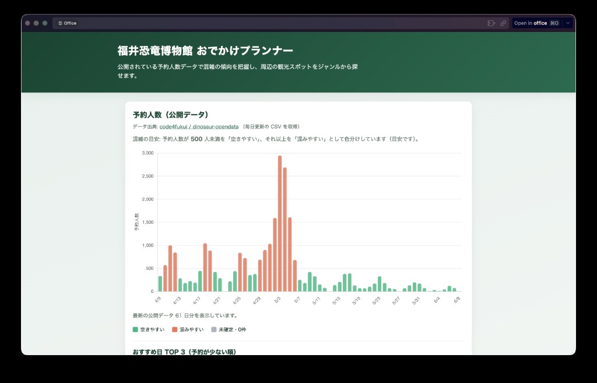
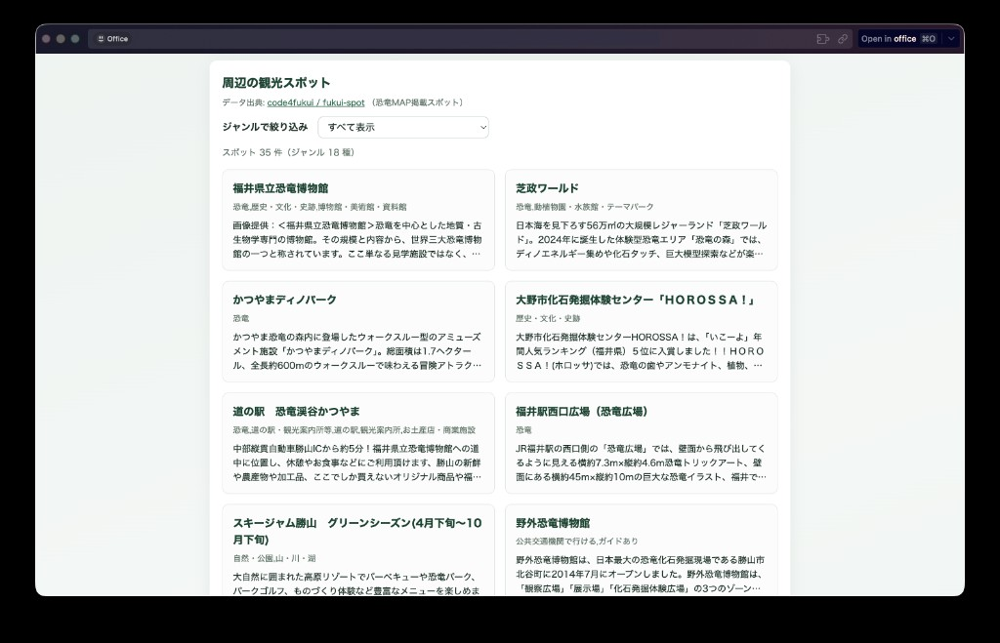
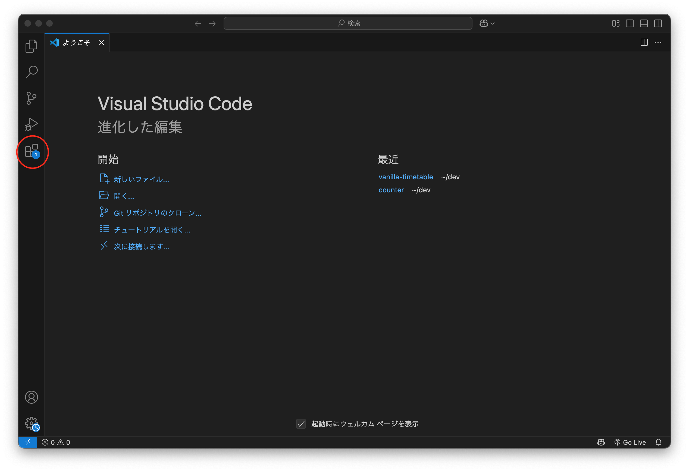
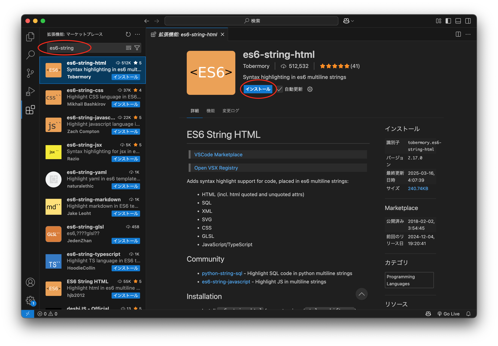

<!-- _class: lead -->

# オープンデータで課題を解決する<br>Web アプリ開発

---

## 本日のゴール

**オープンデータを使って「課題を解決する Web アプリ」を作れるようになる！**

「GW に恐竜博物館に行きたいけど、いつが空いてる？」  
→ **データで調べて、アプリで見える化する**

<div style="display: flex; gap: 16px; margin-top: 20px; align-items: flex-start;">
  
  
</div>

---

## もくじ

| #   | 内容                                                       | 時間 |
| --- | ---------------------------------------------------------- | ---- |
| 1   | **VSCode を使ってみよう** ― 開発の準備をする               | 15分 |
| 2   | **Web ページの三本柱** ― HTML・CSS・JavaScript             | 15分 |
| 3   | **問いを立てる** ― 身近な問題から考える                    | 45分 |
| 4   | **Chart.js でグラフ** ― データを見える化する               | 55分 |
| 5   | **fetch と async/await** ― データを自動で取得する          | 55分 |
| 6   | **観光スポット一覧** ― DOM 操作と filter                   | 45分 |
| 7   | **色分けと TOP 3** ― 直感的な UI を作る                    | 30分 |
| 8   | **公開 API でおすすめ日を作る** ― CSV のつぎに JSON を足す | 40分 |
| 9   | **改善タイム・発表** ― グループ内で共有                    | 60分 |

---

<!-- _class: lead -->

# 1. VSCode を使ってみよう

## 今日の開発環境に慣れる

---

## VSCode って何をするアプリ？

[Visual Studio Code](https://code.visualstudio.com/) は、  
HTML・CSS・JavaScript などのコードを書くためのエディタ

今日の実習では主にこれを使う：

- ファイルを開いて編集する
- 保存してコードを整える
- ブラウザで表示を確認する
- エラーや警告を見つける

---

## まず入れておくと便利な拡張機能

| 拡張機能                                                                                                                               | 何に使うか                                                        |
| :------------------------------------------------------------------------------------------------------------------------------------- | :---------------------------------------------------------------- |
| [Live Server](https://marketplace.visualstudio.com/items?itemName=ritwickdey.LiveServer)                                               | HTML をローカルサーバーで開き、保存内容をすぐブラウザで確認できる |
| [Prettier - Code formatter](https://marketplace.visualstudio.com/items?itemName=esbenp.prettier-vscode)                                | 保存時にコードの見た目をそろえやすい                              |
| [Japanese Language Pack for Visual Studio Code](https://marketplace.visualstudio.com/items?itemName=MS-CEINTL.vscode-language-pack-ja) | VSCode を日本語表示にできる                                       |

左側の四角いアイコンから拡張機能パネルを開く

---

## 拡張機能パネルを開く

左側のサイドバーにある  
**拡張機能アイコン** をクリックする



---

## 拡張機能を検索してインストール

検索窓に拡張機能名を入力して、  
表示された候補の **インストール** を押す



---

## おすすめのワークスペース設定

コマンドパレット `Ctrl(cmd) + Shift + P` から  
`基本設定: ワークスペース設定を開く (JSON)` を選ぶ

```json
{
  "editor.wordWrap": "on",
  "editor.formatOnSave": true,
  "editor.defaultFormatter": "esbenp.prettier-vscode",
  "editor.renderWhitespace": "all",
  "editor.tabSize": 2,
  "editor.minimap.enabled": false
}
```

---

## おすすめのワークスペース設定（つづき）

次のような効果があります。

- 長い行を折り返して見やすくする
- 保存時に Prettier で自動整形する（拡張機能を入れたうえで）
- 空白やインデントを見やすくする
- ミニマップを消して画面を広く使う

---

## 今日の VSCode の使い方

1. `index.html` `styles.css` `app.js` を開く
2. コードを書いたら `Ctrl(cmd) + S` で保存する
3. `index.html` を Live Server で開いてブラウザ確認
4. 表示がおかしいときは VSCode とブラウザの Console を見る

**「編集する場所」と「実行結果を見る場所」を行き来する** のが基本

---

<!-- _class: lead -->

# 2. Web ページの三本柱

## HTML・CSS・JavaScript

---

## Web ページを構成する 3 つの技術

| 技術           | 一言で言うと | 担当する仕事                                       |
| :------------- | :----------- | :------------------------------------------------- |
| **HTML**       | 骨格         | 「何が」あるかを定義する（見出し・ボタン・表など） |
| **CSS**        | 見た目       | 「どう見せるか」を決める（色・大きさ・レイアウト） |
| **JavaScript** | 動き         | 「どう動くか」を書く（データ取得・計算・画面更新） |

> たとえると、HTML は部屋に置く家具や配置、CSS は壁紙やインテリア、  
> JavaScript はスイッチを押したら電気がつくような「動くしくみ」

---

## 今日作るアプリのファイル構成

```
index.html   ← 骨格（グラフ用 canvas、スポット一覧の枠など）
styles.css   ← 見た目（2カラムレイアウト、カードのスタイル）
app.js       ← 動き（データ取得・グラフ描画・スポット絞り込み）
```

**開発者ツール（F12）で確認しよう**

1. Elements タブで HTML 構造を眺める
2. `<canvas id="reservation-chart">` を探す
3. Console タブにエラーがないか確認

---

<!-- _class: lead -->

# 3. 問いを立てる

## 身近な問題から<br>「データで判断したいこと」を考える

---

## 今日使うオープンデータ

| データ                                                               | 内容                                             | 提供元         |
| :------------------------------------------------------------------- | :----------------------------------------------- | :------------- |
| [dinosaur-opendata](https://github.com/code4fukui/dinosaur-opendata) | 恐竜博物館の 60 日先までの予約人数（毎日更新）   | Code for FUKUI |
| [fukui-spot](https://github.com/code4fukui/fukui-spot)               | 福井県の観光スポット（名前・ジャンル・位置情報） | Code for FUKUI |

**オープンデータ** ＝ 誰でも自由に使えるデータ

「データがあるからアプリが作れる」という発想の転換が大切

---

## まずは身近な問題を出してみよう

- いつ行けば空いているかわからない
- どの時間帯が混むのかわからない
- 近くに何があるのか調べるのが大変
- 「なんとなく」で決めてしまって失敗する

**ポイント：**

「どんなデータがあるか」より先に、  
**何を判断したいか** を考える

---

## 今日のデータで試せる問いに絞る

- 自分の困りごとをそのまま全部は作れない
- でも、**近い形で解ける問い** にはできる

たとえば今日なら：

- 「いつ行けば空いている？」 → 恐竜博物館の予約データ
- 「その前後にどこへ寄れる？」 → 周辺観光スポットのデータ

**問いが決まったら、次は見える化する**

---

<!-- _class: lead -->

# 4. Chart.js でグラフ

## 数字をビジュアルに変える

---

## まず：`template/` から土台をコピーする

教材リポジトリの **`template/`** から、次の **3 ファイル**を自分の作業フォルダへ**コピー**して始めます（フォルダごとコピーでもよい）。

- `index.html`
- `styles.css`
- `app.js`（この時点では Chart のコードはまだ入っていません）

VSCode でフォルダを開き、Live Server で `index.html` を表示できる状態にします。

---

## Chart.js とは

**Web で広く使われるグラフライブラリのひとつ**

インターネット上の 1 ファイルを、`index.html` から `<script src="...">` で読み込むだけで使い始められます。  
**Chart.js を先に読み込んでから** `app.js` を読み込みます（順番が逆だと `Chart` が未定義になります）。

---

## `data` の構造を理解する

```javascript
{
  labels: ["5/1", "5/2", "5/3"],   // 横軸ラベル（文字列の配列）
  datasets: [{
    label: "予約人数",              // 凡例に表示される名前
    data: [120, 300, 2502],        // 棒の高さ（数値の配列）
    backgroundColor: "green",     // 棒の色
  }],
}
```

**`labels` と `data` の長さは必ず一致させる**

---

## `app.js` では配列から動的に作る

```javascript
// app.js の buildOrUpdateChart() より
const labels = rows.map((r) => formatDateLabel(r.date_visit)); // 日付 → "M/D"
const data = rows.map((r) => r.n_people); // 予約人数
const backgroundColor = rows.map((r) => barColor(r.n_people)); // 色分け
```

`map` で配列の全要素に変換処理を適用している

→ CSV から読んだ全日分が自動でグラフに入る

---

## ハンズオン：パート 4 のメソッドを 1 つずつ有効にする

ここで触っているのは、**予約人数グラフ**を作るための処理です。  
「横軸の文字」と「実際に描く処理」を順番に有効にします。  
**色分けはまだ入れず**、パート 7 で追加します。

---

## ハンズオン：パート 4 のメソッド一覧

### `[4-1] formatDateLabel` 【記述】

- 何に対する処理か: **グラフの横軸の日付**
- なぜ必要か: CSV の `2026-05-03` をそのまま出すと長いので、`5/3` にして見やすくする
- 確認: console に `"2026-05-03" -> "5/3"` が出る

**`app.js` の `// STUDENT:` の指示を読み、次の条件を満たすコードを書いてください。**

1. `"-"` で分割して月（`m`）と日（`d`）を取り出す
2. 先頭ゼロをなくす（`"05"` → `5`）
3. `"M/D"` 形式の文字列を返す

---

### `[4-2] buildOrUpdateChart` 【解除】

- 何に対する処理か: **予約人数グラフ全体**
- なぜ必要か: 横軸・人数をまとめて Chart.js に渡し、まずは**単色の棒グラフ**を描く
- 確認: サンプル 3 日分の棒グラフが画面に出る（この時点ではまだ色分けしない）

`app.js` の `/*` と `*/` の行を削除して有効にする

---

## ハンズオン：2 種類の有効化

関数によって手順が違います。

| 種類 | 見分け方 | やること |
| :--- | :------- | :------- |
| **【記述】** | 関数の中に `// STUDENT:` がある | 条件を読み、コードを自分で書く |
| **【解除】** | 関数が `/*` … `*/` で囲まれている | `/*` と `*/` の行を削除する |

---

## ハンズオン：【解除】の手順

```
// 外す前
/*
function buildOrUpdateChart(...) { ... }
*/

// 外した後（/* と */ の行だけ削除）
function buildOrUpdateChart(...) { ... }
```

複数をまとめて外さず、**スライドに出てきた順で 1 つずつ**進める

---

<!-- _class: lead -->

# 5. fetch と async/await

## データを自動で取ってくる

---

## なぜ `fetch` が必要になったか

今まで：グラフのデータを **ハードコード**（コードに直書き）していた

```javascript
data: [120, 300, 2502, 1800, 400],  // 手で書いたデータ
```

問題：

- データが古くなっても自動で更新されない
- 60 日分のデータを手で書くのは大変

**→ URL からデータを自動で取ってきたい！**

---

## `fetch` の基本

```javascript
// URL を渡すとデータが返ってくる
const response = await fetch("https://example.com/data.csv");
const text = await response.text();
console.log(text); // CSV のテキスト
```

`fetch` はネットワーク越しにデータを取得する組み込み関数  
`response.text()` でテキストとして受け取る

---

## `async` / `await` とは

イメージ: **フードコートで料理を待つ**のに近い

- 注文する → `fetch(...)`
- できあがるまで待つ → `await`
- 料理を受け取って食べ始める → `res.text()` や `res.json()`

「待つ必要がある処理」を、上から順に読みやすく書けるのが `async` / `await`

---

## `async` / `await` のコード例

```javascript
async function loadData() {
  // async をつけると await が使える
  const res = await fetch(URL); // ← ここで待つ
  const text = await res.text(); // ← テキストが届いたら進む
  console.log(text);
}

loadData(); // 呼び出し
```

**`await` は `async` 関数の中でしか使えない**

---

## CSV テキストを配列に変換する

```javascript
function parseDinoCsv(text) {
  const normalized = text.trim().replaceAll("\r", "");
  const lines = normalized.split("\n");
  const rows = lines
    .slice(1)
    .filter((line) => line !== "")
    .map((line) => {
      const [date_visit, n_people] = line.split(",");
      return {
        date_visit,
        n_people: Number(n_people) || 0,
      };
    });
  return rows;
}
```

---

## CSV テキストを配列に変換する（続き）

| 操作                   | 意味                                                      |
| :--------------------- | :-------------------------------------------------------- |
| `replaceAll("\r", "")` | `\r`（キャリッジリターン）を消す。Windows の改行は `\r\n` |
| `split("\n")`          | 行ごとに分割                                              |
| `slice(1)`             | ヘッダを除く                                              |
| `split(",")`           | 列ごとに分割                                              |

**`\r` の例:** 改行が `\r\n` のままだと、`\n` だけで行に分けても行末に `\r` が残る。`line.split(",")` の列が `"3"` ではなく `"3\r"` になり、`Number("3\r")` は `NaN` になる。先に `\r` を消しておくと防げる。

---

## `app.js` の `loadDinoData()` を読む

```javascript
async function loadDinoData() {
  const res = await fetch(DINO_CSV_URL); // 1. CSV を取得
  const text = await res.text(); // 2. テキストとして受け取る
  const rows = parseDinoCsv(text); // 3. 配列に変換
  buildOrUpdateChart(rows); // 4. グラフに渡す
  renderTopThree(rows); // 5. TOP 3 を表示
}
```

**データが流れる順番をトレースしてみよう**

CSV テキスト → `parseDinoCsv` → オブジェクト配列  
→ `buildOrUpdateChart` → グラフ

---

## ハンズオン：パート 5 のメソッドを 1 つずつ有効にする

ここで触っているのは、**公開 CSV を読んで予約人数グラフに流し込む**ための処理です。

---

## ハンズオン：パート 5 のメソッド一覧

### `[5-1] splitLines` 【記述】

- 何に対する処理か: **CSV テキスト全体**
- なぜ必要か: まず 1 行ずつに分けないと、ヘッダや各日のデータを扱えない
- 確認: console に `header / row1 / row2 ...` が出る

**`app.js` の `// STUDENT:` の指示を読み、次の条件を満たすコードを書いてください。**

1. 前後の余分な空白・改行を取り除く
2. Windows 改行 `"\r"` を空文字に置き換える
3. `"\n"` で分割して行の配列にする
4. 空行（`""`）を取り除く

---

### `[5-2] parseDinoCsv` 【記述】

- 何に対する処理か: **各行の文字列**
- なぜ必要か: 行を `date_visit` や `n_people` を持つオブジェクトに変え、コードで使いやすくする
- 確認: console に `[{ date_visit, n_people, amount_fee }, ...]` が出る

**`app.js` の `// STUDENT:` の指示を読み、次の条件を満たすコードを書いてください。**

1. 先頭行（ヘッダー）を読み飛ばして残りの行を処理する
2. 各行を `","` で分割し、前後の空白を取り除く
3. `n_people` と `amount_fee` を `Number()` で数値に変換する（変換失敗時は `0`）

---

### `[5-3] loadDinoData` 【記述】

- 何に対する処理か: **公開データの読み込み全体**
- なぜ必要か: GitHub から CSV を取り、変換して、グラフを本番データで更新する
- 確認: 棒グラフがサンプルから本番データに切り替わる

**`app.js` の `// STUDENT:` の指示を読み、次の条件を満たすコードを書いてください。**

1. `DINO_CSV_URL` に `fetch` リクエストを送り、`await` で結果を受け取る
2. `res.ok` が `false` なら `throw new Error(...)` でエラーを投げる
3. `await res.text()` でテキスト（CSV 文字列）として受け取る

---

<!-- _class: lead -->

# ここまでが Day 1

## 1 〜 5 章で「開発の準備をして、<br>問いを立てて、最新データをグラフにする」ところまで進んだ

Day 2 では、スポット一覧や色分け、公開 API も加えて、  
「行く日を決めやすいアプリ」に近づける

---

<!-- _class: lead -->

# 6. 観光スポット一覧

## DOM 操作と filter

---

## なぜスポット一覧を追加したか

「博物館の混雑はわかった。せっかく行くなら近くのスポットも知りたい」

→ **fukui-spot データ** を使ってスポット一覧を追加する

---

## スポット CSV は Papa Parse で読む

スポットデータは列数が多いため、ライブラリを使う

```javascript
Papa.parse(SPOTS_CSV_URL, {
  download: true,
  header: true, // 先頭行をキーとして使う → オブジェクト配列に
  skipEmptyLines: true,
  complete: (results) => {
    console.log(results.data); // [{ name: "...", category: "...", ... }, ...]
  },
});
```

> 列数が少なく固定（恐竜 CSV）→ `split` で手書きパース  
> 列数が多い・増える可能性あり（スポット CSV）→ Papa Parse

**問題に合った道具を選ぶのが大切**

---

## DOM でカードを作る

```javascript
function spotCardFromRow(row) {
  const card = document.createElement("article"); // 要素作成
  card.className = "spot-card";
  const h3 = document.createElement("h3");
  h3.textContent = row.name;
  card.appendChild(h3);
  return card;
}
```

**`innerHTML` vs `createElement`**

| 方法                | 特徴                                                              |
| :------------------ | :---------------------------------------------------------------- |
| `innerHTML = "..."` | 短く書ける、ただし<br>HTML を動的に入れるとセキュリティリスクあり |
| `createElement`     | 安全、構造が明確                                                  |

---

## `filter` でジャンル絞り込み

```javascript
const filtered = allSpots.filter((row) => {
  const genres = splitGenres(row.category || "");
  return genres.includes(filterGenre); // 条件に一致するものだけ残す
});
```

`filter` は条件に一致する要素だけを残した**新しい配列**を返す  
（元の `allSpots` は変わらない）

```javascript
// 例
[1, 2, 3, 4, 5].filter((n) => n > 3); // → [4, 5]
```

---

## ハンズオン：パート 6 前半を 1 つずつ有効にする

ここで触っているのは、**観光スポット一覧を出す前の下ごしらえ**です。

---

## ハンズオン：パート 6 前半のメソッド一覧

### `[6-1] normalizeSpaces` 【解除】

- 何に対する処理か: **スポットの説明やカテゴリ文字列**
- なぜ必要か: 改行やタブが混じっても、カード上で読みやすく表示できるようにする
- 確認: console に整形後の文字列が出る

`app.js` の `/*` と `*/` の行を削除して有効にする

---

### `[6-2] splitGenres` 【記述】

- 何に対する処理か: **`category` 列**
- なぜ必要か: `"歴史, 自然"` を配列にして、あとで絞り込みに使えるようにする
- 確認: console に `['歴史', '自然']` のような配列が出る

**`app.js` の `// STUDENT:` の指示を読み、次の条件を満たすコードを書いてください。**

1. `","` でジャンルを分割する
2. 各ジャンルの前後の空白を取り除く
3. 空文字を取り除く

---

### `[6-3] collectUniqueGenres` 【解除】

- 何に対する処理か: **スポット全体のジャンル一覧**
- なぜ必要か: select に並べる候補を重複なく集める
- 確認: console に select 用ジャンル配列が出る

`app.js` の `/*` と `*/` の行を削除して有効にする

---

## ハンズオン：パート 6 後半を 1 つずつ有効にする

ここから、**実際にスポット一覧と絞り込み UI を画面に出す処理**に入ります。

---

## ハンズオン：パート 6 後半の前半

### `[6-4] spotCardFromRow` 【解除】

- 何に対する処理か: **スポット 1 件分の見た目**
- なぜ必要か: 名前・カテゴリ・説明を 1 枚のカードに組み立てる
- 確認: console に `article` 要素の HTML が出る

`app.js` の `/*` と `*/` の行を削除して有効にする

---

### `[6-5] renderSpots` 【解除】

- 何に対する処理か: **スポット一覧エリア全体**
- なぜ必要か: `allSpots` を順にカード化して画面へ並べる
- 確認: サンプルのスポットカード一覧が出る

`app.js` の `/*` と `*/` の行を削除して有効にする

---

## ハンズオン：パート 6 後半の後半

### `[6-6] populateGenreSelect` 【解除】

- 何に対する処理か: **絞り込み select**
- なぜ必要か: 選べるジャンルを UI に表示し、change 時に一覧を描き直せるようにする
- 確認: 絞り込み用 select に項目が入る

`app.js` の `/*` と `*/` の行を削除して有効にする

---

### `[6-7] loadSpotsData` 【解除】

- 何に対する処理か: **公開スポットデータの読み込み全体**
- なぜ必要か: Papa Parse で本番 CSV を読み、一覧と select を実データに切り替える
- 確認: スポット一覧が本番データに切り替わる

`app.js` の `/*` と `*/` の行を削除して有効にする

---

<!-- _class: lead -->

# 7. 色分けと TOP 3

## 直感的な UI を作る

---

## なぜ色分けが必要になったか

棒グラフで数値は見えるようになった

でも…「この日は行っていいの？ダメなの？」が**一瞬でわからない**

→ 混雑日は赤、空き日は緑で色分けして、  
**直感的に判断できるようにしたい**

---

## しきい値で色を決める

```javascript
const CROWD_THRESHOLD = 500; // 人数の目安

function barColor(nPeople) {
  if (nPeople <= 0) return COLORS.unknown; // 未確定 → グレー
  if (nPeople < CROWD_THRESHOLD) return COLORS.empty; // 空きやすい → 緑
  return COLORS.crowded; // 混みやすい → 赤
}
```

**条件分岐（`if`）で値を変える**

→ これを全日分 `map` して `backgroundColor` の配列にする

---

## おすすめ日 TOP 3

```javascript
function renderTopThree(rows) {
  const positive = rows.filter((r) => r.n_people > 0); // 予約人数が 0 より大きい日
  const sorted = [...positive].sort((a, b) => a.n_people - b.n_people); // 少ない順
  const top = sorted.slice(0, 3); // 先頭 3 件

  for (const r of top) {
    const li = document.createElement("li");
    li.textContent = `${r.date_visit} — 予約 ${r.n_people.toLocaleString("ja-JP")} 人`;
    list.appendChild(li);
  }
}
```

`filter` → `sort` → `slice` の組み合わせで  
「予約が少ない順 TOP 3」を取り出す

---

## ハンズオン：パート 7 で TOP 3 を出す

ここで触っているのは、**グラフを見て終わりにせず「おすすめ日」を文章で出す処理**です。

---

### `[7-1] barColor` 【記述】

- 何に対する処理か: **グラフの棒の色**
- なぜ必要か: 空きやすい日と混みやすい日を、数字を読まなくても見分けられるようにする
- 確認: console に `0 / 120 / 800` の色判定が出て、グラフも赤・緑・灰色に変わる

**`app.js` の `// STUDENT:` の指示を読み、次の条件を満たすコードを書いてください。**

1. `nPeople` が 0 以下のとき → `COLORS.unknown`（灰色・未確定）を返す
2. `CROWD_THRESHOLD`（500 人）未満のとき → `COLORS.empty`（緑・空きやすい）を返す
3. それ以上のとき → `COLORS.crowded`（赤・混みやすい）を返す

---

## ハンズオン：パート 7 のメソッド一覧

### `[7-2] renderTopThree` 【解除】

- 何に対する処理か: **おすすめ日エリア**
- なぜ必要か: 予約人数が少ない日を 3 件に絞り、判断しやすい形で下に表示する
- 確認: グラフの下に「おすすめ日 TOP 3」が出る

`app.js` の `/*` と `*/` の行を削除して有効にする

---

## ここまでで使った技術の流れ

```
CSV テキスト
  ↓ split / map（手書きパース）または Papa Parse
オブジェクト配列
  ↓ map（ラベル・数値・色を取り出す）
Chart.js に渡す配列
  ↓ Chart.js
棒グラフ（色分け付き）

スポット CSV
  ↓ Papa Parse
オブジェクト配列
  ↓ filter（ジャンル絞り込み）
  ↓ createElement（DOM 構築）
スポットカード一覧
```

---

<!-- _class: lead -->

# 8. 公開 API でおすすめ日を作る

## オープンデータだけでは足りない情報を、同じ `fetch` で足す

---

## ここまで：`fetch` でオープンデータ（CSV）を取ってきた

- 恐竜博物館の予約・観光スポットは、**GitHub などに置かれたファイル（CSV）** を `fetch` → テキストとして読んでいる
- **オープンデータ** で「混雑」「行く前後のスポット」までは見える

でも、**天気** はこの CSV には含まれていない。  
「予約が少ない日」と「行きやすい天気」を一緒に考えたい → **別のソース** が必要

---

## オープンデータから公開 API へ（つながり）

| やり方                             | イメージ                                                                                                   |
| :--------------------------------- | :--------------------------------------------------------------------------------------------------------- |
| **ファイル型**（今日までのメイン） | URL 先に CSV がある → `fetch` → `text()` で文字列 → 自分でパース                                           |
| **API 型**（これから）             | サービスが **決まった URL** に「今日の予報をください」と聞くと **JSON** を返す → `json()` でオブジェクトに |

どちらも **ブラウザからは同じ `fetch`**。  
「データを公開している」という点ではオープンデータと近く、**受け取り方が CSV か JSON か** が違う、と考えるとつながる。

---

## 公開 API の例：天気（Open-Meteo）

- [Open-Meteo](https://open-meteo.com/) は、緯度・経度などを URL に書くと **日ごとの降水量** などを JSON で返す
- この章では **API の呼び方**（`fetch`・JSON・URL のパラメータ）と、予約データと **同じ日付をキーにして突き合わせる** という **組み合わせの考え方** を説明する（「晴れそうな日 × 空いている日」はその **イメージの一例** であり、常に両方が効くわけではない）

発展のヒント（例）：

- 降水量と予約人数を同じ日付で重ねて表示する
- 降水量を点数化して並べ替えに混ぜる（発展。予報の届く日付と突き合わせる、など）
- 予約人数と天気を 1 画面で比較する

---

## 組み合わせのヒント（例）：発展で足せる考え方

- **メインの `app.js` のおすすめ日 TOP 3 は、予約人数だけ**（少ない順）で並べる
- 発展として、降水量を点数化して **人数スコアと足し合わせる** 考え方もできる（予報の届く日付だけ突き合わせる、など）

```javascript
// 発展のイメージ（メインの完成版では TOP 3 に未使用）
function weatherScore(precipitation) {
  if (precipitation === 0) return 30;
  if (precipitation < 5) return 10;
  return -20;
}
const score = -r.n_people + (precip !== null ? weatherScore(precip) : 0);
```

「1つのデータを見る」から、  
**「複数のデータを組み合わせて判断する」** へ

---

## Open-Meteo で天気データを取得する

```javascript
const URL =
  "https://api.open-meteo.com/v1/forecast" +
  "?latitude=36.08&longitude=136.51" +
  "&daily=precipitation_sum" +
  "&timezone=Asia%2FTokyo&forecast_days=16";

const res = await fetch(URL);
const json = await res.json();

const dates = json.daily.time; // ["2026-04-13", "2026-04-14", ...]
const precips = json.daily.precipitation_sum; // [0.0, 2.3, 0.0, ...]
```

- `latitude` / `longitude` ― 場所の指定（教材では恐竜博物館付近）
- `daily=precipitation_sum` ― 1 日の降水量合計（mm）
- `forecast_days=16` ― 最大 16 日先まで取得できる

---

## 教材 `open-meteo.html`（Open-Meteo 単体のデモ）

- 上記 URL と同じ考え方で `fetch` → JSON の `daily` を読む
- 取得した **降水量** を **Chart.js の棒グラフ** と **表** の両方で見せる（メインの予約グラフと同じ Chart.js）
- ブラウザは **`file://` で直接開かず**、Live Server など **`http://localhost` で開く**（`file://` だと挙動が不安定になりやすい）

---

## メインの `index.html` + `app.js` では

- 同じ Open-Meteo のレスポンスを `loadWeatherData()` で取り、**天気エリア**（ステータス文・今後 5 日の一覧）に表示する
- **おすすめ日 TOP 3** は `renderTopThree` で **予約人数が少ない順** のみ（天気は並びに使わない）
- 詳細はコード（`app.js`）を追う

---

## 発展：天気スコアを予約人数と足し合わせる（参考）

```javascript
// 降水量（mm）が少ないほど加点（メインの完成版では TOP 3 に未使用）
function weatherScore(precipitation) {
  if (precipitation === 0) return 30;
  if (precipitation < 5) return 10;
  return -20;
}
const score = -r.n_people + (precip !== null ? weatherScore(precip) : 0);
```

予約データの `date_visit` をキーに降水量を `Map` で照合する、という組み合わせ方の例

---

## ハンズオン：パート 8 で天気を足す

ここで触っているのは、**Open-Meteo から降水量を取って画面に出す処理**です（おすすめ日の並びは引き続き予約人数のみ）。

---

## ハンズオン：パート 8 のメソッド一覧

### `[8-1] weatherScore` 【記述】

- 何に対する処理か: **降水量データ**
- なぜ触れるか: **発展**として、点数化して並べ替えに混ぜられることを示す（メインの TOP 3 には未使用）
- 確認: console に晴れ / 小雨 / 雨の点数が出る

**`app.js` の `// STUDENT:` の指示を読み、次の条件を満たすコードを書いてください。**

1. `precipitation` が `0`（晴れ）→ `30` 点を返す
2. `5` 未満（小雨）→ `10` 点を返す
3. それ以上（雨）→ `-20` 点を返す

---

### `[8-2] loadWeatherData` 【記述】

- 何に対する処理か: **Open-Meteo の天気データ全体**
- なぜ必要か: 降水量を取得し、**天気エリア**に表示する
- 確認: `weather-status` に取得メッセージが出て、`取得した天気（今後 5 日）` の一覧が表示される

**`app.js` の `// STUDENT:` の指示を読み、次の条件を満たすコードを書いてください。**

1. `OPEN_METEO_URL` に `fetch` リクエストを送り、`await` で結果を受け取る
2. `res.ok` が `false` なら `throw new Error(...)` でエラーを投げる
3. `await res.json()` で JSON オブジェクトとして受け取る（CSV と違い `.json()` を使う）

---

## Open-Meteo のライセンス・利用

- 無料 API は **非商用** が前提（教育・学習でのデモ利用は例示されている）
- データ表示付近に **クレジット**（例: _Weather data by Open-Meteo.com_）を出す（CC BY 4.0）
- サービスとして商用公開する場合は **利用規約・有償プラン** を公式サイトで確認する

---

<!-- _class: lead -->

# 9. 改善タイム・発表

## 何を目指して、何を使い、どこまで進んだかを<br>グループで話す

---

## 今日使った技術まとめ

| 技術                    | なぜ必要になったか                         |
| :---------------------- | :----------------------------------------- |
| Chart.js                | 数字だけでは比べにくく、グラフ化したかった |
| `fetch` / `async/await` | 手で貼らずに自動取得したかった             |
| `split` / `map`         | CSV を使いやすい形に変えたかった           |
| Papa Parse              | 列の多い CSV を楽に読みたかった            |
| `createElement`         | スポット一覧を画面に並べたかった           |
| `filter`                | 条件に合うものだけ表示したかった           |
| 条件分岐・色分け        | 状況をひと目で判断しやすくしたかった       |
| 公開 API / JSON         | 別データも組み合わせたかった               |

---

## 改善アイデアを 1 つ選ぼう

| アイデア                           | 使う技術                                            |
| :--------------------------------- | :-------------------------------------------------- |
| スポットを地図上にピン表示する     | [Leaflet](https://leafletjs.com/)（地図ライブラリ） |
| 「お気に入りスポット」を保存する   | `localStorage`                                      |
| 予約日と降水量を日付で突き合わせる | [Open-Meteo](https://open-meteo.com/)（天気 API）   |

---

## 教材 `map.html`（Leaflet 単体のデモ）

- メインの **`index.html` とは別ファイル** に地図ページを置いている（`index.html` から「地図で見る →」リンク）
- **`file://` で HTML を直接開くと**、ブラウザの制限で地図タイルが表示できないことが多い → **Live Server などで `http://localhost` を開く**
- Leaflet は **BSD-2-Clause**（商用利用可）。タイルは **OpenStreetMap** の利用条件に従い、`attribution` を表示する

---

## Leaflet で地図を表示する（`map.html` の考え方）

```html
<!-- map.html の head / body 末尾のイメージ -->
<link
  rel="stylesheet"
  href="https://unpkg.com/leaflet@1.9.4/dist/leaflet.css"
/>
<script src="https://unpkg.com/leaflet@1.9.4/dist/leaflet.js"></script>
<div id="map" style="height: 400px;"></div>
```

```javascript
// 福井県周辺を中心に地図を作る（教材の初期ズーム例）
const map = L.map("map").setView([36.06, 136.22], 10);

L.tileLayer("https://tile.openstreetmap.org/{z}/{x}/{y}.png", {
  attribution:
    '© <a href="https://www.openstreetmap.org/copyright">OpenStreetMap</a> contributors',
}).addTo(map);
```

- `setView([緯度, 経度], ズームレベル)` で初期表示を決める
- `L.tileLayer(...)` で地図の背景タイルを読み込む

---

## Leaflet でスポットをピン表示する

```javascript
// fukui-spot を読み込んだ配列の各スポットにマーカーを立てる
for (const spot of allSpots) {
  L.marker([Number(spot.lat), Number(spot.lng)])
    .addTo(map)
    .bindPopup(`<b>${spot.name}</b><br>${spot.category}`);
}
```

- `L.marker([lat, lng])` ― 緯度・経度にピンを立てる
- `.bindPopup(html)` ― クリック時に吹き出しを表示する
- `Number(spot.lat)` ― CSV から読んだ値は文字列なので数値に変換

> fukui-spot の CSV には `lat` `lng` 列が含まれている

---

## グループ発表のねらい

改善タイムで **何をしてみたか** を、**グループ内で短く共有** する時間です。

- **完璧に仕上げなくてよい**（動かなくても、試したことはそのまま話してよい）
- ほかのグループの「やり方」「つまずき」を知るきっかけにする
- 講師が全体を見て、あとで補足・次の一歩を提案しやすくする

---

## 発表で伝えること（3 つ）

| 項目                 | 聞き手に伝えたいこと（例）                                                                |
| :------------------- | :---------------------------------------------------------------------------------------- |
| **目的**             | 何をよくしたいと決めたか（例：地図でスポットを見せたい、おすすめ日の見せ方を変えたい）    |
| **使ったもの**       | どの技術・ファイル・API を使ったか（例：Leaflet、`map.html`、Open-Meteo、`localStorage`） |
| **どこまで進んだか** | どこまで動いたか／どこで止まったか／次にやりたいこと                                      |

**デモ**：ブラウザで画面を見せられるなら一言添える（無理なら説明だけで OK）

---

## 発表の進め方（目安）

- **時間**：1 グループあたり **約 2〜3 分**（人数に合わせて調整）
- **順番**：希望がなければ席順・グループ番号で
- **聞く側**：「参考になった」「次どうする？」など **一言フィードバック** があるとよい

---

## ふりかえり

プログラミングの技術は「課題を解くための道具」として、  
**必要になったタイミングで登場した**

- オープンデータ（CSV）がある → **fetch** で取ってくる
- 羅列では判断できない → **Chart.js** でグラフにする
- 全部見たくない → **filter** で絞り込む
- 数値では直感的でない → **色分け** する
- CSV だけでは足りない情報がある → **公開 API（JSON）** でもうひとつ **fetch** する

## **「なぜ必要か」がわかると、技術が身につきやすくなる**

---

## レポート課題

オープンデータを1つ選び、それを表示する Web アプリを作成してください。

### 取り組むこと

1. **Web アプリの作成**  
   HTML・CSS・JavaScript を使って、選んだデータを表示するアプリを作ってください。  
   表示形式は問いません（グラフ・表・一覧・地図など何でも可）。

2. **レポートの作成**  
   以下の3点を別途レポートにまとめてください。
   - このアプリを作った理由（身近な課題・解決したかったこと）
   - そのデータを選んだ理由
   - その表示形式を選んだ理由

---

<!-- _class: lead -->

# お疲れ様でした！

配布資料 `handout.md` も合わせて活用してください

---

<!-- _class: lead -->

# 付録

発表後に、必要な人だけ見れば OK

---

## 付録：`map.html` / `open-meteo.html` のロジックはどこにある？

- 本編では、単体デモとして **別 HTML** に置いている
- 復習しやすいように、`template/app.js` にも **付録コメント** として参考ロジックを追加した
- `index.html` のメイン実装とは役割が少し違うので、授業中は無理に全部追わなくてよい

---

## 付録：`map.html` の参考ロジック

- 主に見るメソッド: `initMap()` / `renderMarkers()` / `applyMapFilter()`
- 役割: `lat` / `lng` を持つスポットを **Leaflet** で地図上にピン表示する
- 前提: HTML 側で `leaflet.css` / `leaflet.js` を読み込む
- `template/app.js` では、**本編とは別の付録ブロック** として置いている

---

## 付録：`open-meteo.html` の参考ロジック

- 主に見るメソッド: `labelFromPrecip()` / `barColorForPrecip()` / `buildOrUpdatePrecipChart()` / `loadOpenMeteoDemo()`
- 役割: Open-Meteo の **降水量予報** を **Chart.js の棒グラフ** と **表** に表示する
- 前提: HTML 側で `Chart.js` を読み込む
- `template/app.js` の本編にある `loadWeatherData()` は **天気一覧用**、付録の `loadOpenMeteoDemo()` は **単体デモページ用**
