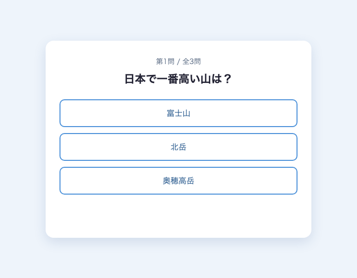
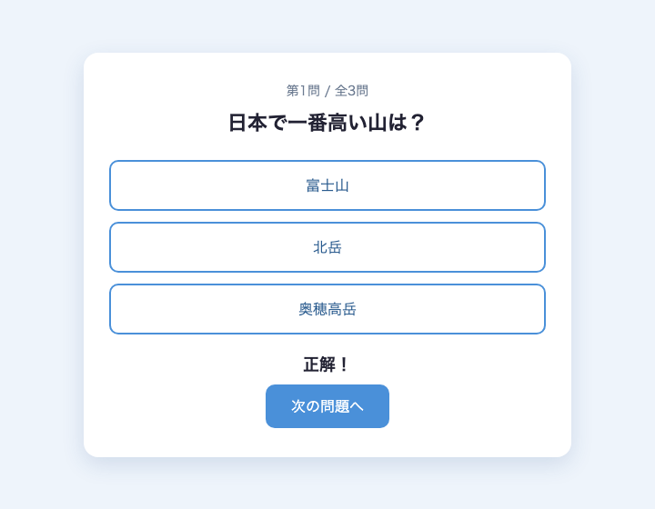
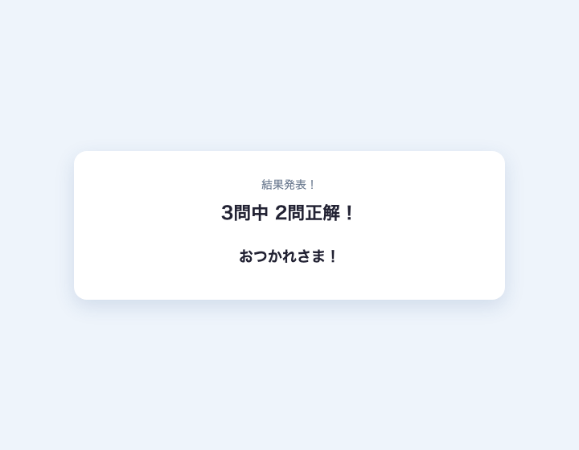

<!-- _class: lead -->

# 1から学ぶ **JavaScript**！

## クイズアプリを作ってみよう

---

## 今日のゴール：<br>**自分だけの3択クイズアプリ** を作る



- 問題と3つの選択肢が表示される
- 選択肢をクリック → 正解 / 不正解がわかる
- 「次の問題へ」で進む
- 全問終了 → スコア表示！

---

## Webページは **3つの技術** でできている

| 技術 | 役割 |
|------|------|
| HTML | 構造 |
| CSS | 見た目 |
| **JavaScript** | **動き** |

今日さわるのは **JavaScript**。ページに「動き」をつけていきます！

---

## 準備

1. ブラウザで StackBlitz のテンプレートを開く
   https://stackblitz.com/edit/web-quiz-2026?file=index.html
2. 左に HTML / CSS / JS のファイル、右にプレビュー
3. 今日さわるのは `script.js`

テンプレートは「1問目が表示された状態」から始まります。

---

## 今日の進め方

1. JavaScript入門
2. 1問だけのクイズを作る
3. 問題の数を増やす
4. スコアと結果を表示する
5. 自分だけのクイズにする

---

<!-- _class: record -->

## スライドの見かた

### 右上に「記述」バッジ → 手を動かしてコードを書くスライド

**ハイライトあり** — その部分だけ書き足す

```html
<button id="choice-0" @@onclick="alert('クリックされた！')"@@>富士山</button>
```

**ハイライトなし** — コードをそのまま写す

```javascript
function checkAnswer(selected) {
  alert('あなたは ' + selected + ' 番を選びました！');
}
```

---

<!-- _class: lead -->

# JavaScript入門

## クイズを作る前に、JSの基本を知ろう

---

## JavaScript は、ページを「見る人とやりとりできる」ものにする

- ボタンを押したら反応する
- 文字や色を書き換える
- 計算する・判定する

クイズ作りで使う6つの基本を、順番に見ていきます。

---

## ① 変数 — データに名前をつけて覚えておく

### 得点を、結果発表までずっと覚えておきたい

変数 = データに名前をつけて覚えておく仕組み

```javascript
let score = 0;        // score という名前で 0 を覚えておく
score = score + 1;    // 中身を書き換える
console.log(score);   // 名前で取り出す → 1
```

---

## ① 変数 — `const` と `let`

### あとで書き換えるかどうかで使い分ける

- 得点 → 答えるたびに増える → `let`
- 問題数 → ずっと変わらない → `const`

```javascript
let score = 0;      // 得点（あとで増える）
const total = 3;    // 問題数（変わらない）

score = score + 1;  // OK
total = total + 1;  // まちがい！ 得点と書きまちがえて問題数を増やしてしまった
```

- `const` なら → その場でエラーが出て、書きまちがいにすぐ気づける
- もし `let` にしていたら → エラーにならず動き続け、「全4問」と表示されてしまう

---

## ① 変数 — データには種類（型）がある

| 種類 | 書き方 | できること |
|------|--------|-----------|
| 数値 | `18` | 計算できる |
| 文字列 | `'鯖江'` | 文字として表示・つなげられる |

**文字列は `'...'` で囲む**（`"..."` でも同じ意味）。囲まないと「変数の名前」として扱われる。

型はほかにもある（`true` / `false` の真偽値など）。今日使うのはこの2つだけ。

```javascript
const a = 'score';   // 文字列の 'score'
const b = score;     // 変数 score の中身
```

---

## ② 文字列の結合 — `+` でつなげる

### 「2問正解！」のような表示を作りたい

```javascript
const hello = 'こんにちは' + '！';   // → 'こんにちは！'

const score = 2;
const result = score + '問正解！';   // → '2問正解！'（数値は文字列に変わる）
```

**注意** — 数値のつもりが文字列だと、計算されずにつながる

```javascript
console.log('18' + 1);   // → '181'（文字列としてつながる）
console.log(18 + 1);     // → 19（数値として計算）
```

---

## ③ 関数 — 処理に名前をつけてまとめる

### 同じ処理を、何度も使いたい

- 毎回書くと長い。直すときは全部直すことになる
- 処理に名前をつけてまとめ、呼び出すだけにする = 関数

```javascript
function sayHello() {
  console.log('こんにちは！');
}

sayHello();   // → 'こんにちは！'（名前で呼び出すと実行される）
```

---

## ③ 関数 — 引数

### 一部だけ変えて、同じ処理を使いたい

呼び出すときに `( )` で値を渡す = 引数。渡した値で結果が変わる。

```javascript
function sayHello(name) {
  console.log('こんにちは、' + name + 'さん！');
}

sayHello('太郎');   // → こんにちは、太郎さん！
sayHello('花子');   // → こんにちは、花子さん！
```

---

## ④ 条件分岐 — 「もし〜なら」で処理を分ける

### 正解なら○、まちがいなら× — 状況で動きを変えたい

```javascript
if (条件) {
  // 条件が成り立つときの処理
} else {
  // 成り立たないときの処理
}
```

---

## ④ 条件分岐 — 条件は「比較」で書く

比較演算子 = 2つの値を比べる記号。比べた結果が `if` の条件になる。

| 記号 | 意味 |
|------|------|
| `===` | 等しい |
| `!==` | 等しくない |
| `>` `<` `>=` `<=` | 大小の比較 |

```javascript
if (selected === 0) {   // selected は 0 と等しい？
  console.log('0番が選ばれた！');
}
```

`=`（代入）と `===`（比較）は別物！

---

## ⑤ 繰り返し — 同じ処理を何回も

### 回数分コピーして書きたくない

`for` = 「◯回くり返して」と1回で書く

```javascript
for (let i = 0; i < 回数; i++) {
  // くり返す処理（i は 0, 1, 2, ... と増える）
}
```

---

## ⑤ 繰り返し — 例

### 「第1問」〜「第3問」を順番に表示したい

```javascript
for (let i = 0; i < 3; i++) {
  const number = i + 1;
  console.log('第' + number + '問');   // → 第1問, 第2問, 第3問
}
```

| 書き方 | 意味 |
|--------|------|
| `let i = 0` | カウンターを 0 から始める |
| `i < 3` | 成り立つ間くり返す |
| `i++` | 1回ごとに 1 増やす |

---

## ⑥ 配列 — データを順番に並べたリスト

### 選択肢3つを、変数3個で持ちたくない

| 番号 | 0 | 1 | 2 |
|------|---|---|---|
| 中身 | `'富士山'` | `'北岳'` | `'奥穂高岳'` |

```javascript
const choices = ['富士山', '北岳', '奥穂高岳'];

console.log(choices[0]);   // → '富士山'
console.log(choices[2]);   // → '奥穂高岳'
```

`[番号]` で取り出す。番号は 0 から数える。

---

## ⑥ オブジェクト — 名前つきのデータのまとまり

### 1問分 =「問題文・答え」のセットで持ちたい

| 名前（プロパティ） | `question` | `answer` |
|------|-----------|----------|
| 中身（値） | `'日本で一番高い山は？'` | `0` |

```javascript
const quiz = { question: '日本で一番高い山は？', answer: 0 };

console.log(quiz.question);   // → '日本で一番高い山は？'
console.log(quiz.answer);     // → 0
```

`.名前` で取り出す。

---

<!-- _class: lead -->

# Chapter 1

## 1問だけのクイズを作ろう

まずはいちばん小さいクイズから。
**選択肢を押したら、正解かどうかわかる** ようにします。

---

## 1-1. テンプレートを見てみよう


いまは1問目が表示されているだけ。ボタンを押しても何も起きません。

この章では、**ボタンを押したら正解 / 不正解が表示される** ようにします。

---

## 1-1. 画面は5つの部品でできている


<div class="mock">
  <div class="part"><span>第1問 / 全3問</span><span class="label">① 問題番号</span></div>
  <div class="part"><span class="q">日本で一番高い山は？</span><span class="label">② 問題文</span></div>
  <div class="part"><span><span class="btn">富士山</span><span class="btn">北岳</span><span class="btn">奥穂高岳</span></span><span class="label">③ 選択肢ボタン</span></div>
  <div class="part"><span class="empty">（最初は空）</span><span class="label">④ 結果の表示欄</span></div>
  <div class="part"><span class="btn">次の問題へ</span><span class="label">⑤ 次へボタン</span></div>
</div>

---

## 1-1. HTML（`index.html`）との対応

<!-- _class: compact -->

`id` は、HTML の要素につける名前です。あとで JS から「どの要素か」を指定するときに、この名前を使います。

```html
<!-- ① 問題番号 -->
<p id="question-number">第1問 / 全3問</p>

<!-- ② 問題文 -->
<h1 id="question">日本で一番高い山は？</h1>

<!-- ③ 選択肢ボタン × 3 -->
<div id="choices">
  <button id="choice-0">富士山</button>
  <button id="choice-1">北岳</button>
  <button id="choice-2">奥穂高岳</button>
</div>

<!-- ④ 結果の表示欄（最初は空） -->
<p id="result"></p>

<!-- ⑤ 次へボタン -->
<button id="next-btn">次の問題へ</button>
```

---

<!-- _class: record -->

## 1-2. ボタンを押したら、メッセージを出そう

<div class="timer-box" data-seconds="240">
  <button class="timer-btn" data-delta="-60">−</button>
  <div class="timer"></div>
  <button class="timer-btn" data-delta="60">＋</button>
</div>

### `onclick` — クリックされたら、書いた JS を実行する

**書く場所** — `index.html` の1つ目のボタン

```html
<button id="choice-0" @@onclick="alert('クリックされた！')"@@>富士山</button>
```

`alert` = メッセージをポップアップで表示する命令
`'...'` なのは外側の `"` とぶつからないため（JS では `"` も `'` も使える）

**成功** — 「富士山」を押すとポップアップが出る。この仕組み = **イベント処理**

---

<!-- _class: record -->

## 1-3. どのボタンが押されたか、分かるようにしよう

<div class="timer-box" data-seconds="420">
  <button class="timer-btn" data-delta="-60">−</button>
  <div class="timer"></div>
  <button class="timer-btn" data-delta="60">＋</button>
</div>

### 3つのボタンから同じ関数を呼び、押されたボタンの番号を引数で渡す

**index.html** — 3つのボタンに `onclick="checkAnswer(番号)"` を書き足す

```html
<button id="choice-0" @@onclick="checkAnswer(0)"@@>富士山</button>
<button id="choice-1" @@onclick="checkAnswer(1)"@@>北岳</button>
<button id="choice-2" @@onclick="checkAnswer(2)"@@>奥穂高岳</button>
```

**script.js** — 受け取った番号を、まず alert で確認する

```javascript
function checkAnswer(selected) {
  alert('あなたは ' + selected + ' 番を選びました！');
}
```

---

## 1-3. 動作チェック

**成功** — 押すボタンで、出てくる番号（0・1・2）が変わる

正解 / 不正解の表示はまだ。ここまでで「押されたボタンの番号を JS が受け取れる」形ができました。表示は次の 1-4 で作ります。

---

<!-- _class: record -->

## 1-4. 正解 / 不正解を、ページの上に表示しよう

<div class="timer-box" data-seconds="420">
  <button class="timer-btn" data-delta="-60">−</button>
  <div class="timer"></div>
  <button class="timer-btn" data-delta="60">＋</button>
</div>

### `document.getElementById()` — id を指定して、HTML の要素を取得する

**書く場所** — `script.js` の `checkAnswer` を丸ごと書き換え（alert をやめて、④ 結果の表示欄へ）

```javascript
function checkAnswer(selected) {
  const resultEl = document.getElementById('result');

  if (selected === 0) {
    resultEl.textContent = '正解！すごい！';
  } else {
    resultEl.textContent = '不正解... 正解は「富士山」でした';
  }
}
```

---

## 1-4. 動作チェック



**成功** — ボタンを押すと、ページに正解 / 不正解が表示される

1. `getElementById('result')` で ④ 結果の表示欄を取得
2. `.textContent` で文字を書き換え
3. `if` と `===` で正解を判定

id で要素を取得して書き換える = **DOM操作**

---

<!-- _class: lead -->

# Chapter 2

## 問題の数を増やそう

いまは1問目が HTML に直接書いてあるだけ。
問題を **データ** にして、何問でも出せるようにします。

---

<!-- _class: record -->

## 2-1. クイズデータを用意しよう

<div class="timer-box" data-seconds="480">
  <button class="timer-btn" data-delta="-60">−</button>
  <div class="timer"></div>
  <button class="timer-btn" data-delta="60">＋</button>
</div>

### 1問分をオブジェクトに、問題ぜんぶを配列にまとめる

**書く場所** — `script.js` の先頭

```javascript
const quizData = [
  { question: '日本で一番高い山は？',
    choices: ['富士山', '北岳', '奥穂高岳'], answer: 0 },
  { question: 'jig.jp の本社がある福井県の市は？',
    choices: ['鯖江市', '福井市', '敦賀市'], answer: 0 },
  { question: 'Webページの「動き」を担当する言語は？',
    choices: ['HTML', 'CSS', 'JavaScript'], answer: 2 }
];

let currentQuestion = 0;
let score = 0;
```

---

## 2-1. データの形

| 書き方 | 意味 |
|--------|------|
| `quizData` | 問題をまとめた **配列** |
| `{ question, choices, answer }` | 1問ぶんの **オブジェクト** |
| `choices` | 選択肢の配列（今回は3つに統一） |
| `answer` | 正解の番号（0から数える） |

- `quizData` → データを入れ替えない → `const`
- `currentQuestion`（今何問目か）・`score`（得点）→ 進むたびに変わる → `let`

書いただけでは画面は変わりません。次で表示につなげます。

---

## 2-2. 問題を表示する関数をつくろう

### `showQuestion()` — 「今の問題」を画面に反映する

やることは3つ。ぜんぶ 1-4 で使った DOM操作です。

1. `quizData[currentQuestion]` で今の問題を取り出す
2. 問題番号・問題文・選択肢の文字を書き換える
3. 前の問題の結果表示を消す

---

<!-- _class: record compact -->

## 2-2. `showQuestion()` を書く

<div class="timer-box" data-seconds="600">
  <button class="timer-btn" data-delta="-60">−</button>
  <div class="timer"></div>
  <button class="timer-btn" data-delta="60">＋</button>
</div>

**書く場所** — `script.js` に追加

```javascript
function showQuestion() {
  const quiz = quizData[currentQuestion];   // 今の問題を取り出す

  // 問題番号（計算してから結合する）
  const number = currentQuestion + 1;
  document.getElementById('question-number').textContent =
    '第' + number + '問 / 全' + quizData.length + '問';

  // 問題文
  document.getElementById('question').textContent = quiz.question;

  // 選択肢（id の番号と choices の番号をそろえる）
  document.getElementById('choice-0').textContent = quiz.choices[0];
  document.getElementById('choice-1').textContent = quiz.choices[1];
  document.getElementById('choice-2').textContent = quiz.choices[2];

  document.getElementById('result').textContent = '';        // 前の結果を消す
  document.getElementById('next-btn').style.display = 'none';
}
```

---

<!-- _class: record -->

## 2-3. 正解判定をアップデートしよう

<div class="timer-box" data-seconds="480">
  <button class="timer-btn" data-delta="-60">−</button>
  <div class="timer"></div>
  <button class="timer-btn" data-delta="60">＋</button>
</div>

### 「0番が正解」の決めうちを、`quiz.answer` との比較に変える

**書く場所** — `script.js` の `checkAnswer` を **丸ごと置き換え**（前のものは消す）

```javascript
function checkAnswer(selected) {
  const quiz = quizData[currentQuestion];
  const resultEl = document.getElementById('result');

  if (selected === quiz.answer) {
    resultEl.textContent = '正解！';
    score = score + 1;
  } else {
    const correctText = quiz.choices[quiz.answer];
    resultEl.textContent = '不正解... 正解は「' + correctText + '」';
  }

  document.getElementById('next-btn').style.display = 'inline-block';
}
```

---

<!-- _class: record -->

## 2-4. 最初の問題を表示しよう

<div class="timer-box" data-seconds="180">
  <button class="timer-btn" data-delta="-60">−</button>
  <div class="timer"></div>
  <button class="timer-btn" data-delta="60">＋</button>
</div>

### 関数は、呼ばれてはじめて動く

**書く場所** — `script.js` のいちばん下に、1行だけ追加

```javascript
showQuestion();   // ページを開いたら最初の問題を表示
```

---

## 2-4. 動作チェック

**成功** — 次の3つがそろっている

1. 1問目が `quizData` から表示される（HTML の決めうちを卒業！）
2. 選択肢を選ぶと、その問題の `answer` で正解 / 不正解が出る
3. 答えると「次の問題へ」ボタンが現れる（押してもまだ動きません。次の章で作ります）

---

<!-- _class: lead -->

# Chapter 3

## スコアと結果を表示しよう

解き終わったら「何問正解だったか」を知りたいですよね。
**「次へ」で進んで、最後にスコアが出る** ようにします。

---

<!-- _class: record compact -->

## 3-1.「次の問題へ」を動かそう

<div class="timer-box" data-seconds="420">
  <button class="timer-btn" data-delta="-60">−</button>
  <div class="timer"></div>
  <button class="timer-btn" data-delta="60">＋</button>
</div>

**script.js** — `nextQuestion` を追加（押すたびに1問進め、最後まで行ったら結果へ）

```javascript
function nextQuestion() {
  currentQuestion = currentQuestion + 1;

  if (currentQuestion < quizData.length) {
    showQuestion();   // まだ問題がある → 次を表示
  } else {
    showResult();     // 最後まで終わった → 結果へ
  }
}
```

**index.html** — 次へボタンに `onclick` を書き足す

```html
<button id="next-btn" @@onclick="nextQuestion()"@@>次の問題へ</button>
```

**成功** — 2問目・3問目に進める（最後の問題ではエラーが出ますが正常。`showResult` は次で作ります）

---

<!-- _class: record -->

## 3-2. 結果画面をつくろう

<div class="timer-box" data-seconds="420">
  <button class="timer-btn" data-delta="-60">−</button>
  <div class="timer"></div>
  <button class="timer-btn" data-delta="60">＋</button>
</div>

### 全問終わったら「◯問中◯問正解！」を出す

**書く場所** — `script.js` に `showResult` を追加

```javascript
function showResult() {
  document.getElementById('question-number').textContent = '結果発表！';

  document.getElementById('question').textContent =
    quizData.length + '問中 ' + score + '問正解！';

  document.getElementById('choices').style.display = 'none';
  document.getElementById('next-btn').style.display = 'none';
  document.getElementById('result').textContent = 'おつかれさま！';
}
```

**成功** — 最後の「次の問題へ」で結果画面が出たら完成！

---

<!-- _class: lead -->

# 完成！

## 3択クイズアプリが動きました！



おめでとうございます 🎉

---

<!-- _class: lead -->

# Chapter 4

## 自分だけのクイズにしよう！

仕組みはもう全部できています。
あとは **問題データを入れ替えるだけ**。

---

<!-- _class: record -->

## 4. オリジナルクイズの作り方

### `quizData` を自分の問題に書き換えるだけ

**1問の形** — この3点セットを `,` で区切って並べる

```javascript
{
  question: 'ここに問題文を書く',
  choices: ['選択肢1', '選択肢2', '選択肢3'],
  answer: 0    // 正解の番号（0から数える）
}
```

問題はいくつ増やしてもOK。

**アイデア** — 推しクイズ ／ 地元クイズ ／ 学校クイズ ／ IT雑学 ／ グルメクイズ

---

<!-- _class: lead -->

# 応用課題

## 余裕がある人はチャレンジ！

---

<!-- _class: record -->

## 応用①：選択肢の数を自由にする（N択）

### 選択肢のボタンを `for` で自動生成 → 2択でも4択でも出せる

**置き換え場所** — `showQuestion` の選択肢3行（`choice-0`〜`choice-2`）

```javascript
let buttonsHTML = '';
for (let i = 0; i < quiz.choices.length; i++) {
  buttonsHTML +=
    '<button id="choice-' + i + '" onclick="checkAnswer(' + i + ')">'
    + quiz.choices[i] + '</button>';
}
document.getElementById('choices').innerHTML = buttonsHTML;
```

`innerHTML` = 要素の中身を HTML ごと書き換える（`textContent` は文字だけ）
`quizData` の `choices` を4つにすれば、自動で4択に。

---

<!-- _class: record -->

## 応用②：結果メッセージを変える

### 得点に応じて、結果のメッセージを変える

**書く場所** — `showResult` の最後に追加

```javascript
const resultEl = document.getElementById('result');
const half = quizData.length / 2;

if (score === quizData.length) {
  resultEl.textContent = 'パーフェクト！天才！';
} else if (score >= half) {
  resultEl.textContent = 'なかなかやるね！';
} else {
  resultEl.textContent = '次はもっといけるはず！';
}
```

`else if` で「3つ以上の場合分け」ができます。

---

<!-- _class: compact -->

## 応用③：もっとチャレンジ

| 難度 | 課題 | ヒント |
|------|------|--------|
| ★ | もう一度チャレンジボタン | `currentQuestion` と `score` を 0 に戻す |
| ★ | 正解した選択肢を緑にする | `.style.background = '#4caf50'` |
| ★★ | 一度答えたら押せなくする（いまは連打で得点が増える） | 答えたかを覚える変数 + `checkAnswer` の最初で `return` |
| ★★ | 選択肢シャッフル | `answer` の番号も一緒に変える |
| ★★ | タイマー機能 | `setInterval` + `clearInterval` |
| ★★★ | 画像つきクイズ | `` タグを動的に生成 |

---

## 困ったときは

エラーが出たら `F12` → **Console** タブで赤いメッセージを確認しましょう。

| よくあるミス | 正しい書き方 |
|------|------------|
| `=` と `===` の混同 | 比較は `===`、代入は `=` |
| カッコの閉じ忘れ | `()` `{}` `[]` は必ずペア |
| クォーテーション閉じ忘れ | `"..."` `'...'` はペア |
| スペルミス | `getElementById` の大文字小文字 |
| カンマ忘れ | 配列・オブジェクトの要素間 |

---

## 今日学んだこと

| 概念 | 使った場面 |
|------|-----------|
| 変数（`const` / `let`） | クイズデータ、スコア管理 |
| 文字列の結合（`+`） | 問題番号・結果の表示 |
| 関数と引数（`function`） | `showQuestion`, `checkAnswer` など |
| 条件分岐（`if / else`） | 正解判定 |
| 繰り返し（`for`） | 応用課題の選択肢生成 |
| 配列・オブジェクト | クイズデータの管理 |
| DOM操作（`getElementById`） | id で要素を取得して書き換え |
| イベント処理（`onclick`） | ボタンクリック時の処理 |

<script>
document.querySelectorAll('.timer-box').forEach(box => {
  const el = box.querySelector('.timer');
  const initial = Number(box.dataset.seconds);
  let remain = initial;
  let id = null;

  const render = () => {
    const r = Math.max(remain, 0);
    const m = String(Math.floor(r / 60)).padStart(2, '0');
    const s = String(r % 60).padStart(2, '0');
    el.textContent = `${m}:${s}`;
    el.classList.toggle('warn', remain <= 60 && remain > 0);
    el.classList.toggle('done', remain <= 0);
  };
  const stop = () => { clearInterval(id); id = null; el.classList.remove('running'); };
  const start = () => {
    if (remain <= 0) return;
    el.classList.add('running');
    id = setInterval(() => {
      remain--;
      render();
      if (remain <= 0) stop();
    }, 1000);
  };

  el.addEventListener('click', () => {
    if (remain <= 0) { el.classList.remove('done'); return; }
    id ? stop() : start();
  });
  el.addEventListener('contextmenu', e => {
    e.preventDefault();
    stop();
    remain = initial;
    render();
  });
  box.querySelectorAll('.timer-btn').forEach(btn => {
    btn.addEventListener('click', () => {
      remain = Math.max(0, remain + Number(btn.dataset.delta));
      render();
    });
  });
  render();
});
</script>
