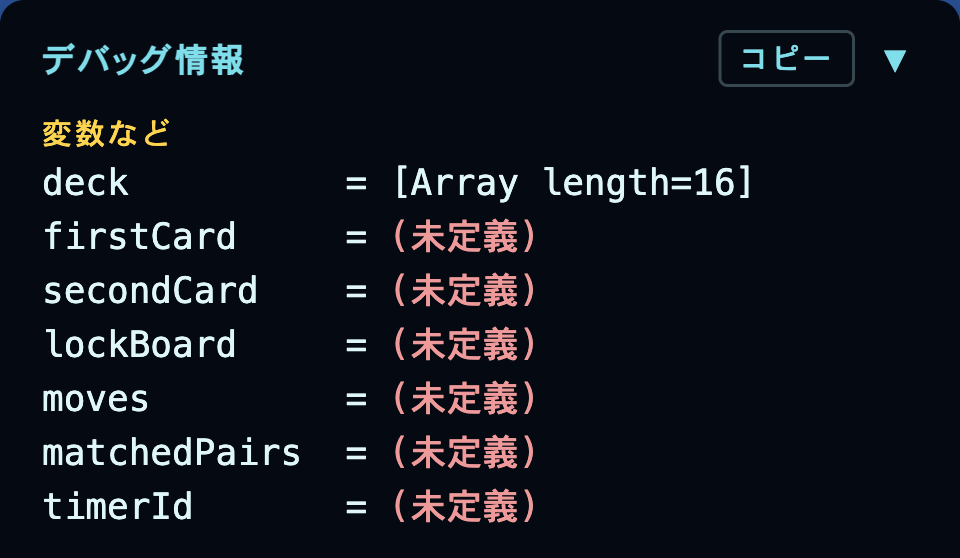
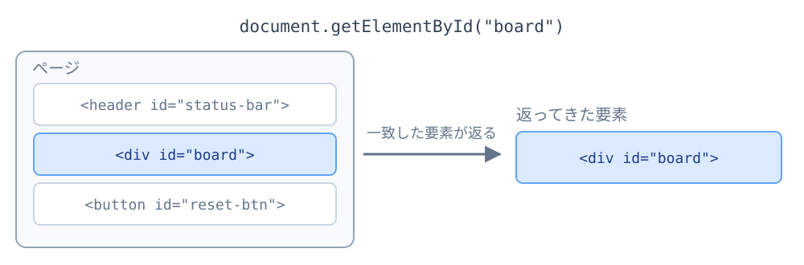
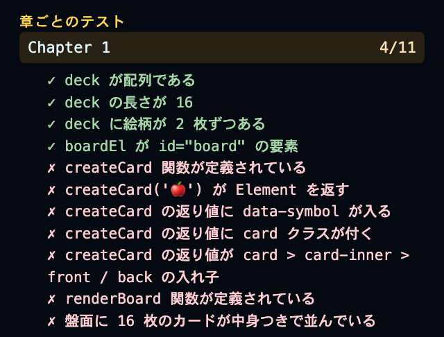
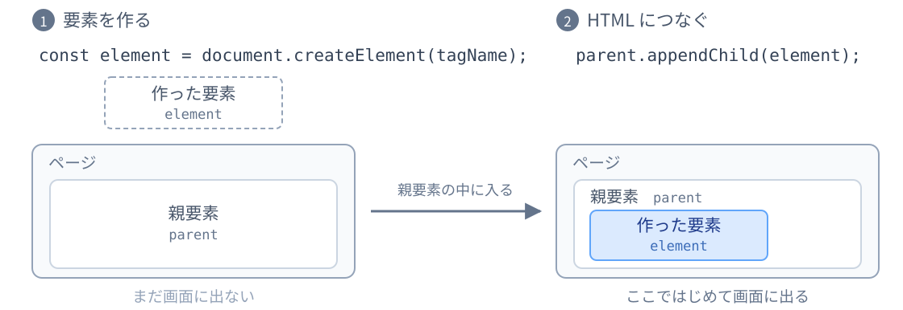
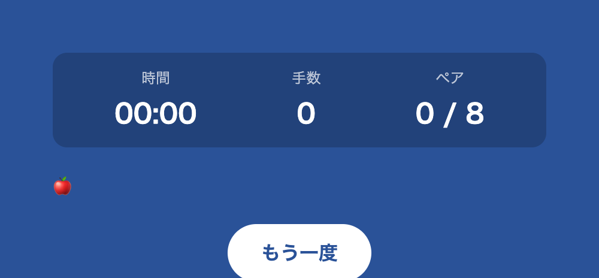
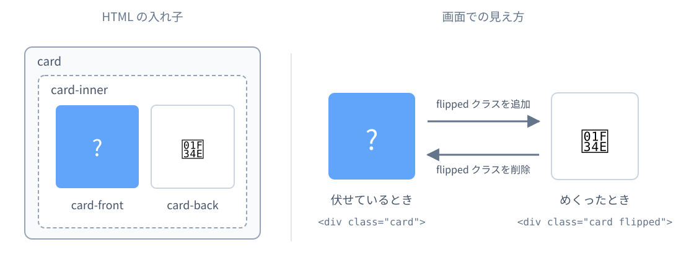
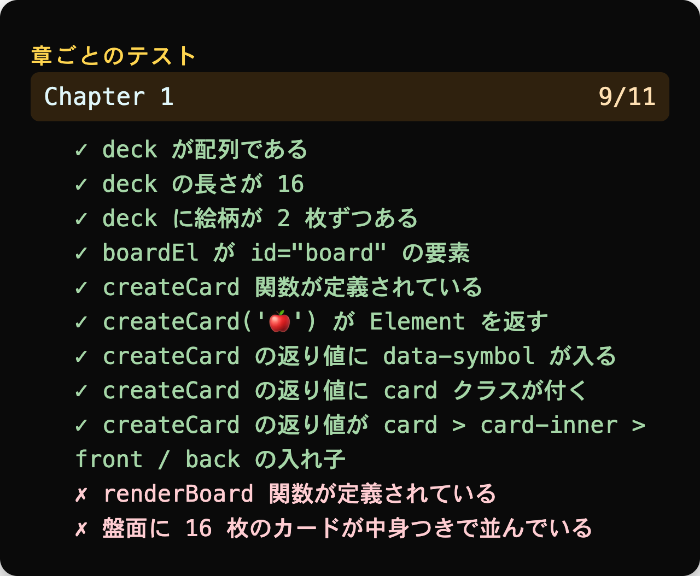
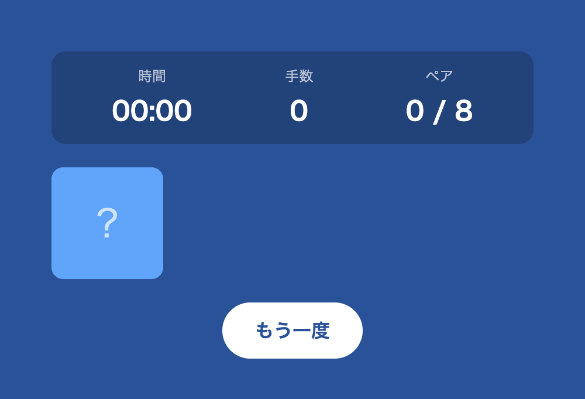
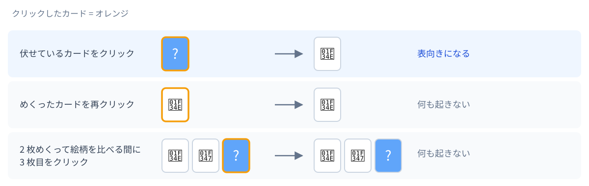

<!-- _class: lead -->

# JavaScript で神経衰弱ゲーム開発

---

## 今日のゴール

4×4 = 16 枚のカードで遊べる神経衰弱ゲームを作ります。

- カードをクリックするとめくれる
- 2 枚めくって絵柄が一致したらペア成立
- タイマー、手数、ペア数がリアルタイム更新
- 全ペア揃ったら「クリア」表示、「もう一度」ボタンでリセット


---

## 今日の流れ

全部で 6 章あります。Chapter 3 のあとに 10 分の休憩を入れます。

| | 章 | 内容 |
|---|---|---|
| 1 | JS で画面を組み立てる | カードを盤面に並べる |
| 2 | イベントと状態 | クリックでカードをめくる |
| 3 | 状態遷移と非同期 | 一致判定と待ち時間 |
| 4 | カードをシャッフル | 毎回ちがう並びで遊べるようにする |
| 5 | 時間で動く画面 | タイマー、手数、クリア判定 |
| 6 | 状態を初期化する | リセット機能 |

前半の 1〜3 章でゲームの芯を作り、後半の 4〜6 章で遊べる形に仕上げます。

---

## 進め方

各章は説明とコードを書く演習の繰り返しです。演習には 3 つのモードがあります。

| モード | 見分け方 | やること |
|---|---|---|
| <span class="tag-challenge">自力</span> | 要件とヒントだけ提示 | コードなしで書き、次スライドで答え合わせ |
| <span class="tag-write">記述</span> | 【A】等の穴 | 構造は見えている中で埋める箇所を考える |
| <span class="tag-unlock">コピペ</span> | 完成コードが載っている | そのまま手元に貼る (数行の写経も含む) |

記述のうち、単語や 1 行で埋まる穴には候補を出します。候補には使わないものも混ざっているので、どれがどこに入るかを考えてください。複数行を書く穴には候補を出さず、代わりに何行になるかを書いています。

間に合わなくても大丈夫です。各章のチェックポイントに「追いつき用」のコードを出すので、`script.js` を丸ごと置き換えれば次の章から始められます。

---

## 準備: StackBlitz テンプレを開こう

https://stackblitz.com/edit/web-platform-qnett8m2?file=script.js

上のリンクを開いてください。

右のようにファイルが 4 つ見えていれば OK です。その右にプレビューが出ます。

プレビューにカードはまだ出ていなくて大丈夫です。

今日さわるのはほぼ `script.js` だけです。最初には `symbols` 配列だけが用意されているので、ここから 1 行ずつ書き足していきます。

新しい関数・変数の追加は、指示がなければ `script.js` のいちばん最後に足します。既存コードへの追記や書き換えのときは、周囲の行をアンカーとしてスライドに載せます。


---

## 準備: 詰まったときは

詰まったら、お気軽に Zoom のチャットなどでメンターにご質問ください。

プレビュー右上の黒い小窓は診断パネルです。各演習の <span class="tag-verify">確認</span> で使います。


---

<!-- _class: lead -->

# Chapter 1
## カードを盤面に並べる

---

## Chapter 1 のゴール

16 枚のカードを 4×4 で並べます。

- カードのデータ (絵柄配列) を作る
- カード 1 枚を作る関数を用意する
- 盤面全体を描く関数を作って呼ぶ

この章では JavaScript から HTML/CSS を組み立てていきます。


---

<!-- _class: tight -->

## 1-1. カードのデータを作る

`symbols` には 🍎 🍌 🍇 … と 8 種類の絵柄が入っています。神経衰弱は同じ絵柄のカードが 2 枚ずつあるので、全部で 8 × 2 = 16 枚です。

同じ配列をうしろにもう 1 つつなげれば、どの絵柄もちょうど 2 枚になります。

<div class="syntax">

- `concat` — `A.concat(B)` で A のうしろに B をつなげた新しい配列を返す。A も B も変わらない
  例 1: `["a", "b"].concat(["c"])` → `["a", "b", "c"]`
  例 2: `["a", "b"].concat(["a", "b"])` → `["a", "b", "a", "b"]`

</div>

---

<!-- _class: tight -->

## 1-1. deck を作る

<span class="tag-unlock">コピペ</span> `script.js` のいちばん最後に書き足します。

```javascript
// symbols を 2 回連結して 16 枚の deck を作る
const deck = symbols.concat(symbols);
```

データを用意しただけで、まだ表示するコードがないので、貼っても画面は変わりません。

<span class="tag-verify">確認</span> 診断パネルの「変数など」で `deck` が「(未定義)」から `[Array length=16]` に変わります。



---

## HTML には空の入れ物だけ置く

16 枚のカードは、`index.html` に `<div class="card">` を 16 個書いても並べられます。ただ手で 16 個書くのは大変で、絵柄を変えるときもカードの枚数を変えるときも、そのぶん書き直しになります。

```html
<!-- 16 個書くとこうなる -->
<div id="board">
  <div class="card">?</div>
  <div class="card">?</div>
  <!-- ...あと 14 個 -->
</div>
```

そこで HTML には空の入れ物だけ置いて、中身は JS が作ります。

```html
<!-- 配布した index.html。中身は空にしてある -->
<div id="board"></div>
```

---

<!-- _class: tight -->

## 1-2. HTML の要素を取得する

入れ物は `index.html` にありますが、中身を作るのは `script.js` です。
JS のコードから `<div id="board">` を触るために、HTML に付けてある `id` を手がかりに要素を取ってきます。

<div class="fig-row">



</div>

<div class="syntax">

- `document.getElementById(id)` — HTML の中から `id` 属性がその文字列の要素を探して返す
  同じ `id` はページに 1 つだけなので、返るのは 1 要素。見つからなければ `null` が返る

</div>

---

## 1-2. 盤面を取得する

<span class="tag-unlock">コピペ</span> `script.js` のいちばん最後に書き足します。

```javascript
// 盤面を取得して boardEl に入れる
const boardEl = document.getElementById("board");
```

盤面はこのあと何度も触るので、そのたびに `document.getElementById("board")` と書かずに済むよう、最初に取得して変数にしておきます。
この資料では、HTML 要素を入れる変数の末尾に `El` (Element の略) を付けて統一します。

<span class="tag-verify">確認</span> 画面は変わりません。診断パネルの Chapter 1 を開くと「boardEl が id="board" の要素」に ✓ が付きます。



---

<!-- _class: tight -->

## JS で HTML を作る

HTML に書いていない要素も、JS から作って足せます。作るところと、HTML につなぐところの 2 段階です。

<div class="fig-row">



</div>

`tagName` は `"div"` や `"p"` のような文字列です。戻り値の `element` は 2 でも使うので変数で受けます。
`parent` は入れ先の要素です。今回の入れ先は盤面なので、さきほど取得した `boardEl` を渡します。

---

<!-- _class: tight -->

## 試しに 1 つ作ってみる

<span class="tag-unlock">コピペ</span> `script.js` のいちばん最後に貼ります。

```javascript
const apple = document.createElement("div");   // <div></div> ができる
apple.textContent = "🍎";                      // <div>🍎</div> になる
boardEl.appendChild(apple);                    // 盤面の中に入る
```

貼ると、盤面のところに 🍎 が 1 つ出ます。



---

## 盤面の中身が変わった

```javascript
// さっき貼った 3 行
const apple = document.createElement("div");
apple.textContent = "🍎";
boardEl.appendChild(apple);
```

<div class="fig-row">

```html
<!-- 貼る前 -->
<div id="board"></div>
```

```html
<!-- 貼った後 -->
<div id="board">
  <div>🍎</div>
</div>
```

</div>

`createElement` で作った要素は、`appendChild` で HTML の中に入れて、はじめて表示されます。

🍎 が 1 つ出るのを確かめたら、この 3 行は消します。

---

<!-- _class: tight -->

## 1-3. 作りたいカードの HTML

これから `createCard` という関数を書きます。`createCard("🍎")` を呼ぶと、次の HTML が組み立てられて返ってくる形にします。

この HTML はどこにも書きません。出来上がりを確認するためだけのものです。

```html
<div class="card" data-symbol="🍎">
  <div class="card-inner">
    <div class="card-front">?</div>
    <div class="card-back">🍎</div>
  </div>
</div>
```

---

<!-- _class: tight -->

## 1-3. カードの構造



カードの向きは、JavaScript で `card` に `flipped` クラスを追加・削除して切り替えます。

---

<!-- _class: tight -->

## 1-3. JS と HTML の対応

JS で書いた 1 行が、HTML のどこになるかの対応です。

| やること | JS | できる HTML |
| --- | --- | --- |
| 要素を作る | `document.createElement("div")` | `<div></div>` |
| クラスを追加する | `el.className = "card"` | `<div class="card">` |
| データを持たせる | `el.dataset.symbol = "🍎"` | `<div data-symbol="🍎">` |
| 文字を入れる | `el.textContent = "?"` | `<div>?</div>` |
| 要素を中に入れる | `parent.appendChild(child)` | `<parent><child></child></parent>` |

`document.createElement` で作っただけの要素は、まだどこにも属していません。`appendChild` でつなげて初めて入れ子になります。

---

<!-- _class: tight -->

## 1-3. カード 1 枚を作る関数

<span class="tag-write">記述</span> コードブロックをそのまま `script.js` に貼って、【A】〜【C】を書き換えましょう。

<div class="timer-box" data-seconds="150">
  <button class="timer-btn" data-delta="-60">−</button>
  <div class="timer"></div>
  <button class="timer-btn" data-delta="60">＋</button>
</div>

<div class="choices">

候補: `card` / `inner` / `front` / `back`

</div>

<div class="split code-lg">
<div class="split-main">

```javascript
// 内側の要素から順に、どこに入れるかを考える
function createCard(symbol) {
  const card = document.createElement("div");
  card.className = "card";
  card.dataset.symbol = symbol;

  const inner = document.createElement("div");
  inner.className = "card-inner";
  const front = document.createElement("div");
  front.className = "card-front";
  front.textContent = "?";
  const back = document.createElement("div");
  back.className = "card-back";
  back.textContent = symbol;

  【A】.appendChild(front);
  【B】.appendChild(back);
  【C】.appendChild(inner);
  return card;
}
```

</div>
<div class="split-side">

<span class="tag-verify">確認</span> 診断パネルの Chapter 1 を開くと、入れ子を見ているテストに ✓ が付きます。次のスライドで答え合わせをします。



</div>
</div>

---

<!-- _class: tight -->

## 1-3 答え合わせ

```javascript
  // ... 要素を作るところは省略 ...

  inner.appendChild(front);   // A: card-front が card-inner の内側に入る
  inner.appendChild(back);    // B: card-back も card-inner の内側に入る
  card.appendChild(inner);    // C: card-inner が card の内側に入る

  return card;
}
```

作りたいカードの HTML と見比べると、内側の要素から順に入れていることが分かります。

---

<!-- _class: tight -->

## 1-3 の確認: 1 枚だけ出してみる

<span class="tag-unlock">コピペ</span> 作った関数を 1 回だけ呼びます。

```javascript
boardEl.appendChild(createCard("🍎"));
```

青い「?」のカードが 1 枚出れば OK です。確認できたらこの 1 行は消します。

何も出ないときは、【A】〜【C】がまだ入れ子になっていません。前のスライドの答えと見比べて直しましょう。



---

<!-- _class: tight -->

## 1-3 補足: カードから絵柄を取り出す

Chapter 3 では、めくった 2 枚が同じ絵柄かを判定します。そのためには、カード要素から絵柄だけを取り出せる必要があります。

書かれている文字を取得するには `textContent` を使います。

ただし、カードの中には表の `?` と裏の絵柄が両方入っています。

```html
<!-- createCard で作ったカードの再掲。書き足すものではない -->
<div class="card">                    <!-- ここの textContent を読むと -->
  <div class="card-inner">
    <div class="card-front">?</div>   <!-- この ? と -->
    <div class="card-back">🍎</div>   <!-- この 🍎 がつながって返る -->
  </div>
</div>
```

`textContent` は中にある文字を全部つなげて返すので、表の `?` が混ざります。

```javascript
card.textContent      // "?🍎"
```

---

<!-- _class: tight -->

## 1-3 補足: dataset で絵柄を持たせる

そこで、絵柄をカードの中の文字としてではなく、カード要素自身に持たせます。ここで `dataset` という仕組みを使います。

```javascript
card.dataset.symbol = "🍎";   // 要素に data-symbol="🍎" が付く
card.dataset.symbol           // "🍎" — 絵柄だけ取れる
```

`dataset` を使うと、HTML の要素に自分で決めた名前でデータを紐付けられます。今回の場合なら `symbol` の部分がその名前です。

---

<!-- _class: tight -->

## 1-4. 盤面全体を描く関数

`deck` の各要素をカードにして盤面に並べる `renderBoard` 関数を書きます。

<div class="syntax">

- `element.replaceChildren()` — その要素の中身を全部削除
  例: `boardEl.replaceChildren()` → 盤面に並んだカードが消える

</div>

<span class="tag-write">記述</span> コードブロックをそのまま `script.js` に貼って、【A】〜【B】を書き換えましょう。

<div class="timer-box" data-seconds="120">
  <button class="timer-btn" data-delta="-60">−</button>
  <div class="timer"></div>
  <button class="timer-btn" data-delta="60">＋</button>
</div>

<div class="choices">

候補: `createCard` / `renderBoard` / `appendChild` / `replaceChildren`

</div>

```javascript
// deck の各要素をカードにして盤面に並べる
function renderBoard() {
  boardEl.replaceChildren(); // 中身を全部削除

  // deck の要素を 1 つずつ取り出して繰り返す
  for (let i = 0; i < deck.length; i++) {
    const card = 【A】(deck[i]);
    boardEl.【B】(card);
  }
}

renderBoard();
```
<span class="tag-verify">確認</span> 16 枚のカードが 4×4 に並びます。「盤面 (DOM)」のカード枚数も 16 になります。


---

## 1-4 答え合わせ

```javascript
function renderBoard() {
  boardEl.replaceChildren(); // 中身を全部削除

  // deck の要素を 1 つずつ取り出して繰り返す
  for (let i = 0; i < deck.length; i++) {
    const card = createCard(deck[i]); // A
    boardEl.appendChild(card);        // B
  }
}

renderBoard();
```

1 枚作って 1 枚並べる、を `deck` の要素数だけ繰り返します。`createCard` が返してくるのはカード 1 枚の要素なので、そのまま `appendChild` に渡せます。

---

## Chapter 1 チェックポイント

- プレビューに 16 枚のカードが 4×4 に並んでいる
- カードは全部「?」の面 (青) を向いている
- 診断パネルの Chapter 1 が `11/11 ✓` になっている

<div class="note">
動かないときは:
<ul>
<li>Console にエラーが出ていないか</li>
<li><code>renderBoard()</code> を呼び忘れていないか</li>
<li><code>symbols.concat(symbols)</code> のドットを忘れていないか</li>
</ul>
</div>

<div class="rescue">
追いつき用: <code>ch1.js</code>
</div>


---

<!-- _class: lead -->

# Chapter 2
## クリックでカードをめくる

---

<!-- _class: tight -->

## Chapter 2 のゴール

カードをクリックすると表向きになるようにします。ただし次のルールを守ります。

- すでにめくったカードは再クリックしても反応しない
- 2 枚めくったあと、絵柄を比べている間はクリックしてもめくれないようにする (あとで比べる処理を入れるときに使う)



---

## クリック時に必要な 3 つの情報

どちらのルールも、クリックされた時点で次のことが分かっていないと判定できません。

- そのカードはもうめくれているか
- 2 枚めくり終えて、絵柄を比べている最中か
- めくったのが 1 枚目か 2 枚目か (2 枚目なら比べる番になるため)

今どうなっているかを保持しておく変数を状態変数と呼びます。この章では状態変数を用意し、それを見て「めくるか、何もしないか」を決める関数を書き、カードに紐づけていきます。

---

## 配布 CSS の約束

CSS 側は次のように書かれています。JS 側はクラスを付けるだけで見た目が動きます。

- `flipped` — クリックしてカードをめくったときに付ける。表向きに反転するアニメーションが再生される
- `matched` — 2 枚の絵柄が揃ったときに付ける。緑色でハイライトされる

`flipped` はこの章で、`matched` は Chapter 3 で付けます。

---

## クラスの付け外し

クラスの足し引きに使うのが `classList` です。追加・削除・有無の確認ができます。`className` のほうは class 属性を丸ごと置き換える書き方なので、めくるときに使うと `card` が消えてしまいます。

```javascript
card.className = "flipped";      // class="flipped" になり、card が消える
card.classList.add("flipped");   // class="card flipped" になる
```

要素を 0 から組み立てるときは `className`、すでにあるクラスに足し引きするときは `classList` を使います。

---

## 2-1. 状態変数を用意する

「1 枚目にめくったカード」「2 枚目にめくったカード」「ロック中か」の 3 つを変数で持ちます。

<span class="tag-unlock">コピペ</span> `deck` の宣言の下あたりに追加します。

```javascript
// めくりの状態を持つ変数を用意する
let firstCard = null;    // 1 枚目にめくったカード
let secondCard = null;   // 2 枚目にめくったカード
let lockBoard = false;   // 2 枚めくったあとに他のカードを押させないためのロック
```

<div class="syntax">

- `null` — 「まだ何もない」を意図的に置く印。`undefined` (代入し忘れの状態) と使い分ける
- `let` — 中身を書き換えるのでこちら。`const` にすると再代入エラーになる

</div>
<span class="tag-verify">確認</span> 「変数など」の `firstCard` と `secondCard` が `null`、`lockBoard` が `false` になります。3 つとも「(未定義)」から変われば貼れています。


---

## 2-2. クリック処理を関数にする (仕組み)


図中の日本語ラベルを、2-1 で用意した状態変数や「配布 CSS の約束」のクラス名に置き換えるとコードになります。次のスライドで書きます。

---

<!-- _class: tight -->

## 2-2. クリック処理を関数にする (コード)

<span class="tag-write">記述</span> 前スライドのフロー図を見ながら【A】〜【D】を埋めます。

<div class="timer-box" data-seconds="240">
  <button class="timer-btn" data-delta="-60">−</button>
  <div class="timer"></div>
  <button class="timer-btn" data-delta="60">＋</button>
</div>

<div class="choices">

候補: `lockBoard` / `firstCard` / `secondCard` / `"flipped"` / `"matched"` / `add` / `remove`

</div>

```javascript
// フロー図に沿って書く
function handleCardClick(card) {
  if (【A】) return;
  if (card.classList.contains(【B】)) return;

  card.classList.【C】(【B】);

  if (!【D】) {
    firstCard = card;
    return;
  }

  secondCard = card;
}
```

<span class="tag-verify">確認</span> この関数はまだどこからも呼ばれないので、動かして確かめる方法はありません。2-3 でカードに繋いでから確認します。

<details class="hint">
<summary>ヒント</summary>

- A: すでに用意した状態変数のどれか (ロック用)
- B: CSS 側が反応するクラス名 (文字列)
- C: クラスを追加する `classList` のメソッド名
- D: すでに用意した状態変数のどれか (1 枚目)

</details>

---

<!-- _class: tight -->

## 2-2 答え合わせ

```javascript
function handleCardClick(card) {
  if (lockBoard) return;                          // A
  if (card.classList.contains("flipped")) return; // B

  card.classList.add("flipped");                  // C

  if (!firstCard) {                               // D
    firstCard = card;
    return;
  }

  secondCard = card;
}
```

`classList` は `contains` で調べて `add` で付けます。付いた `"flipped"` に配布 CSS が反応して、表向きのアニメーションが流れます。

`lockBoard` が真の間は先頭で打ち切るので、絵柄を比べている最中のクリックはめくる処理まで進みません。`firstCard` の初期値は `null` なので、1 枚目がまだ無いときだけ `!firstCard` が真になります。

---

## 2-3. カードにクリックイベントを付ける

`element.addEventListener("click", 関数)` で、その要素がクリックされたときに実行する関数を紐づけられます。`createCard` 関数の中の `return card;` の直前に 1 行追加します。

<span class="tag-unlock">コピペ</span>

```javascript
function createCard(symbol) {
  // ... (ここまでに書いた中身は省略) ...
  card.appendChild(inner);

  // この 1 行を追加
  card.addEventListener("click", () => handleCardClick(card));

  return card;
}
```
<span class="tag-verify">確認</span> カードをクリックすると表向きになります。1 枚めくると「変数など」の `firstCard` が `Card(🍎 @3)` のような表示に変わります。2-2 が合っているかもここで分かります。


---

## 2-3 補足: アロー関数

2-3 で貼った `() => ...` は、`=>` を使った短い関数の書き方で、アロー関数と呼びます。`addEventListener` に渡したいのは実行した結果ではなく、あとで実行してほしい処理そのものなので、処理を関数で包んで渡します。

```javascript
// カードを作った瞬間に実行される → 16 枚とも最初からめくれてしまう
card.addEventListener("click", handleCardClick(card));

// クリックされたときに実行される
card.addEventListener("click", () => handleCardClick(card));
```

`=>` の左が引数、右が実行する処理です。今回は渡す引数がないので左は空になります。

この書き方が出てくるのは今日は 2-3 だけです。あとで実行してほしい処理を渡す場面は 3-3、5-3、6-2 にも出てきますが、そちらは `card` のように渡したいものがないので、名前を付けた関数をそのまま書きます。

---

## Chapter 2 チェックポイント

- カードをクリックすると絵柄が表向きに反転する
- 一度めくったカードは、二度目のクリックでは反応しない
- 3 枚目以降もめくれてしまう (これは一致判定を入れるときに止めます)
- 診断パネルの Chapter 2 が `4/4 ✓` になっている

<div class="rescue">
追いつき用: <code>ch2.js</code>
</div>


---

<!-- _class: lead -->

# Chapter 3
## 2 枚めくって一致判定

---

## Chapter 3 のゴール

ペア判定を作ります。

- 2 枚めくったら、絵柄が同じか比べる
- 同じなら `matched` にして残す
- 違うなら少し待って伏せに戻す
- 判定待ちの間は他のカードを反応させない

---

<!-- _class: tight -->

## 3-1. handleCardClick に判定分岐を追加

<span class="tag-write">記述</span> `handleCardClick` の中、`secondCard = card;` の下に判定処理を書き足します。【A】を埋めましょう。

<div class="timer-box" data-seconds="90">
  <button class="timer-btn" data-delta="-60">−</button>
  <div class="timer"></div>
  <button class="timer-btn" data-delta="60">＋</button>
</div>

<div class="choices">

候補: `symbol` / `color` / `index`

</div>

```javascript
// 2 枚目がめくれたら判定する
secondCard = card;

const isMatch = firstCard.dataset.【A】 === secondCard.dataset.【A】;

if (isMatch) {
  handleMatch();
} else {
  handleMismatch();
}
```

<span class="tag-verify">確認</span> 2 枚めくると診断に `handleMatch is not defined` が出ます。呼び出しがここまで届いた印なので、この時点ではこれで正解です。3-2 で作れば消えます。

<details class="hint">
<summary>ヒント</summary>

- A: 2 枚が一致しているかを決めている値。`createCard` で `dataset` に何を入れたか見返してみましょう

</details>

---

<!-- _class: tight -->

## 3-1 答え合わせと `===` の話

```javascript
const isMatch = firstCard.dataset.symbol === secondCard.dataset.symbol;
```

2 箇所とも `symbol` です。`createCard` の中で `card.dataset.symbol = symbol` と入れておいた値を、ここで回収します。

<div class="syntax">

`===` は値と型を両方チェックする厳密な比較演算子です。

- `"🍎" === "🍎"` → `true`、`"🍎" === "🍇"` → `false` (いま書いた一致判定)
- `"1" === 1` → `false` (`"1"` は文字列、`1` は数値で型が違う)
- `"1" == 1` → `true` (`==` は型を揃えてから比べるので通ってしまう)

特別な理由がない限り `===` を使うのが定石です。

</div>

---

<!-- _class: tight -->

## 3-2. 一致したときの処理 (自力で書く)

<span class="tag-challenge">自力</span> コードは見せません。3 分書いてから次のスライドで答え合わせします。書けたらリアクションで教えてください。

<div class="timer-box" data-seconds="180">
  <button class="timer-btn" data-delta="-60">−</button>
  <div class="timer"></div>
  <button class="timer-btn" data-delta="60">＋</button>
</div>

3-1 で `handleMatch()` を呼ぶところまでは書けています。呼ばれる側を作ります。

<div class="task">

やること

- `handleMatch` という関数を作る (3 行)
- めくった 2 枚に、CSS が緑に光らせるクラスを付ける
- 次のターンに向けた片付けを呼ぶ

</div>

<div class="hint-box">

ヒント

- クラス名は「配布 CSS の約束」で出てきた 2 つのうちの片方
- クラスを付けるメソッドは `classList` のもの
- 片付けは `resetTurn()` という名前で呼び出しておく。中身は後で書きます

</div>
<span class="tag-verify">確認</span> 同じ絵柄を 2 枚めくると両方が緑に光ります。「盤面 (DOM)」の matched も 2 になります。`resetTurn` がまだないので、その先は 3-4 まで動きません。


---

## 3-2 答え合わせ

```javascript
function handleMatch() {
  firstCard.classList.add("matched");
  secondCard.classList.add("matched");
  resetTurn();
}
```

`matched` クラスが付くと CSS 側が緑に光らせます。
一致・不一致どちらも次ターンへの片付けは共通なので `resetTurn` にまとめます。

この `handleMatch` には、あとでペア数の更新とクリア判定を足して書き換えます。

---

<!-- _class: tight -->

## 3-3. 一致しなかったときの処理

<span class="tag-unlock">コピペ</span>

```javascript
// 不一致は 800ms 待って伏せに戻す
function handleMismatch() {
  lockBoard = true;
  setTimeout(unflipCards, 800);
}

function unflipCards() {
  firstCard.classList.remove("flipped");
  secondCard.classList.remove("flipped");
  resetTurn();
}
```

<div class="syntax">

- `remove` — めくるときに付けた `flipped` を外すメソッド。外すと CSS が伏せ表示に戻る
- `setTimeout(関数, ミリ秒)` — 指定時間後にその関数を 1 回だけ実行する。繰り返したいときは `setInterval`

</div>

<div class="aside">

800 ms は「見えている時間は短すぎず、待たされ感は少ない」を狙った値です。

</div>
<span class="tag-verify">確認</span> 違う絵柄を 2 枚めくると 800 ms 後に伏せに戻ります。ただし `lockBoard` が `true` のまま残るので、以降はクリックが効きません。3-4 まで進めば直ります。


---

## なぜ `lockBoard = true` するのか

`setTimeout(関数, 800)` は、ブラウザに「800 ms 後にこれを呼んで」と関数を預けて、すぐ次の行に進みます。2-3 の `addEventListener` で関数を預けたのと同じ形で、呼ぶきっかけがクリックから時間に変わっただけです。預けた関数が後から呼ばれるこの動きを非同期と呼びます。

`setTimeout` で待っている 800 ms のあいだも、カードのクリックは受け付けられます。そのため、伏せに戻るまでにユーザーは 3 枚目、4 枚目をめくれてしまいます。

`lockBoard = true` にすると、`handleCardClick` 先頭の `if (lockBoard) return;` に引っかかり、追加のクリックを無視できます。

---

<!-- _class: tight -->

## 3-4. ターンの片付け (自力で書く)

<span class="tag-challenge">自力</span> コードは見せません。3 分書いてから次のスライドで答え合わせします。書けたらリアクションで教えてください。

<div class="timer-box" data-seconds="180">
  <button class="timer-btn" data-delta="-60">−</button>
  <div class="timer"></div>
  <button class="timer-btn" data-delta="60">＋</button>
</div>

一致でも不一致でも、2 枚判定した後は「次のターンを迎える」ための後片付けが必要です。

<div class="task">

やること

- `resetTurn` という関数を作る (3 行)
- めくりの状態を持つ 3 つの変数を、それぞれ最初の値に戻す

</div>

<div class="hint-box">

ヒント

- 対象の状態変数: `firstCard`, `secondCard`, `lockBoard`
- 「最初の値」は宣言したときの値 (2 つは `null`、1 つは `false`)
- `handleMatch` と `unflipCards` で `resetTurn()` を呼び出しているので、この関数を作ればチェックポイントに繋がる

</div>
<span class="tag-verify">確認</span> 判定のあと「変数など」の `firstCard` と `secondCard` が `null`、`lockBoard` が `false` に戻ります。何ターンでも続けて遊べるようになります。


---

## 3-4 答え合わせ

```javascript
function resetTurn() {
  firstCard = null;
  secondCard = null;
  lockBoard = false;
}
```

一致でも不一致でも同じ後片付けを行うので関数にまとめておくと、変更が必要になっても 1 箇所で済みます。この関数はリセット機能を作るときにも再利用します。

書けた人へ: `lockBoard = false;` の行を消すとどうなるか予想してから試してみてください。「判定待ちのフラグ」が戻らないと、以降のクリックがすべて弾かれます。

---

## Chapter 3 チェックポイント

- 同じ絵柄を 2 枚選ぶと、両方とも緑色に光ったまま残る
- 違う絵柄を選ぶと、少し待って両方伏せに戻る
- 判定待ちの間は他のカードが反応しない
- 診断パネルの Chapter 3 が `4/4 ✓` になっている

<div class="note">
動かないときは、Console のエラー行番号と関数名スペルを見てください。<code>dataset.symbol</code> の綴り、<code>handleMatch</code> と <code>handleMismatch</code> の呼び分けが typo で入れ替わっていないかチェック。
</div>

<div class="rescue">
追いつき用: <code>ch3.js</code>
</div>


---

<!-- _class: lead break -->

# 休憩 (10 分)

<div class="timer-box" data-seconds="600">
  <button class="timer-btn" data-delta="-60">−</button>
  <div class="timer"></div>
  <button class="timer-btn" data-delta="60">＋</button>
</div>

後半はシャッフル・タイマー・手数・リセットを足して、遊べる状態に仕上げます。

---

<!-- _class: lead -->

# Chapter 4
## カードをシャッフル

---

## Chapter 4 のゴール

今のままだとカードの並びが毎回同じなので、配置をランダムにします。

シャッフルには Fisher-Yates という定番アルゴリズムを使います。よく見かける `array.sort(() => Math.random() - 0.5)` は、実は統計的にきれいに混ざりません。詳しくは末尾の付録に回します。

---

## 4-1. Fisher-Yates シャッフル

後ろから前へ走査し、`i` と `0 〜 i` の中のランダムな位置を入れ替える定番アルゴリズムです。

<span class="tag-unlock">コピペ</span>

```javascript
function shuffle(array) {
  const result = array.slice();
  for (let i = result.length - 1; i > 0; i--) {
    const j = Math.floor(Math.random() * (i + 1));
    [result[i], result[j]] = [result[j], result[i]];
  }
  return result;
}
```
<span class="tag-verify">確認</span> まだ呼んでいないので画面は変わりません。診断パネルが `shuffle` を実際に呼んで調べるので、Chapter 4 が `4/4 ✓` になれば合っています。


---

## 4-1 補足: 使っている書き方

- `array.slice()` — 配列をコピー (元を壊さない)
- `Math.floor(Math.random() * n)` — 0 以上 n 未満の整数をランダムに得る定番の書き方
- `[a, b] = [b, a]` — 分割代入による値の交換

冒頭で `array.slice()` を呼んで新しい配列を作り、元の `array` を変更しないようにしています。

---

## 4-2. deck をシャッフルする

`deck` の宣言を書き換えます。`const` から `let` に変わっている点に注意してください。

<span class="tag-unlock">コピペ</span>

```javascript
// 変更前
const deck = symbols.concat(symbols);

// 変更後
let deck = shuffle(symbols.concat(symbols));
```

あとで作るリセット機能でも `deck` に新しい配列を入れ直します。`const` のままだと再代入で `TypeError` になるので `let` に変えます。
<span class="tag-verify">確認</span> リロードするたびにカードの並びが変わります。


---

## Chapter 4 チェックポイント

- ブラウザをリロードするたびにカードの並びが変わる
- ペア (同じ絵柄) はちゃんと 2 枚ずつ含まれている
- 診断パネルの Chapter 4 が `4/4 ✓` になっている

<div class="rescue">
追いつき用: <code>ch4.js</code>
</div>

---

<!-- _class: lead -->

# Chapter 5
## タイマー・手数・クリア判定

---

## Chapter 5 のゴール

画面上部の 3 つの表示 (時間・手数・ペア) を動かし、クリア判定を入れます。

- 時間: 1 枚目をめくった瞬間から計測開始
- 手数: 2 枚目をめくるたびに +1
- ペア: ペアが揃うたびに更新
- 全ペア揃ったらクリアメッセージ表示 + タイマー停止

---

## 5-1. 状態変数と要素の参照を追加

<span class="tag-unlock">コピペ</span> いちばん最後ではなく、`let lockBoard = false;` の下にまとめて追加します。

```javascript
let lockBoard = false;   // すでにある行

// 手数、ペア数、タイマー用の状態を用意
let moves = 0;
let matchedPairs = 0;
let timerId = null;
let startTime = 0;

const timerEl = document.getElementById("timer");
const movesEl = document.getElementById("moves");
const pairsEl = document.getElementById("pairs");
const clearMessageEl = document.getElementById("clear-message");
```

状態変数は 1 箇所に集めておくと、リセット機能を作るときに「何を戻せばよいか」が一目で分かります。
<span class="tag-verify">確認</span> 「変数など」に `moves = 0`、`matchedPairs = 0`、`timerId = null` が出ます。診断パネルの Chapter 5 は `7/10` まで進みます。


---

<!-- _class: tight -->

## 5-2. 手数を更新 (自力で書く)

<span class="tag-challenge">自力</span> コードは見せません。3 分書いてから次のスライドで答え合わせします。書けたらリアクションで教えてください。

<div class="timer-box" data-seconds="180">
  <button class="timer-btn" data-delta="-60">−</button>
  <div class="timer"></div>
  <button class="timer-btn" data-delta="60">＋</button>
</div>

書く場所は `handleCardClick` の中、`secondCard = card;` と `const isMatch = ...` の間です。この 2 行が「状態を変えたら描画を更新する」という型になります。

<div class="task">

やること (2 行)

- 手数を数えている状態変数を 1 増やす
- 手数を表示している要素のテキストを、更新後の値に書き換える

</div>

<div class="hint-box">

ヒント

- `x = x + 1` は `x++` と短く書ける
- テキストの書き換えは `element.textContent = ...`

</div>
<span class="tag-verify">確認</span> 2 枚めくるたびに画面上部の「手数」が 1 ずつ増えます。「変数など」の `moves` も同じ数になります。


---

## 5-2 答え合わせ

`handleCardClick` の中、`secondCard = card;` の直後、判定の前です。

```javascript
secondCard = card;

moves++;                       // ここから 2 行が今回書いた分
movesEl.textContent = moves;

const isMatch = firstCard.dataset.symbol === secondCard.dataset.symbol; // 判定はすでにある行
```

`moves++` は `moves = moves + 1` の短縮形。状態を +1 したら、その直後に描画を更新する。この 2 行 1 セットが、今日の講座で一番繰り返される型です。

---

## 5-3. タイマーの開始と停止

<span class="tag-unlock">コピペ</span> そのまま貼って OK。

```javascript
function startTimer() {
  startTime = Date.now();
  // 1000 ms 間隔だと秒表示のズレが目立つので少し細かめに回す
  timerId = setInterval(renderTimer, 250);
}

function renderTimer() {
  const elapsed = Math.floor((Date.now() - startTime) / 1000);
  const mm = String(Math.floor(elapsed / 60)).padStart(2, "0");
  const ss = String(elapsed % 60).padStart(2, "0");
  timerEl.textContent = `${mm}:${ss}`;
}

function stopTimer() {
  clearInterval(timerId);
  timerId = null;
}
```
<span class="tag-verify">確認</span> 呼び出しをまだ書いていないので、動かして確かめる方法はありません。5-4 を入れてから確認します。


---

## 5-3 補足: 何をしているか

貼ったコードに出てくるものを押さえておきます。

- `startTime`: `Date.now()` で取った開始時刻 (ミリ秒)。経過秒は `(Date.now() - startTime) / 1000` で出る
- `renderTimer`: 250 ms ごとに呼ばれて、経過秒を計算し直して表示を書き換える関数
- `timerId`: 動いている `setInterval` の識別子。あとで止めるために保持する。5-4 で `!timerId` として再登場
- `` `${mm}:${ss}` ``: テンプレートリテラル。変数を埋め込める

`setInterval` は `clearInterval` を呼ぶまで止まりません。不要になったら必ず止めます (`stopTimer` の役割)。

---

## 5-4. タイマー開始を組み込む

<span class="tag-unlock">コピペ</span> `handleCardClick` の `if (!firstCard)` の分岐に 1 行追加します。

```javascript
// 1 枚目をめくった瞬間にタイマー開始 (まだ動いていなければ)
if (!firstCard) {
  firstCard = card;
  if (!timerId) startTimer();
  return;
}
```

`!timerId` は「まだタイマーが動いていない (ID が `null` のまま)」を意味します。2 枚目、3 枚目のクリックでは既に ID が入っているので、`startTimer` は呼ばれず、最初の 1 回だけ動きます。
<span class="tag-verify">確認</span> 1 枚目をめくった瞬間から時間が動き出します。「変数など」の `timerId` が `null` から数値に変わり、2 枚目以降でその数値が変わらなければ二重に動いていません。


---

<!-- _class: tight -->

## 5-5. handleMatch にペア数とクリア判定を追加

<span class="tag-write">記述</span> `handleMatch` を書き換えます。【A】〜【C】を埋めましょう。

<div class="timer-box" data-seconds="240">
  <button class="timer-btn" data-delta="-60">−</button>
  <div class="timer"></div>
  <button class="timer-btn" data-delta="60">＋</button>
</div>

<div class="choices">

【B】【C】の候補: `symbols.length` / `deck.length` / `8` / `stopTimer()` / `startTimer()`

</div>

```javascript
// handleMatch を書き換え。ペア数の更新と、全ペア揃ったらクリア
function handleMatch() {
  firstCard.classList.add("matched");
  secondCard.classList.add("matched");
  【A】
  resetTurn();

  if (matchedPairs === 【B】) {
    【C】;
    clearMessageEl.textContent = `クリア！ ${moves}手 / ${timerEl.textContent}`;
  }
}
```

<span class="tag-verify">確認</span> ペアを取るたびに「ペア」の表示が `1 / 8` のように増えます。クリアメッセージとタイマー停止は、8 ペア全部そろえないと確かめられません。

<details class="hint">
<summary>ヒント</summary>

- A: ペア数を 1 増やして、その場で表示も更新する 2 行。表示は「3 / 8」の形
- B: 「ペアが全部揃った」を表す値。絵柄種類を変えても正しく判定できる書き方
- C: クリアしたあとも動き続けてしまうものを止める処理

</details>

---

## 5-5 答え合わせ

```javascript
  // A (2 行)
  matchedPairs++;
  pairsEl.textContent = `${matchedPairs} / ${symbols.length}`;
  // ...
  if (matchedPairs === symbols.length) { // B
    stopTimer();                         // C
```

揃えるべきペア数は `symbols.length` から取ります。`8` と直接書いても動きますが、絵柄の種類を変えると判定が追従しません。マジックナンバーを避けて由来のある値を使うのは、可読性を上げる基本的な習慣です。

`stopTimer()` を呼ばないと、クリアしたあともタイマーだけ動き続けます。`setInterval` は `clearInterval` を呼ぶまで止まりません。

状態を変えたら、その場で描画も更新する。この 2 行 1 セットは今日 2 回目で、リセット機能でも同じ形が出てきます。

---

## Chapter 5 チェックポイント

- 1 枚目をめくった瞬間からタイマーが動き出す
- 2 枚目をめくるたびに手数が +1 される
- ペアを取るたびにペア数が更新される
- 全ペア取ったらクリアメッセージが出て、タイマーが止まる
- 診断パネルの Chapter 5 が `10/10 ✓` になっている

<div class="rescue">
追いつき用: <code>ch5.js</code>
</div>


---

<!-- _class: lead -->

# Chapter 6
## リセット機能

---

## Chapter 6 のゴール

「もう一度」ボタンを機能させて、最初から遊べるようにします。戻すものは 2 種類です。

- 内部の状態: 盤面の中身、めくりかけのカード、手数とペア数
- 画面の表示: 時間、手数、ペア、クリアメッセージ

あわせて「初回起動」と「リセット」を同じ処理で扱うよう整理します。


---

<!-- _class: tight -->

## 6-1. resetGame 関数

<span class="tag-write">記述</span> 状態変数を初期値に戻し、盤面を作り直します。【A】〜【C】を埋めましょう。

<div class="timer-box" data-seconds="240">
  <button class="timer-btn" data-delta="-60">−</button>
  <div class="timer"></div>
  <button class="timer-btn" data-delta="60">＋</button>
</div>

<div class="choices">

候補: `shuffle(symbols.concat(symbols))` / `resetTurn()` / `renderBoard()` / `resetGame()` / `createCard()`

</div>

<div class="split code-lg">
<div class="split-main">

```javascript
// ゲームを初期状態に戻す
function resetGame() {
  stopTimer();
  deck = 【A】;
  【B】;  // めくりの状態を戻す
  moves = 0;
  matchedPairs = 0;
  timerEl.textContent = "00:00";
  movesEl.textContent = "0";
  pairsEl.textContent = `0 / ${symbols.length}`;
  clearMessageEl.textContent = "";
  【C】;
}
```

</div>
<div class="split-side">

<details class="hint">
<summary>ヒント</summary>

- A: `symbols` を 2 つつないで並びを混ぜた新しい配列
- C: 新しい `deck` でカードを作り直す処理

</details>

<span class="tag-verify">確認</span> `resetGame` を呼ぶ場所がまだないので、次のスライドで呼び出しを差し替えてから確かめます。

</div>
</div>

---

<!-- _class: tight -->

## 6-1 の確認: 初回描画を resetGame に差し替える

<span class="tag-unlock">コピペ</span> `renderBoard();` の呼び出しを消して、代わりに `resetGame();` をファイルのいちばん最後に置きます。

```javascript
// 削除 (renderBoard 関数の下にある呼び出し)
// renderBoard();

// 追加 (ファイルのいちばん最後)
resetGame();
```

<span class="tag-verify">確認</span> リロードすると今までどおり 16 枚が並び、リロードのたびに並びが変わります。ここまで動けば【A】と【C】は合っています。カードが 1 枚も出ないときは、次のスライドで答え合わせをします。

初回起動もリセットも同じ処理で扱え、状態変数の初期化が一箇所に集約されます。

<div class="note">
いちばん最後に置くのは、<code>let</code> と <code>const</code> が宣言より前で読むとエラー (<code>Cannot access ... before initialization</code>) になるためです。
4-2 で <code>shuffle</code> をいちばん最後に書いても上の行から呼べたのは、<code>function</code> の宣言だけの性質です。
</div>

---

<!-- _class: tight -->

## 6-1 答え合わせ

```javascript
function resetGame() {
  stopTimer();
  deck = shuffle(symbols.concat(symbols)); // A
  resetTurn();                             // B
  moves = 0;
  matchedPairs = 0;
  timerEl.textContent = "00:00";
  movesEl.textContent = "0";
  pairsEl.textContent = `0 / ${symbols.length}`;
  clearMessageEl.textContent = "";
  renderBoard();                           // C
}
```

めくりの状態を戻す 3 行は `resetTurn` にまとまっているので、ここでは呼ぶだけで済みます。

並び順が効くのは `deck` への代入と `renderBoard()` の関係だけです。`renderBoard()` は呼ばれた時点の `deck` を読むので、代入より前に置くと古い並びで盤面を作ってしまい、「もう一度」を押しても配置が変わりません。`resetTurn()` と表示を戻す 4 行は、この関数の中ならどこに置いても結果は同じです。

---

## 6-2. リセットボタンにイベントを付ける

<span class="tag-write">記述</span> さっき置いた `resetGame();` の前に書き足します。【A】はどちらでしょうか。理由も考えてみてください。

<div class="timer-box" data-seconds="60">
  <button class="timer-btn" data-delta="-60">−</button>
  <div class="timer"></div>
  <button class="timer-btn" data-delta="60">＋</button>
</div>

<div class="choices">

候補: `resetGame` / `resetGame()`

</div>

```javascript
// もう一度ボタンで resetGame を呼ぶ
const resetBtn = document.getElementById("reset-btn");
resetBtn.addEventListener("click", 【A】);
```

<span class="tag-verify">確認</span> 「もう一度」ボタンを押すと並びが変わって最初から始まります。1 枚めくった状態で押しても、めくりかけが残らずに遊び直せれば、6-1 の【B】も合っています。

<details class="hint">
<summary>ヒント</summary>

`handleCardClick(card)` をそのまま渡すと何が起きたかを思い出してみましょう

</details>

---

## 6-2 答え合わせ

```javascript
resetBtn.addEventListener("click", resetGame);
```

正解はカッコなしの `resetGame` です。カッコを付けて `resetGame()` と書くと、クリック時ではなく `addEventListener` を呼んだ瞬間に関数が実行されてしまいます。2-3 でカードのクリックを付けたときと同じ話です。

「クリック時に実行したい」ならカッコなし、「今すぐ実行したい」ならカッコあり、というイメージです。

2-3 では `() => handleCardClick(card)` とアロー関数で包みました。あちらは `card` を渡す必要があったためです。渡す引数がなければ、3-3 の `setTimeout(unflipCards, 800)` や 5-3 の `setInterval(renderTimer, 250)` と同じく、関数名をそのまま書けます。

---

## Chapter 6 チェックポイント

- 「もう一度」ボタンを押すと盤面がシャッフルし直されて再スタートする
- ゲーム途中で押してもリセットされる
- タイマー、手数、ペア数、クリアメッセージがすべて初期化される
- 診断パネルの Chapter 6 が `2/2 ✓` になっている


---

<!-- _class: lead -->

# 完成


---

## 学びの持ち帰り

このゲームと同じ考え方で作れるものの例:

- 状態を持つ UI 一般 (TODO リスト、フォーム、ダッシュボード)
- 一定間隔で更新する画面 (株価、時計、通知バッジ)
- クリックで反応する UI (ボタン、モーダル、ドラッグ操作)

「状態 → 描画」の分け方は、明日から書くコードでも意識してみてください。今日の中で何度も繰り返した 2 行 1 セット (`状態を +1` → `element.textContent = ...`) は、他のアプリでも同じ形で出てきます。

---

<!-- _class: lead -->

# おつかれさまでした

今日書いたコードは StackBlitz に残るので、続きはいつでも触れます。

この資料と、応用課題の実装例 (`examples/challenges/`) はこちらにあります。

https://github.com/jigintern/study_session_materials/tree/main/2026/shinkei-suijaku

---

<!-- _class: tight -->

## 応用課題の目次

もっとやりたい人向けの応用課題です。着手しやすい順に 10 個、1 個につき 1 スライドで説明します。1 から 3 は数行の書き換え、4 から 6 は少し書き足し、7 から 10 は作りそのものが変わります。

| # | 応用課題 | 答えの置き場所 |
|---|---|---|
| 1 | 伏せるまでの長さを変える | 課題文のなか |
| 2 | 絵柄を変える | 課題文のなか |
| 3 | ペア数を変える | 課題文のなか |
| 4 | 記憶タイム | 課題文のなか |
| 5 | ベストスコアを保存する | 付録 |
| 6 | リセットに残るバグを直す | 付録 |
| 7 | ペアの条件を変える | `examples/challenges/pair-rule.js` |
| 8 | 難易度切り替え | `examples/challenges/difficulty.js` |
| 9 | カウントダウンモード | `examples/challenges/countdown.js` |
| 10 | 状態を state にまとめる | `examples/challenges/state.js` |

---

## 応用課題 1: 伏せるまでの長さを変える

3-3 で書いた `handleMismatch` の `800` が、不一致の 2 枚が見えている時間です。単位はミリ秒なので、`800` は 0.8 秒です。

```javascript
function handleMismatch() {
  lockBoard = true;
  setTimeout(unflipCards, 800); // ここの数字だけを変える
}
```

短くすると絵柄を覚える時間が減って難しくなり、長くすると次の手まで待たされてテンポが落ちます。`300` と `1500` を実際に試すと、遊びやすさがこの数字ひとつで決まることが分かります。

このあいだは `lockBoard` が `true` なので、クリックを一切受け付けません。長くするほど「押しても反応しない時間」も伸びる、という副作用込みで選びます。

---

## 応用課題 2: 絵柄を変える

`symbols` の中身を書き換えるだけです。絵文字でも文字でも構いません。

```javascript
const symbols = ["🍎", "🍌", "🍇", "🍓", "🍊", "🥝", "🍑", "🍍"];

// 書き換えた例
const symbols = ["犬", "猫", "鳥", "魚", "馬", "羊", "鼠", "兎"];
```

8 個のまま増減しなければ、他はどこも直さずに済みます。`deck` は `symbols` から作られ、一致判定は `dataset.symbol` の比較なので、中身が何であっても同じように動きます。

気をつけるのは 2 点です。同じものを 2 回書くと 4 枚が同じ絵柄になり、ペアの数え方が合わなくなります。長い文字を入れるとカードからはみ出すので、そのときは文字サイズを下げます (`examples/challenges/pair-rule.js` が `back.style.fontSize` でそうしています)。

---

## 応用課題 3: ペア数を変える

`symbols` の数を変えると、枚数はその 2 倍で変わります。列数は `styles.css` が持っているので、2 か所を合わせます。

```javascript
// script.js — 10 ペア = 20 枚にする
const symbols = ["🍎", "🍌", "🍇", "🍓", "🍊", "🥝", "🍑", "🍍", "🍒", "🍐"];
```

```css
/* styles.css — 20 枚を 5 列 4 行に並べる */
#board {
  grid-template-columns: repeat(5, 1fr);
}
```

列数が枚数を割り切らないと、最後の行だけ欠けた並びになります。20 枚なら 4 列か 5 列、12 枚 (6 ペア) なら 4 列のままで 3 行に収まります。

ペア数の表示とクリア判定はどちらも `symbols.length` から作っているので、こちらは直さなくても追従します。

---

<!-- _class: tight -->

## 応用課題 4: 記憶タイム

`resetGame` の `renderBoard();` の下に数行足して、伏せに戻す処理を関数にすると、始まる前に全部のカードを 3 秒だけ見せられます。

```javascript
// resetGame の renderBoard(); の下
const allCards = document.querySelectorAll(".card");
for (let i = 0; i < allCards.length; i++) {
  allCards[i].classList.add("flipped");
}
setTimeout(hidePreview, 3000);

// 他の関数と並べて置く
function hidePreview() {
  const cards = document.querySelectorAll(".card");
  for (let i = 0; i < cards.length; i++) {
    cards[i].classList.remove("flipped");
  }
}
```

使っているのは、めくる処理で書いた `classList` と、不一致のときに書いた `setTimeout` だけです。それでも、運任せだったゲームが記憶を試すゲームに変わります。

`3000` を `1000` にすると一気に難しくなります。ちょうどいい長さを探してみてください。

---

<!-- _class: tight -->

## 応用課題 5: ベストスコアを保存する

クリアしたときの手数を残して、次にページを開いたときも「これまでの最小手数」を出せるようにします。ページを閉じても消えない置き場所が要ります。

<div class="task">

やること

- クリア判定のところで、今回の手数がこれまでの最小より少ないか調べる
- 少なければ保存して、クリアメッセージを「自己ベスト更新！」に変える
- 更新できなかったときは、これまでのベストを併記する

</div>

<div class="hint-box">

ヒント

- 使うのは `localStorage` です。`setItem(キー, 値)` で書き、`getItem(キー)` で読みます
- 保存できるのは文字列だけなので、大小を比べる前に数値へ戻す必要があります
- いちばん最初はまだ何も入っていません。読んだ結果が空のときの分岐を先に考えます

</div>

答えは付録にあります。

---

<!-- _class: tight -->

## 応用課題 6: リセットに残るバグを直す

完成したコードには 1 つバグが残っています。まず再現させてみてください。

<div class="task">

再現手順

1. 違う絵柄の 2 枚をめくる
2. 伏せに戻る前に「もう一度」を押す
3. 新しい盤面で 1 枚めくり、そのカードをもう一度押す

</div>

同じカード 1 枚がペア成立と判定され、ペア数が 1 つ進みます。Console には `Cannot read properties of null` が出ています。

<div class="hint-box">

ヒント

- 手順 2 と 3 のあいだに、誰も押していないのに動いた処理があります
- 5-3 でタイマーを止めるときに使った仕組みが、ここにも要ります

</div>

原因と直し方は付録にあります。

---

<!-- _class: tight -->

## 応用課題 7: ペアの条件を変える

「同じ絵柄どうし」ではなく「英単語とその和訳」でペアにします。元素記号と元素名、都道府県と県庁所在地でも同じ作りです。

表に出す文字 (`label`) と、判定に使う印 (`pairId`) をカードに別々に持たせるのがコツです。

```javascript
const PAIRS = [["dog", "犬"], ["cat", "猫"], ["bird", "鳥"], /* ... */];

// 組ごとに 2 枚作る。同じ組の 2 枚には同じ pairId を付ける
function buildDeck() {
  const cards = [];
  for (let pairId = 0; pairId < PAIRS.length; pairId++) {
    cards.push({ label: PAIRS[pairId][0], pairId: pairId });
    cards.push({ label: PAIRS[pairId][1], pairId: pairId });
  }
  return shuffle(cards);
}

const isMatch = firstCard.dataset.pairId === secondCard.dataset.pairId;
```

`deck` の中身が文字列からオブジェクトに変わるので、`createCard` が受け取るものも変わります。全文は `examples/challenges/pair-rule.js` です。ルールを変えたら、Share ボタンで人に遊んでもらえます。絵柄を変えたときより反応があります。

---

<!-- _class: tight -->

## 応用課題 8: 難易度切り替え (4×4 / 6×6 / 8×8)

難易度で変わるのは列数とペア数の 2 つです。バラバラに持たずに 1 つの表にまとめると、切り替えが数行で済みます。

```javascript
const LEVELS = {
  easy: { label: "4×4", cols: 4, pairs: 8 },
  normal: { label: "6×6", cols: 6, pairs: 18 },
  hard: { label: "8×8", cols: 8, pairs: 32 },
};

function resetGame() {
  const level = LEVELS[currentLevel];
  symbols = ALL_SYMBOLS.slice(0, level.pairs);
  boardEl.style.gridTemplateColumns = `repeat(${level.cols}, 1fr)`;
  // 以下はそのまま
}
```

応用課題 3 では `styles.css` を手で書き換えましたが、遊びながら切り替えるなら JS 側から `style` を触ります。`symbols` は難易度で中身が変わるので `const` ではなく `let` にします。

難易度ボタン自体も `createElement` で作れます。全文は `examples/challenges/difficulty.js` です。

---

<!-- _class: tight -->

## 応用課題 9: カウントダウンモード

60 秒でクリアできなければゲームオーバーにします。5-3 で作ったタイマーはそのまま使えて、表示する数を経過から残りに変えるだけです。

```javascript
const TIME_LIMIT = 60;
let isGameOver = false;

function renderTimer() {
  const elapsed = Math.floor((Date.now() - startTime) / 1000);
  const remaining = Math.max(0, TIME_LIMIT - elapsed);
  // remaining を mm:ss に整形して timerEl に入れる
  if (remaining === 0) gameOver();
}

function gameOver() {
  stopTimer();
  isGameOver = true;
  clearMessageEl.textContent = `時間切れ！ ${matchedPairs} / ${symbols.length} ペア`;
}
```

盤面を止めるのに `lockBoard` は使えません。あれは 1 ターンごとに `resetTurn` が `false` に戻すためです。時間切れは別の状態として `isGameOver` で持ち、`handleCardClick` の先頭で見ます。全文は `examples/challenges/countdown.js` です。

---

<!-- _class: tight -->

## 応用課題 10: 状態を state にまとめる

今日は「状態を +1」と「画面に反映」の 2 行 1 セットを何度も書きました。片方を書き忘れると画面だけ古いままになります。状態を変える入口を 1 つに絞ると、この 2 行が 1 行になります。

```javascript
const state = { moves: 0, matchedPairs: 0, /* ... */ };

// 状態を変える唯一の入口。変えたら必ず描画も走る
function setState(patch) {
  Object.assign(state, patch);
  render();
}

// state を読むだけで、state は変えない
function render() {
  movesEl.textContent = state.moves;
  pairsEl.textContent = `${state.matchedPairs} / ${symbols.length}`;
}

setState({ secondCard: card, moves: state.moves + 1 }); // 2 行が 1 行になる
```

めくれているかどうかだけは `state` に入れず、カードの `flipped` クラスのままにしています。ここも `state` に寄せると、めくるたびに盤面を作り直すことになり、CSS のアニメーションが再生されないためです。全文は `examples/challenges/state.js` です。

---

## 付録: 今日出てきた道具

ブラウザが読み込んだ HTML の構造を DOM と呼びます。
今日 JavaScript から要素を作ったり書き換えたりしていたのは、DOM 操作と呼ばれる作業です。

- 動的 DOM 生成 — `createElement()`, `appendChild()`, `replaceChildren()`
- DOM とデータの紐付け — `dataset`
- 中身の文字列の置き換え — `textContent`
- クラス操作 — `className`, `classList.add()`, `remove()`, `contains()`
- イベント — `addEventListener("click", ...)`
- 非同期 — `setTimeout()`, `setInterval()`, `clearInterval()`
- アルゴリズム — Fisher-Yates シャッフル
- 文字列整形 — テンプレートリテラル、`padStart()`
- 設計 — 状態→描画の分離

---

<!-- _class: tight -->

## 付録: 応用課題 5 の答え — ベストスコア

`localStorage` はブラウザにデータを残す仕組みです。ページを閉じても消えません。

```javascript
// 最小手数を更新できたら保存する。更新したときだけ true を返す
function saveBest(currentMoves) {
  const best = Number(localStorage.getItem("bestMoves"));
  if (!best || currentMoves < best) {
    localStorage.setItem("bestMoves", currentMoves);
    return true;
  }
  return false;
}
```

`handleMatch` のクリア判定のところで呼びます。

```javascript
if (matchedPairs === symbols.length) {
  stopTimer();
  if (saveBest(moves)) {
    clearMessageEl.textContent = `自己ベスト更新！ ${moves}手 / ${timerEl.textContent}`;
  } else {
    clearMessageEl.textContent = `クリア！ ${moves}手 (ベスト ${localStorage.getItem("bestMoves")}手)`;
  }
}
```

保存できるのは文字列だけなので、数値として比べるときは `Number(...)` で戻します。

---

<!-- _class: tight -->

## 付録: 応用課題 6 の答え — リセットに残るバグ

原因は 3-3 の `setTimeout(unflipCards, 800)` です。リセットで盤面は作り直されますが、ブラウザに預けた予約はそのまま残り、800ms 後に発火します。発火した `unflipCards` は、リセットで `null` に戻った `firstCard` を読もうとして落ちます。

`setTimeout` の返り値を控えておいて、リセットのときに取り消します。

```javascript
let unflipTimerId = null; // 他の状態変数と並べて置く

function handleMismatch() {
  lockBoard = true;
  unflipTimerId = setTimeout(unflipCards, 800); // id を控えておく
}

function resetGame() {
  stopTimer();
  clearTimeout(unflipTimerId); // 予約も取り消す
  // 以下はそのまま
}
```

5-3 で `setInterval` に `clearInterval` を用意したのと同じ形です。ブラウザに預けたものは、要らなくなったら取り消します。

---

## 付録: sort でシャッフル — ダメな例

「配列を JavaScript でシャッフル」と検索すると、次の 1 行がよく紹介されています。

```javascript
// これはダメな例です
deck.sort(() => Math.random() - 0.5);
```

短くて動くように見えるので広まっていますが、`sort` はもともと「小さい順に並べる」ための関数で、シャッフル用ではありません。無理に使うと特定の位置に偏りが出ます。

---

<!-- _class: tight -->

## 付録: sort でシャッフル — 分布を比べてみる

同じ条件 (N=8, 200,000 回) で `sort` と Fisher-Yates を回した結果です。左は特定のセルが濃くなっているのに対し、右は全セルが 12.5% 前後に収まります。

<div class="fig-row">


</div>

---

<!-- _class: tight -->

## 付録: sort でシャッフル — なぜ偏るのか

要素が 3 つのときで考えます。

理想: 並び方は 3! = 6 通り。一様シャッフルなら、6 通りが各 1/6 ≈ 16.7% で出るべきです。

実際: `sort(() => Math.random() - 0.5)` の内部で作れる「比較の答えの組み合わせ」は、比較を 3 回行う実装なら全部で 27 通り (= 3^3) あります。27 通りの結果を 6 通りの並びに割り当てると、27 ÷ 6 = 4 あまり 3。あまりのぶんが偏りとして現れます。

| 並び | 出現確率 |
|---|---|
| 132, 213, 231 | 5/27 ≈ 18.5% |
| 123, 312, 321 | 4/27 ≈ 14.8% |

比較の回数は処理系によって変わるため、上の数値も実装依存です。ただし n^n が n! の倍数にならない限り、要素数を増やしても偏り自体は残ります。

詳しくは → [シャッフルした結果が偏ると相談を受けたときに確認すること (Zenn)](https://zenn.dev/yoheimuta/articles/89e9b85e01fc4f)

---

## 付録: dataset は HTML でどう見えるか

`card.dataset.symbol = "🍎"` を実行すると、ブラウザが持っている HTML の上では次のように追加されます。

```html
<!-- 書き足すものではない -->
<div class="card" data-symbol="🍎">
```

`dataset` の後ろに置いた名前が、`data-` を付けた属性名になります。`dataset.symbol` なら `data-symbol`、`dataset.color` なら `data-color` です。

---

<!-- _class: tight -->

## 付録: ブラウザが関数を呼ぶ仕組み (イベント駆動)

`script.js` が実行するのは、変数の宣言と `renderBoard()` の呼び出しだけです。それでもクリックするとカードがめくれます。`handleCardClick` を呼んでいるのは誰でしょうか。


ブラウザです。`addEventListener` で関数を預けると、待つのも呼ぶのもブラウザがやります。この作りをイベント駆動と呼びます。

不一致のカードを伏せ直す `setTimeout` も同じ形です。きっかけがクリックから時間に変わるだけです。

---

## 付録: setTimeout と setInterval の使い分け

| 関数 | いつ使う | 止め方 |
|---|---|---|
| `setTimeout(fn, ms)` | 一度だけ、少し待ってから実行 (3-3 のミスマッチ) | `clearTimeout(id)` |
| `setInterval(fn, ms)` | 一定間隔で繰り返し実行 (5-3 のタイマー) | `clearInterval(id)` |

どちらも「関数をブラウザに預けて、あとから呼んでもらう」形は同じです。違うのは 1 回きりか、繰り返しかという点だけです。

`setInterval` は `clearInterval` を呼ぶまで止まりません。不要になったら必ず止めます。

---

## 付録: なぜ HTML の `onclick=""` ではないのか

- `element.addEventListener("click", fn)` — JavaScript 側で管理したい (基本これ)
- `<div onclick="...">` — 手軽な確認用のプロトタイプ

`addEventListener` を使う理由:

- HTML と JS の役割を分けられる (責務の分離)
- 同じイベントに複数の関数を付けられる
- 削除も柔軟にできる

<script>
document.querySelectorAll('.timer-box').forEach(box => {
  const el = box.querySelector('.timer');
  const initial = Number(box.dataset.seconds);
  let remain = initial;
  let id = null;

  const render = () => {
    const r = Math.max(remain, 0);
    const m = String(Math.floor(r / 60)).padStart(2, '0');
    const s = String(r % 60).padStart(2, '0');
    el.textContent = `${m}:${s}`;
    el.classList.toggle('warn', remain <= 60 && remain > 0);
    el.classList.toggle('done', remain <= 0);
  };
  const stop = () => { clearInterval(id); id = null; el.classList.remove('running'); };
  const start = () => {
    if (remain <= 0) return;
    el.classList.add('running');
    id = setInterval(() => {
      remain--;
      render();
      if (remain <= 0) stop();
    }, 1000);
  };

  el.addEventListener('click', () => {
    if (remain <= 0) { el.classList.remove('done'); return; }
    id ? stop() : start();
  });
  el.addEventListener('contextmenu', e => {
    e.preventDefault();
    stop();
    remain = initial;
    render();
  });
  box.querySelectorAll('.timer-btn').forEach(btn => {
    btn.addEventListener('click', () => {
      remain = Math.max(0, remain + Number(btn.dataset.delta));
      render();
    });
  });
  render();
});
</script>
