<!-- _class: lead -->

# JavaScript で神経衰弱ゲーム開発

---

## 今日のゴール

4×4 = 16 枚のカードで遊べる神経衰弱ゲームを作ります。

- カードをクリックするとめくれる
- 2 枚めくって絵柄が一致したらペア成立
- タイマー、手数、ペア数がリアルタイム更新
- 全ペア揃ったら「クリア」表示、「もう一度」ボタンでリセット

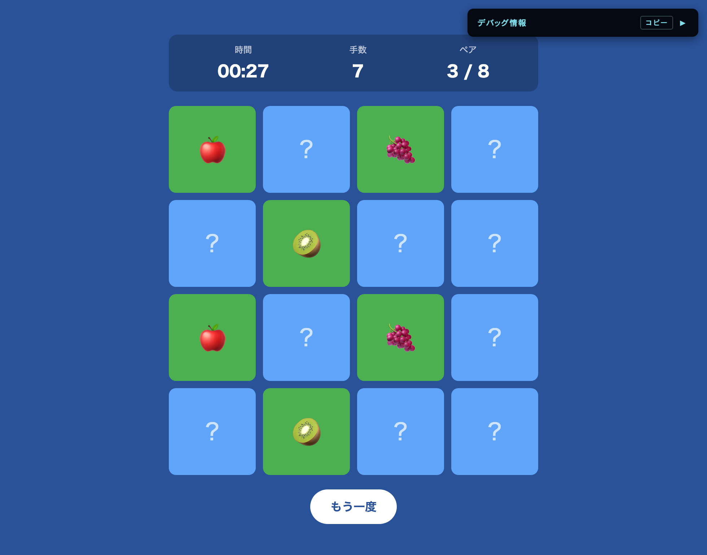

---

## 今日の流れ

全部で 6 章あります。Chapter 3 のあとに 10 分の休憩を入れます。

| | 章 | 内容 |
|---|---|---|
| 1 | JS で画面を組み立てる | カードを盤面に並べる |
| 2 | イベントと状態 | クリックでカードをめくる |
| 3 | 状態遷移と非同期 | 一致判定と待ち時間 |
| 4 | カードをシャッフル | 毎回ちがう並びで遊べるようにする |
| 5 | 時間で動く画面 | タイマー、手数、クリア判定 |
| 6 | 状態を初期化する | リセット機能 |

前半の 1〜3 章でゲームの芯を作り、後半の 4〜6 章で遊べる形に仕上げます。

---

## 進め方

各章は説明とコードを書く演習の繰り返しです。演習には 3 つのモードがあります。

| モード | 見分け方 | やること |
|---|---|---|
| <span class="tag-challenge">自力</span> | 要件とヒントだけ提示 | コードなしで書き、次スライドで答え合わせ |
| <span class="tag-write">記述</span> | 【A】等の穴 | 構造は見えている中で埋める箇所を考える |
| <span class="tag-unlock">コピペ</span> | 完成コードが載っている | そのまま手元に貼る (数行の写経も含む) |

間に合わなくても大丈夫です。各章のチェックポイントに「追いつき用」のコードを出すので、`script.js` を丸ごと置き換えれば次の章から始められます。

---

## 準備: StackBlitz テンプレを開こう

https://stackblitz.com/edit/web-platform-qnett8m2?file=script.js

上のリンクを開いてください。

右のようにファイルが 4 つ見えていれば OK です。その右にプレビューが出ます。

プレビューにカードはまだ出ていなくて大丈夫です。

今日さわるのはほぼ `script.js` だけです。最初には `symbols` 配列だけが用意されているので、ここから 1 行ずつ書き足していきます。

新しい関数・変数の追加は、指示がなければ `script.js` のいちばん最後に足します。既存コードへの追記や書き換えのときは、周囲の行をアンカーとしてスライドに載せます。

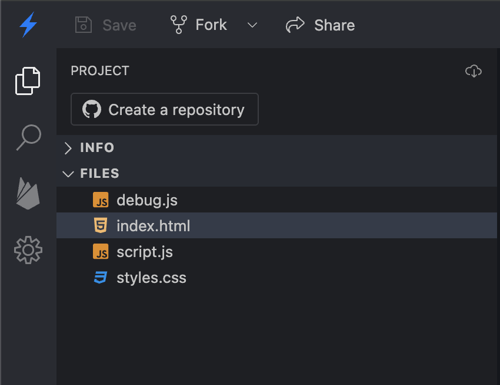

---

## 準備: 診断パネルの見方

プレビュー右上の黒い小窓が診断パネルです。`debug.js` が作っているので、このファイルは触らなくて大丈夫です。

- 章ごとの `N/M ✓` が進み具合です。書いた分が動いていれば数が増えます
- `getElementById` の id ミスや `clik` のようなイベント名のミスなど、エラーが出ずに静かに壊れるミスも捕まえます
- 詰まったら、お気軽にチャットなどでメンターにご連絡ください

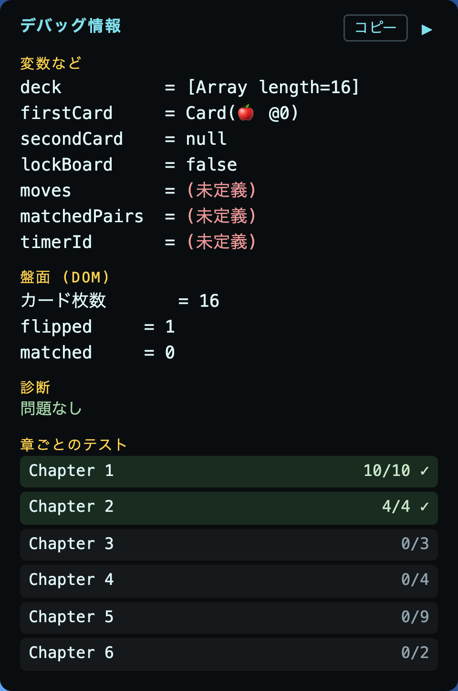

---

<!-- _class: lead -->

# Chapter 1
## カードを盤面に並べる

---

## Chapter 1 のゴール

16 枚のカードを 4×4 で並べます。

- カードのデータ (絵柄配列) を作る
- カード 1 枚を作る関数を用意する
- 盤面全体を描く関数を作って呼ぶ

この章では JavaScript から HTML/CSS を組み立てていきます。

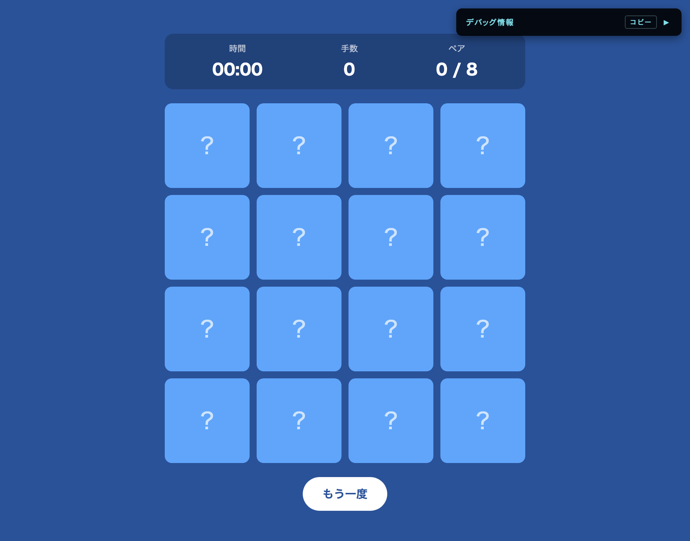

---

## 1-1. カードのデータを作る

神経衰弱は同じ絵柄が 2 枚ずつ必要です。`symbols` を自分自身と連結して、16 枚の `deck` を作ります。

`concat` は 2 つの配列をつなげた新しい配列を返します。元の配列は変わりません。
例: `[1, 2].concat([3, 4])` → `[1, 2, 3, 4]`

`array.length` は配列の要素数です。

<span class="tag-unlock">コピペ</span> `script.js` のいちばん最後に書き足します。

```javascript
// STUDENT [1-1]: symbols を 2 回連結して 16 枚の deck を作る
const deck = symbols.concat(symbols);

console.log(deck);
console.log("枚数:", deck.length);
```

---

## 1-1 の確認: Console で見る

`console.log(...)` は、開発者ツールの Console に値を出す命令です。書いたコードが思ったとおりに動いているか確かめるのに使います。

Console はプレビュー右下の Console タブ、または F12 (Mac: Cmd + Option + I) で開けます。下のように配列が 1 行、続いて「枚数: 16」が出ていれば OK です。

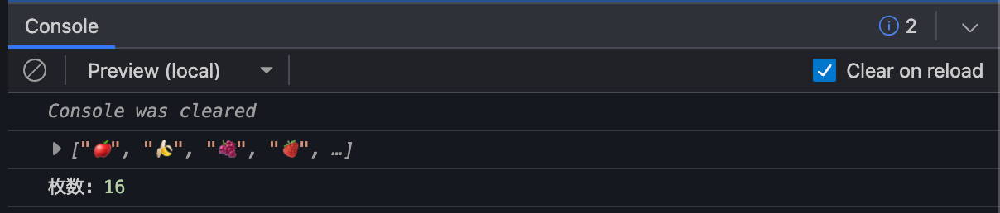

確認できたら `console.log` の 2 行は消します。この先は使いません。

---

## HTML には空の入れ物だけ置く

16 枚のカードは、`index.html` に `<div class="card">` を 16 個書いても並べられます。ただ手で 16 個書くのは大変で、絵柄を変えるときもペア数を変えるときも、そのぶん書き直しになります。

```html
<!-- 16 個書くとこうなる -->
<div id="board">
  <div class="card">?</div>
  <div class="card">?</div>
  <!-- ...あと 14 個 -->
</div>

<!-- 配布した index.html。中身は空にしてある -->
<div id="board"></div>
```

そこで HTML には空の入れ物だけ置いて、中身は JS が作ります。

---

<!-- _class: tight -->

## JS から HTML を動的に作る (DOM)

HTML に書いていない要素も、JS から作って足せます。`document.createElement()` で要素を作り、`appendChild()` で `div#board` の中に入れると、その時点でカードが画面に出ます。


図は配布した `index.html` の構造です。ブラウザはこの形で HTML を持っていて、これを DOM (Document Object Model) と呼びます。点線が、これから JS で作って差し込む部分です。

---

## 1-2. DOM 要素を取得する

`#board` は何度も使うので、最初に取得して変数にしておきます。

<span class="tag-unlock">コピペ</span>

```javascript
// STUDENT [1-2]: #board を取得して boardEl に入れる
const boardEl = document.getElementById("board");
```

この資料では、DOM 要素を入れる変数の末尾に `El` (Element の略) を付けて統一します。

---

<!-- _class: tight -->

## 1-3. カード 1 枚を作る関数

<span class="tag-unlock">コピペ</span> 要素の組み立てが長いのでそのまま貼って OK。中身は次のスライドで説明します。

```javascript
function createCard(symbol, index) {
  const card = document.createElement("div");
  card.className = "card";
  card.dataset.index = index;
  card.dataset.symbol = symbol;

  const inner = document.createElement("div");
  inner.className = "card-inner";
  const front = document.createElement("div");
  front.className = "card-front";
  front.textContent = "?";
  const back = document.createElement("div");
  back.className = "card-back";
  back.textContent = symbol;

  inner.appendChild(front);
  inner.appendChild(back);
  card.appendChild(inner);
  return card;
}
```

`card` の中に `inner`、その中に `front` と `back` を入れた入れ子構造を組み立てて `return` します。できあがる形は次のスライドで見ます。

---

<!-- _class: tight -->

## 1-3 補足: できあがる HTML

`createCard("🍎", 0)` を呼ぶと、この HTML が組み立てられて返ってきます。

```html
<div class="card" data-index="0" data-symbol="🍎">
  <div class="card-inner">
    <div class="card-front">?</div>
    <div class="card-back">🍎</div>
  </div>
</div>
```

`className` で付けたクラスは `class` 属性、`dataset` で付けた値は `data-` 属性、`textContent` で入れた文字はタグの中身になります。

`dataset` は自分で決めた名前でデータを要素に持たせる仕組みです。絵柄をここにも入れておくと、あとから `card.dataset.symbol` で絵柄だけを取り出せます。Chapter 3 の一致判定で使います。

この入れ子を DOM のツリーで見ると、右の図の形になります。盤面のツリーで 1 つの箱だった `div.card` の中身です。


---

<!-- _class: tight -->

## 1-4. 盤面全体を描く関数

`deck` の各要素をカードにして `#board` に並べる `renderBoard` 関数を書きます。今回初めて使うもの:

- `parent.replaceChildren()` — 親の中身を全部削除
- `array.forEach((要素, index) => { ... })` — 配列の全要素に処理を実行

<span class="tag-write">記述</span> コードブロックをそのまま `script.js` に貼って、【A】〜【B】を書き換えましょう。

<div class="timer-box" data-seconds="120">
  <button class="timer-btn" data-delta="-60">−</button>
  <div class="timer"></div>
  <button class="timer-btn" data-delta="60">＋</button>
</div>

```javascript
// STUDENT [1-4]:
// A: 1-3 で書いた「カード 1 枚を作る関数」の名前
// B: 親要素に子要素を追加するメソッド (1-3 でも使った)
function renderBoard() {
  boardEl.replaceChildren(); // 中身を全部削除

  // deck の要素を 1 つずつ取り出して繰り返す
  deck.forEach((symbol, index) => {
    const card = 【A】(symbol, index);
    boardEl.【B】(card);
  });
}

renderBoard();
```

---

## 1-4 答え合わせ

```javascript
function renderBoard() {
  boardEl.replaceChildren(); // 中身を全部削除

  // deck の要素を 1 つずつ取り出して繰り返す
  deck.forEach((symbol, index) => {
    const card = createCard(symbol, index);
    boardEl.appendChild(card);
  });
}

renderBoard();
```

- A: `createCard` — 1-3 で書いた関数
- B: `appendChild` — 親要素に子要素を追加

---

## Chapter 1 チェックポイント

- プレビューに 16 枚のカードが 4×4 に並んでいる
- カードは全部「?」の面 (青) を向いている

<div class="note">
動かないときは:
<ul>
<li>F12 → Console にエラーが出ていないか</li>
<li><code>renderBoard()</code> を呼び忘れていないか</li>
<li><code>symbols.concat(symbols)</code> のドットを忘れていないか</li>
</ul>
エラーメッセージ別のよくある落とし穴は、末尾の付録にまとめてあります。
</div>

<div class="rescue">
追いつき用: <code>ch1.js</code>
</div>


---

<!-- _class: lead -->

# Chapter 2
## クリックでカードをめくる

---

## Chapter 2 のゴール

カードをクリックすると表向きになるようにします。ただし次のルールを守ります。

- すでにめくったカードは再クリックしても反応しない
- 2 枚めくったあとの判定中は、クリックしてもめくれないようにする (Chapter 3 で使う)

どちらも、クリックされた時点で次のことが分かっていないと判定できません。

- そのカードはもうめくれているか
- いま判定待ち中か
- めくったのが 1 枚目か 2 枚目か (2 枚そろったら比べるため)

今どうなっているかを保持しておく変数を状態変数と呼びます。この章では状態変数を用意し、それを見て「めくるか、何もしないか」を決める関数を書き、カードに紐づけていきます。

---

<!-- _class: tight -->

## 配布 CSS の約束とクラスの付け外し

CSS 側は次のように書かれています。JS 側はクラスを付けるだけで見た目が動きます。

- `flipped` クラスが付いたら表向きに反転するアニメーションが再生される
- `matched` クラスが付いたら緑色でハイライトされる

カードは `card` を持ったまま `flipped` が足されて `class="card flipped"` になり、両方が付いた要素にだけ効く `.card.flipped` の CSS が反応します。

足し引きに使うのが `classList` です。追加・削除・有無の確認ができます。`className` のほうは class 属性を丸ごと置き換える書き方なので、めくるときに使うと `card` が消えてしまいます。

```javascript
card.className = "flipped";      // class="flipped" になり、card が消える
card.classList.add("flipped");   // class="card flipped" になる
```

要素を 0 から組み立てるときは `className`、すでにあるクラスに足し引きするときは `classList` を使います。

---

## 2-1. 状態変数を用意する

「1 枚目にめくったカード」「2 枚目にめくったカード」「ロック中か」の 3 つを変数で持ちます。

<span class="tag-unlock">コピペ</span> `deck` の宣言の下あたりに追加します。

```javascript
// STUDENT [2-1]: めくりの状態を持つ変数を用意する
let firstCard = null;    // 1 枚目にめくったカード
let secondCard = null;   // 2 枚目にめくったカード
let lockBoard = false;   // 2 枚めくったあとに他のカードを押させないためのロック
```

- `null` は「まだ何もない」を意図的に置く印。`undefined` (代入し忘れの状態) と使い分けます
- 中身を書き換えるので `let`。`const` にすると再代入エラーになります

---

## 2-2. クリック処理を関数にする (仕組み)


図中の日本語ラベルを、2-1 で用意した状態変数や「配布 CSS の約束」のクラス名に置き換えるとコードになります。次のスライドで書きます。

---

<!-- _class: tight -->

## 2-2. クリック処理を関数にする (コード)

<span class="tag-write">記述</span> 前スライドのフロー図を見ながら【A】〜【D】を埋めます。

<div class="timer-box" data-seconds="240">
  <button class="timer-btn" data-delta="-60">−</button>
  <div class="timer"></div>
  <button class="timer-btn" data-delta="60">＋</button>
</div>

```javascript
// STUDENT [2-2]: フロー図に沿って書く
// A: すでに用意した状態変数のどれか (ロック用)
// B: CSS 側が反応するクラス名 (文字列)
// C: クラスを追加する classList のメソッド名
// D: すでに用意した状態変数のどれか (1 枚目)
function handleCardClick(card) {
  if (【A】) return;
  if (card.classList.contains(【B】)) return;

  card.classList.【C】(【B】);

  if (!【D】) {
    firstCard = card;
    return;
  }

  secondCard = card;
}
```

---

<!-- _class: tight -->

## 2-2 答え合わせ

```javascript
function handleCardClick(card) {
  if (lockBoard) return;
  if (card.classList.contains("flipped")) return;

  card.classList.add("flipped");

  if (!firstCard) {
    firstCard = card;
    return;
  }

  secondCard = card;
}
```

- A: `lockBoard` — ロック中はここで打ち切り、めくる処理まで進ませない
- B: `"flipped"` — 配布 CSS がこのクラスで表向きアニメを流す
- C: `add` — 上の `contains` と同じ `classList` のメソッド。クラスを付けるのが `add`
- D: `firstCard` — `null` (falsy) のとき `!firstCard` が真になる

---

## 2-3. カードにクリックイベントを付ける

`element.addEventListener("click", 関数)` で、その要素がクリックされたときに実行する関数を紐づけられます。`createCard` 関数の中の `return card;` の直前に 1 行追加します。

<span class="tag-unlock">コピペ</span>

```javascript
function createCard(symbol, index) {
  // ... (1-3 で書いたコードは省略) ...
  card.appendChild(inner);

  // STUDENT [2-3]: この 1 行を追加
  card.addEventListener("click", () => handleCardClick(card));

  return card;
}
```

---

## 2-3 補足: アロー関数

2-3 で貼った `() => ...` は、`=>` を使った短い関数の書き方で、アロー関数と呼びます。`addEventListener` に渡したいのは実行した結果ではなく、あとで実行してほしい処理そのものなので、処理を関数で包んで渡します。

```javascript
// カードを作った瞬間に実行される → 16 枚とも最初からめくれてしまう
card.addEventListener("click", handleCardClick(card));

// クリックされたときに実行される
card.addEventListener("click", () => handleCardClick(card));
```

`=>` の左が引数です。今回は空ですが、1-4 の `deck.forEach((symbol, index) => { ... })` では、forEach が配列の要素と番号をここに渡していました。

---

## Chapter 2 チェックポイント

- カードをクリックすると絵柄が表向きに反転する
- 一度めくったカードは、二度目のクリックでは反応しない
- 3 枚目以降もめくれてしまう (これは Chapter 3 で止めます)

<div class="rescue">
追いつき用: <code>ch2.js</code>
</div>


---

<!-- _class: lead -->

# Chapter 3
## 2 枚めくって一致判定

---

## Chapter 3 のゴール

ペア判定を作ります。

- 2 枚めくったら、絵柄が同じか比べる
- 同じなら `matched` にして残す
- 違うなら少し待って伏せに戻す
- 判定待ちの間は他のカードを反応させない

---

<!-- _class: tight -->

## 3-1. handleCardClick に判定分岐を追加

<span class="tag-write">記述</span> `handleCardClick` の中、`secondCard = card;` の下に判定処理を書き足します。【A】を埋めましょう。

<div class="timer-box" data-seconds="90">
  <button class="timer-btn" data-delta="-60">−</button>
  <div class="timer"></div>
  <button class="timer-btn" data-delta="60">＋</button>
</div>

```javascript
// STUDENT [3-1]: 2 枚目がめくれたら判定する
// A: 2 枚が一致しているかを決めている値
secondCard = card;

const isMatch = firstCard.dataset.【A】 === secondCard.dataset.【A】;

if (isMatch) {
  handleMatch();
} else {
  handleMismatch();
}
```

<details class="hint">
<summary>ヒント</summary>

1-3 の `createCard` で `dataset` に何を入れたか見返してみましょう

</details>

---

<!-- _class: tight -->

## 3-1 答え合わせと `===` の話

```javascript
const isMatch = firstCard.dataset.symbol === secondCard.dataset.symbol;
```

- A: `symbol` — `createCard` で `card.dataset.symbol = symbol` と書いたのを回収

`===` は値と型を両方チェックする厳密な比較演算子です。

- `"🍎" === "🍎"` → `true`、`"🍎" === "🍇"` → `false` (いま書いた一致判定)
- `"1" === 1` → `false` (`"1"` は文字列、`1` は数値で型が違う)
- `"1" == 1` → `true` (`==` は型を揃えてから比べるので通ってしまう)

特別な理由がない限り `===` を使うのが定石です。

---

<!-- _class: tight -->

## 3-2. 一致したときの処理 (自力で書く)

<span class="tag-challenge">自力</span> コードは見せません。3 分書いてから次のスライドで答え合わせします。書けたらリアクションで教えてください。

<div class="timer-box" data-seconds="180">
  <button class="timer-btn" data-delta="-60">−</button>
  <div class="timer"></div>
  <button class="timer-btn" data-delta="60">＋</button>
</div>

3-1 で `handleMatch()` を呼ぶところまでは書けています。呼ばれる側を作ります。

<div class="task">

やること

- `handleMatch` という関数を作る (3 行)
- めくった 2 枚に、CSS が緑に光らせるクラスを付ける
- 次のターンに向けた片付けを呼ぶ

</div>

<div class="hint-box">

ヒント

- クラス名は「配布 CSS の約束」で出てきた 2 つのうちの片方
- クラスを付けるメソッドは 2-2 で使ったもの
- 片付けは `resetTurn()` という名前で呼び出しておく。中身は 3-4 で書きます

</div>

---

## 3-2 答え合わせ

```javascript
function handleMatch() {
  firstCard.classList.add("matched");
  secondCard.classList.add("matched");
  resetTurn();
}
```

`matched` クラスが付くと CSS 側が緑に光らせます。
一致・不一致どちらも次ターンへの片付けは共通なので `resetTurn` にまとめます。

この `handleMatch` は Chapter 5 でペア数の更新とクリア判定を足して書き換えます。

---

<!-- _class: tight -->

## 3-3. 一致しなかったときの処理

<span class="tag-unlock">コピペ</span>

```javascript
// STUDENT [3-3]: 不一致は 800ms 待って伏せに戻す
function handleMismatch() {
  lockBoard = true;

  setTimeout(() => {
    firstCard.classList.remove("flipped");
    secondCard.classList.remove("flipped");
    resetTurn();
  }, 800);
}
```

`remove` は 2-2 で付けた `flipped` を外すメソッドです。外すと CSS が伏せ表示に戻します。

`setTimeout(関数, ミリ秒)` は、指定時間後にその関数を 1 回だけ実行します。繰り返し実行したい場合は `setInterval` を使います。

<div class="aside">

800 ms は「見えている時間は短すぎず、待たされ感は少ない」を狙った値です。

</div>

---

## なぜ `lockBoard = true` するのか

`setTimeout(関数, 800)` は、ブラウザに「800 ms 後にこれを呼んで」と関数を預けて、すぐ次の行に進みます。2-3 の `addEventListener` で関数を預けたのと同じ形で、呼ぶきっかけがクリックから時間に変わっただけです。預けた関数が後から呼ばれるこの動きを非同期と呼びます。

`setTimeout` で待っている 800 ms のあいだも、カードのクリックは受け付けられます。そのため、伏せに戻るまでにユーザーは 3 枚目、4 枚目をめくれてしまいます。

`lockBoard = true` にすると、`handleCardClick` 先頭の `if (lockBoard) return;` に引っかかり、追加のクリックを無視できます。

---

<!-- _class: tight -->

## 3-4. ターンの片付け (自力で書く)

<span class="tag-challenge">自力</span> コードは見せません。3 分書いてから次のスライドで答え合わせします。書けたらリアクションで教えてください。

<div class="timer-box" data-seconds="180">
  <button class="timer-btn" data-delta="-60">−</button>
  <div class="timer"></div>
  <button class="timer-btn" data-delta="60">＋</button>
</div>

一致でも不一致でも、2 枚判定した後は「次のターンを迎える」ための後片付けが必要です。

<div class="task">

やること

- `resetTurn` という関数を作る (3 行)
- 2-1 で用意した 3 つの状態変数を、それぞれ最初の値に戻す

</div>

<div class="hint-box">

ヒント

- 対象の状態変数: `firstCard`, `secondCard`, `lockBoard`
- 「最初の値」は 2-1 で見た値を思い出す (2 つは `null`、1 つは `false`)
- `handleMatch` と `handleMismatch` で `resetTurn()` を呼び出しているので、この関数を作ればチェックポイントに繋がる

</div>

---

## 3-4 答え合わせ

```javascript
function resetTurn() {
  firstCard = null;
  secondCard = null;
  lockBoard = false;
}
```

一致でも不一致でも同じ後片付けを行うので関数にまとめておくと、変更が必要になっても 1 箇所で済みます。この関数は Chapter 6 のリセット機能でも再利用します。

書けた人へ: `lockBoard = false;` の行を消すとどうなるか予想してから試してみてください。「判定待ちのフラグ」が戻らないと、以降のクリックがすべて弾かれます。

---

## Chapter 3 チェックポイント

- 同じ絵柄を 2 枚選ぶと、両方とも緑色に光ったまま残る
- 違う絵柄を選ぶと、少し待って両方伏せに戻る
- 判定待ちの間は他のカードが反応しない

<div class="note">
動かないときは、Console のエラー行番号と関数名スペルを見てください。<code>dataset.symbol</code> の綴り、<code>handleMatch</code> と <code>handleMismatch</code> の呼び分けが typo で入れ替わっていないかチェック。
</div>

<div class="rescue">
追いつき用: <code>ch3.js</code>
</div>

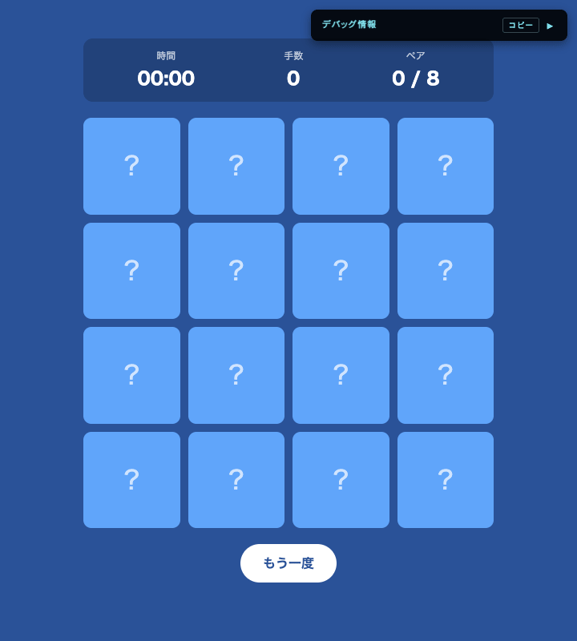

---

<!-- _class: lead break -->

# 休憩 (10 分)

<div class="timer-box" data-seconds="600">
  <button class="timer-btn" data-delta="-60">−</button>
  <div class="timer"></div>
  <button class="timer-btn" data-delta="60">＋</button>
</div>

後半はシャッフル・タイマー・手数・リセットを足して、遊べる状態に仕上げます。

---

<!-- _class: lead -->

# Chapter 4
## カードをシャッフル

---

## Chapter 4 のゴール

今のままだとカードの並びが毎回同じなので、配置をランダムにします。

シャッフルには Fisher-Yates という定番アルゴリズムを使います。よく見かける `array.sort(() => Math.random() - 0.5)` は、実は統計的にきれいに混ざりません。詳しくは末尾の付録に回します。

---

## 4-1. Fisher-Yates シャッフル

後ろから前へ走査し、`i` と `0 〜 i` の中のランダムな位置を入れ替える定番アルゴリズムです。

<span class="tag-unlock">コピペ</span>

```javascript
function shuffle(array) {
  const result = array.slice();
  for (let i = result.length - 1; i > 0; i--) {
    const j = Math.floor(Math.random() * (i + 1));
    [result[i], result[j]] = [result[j], result[i]];
  }
  return result;
}
```

---

## 4-1 補足: 使っている書き方

- `array.slice()` — 配列をコピー (元を壊さない)
- `Math.floor(Math.random() * n)` — 0 以上 n 未満の整数をランダムに得る定番の書き方
- `[a, b] = [b, a]` — 分割代入による値の交換

冒頭で `array.slice()` を呼んで新しい配列を作り、元の `array` を変更しないようにしています。

---

## 4-2. deck をシャッフルする

`deck` の宣言を書き換えます。`const` から `let` に変わっている点に注意してください。

<span class="tag-unlock">コピペ</span>

```javascript
// 変更前
const deck = symbols.concat(symbols);

// 変更後
let deck = shuffle(symbols.concat(symbols));
```

Chapter 6 のリセットでも `deck` に新しい配列を入れ直します。`const` のままだと再代入で `TypeError` になるので `let` に変えます。

---

## Chapter 4 チェックポイント

- ブラウザをリロードするたびにカードの並びが変わる
- ペア (同じ絵柄) はちゃんと 2 枚ずつ含まれている

<div class="rescue">
追いつき用: <code>ch4.js</code>
</div>

---

<!-- _class: lead -->

# Chapter 5
## タイマー・手数・クリア判定

---

## Chapter 5 のゴール

画面上部の 3 つの表示 (時間・手数・ペア) を動かし、クリア判定を入れます。

- 時間: 1 枚目をめくった瞬間から計測開始
- 手数: 2 枚目をめくるたびに +1
- ペア: ペアが揃うたびに更新
- 全ペア揃ったらクリアメッセージ表示 + タイマー停止

---

## 5-1. 状態変数と DOM 参照を追加

<span class="tag-unlock">コピペ</span> いちばん最後ではなく、2-1 で書いた `let lockBoard = false;` の下にまとめて追加します。

```javascript
// STUDENT [5-1]: 手数、ペア数、タイマー用の状態を用意
let moves = 0;
let matchedPairs = 0;
let timerId = null;
let startTime = 0;

const timerEl = document.getElementById("timer");
const movesEl = document.getElementById("moves");
const pairsEl = document.getElementById("pairs");
const clearMessageEl = document.getElementById("clear-message");
```

状態変数は 1 箇所に集めておくと、Chapter 6 のリセットで「何を戻せばよいか」が一目で分かります。

---

<!-- _class: tight -->

## 5-2. 手数を更新 (自力で書く)

<span class="tag-challenge">自力</span> コードは見せません。3 分書いてから次のスライドで答え合わせします。書けたらリアクションで教えてください。

<div class="timer-box" data-seconds="180">
  <button class="timer-btn" data-delta="-60">−</button>
  <div class="timer"></div>
  <button class="timer-btn" data-delta="60">＋</button>
</div>

書く場所は `handleCardClick` の中、`secondCard = card;` と 3-1 で書いた `const isMatch = ...` の間です。この 2 行が「状態を変えたら描画を更新する」という型になります。

<div class="task">

やること (2 行)

- 5-1 で用意した「手数」の状態を 1 増やす
- 手数を表示している要素 (5-1 で取得した DOM 参照) のテキストを、更新後の値に書き換える

</div>

<div class="hint-box">

ヒント

- `x = x + 1` は `x++` と短く書ける
- テキストの書き換えは `element.textContent = ...`

</div>

---

## 5-2 答え合わせ

`handleCardClick` の中、`secondCard = card;` の直後、判定の前です。

```javascript
secondCard = card;

moves++;                       // ここから 2 行が今回書いた分
movesEl.textContent = moves;

const isMatch = firstCard.dataset.symbol === secondCard.dataset.symbol; // 3-1 で書いた行
```

`moves++` は `moves = moves + 1` の短縮形。状態を +1 したら、その直後に描画を更新する。この 2 行 1 セットが、今日の講座で一番繰り返される型です。

---

## 5-3. タイマーの開始と停止

<span class="tag-unlock">コピペ</span> そのまま貼って OK。

```javascript
function startTimer() {
  startTime = Date.now();
  // 1000 ms 間隔だと秒表示のズレが目立つので少し細かめに回す
  timerId = setInterval(() => {
    const elapsed = Math.floor((Date.now() - startTime) / 1000);
    const mm = String(Math.floor(elapsed / 60)).padStart(2, "0");
    const ss = String(elapsed % 60).padStart(2, "0");
    timerEl.textContent = `${mm}:${ss}`;
  }, 250);
}

function stopTimer() {
  clearInterval(timerId);
  timerId = null;
}
```

---

## 5-3 補足: 何をしているか

貼ったコードに出てくるものを押さえておきます。

- `startTime`: `Date.now()` で取った開始時刻 (ミリ秒)。経過秒は `(Date.now() - startTime) / 1000` で出る
- `timerId`: 動いている `setInterval` の識別子。あとで止めるために保持する。5-4 で `!timerId` として再登場
- `` `${mm}:${ss}` ``: テンプレートリテラル。変数を埋め込める

`setInterval` は `clearInterval` を呼ぶまで止まりません。不要になったら必ず止めます (`stopTimer` の役割)。

---

## 5-4. タイマー開始を組み込む

<span class="tag-unlock">コピペ</span> `handleCardClick` の `if (!firstCard)` の分岐に 1 行追加します。

```javascript
// STUDENT [5-4]: 1 枚目をめくった瞬間にタイマー開始 (まだ動いていなければ)
if (!firstCard) {
  firstCard = card;
  if (!timerId) startTimer();
  return;
}
```

`!timerId` は「まだタイマーが動いていない (ID が `null` のまま)」を意味します。2 枚目、3 枚目のクリックでは既に ID が入っているので、`startTimer` は呼ばれず、最初の 1 回だけ動きます。

---

<!-- _class: tight -->

## 5-5. handleMatch にペア数とクリア判定を追加

<span class="tag-write">記述</span> 3-2 で書いた `handleMatch` を書き換えます。【A】〜【C】を埋めましょう。

<div class="timer-box" data-seconds="240">
  <button class="timer-btn" data-delta="-60">−</button>
  <div class="timer"></div>
  <button class="timer-btn" data-delta="60">＋</button>
</div>

```javascript
// STUDENT [5-5]: 3-2 の handleMatch を書き換え。ペア数の更新と、全ペア揃ったらクリア
// A: ペア数を 1 増やして、その場で表示も更新する 2 行。表示は「3 / 8」の形
// B: 「ペアが全部揃った」を表す値。絵柄種類を変えても正しく判定できる書き方
// C: クリアしたあとも動き続けてしまうものを止める処理
function handleMatch() {
  firstCard.classList.add("matched");
  secondCard.classList.add("matched");
  【A】
  resetTurn();

  if (matchedPairs === 【B】) {
    【C】;
    clearMessageEl.textContent = `クリア！ ${moves}手 / ${timerEl.textContent}`;
  }
}
```

<details class="hint">
<summary>ヒント</summary>

A は 5-2 で書いた `moves` の 2 行と同じ形。B は `8` と直接書くと絵柄の種類を減らしたときにクリアできなくなります

</details>

---

## 5-5 答え合わせ

```javascript
  matchedPairs++;
  pairsEl.textContent = `${matchedPairs} / ${symbols.length}`;
  // ...
  if (matchedPairs === symbols.length) {
    stopTimer();
```

- A: 5-2 の `moves` と同じ 2 行 1 セット。状態を変えたら、その場で描画も更新する
- B: `symbols.length` — シンボルの種類数 = 揃えるべきペア数。`8` と直接書いても動きますが、絵柄の種類を変えると判定が追従しません
- C: `stopTimer()` — `setInterval` は `clearInterval` を呼ぶまで止まりません

マジックナンバーを避けて由来のある値を使うのは、可読性を上げる基本的な習慣です。この 2 行 1 セットは今日 2 回目で、Chapter 6 のリセットでも同じ形が出てきます。

---

## Chapter 5 チェックポイント

- 1 枚目をめくった瞬間からタイマーが動き出す
- 2 枚目をめくるたびに手数が +1 される
- ペアを取るたびにペア数が更新される
- 全ペア取ったらクリアメッセージが出て、タイマーが止まる

<div class="rescue">
追いつき用: <code>ch5.js</code>
</div>


---

<!-- _class: lead -->

# Chapter 6
## リセット機能

---

## Chapter 6 のゴール

「もう一度」ボタンを機能させて最初から遊べるようにし、同時に「初回起動」と「リセット」を同じ処理で扱うよう整理します。

---

<!-- _class: tight -->

## 6-1. resetGame 関数

<span class="tag-write">記述</span> 状態変数を初期値に戻し、`deck` を新しくシャッフルして盤面を作り直します。【A】〜【C】を埋めましょう。

<div class="timer-box" data-seconds="240">
  <button class="timer-btn" data-delta="-60">−</button>
  <div class="timer"></div>
  <button class="timer-btn" data-delta="60">＋</button>
</div>

```javascript
// STUDENT [6-1]: ゲームを初期状態に戻す
// A: 押すたびに並びが変わる、新しい 16 枚の deck
// B: めくりの 3 つの状態を初期値に戻す処理
// C: 新しい deck でカードを作り直す処理
function resetGame() {
  stopTimer();
  deck = 【A】;
  【B】;
  moves = 0;
  matchedPairs = 0;
  timerEl.textContent = "00:00";
  movesEl.textContent = "0";
  pairsEl.textContent = `0 / ${symbols.length}`;
  clearMessageEl.textContent = "";
  【C】;
}
```

<details class="hint">
<summary>ヒント</summary>

A は 4-2、B は 3-4、C は 1-4 で書いたものです

</details>

---

<!-- _class: tight -->

## 6-1 答え合わせ

```javascript
function resetGame() {
  stopTimer();
  deck = shuffle(symbols.concat(symbols));
  resetTurn();
  moves = 0;
  matchedPairs = 0;
  timerEl.textContent = "00:00";
  movesEl.textContent = "0";
  pairsEl.textContent = `0 / ${symbols.length}`;
  clearMessageEl.textContent = "";
  renderBoard();
}
```

- A: `shuffle(symbols.concat(symbols))` — 4-2 と同じ式。押すたびに並びが変わる
- B: `resetTurn()` — 3-4 で書いた関数をそのまま再利用。同じ 3 行を書き直す必要はない
- C: `renderBoard()` — 新しい `deck` でカードを作り直す

5-1 で状態変数を 1 箇所に集めておいたので、「何を戻せばよいか」を上から順に確認できます。戻し忘れが 1 つでもあると、リセットしたのに前の値が残ります。

---

## 6-2. リセットボタンにイベントを付ける

<span class="tag-write">記述</span> 【A】はどちらでしょうか。理由も考えてみてください。

<div class="timer-box" data-seconds="60">
  <button class="timer-btn" data-delta="-60">−</button>
  <div class="timer"></div>
  <button class="timer-btn" data-delta="60">＋</button>
</div>

```javascript
// STUDENT [6-2]: もう一度ボタンで resetGame を呼ぶ
// A: resetGame  または  resetGame()
const resetBtn = document.getElementById("reset-btn");
resetBtn.addEventListener("click", 【A】);
```

<details class="hint">
<summary>ヒント</summary>

2-3 補足で、`handleCardClick(card)` をそのまま渡すと何が起きたかを思い出してみましょう

</details>

---

## 6-2 答え合わせ

```javascript
resetBtn.addEventListener("click", resetGame);
```

- A: `resetGame` — カッコなし

カッコを付けて `resetGame()` と書くと、クリック時ではなく `addEventListener` を呼んだ瞬間に関数が実行されてしまいます。2-3 でカードのクリックを付けたときと同じ話です。

「クリック時に実行したい」ならカッコなし、「今すぐ実行したい」ならカッコあり、というイメージです。

2-3 では `() => handleCardClick(card)` とアロー関数で包みました。あちらは `card` を渡す必要があったためで、渡す引数がなければ、ここのように関数名をそのまま書けます。

---

## 6-3. 初回描画を resetGame に統一

<span class="tag-unlock">コピペ</span> Chapter 1 で書いた `renderBoard();` の呼び出しを消して、代わりに `resetGame();` をファイルのいちばん最後に置きます。

```javascript
// 削除 (renderBoard 関数の下にある呼び出し)
// renderBoard();

// 追加 (ファイルのいちばん最後)
resetGame();
```

初回起動もリセットも同じ処理で扱え、状態変数の初期化が一箇所に集約されます。

<div class="note">
<code>resetGame();</code> は必ず 5-1 で書いた変数より後ろに置きます。<code>let</code> と <code>const</code> は宣言より前で読むとエラー (<code>Cannot access ... before initialization</code>) になるためです。
4-2 で <code>shuffle</code> をいちばん最後に書いても上の行から呼べたのは、<code>function</code> の宣言だけの性質です。
</div>

---

## Chapter 6 チェックポイント

- 「もう一度」ボタンを押すと盤面がシャッフルし直されて再スタートする
- ゲーム途中で押してもリセットされる
- タイマー、手数、ペア数、クリアメッセージがすべて初期化される

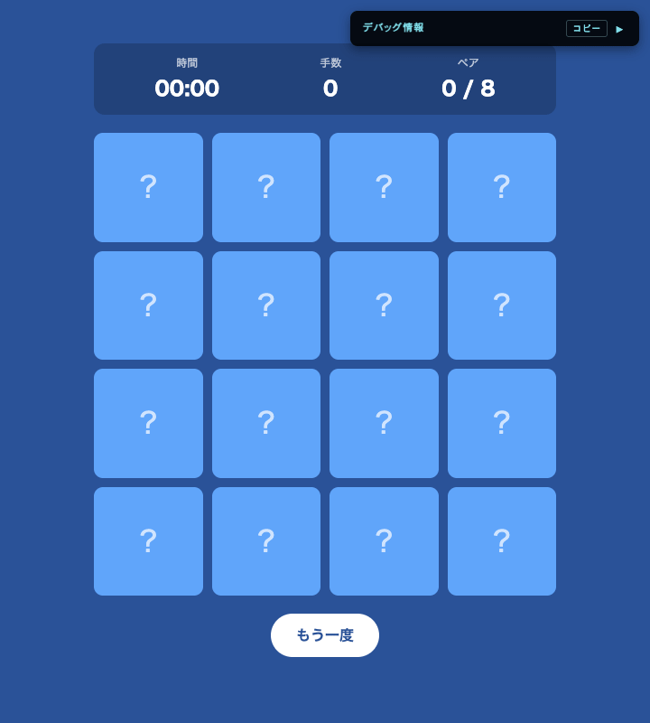

---

<!-- _class: lead -->

# 完成


---

## 学びの持ち帰り

このゲームと同じ考え方で作れるものの例:

- 状態を持つ UI 一般 (TODO リスト、フォーム、ダッシュボード)
- 一定間隔で更新する画面 (株価、時計、通知バッジ)
- クリックで反応する UI (ボタン、モーダル、ドラッグ操作)

「状態 → 描画」の分け方は、明日から書くコードでも意識してみてください。今日の中で何度も繰り返した 2 行 1 セット (`状態を +1` → `element.textContent = ...`) は、他のアプリでも同じ形で出てきます。

---

<!-- _class: lead -->

# おつかれさまでした

今日書いたコードは StackBlitz に残るので、続きはいつでも触れます。

この資料と、応用課題の実装例 (`examples/challenges/`) はこちらにあります。

https://github.com/jigintern/study_session_materials/tree/main/2026/shinkei-suijaku

---

## 応用課題の目次

ここからは、もっとやりたい人向けの応用課題です。今日この場でやらなくても、あとから自分のペースで試せます。

全部で 9 個あります。着手しやすい順に並べていて、区分ごとに答えの置き場所が違います。

- すぐできる (3 個) — 答えは課題文のなかにあります
- 少し調べる (2 個) — 答えはスライドに載せています。次のスライドの記憶タイムがおすすめ
- 作りが変わる (4 個) — 動く実装例が `examples/challenges/` にあります

詰まったら一緒に見ます。

---

## 応用課題: 3 行で記憶ゲームにする

`resetGame` の `renderBoard();` の下に 3 行足すと、始まる前に全部のカードを 3 秒だけ見せられます。

```javascript
const allCards = document.querySelectorAll(".card");
allCards.forEach((c) => c.classList.add("flipped"));
setTimeout(() => allCards.forEach((c) => c.classList.remove("flipped")), 3000);
```

使っているのは Chapter 2 の `classList` と Chapter 3 の `setTimeout` だけです。それでも、運任せだったゲームが記憶を試すゲームに変わります。

`3000` を `1000` にすると一気に難しくなります。ちょうどいい長さを探してみてください。

---

## 応用課題: すぐできる・少し調べる

すぐできる

- 不一致で伏せるまでの `800` ms を変えて、遊びやすい長さを探す
- 絵柄を好きな絵文字や文字に変える — `symbols` を書き換えるだけ
- ペア数を 6 や 10 に変える — `symbols` の数と `styles.css` の `grid-template-columns` を合わせる

少し調べる (答えはスライドに載せています)

- 記憶タイム: 始まる前に全部のカードを見せる — 前のスライドに全文
- ベストスコアを保存して、次に開いたときも残す — 答えは付録

---

## 応用課題: 作りが変わる

動く実装例が `examples/challenges/` にあります。`script.js` を丸ごと置き換えると動きます。

- ペアの条件を変える — 英単語と和訳、元素記号と元素名で神経衰弱にする
- 難易度切り替え (4×4 / 6×6 / 8×8) をボタンで
- カウントダウンモード: 60 秒でクリアできなければゲームオーバー
- 状態を `state = { ... }` にまとめて、`setState` 経由でしか変えない構造にする

最後の 1 つは、今日の作りの弱点への対処です。「めくれているか」だけは状態変数ではなく、カードの `flipped` クラスが持っています。CSS のアニメーションをそのまま使えるのが利点で、代わりに状態の置き場所が 2 つに分かれています。1 つに寄せた書き方が `state.js` です。

ルールを変えたら、Share ボタンで人に遊んでもらえます。絵柄を変えたときより反応があります。

---

## 付録: 今日出てきた道具

- 動的 DOM 生成 — `createElement()`, `appendChild()`, `replaceChildren()`
- DOM とデータの紐付け — `dataset`
- 中身の文字列の置き換え — `textContent`
- クラス操作 — `className`, `classList.add()`, `remove()`, `contains()`
- イベント — `addEventListener("click", ...)`
- 非同期 — `setTimeout()`, `setInterval()`, `clearInterval()`
- アルゴリズム — Fisher-Yates シャッフル
- 文字列整形 — テンプレートリテラル、`padStart()`
- 設計 — 状態→描画の分離

---

<!-- _class: tight -->

## 付録: dataset

`dataset` は、DOM 要素に自分で決めた名前でデータを持たせる仕組みです。`card.dataset.symbol = "🍎"` と書くと `data-symbol="🍎"` として要素に残り、あとから `card.dataset.symbol` で読み出せます。`class` や `id` は意味が決まっていますが、`data-` に続く名前は自分で決められます。


絵柄は裏面にも文字として入っていますが、`card.textContent` で取得すると表の `?` まで付いて `?🍎` になります。1-3 で `dataset` にも絵文字を入れたのは、`card.dataset.symbol` で絵文字部分だけを取り出しやすくするためです。

`dataset.index` のほうは今日書くコードでは使いません。診断パネルがカードを識別するために読んでいます。

---

<!-- _class: tight -->

## 付録: 応用課題の答え — ベストスコア

`localStorage` はブラウザにデータを残す仕組みです。ページを閉じても消えません。

```javascript
// 最小手数を更新できたら保存する。更新したときだけ true を返す
function saveBest(currentMoves) {
  const best = Number(localStorage.getItem("bestMoves"));
  if (!best || currentMoves < best) {
    localStorage.setItem("bestMoves", currentMoves);
    return true;
  }
  return false;
}
```

`handleMatch` のクリア判定のところで呼びます。

```javascript
if (matchedPairs === symbols.length) {
  stopTimer();
  if (saveBest(moves)) {
    clearMessageEl.textContent = `自己ベスト更新！ ${moves}手 / ${timerEl.textContent}`;
  } else {
    clearMessageEl.textContent = `クリア！ ${moves}手 (ベスト ${localStorage.getItem("bestMoves")}手)`;
  }
}
```

保存できるのは文字列だけなので、数値として比べるときは `Number(...)` で戻します。

---

## 付録: 困ったときは

エラーの調べ方: F12 (Mac は Cmd + Option + I) → Console タブ。
赤字のエラーメッセージには、どの関数の何行目で起きたかが書かれています。

### よくある落とし穴

| ミス | 症状 | 対策 |
|---|---|---|
| `=` と `===` の混同 | if が常に true | 比較は必ず `===` |
| 再代入する変数を `const` | Uncaught TypeError | `let` にする |
| スペルミス | `undefined` になる | `getElementById` の綴り、`textContent` の綴り |
| DOM が取れない | `Cannot read properties of null` | `<script>` は `<body>` の最後にあるか |
| カッコ・カンマ抜け | Unexpected token | エディタの色分けを頼る |

---

## 付録: sort でシャッフルしてはいけない

「配列を JavaScript でシャッフル」と検索すると、次の 1 行がよく紹介されています。

```javascript
// これはダメな例です
deck.sort(() => Math.random() - 0.5);
```

短くて動くように見えるので広まっていますが、`sort` はもともと「小さい順に並べる」ための関数で、シャッフル用ではありません。無理に使うと特定の位置に偏りが出ます。

---

<!-- _class: tight -->

## 付録: 分布を比べてみる

同じ条件 (N=8, 200,000 回) で `sort` と Fisher-Yates を回した結果です。左は特定のセルが濃くなっているのに対し、右は全セルが 12.5% 前後に収まります。

<div class="fig-row">

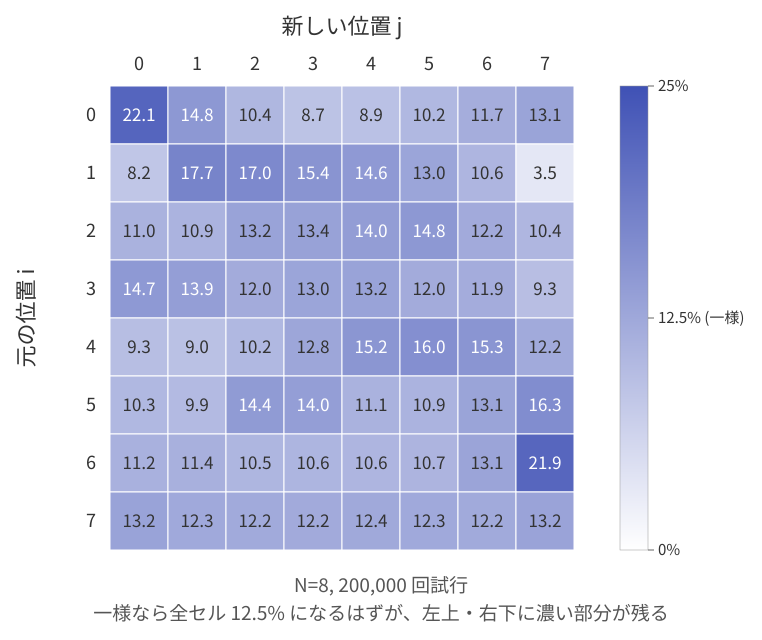

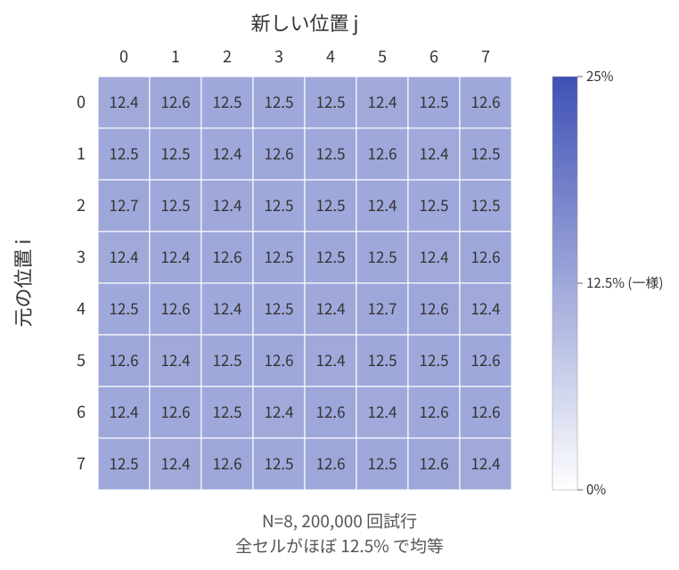

</div>

---

<!-- _class: tight -->

## 付録: なぜ偏るのか (直感)

要素が 3 つのときで考えます。

理想: 並び方は 3! = 6 通り。一様シャッフルなら、6 通りが各 1/6 ≈ 16.7% で出るべきです。

実際: `sort(() => Math.random() - 0.5)` の内部で作れる「比較の答えの組み合わせ」は、比較を 3 回行う実装なら全部で 27 通り (= 3^3) あります。27 通りの結果を 6 通りの並びに割り当てると、27 ÷ 6 = 4 あまり 3。あまりのぶんが偏りとして現れます。

| 並び | 出現確率 |
|---|---|
| 132, 213, 231 | 5/27 ≈ 18.5% |
| 123, 312, 321 | 4/27 ≈ 14.8% |

比較の回数は処理系によって変わるため、上の数値も実装依存です。ただし n^n が n! の倍数にならない限り、要素数を増やしても偏り自体は残ります。

詳しくは → [シャッフルした結果が偏ると相談を受けたときに確認すること (Zenn)](https://zenn.dev/yoheimuta/articles/89e9b85e01fc4f)

---

<!-- _class: tight -->

## 付録: ブラウザが関数を呼ぶ仕組み (イベント駆動)

`script.js` が実行するのは、変数の宣言と `renderBoard()` の呼び出しだけです。それでもクリックするとカードがめくれます。`handleCardClick` を呼んでいるのは誰でしょうか。

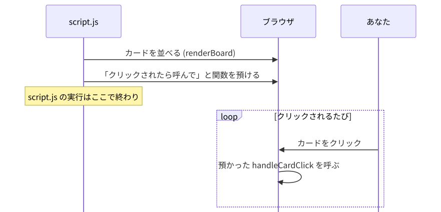

ブラウザです。`addEventListener` で関数を預けると、待つのも呼ぶのもブラウザがやります。この作りをイベント駆動と呼びます。

Chapter 3 の `setTimeout` も同じ形です。きっかけがクリックから時間に変わるだけです。

---

## 付録: setTimeout と setInterval の使い分け

| 関数 | いつ使う | 止め方 |
|---|---|---|
| `setTimeout(fn, ms)` | 一度だけ、少し待ってから実行 (3-3 のミスマッチ) | `clearTimeout(id)` |
| `setInterval(fn, ms)` | 一定間隔で繰り返し実行 (5-3 のタイマー) | `clearInterval(id)` |

どちらも「関数をブラウザに預けて、あとから呼んでもらう」形は同じです。違うのは 1 回きりか、繰り返しかという点だけです。

`setInterval` は `clearInterval` を呼ぶまで止まりません。不要になったら必ず止めます。

---

## 付録: なぜ HTML の `onclick=""` ではないのか

- `element.addEventListener("click", fn)` — JavaScript 側で管理したい (基本これ)
- `<div onclick="...">` — 手軽な確認用のプロトタイプ

`addEventListener` を使う理由:

- HTML と JS の役割を分けられる (責務の分離)
- 同じイベントに複数の関数を付けられる
- 削除も柔軟にできる

<script>
document.querySelectorAll('.timer-box').forEach(box => {
  const el = box.querySelector('.timer');
  const initial = Number(box.dataset.seconds);
  let remain = initial;
  let id = null;

  const render = () => {
    const r = Math.max(remain, 0);
    const m = String(Math.floor(r / 60)).padStart(2, '0');
    const s = String(r % 60).padStart(2, '0');
    el.textContent = `${m}:${s}`;
    el.classList.toggle('warn', remain <= 60 && remain > 0);
    el.classList.toggle('done', remain <= 0);
  };
  const stop = () => { clearInterval(id); id = null; el.classList.remove('running'); };
  const start = () => {
    if (remain <= 0) return;
    el.classList.add('running');
    id = setInterval(() => {
      remain--;
      render();
      if (remain <= 0) stop();
    }, 1000);
  };

  el.addEventListener('click', () => {
    if (remain <= 0) { el.classList.remove('done'); return; }
    id ? stop() : start();
  });
  el.addEventListener('contextmenu', e => {
    e.preventDefault();
    stop();
    remain = initial;
    render();
  });
  box.querySelectorAll('.timer-btn').forEach(btn => {
    btn.addEventListener('click', () => {
      remain = Math.max(0, remain + Number(btn.dataset.delta));
      render();
    });
  });
  render();
});
</script>
