<!-- _class: lead -->

# Webサイト開発勉強会

## オリジナルの自己紹介サイトを作ろう！

---

## 今日のゴール

<div class="big">自分の自己紹介ページを作る</div>

完成するとこんなページができます 👉

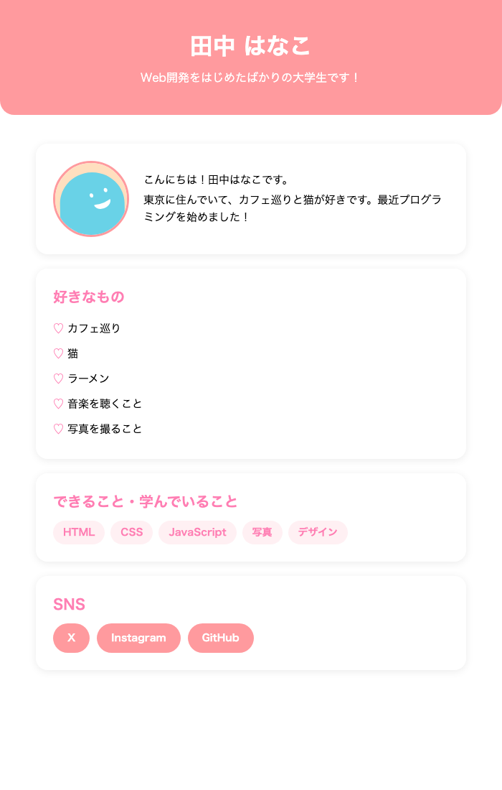

- 名前や写真を載せたページを作れる
- 色や配置を変えて、自分らしく見せられる
- SNS などへのリンクを置ける

---

## 今日の授業が終わるとできること

- HTMLで「ページに何を置くか」を自分で決められる
- CSSで「見やすさ」や「雰囲気」を変えられる
- 1枚の自己紹介ページを自力で作れる

> 今日覚えるのは細かい暗記より、
> 「Webページは自分で作れる」という感覚です。

---

## HTML と CSS で作れるもの

- 自己紹介ページ
- 部活・クラス紹介ページ
- イベント告知ページ
- お店や作品の紹介ページ
- ポートフォリオの最初の1ページ

HTML と CSS だけでも、
**「見る人に伝わる1枚のページ」** は十分作れます。

---

## もくじ

1. **Webページの仕組み** — 開発環境の準備
2. **ページの土台を作ろう** — HTMLの基本構造
3. **ヘッダーを作ろう** — 見出し・テキスト・背景色
4. **プロフィールカードを作ろう** — 画像・横並び・影
5. **好きなものリストを作ろう** — リスト・装飾
6. **スキルバッジを作ろう** — インライン要素・折り返し
7. **SNSリンクを作ろう** — リンク・ボタン風デザイン
8. **応用課題** — ダークモード & もっと
9. **発表会**
10. **まとめ**

---

<!-- _class: lead -->

# Chapter 1

## Webページの仕組み

---

## ふだん見ているWebページの裏側

ブラウザで Web ページを開くと、裏側では **3種類のファイル** が読み込まれています。

```
index.html   ← ページの構造（何があるか）
styles.css   ← 見た目の設定（どう見えるか）
script.js    ← 動きの設定（どう動くか）
```

この3つを書けば、Web ページが作れます。

---

## Webページを構成する3つの言語

| 言語 | 役割 | やること |
|------|------|----------|
| **HTML** | 構造 | ページに「何を置くか」を決める |
| **CSS** | 見た目 | 「どう見えるか」を決める |
| **JavaScript** | 動き | 「どう動くか」を決める |

---

## 例え話: 家を建てる

| | 役割 | 家で言うと |
|---|---|---|
| **HTML** | 構造 | 柱・壁・窓の配置（間取り図） |
| **CSS** | 見た目 | 壁紙の色・カーテン・家具（インテリア） |
| **JavaScript** | 動き | 自動ドア・照明のスイッチ（仕掛け） |

HTMLだけだと **骨組みだけの家**。
CSSを足すと **きれいな家** になる。
JSを足すと **便利な家** になる。

---

## もう少し具体的に

<div class="columns">
<div>

### HTML（構造）

- ページのタイトル
- 写真
- 箇条書きのリスト
- リンク
- ボタン

→ **「何があるか」を定義する**
→ 例えば: 自己紹介、作品紹介、お知らせ一覧

</div>
<div>

### CSS（見た目）

- 背景の色
- 文字の大きさ
- 要素の配置（横並びなど）
- 角を丸くする
- 影をつける

→ **「どう見えるか」を決める**
→ 例えば: かわいい、見やすい、アプリっぽい

</div>
</div>

---

## JavaScript（動き）

- ボタンを押したら色が変わる
- クリックしたら数が増える
- 時間がたったら表示が変わる

→ **「何かが起きたら、何かをする」**

今日は HTML と CSS をメインに使い、時間があれば最後に少しだけ JavaScript を体験します

---

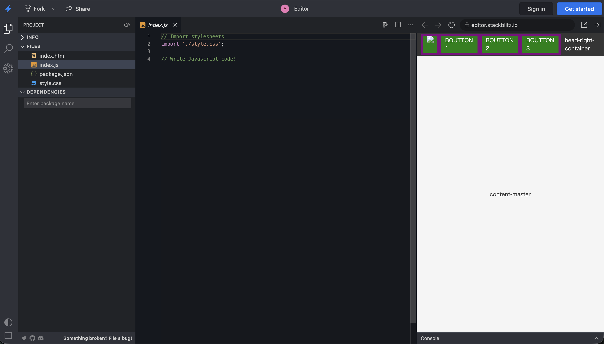

## 開発環境: StackBlitz

今日は **StackBlitz** というWebサービスを使います。

- ブラウザだけで動く
- 左側: コードを書く場所
- 右側: プレビュー（結果がすぐ見える）

> コードを書き換えると、自動で右側の表示が更新されます。

---

## StackBlitz を開こう

1. https://stackblitz.com/edit/web-platform-erj9nbfe をクリック
2. 画面が表示されたら準備完了

### 確認すること

- 左側にファイル一覧が見える
- `index.html`, `styles.css`, `script.js` がある
- 右側にプレビューが表示されている
- コードを変えると **自動で画面が更新される**（ホットリロード）

---

## 今日使うファイル

```
index.html    ← HTMLを書くファイル
styles.css    ← CSSを書くファイル
script.js     ← JSを書くファイル（応用課題で使う）
```

- `index.html` にページの構造を書く
- `styles.css` に見た目を書く

---

<!-- _class: lead -->

# Chapter 2

## ページの土台を作ろう

---

## HTMLの基本構造

`index.html` を開くと、こんなコードが入っています。

```html
<!DOCTYPE html>
<html lang="ja">
  <head>
    <meta charset="UTF-8" />
    <meta name="viewport" content="width=device-width, initial-scale=1.0" />
    <link rel="stylesheet" href="styles.css" />
    <title>自己紹介ページ</title>
  </head>
  <body>
    <!-- ここにコードを記入 -->
    <script src="script.js"></script>
  </body>
</html>
```

---

## 各パーツの意味

最初は **おまじない** だと思ってOKです。
大事なのは **`<body>`と`</body>`の間に書く** ということ。

| コード | 意味 |
|--------|------|
| `<!DOCTYPE html>` | 「これはHTMLです」という宣言 |
| `<head>` | ページの設定 |
| `<link>` | CSSファイルを読み込む |
| `<body>` | **ページの中身**（ここに書いたものが表示される） |

---

<!-- _class: lead -->

# Chapter 3

## ヘッダーを作ろう

---

## このチャプターで作るもの

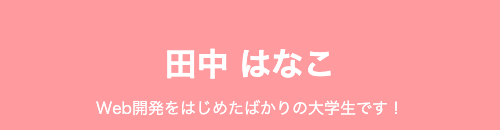

ピンクの背景に、
白い文字で **名前** と **一言メッセージ** を表示するヘッダーを作ります。

### できるようになること
- ページの最初に「何のページか」を伝えられる
- 文字と背景色で第一印象を作れる

---

## コードにする前に、完成画面を部品で見てみよう

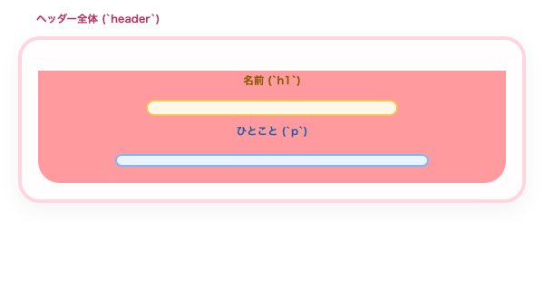

- まず大きなヘッダーを1つ作る
- その中に「名前」と「ひとこと」を入れる
- ヘッダー全体に背景色をつける

---

## HTMLの「タグ」とは

HTMLは **タグ** という目印を使って書きます。

タグをつけることで、ブラウザに **「これは見出しだよ」「これは文章だよ」** と伝えます。

```html
<h1>田中 はなこ</h1>
```

- `<h1>` → 「ここから見出し」（開始タグ）
- `</h1>` → 「見出しここまで」（終了タグ。`/` がつく）

タグで囲まれた部分が、そのタグの種類に応じて表示される。

---

## 今回使うタグ

| タグ | 意味 | 表示 |
|------|------|------|
| `<h1>` | 見出し（一番大きい） | **太く大きい文字** |
| `<p>` | 段落（パラグラフ） | ふつうの文章 |
| `<div>` | グループ化する箱 | 見た目は何もない（CSSで変える） |

`<div>` は **他のタグをまとめるための入れ物** として使います。

> なぜまとめるの？ → まとめることで **CSSをグループ単位で適用** できる。
> 例: ヘッダー全体に背景色をつけたい → `<h1>` と `<p>` を `<div>` でまとめて、その `<div>` に背景色を指定する。

---

<!-- _class: record -->

## ヘッダーのHTML

`index.html` の `<body>` の中に追加します。

```html
<body>
  <div class="header">
    <h1>田中 はなこ</h1>
    <p>Web開発をはじめたばかりの大学生です！</p>
  </div>
  <script src="script.js"></script>
</body>
```

---

## CSSの書き方

次に見た目を整えます。CSSは `styles.css` に書きます。

```css
セレクタ {
  プロパティ: 値;
}
```

```css
body {              ← 「body に対して」
  color: pink;      ← 「文字色を pink にする」
}
```

- **セレクタ** = どの要素に適用するか
- **プロパティ** = 何を変えるか
- **値** = どう変えるか

---

## class属性 — HTMLとCSSを紐づける

```html
<div class="header">
```

↑ この `class="header"` が **名札** の役割。

```css
.header {
  background-color: pink;
}
```

↑ CSSでは `.header` と書くと、class="header" の要素に適用される。

> **class は名札、CSSはその名札を見てスタイルを適用する。**

---

<!-- _class: record -->

## ヘッダーのCSS

`styles.css` に追加：

```css
body {
  /* ページのデフォルト余白をなくす */
  margin: 0;
  padding: 0;
}

.header {
  background-color: pink;       /* 背景色（ピンク） */
  text-align: center;           /* 文字を中央揃え */
  padding: 40px 20px;           /* 内側の余白（上下40px、左右20px） */
  border-radius: 0 0 20px 20px; /* 角を丸くする（左上・右上・右下・左下） */
}
```
> `px` = ピクセル。画面上の点の数で大きさを指定する単位。現実でいうと「cm」や「m」のようなもの。
---

## padding と margin

bodyの余白をなくすために `margin: 0; padding: 0;` と書きましたが、**余白には2種類ある** あります

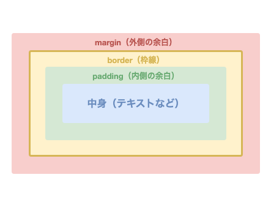

- **padding** = 内側の余白
- **margin** = 外側の余白

> デフォルトでブラウザは `body` に余白をついけていますが、今回は自分で余白をコントロールしたいので、両方とも0にしています。
---

## padding: 内側の余白

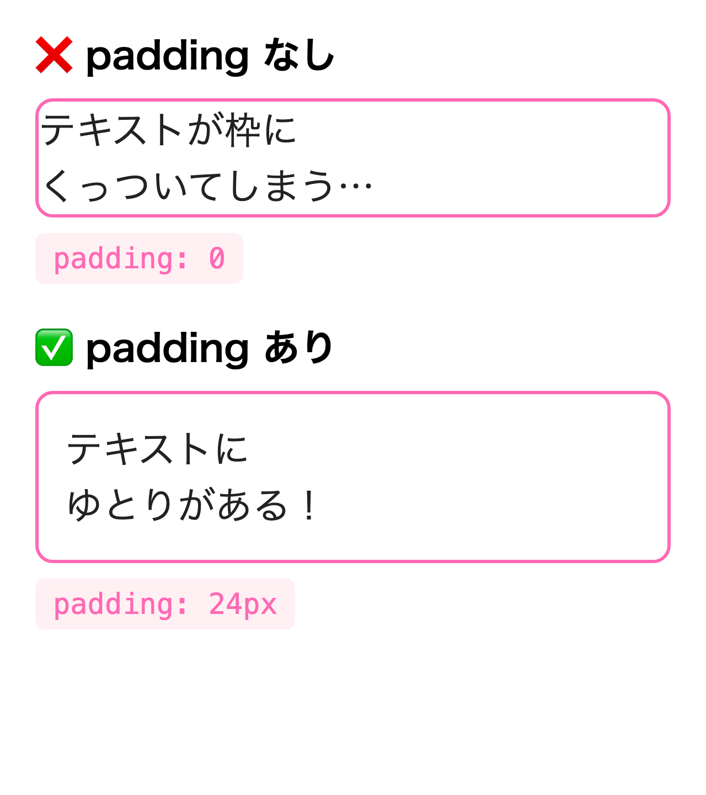

要素の**内側**の余白が **padding**
内側に余白を作ることでテキストが枠にくっつかず、見やすくなります。

---

## margin: 外側の余白

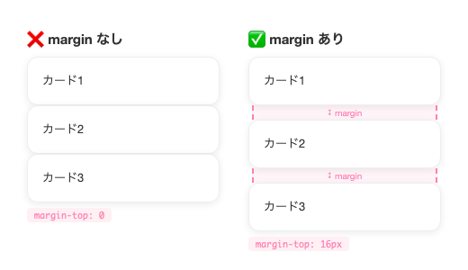

要素の**外側**の余白が **margin**
外側に余白を作ることで、要素同士がくっつかず、見やすくなります。

---

## padding / margin の値の書き方

```css
/* 値が1つ → 上下左右すべて同じ */
padding: 24px;

/* 値が2つ → 上下 / 左右 */
padding: 40px 20px;
/*        ↑上下  ↑左右 */
```

> 値が3つ以上の書き方もありますが、今日は2つまで覚えればOKです。

あとで、`padding` と `margin` を使う場面がたくさん出てくるので、違いを意識してみてください。

---


<!-- _class: record -->

## ヘッダーの文字のCSS

```css
.header h1 {
  margin: 0;
  color: white;
}

.header p {
  margin: 8px 0 0;
  color: white;
}
```

`.header h1` = 「header の中にある h1」という意味。
これで **ヘッダーの中の見出しだけ** にスタイルを当てられる。

---

## ここまでの結果

ブラウザのプレビューを確認してみましょう。

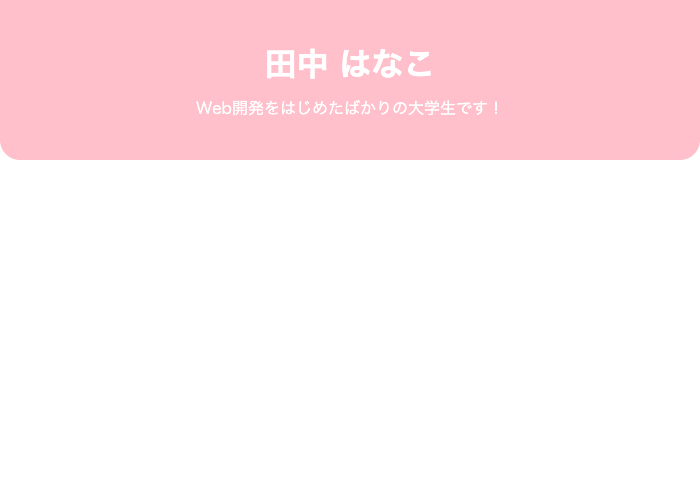

### 今できるようになったこと
- ページのタイトル部分を自分で作れる
- 背景色や文字色で雰囲気を変えられる

> うまく表示されない場合は、タグの閉じ忘れがないか確認してください。

---

<!-- _class: lead -->

# Chapter 4

## プロフィールカードを作ろう

---

## このチャプターで作るもの

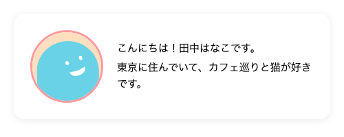

丸い写真と自己紹介テキストを **横並び** で表示するカードを作ります。

### できるようになること
- 「ひとまとまりの情報」をカードとして見やすく置ける
- 写真と文章をセットで紹介できる

---

## コードにする前に、完成画面を部品で見てみよう

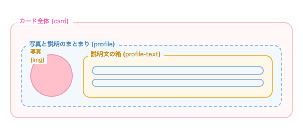

- まず大きなカードを1つ作る
- その中に「写真」と「説明文」を入れる
- 説明文の中に文章を2つ入れる


---

## 新しいタグ: ``

画像を表示するタグ。**終了タグがない** 特殊なタグです。

```html

```

| 属性 | 意味 |
|------|------|
| `src` | 画像ファイルのURL（どの画像を表示するか） |
| `alt` | 画像が読み込めなかった時に表示される代替テキスト |

---

<!-- _class: record -->

## プロフィールのHTML

先ほど書いたヘッダーの下に、新しいカードを追加します。

```html
<div class="card">
  <div class="profile">
    
    <div class="profile-text">
      <p>こんにちは！田中はなこです。</p>
      <p>東京に住んでいて、カフェ巡りと猫が好きです。最近プログラミングを始めました！</p>
    </div>
  </div>
</div>
```

---

<!-- _class: record -->

## カードのCSS

```css
.card {
  background-color: white;    /* 白い背景 */
  border-radius: 16px;        /* 角を丸く */
  padding: 24px;              /* 内側の余白 */
  margin-top: 20px;           /* カード同士の間隔 */
  box-shadow: 0 2px 12px rgba(0, 0, 0, 0.08); /* 影 */
}
```

---

<!-- _class: record -->

## 横並びにする: Flexbox

写真とテキストを **横に並べ** たい。`display: flex` を使います。

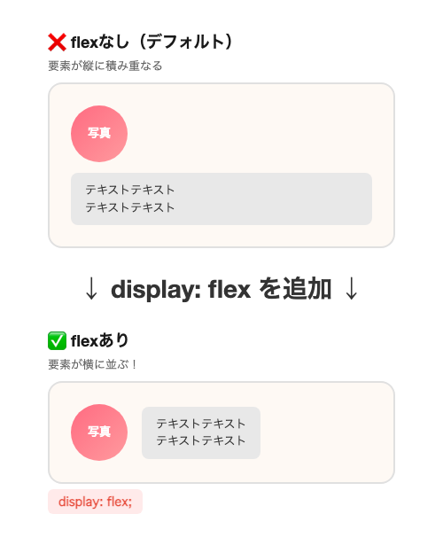

```css
.profile {
  display: flex;
  align-items: center;
  gap: 20px;
}
```

`display: flex` → 子要素が横に並ぶ
`align-items: center` → 縦方向を真ん中に
`gap: 20px` → 要素同士の間隔

---

<!-- _class: record -->

## 写真を丸くする

```css
.profile-img {
  width: 100px;
  height: 100px;
  border-radius: 50%;       /* 50%で正円 */
  object-fit: cover;        /* 枠に合わせてトリミング */
  border: 3px solid pink; /* ピンクの枠線 */
}
```

> `border-radius: 50%` で正方形が **正円** になる。よく使うテクニック。

---

<!-- _class: record -->

## テキストのCSS

```css
.profile-text p {
  margin: 4px 0;
  font-size: 15px;
  line-height: 1.6;
}
```

`line-height: 1.6` = 行間を1.6倍にする。
文章が読みやすくなります。

---

<!-- _class: record -->

## カード全体の幅を制限する

今のままだと、画面全体にカードが広がってしまいます

`index.html` と `styles.css` にそれぞれ追加：

```html
<div class="container">
  <!-- プロフィールカードはこの中に入れる -->
</div>
```

```css
.container {
  max-width: 600px;    /* 横幅を制限 */
  margin: 0 auto;      /* 中央寄せ */
  padding: 20px;       /* 内側の余白 */
}
```

> 今後は、カードはすべてこの `.container` の中に入れていきます。
---

## ここまでの結果

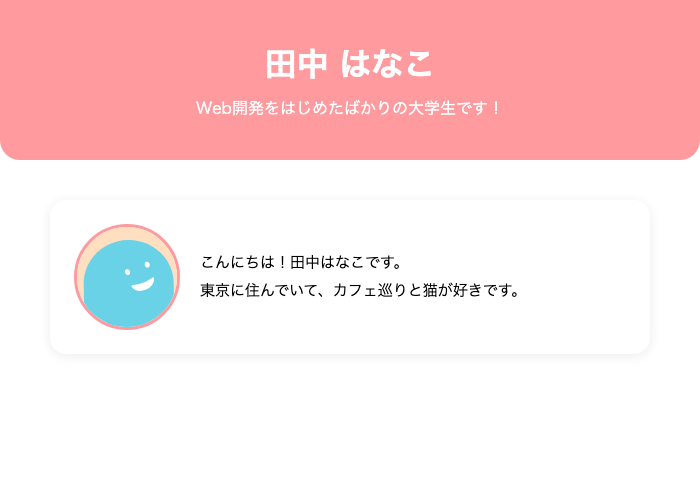

ヘッダー + プロフィールカードが表示されていればOK！

### 今できるようになったこと
- プロフィールや商品紹介のような情報ブロックを作れる
- `display: flex` で画像と文章を横並びにできる

---

<!-- _class: lead -->

# Chapter 5

## 好きなものリストを作ろう

---

## このチャプターで作るもの

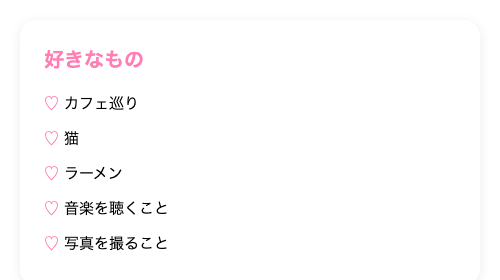

♡マーク付きの **箇条書きリスト** で好きなものを表示します。

CSSの `::before` で装飾をカスタマイズする方法を学びます。

### できるようになること
- 情報を箇条書きで整理して見せられる
- CSSだけでリストの見た目を変えられる

---

## コードにする前に、完成画面を部品で見てみよう

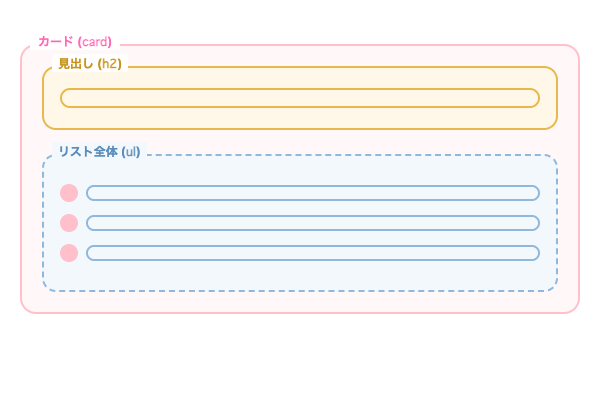

- カードの中に見出しを1つ置く
- その下にリスト全体を置く
- リストの中に項目を1つずつ入れる

---

## 新しいタグ: `<h2>`, `<ul>`, `<li>`

| タグ | 意味 | 表示 |
|------|------|------|
| `<h2>` | 小見出し（h1 の次に大きい） | **太い中サイズ文字** |
| `<ul>` | 順番なしリスト（箇条書き） | ・が付いたリスト |
| `<li>` | リストの各項目 | 1つ1つの項目 |

```html
<ul>         ← リストの開始
  <li>項目1</li>
  <li>項目2</li>
  <li>項目3</li>
</ul>        ← リストの終了
```

---

<!-- _class: record -->

## リストのHTML

`<div class="container">` の中に、新しいカードを追加：

```html
<div class="card">
  <h2>好きなもの</h2>
  <ul class="favorites-list">
    <li>カフェ巡り</li>
    <li>猫</li>
    <li>ラーメン</li>
    <li>音楽を聴くこと</li>
    <li>写真を撮ること</li>
  </ul>
</div>
```

---

<!-- _class: record -->

## 見出しのCSS

```css
.card h2 {
  font-size: 20px;
  margin: 0 0 12px;
  color: hotpink;
}
```

`.card h2` = 「card の中にある h2」にだけ適用。
すべての h2 ではなく、**カード内の見出しだけ** をピンクにします。

---

<!-- _class: record -->

## リストの見た目をカスタマイズ

```css
.favorites-list {
  list-style: none;
  padding: 0;
  margin: 0;
}

.favorites-list li {
  padding: 6px 0;
  font-size: 15px;
}

.favorites-list li::before {
  content: "♡ ";
  color: hotpink;
}
```

---

## ポイント解説

| コード | 意味 |
|--------|------|
| `list-style: none` | デフォルトの黒丸（・）を消す |
| `li::before` | 各 li の **前に** 何かを挿入する |
| `content: "♡ "` | 挿入する中身（ハートマーク） |

`::before` は **疑似要素** と呼ばれるもの。
HTMLを変えずに、CSSだけで飾りを追加できます。

> ♡ の部分を ✨ や ★ に変えても面白いです。

---

## ここまでの結果

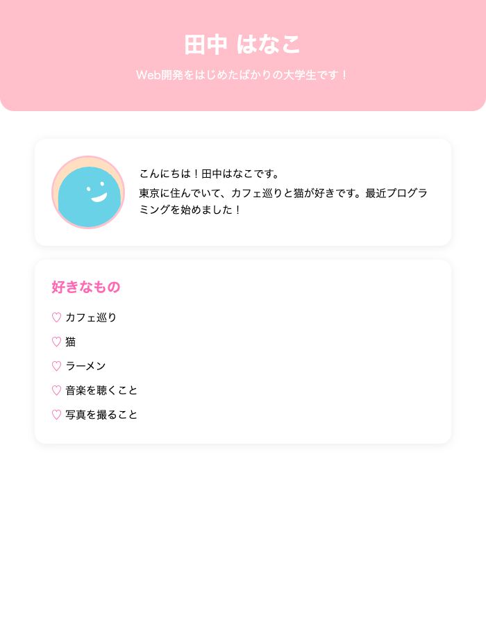

ヘッダー + プロフィール + 好きなものリストが表示されていればOK！

### 今できるようになったこと
- 好きなもの、特徴、ルールなどを見やすく並べられる
- HTMLを増やさなくても CSS で飾りを足せる

---

<!-- _class: lead -->

# Chapter 6

## スキルバッジを作ろう

---

## このチャプターで作るもの

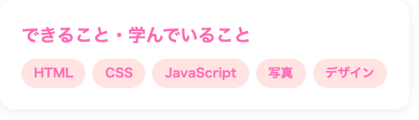

スキルや趣味を **バッジ（タグ）** 風に横並びで表示します。

### できるようになること
- 短いキーワードを見やすく並べられる
- スマホでも崩れにくい並び方を作れる

---

## コードにする前に、完成画面を部品で見てみよう

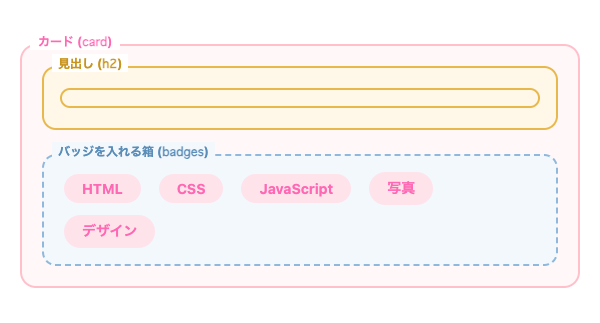

- カードの中に見出しを置く
- その下にバッジを入れる箱を作る
- 小さいラベルをたくさん並べる

---

## 新しいタグ: `<span>`

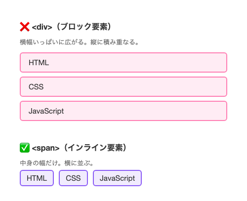

`<span>` は `<div>` と似た入れ物タグ。

違いは **占める領域**。
- `<div>` → 横幅いっぱいに広がる
- `<span>` → 中身の幅だけ

バッジのような小さなラベルには `<span>` が適切。

---

<!-- _class: record -->

## バッジのHTML

```html
<div class="card">
  <h2>できること・学んでいること</h2>
  <div class="badges">
    <span class="badge">HTML</span>
    <span class="badge">CSS</span>
    <span class="badge">JavaScript</span>
    <span class="badge">写真</span>
    <span class="badge">デザイン</span>
  </div>
</div>
```


---

<!-- _class: record -->

## バッジのCSS

```css
.badges {
  display: flex;
  flex-wrap: wrap;
  gap: 8px;
  margin-top: 8px;
}

.badge {
  background-color: mistyrose;
  color: hotpink;
  padding: 6px 14px;
  border-radius: 20px;
  font-size: 14px;
  font-weight: bold;
}
```

`flex-wrap: wrap` → 1行に収まらない場合に **折り返す**

---

## ここまでの結果

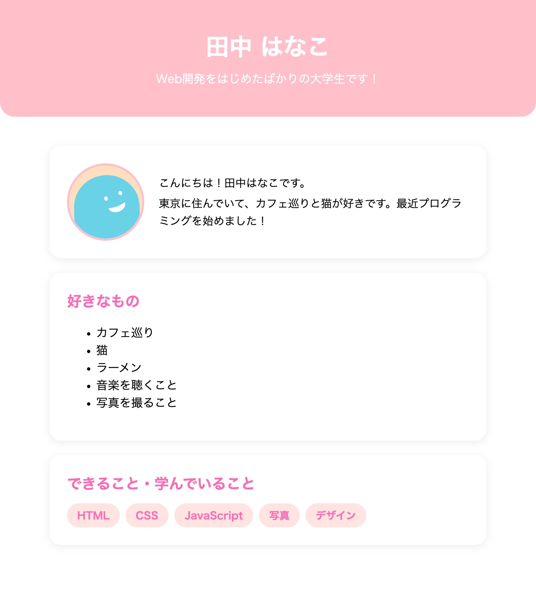

バッジが横並びで表示されていればOK！

### 今できるようになったこと
- スキル、趣味、特徴をタグのように見せられる
- `flex-wrap` で内容が増えても折り返せる

---

<!-- _class: lead -->

# Chapter 7

## SNSリンクを作ろう

---

## このチャプターで作るもの

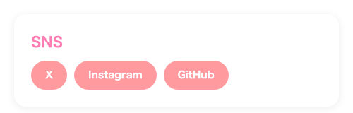

ボタン風の **SNSリンク** を横並びで表示します。

### できるようになること
- 自分のSNSや作品ページへ案内できる
- リンクを「押したくなる見た目」にできる

---

## コードにする前に、完成画面を部品で見てみよう

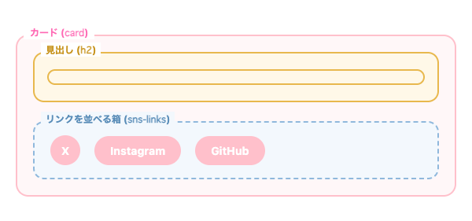

- カードの中に見出しを置く
- その下にリンクを並べる箱を作る
- 1つ1つのリンクをボタン風に見せる

---

<!-- _class: record -->

## リンクのHTML

```html
<div class="card">
  <h2>SNS</h2>
  <div class="sns-links">
    <a href="#" class="sns-link">X</a>
    <a href="#" class="sns-link">Instagram</a>
    <a href="#" class="sns-link">GitHub</a>
  </div>
</div>
```

### `<a>` タグ = リンクを作るタグ

| 属性 | 意味 |
|------|------|
| `href` | リンク先のURL（`#` は仮のリンク） |

`href` に自分のSNSのURLを入れると、本物のリンクになります。

---

<!-- _class: record -->

## ボタン風のデザイン

```css
.sns-links {
  display: flex;
  gap: 10px;
  margin-top: 8px;
}

.sns-link {
  display: inline-block;
  padding: 10px 20px;
  background-color: pink;
  color: white;
  text-decoration: none;
  border-radius: 25px;
  font-size: 14px;
  font-weight: bold;
}
```

---

`text-decoration: none` → リンクの下線を消す

> ブラウザはデフォルトで `<a>` タグに青い文字 + 下線をつけます。
> `text-decoration: none` と `color: white` で、それをリセットしてボタン風に見せています。

---

<!-- _class: record -->

## ホバー効果をつける

```css
.sns-link:hover {
  background-color: hotpink;
}
```

### `:hover` とは？

マウスカーソルを **要素の上に乗せた時** に適用されるスタイル。

→ ボタンの上にマウスを乗せると、色が少し濃いピンクに変わる！

---

## 基礎パート完成！

ここまでで自己紹介ページの土台ができました 🎉


### ここまででできるようになったこと
- 1枚の自己紹介ページを最初から作れる
- 色、余白、角丸、影で見た目を整えられる
- リスト、タグ、リンクで情報を整理して伝えられる

---

### 今日使った HTML タグ
`<h1>` `<h2>` `<p>` `<div>` `` `<ul>` `<li>` `<span>` `<a>`

### 今日使った CSS プロパティ
`background-color` `color` `padding` `margin` `border-radius` `box-shadow` `display: flex` `text-align` `::before` `:hover`

---

<!-- _class: lead -->

# Chapter 8

## 応用課題

---

## 応用課題の進め方

1. **ダークモード切替** — ここで JavaScript を体験します
2. 好きな応用課題を選んで自分のペースで進める
3. わからないことは **メンターに聞いてOK**

---

<!-- _class: lead -->

# ダークモード切替

## JavaScript を使います

---

## ダークモードとは

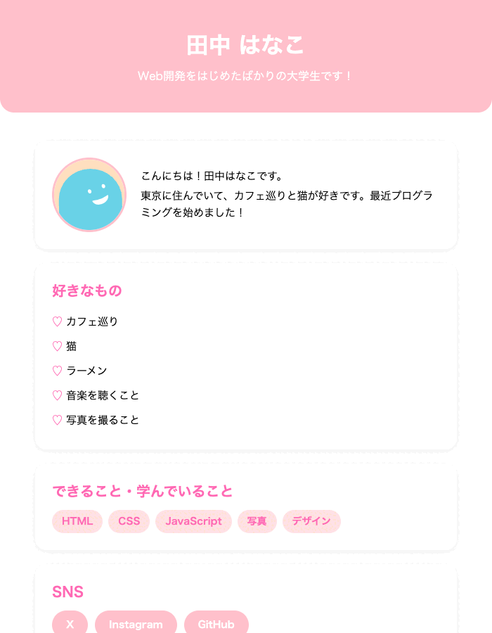

ページの配色を **明るい ↔ 暗い** に切り替える機能。

### なぜダークモードが使われている？

- **目に優しい** — 暗い場所で画面が眩しくない
- **バッテリー節約** — 有機ELディスプレイでは黒が省電力
- **ユーザーの好みに対応** — 多くのアプリ・サイトが標準搭載

> YouTube、X、LINE、GitHub… ほぼすべての有名サービスが対応しています。

---

## ダークモードの作り方

### 流れ

1. **CSS** — 暗い配色のスタイルを追加する
2. **HTML** — 切り替えボタンを追加する
3. **JS** — ボタンを押したらスタイルを切り替える

---

## その前に: CSSでの色の指定方法

これまでは `pink` や `white` のような **色の名前** で色を指定してきました。

ただし色名は約140色しかなく、**ダークモード用の暗い色** は名前で表現できません。

→ より自由に色を指定するために **カラーコード** を使います。

---

## カラーコード（`#` + 6桁の英数字）

```css
background-color: #1a1a2e;
color: #fff;
```

`#` の後に **赤(R)・緑(G)・青(B)** を2桁ずつ指定する。
色名より細かい色が指定できる。

---

## カラーコードの読み方

6桁は **赤・緑・青** の順で、数字が大きいほどその色が強い。

- `#ff0000` → 赤が最大、他が0 → **赤！**
- `#0000ff` → 青が最大 → **青！**
- `#000000` → 全部0 → **黒**
- `#ffffff` → 全部最大 → **白**

> カラーコードは覚えなくてOK。
> ネットで **「カラーピッカー」** と検索すると好きな色を選べます。

---

<!-- _class: record -->

## Step 1: ダークモード用のCSSを`styles.css`に追加

```css
body.dark {
  background-color: #1a1a2e;
  color: #e0e0e0;
}

body.dark .header {
  background-color: #2d2d5e;
}

body.dark .card {
  background-color: #16213e;
  box-shadow: 0 2px 12px rgba(0, 0, 0, 0.3);
}

body.dark .card h2 {
  color: #ffa0c4;
}

body.dark .badge {
  background-color: #2d2d5e;
  color: #e0e0e0;
}

body.dark .sns-link {
  background-color: #2d2d5e;
  color: #e0e0e0;
}

body.dark .sns-link:hover {
  background-color: #3d3d7e;
}
```

---

## `body.dark` って何？

```css
body.dark { ... }
```

これは「body に `dark` というクラスが **ついている時だけ** 適用する」という意味。

```html
<body>           → body.dark のスタイルは適用されない
<body class="dark"> → body.dark のスタイルが適用される
```

JavaScript で **このクラスをつけたり外したり** することで、切り替えを実現します。

---

<!-- _class: record -->

## Step 2: 切り替えボタンのHTML

`index.html` の container の中、一番下に追加：

```html
<button class="dark-mode-btn" id="darkModeBtn">
  🌙 ダークモード
</button>
```

### 新しい要素

| 要素 | 意味 |
|------|------|
| `<button>` | クリックできるボタンを作るタグ |
| `id="darkModeBtn"` | この要素に **ユニーク（唯一の名前）** をつける |

---

## `class` と `id` の違い

| | `class` | `id` |
|---|---------|------|
| 書き方 | `class="card"` | `id="darkModeBtn"` |
| CSS | `.card { }` | `#darkModeBtn { }` |
| 使える数 | 同じ名前を **何個でも** 使える | 1ページに **1つだけ** |
| 用途 | スタイル用（同じ見た目のものに） | JS で特定の要素を見つける用 |

---

<!-- _class: record -->

## ボタンのCSS

```css
.dark-mode-btn {
  display: block;
  margin: 24px auto 40px;
  padding: 10px 24px;
  border: 2px solid #ccc;
  border-radius: 25px;
  background: none;
  font-size: 14px;
  cursor: pointer;
  color: inherit;
  transition: border-color 0.3s;
}

.dark-mode-btn:hover {
  border-color: #ff7eb3;
}
```

---

<!-- _class: record -->

## Step 3: JavaScriptで切り替える

`script.js` に追加：

```js
const darkModeBtn = document.querySelector("#darkModeBtn");

darkModeBtn.addEventListener("click", function() {
  document.body.classList.toggle("dark");

  if (document.body.classList.contains("dark")) {
    darkModeBtn.textContent = "☀️ ライトモード";
  } else {
    darkModeBtn.textContent = "🌙 ダークモード";
  }
});
```

---

## JavaScript を1行ずつ解説（1/3）

```js
const darkModeBtn = document.querySelector("#darkModeBtn");
```

| パーツ | 意味 |
|--------|------|
| `const darkModeBtn` | `darkModeBtn` という名前の **変数**（データを入れる箱）を作る |
| `document.querySelector(...)` | ページの中から要素を **探す** |
| `"#darkModeBtn"` | id が `darkModeBtn` の要素を指定 |

→ 「ページから `#darkModeBtn` ボタンを見つけて、`darkModeBtn` に入れておく」

---

## JavaScript を1行ずつ解説（2/3）

```js
darkModeBtn.addEventListener("click", function() {
  // ここに「クリックされた時にやること」を書く
});
```

| パーツ | 意味 |
|--------|------|
| `addEventListener` | 「○○が起きたら△△する」を登録する |
| `"click"` | 「クリック」というイベント |
| `function() { ... }` | クリックされた時に実行する処理 |

→ 「`darkModeBtn` がクリックされたら、この処理を実行する」

---

## JavaScript を1行ずつ解説（3/3）

```js
document.body.classList.toggle("dark");
```

| パーツ | 意味 |
|--------|------|
| `document.body` | `<body>` 要素 |
| `.classList` | その要素が持つクラスの一覧 |
| `.toggle("dark")` | `dark` クラスがなければ **つける**、あれば **外す** |

→ 「body の dark クラスを ON/OFF する」

---

## 動作確認

ボタンをクリックしてみましょう！

- 1回押す → 背景が暗くなる（ダークモード ON）
- もう1回押す → 元に戻る（ダークモード OFF）

> うまく動かない場合は、ブラウザの開発者ツール（F12）でエラーを確認

---

## その他の応用課題（自走用）

ダークモードが終わった人は好きなものに挑戦！
手順とヒントを読みながら自分のペースで進めてください。
答えは各課題の下のトグルを開くと見られます。

---


## ★ いいねボタン

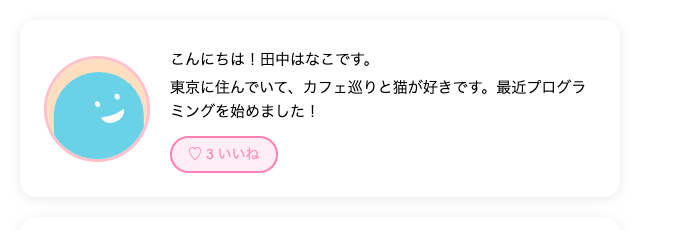

**完成イメージ**: プロフィールカードに ♡ ボタン。押すたびに数字が 1 ずつ増える。

### 手順

1. HTML: プロフィールカード内に `<button id="likeBtn">♡ 0 いいね</button>` を追加
2. CSS: ボタンにピンクの枠線・角丸のスタイルを作る
3. JS: `let likeCount = 0` で数を記録。クリックで +1 して表示を更新

---

### ヒント

- ダークモードで学んだ `querySelector` + `addEventListener` がそのまま使える
- `likeBtn.textContent = "♡ " + likeCount + " いいね"` で表示を書き換え

---


## ★ いいねボタン — 答え

<details><summary>完成コード（クリックで開く）</summary>

```html
<button class="like-btn" id="likeBtn">♡ 0 いいね</button>
```
```css
.like-btn {
  display: inline-block; margin-top: 8px; padding: 6px 16px;
  border: 2px solid #ff7eb3; border-radius: 20px;
  background: none; color: #ff7eb3; font-size: 14px;
  cursor: pointer; transition: all 0.2s;
}
.like-btn:hover { background-color: #ff7eb3; color: #fff; }
.like-btn.liked { background-color: #ff7eb3; color: #fff; }
```
```js
let likeCount = 0;
const likeBtn = document.querySelector("#likeBtn");
likeBtn.addEventListener("click", function() {
  likeCount = likeCount + 1;
  likeBtn.textContent = "♡ " + likeCount + " いいね";
  likeBtn.classList.add("liked");
});
```

</details>

---


## ★ ページ訪問回数

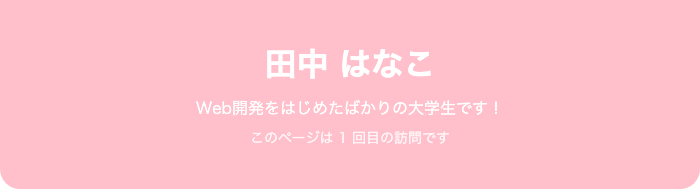

**完成イメージ**: ヘッダーに「このページは N 回目の訪問です」と表示。ブラウザを閉じても回数が残る。

### 手順

1. HTML: ヘッダー内に `<div id="visitCount"></div>` を追加
2. JS: `localStorage.getItem("visitCount")` で前回の値を取得
3. +1 して `localStorage.setItem()` で保存し、画面に表示

---

### ヒント

- `localStorage` はブラウザにデータを保存する仕組み（閉じても消えない）
- 初回は値がないので `null` が返る → `0` からスタート
- `Number()` で文字列を数値に変換する

---

## ★ ページ訪問回数 — 答え

<details><summary>完成コード（クリックで開く）</summary>

```html
<div class="visit-count" id="visitCount"></div>
```
```js
let visits = localStorage.getItem("visitCount");
if (visits === null) { visits = 0; }
visits = Number(visits) + 1;
localStorage.setItem("visitCount", visits);
document.querySelector("#visitCount").textContent = "このページは " + visits + " 回目の訪問です";
```

</details>

---


## ★ 現在時刻の表示

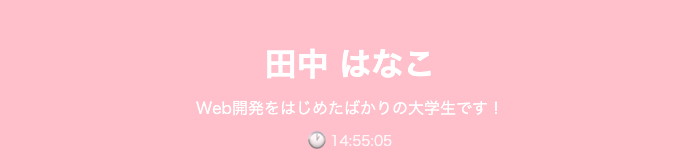

**完成イメージ**: ヘッダーに「🕐 14:32:05」のように現在時刻が表示され、毎秒更新される。

### 手順

1. HTML: ヘッダー内に `<div id="clock"></div>` を追加
2. JS: `new Date()` で現在時刻を取得する関数を作る
3. JS: `setInterval(関数, 1000)` で1秒ごとに関数を呼び出す

---

### ヒント

- `now.getHours()`, `now.getMinutes()`, `now.getSeconds()` で時・分・秒が取れる
- `String(9).padStart(2, "0")` → `"09"` のように0埋めできる

---


## ★ 現在時刻の表示 — 答え

<details><summary>完成コード（クリックで開く）</summary>

```html
<div class="clock" id="clock">now loading...</div>
```
```js
function updateClock() {
  const now = new Date();
  const h = String(now.getHours()).padStart(2, "0");
  const m = String(now.getMinutes()).padStart(2, "0");
  const s = String(now.getSeconds()).padStart(2, "0");
  document.querySelector("#clock").textContent = "🕐 " + h + ":" + m + ":" + s;
}
updateClock();
setInterval(updateClock, 1000);
```

</details>

---


## ★★ タブ切り替え

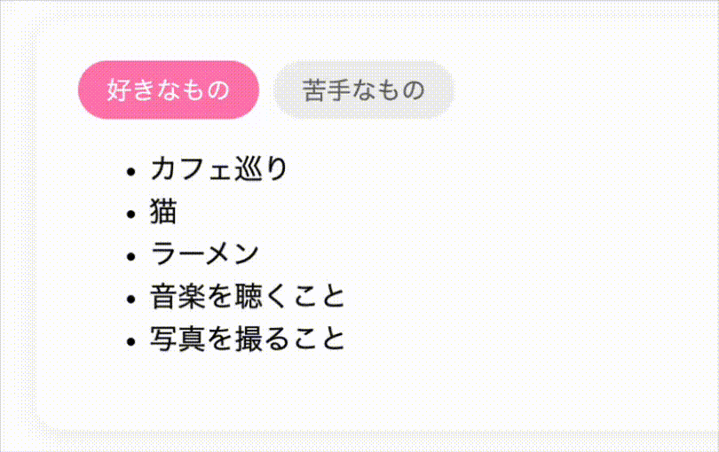

**完成イメージ**: 「好きなもの」カードに2つのタブ。クリックで「好きなもの」と「苦手なもの」の表示が切り替わる。

### 手順

1. HTML: タブボタン2つ + 中身の div を2つ用意（片方は非表示）
2. CSS: `.tab-content { display: none }` + `.tab-content.active { display: block }`
3. JS: タブクリックで全タブを非アクティブにしてから、押されたタブだけアクティブに

---

### ヒント

- ボタンに `data-tab="likes"` のようにデータ属性をつけると、どのタブが押されたか判定できる
- `this.getAttribute("data-tab")` でクリックされたタブの値を取得
- `#tab-likes`, `#tab-dislikes` のように id で中身を切り替える

---


## ★★ タブ切り替え — 答え

<details><summary>完成コード（クリックで開く）</summary>

```html
<div class="tab-header">
  <button class="tab-btn active" data-tab="likes">好きなもの</button>
  <button class="tab-btn" data-tab="dislikes">苦手なもの</button>
</div>
<div class="tab-content active" id="tab-likes">
  <ul class="favorites-list"><li>カフェ巡り</li><li>猫</li><li>ラーメン</li><li>音楽を聴くこと</li><li>写真を撮ること</li></ul>
</div>
<div class="tab-content" id="tab-dislikes">
  <ul class="favorites-list"><li>早起き</li><li>虫</li><li>満員電車</li></ul>
</div>
```
```css
.tab-header { display: flex; gap: 8px; margin-bottom: 12px; }
.tab-btn {
  padding: 6px 16px; border: none; border-radius: 20px;
  background-color: #f0f0f0; color: #666; font-size: 14px;
  cursor: pointer; transition: all 0.2s;
}
.tab-btn.active { background-color: #ff7eb3; color: #fff; }
.tab-content { display: none; }
.tab-content.active { display: block; }
```
```js
const tabBtns = document.querySelectorAll(".tab-btn");
for (let i = 0; i < tabBtns.length; i++) {
  tabBtns[i].addEventListener("click", function() {
    for (let j = 0; j < tabBtns.length; j++) tabBtns[j].classList.remove("active");
    const allTabs = document.querySelectorAll(".tab-content");
    for (let j = 0; j < allTabs.length; j++) allTabs[j].classList.remove("active");
    this.classList.add("active");
    document.querySelector("#tab-" + this.getAttribute("data-tab")).classList.add("active");
  });
}
```

</details>

---


## ★★ 画像スライドショー

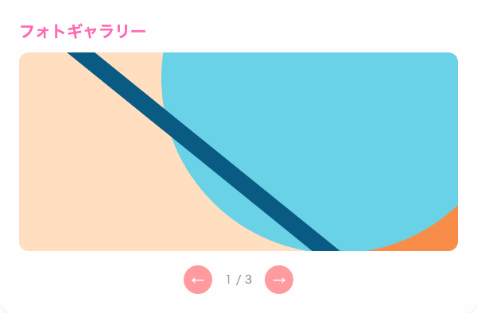

**完成イメージ**: フォトギャラリーに画像1枚 + ← → ボタン。ボタンで画像が切り替わり「1 / 3」と表示。最後の次は最初に戻る。

### 手順

1. HTML: 新しいカードに `` + 前へ/次へボタン + カウンター
2. JS: 画像URLを配列で管理。`let currentPhoto = 0` で今何枚目か記録
3. JS: ボタンクリックでインデックスを変更し、画像の `src` とカウンターを更新

---

### ヒント

- 配列: `const photos = ["url1", "url2", "url3"]`
- `photos[currentPhoto]` で現在の画像URLを取得
- 最後→最初に戻す: `currentPhoto = (currentPhoto + 1) % photos.length`

---


## ★★ 画像スライドショー — 答え

<details><summary>完成コード（クリックで開く）</summary>

```html
<div class="card">
  <h2>フォトギャラリー</h2>
  <div class="slideshow">
    
    <div class="slideshow-controls">
      <button id="prevBtn" class="slideshow-btn">←</button>
      <span id="slideshowCounter" class="slideshow-counter">1 / 3</span>
      <button id="nextBtn" class="slideshow-btn">→</button>
    </div>
  </div>
</div>
```
```css
.slideshow { text-align: center; }
.slideshow-img { width: 100%; max-height: 250px; object-fit: cover; border-radius: 12px; }
.slideshow-controls {
  display: flex; align-items: center; justify-content: center;
  gap: 16px; margin-top: 12px;
}
.slideshow-btn {
  width: 36px; height: 36px; border: none; border-radius: 50%;
  background-color: #ff9a9e; color: #fff; font-size: 16px;
  cursor: pointer; transition: background-color 0.2s;
}
.slideshow-btn:hover { background-color: #ff7eb3; }
.slideshow-counter { font-size: 14px; color: #999; }
```
```js
const photos = [
  "https://api.dicebear.com/7.x/shapes/svg?seed=photo1",
  "https://api.dicebear.com/7.x/shapes/svg?seed=photo2",
  "https://api.dicebear.com/7.x/shapes/svg?seed=photo3"
];
let currentPhoto = 0;
const slideshowImg = document.querySelector("#slideshowImg");
const slideshowCounter = document.querySelector("#slideshowCounter");

function updateSlideshow() {
  slideshowImg.src = photos[currentPhoto];
  slideshowCounter.textContent = (currentPhoto + 1) + " / " + photos.length;
}
document.querySelector("#prevBtn").addEventListener("click", function() {
  currentPhoto = currentPhoto - 1;
  if (currentPhoto < 0) {
    currentPhoto = photos.length - 1;
  }
  updateSlideshow();
});
document.querySelector("#nextBtn").addEventListener("click", function() {
  currentPhoto = currentPhoto + 1;
  if (currentPhoto >= photos.length) {
    currentPhoto = 0;
  }
  updateSlideshow();
});
```

</details>

---


## ★★ カスタムカーソル


**完成イメージ**: マウスカーソルがピンクの丸に変わる。動かすとキラキラしたパーティクルが軌跡に残って消える。

### 手順

1. HTML: `<div class="custom-cursor" id="customCursor"></div>` を追加
2. CSS: 丸いスタイル + `position: fixed` + `pointer-events: none`
3. JS: `mousemove` イベントでカーソル位置を更新。一定間隔でパーティクルを生成→自動削除

---

### ヒント

- `e.clientX`, `e.clientY` でマウス位置が取れる
- パーティクルは `document.createElement("div")` で動的に作り `document.body.appendChild()` で追加
- `setTimeout(function() { particle.remove(); }, 600)` で自動削除
- `@keyframes` でフェードアウトアニメーションを定義

---


## ★★ カスタムカーソル — 答え

<details><summary>完成コード（クリックで開く）</summary>

```css
.custom-cursor {
  position: fixed; width: 20px; height: 20px; border-radius: 50%;
  background-color: #ff7eb3; pointer-events: none; z-index: 9999;
  transform: translate(-50%, -50%); transition: width 0.1s, height 0.1s;
  mix-blend-mode: difference;
}
.cursor-particle {
  position: fixed; width: 8px; height: 8px; border-radius: 50%;
  background-color: #ff9a9e; pointer-events: none; z-index: 9998;
  animation: particle-fade 0.6s ease-out forwards;
}
@keyframes particle-fade {
  0% { opacity: 0.8; transform: translate(-50%, -50%) scale(1); }
  100% { opacity: 0; transform: translate(-50%, -50%) scale(0.2); }
}
```
```js
const cursor = document.querySelector("#customCursor");
let particleCount = 0;
document.addEventListener("mousemove", function(e) {
  cursor.style.left = e.clientX + "px";
  cursor.style.top = e.clientY + "px";
  particleCount++;
  if (particleCount % 3 !== 0) return;
  const particle = document.createElement("div");
  particle.className = "cursor-particle";
  particle.style.left = e.clientX + "px";
  particle.style.top = e.clientY + "px";
  document.body.appendChild(particle);
  setTimeout(function() { particle.remove(); }, 600);
});
```

</details>

---


## ★★★ モーダル（ポップアップ）

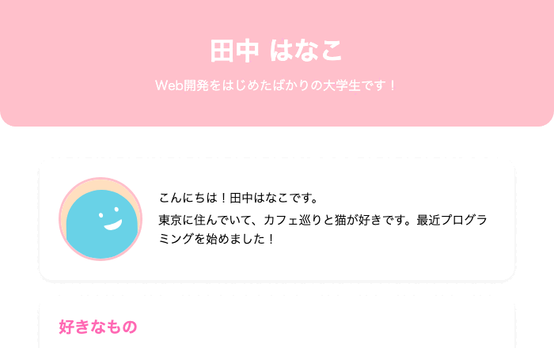

**完成イメージ**: プロフィール写真をクリック → 画面全体が暗くなり写真が拡大表示。暗い部分 or × ボタンで閉じる。

### 手順

1. HTML: オーバーレイ div（暗い背景 + 拡大画像 + 閉じるボタン）を追加
2. CSS: `position: fixed` で画面全体を覆い、`display: none` で初期非表示
3. JS: 写真クリック → `.show` 追加。×クリック or 背景クリック → `.show` 削除

---

### ヒント

- `position: fixed; top: 0; left: 0; width: 100%; height: 100%` で全画面
- 背景は `rgba(0, 0, 0, 0.7)` で半透明の黒
- 背景自体のクリック判定: `if (e.target === modal)` で区別

---


## ★★★ モーダル — 答え

<details><summary>完成コード（クリックで開く）</summary>

```html
<!-- 既存の  に id を追加 -->


<!-- モーダル用のオーバーレイを追加 -->
<div class="modal-overlay" id="modal">
  <div class="modal-content">
    <button class="modal-close" id="modalClose">✕</button>
    
  </div>
</div>
```
```css
.modal-overlay {
  display: none; position: fixed; top: 0; left: 0;
  width: 100%; height: 100%; background: rgba(0,0,0,0.7);
  z-index: 1000; justify-content: center; align-items: center;
}
.modal-overlay.show { display: flex; }
.modal-content { position: relative; max-width: 90%; max-height: 90%; }
.modal-img { max-width: 100%; max-height: 80vh; border-radius: 16px; }
.modal-close {
  position: absolute; top: -12px; right: -12px;
  width: 32px; height: 32px; border: none; border-radius: 50%;
  background-color: #fff; color: #333; font-size: 18px;
  cursor: pointer; box-shadow: 0 2px 8px rgba(0,0,0,0.2);
}
.profile-img { cursor: pointer; transition: transform 0.2s; }
.profile-img:hover { transform: scale(1.05); }
```
```js
const modal = document.querySelector("#modal");
const profileImg = document.querySelector("#profileImg");
const modalClose = document.querySelector("#modalClose");

profileImg.addEventListener("click", function() {
  modal.classList.add("show");
});
modalClose.addEventListener("click", function() {
  modal.classList.remove("show");
});
modal.addEventListener("click", function(e) {
  if (e.target === modal) modal.classList.remove("show");
});
```

</details>

---

## ★★★ ドラッグで並び替え

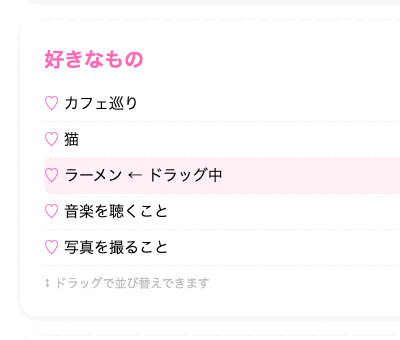

**完成イメージ**: 好きなものリストの項目をドラッグ&ドロップで順番変更。ドラッグ中は半透明、ドロップ先はハイライト。

### 手順

1. HTML: `<ul>` に `id="likesList"` を追加し、各 `<li>` に `draggable="true"` を追加
2. CSS: `.dragging`（半透明）`.drag-over`（ハイライト）を定義
3. JS: `dragstart` / `dragend` / `dragover` / `drop` の4イベントを処理

---

### ヒント

- `e.preventDefault()` を `dragover` と `drop` で呼ぶ（必須）
- `insertBefore()` で DOM 上の順番を入れ替える
- ドラッグ元とドロップ先のインデックスを比較して前後を判定

---

## ★★★ ドラッグで並び替え — 答え

<details><summary>完成コード（クリックで開く）</summary>

```css
.favorites-list li.dragging { opacity: 0.4; }
.favorites-list li.drag-over { background-color: #fff0f3; border-radius: 8px; }
```
```js
const dragList = document.querySelector("#likesList");
let dragItem = null;
dragList.addEventListener("dragstart", function(e) {
  dragItem = e.target; e.target.classList.add("dragging");
});
dragList.addEventListener("dragend", function(e) {
  e.target.classList.remove("dragging");
  const items = dragList.querySelectorAll("li");
  for (let i = 0; i < items.length; i++) items[i].classList.remove("drag-over");
  dragItem = null;
});
dragList.addEventListener("dragover", function(e) {
  e.preventDefault();
  const target = e.target;
  if (target.tagName === "LI" && target !== dragItem) {
    const items = dragList.querySelectorAll("li");
    for (let i = 0; i < items.length; i++) items[i].classList.remove("drag-over");
    target.classList.add("drag-over");
  }
});
dragList.addEventListener("drop", function(e) {
  e.preventDefault();
  const target = e.target;
  if (target.tagName === "LI" && target !== dragItem) {
    const allItems = Array.prototype.slice.call(dragList.querySelectorAll("li"));
    const dragIndex = allItems.indexOf(dragItem);
    const targetIndex = allItems.indexOf(target);
    if (dragIndex < targetIndex)
      dragList.insertBefore(dragItem, target.nextSibling);
    else dragList.insertBefore(dragItem, target);
  }
});
```

</details>

---

## ★★★ ミニクイズゲーム

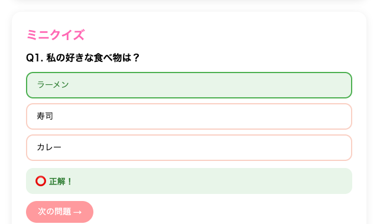

**完成イメージ**: 「私の好きな食べ物は？」などの3択クイズ。正解は緑、不正解は赤。全3問、スコア表示付き。

### 手順

1. HTML: クイズ用カード（質問・選択肢エリア・結果・次へボタン・スコア）を追加
2. JS: クイズデータを配列で定義 `[{ question, options, answer }, ...]`
3. JS: `showQuiz()` でボタンを動的生成。クリックで正解判定→スタイル変更→スコア更新

---

### ヒント

- `document.createElement("button")` でボタンを動的に作れる
- `setAttribute("data-index", i)` でどの選択肢かを記録
- 二重クリック防止に `let quizAnswered = false` フラグを使う

---

## ★★★ ミニクイズゲーム — 答え

<details><summary>完成コード（クリックで開く）</summary>

```html
<div class="card">
  <h2>ミニクイズ</h2>
  <div class="quiz-question" id="quizQuestion"></div>
  <div class="quiz-options" id="quizOptions"></div>
  <div class="quiz-result" id="quizResult"></div>
  <button class="quiz-next" id="quizNext">次の問題 →</button>
  <div class="quiz-score" id="quizScore"></div>
</div>
```
```css
.quiz-question { font-size: 16px; font-weight: bold; margin-bottom: 12px; }
.quiz-options { display: flex; flex-direction: column; gap: 8px; }
.quiz-btn {
  padding: 10px 16px; border: 2px solid #fad0c4; border-radius: 12px;
  background: none; font-size: 14px; cursor: pointer; text-align: left;
  transition: all 0.2s;
}
.quiz-btn:hover { border-color: #ff7eb3; background-color: #fff0f3; }
.quiz-btn.correct { border-color: #4caf50; background-color: #e8f5e9; color: #2e7d32; }
.quiz-btn.wrong { border-color: #ef5350; background-color: #ffebee; color: #c62828; }
.quiz-result {
  margin-top: 12px; padding: 10px 16px; border-radius: 12px;
  font-size: 14px; font-weight: bold; display: none;
}
.quiz-result.show { display: block; }
.quiz-next {
  margin-top: 12px; padding: 8px 20px; border: none; border-radius: 20px;
  background-color: #ff9a9e; color: #fff; font-size: 14px;
  cursor: pointer; display: none;
}
.quiz-next.show { display: inline-block; }
.quiz-score { margin-top: 8px; font-size: 13px; color: #999; }
```
```js
const quizData = [
  { question: "私の好きな食べ物は？", options: ["ラーメン","寿司","カレー"], answer: 0 },
  { question: "私が住んでいるのは？", options: ["大阪","東京","福岡"], answer: 1 },
  { question: "私の好きな動物は？", options: ["犬","うさぎ","猫"], answer: 2 }
];
let currentQuiz = 0, quizCorrect = 0, quizAnswered = false;
function showQuiz() {
  const q = quizData[currentQuiz];
  document.querySelector("#quizQuestion").textContent = "Q" + (currentQuiz+1) + ". " + q.question;
  const optionsDiv = document.querySelector("#quizOptions");
  optionsDiv.innerHTML = ""; quizAnswered = false;
  for (let i = 0; i < q.options.length; i++) {
    const btn = document.createElement("button");
    btn.className = "quiz-btn"; btn.textContent = q.options[i];
    btn.setAttribute("data-index", i);
    btn.addEventListener("click", function() {
      if (quizAnswered) return; quizAnswered = true;
      const selectedIndex = Number(this.getAttribute("data-index"));
      const correct = quizData[currentQuiz].answer;
      if (selectedIndex === correct) {
        this.classList.add("correct"); quizCorrect++;
        document.querySelector("#quizResult").textContent = "⭕ 正解！";
        document.querySelector("#quizResult").style.backgroundColor = "#e8f5e9";
        document.querySelector("#quizResult").style.color = "#2e7d32";
      } else {
        this.classList.add("wrong");
        optionsDiv.querySelectorAll(".quiz-btn")[correct].classList.add("correct");
        document.querySelector("#quizResult").textContent = "❌ 残念！正解は「" + quizData[currentQuiz].options[correct] + "」";
        document.querySelector("#quizResult").style.backgroundColor = "#ffebee";
        document.querySelector("#quizResult").style.color = "#c62828";
      }
      document.querySelector("#quizResult").classList.add("show");
      document.querySelector("#quizScore").textContent = quizCorrect + " / " + (currentQuiz + 1) + " 問正解";
      if (currentQuiz < quizData.length - 1) {
        document.querySelector("#quizNext").classList.add("show");
      } else {
        document.querySelector("#quizScore").textContent = "結果: " + quizCorrect + " / " + quizData.length + " 問正解！";
      }
    });
    optionsDiv.appendChild(btn);
  }
  document.querySelector("#quizResult").classList.remove("show");
  document.querySelector("#quizNext").classList.remove("show");
}
document.querySelector("#quizNext").addEventListener("click",
  function() { currentQuiz++; showQuiz(); });
showQuiz();
```

</details>

---

## デザインのモダン化（上級チャレンジ）

**完成イメージ**: これまで作ったページを、モダンなページに変身させる。


### やること

1. ヒーローセクション — `height: 100vh` + 背景画像 + グラデーションオーバーレイ
2. ダークテーマ — 背景 `#0a0a0a`、文字 `#f5f5f5`
3. Google Fonts — `Inter` フォントの読み込み
4. カード廃止 → セクション + 区切り線レイアウト
5. スクロールアニメーション — `IntersectionObserver` + CSS `transition`

---

### ヒント

- `background: url(...) center/cover no-repeat` で背景画像
- `linear-gradient` を重ねて画像の上にオーバーレイ
- `transform: translateX(-60px)` → `translateX(0)` で横からスライドイン

> 完成版は `examples/demo-modern.html` を参照

---

<!-- _class: lead -->

# Chapter 9

## 発表会

---

## 発表会

今回作成したWebサイトを使用して自己紹介をしてみましょう！

### 発表の内容
- 自分のページを画面に映す
- ページを使って **自己紹介**
- 応用課題をやった人はそれも見せてください
- 「どこを工夫したか」を1つ話せるとさらによいです

---

<!-- _class: lead -->

# Chapter 10

## まとめ

---

## 今日やったこと


### できるようになったこと
- 名前、写真、好きなものを載せたページを作れた
- CSSで色や余白や配置を調整できた
- リンクやボタン風デザインでページを使いやすくできた

### 使った主な道具
- HTML: `h1` `h2` `p` `div` `img` `ul` `li` `span` `a`
- CSS: 背景色・文字色・配置・角丸・影・Flexbox・ホバー効果

---

## 次に作れるもの

| 作れるもの | 使う知識 |
|----------|------|
| **部活紹介ページ** | 見出し・画像・リスト・リンク |
| **作品紹介ページ** | カード・写真・説明文・ボタン |
| **イベント告知ページ** | タイトル・日時・場所・申込みリンク |
| **お店紹介ページ** | 写真・メニュー・地図リンク |
| **ポートフォリオ** | 自己紹介・スキル・SNS・作品リンク |

---

## 次に学ぶとよいこと

| トピック | できること |
|----------|------|
| **レスポンシブ** | スマホ対応のデザインが作れる |
| **JavaScript** | もっと色々な動きをつけられる |
| **Git & GitHub** | コードを保存・公開・共同開発できる |
| **フレームワーク** | React, Vue などで大きなサイトを作れる |
| **デザイン** | もっと見やすく使いやすくできる |

---

<!-- _class: lead -->

# 付録

## もっと詳しく知りたい人向け

---

## `box-shadow` と `rgba()`

```css
box-shadow: 0 2px 12px rgba(0, 0, 0, 0.08);
/*          横  縦  ぼかし  色              */
```

- `0` → 横ずれなし、`2px` → 少し下、`12px` → ふんわりぼかし
- `rgba(0, 0, 0, 0.08)` → 黒の8%の濃さ（ほぼ透明な影）
- `rgba(赤, 緑, 青, 透明度)` — 透明度 `0`=透明 〜 `1`=不透明

---

## `border` の書き方

```css
border: 3px solid pink;
/*      太さ  種類   色   */
```

3つの値をスペース区切りで書く。線の種類は `solid`（実線）、`dashed`（破線）、`dotted`（点線）、`none`（なし）。

---

## padding / margin を開発者ツールで確認

ブラウザの **開発者ツール** で、要素の余白を視覚的に確認できます。

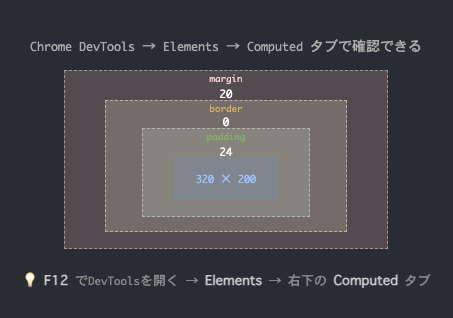

> **F12** でDevToolsを開く → **Elements** → 右下の **Computed** タブ

---

## よく使う HTML タグ一覧

| タグ | 意味 |
|------|------|
| `<h1>` 〜 `<h6>` | 見出し（h1が最大） |
| `<p>` | 段落（文章） |
| `<div>` | ブロックのグループ化 |
| `<span>` | インラインのグループ化 |
| `<a href="URL">` | リンク |
| `` | 画像（終了タグなし） |
| `<ul>`, `<ol>`, `<li>` | リスト |
| `<button>` | ボタン |

> 参考: [MDN HTML要素リファレンス](https://developer.mozilla.org/ja/docs/Web/HTML/Element)

---

## よく使う CSS プロパティ一覧

| プロパティ | 意味 |
|-----------|------|
| `color` | 文字色 |
| `background-color` | 背景色 |
| `font-size` | 文字の大きさ |
| `text-align` | 文字の揃え方（`center` など） |
| `padding` / `margin` | 内側 / 外側の余白 |
| `border` | 枠線（太さ 種類 色） |
| `border-radius` | 角の丸み |
| `display` | 表示方法（`flex`, `block`, `none`） |
| `box-shadow` | 影 |
| `width`, `height` | 幅・高さ |

> 参考: [MDN CSSリファレンス](https://developer.mozilla.org/ja/docs/Web/CSS/Reference)

---

## 参考リンク

- [MDN Web Docs](https://developer.mozilla.org/ja/) — HTML/CSS/JS のリファレンス
- [Can I use](https://caniuse.com/) — ブラウザ対応状況の確認
- [Google カラーピッカー](https://g.co/kgs/HwVnkZs) — カラーコードを選ぶ